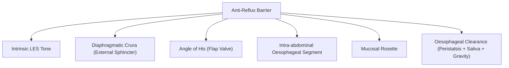
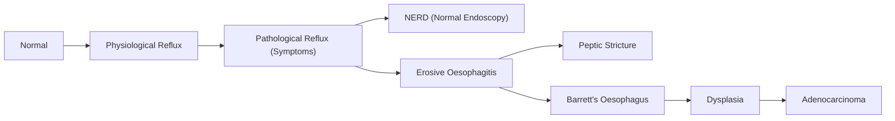
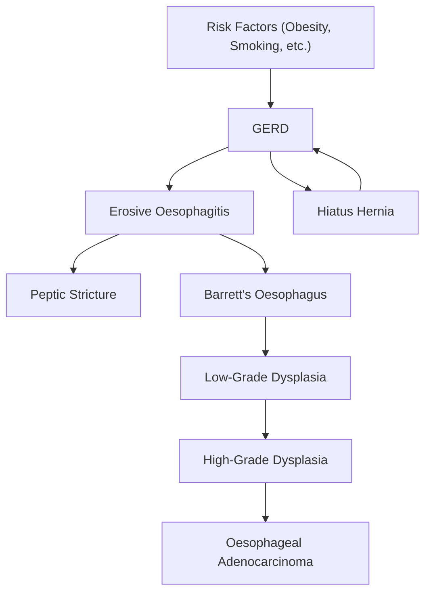

# Gastroesophageal Reflux Disease (GERD)

## Definition

***Gastroesophageal Reflux Disease (GERD) is defined by the Montreal Consensus as a condition that develops when the reflux of stomach contents causes troublesome symptoms and/or complications*** [1][2].

Let's break this down carefully:

- **GERD ≠ reflux.** Everyone refluxes — after a big meal, a small amount of gastric content may transiently enter the distal oesophagus. That is **physiological reflux**: post-prandial, short-lived, asymptomatic, and rarely occurs during sleep [2].
- **Pathological reflux** = symptomatic, causes mucosal injury, often includes nocturnal episodes [2].
- **GERD** is the clinical label applied to patients with symptoms suggestive of reflux or its complications — **but not necessarily with visible oesophageal inflammation** [2].
- **Reflux oesophagitis** is a *subset* of GERD where endoscopy (and histology) confirms actual oesophageal mucosal inflammation [2].

> Think of it this way: GERD is the umbrella diagnosis (symptom-based), and reflux oesophagitis is the endoscopy-confirmed subset. Most GERD patients actually have **no visible mucosal damage** on endoscopy.

---

## Epidemiology

| Feature | Detail |
|:---|:---|
| Global prevalence | ~8–33% of the adult population worldwide; increasing globally |
| Prevalence in Asia | Historically lower (~5–10%) but rising rapidly due to obesity, westernised diet |
| Hong Kong prevalence | ~6–9% (rising trend, particularly in urban populations) |
| Age | Increases with age (peak in 40–60 years); can occur at any age |
| Sex | Slight male predominance for erosive disease and complications (Barrett's, adenocarcinoma); NERD is more equal |
| Socioeconomic trend | Higher prevalence with westernised lifestyle, increased BMI |
| Burden | Most common outpatient GI diagnosis; massive PPI consumption worldwide |

<Callout title="Hong Kong Context">
In Hong Kong, the prevalence of GERD has been steadily increasing over the last two decades, mirroring rising obesity rates and westernised dietary habits. While squamous cell carcinoma still dominates oesophageal cancer in HK, the incidence of adenocarcinoma (arising from Barrett's oesophagus, a GERD complication) is on the rise [2][3].
</Callout>

---

## Risk Factors

Understanding risk factors requires understanding the pathophysiology (covered in detail below). Every risk factor either **(a) lowers LES pressure**, **(b) increases intra-abdominal pressure**, **(c) increases gastric acid/volume**, or **(d) impairs oesophageal clearance**.

| Category | Risk Factor | Mechanism |
|:---|:---|:---|
| **Obesity** | ***Increased BMI*** | ↑ Intra-abdominal pressure → overcomes LES; also promotes hiatus hernia; visceral adiposity releases pro-inflammatory cytokines |
| **Age** | Aging | Loss of LES tone; ↓ oesophageal peristaltic efficiency; ↓ saliva production (less bicarbonate for acid neutralisation) |
| **Pregnancy** | Progesterone + gravid uterus | Progesterone relaxes smooth muscle → ↓ LES tone; gravid uterus → ↑ intra-abdominal pressure [2] |
| **Smoking** | Tobacco | Directly ↓ LES pressure; ↓ saliva production; ↓ oesophageal mucosal defence |
| **Alcohol** | Ethanol | ↓ LES tone; direct mucosal irritant; ↓ oesophageal motility |
| **Dietary factors** | ***Fat, chocolate, coffee, peppermint*** | All relax the LES. Fat also delays gastric emptying → more material available for reflux [2] |
| **Drugs** | ***NSAIDs, aspirin, contraceptives/HRT*** | NSAIDs/aspirin: direct mucosal injury + ↓ prostaglandins → impaired mucosal defence. OCP/HRT: progesterone component ↓ LES tone [2] |
| | Calcium channel blockers, nitrates, anticholinergics, benzodiazepines, theophylline | All ↓ LES tone via smooth muscle relaxation |
| **Hiatus hernia** | Sliding (Type I) hernia | Loss of the extrinsic compression of the diaphragmatic crura on the LES; loss of abdominal-thoracic pressure gradient; loss of angle of His (see Anatomy below) [2][3] |
| **↑ Intra-abdominal pressure** | ***Chronic cough, constipation, heavy lifting, ascites*** | Raises pressure gradient across a potentially incompetent LES [2] |
| **Family history / Genetics** | ***GI diseases in immediate family; genetically predetermined variations in upper GI physiology*** | Suggests heritable component to LES tone, oesophageal motility, and visceral pain sensitivity [2] |
| **Gastroparesis / Delayed emptying** | Diabetes, post-vagotomy | More gastric content → more opportunity for reflux |

<Callout title="High Yield" type="idea">
The most important modifiable risk factors for GERD are **obesity, smoking, alcohol, and dietary triggers**. In Hong Kong clinical practice, weight loss is first-line lifestyle advice.
</Callout>

---

## Anatomy & Function of the Anti-Reflux Barrier

To understand GERD, you must first understand **why we don't all reflux all the time**. The anti-reflux barrier is a multi-component system:

### 1. Lower Oesophageal Sphincter (LES)

- Located at the **gastro-oesophageal junction (GOJ/GEJ)**, approximately 40 cm from the incisors.
- Not a true anatomical sphincter (no distinct sphincter muscle), but a **3–4 cm high-pressure zone** of tonically contracted smooth muscle in the distal oesophagus.
- **Resting LES pressure: ~10–30 mmHg** above intragastric pressure.
- **Normal physiology**: contracted at rest by intrinsic myogenic tone + cholinergic (vagal) excitatory input. **Relaxes only during swallowing** (mediated by inhibitory neurons releasing **NO and VIP** from the myenteric plexus) [2].

### 2. Diaphragmatic Crura (External Sphincter)

- The right crus of the diaphragm forms a **sling** around the distal oesophagus as it passes through the oesophageal hiatus.
- During inspiration, contraction of the crura **squeezes** the oesophagus — this is the **extrinsic sphincter** that augments the LES.
- This is why **hiatus hernia** (where the GOJ slides above the diaphragm) disrupts the anti-reflux mechanism: the crural "pinch" is lost [3].

### 3. Angle of His (Cardiac Angle)

- The **acute angle** at which the oesophagus enters the stomach (normally ~40–60°).
- Creates a **flap-valve** mechanism: as the stomach distends, the fundus presses against the intra-abdominal oesophagus, occluding it.
- In hiatus hernia, this angle becomes obtuse → flap valve lost [2][3].

### 4. Intra-abdominal Oesophageal Segment

- Normally **2–4 cm** of the distal oesophagus lies **below the diaphragm**, within the abdominal cavity.
- Positive intra-abdominal pressure compresses this segment, helping to keep it closed.
- In hiatus hernia, this segment retracts into the negative-pressure thorax → compression lost [3].

### 5. Mucosal Rosette (Gastric Mucosal Folds)

- Folds of gastric mucosa at the GOJ help create a **mucosal plug** that seals the junction.

### 6. Oesophageal Clearance Mechanisms

- **Primary peristalsis** (swallow-triggered) and **secondary peristalsis** (distension-triggered) clear refluxed material.
- **Saliva** (containing bicarbonate) neutralises residual acid.
- **Gravity** assists clearance in the upright position (hence nocturnal reflux is worse).

<Callout title="Why does hiatus hernia cause GERD?">
A sliding hiatus hernia disrupts **three** components simultaneously: (1) the diaphragmatic crural sling is no longer around the LES, (2) the intra-abdominal oesophageal segment is pulled into the thorax (negative pressure instead of positive pressure), and (3) the angle of His becomes obtuse, destroying the flap-valve effect. ***Almost all patients who develop oesophagitis, Barrett's oesophagus, and peptic strictures have a hiatus hernia*** [2][3].
</Callout>

---

## Etiology & Pathophysiology

The fundamental problem in GERD is an **imbalance between aggressive factors (refluxate) and defensive factors (anti-reflux barrier + oesophageal mucosal resistance)**. Let's dissect each mechanism.

### A. Mechanisms of Increased Reflux

#### 1. Abnormalities of the LES [2]

| Abnormality | Explanation |
|:---|:---|
| **↓ Basal LES tone** | Resting pressure < 10 mmHg → tonically weak sphincter; seen in severe GERD with erosive disease |
| ***Transient LES relaxations (tLESRs)*** | **The most common mechanism of reflux in GERD.** These are relaxations of the LES that are NOT triggered by swallowing. They occur via a vagovagal reflex triggered by gastric distension (e.g., post-prandially). In GERD patients, tLESRs occur more frequently and are more likely to be accompanied by acid reflux. |
| Drug-induced LES relaxation | CCBs, nitrates, anticholinergics, theophylline, progesterone → pharmacological ↓ in LES tone |

> **Key concept**: In most GERD patients, the LES resting pressure is actually *normal*. The dominant mechanism is **excessive tLESRs**, not a permanently weak sphincter. This is why patients get intermittent symptoms rather than constant reflux.

#### 2. Hiatus Hernia [2][3]

As described above. The hiatus hernia acts as a **reservoir** — refluxed material trapped in the hernia sac can re-reflux into the oesophagus during swallow-induced LES relaxation (the "re-reflux" phenomenon).

**Types of hiatus hernia** (important for surgical discussion):

| Type | Description |
|:---|:---|
| **Type I (Sliding)** | GOJ slides upward through the hiatus into the thorax. ***Most common (>90%)***. The principal type associated with GERD [3]. |
| **Type II (Paraesophageal/Rolling)** | Fundus herniates through the hiatus, but GOJ remains in normal position. GERD is less common because the GOJ is intact. Risk of **gastric volvulus** and **strangulation** [3]. |
| **Type III (Mixed)** | Both GOJ and fundus herniate — combination of Types I and II [3]. |
| **Type IV** | Herniation of organs other than stomach (e.g., colon, spleen, omentum) through a large hiatal defect [3]. |

#### 3. Increased Intra-Abdominal Pressure [2]

- Obesity, pregnancy, chronic cough, constipation, ascites.
- Raises the pressure gradient across the LES → overcomes sphincter resistance → reflux.

#### 4. Increased Gastric Volume / Acid

- Large meals, gastroparesis, gastric outlet obstruction → ↑ gastric volume → ↑ risk of reflux.
- Zollinger-Ellison syndrome → massive acid hypersecretion.

### B. Mechanisms of Impaired Clearance

#### 1. Defective Oesophageal Peristalsis [2]

- ***Defective oesophageal and gastric peristaltic activity → increased time of exposure to acid*** [2].
- Disorders like scleroderma (fibrosis of oesophageal smooth muscle) severely impair peristalsis → severe GERD.

#### 2. Reduced Saliva Production

- Smoking, Sjögren syndrome, anticholinergic drugs → ↓ saliva → ↓ bicarbonate buffering of residual acid.

#### 3. Supine Position / Nocturnal Reflux

- Gravity no longer assists clearance → prolonged acid contact time.
- Swallowing frequency drops during sleep → less primary peristalsis.

### C. Impaired Mucosal Defence

The oesophageal mucosa (stratified squamous epithelium) is inherently vulnerable to acid because, unlike gastric mucosa, it lacks:
- Mucus-bicarbonate barrier
- Tight intercellular junctions (relative to gastric epithelium)
- Rapid epithelial turnover

When refluxate (containing HCl, pepsin, and potentially bile acids and pancreatic enzymes in duodenogastric reflux) contacts the oesophageal mucosa, it causes:
1. **Acid + pepsin** → protein denaturation, mucosal erosion
2. **Bile acids** (particularly in alkaline/bile reflux) → disrupt cell membranes → inflammation
3. Inflammatory cascade → oesophagitis → ulceration → fibrosis (stricture) → metaplasia (Barrett's)

### D. The GERD Spectrum — From Symptoms to Complications

***The progression is: GERD → Oesophagitis → Ulcer → Stricture → Barrett's oesophagus (10%) → Metaplasia → Adenocarcinoma (0.5%/year risk in Barrett's)*** [3][4].

---

## Classification

### 1. Clinical Classification of GERD [2]

| Category | Description |
|:---|:---|
| ***Non-erosive reflux disease (NERD)*** | **Major category (~60–70% of GERD patients)**. Typical reflux symptoms but **normal oesophageal mucosa on upper endoscopy** [2]. |
| ***Erosive oesophagitis*** | Mucosal breaks/erosions visible on endoscopy. May have local complications: stricture, Barrett's, adenocarcinoma [2]. |
| ***Extra-oesophageal disease*** | Extra-oesophageal manifestations: ***asthma, chronic cough, globus sensation, posterior laryngitis, sleep disorders, non-cardiac chest pain*** [2]. Symptoms may or may not be due to reflux. |

<Callout title="Exam Pearl" type="error">
A common mistake is thinking GERD always means visible oesophageal damage. In fact, the **majority** of GERD patients have NERD — completely normal endoscopy. The diagnosis is clinical (symptoms ± response to PPI trial) or by 24-hour pH monitoring.
</Callout>

### 2. Los Angeles (LA) Classification of Erosive Oesophagitis [2]

This is the **standard endoscopic grading system** for erosive reflux oesophagitis. It grades the severity of mucosal breaks (erosions) seen at OGD.

| Grade | Description | Key Feature |
|:---|:---|:---|
| ***A*** | One or more mucosal breaks, **each ≤ 5 mm** in length, that do not extend between the tops of two mucosal folds | Small, isolated erosions |
| ***B*** | One or more mucosal breaks **> 5 mm** long that do not extend between the tops of two mucosal folds | Longer erosions but still confined |
| ***C*** | One or more mucosal breaks that are **continuous between ≥ 2 mucosal folds** but involve **< 75%** of the oesophageal circumference | Confluent erosions, < 75% circumference [2] |
| ***D*** | One or more mucosal breaks that involve **≥ 75%** of the oesophageal circumference | Near-circumferential/circumferential erosions [2] |

> **Clinical significance**: LA Grades A/B = mild-to-moderate; LA Grades C/D = severe. Severe grades (C/D) are more likely to be associated with complications (stricture, Barrett's) and less likely to respond to lifestyle measures alone.

<Callout title="LA Classification — High Yield for Exams">
Remember the LA classification by mucosal break characteristics:
- **A** = ≤ 5 mm, single fold
- **B** = > 5 mm, single fold
- **C** = Crosses folds, < 75% circumference
- **D** = ≥ 75% circumference

The 2022 Lyon Consensus update considers **LA Grade A** as potentially a normal variant (low specificity for pathological reflux), while **LA Grade C/D** is considered **conclusive evidence** of pathological GERD even without pH testing.
</Callout>

### 3. Relationship Between GERD, Hiatus Hernia, and Oesophagitis [3]

***These three conditions are inter-related but can occur independently*** [3]:
- You can have GERD without hiatus hernia
- You can have hiatus hernia without GERD (especially paraesophageal types)
- You can have oesophagitis from causes other than GERD (e.g., eosinophilic, pill, infectious)

---

## Clinical Features

### A. Symptoms

#### Typical (Oesophageal) Symptoms

| Symptom | Description | Pathophysiological Basis |
|:---|:---|:---|
| ***Heartburn (pyrosis)*** | Retrosternal burning sensation, rising from the epigastrium towards the throat. Worse post-prandially, on lying down, bending forward. Relieved by antacids/PPIs. | Acid and pepsin contact the squamous epithelium of the distal oesophagus → stimulation of chemosensitive nociceptors (TRPV1 receptors) in the oesophageal mucosa → afferent signals via vagus nerve → perceived as burning chest pain. Worsened by supine position because gravity no longer assists clearance. |
| ***Acid regurgitation*** | Perception of flow of refluxed gastric content into the mouth or hypopharynx. Sour/bitter taste. | Large-volume reflux that reaches the proximal oesophagus/hypopharynx. Occurs when LES + upper oesophageal sphincter (UES) are both overcome. Bitter taste = bile (duodenogastric reflux); sour taste = acid. |
| **Dysphagia** | Difficulty swallowing; may be progressive for solids | Multiple mechanisms: (1) Oesophageal dysmotility from chronic inflammation disrupting peristalsis; (2) **Peptic stricture** — chronic oesophagitis → fibrosis → luminal narrowing; (3) **Oesophageal oedema** during acute inflammation; (4) **Barrett's-related stricture**; (5) Must exclude malignancy (adenocarcinoma arising in Barrett's). ***Dysphagia in GERD is an alarm symptom requiring endoscopy*** [1]. |
| **Odynophagia** | Painful swallowing | Indicates severe oesophagitis with ulceration. Acid contacts raw ulcer base → direct stimulation of exposed nociceptors. |
| **Water brash** | Sudden filling of the mouth with clear, slightly salty fluid | A **vagal reflex**: oesophageal acid stimulation → vagal afferents → salivary nuclei → massive salivary hypersecretion. This is actually a *protective* reflex to neutralise acid with salivary bicarbonate, but patients find it distressing. |
| **Epigastric pain** | Burning/gnawing pain in the epigastrium | Overlap with peptic ulcer disease. Acid irritation of the distal oesophageal and gastric cardia mucosa. |
| **Belching (eructation)** | Excessive burping | Aerophagia (swallowing air due to frequent swallowing in response to reflux) + tLESRs that vent gas. |
| **Nausea** | Feeling of sickness | Vagal afferent stimulation from oesophageal/gastric mucosal irritation → nausea centre in the medulla. |

#### Atypical / Extra-Oesophageal Symptoms

These are critically important because they may be the *presenting complaint* with no typical heartburn:

| Symptom | Pathophysiological Basis |
|:---|:---|
| ***Chronic cough*** | Two mechanisms: (1) **Microaspiration** — refluxate reaches the larynx/tracheobronchial tree → vagal-mediated cough reflex; (2) **Oesophago-bronchial reflex** — distal oesophageal acid → vagal afferents → reflex bronchospasm and cough without aspiration [2]. |
| ***Asthma / Wheezing*** | Same mechanisms as chronic cough. Reflux-induced bronchospasm via vagal reflex arc. GERD is found in ~50–80% of asthmatics. Note: asthma medications (theophylline, β-agonists) can also worsen reflux by ↓ LES tone. |
| ***Posterior laryngitis (laryngopharyngeal reflux, LPR)*** | Acid and pepsin directly contact the laryngeal mucosa → inflammation of posterior larynx (interarytenoid region, vocal processes). Laryngeal epithelium is far more sensitive to acid than oesophageal epithelium (damage occurs at pH < 5 vs pH < 2 for oesophagus). Presents as hoarseness, voice fatigue, throat clearing [2]. |
| ***Globus sensation*** | Persistent sensation of a "lump in the throat" without actual obstruction. Thought to be due to upper oesophageal sphincter (UES) hypertonia or cricopharyngeal spasm triggered by distal oesophageal acid exposure via vagal reflex [2]. |
| ***Non-cardiac chest pain*** | Oesophageal nociceptors share spinal segments (T1–T6) with cardiac afferents → referred pain is indistinguishable from angina. GERD is the **most common oesophageal cause of non-cardiac chest pain** [2]. |
| ***Dental erosions*** | Chronic acid exposure to dental enamel (particularly lingual surfaces of upper teeth) → erosion. Seen in severe reflux. |
| ***Sleep disturbance*** | Nocturnal reflux → repeated micro-arousals → poor sleep quality. Also, obstructive sleep apnoea generates large negative intrathoracic pressures → promotes reflux (bidirectional relationship) [2]. |
| **Recurrent otitis media / sinusitis** | Nasopharyngeal reflux (especially in children) → eustachian tube inflammation. |

<Callout title="Extra-Oesophageal GERD — Exam Trap" type="error">
Do NOT diagnose extra-oesophageal GERD without concomitant typical symptoms (heartburn/regurgitation) or objective evidence of reflux (pH monitoring). Many of these symptoms (cough, asthma, hoarseness) have multiple other causes, and treating GERD empirically has low yield if typical symptoms are absent.
</Callout>

#### Alarm Symptoms ("Red Flags") — Must Trigger Urgent Investigation

These suggest complications (stricture, Barrett's, malignancy) or alternative diagnoses:

| Alarm Feature | Concern |
|:---|:---|
| ***Dysphagia*** | Stricture, malignancy |
| ***Odynophagia*** | Severe ulceration, malignancy |
| ***Weight loss*** | Malignancy |
| ***Anaemia / GI bleeding (haematemesis/melaena)*** | Erosive oesophagitis with ulceration, oesophageal/gastric malignancy |
| ***Recurrent vomiting*** | Stricture, gastric outlet obstruction |
| ***Epigastric mass*** | Gastric cancer |
| ***Age > 55 with new-onset symptoms*** | Higher risk of malignancy |
| ***Family history of upper GI cancer*** | Higher risk of malignancy |

> ***Any patient with alarm symptoms requires urgent OGD*** [1][4].

### B. Signs

GERD is largely a **symptom-based diagnosis**. Physical examination is usually **unremarkable**. However, look for:

| Sign | Pathophysiological Basis |
|:---|:---|
| **Epigastric tenderness** | Mucosal inflammation at the GOJ/gastric cardia |
| **Dental erosions** (lingual surface of upper incisors) | Chronic acid exposure |
| **Laryngeal signs** (on laryngoscopy): posterior laryngeal erythema, oedema, vocal cord granulomas | Acid/pepsin damage to laryngeal mucosa (LPR) |
| **Pharyngeal erythema** | Acid exposure |
| **Signs of complications**: pallor (anaemia from chronic blood loss), cachexia (malignancy), palpable supraclavicular lymph node (Virchow's node — left supraclavicular, suggests advanced oesophageal/gastric malignancy) | Late-stage complications |
| **Wheezing on auscultation** | Reflux-triggered bronchospasm (oesophago-bronchial reflex) |
| **Signs of obesity** (↑ BMI, central adiposity) | Identifies the key modifiable risk factor |

<Callout title="Physical Exam in GERD — Mostly Normal">
The main role of the physical exam in GERD is to **exclude red flag signs** (cachexia, lymphadenopathy, anaemia, epigastric mass) that point to malignancy or complications, rather than to confirm the diagnosis of GERD itself.
</Callout>

---

## Barrett's Oesophagus — As It Relates to GERD

Since Barrett's oesophagus is the key pre-malignant complication of GERD, a focused summary is essential here:

- ***Definition: Intestinal metaplasia of the oesophageal stratified squamous epithelium to columnar epithelium with mucus-secreting goblet cells, as an adaptation to long-term acid reflux*** [3][4].
- **Why does this happen?** Chronic acid exposure damages the squamous epithelium → during regeneration, stem cells differentiate into columnar (intestinal-type) epithelium, which is more resistant to acid. This is an **adaptive but pre-malignant** change.
- ***The metaplastic sequence: Normal squamous epithelium → Columnar metaplasia (Barrett's) → Low-grade dysplasia → High-grade dysplasia → Adenocarcinoma*** [3][4].
- ***Risk of adenocarcinoma: ~0.5% per year in Barrett's*** [4].
- ***H. pylori infection is a protective factor*** for Barrett's/oesophageal adenocarcinoma — because H. pylori causes parietal cell atrophy → ↓ acid production → less reflux damage [4].
- **Classification**: ***Classic (≥ 3 cm) vs Short-segment (< 3 cm)*** [4]. Graded by the ***Prague C&M classification*** (C = circumferential extent, M = maximal extent) [4].

---

## Relationship Between GERD, Hiatus Hernia, and Oesophageal Cancer

This is an important conceptual chain for exams:

***Oesophageal adenocarcinoma mostly arises from a region of Barrett's metaplasia, which is due to GERD*** [1][2].

| Feature | SCC (Upper 2/3) | Adenocarcinoma (Lower 1/3) |
|:---|:---|:---|
| Location | Upper and middle oesophagus | Distal oesophagus / GOJ |
| Risk factors | ***Smoking, alcohol, hot drinks, nitrosamines***; achalasia; Plummer-Vinson; corrosive injury | ***GERD, Barrett's oesophagus***, obesity, smoking |
| Most common in HK | ***SCC is most common in HK (90%)*** [1][3] | More common in Western countries; rising in HK |
| Precursor | Squamous dysplasia | Barrett's metaplasia → dysplasia |

---

## Neonatal/Paediatric GERD — Special Considerations [5]

From the neonatal surgery slides, a few relevant points:

- Physiological GER is **extremely common** in neonates and infants (immature LES, liquid diet, supine position, short intra-abdominal oesophagus).
- **Most resolve by 12–18 months** as the child grows and the LES matures.
- Pathological GERD in neonates may present with: failure to thrive, feeding refusal, recurrent aspiration pneumonia, apparent life-threatening events (ALTE), Sandifer syndrome (dystonic posturing with reflux).
- ***Relevant congenital conditions associated with GERD***: oesophageal atresia (post-repair), diaphragmatic hernia.

---

## Summary of Pathophysiological Mechanisms

| Mechanism Category | Specific Abnormality | Result |
|:---|:---|:---|
| **↓ LES competence** | ↓ Basal LES tone, excessive tLESRs, drug-induced LES relaxation | Reflux of gastric contents into oesophagus |
| **Anatomical disruption** | Hiatus hernia (loss of crural sling, angle of His, intra-abdominal segment) | Loss of extrinsic anti-reflux mechanisms |
| **↑ Intra-abdominal pressure** | Obesity, pregnancy, ascites, chronic cough, constipation | Pressure overcomes LES resistance |
| **↑ Gastric volume/acid** | Large meals, gastroparesis, GOO, Zollinger-Ellison | More refluxate available |
| **↓ Oesophageal clearance** | Impaired peristalsis, ↓ saliva, supine position | Prolonged acid contact time |
| **↓ Mucosal defence** | Squamous epithelium vulnerability, NSAIDs | Greater mucosal damage per unit of acid exposure |

---

<Callout title="High Yield Summary">

**Definition**: GERD = troublesome symptoms and/or complications from reflux of gastric contents (Montreal definition). GERD ≠ oesophagitis (most have NERD — normal endoscopy).

**Key Risk Factors**: Obesity (most important modifiable), hiatus hernia, smoking, alcohol, dietary triggers (fat, chocolate, coffee), drugs (NSAIDs, CCBs, progesterone), pregnancy, ↑ intra-abdominal pressure.

**Pathophysiology**: The dominant mechanism is **transient LES relaxations (tLESRs)**, NOT permanent LES weakness. Hiatus hernia disrupts multiple anti-reflux mechanisms simultaneously.

**Classification**: NERD (60–70%) > Erosive oesophagitis > Extra-oesophageal disease. LA classification (A–D) grades erosive disease.

**Clinical Features**:
- Typical: Heartburn + acid regurgitation (cardinal symptoms)
- Atypical: Chronic cough, asthma, laryngitis, globus, non-cardiac chest pain
- Alarm features (dysphagia, weight loss, anaemia, GI bleeding, age > 55 new onset) → urgent OGD

**Complication Chain**: GERD → Oesophagitis → Stricture → Barrett's (intestinal metaplasia) → Dysplasia → Adenocarcinoma (0.5%/year risk in Barrett's).

**Barrett's**: Columnar metaplasia with goblet cells replacing squamous epithelium. Prague C&M classification. H. pylori is protective.

**HK Focus**: SCC still most common oesophageal cancer in HK (90%), but adenocarcinoma (from GERD/Barrett's) is rising.

</Callout>

---

<ActiveRecallQuiz
  title="Active Recall - GERD: Definition, Epidemiology, Pathophysiology & Clinical Features"
  items={[
    {
      question: "What is the most common mechanism of reflux in GERD patients — is it a permanently low LES tone or something else? Explain.",
      markscheme: "Transient lower oesophageal sphincter relaxations (tLESRs) — non-swallow-related LES relaxations triggered by gastric distension via a vagovagal reflex. Most GERD patients have normal baseline LES pressure; tLESRs are the dominant mechanism.",
    },
    {
      question: "Name the components of the anti-reflux barrier and explain why a sliding hiatus hernia disrupts it.",
      markscheme: "Components: (1) Intrinsic LES tone, (2) Diaphragmatic crura (extrinsic sphincter), (3) Angle of His (flap valve), (4) Intra-abdominal oesophageal segment, (5) Mucosal rosette. Sliding hiatus hernia disrupts: crural sling lost (GOJ above diaphragm), angle of His becomes obtuse, intra-abdominal segment pulled into negative-pressure thorax.",
    },
    {
      question: "Describe the LA classification of erosive oesophagitis (Grades A through D).",
      markscheme: "A: mucosal break ≤ 5 mm, confined to single fold. B: mucosal break > 5 mm, confined to single fold. C: mucosal breaks continuous between ≥ 2 folds, < 75% circumference. D: mucosal breaks ≥ 75% circumference.",
    },
    {
      question: "A patient with longstanding GERD is found to have Barrett's oesophagus. What is Barrett's, what is the cancer risk, and what is the metaplastic sequence?",
      markscheme: "Barrett's = intestinal metaplasia — replacement of squamous epithelium with columnar epithelium containing goblet cells, due to chronic acid exposure. Cancer risk ~0.5% per year. Sequence: normal squamous epithelium → columnar metaplasia (Barrett's) → low-grade dysplasia → high-grade dysplasia → adenocarcinoma.",
    },
    {
      question: "Explain the two mechanisms by which GERD causes chronic cough and asthma.",
      markscheme: "(1) Microaspiration — refluxate reaches larynx/tracheobronchial tree causing direct irritation and vagal-mediated cough reflex. (2) Oesophago-bronchial reflex — distal oesophageal acid stimulates vagal afferents causing reflex bronchospasm/cough without aspiration.",
    },
    {
      question: "List 5 alarm features in a patient with GERD symptoms that mandate urgent upper endoscopy.",
      markscheme: "Any 5 of: dysphagia, odynophagia, unintentional weight loss, GI bleeding (haematemesis/melaena), anaemia, recurrent vomiting, epigastric mass, age > 55 with new-onset symptoms, family history of upper GI cancer.",
    },
  ]}
/>

---

## References

[1] Lecture slides: GC 189. I can't swallow oesophageal cancer.pdf
[2] Senior notes: felixlai.md (GERD section, pp. 349–351)
[3] Senior notes: maxim.md (GERD, Barrett's oesophagus, Hiatal hernia sections, pp. 57–60)
[4] Senior notes: maxim.md (Barrett's oesophagus section, p. 57); felixlai.md (Barrett's oesophagus section, p. 365)
[5] Lecture slides: Neonatal Surgery.pdf
