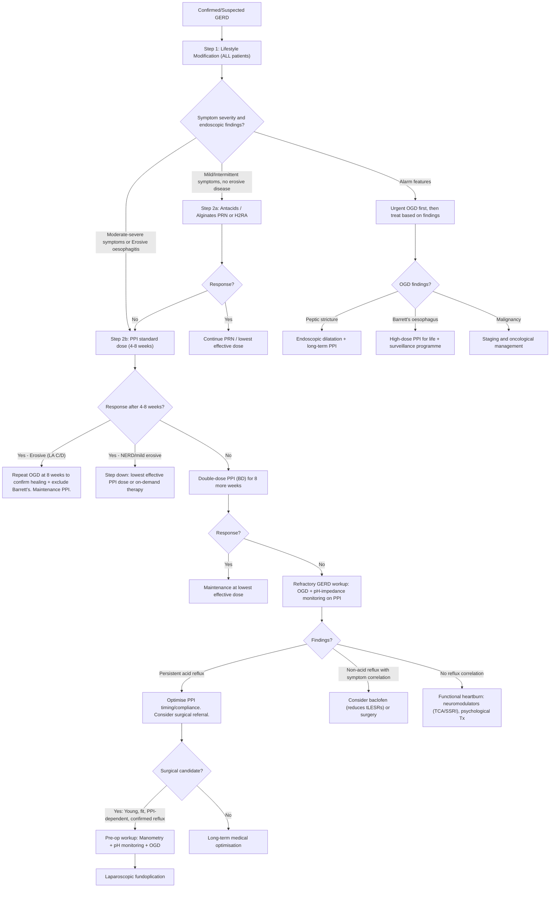

## Management of GERD

### Management Philosophy — First Principles

GERD management follows a **stepwise, escalating approach**. The logic is simple:

1. **Reduce the aggressor** (acid) — lifestyle, antacids, H2RAs, PPIs
2. **Fix the barrier** (anti-reflux mechanism) — surgery, endoscopic procedures
3. **Treat the complications** (stricture, Barrett's) — endoscopic/surgical

The critical concept to grasp is that ***PPIs only change acidic reflux into non-acidic reflux (change the pH) but do NOT prevent reflux itself*** [13]. They relieve heartburn and heal oesophagitis by reducing acidity, but ***regurgitation usually remains uncorrected since the reflux mechanism is not affected — this requires anti-reflux surgery*** [13]. This distinction is the key to understanding when to escalate from medical to surgical management.

---

### Overall Management Algorithm

---

### Step 1: Lifestyle Modification (ALL Patients)

Lifestyle measures should be recommended to **every GERD patient**, regardless of severity. They are the foundation — even if a patient needs PPIs, lifestyle changes improve outcomes.

| Measure | Mechanism | Evidence Level |
|:---|:---|:---|
| ***Weight loss*** | ↓ Intra-abdominal pressure → ↓ pressure gradient across LES; ↓ visceral adiposity → ↓ pro-inflammatory mediators | **Strongest evidence** of all lifestyle measures; even modest weight loss (5–10%) improves symptoms significantly |
| ***Elevation of bed head (15–20 cm)*** | Gravity assists oesophageal clearance during sleep → ***improves nocturnal symptoms*** [6] | Head of bed elevation (not just extra pillows — the whole bed head must be raised, e.g., with blocks or a wedge pillow) |
| ***Avoidance of late meals (eating > 2–3 hours before bedtime)*** [6][13] | Allows gastric emptying before supine position → less nocturnal reflux | Moderate evidence |
| ***Dietary modifications*** | Specific foods relax LES or stimulate acid: ***low-fat diet, avoidance of chocolate, spicy food, coffee*** [6] | Variable evidence; patient-specific triggers should be identified |
| ***Smoking cessation*** [6] | Smoking ↓ LES pressure, ↓ saliva production, ↓ mucosal defence | Moderate evidence |
| ***Avoid alcohol*** [6] | Alcohol ↓ LES tone, direct mucosal irritant, ↓ oesophageal motility | Moderate evidence |
| ***Eat small, frequent meals*** [13] | Large meals → gastric distension → more tLESRs → more reflux | Moderate evidence |
| ***Avoidance of tight belts, corsets*** [6] | ↑ External abdominal pressure → ↑ intra-abdominal pressure → reflux | Weak evidence but logical |
| **Avoid lying down after meals** | Same principle as bed elevation — gravity assists clearance | Moderate evidence |

<Callout title="Lifestyle Measures — Important for Exams" type="idea">
Always mention lifestyle modification first in any GERD management answer. The three highest-yield measures are: **weight loss**, **bed head elevation**, and **avoiding late meals**. Examiners want to see that you don't jump straight to PPIs.
</Callout>

---

### Step 2: Medical Treatment

#### A. Antacids

| Feature | Detail |
|:---|:---|
| **Mechanism** | ***Neutralisation of acid*** — direct chemical reaction (e.g., Mg(OH)₂ + 2HCl → MgCl₂ + 2H₂O) [6] |
| **Examples** | Aluminium hydroxide, magnesium hydroxide (often combined: Maalox, Gaviscon) |
| **Role** | Rapid but short-lived symptom relief (minutes to ~1 hour). No healing of oesophagitis. |
| **Indications** | Mild, intermittent symptoms; on-demand use for breakthrough symptoms alongside PPI |
| **Side effects** | Al(OH)₃ → constipation (aluminium "clogs"); Mg(OH)₂ → diarrhoea (magnesium = "moves") |

**Alginates** (e.g., Gaviscon Advance): form a "raft" of alginate gel on top of the gastric pool, creating a physical barrier that prevents reflux. Particularly useful for post-prandial symptoms and nocturnal reflux (the "acid pocket" concept — a pool of unbuffered acid sits on top of the meal near the GOJ; alginate displaces this pocket).

---

#### B. H₂-Receptor Antagonists (H2RAs)

"H₂" = histamine receptor subtype 2 (on parietal cells). "Antagonist" = blocker.

| Feature | Detail |
|:---|:---|
| **Mechanism** | ***↓ Gastric acid secretion*** by competitive blockade of histamine H₂ receptors on parietal cells → ↓ basal and meal-stimulated acid output [6] |
| **Examples** | ***Cimetidine, famotidine*** [13] (ranitidine withdrawn globally in 2020 due to NDMA contamination) |
| **Efficacy** | ***Symptomatic benefits*** [6]; inferior to PPIs for healing erosive oesophagitis (healing rate ~50% vs 80–90% for PPIs) |
| **Indications** | ***Mild (LA Grade A–B) oesophagitis; Non-erosive GERD (NERD)*** [13]; nocturnal acid breakthrough (bedtime H2RA added to daytime PPI) |
| **Key limitation** | ***Regular use leads to tolerance and loss of therapeutic effects → should be used intermittently only*** [13] |
| **Side effects** | Generally well-tolerated. Cimetidine: anti-androgenic effects (gynaecomastia, impotence), CYP450 inhibitor (drug interactions). Famotidine is preferred. |

> **Why do H2RAs cause tolerance but PPIs don't?** H2RAs block only one of three stimulatory pathways to the parietal cell (histamine). When histamine is chronically blocked, the parietal cell upregulates the other two pathways (gastrin and acetylcholine) — leading to tachyphylaxis. PPIs, in contrast, irreversibly block the final common pathway (the H⁺/K⁺-ATPase proton pump itself), so compensatory upregulation cannot bypass the block.

---

#### C. Proton Pump Inhibitors (PPIs) — The Mainstay of GERD Treatment

PPIs are the **most effective medical therapy** for GERD. Let's understand them from the molecule up.

**Name breakdown**: "Proton pump" = the H⁺/K⁺-ATPase enzyme on the apical membrane of parietal cells; "inhibitor" = blocks it irreversibly.

| Feature | Detail |
|:---|:---|
| **Mechanism** | Irreversibly bind and inhibit the H⁺/K⁺-ATPase proton pump — the **final common pathway** of gastric acid secretion. This is downstream of all three stimulatory inputs (histamine, gastrin, acetylcholine), making PPIs more effective than H2RAs. |
| **Examples** | ***Omeprazole, esomeprazole, lansoprazole, pantoprazole, rabeprazole, dexlansoprazole*** [6][13] |
| **Activation** | PPIs are **prodrugs** — they are inactive at neutral pH. They are absorbed in the small intestine, enter the bloodstream, concentrate in the acidic canaliculi of active parietal cells (pH ~1), and are protonated there → converted to the active sulfenamide form → covalently binds to the proton pump. |
| **Dosing timing** | ***ALL PPIs except dexlansoprazole should be administered 30 min–1 hour BEFORE meals to ensure maximal efficacy*** [13]. Why? Because the pump must be actively secreting acid to be exposed to the drug. Meals stimulate parietal cell activity → more pumps on the surface → more targets. Dexlansoprazole has a dual delayed-release formulation. |
| **Efficacy** | Healing rate of erosive oesophagitis: 80–90% at 8 weeks (vs ~50% for H2RAs). Superior for both symptom relief and mucosal healing. ***Especially for patients with erosive oesophagitis — provides optimal initial healing and long-term maintenance therapy*** [6]. |

**PPI Indications in GERD** [13]:

| Indication | Regimen |
|:---|:---|
| ***Mild oesophagitis (LA Grade A–B)*** | Standard dose OD (e.g., omeprazole 20 mg OD or esomeprazole 40 mg OD) × 4–8 weeks |
| ***Severe oesophagitis (LA Grade C–D)*** | Standard or double dose × 8 weeks → repeat OGD to confirm healing → long-term maintenance (often indefinite) |
| ***NERD*** | Standard dose OD × 4–8 weeks; can step down to on-demand or lowest effective dose |
| ***Barrett's oesophagus*** | ***High-dose PPI for life*** [4] — to reduce ongoing acid injury and potentially slow dysplasia progression |
| **Extra-oesophageal GERD** | Double dose (BD) × 8–12 weeks trial (longer trial needed because extra-oesophageal symptoms respond more slowly than typical symptoms) |
| **Pre-operative** | Heal oesophagitis before anti-reflux surgery to reduce inflammation and improve surgical field |

**Step-down strategy after initial healing:**

- ***NERD / LA Grade A–B***: Step down to lowest effective dose → on-demand therapy (take PPI only when symptomatic) → aim for eventual discontinuation if possible
- ***LA Grade C–D***: Usually need **long-term maintenance** (high relapse rate ~80% if PPI stopped)
- ***Barrett's***: Indefinite PPI regardless of symptom status

**Long-term PPI adverse effects** (important to know, but risk is generally low and should not deter use when indicated):

| Adverse Effect | Mechanism | Clinical Significance |
|:---|:---|:---|
| **↓ Calcium absorption → osteoporosis/fractures** | Acid aids calcium dissolution; chronic acid suppression → ↓ Ca²⁺ absorption | Modest increase in hip fracture risk with > 1 year use. Ensure adequate calcium/vitamin D intake. |
| **↓ Magnesium absorption → hypomagnesaemia** | Impaired active intestinal Mg transport | Can cause muscle cramps, arrhythmias. Monitor Mg in long-term users. |
| **↑ Risk of *C. difficile* colitis** | Acid is a defence barrier against ingested bacteria; suppression allows colonisation | Particularly relevant in hospitalised/elderly patients |
| **↑ Risk of community-acquired pneumonia** | Gastric acid kills aspirated bacteria; suppression → ↑ bacterial burden in refluxate | Small absolute risk increase |
| **↓ Iron/B12 absorption** | Acid-dependent absorption of non-haem iron and B12 | Monitor in long-term users; rarely clinically significant |
| **Fundic gland polyps** | Acid suppression → ↑ gastrin → parietal cell hyperplasia → benign fundic gland polyps | Benign and reversible on PPI cessation |
| **Kidney disease (AIN)** | Idiosyncratic acute interstitial nephritis | Rare; monitor renal function |
| **Rebound acid hypersecretion** | Chronic acid suppression → compensatory ↑ gastrin → when PPI stopped, hypergastrinaemia drives acid oversecretion → symptom rebound | Taper PPIs gradually (step down over 2–4 weeks) rather than abrupt cessation |

<Callout title="Why Long-Term PPI Use Motivates Surgery" type="idea">
***Young and fit PPI-dependent patients*** are ideal surgical candidates — ***so as to avoid long-term use of PPI*** [3]. A successful fundoplication means PPI independence, eliminating decades of potential adverse effects and drug costs. ***PPI independence rate after fundoplication is ~60%*** [3].
</Callout>

---

#### D. Adjunctive Medical Agents

| Agent | Mechanism | Role in GERD |
|:---|:---|:---|
| **Prokinetics (metoclopramide, domperidone)** | D₂-receptor antagonists → ↑ gastric motility, accelerate gastric emptying, ↑ LES tone | Limited role; used as adjunct in patients with associated gastroparesis or significant regurgitation. Side effects limit use (metoclopramide: extrapyramidal effects, tardive dyskinesia; domperidone: QT prolongation). |
| **Baclofen** | GABA-B agonist → ↓ transient LES relaxations (tLESRs) | Useful in **refractory GERD** with confirmed non-acid reflux (tLESRs still occur on PPI). Side effects: drowsiness, dizziness limit use. |
| **Sucralfate** | Forms a protective barrier over ulcerated mucosa (binds to positively charged proteins in ulcer base) | Limited role; occasionally used in pregnancy (not absorbed systemically) |
| **Neuromodulators (low-dose TCA, SSRI)** | ↓ Visceral hypersensitivity via central pain modulation | For **functional heartburn** and **reflux hypersensitivity** (normal pH monitoring, no structural disease) — these are NOT true GERD |

---

### Step 3: Surgical Treatment

When medical therapy is insufficient or undesirable long-term, surgery addresses the **root cause** of GERD — the incompetent anti-reflux barrier — rather than just suppressing acid.

#### Indications for Anti-Reflux Surgery [3][6][13]

| Indication | Rationale |
|:---|:---|
| ***Young and fit PPI-dependent patients*** | ***To avoid long-term PPI use*** [3] |
| ***Failure to respond to long-term medical maintenance therapy*** [6] | Very rare; if truly refractory, first **consider alternative diagnosis** [3] |
| ***Presented with severe regurgitation*** [6] | ***PPIs do not correct the reflux mechanism — regurgitation persists*** [13]. Surgery mechanically restores the anti-reflux barrier. |
| ***Barrett's oesophagus*** [6] | Controversial — surgery may reduce reflux exposure, but whether it prevents cancer progression is debated. Current consensus: consider if young, fit, and PPI-dependent with Barrett's. |
| ***GERD/complications unresponsive to medical treatment*** [3] | Very rare; important to confirm GERD objectively before surgery |
| **Large hiatus hernia with GERD** | Anatomical repair + anti-reflux procedure addresses both problems |
| **Volume regurgitation causing aspiration** | PPIs don't reduce volume of refluxate; surgery does |

***Contraindication: Aperistalsis → risk of dysphagia*** [3]. If manometry shows absent oesophageal peristalsis (e.g., scleroderma, end-stage achalasia), a tight fundoplication will trap food above it since there is no peristalsis to push food through → severe dysphagia.

#### Pre-Operative Workup (Mandatory) [3]

***Pre-op: oesophageal manometry, 24h ambulatory pH monitoring, OGD × biopsy*** [3].

| Test | Purpose |
|:---|:---|
| ***Oesophageal manometry*** | Exclude achalasia; assess peristalsis (determines type of wrap); locate LES for pH probe |
| ***24h pH monitoring*** | Objective confirmation of pathological reflux — do not operate without this |
| ***OGD + biopsy*** | Assess mucosal status; grade oesophagitis; detect Barrett's; exclude malignancy |

#### Laparoscopic Fundoplication — The Standard Surgical Approach [3]

**Principle**: Wrap the gastric fundus around the distal oesophagus to create a **valve effect** that augments LES pressure. The name "fundoplication" = fundus + plication (folding).

***Goals of fundoplication*** [3]:
1. ***Close the hiatal defect*** (cruroplasty — suture the diaphragmatic crura back together)
2. ***Restore the pressure around the LES and angle of His***
3. ***Lengthen the intra-abdominal part of the oesophagus*** (pull the GOJ back below the diaphragm)

**Types of Fundoplication:**

| Type | Wrap | Characteristics | Indication |
|:---|:---|:---|:---|
| ***Nissen*** | ***360° (total)*** | ***More durable anti-reflux effect, but more dysphagia*** [3] | Standard choice when peristalsis is normal |
| ***Toupet*** | ***Posterior 270° (partial)*** | Less dysphagia than Nissen; ***preferred in Chinese patients — less dysphagia*** [3] | Impaired peristalsis (but not absent); patient preference; HK practice often favours partial wraps |
| ***Dor / Watson*** | ***Anterior 90° or 180° (partial)*** | Least anti-reflux effect but least dysphagia | ***Used in Heller's myotomy for achalasia*** [3] (Heller-Dor procedure) — provides mild anti-reflux protection without compressing the myotomy site |

> **Why is the partial wrap preferred in Chinese patients?** Chinese patients tend to have smaller body habitus and narrower hiatus. A full 360° wrap in a smaller frame is more likely to cause significant post-operative dysphagia. Practically, ***partial (Toupet) fundoplication is preferred in Chinese — less dysphagia*** [3].

#### Complications of Fundoplication [3]

| Complication | Mechanism | Management |
|:---|:---|:---|
| ***Gas bloat syndrome (90%, especially Nissen)*** | The improved anti-reflux mechanism prevents belching and vomiting → gas trapped in stomach → bloating, inability to burp or vomit, excessive flatulence. ***Self-limiting in 4 weeks*** [3]. | Reassurance; dietary advice (eat slowly, avoid carbonated drinks); resolves spontaneously |
| ***Dysphagia (50% early post-op, 10% long-term)*** | ***Wrap is too tight*** → mechanical obstruction of the oesophageal lumen [3] | ***Ix: Water-soluble contrast swallow*** [3]. ***Tx: Endoscopic bougie/balloon dilatation; if persistent, revise fundoplication*** [3] |
| ***Recurrence of reflux*** | ***Wrap is too loose*** → inadequate augmentation of LES pressure [3] | Redo surgery or long-term PPI |
| ***Surgical emphysema*** | ***Gas absorbed in mediastinum*** during laparoscopic dissection around the hiatus [3] | Usually self-limiting; monitor |
| ***Perforation → mediastinitis*** | Iatrogenic oesophageal or gastric perforation during dissection [3] | Urgent surgical repair |
| ***Slipped Nissen*** | ***Wrap slides down, GOJ retracts into chest*** [3] → wrap is no longer around the GOJ → dysphagia + reflux | Redo surgery |

***Efficacy: PPI independence rate ~60%*** [3]. This means ~40% of patients may still need some PPI use post-operatively — patients should be counselled about this.

<Callout title="Surgical Complications — Exam Favourites" type="error">
The three most commonly asked complications of fundoplication are: **(1) Gas bloat syndrome** (inability to burp/vomit — very common, self-limiting), **(2) Post-op dysphagia** (too tight — investigate with water-soluble contrast swallow), and **(3) Slipped Nissen** (wrap slides down — recurrent reflux + dysphagia). Know the investigation and management for each.
</Callout>

---

#### Endoscopic Anti-Reflux Procedures (Emerging) [3]

These are newer, less invasive alternatives to surgery. Currently considered ***emerging treatment options*** [3]:

| Procedure | Mechanism | Status |
|:---|:---|:---|
| ***Radiofrequency ablation (RFA) of LES (Stretta procedure)*** | ***Induces LES hypertrophy*** via thermal energy delivery to the LES muscle → thickened, stronger LES [3] | Moderate evidence; reduces PPI use but less durable than surgery |
| ***Transoral incisionless fundoplication (TIF)*** | ***Targets EGJ*** — creates a partial fundoplication endoscopically using a device (EsophyX) introduced through the mouth [3] | Avoids abdominal incisions; suitable for small hiatus hernia; less durable than laparoscopic fundoplication |
| **Magnetic sphincter augmentation (LINX device)** | A ring of magnetic titanium beads placed laparoscopically around the LES; resting magnetic attraction keeps the LES closed, but swallowing force opens it | Growing evidence; good for moderate GERD; contraindicated in patients needing MRI; not yet widely available in HK |

---

### Step 4: Management of Specific Complications

#### A. Peptic Stricture

| Aspect | Detail |
|:---|:---|
| **Pathophysiology** | Chronic oesophagitis → transmural inflammation → fibrosis → luminal narrowing (usually distal oesophagus) |
| **Presentation** | Progressive solid-food dysphagia in a patient with longstanding GERD |
| **Management** | ***OGD with endoscopic dilatation*** (bougie or balloon) + ***long-term PPI*** to prevent recurrence. Multiple sessions may be needed. Always biopsy to exclude malignancy. |

#### B. Barrett's Oesophagus — Surveillance and Treatment [4]

| Dysplasia Status | Management |
|:---|:---|
| ***No dysplasia*** | ***High-dose PPI for life*** + endoscopic surveillance: ***OGD + biopsy Q3–5y (Q3y if ≥ 3 cm, Q5y if < 3 cm)*** [4] |
| ***Low-grade dysplasia*** | ***OGD at 6 months × 2, then Q1y if negative; or endoscopic treatment*** [4] |
| ***High-grade dysplasia*** | ***Intense surveillance (Q3 months); or endoscopic treatment (e.g., EMR/ESD/RFA) — advised*** [4] |
| **Intramucosal carcinoma (T1a)** | Endoscopic mucosal resection (EMR) or endoscopic submucosal dissection (ESD) — oesophageal preservation |
| **Submucosal invasion (T1b) or beyond** | Oesophagectomy with lymph node dissection |

<Callout title="Barrett's Surveillance — Know the Intervals">
The exam loves these numbers. **No dysplasia**: Q3–5 years depending on segment length. **LGD**: confirm, then Q6 months × 2, then Q1 year OR treat endoscopically. **HGD**: Q3 months OR (preferably) endoscopic ablation/resection. ***Seattle protocol***: biopsy every 1–2 cm in 4 quadrants [4].
</Callout>

#### C. Oesophageal Bleeding from Erosive Oesophagitis

- Usually **self-limiting** and responds to PPI therapy
- Rarely requires endoscopic haemostasis (unlike peptic ulcer bleeding)
- ***IV PPI infusion (pantoprazole/esomeprazole 80 mg stat, then 8 mg/h for 72 hours)*** is indicated when significant ulcer bleeding is identified at endoscopy — the higher pH stabilises the clot since platelet function depends on normal pH [14][15]
- For massive bleeding unresponsive to PPI: OGD with ***dual therapy (adrenaline injection + heater probe or clips)*** [14][15]

---

### Management of Hiatus Hernia (as it relates to GERD) [3]

| Type | Management |
|:---|:---|
| ***Sliding hernia (Type I) — Conservative*** | ***Weight loss, smoking cessation, reduce alcohol intake. Treat GERD: PPI*** [3] |
| ***Rolling/Paraesophageal (Type II–IV) — Surgical*** | ***Hernia repair + Nissen fundoplication. Indicated if symptomatic despite max medical treatment OR rolling type (increased risk of gastric volvulus)*** [3] |
| **Emergency presentation (volvulus, strangulation, perforation)** | ***NG tube decompression + emergency open/laparoscopic surgery*** [3] |

---

### Special Situations

#### GERD in Pregnancy

- **First-line**: Lifestyle modification + antacids/alginates (safe)
- **Second-line**: Sucralfate (not absorbed; safe)
- **Third-line**: H2RAs (famotidine — category B; generally considered safe)
- **PPIs**: Omeprazole is category C but widely used when needed (benefits generally outweigh risks). Lansoprazole and esomeprazole have less safety data.
- **Avoid**: Misoprostol (prostaglandin analogue — causes uterine contractions → contraindicated)

#### Refractory GERD

When symptoms persist despite double-dose PPI:
1. **Confirm compliance and timing** (30–60 min before meals)
2. **Confirm the diagnosis** — OGD + pH-impedance monitoring on PPI
3. **Consider**: functional heartburn, eosinophilic oesophagitis, bile reflux, achalasia
4. If confirmed reflux: **baclofen** (↓ tLESRs) or **surgical referral**
5. If functional heartburn: **neuromodulators** (low-dose TCA e.g., amitriptyline 10–25 mg nocte; or SSRI)

---

### Summary Table — Medical vs Surgical Management

| Feature | Medical (PPI) | Surgical (Fundoplication) |
|:---|:---|:---|
| **Target** | Reduces acid pH | Restores anti-reflux barrier |
| **Effect on reflux** | ***Does NOT prevent reflux — only changes acidic to non-acidic*** [13] | Physically prevents reflux |
| **Heartburn relief** | Excellent | Excellent |
| **Regurgitation relief** | ***Poor — usually remains uncorrected*** [13] | Excellent |
| **Barrett's regression** | Uncertain | Uncertain (may reduce progression) |
| **Duration** | Lifelong medication | One-time procedure (if successful) |
| **PPI independence** | N/A | ***~60%*** [3] |
| **Key risk** | Long-term adverse effects | Post-op dysphagia, gas bloat, recurrence |

---

<Callout title="High Yield Summary">

**Stepwise management of GERD:**
1. **Lifestyle modification** — all patients: weight loss, bed head elevation, avoid late meals, low-fat diet, stop smoking/alcohol, avoid chocolate/coffee/spicy food, avoid tight clothing
2. **Medical therapy** — PPI is the mainstay (most effective); H2RA for mild disease; antacids/alginates for breakthrough
3. **Surgery** — laparoscopic fundoplication for PPI-dependent young/fit patients, refractory GERD, severe regurgitation, Barrett's

**PPI key points:**
- Irreversibly inhibit H⁺/K⁺-ATPase proton pump (final common pathway)
- Give 30–60 min before meals (except dexlansoprazole)
- Change acidic reflux to non-acidic BUT do not prevent reflux itself
- Step-down to lowest effective dose when possible

**Surgical key points:**
- Pre-op triad: manometry + pH monitoring + OGD (mandatory)
- Contraindication: aperistalsis
- Nissen (360°) = most durable but more dysphagia; Toupet (270°) preferred in Chinese
- Complications: gas bloat syndrome (90%, self-limiting), dysphagia (investigate with water-soluble contrast swallow), slipped Nissen, recurrence
- PPI independence rate ~60%

**Barrett's surveillance:** No dysplasia Q3–5y; LGD Q6mo × 2 then Q1y or treat; HGD Q3mo or treat endoscopically. High-dose PPI for life.

**Emerging**: Stretta RFA (LES hypertrophy), TIF (transoral fundoplication), LINX (magnetic sphincter augmentation)

</Callout>

---

<ActiveRecallQuiz
  title="Active Recall - Management of GERD"
  items={[
    {
      question: "Explain why PPIs relieve heartburn but not regurgitation, and what treatment modality is needed for persistent regurgitation.",
      markscheme: "PPIs only change acidic reflux into non-acidic reflux by suppressing acid secretion (blocking H+/K+-ATPase). They do NOT prevent the reflux mechanism itself. Heartburn is relieved because the refluxate is no longer acidic. Regurgitation persists because the incompetent LES/anti-reflux barrier still allows volume reflux. Anti-reflux surgery (fundoplication) is needed to physically restore the anti-reflux barrier.",
    },
    {
      question: "What are the three goals of laparoscopic fundoplication and the three mandatory pre-operative investigations?",
      markscheme: "Goals: (1) Close the hiatal defect (cruroplasty), (2) Restore the pressure around the LES and angle of His, (3) Lengthen the intra-abdominal part of the oesophagus. Pre-op: (1) Oesophageal manometry (exclude achalasia, assess peristalsis), (2) 24h ambulatory pH monitoring (confirm pathological reflux), (3) OGD with biopsy (assess mucosa, exclude Barrett's/malignancy).",
    },
    {
      question: "Why is aperistalsis a contraindication to Nissen fundoplication, and what alternative is used?",
      markscheme: "Nissen is a 360 degree total wrap. If the oesophagus has no peristalsis, food cannot be propelled through the tight wrap, causing severe post-operative dysphagia and food retention. Alternative: partial fundoplication (e.g. Toupet 270 degree posterior wrap), which is less obstructive. In the context of achalasia treated by Heller's myotomy, a Dor anterior 180 degree wrap is used.",
    },
    {
      question: "A patient develops bloating, inability to burp, and excessive flatulence 1 week after Nissen fundoplication. What is the diagnosis and management?",
      markscheme: "Gas bloat syndrome. Occurs in up to 90% of Nissen fundoplication patients. Due to the tight 360 degree wrap preventing air venting (belching) and vomiting. Self-limiting, typically resolves within 4 weeks. Management: reassurance, eat slowly, avoid carbonated drinks, simethicone for symptomatic relief.",
    },
    {
      question: "State the Barrett's oesophagus surveillance intervals for: (a) no dysplasia, (b) low-grade dysplasia, (c) high-grade dysplasia.",
      markscheme: "(a) No dysplasia: OGD + biopsy every 3 years (if segment 3 cm or more) or every 5 years (if less than 3 cm). (b) Low-grade dysplasia: OGD at 6 months times 2, then every 1 year if negative, OR endoscopic treatment. (c) High-grade dysplasia: intense surveillance every 3 months, OR endoscopic treatment (EMR/ESD/RFA) which is advised.",
    },
    {
      question: "Why must all PPIs except dexlansoprazole be taken 30-60 minutes before meals?",
      markscheme: "PPIs are prodrugs activated only in acidic environments. They concentrate in the acidic canaliculi of ACTIVE parietal cells. Meals stimulate parietal cell activity, bringing more H+/K+-ATPase proton pumps to the apical membrane surface. Taking PPI 30-60 minutes before a meal ensures peak plasma drug levels coincide with maximal pump expression, maximising the number of pumps that are irreversibly inhibited. Dexlansoprazole has a dual delayed-release formulation that provides two peaks, so meal timing is less critical.",
    },
  ]}
/>

## References

[3] Senior notes: maxim.md (GERD surgical treatment, Hiatal hernia sections)
[4] Senior notes: maxim.md (Barrett's oesophagus section, p. 57)
[6] Senior notes: felixlai.md (GERD diagnosis and case study, pp. 352–359)
[13] Senior notes: felixlai.md (GERD medical and surgical treatment, pp. 355–357)
[14] Senior notes: maxim.md (UGIB therapeutic endoscopy, OGD post-PPI infusion)
[15] Lecture slides: GC 198. Profuse vomiting of fresh blood and in shock severe upper GI bleeding.pdf
