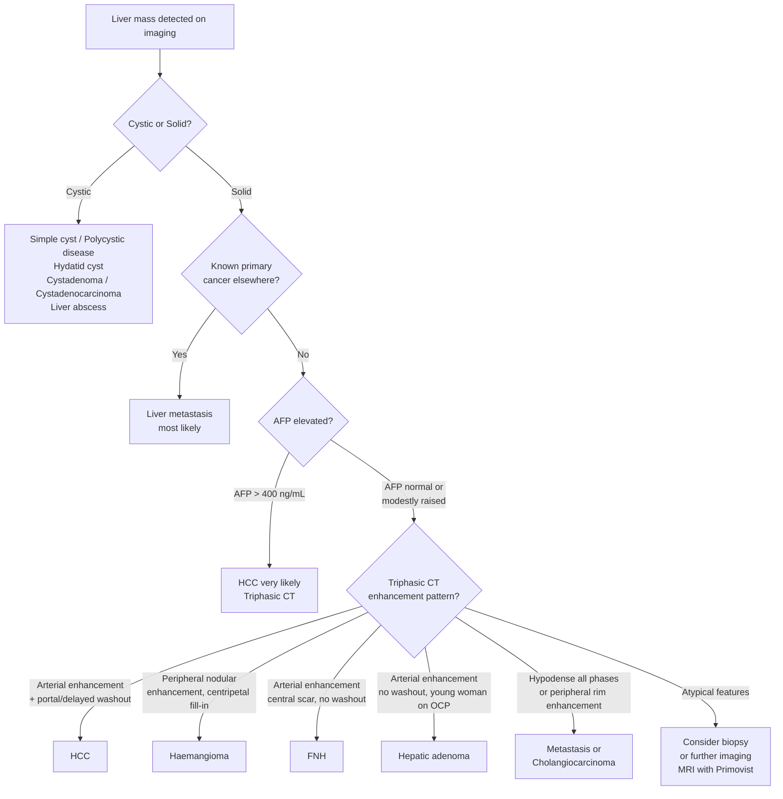

## Differential Diagnosis of a Liver Mass / Suspected HCC

When you encounter a patient with a liver mass — whether detected incidentally on imaging, found during screening of a chronic HBV carrier, or presenting with RUQ pain and hepatomegaly — you need a systematic framework to work through the differential diagnosis. The critical first question is always: **Is this mass malignant or benign? If malignant, is it primary or secondary (metastatic)?**

Let's build this framework from first principles, then work through each entity, explaining **why** it can mimic HCC and **how** to distinguish it.

---

### Overarching Framework

***The lecture slide from Prof Poon provides a clean framework for the differential diagnosis of hepatomegaly*** [4]:

**Malignancy:**
- ***Primary liver malignancies***
- ***Metastasis***
- ***Haematological malignancies (lymphoma, leukaemia, myeloproliferative disease)***

**Benign disease:**
- ***Benign neoplasms (haemangioma, adenoma, focal nodular hyperplasia)***
- ***Cyst (simple cyst, polycystic disease)***
- ***Alcoholic cirrhosis***
- ***Others (e.g. liver abscess)***

The senior notes [1] present a slightly more granular version:

**Benign primary liver tumours:**
- Hepatic haemangioma
- Hepatic adenoma
- Focal nodular hyperplasia

**Malignant primary liver tumours:**
- Hepatocellular carcinoma
- Cholangiocarcinoma
- Fibrolamellar carcinoma
- Haemangioendothelioma

**Metastatic or disseminated tumours:**
- Leukaemia
- Lymphoma
- Myeloma
- Metastatic solid tumour

Let me now walk through each of these in clinical detail, explaining what they are, why they enter the differential, and the key distinguishing features from HCC.

---

### Mermaid Diagram — Approach to a Liver Mass

---

### 1. Benign Primary Liver Tumours

#### 1.1 Hepatic Haemangioma

- **What it is**: A congenital vascular malformation composed of dilated blood-filled vascular spaces lined by endothelium. It is the ***most common benign liver tumour*** [2][6].
- **Why it enters the differential**: Both haemangioma and HCC are hypervascular on imaging. Both can present as incidental liver masses. A large haemangioma can cause RUQ pain and hepatomegaly.
- **Key distinguishing features**:

| Feature | Haemangioma | HCC |
|---|---|---|
| Demographics | Female predominance; any age | Male predominance; > 50 years; HBV/cirrhosis |
| AFP | **Normal** | Raised in ~70% |
| ***Triphasic CT*** | ***Peripheral nodular enhancement in arterial phase with progressive centripetal "fill-in" in portal/delayed phases*** — contrast "pools" in the vascular spaces and slowly fills inward (like pouring honey into a bowl from the edges) | ***Arterial hyperenhancement with portal venous/delayed washout*** — contrast washes OUT |
| MRI T2 | **Very bright** ("light bulb" sign) — because blood in dilated spaces has long T2 | Moderately bright |
| Biopsy | **Contraindicated** — risk of catastrophic haemorrhage (it's literally a bag of blood) | Only if diagnosis uncertain and unresectable |

<Callout title="Exam Pearl">
The **hallmark** of haemangioma on triphasic CT is **centripetal fill-in** (from periphery to centre) in the delayed phase. This is the exact **opposite** of HCC, which shows **centrifugal washout** (contrast leaves the tumour). If the CT shows delayed phase enhancement → think haemangioma, not HCC.
</Callout>

#### 1.2 Focal Nodular Hyperplasia (FNH)

- **What it is**: A hyperplastic regenerative nodule that forms in response to a pre-existing arterial malformation (an aberrant "feeding" artery). It is **not a true neoplasm** — it's a hyperplastic response to abnormal blood flow [6].
- **Why it enters the differential**: Arterially enhancing liver mass in a young/middle-aged patient. Can be mistaken for HCC especially if a background liver disease is present.
- **Key distinguishing features**:

| Feature | FNH | HCC |
|---|---|---|
| Demographics | Female; 20–50 years; OCP use (but NOT caused by OCP) | Male; > 50 years; HBV/cirrhosis |
| AFP | Normal | Raised in ~70% |
| **Characteristic imaging** | ***Central stellate scar*** (a fibrous scar containing the anomalous artery, bile ductules, and Kupffer cells); arterial enhancement but **NO washout** (or very mild). The scar enhances on **delayed phase**. | Arterial enhancement WITH washout |
| Kupffer cells | **Present** (this is key — FNH contains functioning Kupffer cells) → takes up hepatospecific contrast (Primovist/gadoxetate) on MRI and technetium-99m sulphur colloid on scintigraphy | **Absent or dysfunctional** Kupffer cells → does NOT take up hepatospecific contrast |
| ***Size*** | ***Usually solitary and < 5 cm*** [6] | Variable, often > 5 cm at diagnosis |
| Malignant potential | **None** — no risk of malignant transformation | N/A (already malignant) |
| Management | **Observation** (no treatment needed unless symptomatic) | Surgical/locoregional treatment |

#### 1.3 Hepatic Adenoma

- **What it is**: A **benign proliferation of hepatocytes** (a true neoplasm, unlike FNH). The name "hepat-oma" literally means liver tumour — confusingly, some older texts use "hepatoma" for HCC, but strictly it should refer to this benign lesion [6].
- **Why it enters the differential**: Arterially enhancing solid liver mass, can be large, and importantly **can rupture** (like HCC) causing haemoperitoneum. Also has **malignant potential** → can transform into HCC.
- **Key distinguishing features**:

| Feature | Hepatic Adenoma | HCC |
|---|---|---|
| Demographics | ***Female, 25–50 years, OCP use*** (oestrogen-driven) [6] | Male; > 50 years; HBV/cirrhosis |
| AFP | Normal | Raised in ~70% |
| Background liver | **Normal** (no cirrhosis) | Usually cirrhotic |
| Risk of rupture | ***Yes — rupture → haemoperitoneum*** [6] | Yes |
| Malignant transformation | **Yes** (especially β-catenin-activating subtype) — reason for recommending resection | N/A |
| Imaging | Arterial enhancement, may have internal haemorrhage/fat; **NO central scar** (unlike FNH); variable washout | Classic arterial enhancement + washout |
| Management | **Stop OCP** + consider resection (especially if > 5 cm or β-catenin subtype) | Treat as HCC |

<Callout title="Adenoma vs FNH — The Management Crux" type="idea">
FNH = observe (no malignant potential, no rupture risk). Adenoma = stop OCP and consider resection (risk of rupture AND malignant transformation). Don't mix these up — the management is completely different despite both being "benign liver lesions in young women."
</Callout>

---

### 2. Malignant Primary Liver Tumours

#### 2.1 ***Cholangiocarcinoma (CC)*** [4][7][8]

- **What it is**: ***Adenocarcinoma of the bile duct epithelium*** (cholangio- = bile duct, carcinoma = malignant epithelial tumour). > 90% are adenocarcinoma [7][8].
- ***Intrahepatic cholangiocarcinoma (ICC) accounts for 5–20% of primary liver malignancy*** [7] and is the **second most common primary liver cancer after HCC** [2].
- **Why it enters the differential**: Intrahepatic cholangiocarcinoma presents as a liver mass, often in a patient with chronic liver disease (HCV, PSC), and can be difficult to distinguish from HCC on imaging.

| Feature | Cholangiocarcinoma | HCC |
|---|---|---|
| Cell of origin | Cholangiocyte (bile duct epithelium) | Hepatocyte |
| ***Association*** | ***Ulcerative colitis/PSC (Western), recurrent pyogenic cholangitis (Oriental)*** [7] | HBV, HCV, cirrhosis |
| AFP | **Normal** (bile duct cells don't make AFP) | Raised in ~70% |
| ***Tumour markers*** | ***CEA, CA 19-9 (may or may not be elevated, nonspecific)*** [7] | AFP |
| Triphasic CT | **Peripheral rim enhancement** in arterial phase, progressive **centripetal enhancement** in delayed phase (because of the dense desmoplastic stroma that slowly takes up contrast) — the opposite of HCC washout | Arterial hyperenhancement + washout |
| Histology (IHC) | **CK7+, CK19+** (biliary markers); **HepPar-1 negative** | **HepPar-1+, Glypican-3+**; CK7 variable |
| Bile production (gross) | No green discolouration (cholangiocytes don't make bile pigment; they secrete mucin) | ***Green discolouration (bile production)*** |
| ***Clinical*** | ***RUQ pain, hepatomegaly, jaundice (extrahepatic obstruction)*** [7] | RUQ pain, hepatomegaly, jaundice less common |
| Mucin | **Mucin-producing** (desmoplastic, scirrhous tumour) | No mucin |

<Callout title="AFP as the Key Discriminator" type="error">
If AFP is significantly elevated ( > 400 ng/mL), the mass is almost certainly HCC, not cholangiocarcinoma. Conversely, if AFP is normal and CA 19-9 is elevated, think cholangiocarcinoma. However, there exists a rare **combined hepatocellular-cholangiocarcinoma** that may have elevated AFP [8].
</Callout>

#### 2.2 ***Fibrolamellar Carcinoma (FLC)***

- Already discussed in the pathology section but worth reiterating as a differential:
- ***Histologic variant of HCC; most common in younger women, good prognosis*** [4]
- ***Not associated with HBV or cirrhosis*** [2]
- AFP is typically **normal** (because the well-differentiated tumour cells don't secrete AFP efficiently)
- Imaging: large mass with **central calcified scar** (unlike FNH, the scar does NOT enhance on delayed phase)
- If you see a large liver mass in a young patient without cirrhosis and normal AFP → think fibrolamellar HCC

#### 2.3 Haemangioendothelioma

- **Epithelioid haemangioendothelioma (EHE)**: a rare low-to-intermediate grade vascular malignancy
- Presents as **multiple liver lesions**, often at the periphery with capsular retraction (a fairly characteristic finding)
- Can mimic metastatic disease on imaging
- Distinguished from HCC by: no association with HBV/cirrhosis, normal AFP, IHC positive for vascular markers (CD31, CD34, Factor VIII)
- In children, **infantile haemangioendothelioma** is a distinct entity (benign vascular tumour of infancy)

#### 2.4 Hepatic Angiosarcoma

- Extremely rare, highly aggressive malignant vascular tumour
- Associated with **Thorotrast** (thorium dioxide — an old radiological contrast agent), vinyl chloride, arsenic, and anabolic steroids
- Presents with rapidly enlarging liver mass, haemoperitoneum (rupture), consumptive coagulopathy
- Prognosis is dismal

#### 2.5 Primary Hepatic Lymphoma

- Rare; liver is more commonly involved secondarily in systemic lymphoma
- Can present as a solitary mass or diffuse infiltration
- Distinguished from HCC by: LDH elevation, normal AFP, imaging may show a "low density" mass, and diagnosis requires biopsy with IHC (CD20+ for B-cell lymphoma)

---

### 3. ***Metastatic / Secondary Liver Tumours*** [4][9]

***Metastatic carcinoma to the liver is commoner than primary liver cancer*** [9]. In fact, liver metastases are ***20× more common than primary liver tumours*** [2].

Why? Because the liver receives the **entire portal venous drainage from the GI tract** — any cancer shedding cells into the portal circulation has direct access to the liver sinusoids. The liver also has a dual blood supply and a rich sinusoidal network that acts as a "filter" trapping circulating tumour cells.

#### Common Primary Sources [2][9]

The mnemonic from the senior notes is helpful: ***"Some GU Cancers Produce Bumpy Lumps"*** [2]:
- **S**tomach
- **GU**: kidney, ovary, uterus
- **C**olon (***most common*** — accounts for ~1/3 of liver metastases) [2]
- **P**ancreas
- **B**reast
- **L**ung

***Commonest site is from GI tract (portal venous circulation): colorectal, stomach, pancreas*** [9].

#### Key Distinguishing Features from HCC

| Feature | Liver Metastasis | HCC |
|---|---|---|
| History | Known primary cancer elsewhere; change of bowel habit (CRC); breast lump | HBV carrier, cirrhosis |
| Number | Usually **multiple** (bilateral involvement) | Often solitary or oligonodular (though multifocal possible) |
| Liver parenchyma | **Normal** (no cirrhosis) | Usually **cirrhotic** |
| AFP | **Normal** (unless primary is germ cell tumour or gastric) | Raised in ~70% |
| ***Tumour markers*** | ***CEA (CRC, gastric), CA 19-9 (pancreatic, biliary), CA 125 (ovarian), chromogranin A (neuroendocrine)*** [2][9] | AFP |
| ***Triphasic CT*** | ***Hypodense on ALL phases*** [2] (most metastases are **hypovascular** — in contrast to HCC which is hypervascular) | Arterial hyperenhancement + washout |
| Exception | **Hypervascular metastases** (RCC, neuroendocrine tumours, melanoma, thyroid, breast) may show arterial enhancement — can mimic HCC | — |
| Clinical | ***Hard nodular hepatomegaly, RUQ tenderness, obstructive jaundice (if metastasis to porta hepatis LN)*** [2] | Variable |

<Callout title="The Triphasic CT 'Cheat Sheet'">

| Lesion | Arterial Phase | Portovenous Phase | Delayed Phase |
|---|---|---|---|
| **HCC** | ***Hyperdense*** | ***Washout (hypodense)*** | ***Hypodense*** |
| **Haemangioma** | Peripheral nodular enhancement | Progressive centripetal fill-in | **Isodense or hyperdense (fill-in complete)** |
| **Liver metastasis** | ***Hypodense*** | ***Hypodense*** | ***Hypodense*** |
| **Cholangiocarcinoma** | Peripheral rim enhancement | Progressive delayed enhancement | Hyperdense (desmoplastic stroma) |
| **FNH** | Hyperdense (except scar) | Iso/slightly hyperdense | Scar enhances late |

This table alone will answer a huge number of exam questions. Memorise it.
</Callout>

---

### 4. ***Cystic Lesions*** [4]

***Cysts (simple cyst, polycystic disease)*** [4] should be mentioned:

| Entity | Features | Why in DDx |
|---|---|---|
| **Simple hepatic cyst** | Thin-walled, anechoic on USG, no internal septations or solid components | Common incidental finding; easy to distinguish from HCC on USG |
| **Polycystic liver disease** | Multiple cysts, often associated with autosomal dominant polycystic kidney disease (ADPKD) | Can cause massive hepatomegaly; distinguished by cystic nature |
| **Hydatid cyst** (Echinococcus) | Thick-walled, may have "daughter cysts," calcification, "water lily" sign | Endemic in sheep-farming areas; eosinophilia, positive serology |
| **Biliary cystadenoma / cystadenocarcinoma** | Multiloculated cystic mass with mural nodules, thick septae | Rare; malignant potential; middle-aged women |
| ***Liver abscess*** [4] | Pyogenic (polymicrobial, often post-biliary surgery) or amoebic (Entamoeba histolytica); fever, RUQ pain, leucocytosis | Can mimic necrotic HCC on imaging; distinguished by clinical context (fever, leucocytosis), aspiration (pus) |

---

### 5. Other Non-Neoplastic Causes of Hepatomegaly [4]

While not true "liver masses," these conditions cause hepatomegaly and may enter the differential on physical examination:

- ***Alcoholic cirrhosis*** [4] — early cirrhosis can cause hepatomegaly (fatty, enlarged liver); later it becomes shrunken
- **Congestive hepatopathy** (right heart failure) — smooth, tender hepatomegaly; pulsatile if tricuspid regurgitation
- **Budd-Chiari syndrome** — hepatic vein thrombosis → congestive hepatomegaly, ascites, abdominal pain
- **Amyloidosis** — diffuse infiltration → massive firm hepatomegaly
- **Glycogen storage diseases** — paediatric; massive hepatomegaly

---

### 6. ***Clinical Approach to Hepatomegaly*** [4]

The lecture slides give a structured approach that you should follow on the wards:

**History** [4]:
- ***Pain, change of bowel habit, other GI symptoms, tea-colour urine***
- ***Systemic symptoms of malignancy (anorexia, nausea, weight loss), fever***
- ***Systemic review of other systems***
- ***Past history of chronic liver disease***
- ***Social history: alcohol***
- ***Family history: any malignancy***

**Physical Examination** [4]:
- ***General examination: cachexia, pallor, jaundice, lymphadenopathy, chronic stigmata of liver disease***
- ***Abdominal examination: hepatomegaly — size, tenderness, consistency, surface, edge, bruit***
- ***Other organomegaly (spleen), mass, ascites***
- ***PR examination***

**Investigations** [4]:
- ***Blood tests: complete blood count, liver function test, coagulation, hepatitis serology (B and C), tumour markers (AFP, CEA, CA 19.9)***
- ***Imaging: chest X-ray, ultrasound, CT scan, MRI***
- ***Endoscopy (for suspected GI primary): upper endoscopy, colonoscopy***
- ***Biopsy: fine needle aspiration cytology (FNAC), Trucut biopsy***

<Callout title="The Systematic Approach to a Liver Mass — Summary">

1. **History**: HBV status, alcohol, chronic liver disease, known cancer, constitutional symptoms
2. **Examination**: Characterise the hepatomegaly (size, consistency, surface, tenderness, bruit); look for stigmata of CLD; check for splenomegaly and ascites
3. **Bloods**: AFP, CEA, CA 19-9, LFT, hepatitis serology, coagulation
4. **Imaging**: USG first → Triphasic CT (gold standard) → MRI if needed
5. **Biopsy**: ONLY if diagnosis remains uncertain AND the lesion is unresectable (risk of bleeding and needle tract seeding)

</Callout>

---

### Summary Table — Differential Diagnosis of a Liver Mass

| Diagnosis | Age/Sex | Background | AFP | Key Imaging Feature | Other Markers |
|---|---|---|---|---|---|
| **HCC** | M > 50 | HBV, cirrhosis | **↑↑** | Arterial enhancement + washout | HBV serology |
| **Haemangioma** | F, any age | None | Normal | Peripheral fill-in on delayed | None |
| **FNH** | F, 20–50 | None | Normal | Central scar, no washout | None |
| **Hepatic adenoma** | F, 25–50, OCP | None | Normal | Arterial enhancement, heterogeneous | None |
| **Cholangiocarcinoma** | > 50 | PSC, RPC | Normal | Delayed enhancement (desmoplasia) | CA 19-9, CEA |
| **Fibrolamellar HCC** | Young | **No** cirrhosis | Normal | Central calcified scar | None |
| **Liver metastasis** | Any | Known primary | Normal | Hypodense all phases (most) | CEA, CA 19-9 |
| **Liver abscess** | Any | Biliary disease, travel | Normal | Rim-enhancing collection, air | Leucocytosis, CRP |
| **Haemangioendothelioma** | Any | Thorotrast | Normal | Peripheral capsular retraction | CD31, CD34 |

---

<Callout title="High Yield Summary">

**Framework**: Liver mass DDx = Benign primary (haemangioma, FNH, adenoma) vs Malignant primary (HCC, cholangiocarcinoma, fibrolamellar, haemangioendothelioma) vs Metastatic (most common: CRC, stomach, pancreas, breast, lung) vs Cystic (simple cyst, abscess, hydatid) vs Non-neoplastic (cirrhosis, congestion).

**Key discriminators**:
- **AFP > 400** → virtually diagnostic of HCC
- **Triphasic CT** is the gold standard: HCC = arterial enhancement + washout; haemangioma = peripheral fill-in; metastasis = hypodense all phases; cholangiocarcinoma = delayed enhancement
- **Background liver**: HCC almost always has cirrhosis/HBV; metastases and benign tumours have normal liver
- **Liver metastases are 20× more common than primary liver tumours** — always consider a secondary cause
- **Biopsy only if diagnosis uncertain AND lesion unresectable** — risk of bleeding and tumour seeding

**Clinical approach to hepatomegaly** (Prof Poon): History (CLD, alcohol, malignancy) → Examination (characterise liver, stigmata of CLD, spleen, ascites) → Bloods (AFP, CEA, CA19-9, LFT, Hep serology) → Imaging (USG → CT → MRI) → Endoscopy if GI primary suspected → Biopsy only if indicated.

</Callout>

---

<ActiveRecallQuiz
  title="Active Recall — Differential Diagnosis of HCC / Liver Mass"
  items={[
    {
      question: "Name the 3 most common benign liver tumours and state which is the most common.",
      markscheme: "1. Haemangioma (most common benign liver tumour), 2. Focal nodular hyperplasia (FNH), 3. Hepatic adenoma."
    },
    {
      question: "On triphasic CT, how do you distinguish HCC from haemangioma and liver metastasis?",
      markscheme: "HCC: arterial hyperenhancement with portal venous/delayed phase washout (hypodense). Haemangioma: peripheral nodular enhancement in arterial phase with progressive centripetal fill-in becoming iso/hyperdense in delayed phase. Liver metastasis: hypodense in all three phases (most are hypovascular)."
    },
    {
      question: "Which tumour marker helps distinguish HCC from cholangiocarcinoma, and what is the key imaging difference?",
      markscheme: "AFP is elevated in ~70% of HCC but is normal in cholangiocarcinoma (which may have elevated CA 19-9/CEA instead). On imaging, HCC shows arterial enhancement with washout, whereas cholangiocarcinoma shows peripheral rim enhancement with progressive delayed enhancement due to its dense desmoplastic stroma."
    },
    {
      question: "Why are liver metastases more common than primary liver cancers? Name the most common primary source.",
      markscheme: "The liver receives the entire portal venous drainage from the GI tract, so any GI cancer shedding cells into the portal circulation has direct access to the hepatic sinusoids. The dual blood supply and rich sinusoidal network act as a filter trapping circulating tumour cells. The most common primary source is colorectal cancer (accounts for about one-third of liver metastases)."
    },
    {
      question: "A 25-year-old woman on OCP presents with a liver mass. AFP is normal. What are the top 3 differentials and how do you distinguish them?",
      markscheme: "Top 3: FNH, hepatic adenoma, and fibrolamellar HCC. FNH: central stellate scar that enhances on delayed phase, takes up hepatospecific contrast (Kupffer cells present), no malignant potential — observe. Hepatic adenoma: no central scar, heterogeneous enhancement, risk of rupture and malignant transformation — stop OCP and consider resection. Fibrolamellar HCC: central calcified scar (does NOT enhance on delayed), large mass, DNAJB1-PRKACA fusion, normal AFP — resection with good prognosis."
    }
  ]}
/>

## References

[1] Senior notes: felixlai.md (Hepatocellular carcinoma — Etiology and Differential Diagnosis sections)
[2] Senior notes: maxim.md (Hepatocellular carcinoma section; Liver metastasis section; Benign liver neoplasm table)
[4] Lecture slides: WCS 064 - A large liver - by Prof R Poon [20191108].doc.pdf (p. 2–3, 5–6)
[6] Senior notes: maxim.md (Benign liver neoplasm comparative table)
[7] Lecture slides: WCS 064 - A large liver - by Prof R Poon [20191108].doc.pdf (p. 5 — Cholangiocarcinoma)
[8] Senior notes: felixlai.md (Cholangiocarcinoma sections)
[9] Lecture slides: WCS 064 - A large liver - by Prof R Poon [20191108].doc.pdf (p. 6 — Metastatic Carcinoma to Liver)
