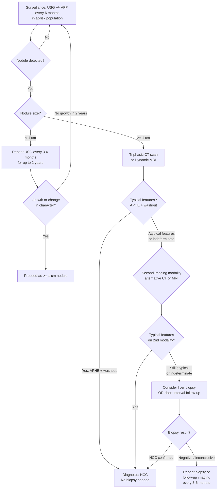

## Diagnostic Criteria, Diagnostic Algorithm, and Investigation Modalities for HCC

---

### 1. Diagnostic Principles — Why HCC is Unique

HCC holds a remarkable position in oncology: it is one of the very few solid malignancies that can be **diagnosed definitively by imaging alone, without biopsy**. Why?

1. **Characteristic vascular signature**: HCC derives > 90% of its blood supply from the hepatic artery (normal liver parenchyma is ~75% portal vein-supplied). This creates a **pathognomonic imaging pattern** — arterial hyperenhancement followed by portal venous/delayed washout — that is essentially diagnostic.
2. **Clinical context narrows the differential**: HCC almost always occurs in a known high-risk population (HBV carriers, cirrhotic patients). A new arterially enhancing nodule in a cirrhotic liver is HCC until proven otherwise.
3. **Biopsy carries real risks**: the tumour is hypervascular (bleeding risk) and there is a risk of **needle tract tumour seeding** that could upstage the disease and make liver transplantation unsuitable [1][2].

<Callout title="The Golden Rule of HCC Diagnosis">
***In a cirrhotic liver or HBV carrier, a nodule ≥ 1 cm showing arterial phase hyperenhancement with portal venous/delayed phase washout on CT or MRI is diagnostic of HCC — no biopsy needed*** [1][4]. This is the single most important diagnostic concept.
</Callout>

---

### 2. Diagnostic Criteria

#### 2.1 Non-Invasive Diagnostic Criteria (AASLD / EASL / APASL — Unified Approach)

The diagnosis of HCC can be established **non-invasively** when **ALL** of the following are met:

1. **At-risk population**: chronic liver disease (HBV carrier, HCV, cirrhosis of any aetiology)
2. **Nodule ≥ 1 cm** on surveillance imaging
3. **Characteristic enhancement pattern** on **one** dynamic contrast-enhanced imaging study (triphasic CT or dynamic MRI):
   - ***Arterial phase hyperenhancement (APHE)***: the nodule "lights up" brighter than the surrounding liver in the arterial phase
   - ***Non-peripheral "washout"***: the nodule becomes **hypo**-attenuating/intense relative to the surrounding liver in the portal venous and/or delayed phase
   - Additional supporting features (for MRI): enhancing "capsule" appearance on delayed phase, restricted diffusion, T2 mild hyperintensity

**If both APHE + washout are present → HCC is diagnosed. No biopsy required.**

#### 2.2 LI-RADS Classification (Liver Imaging Reporting and Data System)

LI-RADS was developed by the ACR (American College of Radiology) to standardise the reporting of liver observations in at-risk patients. It assigns a category from LR-1 to LR-5:

| LI-RADS Category | Interpretation | Action |
|---|---|---|
| **LR-1** | Definitely benign | No further workup |
| **LR-2** | Probably benign | Consider follow-up |
| **LR-3** | Intermediate probability of HCC | Follow-up or alternative imaging |
| **LR-4** | Probably HCC | Discuss in MDT; consider biopsy or short-interval follow-up |
| **LR-5** | ***Definitely HCC*** | **Diagnostic — treat as HCC** |
| **LR-M** | Probably or definitely malignant, but not specific for HCC | Biopsy to distinguish HCC vs cholangiocarcinoma vs other |
| **LR-TIV** | Tumour in vein | Indicates macrovascular invasion |

**LR-5 criteria** (simplified): ≥ 1 cm + APHE + non-peripheral washout AND/OR enhancing "capsule" AND/OR threshold growth (≥ 50% in ≤ 6 months).

#### 2.3 AFP-Based Diagnostic Criteria

- ***AFP > 400 ng/mL is almost diagnostic of HCC*** [4] in the right clinical context (HBV carrier, cirrhosis)
- However, ***normal AFP level in 30% of patients (i.e. < 20 ng/mL)*** [4] — so a normal AFP does **not** exclude HCC
- AFP alone is **insufficient** for diagnosis — it must be combined with imaging

<Callout title="AFP Pitfalls" type="error">
***AFP sensitivity is only ~60–70%*** — 30% of HCC patients have normal AFP [4]. Conversely, AFP can be falsely elevated in: ***pregnancy, germ cell tumours, hepatitis (acute or chronic), liver cirrhosis, gastric cancer*** [1]. An acute exacerbation of hepatitis B can transiently raise AFP to levels mimicking HCC. The key differentiator: ***serial AFP measurements every 2–4 weeks — AFP decreases after hepatitis flare but remains elevated or rises in HCC*** [1].
</Callout>

---

### 3. Diagnostic Algorithm

#### 3.1 Screening Pathway

***Surveillance should be performed at intervals of 6 months (doubling time of HCC ≈ 3–4 months)*** [1][2][10].

***Screening targets*** [2][10]:
- ***HBV carriers > 40 years old***
- ***HBV carriers with cirrhosis (any age)***
- ***HBV/HCV co-infected with HIV***
- Cirrhosis of any aetiology

***Screening method: USG + AFP every 6 months*** [2][4][10]

***Rationale for 6-month interval*** [1]:
- Based on expected HCC growth rates (***doubling time ≈ 3–4 months*** [2])
- ***No difference in outcomes compared with 3-month interval*** surveillance [1]
- ***Better survival compared with 12-month interval*** surveillance [1]
- ***USG has higher sensitivity than AFP alone*** [1]

***The data from the HKU screening study (Chan AC et al., Ann Surg 2008)*** [10] demonstrates the clear advantage of screening vs symptomatic presentation:

| Parameter | ***Screened Group*** | ***Symptomatic Group*** |
|---|---|---|
| ***Child class A*** | ***78.7%*** | ***70.8%*** |
| ***Serum AFP (median, ng/mL)*** | ***82*** | ***327*** |
| ***Tumour size (median, cm)*** | ***3.2*** | ***7.0*** |
| ***Bilobar disease*** | ***15.2%*** | ***38.7%*** |
| ***Distant metastasis*** | ***0.7%*** | ***5.9%*** |

This is the power of screening — patients are caught with **smaller tumours, better liver function, and less advanced disease**, translating into more curative treatment options.

#### 3.2 AASLD Diagnostic Algorithm [1]

**Key logic explained:**

- ***Lesion < 1 cm***: ***Followed with USG at intervals of 6 months*** [1]. Why not immediately do CT/MRI? Because tiny nodules < 1 cm cannot be reliably characterised by any imaging modality (spatial resolution is insufficient), and the pre-test probability of malignancy is lower. The ***doubling time of HCC ≈ 3 months*** [1], so a 6-month follow-up provides enough time for a true HCC to grow and become characterisable while remaining within a potentially curable window.
- ***Lesion ≥ 1 cm***: ***Evaluate with helical multidetector CT with contrast or dynamic MRI*** [1]. If typical features → diagnosis made. If atypical → second modality or biopsy.
- ***Resume routine surveillance if the lesion shows no growth over 2 years*** [1] — a true HCC would be expected to at least double in that time frame.

---

### 4. Investigation Modalities — Detailed Breakdown

I'll organise this systematically: **Blood tests → Tumour markers → Liver function assessment → Imaging → Biopsy → Staging investigations**.

#### 4.1 Blood Tests

***Blood tests: CBP, LFT, alpha fetoprotein (> 400 ng/mL almost diagnostic of HCC, normal AFP level in 30% of patients i.e. < 20 ng/mL), hepatitis B and C serology*** [4].

| Test | What It Tells You | Key Findings in HCC |
|---|---|---|
| ***CBP (Complete Blood Picture)*** [4] | Baseline haematology; detect pancytopenia from hypersplenism (portal HT) | Anaemia (chronic disease, GI bleed); thrombocytopenia (hypersplenism/cirrhosis); polycythaemia (paraneoplastic EPO secretion — rare) |
| ***LFT*** [2][4] | Hepatocellular function + cholestasis | ↑ AST/ALT (may be normal with small HCC [1]); ↑ ALP/GGT (cholestasis or infiltration); ↑ bilirubin; ↓ albumin (synthetic failure); ↑ PT/INR (coagulopathy) |
| ***Clotting profile*** [2] | Synthetic function of liver | ↑ PT/INR — reflects degree of hepatic decompensation |
| ***Renal function*** [2] | Baseline; detect hepatorenal syndrome | ↑ Creatinine in hepatorenal syndrome |
| ***Hepatitis B serology*** [4] | Establish underlying aetiology | HBsAg+, HBV DNA level, HBeAg (↑ risk of HCC [2]) |
| ***Hepatitis C serology*** [4] | Establish underlying aetiology | Anti-HCV IgG+, HCV RNA level |

#### 4.2 Tumour Markers

##### ***Alpha-Fetoprotein (AFP)*** [1][2][4]

AFP is a glycoprotein (molecular weight ~72 kDa) normally produced by the fetal liver and yolk sac. In adults, it should be < 10 ng/mL (some labs use < 6 or < 20 as the upper limit of normal).

| Property | Detail |
|---|---|
| ***Half-life*** | ***3–6 days*** [1] |
| Diagnostic threshold | ***AFP > 400 ng/mL almost diagnostic of HCC*** [4]; some sources use > 200 ng/mL |
| Sensitivity | ***~60–70% (raised in ~70–80% of HCC patients)*** [2]; ***normal AFP in 30% of patients*** [4] |
| Prognostic value | ***AFP level correlates with prognosis*** [2]; ***AFP > 1000 ng/mL → higher risk of recurrent disease following liver transplantation regardless of tumour size*** [1] |
| ***False positive AFP*** [1][2] | ***Pregnancy*** (fetal liver production); ***Germ cell tumours/teratoma*** (yolk sac component); ***Hepatitis (acute or chronic)***; ***Liver cirrhosis***; ***Gastric cancer*** |
| Serial monitoring | AFP should be measured serially: ***decreases after acute hepatitis exacerbation but not if due to HCC*** [1]; also used to ***follow tumour progression or regression*** after treatment [1] |

<Callout title="AFP Subtypes — AFP-L3%" type="idea">
AFP-L3 is a subfraction of AFP that binds Lens culinaris agglutinin (a lectin). It is **more specific for HCC** than total AFP because it is produced primarily by malignant hepatocytes rather than regenerating hepatocytes or inflammatory tissue. AFP-L3% > 10% strongly suggests HCC rather than cirrhosis/hepatitis as the cause of AFP elevation. Not routinely tested in HK but good to know.
</Callout>

##### Other Tumour Markers

| Marker | Role in HCC Workup |
|---|---|
| ***CEA*** [4] | Not elevated in HCC (useful for ruling in colorectal liver metastasis or cholangiocarcinoma) |
| ***CA 19-9*** [4] | Not elevated in HCC (useful for cholangiocarcinoma or pancreatic cancer) |
| **PIVKA-II / DCP** (Des-gamma-carboxyprothrombin) | An abnormal prothrombin produced by HCC cells due to defective carboxylation. ↑ in HCC. Complementary to AFP (can detect AFP-negative HCC). Used in Japan; less routine in HK. |

#### 4.3 Liver Function Reserve Assessment

This is critical because in HCC, you're treating **two diseases** — the cancer and the cirrhosis. Before planning any intervention (especially resection), you must know whether the liver remnant can sustain life.

##### ***Indocyanine Green (ICG) Clearance Test*** [4]

***ICG clearance test: a special dye excreted solely by the liver, best test for liver function reserve if planning for surgical excision*** [4].

How it works:
- ICG (indocyanine green) is an inert fluorescent dye injected intravenously
- It is taken up exclusively by hepatocytes (via organic anion transporter OATP1B3) and excreted **unchanged** into bile — it is NOT metabolised, conjugated, or excreted by kidneys
- After injection, serum ICG levels are measured over time (typically at 15 minutes)
- The **ICG retention rate at 15 minutes (ICG-R15)** reflects how well the liver can clear the dye

| ICG-R15 | Interpretation | Surgical Implication |
|---|---|---|
| **< 10%** | Excellent liver function | Can tolerate **major hepatectomy** (right hepatectomy, extended resection) |
| **10–19%** | Good function | Can tolerate **limited resection** (segmentectomy, bisegmentectomy) |
| **20–29%** | Moderate impairment | **Limited wedge resection** or non-anatomical resection only |
| **≥ 30%** | Significant impairment | **No resection** — consider ablation or transplant |

Why is ICG superior to Child-Pugh score for surgical planning? Because Child-Pugh uses subjective parameters (ascites severity, encephalopathy grade) and coarse categories (A/B/C), whereas ICG-R15 provides a **continuous, objective, quantitative** measurement of liver function along the entire excretory pathway. It's particularly useful for distinguishing patients within Child-Pugh A who may still have marginal reserve.

##### Child-Pugh Score

Already covered in detail in the prior section. Quick recap — **ABCDE**: ***Albumin, Bilirubin, Clotting (INR), Distension (ascites), Encephalopathy*** [2].

| Class | Score | Surgical Implication |
|---|---|---|
| ***A (5–6)*** | Good reserve | May be candidate for resection (if ICG-R15 acceptable) |
| ***B (7–9)*** | Moderate impairment | Consider TACE, ablation, or transplant; resection risky |
| ***C (10–15)*** | Severe impairment | Best supportive care or transplant only |

##### ALBI Score (Alternative to Child-Pugh)

***ALBI (Albumin-Bilirubin) score*** [2]: uses **only albumin and bilirubin** — purely objective, no subjective assessment of ascites or encephalopathy. Increasingly used as it removes inter-observer variability.

Formula: ALBI = (log₁₀ bilirubin × 0.66) + (albumin × −0.085)

| ALBI Grade | Score | Interpretation |
|---|---|---|
| 1 | ≤ −2.60 | Good liver function |
| 2 | > −2.60 to ≤ −1.39 | Intermediate |
| 3 | > −1.39 | Poor liver function |

#### 4.4 Imaging Modalities

##### 4.4a ***Ultrasound (USG)*** [1][2][4]

| Feature | Detail |
|---|---|
| **Role** | ***Used for screening patients with HCC*** [1]; first-line surveillance tool |
| **What it assesses** | ***Patency of hepatic blood supply and presence of vascular invasion by tumour*** [1]; liver size and morphology; ascites; splenomegaly |
| **Diagnostic principle** | ***Any dominant solid nodule that is not clearly a haemangioma should be considered HCC unless proven otherwise*** [1][2] |
| **Sensitivity** | ~60–80% for detecting HCC (depends on operator skill, body habitus, and background liver echotexture in cirrhosis) |
| **USG findings of HCC** [1] | ***Poorly-defined margins; coarse irregular internal echoes; hypoechoic in small tumours but hyperechoic/isoechoic in large tumours*** |
| **Limitations** | Operator-dependent; obesity; bowel gas; cirrhotic nodularity creates a "noisy" background making small HCCs hard to detect |

##### 4.4b ***Triphasic CT Scan with Contrast*** [1][2][4] — The Workhorse

This is the ***most commonly used diagnostic imaging*** [4] and is essentially the **gold standard** for HCC diagnosis.

**What is "triphasic"?** It refers to scanning the liver at **three specific time points** after IV contrast injection, each capturing a different phase of hepatic perfusion:

| Phase | Timing Post-Injection | What It Shows | HCC Appearance |
|---|---|---|---|
| ***Arterial phase*** | ~25–35 seconds | Hepatic artery and its branches opacify; portal vein still dark | ***HCC is BRIGHT (hyperdense)*** — because HCC gets its blood supply predominantly from the hepatic artery, so it enhances avidly when arterial contrast arrives [1] |
| ***Portal venous phase*** | ~60–80 seconds | Portal vein opacifies; normal liver parenchyma enhances brightly (because normal liver gets 75% blood from portal vein) | ***HCC is DARK (hypodense) — "WASHOUT"*** — contrast has already washed out of the tumour via its arterial supply, while the surrounding normal liver is now enhancing from portal venous blood [1] |
| ***Delayed/Equilibrium phase*** | ~3–5 minutes | Contrast equilibrates; normal liver begins to de-enhance | ***HCC remains DARK (hypodense)*** — ***progressive decrease in contrast intensity of lesion*** [1] |

***Key explanation from first principles*** [1]:
- ***Normal liver has 1/3 blood supply from hepatic artery and 2/3 from portal vein***
- ***HCC has its majority of blood supply from hepatic artery***
- Therefore: ***HCC appears hypervascular during arterial phase and usually not in the portal venous phase***
- ***HCC appears hypodense during delayed phases due to early washout of contrast medium by the arterial blood***

**Comparison with other lesions** [1][2]:

| Lesion | Arterial Phase | Portal Venous Phase | Delayed Phase |
|---|---|---|---|
| ***HCC*** | ***Hyperdense*** [2] | ***Washout (hypodense)*** [2] | ***Hypodense*** [2] |
| ***Liver metastasis*** | ***Hypodense*** [2] | ***Hypodense*** [2] | ***Hypodense*** [2] |
| ***Haemangioma*** | Peripheral nodular enhancement | Progressive centripetal fill-in | ***Capsular enhancement (fill-in complete)*** [1] |

<Callout title="Why Does Haemangioma Show 'Fill-In'?">
A haemangioma is a tangle of dilated blood-filled vascular spaces. Contrast enters slowly at the periphery (the "feeding" vessels are at the edges) and gradually "pools" inward through the cavernous spaces. Because the spaces are large and flow is slow, it takes minutes for the contrast to fill the centre — hence the classic **centripetal fill-in** on delayed phase. This is the exact **opposite** of HCC, where contrast rushes in fast (arterial) and rushes out fast (washout).
</Callout>

##### 4.4c ***MRI Scan*** [1][2][4]

***MRI is an alternative to CT scan and may also be useful in uncertain diagnosis after CT scan*** [4].

| Feature | Detail |
|---|---|
| **Indications** | ***Patients with contrast allergy; CT findings equivocal*** [1]; renal impairment (gadolinium-based contrast can be used in some formulations); better characterisation of small nodules |
| **Typical features of HCC** [1][2] | ***High-intensity on T2-weighted images*** (tumour has more water content than normal liver); ***low-intensity on T1-weighted images***; ***enhances in arterial phase; becomes hypointense in delayed phase due to contrast washout after gadolinium injection*** |
| **Hepatospecific contrast: Primovist/gadoxetate** | ***MRI liver with Primovist contrast (hepatospecific contrast)*** [2] — this is a **game-changer** for difficult cases |

**Why is Primovist (gadoxetate disodium) special?**

- It is a gadolinium-based contrast agent that is taken up by **functioning hepatocytes** via OATP1B1/B3 transporters and excreted into bile
- In the **hepatobiliary phase** (20 minutes post-injection), normal liver parenchyma retains the contrast and appears **bright**, while:
  - **HCC**: lacks normal OATP transporters → does **NOT** take up Primovist → appears **dark (hypointense)** against the bright background liver
  - **FNH**: contains functioning hepatocytes → takes up Primovist → appears **bright (isointense or hyperintense)**
  - **Dysplastic nodule vs early HCC**: Primovist can distinguish these because early HCC starts losing hepatocyte transporter function
- This is ***superior to CT in detecting small HCC vs regenerative nodules*** [6]

##### 4.4d ***Contrast-Enhanced Ultrasound (CEUS)*** [2]

- Uses microbubble contrast agents (e.g. SonoVue/Lumason) injected IV
- Allows **real-time assessment** of arterial, portal venous, and late phases — similar principle to triphasic CT
- HCC shows: arterial hyperenhancement + late/mild washout
- Advantages: no radiation, no nephrotoxic contrast, can be done at bedside
- Limitations: operator-dependent, limited by body habitus
- Accepted by APASL guidelines as a diagnostic modality for HCC (not yet endorsed by AASLD as first-line)

##### 4.4e ***Hepatic Arteriography and Post-Lipiodol CT Scan*** [1][4]

***Rarely performed nowadays*** [1] but important to know for exams as it appears on Prof Poon's slides.

***Hepatic arteriography (typical neovascularization, for uncertain cases after CT scan)*** [4]:
- Contrast injected ***intra-arterially (usually via SMA, hepatic, or splenic artery)*** [1] immediately prior to CT scan
- ***Identification of: neovascularization, portal vein thrombosis, tumour staining, AV shunting*** [1]

***Post-Lipiodol CT scan*** [4]:
- ***Lipiodol injected via arteriogram, repeat CT scan in 2 weeks for uptake by tumour*** [4]
- ***Lipiodol is retained in HCC because HCC does not contain Kupffer cells to ingest lipiodol*** [1][2]
- Why? Lipiodol is an iodinated poppy seed oil. Normal liver has abundant Kupffer cells (resident macrophages) that phagocytose lipiodol within days. HCC lacks functioning Kupffer cells, so lipiodol **persists** in the tumour for weeks — appearing as a bright spot on follow-up CT (***HCC shows up on Day 10*** [2])
- ***May pick up areas of tumour not demonstrated by pre-lipiodol CT scan*** [1]
- Used ***for uncertain cases after CT scan and hepatic arteriography*** [4]

##### 4.4f ***Dual Tracer PET Scan*** [1][2]

***PET-CT has limited sensitivity as HCC does not take up FDG well and the liver has high background metabolic activity*** [2].

Why doesn't standard FDG-PET work well for HCC?
- **FDG** (¹⁸F-fluorodeoxyglucose) is a glucose analogue. It is taken up by metabolically active cells. However, **well-differentiated HCC** cells retain glucose-6-phosphatase activity (like normal hepatocytes), so they can dephosphorylate FDG and excrete it — hence **low FDG uptake**.
- The normal liver also has **high background FDG metabolism**, making it hard to distinguish tumour from background.

***Solution: Dual-tracer PET*** [1][2]:
- ***¹¹C-acetate***: ***picks up well-differentiated HCC*** [1] — these tumours preferentially use fatty acid metabolism (acetate is incorporated into lipid synthesis), which standard FDG misses
  - ***Half-life of ¹¹C = 30 minutes*** [1] (very short — must be produced on-site by cyclotron)
- ***¹⁸F-FDG***: ***picks up poorly differentiated HCC*** [1] — these have high glycolytic activity (Warburg effect)
  - ***Half-life of FDG = 2 hours*** [1]
- ***By combining both tracers, sensitivity is dramatically improved*** because well-differentiated and poorly differentiated components are captured by complementary metabolic pathways [2]

#### 4.5 ***Biopsy*** [1][2][4]

***FNAC or Trucut biopsy*** [4] — but with important caveats:

***Percutaneous liver biopsy is NOT recommended in general*** [1] for the following reasons:
- ***Risk of tumour cell seeding along the needle tract*** — making liver transplantation unsuitable [1]
- ***Risk of bleeding*** — since HCC is a hypervascular tumour [1][2]
- ***Risk of organ puncture*** [2]

***Indications*** [1][2]:
- ***Only done in inconclusive diagnosis and unresectable cases*** [2] — when diagnostic imaging is uncertain and histological diagnosis is required to guide treatment (e.g. differentiate primary from secondary tumour, or HCC from cholangiocarcinoma)
- When considering systemic therapy where pathological confirmation is required

***Contraindications to liver biopsy*** [2]:
- ***Bleeding tendency (INR > 1.2 despite vitamin K)***
- ***Thrombocytopenia (platelets < 50,000)***
- ***High-grade biliary obstruction (risk of bile peritonitis)***

***Histological findings*** [1]:
- ***Pathological hallmark for HCC = Stromal invasion*** [1]
- Trabecular, pseudoglandular, or solid pattern of malignant hepatocytes
- ***IHC for HCC***: HepPar-1 (+), Glypican-3 (+), AFP (+), CK7 (−/variable)

***IHC to determine liver metastasis of unknown origin*** [1][2]:
- ***CK-7: Lung cancer***
- ***CK-19: Breast cancer***
- ***CK-20: Colorectal cancer***
- ***TTF-1: Lung adenocarcinoma / Thyroid cancer***

#### 4.6 Staging Investigations (After Diagnosis is Established)

Once HCC is confirmed, staging determines treatment allocation.

| Investigation | Purpose |
|---|---|
| ***Triphasic CT*** [2] | Define tumour number, size, vascular invasion, intrahepatic metastases |
| ***CXR / CT thorax*** [1] | Detect lung metastases |
| ***Bone scan*** [1][2] | Detect bone metastases (osteolytic) |
| ***Dual-tracer PET-CT*** [2] | Whole-body staging; particularly useful for extrahepatic disease |
| **CT brain** (if symptomatic) | Detect brain metastases (rare) |
| ***Child-Pugh score / ALBI score*** [2] | Assess liver function reserve for treatment planning |
| ***ICG clearance test*** [4] | Quantitative liver function if resection planned |
| **ECOG Performance Status** | Functional status (0–4 scale) — part of BCLC staging |

---

### 5. Summary — Putting It All Together

The diagnostic journey for HCC follows a **clear, stepwise algorithm**:

| Step | Action | Key Findings |
|---|---|---|
| **1. Screening** | USG + AFP every 6 months in at-risk population | New nodule or rising AFP |
| **2. Characterisation** | Triphasic CT (or MRI if CT CI/equivocal) | APHE + washout = HCC (LR-5) |
| **3. Liver function** | Child-Pugh, ALBI, ICG-R15 | Determines treatment eligibility |
| **4. Staging** | CT chest, bone scan, PET-CT | Extrahepatic disease assessment |
| **5. Biopsy** | ONLY if imaging indeterminate AND lesion unresectable | Histology + IHC |
| **6. MDT Discussion** | Integrate tumour stage + liver function + performance status | BCLC or HKLC staging → treatment allocation |

---

<Callout title="High Yield Summary">

**Diagnostic Criteria**: In an at-risk patient, a nodule ≥ 1 cm with **arterial hyperenhancement + portal venous/delayed washout** on CT or MRI = HCC. No biopsy needed.

**AFP**: > 400 ng/mL almost diagnostic; BUT 30% of HCC has normal AFP. False positives: pregnancy, germ cell tumours, hepatitis, cirrhosis, gastric cancer. Half-life = 3–6 days. AFP > 1000 → poor prognosis/transplant recurrence risk.

**Triphasic CT**:
- HCC: **arterial bright → portal/delayed dark (washout)**
- Haemangioma: peripheral fill-in → delayed fill-in complete
- Metastasis: hypodense all phases

**ICG clearance test**: Best test for liver function reserve before surgery. ICG-R15 < 10% → major resection safe.

**Post-Lipiodol CT**: HCC retains lipiodol (no Kupffer cells). Used for uncertain cases.

**Dual-tracer PET**: ¹¹C-acetate (well-diff) + FDG (poorly-diff) — compensates for HCC's poor FDG uptake.

**Biopsy**: NOT routine. Risk of bleeding + needle tract seeding. Only for indeterminate imaging in unresectable cases. Contraindicated if INR > 1.2, Plt < 50K, or high-grade biliary obstruction.

**Screening**: USG + AFP Q6m in HBV carriers > 40, all cirrhotics. Screened patients: smaller tumours (3.2 vs 7 cm), better liver function, less metastasis, more curative options.

</Callout>

---

<ActiveRecallQuiz
  title="Active Recall — HCC Diagnosis and Investigations"
  items={[
    {
      question: "What are the non-invasive diagnostic criteria for HCC? When is biopsy NOT needed?",
      markscheme: "In an at-risk patient (HBV carrier, cirrhotic), a nodule >= 1 cm showing arterial phase hyperenhancement (APHE) with non-peripheral washout in portal venous or delayed phase on triphasic CT or dynamic MRI is diagnostic of HCC. No biopsy is needed. This is because HCC derives >90% blood from hepatic artery (vs normal liver 75% from portal vein), creating a pathognomonic vascular signature."
    },
    {
      question: "Explain the ICG clearance test: what is it, how does it work, and what ICG-R15 threshold allows major hepatectomy?",
      markscheme: "ICG (indocyanine green) is an inert dye injected IV that is taken up exclusively by hepatocytes via OATP1B3 and excreted unchanged into bile (not metabolised or renally excreted). ICG retention at 15 minutes (ICG-R15) reflects hepatic excretory function. ICG-R15 < 10% indicates excellent liver function and allows major hepatectomy. It is the best test for liver function reserve, superior to Child-Pugh because it provides a continuous, objective, quantitative measure."
    },
    {
      question: "Why does HCC not take up standard FDG on PET-CT, and how is this problem solved?",
      markscheme: "Well-differentiated HCC retains glucose-6-phosphatase activity (like normal hepatocytes), so it dephosphorylates FDG and excretes it, resulting in low FDG uptake. Additionally, normal liver has high background FDG metabolism. Solution: dual-tracer PET using 11C-acetate (picks up well-differentiated HCC via lipid metabolism) and 18F-FDG (picks up poorly differentiated HCC via glycolysis), dramatically improving sensitivity."
    },
    {
      question: "On triphasic CT, how do you differentiate HCC from haemangioma and liver metastasis?",
      markscheme: "HCC: arterial phase hyperdense (APHE), portal venous phase washout (hypodense), delayed hypodense. Haemangioma: peripheral nodular enhancement in arterial phase, progressive centripetal fill-in in portal venous and delayed phases (becomes iso/hyperdense in delayed phase). Liver metastasis: hypodense in all three phases (hypovascular). The key is that HCC contrast washes OUT, haemangioma contrast fills IN, and metastasis never enhances."
    },
    {
      question: "Why is percutaneous liver biopsy NOT routinely recommended for suspected HCC? State the indications and contraindications.",
      markscheme: "Not routine because of: (1) risk of needle tract tumour seeding (may preclude transplant), (2) risk of bleeding (hypervascular tumour), (3) risk of organ puncture. Indicated only when imaging is indeterminate AND lesion is unresectable, or when histological confirmation is needed before systemic therapy. Contraindicated if: INR > 1.2 despite vitamin K, platelets < 50,000, or high-grade biliary obstruction (risk of bile peritonitis)."
    },
    {
      question: "What is the rationale for 6-monthly surveillance intervals in HCC screening? What are the screening targets?",
      markscheme: "Rationale: HCC doubling time is approximately 3-4 months, so 6-monthly intervals allow detection of growing tumours while they remain within curative treatment window. No outcome difference vs 3-month intervals, but better survival vs 12-month intervals. Targets: HBV carriers > 40 years, HBV with cirrhosis (any age), HBV/HCV co-infected with HIV, cirrhosis of any aetiology. Method: USG plus AFP every 6 months."
    }
  ]}
/>

## References

[1] Senior notes: felixlai.md (HCC — Diagnosis, Prevention, and Case Study sections)
[2] Senior notes: maxim.md (HCC — Investigations for diagnosis and staging sections; HCC Screening; Benign liver neoplasm)
[4] Lecture slides: WCS 064 - A large liver - by Prof R Poon [20191108].doc.pdf (p. 2–3)
[6] Senior notes: maxim.md (HBP investigations section; MRI liver with Primovist)
[10] Lecture slides: Advanced liver surgery for HBP malignancy_ACY Chan.pdf (p. 3 — Screening table, Chan AC et al. Ann Surg 2008)
