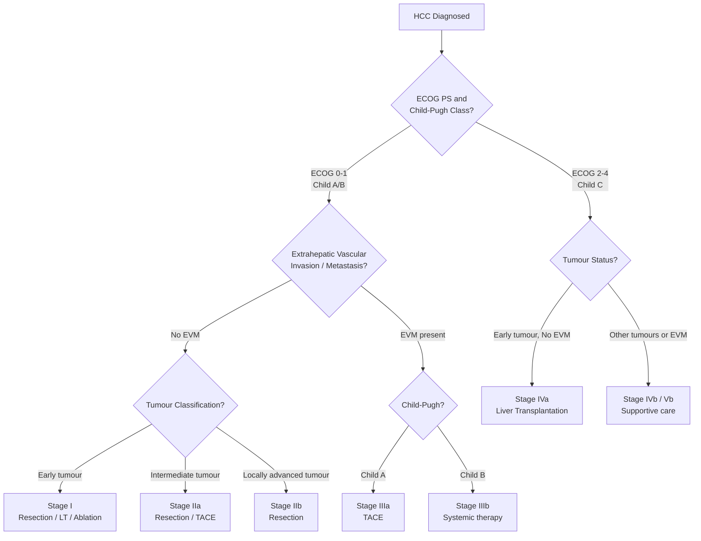
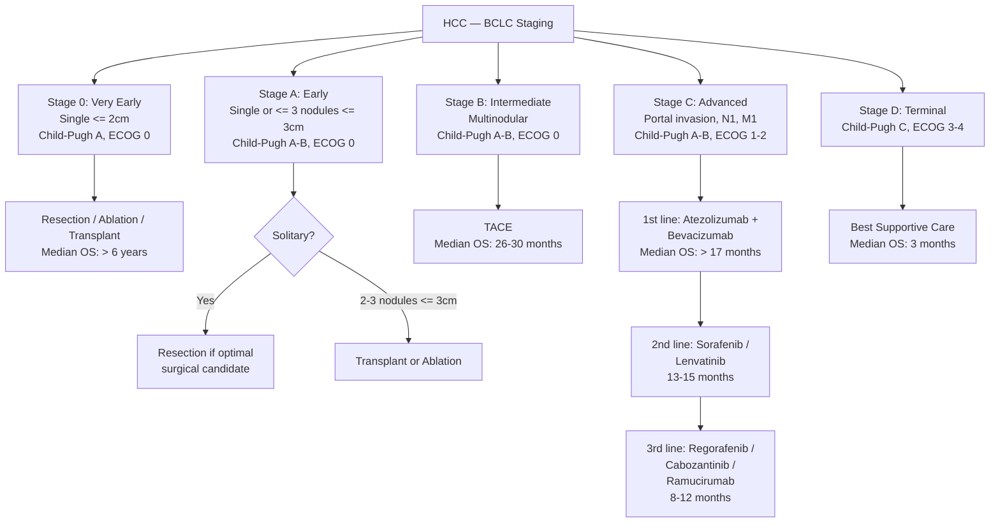
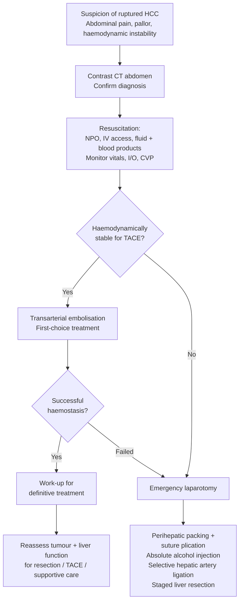

## Management of Hepatocellular Carcinoma

---

### 1. Management Principles — The "Triple Assessment"

HCC management is uniquely complex because you are always treating **two diseases simultaneously**: the cancer itself AND the underlying chronic liver disease. Before selecting any treatment, you must perform a ***triple assessment*** [3][11]:

1. ***General status*** — patient fitness (ECOG performance status), comorbidities
2. ***Tumour status*** — number, size, location, vascular invasion, extrahepatic spread
3. ***Liver function status*** — Child-Pugh class, ICG clearance, portal hypertension

This triple assessment determines whether a patient gets **curative** vs **palliative** treatment, and which specific modality is appropriate. No other solid tumour requires this level of integration between oncological staging and organ function assessment.

<Callout title="The Harsh Reality">
***Of 100 HCC patients presenting at a major centre, only about 20 will be eligible for surgery, 15 for RFA, 5 for liver transplantation, 20 for TACE, and 35 for systemic treatment only*** [11]. The majority present too late or with liver function too poor for curative therapy.
</Callout>

---

### 2. Treatment Overview

***The treatment options for HCC*** [3][11]:

**Curative options** [1][2]:
- ***Partial hepatectomy (liver resection)***
- ***Liver transplantation***
- ***Local ablation (radiofrequency ablation, etc.)***

**Palliative options** [1][2]:
- ***Transarterial oily chemoembolisation (TOCE/TACE)***
- ***Systemic therapy (sorafenib, lenvatinib, atezolizumab-bevacizumab, etc.)***
- ***Best supportive care***

***Other treatments listed by Prof Cheung*** [11]:
- ***Percutaneous intralesional alcohol injection***
- ***Local ablative therapy***

---

### 3. Management Algorithm — HKLC Staging System

The **Hong Kong Liver Cancer (HKLC) Staging System** is the locally preferred staging and treatment allocation system [1][3][11]. It is more **aggressive** than BCLC — particularly in intermediate and locally advanced disease — reflecting the high surgical expertise at centres like Queen Mary Hospital and the HBV-dominant patient population.

#### 3.1 HKLC Staging Flowchart

***The HKLC classification of liver tumour status*** [1]:

| Tumour Status | Size | Number of Nodules | Intrahepatic Venous Invasion |
|---|---|---|---|
| ***Early*** | ***≤ 5 cm*** | ***≤ 3*** | ***No*** |
| ***Intermediate*** | ≤ 5 cm AND > 3 nodules OR > 5 cm AND ≤ 3 nodules OR ≤ 5 cm, ≤ 3 with venous invasion | Various combinations with 1 adverse factor | Various |
| ***Locally advanced*** | > 5 cm AND > 3 OR diffuse | ≥ 2 adverse factors | Any |

**Key difference from BCLC**: The HKLC system offers **resection** as an option even for intermediate and locally advanced tumours (Stage IIa and IIb), whereas BCLC would recommend only TACE for intermediate (BCLC-B) and systemic therapy for advanced (BCLC-C) disease. This reflects the fact that ***multiple tumours and intrahepatic vascular invasion (e.g. main hepatic vein, left/right portal vein) are NOT considered absolute contraindications for liver resection*** [2] in Hong Kong practice.

#### 3.2 BCLC Treatment Algorithm (For Reference)

***BCLC algorithm — for reference, different from local management approach*** [2]:

---

### 4. Curative Treatment Modalities

#### 4.1 ***Partial Hepatectomy (Liver Resection)*** [1][2][4][11]

***Surgical resection is the first-choice treatment*** [4] for HCC. It offers the best chance of long-term cure for patients with preserved liver function and favourable tumour characteristics. However, ***only 20% of patients are resectable*** [4][11].

##### Indications [4][11]

***Indication for partial hepatectomy*** [11]:
1. ***Unilobular involvement***
2. ***No invasion into IVC or main portal vein***
3. ***Acceptable liver function for major hepatectomy***
   - ***Child's A***
   - ***ICG retention at 15 minutes < 14%***
4. ***No severe chronic medical illness***

##### Factors Affecting Resectability — The "Three Factors" [1][2]

| Factor | Requirements | Rationale |
|---|---|---|
| ***Liver factor*** | ***Adequate future liver remnant (FLR)***: ***≥ 30% for non-cirrhotic liver, ≥ 40% for cirrhotic liver*** [2]; assessed by **CT hepatic volumetry** [1]; ***ICG retention at 15 min < 14%*** for major resection [1][4]; ***ICG-15 < 21% for minor resection*** [2]; ***Contraindicated if Child's C or portal hypertension*** [2] | A cirrhotic liver has less regenerative capacity per unit volume → needs a larger remnant to avoid post-hepatectomy liver failure. ICG quantifies actual hepatocyte function (not just volume). |
| ***Tumour factor*** | ***Size < 5 cm is the usual threshold*** but ***tumour number and size itself is NOT a contraindication*** [1][2]; ***NO distant metastasis***; ***NO invasion of main portal vein or IVC*** [1][4] (branch portal vein invasion may still be resectable) | Larger tumours have higher risk of microvascular invasion and satellite nodules, but experienced centres can safely resect large tumours if liver function permits. Main portal vein involvement means tumour has already spread widely. |
| ***Patient factor*** | General fitness for GA; medical comorbidities (DM, renal function, cardiopulmonary reserve) [1][2] | Hepatic resection is major surgery with significant physiological stress. |

<Callout title="Resectability — Must Know!" type="error">
Students commonly make the mistake of thinking that multifocal HCC or tumours > 5 cm are absolute contraindications to resection. ***In Hong Kong practice, multiple tumours and intrahepatic vascular invasion are NOT considered absolute contraindications for liver resection*** [2]. The critical question is always: **can the remnant liver sustain life?** This is determined by FLR volume and ICG clearance.
</Callout>

##### Liver Augmentation Strategies — When FLR is Insufficient [1][2]

If the planned FLR is too small, several techniques can **grow** the remnant before definitive resection:

| Technique | Mechanism | Details |
|---|---|---|
| ***Portal vein embolisation (PVE)*** [2] | ***Obliterate portal blood flow to the tumour-bearing side*** → redirects portal flow to the future remnant → ***elicits physiological hypertrophy*** of the remnant (typically 20–40% volume increase over 4–6 weeks) | Done percutaneously under IR guidance. The embolised lobe atrophies while the remnant hypertrophies — like redirecting a river to water a field. |
| ***Portal vein ligation*** [2] | Same principle as PVE but done surgically | Usually combined with tumour resection in a staged approach. |
| ***ALPPS (Associating Liver Partition and Portal Vein Ligation for Staged Hepatectomy)*** [2] | A two-stage procedure for initially unresectable liver tumours | ***Stage 1***: ***Tumour resection from left lateral segment; ligate right portal vein but preserve right hepatic artery, hepatic vein and bile duct (to prevent liver failure during interval); parenchymal transection removes collateral portal veins → accelerated hypertrophy*** [2]. ***Stage 2***: ***Right trisectionectomy after 1–2 weeks*** [2]. This achieves much faster hypertrophy (1–2 weeks) compared to PVE (4–6 weeks), but carries higher morbidity (***risk of bile leakage*** [2]). |

##### Surgical Techniques During Hepatectomy [2]

| Technique | Purpose |
|---|---|
| ***Head up position and keep CVP low*** | ***Reduces bleeding*** — lower central venous pressure means less back-pressure in the hepatic veins, reducing intraoperative blood loss from the hepatic vein tributaries during parenchymal transection [2] |
| ***No-touch technique*** | ***Separation of hemi-liver and tumour from IVC before mobilisation*** — prevents squeezing tumour cells into the venous circulation during manipulation [2] |
| ***Pringle's manoeuvre at Foramen of Winslow*** | ***Intermittent clamping of the hepatoduodenal ligament (portal vein + hepatic artery) — 15 minutes on → 5 minutes rest*** [2] — temporarily interrupts inflow to reduce bleeding during parenchymal division. Named after J. Hogarth Pringle (1908). Intermittent clamping allows brief reperfusion to prevent ischaemic injury. |
| ***Intraoperative USG*** | ***Localise tumour*** and detect additional satellite lesions not seen on preoperative imaging [2] |
| ***Anatomical resection*** | ***Follow Couinaud segments to remove potential satellite nodules*** — HCC spreads via portal vein branches within segments, so removing the entire segment (not just the visible tumour) improves oncological clearance [2] |
| ***CUSA (Cavitron Ultrasonic Surgical Aspirator)*** | ***For parenchymal transection*** — uses ultrasonic vibration to fragment and aspirate hepatocytes while preserving vessels and bile ducts (which are more fibrous and resistant to ultrasonic disruption) [2] |

##### Outcomes [1][4][11]

| Parameter | Value |
|---|---|
| ***Operative mortality*** | ***1–5%*** [4]; ***< 5%*** [1][2] |
| ***Morbidity*** | ***~30%*** [1] |
| ***5-year overall survival*** | ***40–50%*** [1][4][11] |
| ***5-year disease-free survival*** | ***~25%*** [4] |
| ***5-year recurrence rate*** | ***~50%*** [1] — mainly due to ***"field cancerisation"*** and intrahepatic metastasis via portal vein [4] |

***Postresection recurrence occurs in about 50% (mainly in the liver remnant due to intrahepatic metastasis via portal vein or multicentric tumours)*** [4]. Recurrence is classified as:
- ***Intrahepatic metastasis*** (< 2 years after resection) — tumour cells that had already invaded portal vein branches before surgery [2]
- ***De novo HCC*** (> 2 years after resection) — new primary arising from the "field cancerisation" effect of the underlying chronic liver disease [2]

##### Post-Resection Surveillance [2][4]

***Need regular 3-monthly surveillance with serum AFP and CT scan for recurrence*** [4]:
- ***Imaging (USG alternating with CT) + AFP — follow-up every 3 months for 2 years, then every 6 months until 5 years*** [2]
- ***Early detection of recurrence allows treatment with re-resection, TACE, or ablation*** [4]

##### Post-Operative Complications [2]

| Complication | Definition/Details |
|---|---|
| ***Bile leakage*** | ***Drain bilirubin concentration ≥ 3× serum bilirubin on or after post-op Day 3*** [2] |
| ***Post-hepatectomy liver failure*** | ***Day 5 bilirubin > 50 µmol/L AND INR > 1.7 ("50-50 rule")*** = high risk of liver failure [2]. This is because the remnant liver is unable to adequately conjugate bilirubin and synthesise clotting factors by Day 5. |
| ***Ischaemic damage to liver remnant*** | ***Prolonged rotation → twisting of inflow and outflow pedicles*** [2] |

---

#### 4.2 ***Liver Transplantation*** [1][2][4][11]

Liver transplantation is the only treatment that addresses **both** the tumour AND the underlying liver disease (removes the diseased liver entirely and replaces it with a healthy one). This eliminates the problem of "field cancerisation" and treats the portal hypertension/cirrhosis simultaneously.

##### Indications [4][11]

***Liver transplantation is indicated for*** [4][11]:
- ***HCC < 5 cm solitary tumour (or < 3 cm if 2–3 tumours)*** [4][11] — i.e. **Milan criteria**
- ***With no macroscopic venous invasion in imaging studies*** [4]
- ***Especially for those in association with cirrhosis*** [4] — patients with poor liver function (Child B/C) who are NOT candidates for resection
- ***≤ 65 years with Child C cirrhosis / unresectable HCC who meet transplant criteria*** [2]

##### Transplant Criteria [1][2]

| Criteria | Details | Role |
|---|---|---|
| ***Milan criteria*** [1] | ***Single lesion ≤ 5 cm in diameter OR ≤ 3 lesions each ≤ 3 cm; NO gross vascular invasion (portal vein thrombosis); NO regional nodal or distant metastasis*** | ***Bonus score on waitlist if fulfilled; > 75% 5-year survival*** [2] |
| ***UCSF criteria*** [1] | ***Single lesion ≤ 6.5 cm OR ≤ 3 lesions each ≤ 4.5 cm, sum of diameters ≤ 8.0 cm*** | ***Drop-off criteria: only those fulfilled remain on the waitlist*** [2]; slightly more generous than Milan |
| ***MELD score*** [2] | ***Uses Creatinine (hepatorenal syndrome), Bilirubin, INR ± Na*** | ***Prioritises the waitlist — benefit if score > 18*** [2]; continuous scale with no subjective measurements, superior to Child-Pugh for allocation |

##### Contraindications [1][2][4]

***NOT for tumours > 5 cm, presence of macroscopic venous invasion, or presence of distant metastasis*** [4]:
- ***Tumours > 5 cm in diameter*** [1]
- ***Presence of distant metastasis*** [1]
- ***Presence of macroscopic venous invasion (portal vein thrombosis)*** — ***high recurrence rate due to circulating tumour cells*** [1]
- ***Active uncontrolled infection*** [2]
- ***Active alcohol/substance abuse*** [2]

##### Bridging Therapy [2]

***Bridging therapy (e.g. RFA, TACE) is possible to shrink the disease to fulfil transplant criteria, and to prevent tumour progression whilst waiting for transplant*** [2]. The waiting time for a deceased donor liver in HK can be prolonged (median ~12 months), during which the tumour may grow beyond transplant criteria. Bridging therapy keeps the tumour in check.

***HBV carriers: antivirals × 2 months before transplant + long-term HBIG after transplant*** [2] — to prevent HBV reinfection of the graft.

##### Types of Transplant

- **Deceased Donor Liver Transplant (DDLT)**: whole liver from a brain-dead donor
- **Living Donor Liver Transplant (LDLT)**: right lobe graft from a living donor (exploits the liver's regenerative capacity — both the donor remnant and recipient graft regenerate to near-normal volume within weeks). Particularly important in HK given the **chronic shortage** of deceased donor organs.

##### Complications of Transplant [2]

| Complication | Details |
|---|---|
| ***Graft failure*** | Primary non-function or early dysfunction |
| ***Acute and chronic rejection*** | Immune-mediated graft injury despite immunosuppression |
| ***Vascular complications*** | ***Hepatic artery or portal vein thrombosis, IVC obstruction*** |
| ***Immunosuppression-related*** | ***Hypertension, DM, hyperlipidaemia, osteoporosis, infection*** |
| **HCC recurrence** | Even within criteria, recurrence rate is ~10–15% at 5 years; AFP > 1000 at transplant is a risk factor |

##### Outcomes [11]

***5-year survival rate for transplantation: 75%*** [11] — the best long-term survival of any HCC treatment, because the entire diseased liver is removed.

---

#### 4.3 ***Local Ablation*** [1][2][4]

Ablation destroys tumour tissue **in situ** using various energy sources, without removing it surgically. It is ***potentially curative*** for small tumours and is also used as ***bridge therapy to transplant*** or ***palliative treatment*** [2].

##### ***Radiofrequency Ablation (RFA)*** — ***Most commonly used modality*** [1]

- ***Insert a single needle electrode into the tumour via percutaneous, laparoscopic, or open route and induce tumour destruction by heating tissue to temperatures exceeding 60°C*** [1]
- At > 60°C, irreversible protein denaturation occurs → coagulative necrosis
- ***Heating to even higher temperatures will lead to char formation which is a heat insulator and decreases effectiveness in heat transmission*** [1] — this is why there's a "sweet spot" of temperature

**Indications** [2]:
- ***Small single tumour < 2 cm*** (as alternative to resection — ***resection is preferred if 2–5 cm*** [2])
- ***Inoperable solitary HCC < 5 cm***
- ***Inoperable ≤ 3 nodules ≤ 3 cm where transplant not feasible*** [2]

**Contraindications** [2]:
- ***Too close to major vessels*** (heat-sink effect — flowing blood in adjacent large vessels dissipates heat, reducing ablation efficacy and increasing risk of incomplete treatment)
- ***Too close to major bile ducts*** (risk of bile duct injury → stricture)
- ***Too close to diaphragm*** (if percutaneous route — risk of diaphragmatic injury/pneumothorax)

**Complications** [2]:
- ***Bile duct injury***
- ***Thermal injury to surrounding tissues***

**5-year survival rate: 40%** [11]

##### Other Ablative Techniques [1]

| Technique | Key Features |
|---|---|
| ***High-intensity focused ultrasound (HIFU)*** [1] | ***Not a standard treatment but currently practised at QMH*** [1]; uses ***externally generated sonic waves*** to create a sharply delineated area of thermal energy; ***advantages over RFA: favourable in patients with ascites, precise localisation, no adhesions in subsequent operations, no needle tracks*** [1] |
| ***Percutaneous ethanol injection (PEI)*** [4] | ***USG-guided injection of absolute ethanol into tumour***; causes chemical coagulative necrosis by dehydrating tumour cells, denaturing proteins, and inducing microvascular thrombosis; ***used for lesions ≤ 3 cm, number ≤ 3*** [1]; ***NOT used at QMH*** since ***injection of liquid into solid leads to leakage requiring multiple sessions, and alcohol is irritant to liver capsule and peritoneum*** [1]; ***5-year survival: 20%*** [11] |
| **Microwave ablation** | Similar principle to RFA but uses microwave energy; heats tissue faster and achieves larger ablation zones; less susceptible to heat-sink effect |
| **Cryoablation** | Freezes tumour tissue using argon gas to −40°C; less commonly used due to cryoshock complications |

---

### 5. Palliative Treatment Modalities

#### 5.1 ***Transarterial Chemoembolisation (TACE)*** [1][2][4][11]

TACE is the **cornerstone palliative treatment** for unresectable HCC. Understanding TACE requires understanding the dual blood supply concept:

- Normal liver → 75% portal vein, 25% hepatic artery
- HCC → > 90% hepatic artery
- TACE exploits this difference: you deliver chemotherapy + embolisation via the hepatic artery → selectively kills tumour while relatively sparing normal parenchyma (which survives on portal venous flow)

##### Procedure [1][2]

1. ***Access via femoral artery*** through aorta into the ***coeliac trunk and hepatic artery*** [1]
2. ***Chemotherapeutic agents (e.g. cisplatin, doxorubicin)*** are ***directly infused into hepatic artery branches that feed the tumours*** [1][2] — this is **regional chemotherapy** that ***minimises systemic drug adverse effects as they are subject to first-pass effect*** [1]
3. ***Agents are mixed with lipiodol by emulsification*** [1] — ***lipiodol is an oily contrast agent that promotes intratumoural chemotherapy retention*** because ***lipiodol is retained in HCC as HCC does not contain Kupffer cells and lymphatics to ingest lipiodol*** [1]
4. ***Partial embolisation of the major tumour artery with gelfoam*** [1][2]:
   - ***Promotes tumour necrosis by decreasing blood supply***
   - ***Delays flushing out of agents to prevent rapid clearance of chemotherapy*** [1]

##### Indications [1][4][11]

***Indications for TOCE*** [11]:
1. ***Bilobar involvement without distant spread, without complete portal vein obstruction or IVC involvement***
2. ***Unilobular involvement but liver function not acceptable for hepatectomy***

More specifically [1]:
- Unresectable tumours (bilobar or unilobar with inadequate liver function)
- ***Reasonable liver function*** (***bilirubin < 50 µmol/L*** [4]) — to prevent liver failure from ischaemic damage
- ***NO evidence of vascular invasion (IVC or portal vein)*** [1]
- ***NO distant metastasis*** [1]
- ***Subsequent cycles of TACE should be performed at 3–4 month intervals*** [1]

##### Contraindications [1][2]

***Contraindications to TACE*** [1]:
- ***Distant metastasis*** [1]
- ***Moderate or severe liver function impairment*** — ***Child-Pugh Class C*** [1][2]
- ***Portal vein thrombosis*** — ***embolisation of hepatic artery will lead to liver ischaemia in the presence of complete obstruction of the portal vein*** [1] (because the non-tumorous liver is then entirely dependent on the hepatic artery; embolise that, and the entire liver dies)
- ***AV shunting around the tumour*** [1]:
  - ***Shunting to portal vein is acceptable***
  - ***Shunting to hepatic vein is contraindicated since systemic lipiodol embolus can potentially cause pulmonary embolism*** [1]
- ***Diffuse HCC*** — ***response is very unlikely*** [1]

##### Complications [2]

| Complication | Mechanism |
|---|---|
| ***Post-embolisation syndrome (within 14 days)*** | ***Liver injury due to tumour lysis or ischaemic damage to normal liver tissue; S/S: fever, RUQ pain, anorexia; resolves spontaneously after 1 week*** [2] |
| ***Liver failure*** | ***Infarction of normal liver tissues*** [2] — if too much normal parenchyma is embolised |
| ***Bile duct injury*** [2] | Ischaemic damage to biliary epithelium |
| ***GI bleeding*** | ***Cytotoxic reflux into other arterial supply to stomach*** [2] — if chemotherapy refluxes into the left gastric or gastroduodenal artery during injection |

##### Outcomes

***5-year survival rate for TACE: 10–25%*** [4][11]

---

#### 5.2 ***Transarterial Radioembolisation (TARE)*** [1][2]

***TARE uses Yttrium-90 microspheres (TheraSphere) which induce extensive tumour necrosis with acceptable safety profile*** [1].

- ***Radioactive microspheres are directly injected into hepatic artery branches that supply the tumour and deliver doses of high-energy, low-penetration radiation selectively to the tumour*** [1]
- Y-90 is a pure β-emitter with a tissue penetration of only ~2.5 mm — so radiation is highly localised to the tumour bed

**Key advantage over TACE**:
- ***Preferred over TACE ONLY in the setting of HCC complicated by malignant branch or lobar portal vein thrombosis*** [1] — ***less arterial ischaemia induced by radioembolisation because of the smaller particle size, suggesting it should be safer in the setting of portal vein thrombosis*** [1]
- This is a critical distinction: TACE is contraindicated in portal vein thrombosis, but TARE can be used because the microspheres are smaller and cause less occlusion of the hepatic artery.

---

#### 5.3 ***Systemic Therapy*** [1][2][11]

For patients with ***advanced or metastatic disease*** where curative treatments and TACE are not feasible.

##### Historical Context [11]

***Previously used therapies*** [11]:
- ***Chemotherapy (doxorubicin)*** — minimal benefit
- ***Hormonal therapy (tamoxifen, octreotide)*** — no proven benefit
- ***Immunotherapy (interferon)*** — no proven benefit

These were essentially ***treatments of unproven benefit*** [4].

##### Current Systemic Therapy Landscape (2019–2026) [1][2][11]

| Agent | Class | Line | Key Details |
|---|---|---|---|
| ***Atezolizumab + Bevacizumab*** | Anti-PD-L1 + anti-VEGF | **1st line** (current standard of care, IMBRAVE-150 trial) | Superior to sorafenib; median OS ~19 months; now the global standard 1st-line therapy |
| ***Sorafenib*** [1][2][4][11] | ***Multi-kinase inhibitor*** (targets Raf, VEGF, PDGF) [2] | 2nd line (or 1st if immunotherapy CI) | ***Prolongs survival by ~3 months*** [1][2] (SHARP trial); ***Side effects: hand-foot syndrome (acral erythema/palmar-plantar erythrodysaesthesia) (10%), fatigue, diarrhoea*** [1] |
| ***Lenvatinib*** [1][11] | Multi-kinase inhibitor | 2nd line (or 1st if atezo-bev CI) | ***Reasonable 1st-line alternative especially for patients who cannot tolerate sorafenib*** [1]; non-inferior to sorafenib (REFLECT trial) |
| ***Regorafenib*** [2][11] | Multi-kinase inhibitor | 2nd/3rd line | For patients who progressed on sorafenib |
| ***Cabozantinib*** [2][11] | Multi-kinase inhibitor (MET, VEGFR, AXL) | 2nd/3rd line | CELESTIAL trial |
| ***Ramucirumab*** [2] | Anti-VEGFR2 monoclonal antibody | 2nd line if AFP ≥ 400 | REACH-2 trial |
| ***Nivolumab*** [1][11] | ***Immune checkpoint inhibitor — fully human monoclonal antibody targeting PD-1 receptor, restoring T-cell immune activity directed against tumour cells*** [1] | 2nd/3rd line | Also ***pembrolizumab*** (similar mechanism) |
| **Durvalumab + Tremelimumab** | Anti-PD-L1 + anti-CTLA-4 | 1st line (HIMALAYA trial) | Alternative 1st-line immunotherapy regimen |

<Callout title="Sorafenib — Break Down the Mechanisms" type="idea">
Sorafenib = "sora-" (from Raf kinase) + "-fenib" (kinase inhibitor suffix). It blocks:
1. **Raf/MEK/ERK** pathway → inhibits tumour cell proliferation
2. **VEGFR** → inhibits angiogenesis (cuts off blood supply)
3. **PDGFR** → inhibits tumour stroma formation

The hand-foot syndrome occurs because the drug concentrates in the capillary beds of palms/soles (areas of high pressure and friction), causing keratinocyte damage → painful erythema, blistering, and desquamation.
</Callout>

---

### 6. ***Management of Ruptured HCC*** [2][4][11]

***Ruptured HCC is a surgical emergency*** occurring in ***5–10% of HCC patients*** [2], typically in ***large, peripherally located tumours*** [2].

##### Pathogenesis [2]
- ***Increased intra-tumoural pressure with occlusion of hepatic veins by tumour thrombi or invasion***
- ***Rapid tumour growth and necrosis***
- ***Vascular dysfunction → friable vessels***

##### Clinical Features [2]
- ***Sudden onset of epigastric pain with abdominal distension***
- ***Hypovolaemic shock***
- ***Increased likelihood of peritoneal seeding***
- ***Prognosis poor: mortality 25–100%***

##### Management Algorithm [11]

***First-choice treatment for ruptured HCC is transarterial embolisation (TAE)*** [4][2]:
- ***TAE if portal vein is patent and reasonable liver function*** [2]
- ***Complications of TAE: liver failure, embolism, arterial dissection*** [2]

***If uncontrolled bleeding — laparotomy*** [4]:
- ***Perihepatic packing + suture plication (small bleeding site only)***
- ***Absolute alcohol injection***
- ***Selective hepatic artery ligation (HAL)***
- ***Staged liver resection*** [2]

Acute management principles [2]:
- ***Admit ICU***
- ***NPO, IV access, fluid resuscitation ± blood products transfusion, monitor vitals, I/O, CVP***
- ***CBC, LRFT, clotting, cross-match, HBsAg (may need entecavir cover)***
- ***CXR, USG***
- ***CT scan when stabilised to rule out portal vein thrombosis*** [2]

---

### 7. Outcomes Summary

***Long-term survival rates*** [11]:

| Treatment | 5-Year Survival |
|---|---|
| ***Liver transplantation*** | ***75%*** |
| ***Partial hepatectomy*** | ***50%*** |
| ***Radiofrequency ablation*** | ***40%*** |
| ***TACE*** | ***25%*** |
| ***Alcohol injection*** | ***20%*** |
| ***Advanced HCC with supportive treatment*** | ***Median survival 2–4 months*** [4] |

---

### 8. Best Supportive Care

For ***BCLC Stage D (Child-Pugh C, ECOG 3–4)*** or ***HKLC Stage Vb***.

- **Symptom management**: pain control (WHO analgesic ladder), management of ascites (diuretics, paracentesis), encephalopathy (lactulose, rifaximin), nutritional support
- **Palliative care referral**
- ***Median survival: 3 months*** [2]

---

<Callout title="High Yield Summary">

**Triple assessment before treatment**: General status (ECOG) + Tumour status (number, size, vascular invasion, metastasis) + Liver function (Child-Pugh, ICG, MELD).

**Curative treatments (3)**: Hepatic resection, RFA, Liver transplantation.

**Resection** (1st choice, 20% eligible): Requires unilobar disease, no main PV/IVC invasion, Child A, ICG-R15 < 14%. FLR ≥ 30% (non-cirrhotic) / ≥ 40% (cirrhotic). 5-year survival 50%, recurrence 50% (field cancerisation). In HK, multiple tumours and intrahepatic vascular invasion are NOT absolute contraindications.

**Transplant**: Milan criteria (single ≤ 5 cm or ≤ 3 each ≤ 3 cm, no macrovascular invasion, no mets). 5-year survival 75%. Bridging therapy with RFA/TACE while waiting.

**RFA**: For small tumours (< 5 cm), inoperable. Preferred over PEI. Avoid near major vessels/bile ducts.

**TACE**: Unresectable + reasonable liver function + no main PV thrombosis + no distant mets. Contraindicated in Child C, PVT, AV shunting to hepatic vein, diffuse HCC.

**TARE (Y-90)**: Preferred over TACE when portal vein thrombosis is present (smaller particles → less ischaemia).

**Systemic therapy**: 1st line = Atezolizumab + Bevacizumab (2026 standard). 2nd line = Sorafenib/Lenvatinib. 3rd line = Regorafenib/Cabozantinib.

**Ruptured HCC**: Emergency. First-choice = TAE. If fails → laparotomy (packing, HAL, staged resection).

**Of 100 patients**: 20 surgery, 15 RFA, 5 transplant, 20 TACE, 35 systemic/supportive only.

</Callout>

---

<ActiveRecallQuiz
  title="Active Recall — HCC Management"
  items={[
    {
      question: "What are the 3 curative treatment options for HCC, and what are the key indications for each?",
      markscheme: "1. Hepatic resection: unilobar, no main PV/IVC invasion, Child A, ICG-R15 <14%, adequate FLR. 2. Liver transplantation: meets Milan criteria (single <=5cm or <=3 nodules each <=3cm, no macrovascular invasion, no distant mets), especially with decompensated cirrhosis. 3. Radiofrequency ablation: small tumour <5cm (preferably <2cm as alternative to resection), inoperable, or as bridge to transplant."
    },
    {
      question: "List the contraindications to TACE and explain the rationale for each.",
      markscheme: "1. Portal vein thrombosis: embolising hepatic artery removes the only remaining blood supply to non-tumorous liver (since PV already blocked) causing liver ischaemia/failure. 2. Child-Pugh C: insufficient liver reserve to tolerate ischaemic damage. 3. Distant metastasis: palliative local therapy pointless with systemic disease. 4. AV shunting to hepatic vein: lipiodol embolus can enter systemic circulation causing pulmonary embolism. 5. Diffuse HCC: response very unlikely."
    },
    {
      question: "Describe the TACE procedure step by step and explain the rationale for each component.",
      markscheme: "1. Access via femoral artery to coeliac trunk and hepatic artery. 2. Inject chemotherapy (cisplatin/doxorubicin) directly into tumour-feeding arteries (regional chemotherapy minimising systemic toxicity via first-pass effect). 3. Emulsify chemo with lipiodol (retained in HCC due to absent Kupffer cells, promoting prolonged drug retention). 4. Embolise tumour artery with gelfoam (promotes tumour necrosis by ischaemia and delays chemotherapy clearance)."
    },
    {
      question: "What is the Milan criteria for liver transplantation in HCC? State the expected 5-year survival.",
      markscheme: "Milan criteria: Single lesion <=5cm OR <=3 lesions each <=3cm, NO gross macrovascular invasion (portal vein thrombosis), NO regional nodal or distant metastasis. Expected 5-year survival >75%."
    },
    {
      question: "Why is TARE preferred over TACE when portal vein thrombosis is present?",
      markscheme: "TARE uses Y-90 microspheres which are smaller than gelfoam particles used in TACE. The smaller particles cause less arterial occlusion/ischaemia, making TARE safer when the portal vein is already thrombosed. TACE would completely cut off blood supply to non-tumorous liver (portal vein blocked + hepatic artery embolised = total ischaemia), whereas TARE delivers radiation without significant arterial occlusion."
    },
    {
      question: "Describe the management algorithm for ruptured HCC.",
      markscheme: "1. Resuscitate: NPO, IV access, fluids, blood products, ICU admission. 2. Confirm diagnosis with contrast CT. 3. If haemodynamically stable: transarterial embolisation (TAE) is first-choice treatment. 4. If TAE fails or patient haemodynamically unstable: emergency laparotomy with perihepatic packing, suture plication, absolute alcohol injection, selective hepatic artery ligation, or staged liver resection. 5. After stabilisation: work-up for definitive treatment (reassess tumour and liver function)."
    }
  ]}
/>

## References

[1] Senior notes: felixlai.md (HCC — Treatment, Case Study, Prevention sections)
[2] Senior notes: maxim.md (HCC — Management overview, Liver resection, Liver transplantation, Local ablation, TACE, Ruptured HCC sections)
[3] Lecture slides: HCC and Gallstone acute cholangitis_Prof TT Cheung.pdf (p. 25, 73, 74 — Treatment protocol, HKLC staging)
[4] Lecture slides: WCS 064 - A large liver - by Prof R Poon [20191108].doc.pdf (p. 4 — Treatment)
[10] Lecture slides: Advanced liver surgery for HBP malignancy_ACY Chan.pdf (p. 7 — BCLC staging)
[11] Lecture slides: HCC and Gallstone acute cholangitis_Prof TT Cheung.pdf (p. 24, 33, 42, 64, 65, 66, 67 — Treatment modalities, indications, outcomes, systemic therapy)
