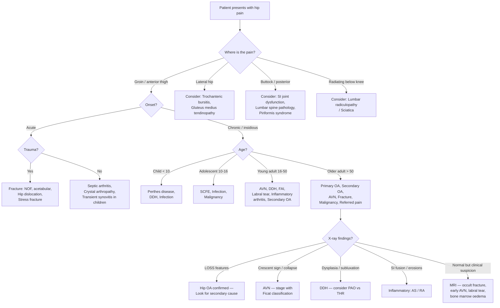

## Differential Diagnosis of Hip Pain

The first learning outcome of the hip arthritis lecture is to ***formulate differential diagnosis for patients with hip pain*** [1]. This is critical because "hip pain" is a **symptom, not a diagnosis** — and many conditions masquerade as hip OA. Your job is to systematically work through the possibilities, guided by the patient's age, pain location, onset, and associated features.

### The Approach — Think Anatomically, Then by Aetiology

Hip pain can originate from:
1. **Intra-articular structures** (the hip joint itself) — cartilage, synovium, labrum, bone
2. **Periarticular structures** (around the hip) — bursae, tendons, muscles
3. **Referred sources** (distant pathology projecting pain to the hip) — lumbar spine, sacroiliac joint, knee, abdomen/pelvis

The senior notes explicitly list the **DDx for hip OA**: ***fractures, sciatica, trochanteric bursitis, gluteus medius tendinopathy*** [2]. Let's expand this into a comprehensive, exam-ready framework.

---

### Systematic Differential Diagnosis by Category

#### A. Intra-articular Causes (Pain from Within the Hip Joint)

| Condition | Key Distinguishing Features | Why It Mimics OA |
|---|---|---|
| **Hip OA** (the index diagnosis) | Chronic groin pain, mechanical pattern (worse with activity, better with rest), morning stiffness < 30 min, LOSS on X-ray | — |
| **Avascular necrosis (AVN)** | Younger patient; risk factors (***steroids > 20 mg/day***, ***alcohol***, ***trauma — femoral neck fracture 15–50%, hip dislocation 10–25%***, ***caisson disease***, ***sickle cell***) [1]; insidious groin pain; limited **abduction and internal rotation** [5]; X-ray: osteopenia → sclerosis → ***crescent sign***; MRI: ***double-line sign*** on T2W [5] | Both cause deep groin pain with restricted ROM. AVN may progress to secondary OA, so early AVN can look identical. The key is the **risk factor profile** and **MRI findings before X-ray changes appear**. |
| **Inflammatory arthritis (RA, AS)** | RA: morning stiffness **> 60 min**, polyarticular, systemic features (fatigue, fever), RF+/anti-CCP+, juxta-articular osteopenia and erosions on X-ray. AS: young male (< 40), insidious back pain improving with exercise, HLA-B27+, ***fusion of SI joint*** on X-ray [2]; bilateral hip involvement common | Inflammatory arthritis can cause secondary hip OA. Distinguished by prolonged morning stiffness, systemic features, and lab/imaging findings. |
| ***Infection — septic arthritis / old TB hip*** [1] | **Septic arthritis**: acute onset, fever, very painful joint held in flexion/ER, unable to weight-bear, elevated WCC/CRP/ESR, **joint aspiration is diagnostic** (purulent fluid, WCC > 50,000, culture +). ***Old TB hip***: chronic, indolent; may present with secondary OA changes years later; look for ***soft-tissue swelling, joint capsular distension (with widening of joint space or even subluxation)***, and ***radiographic changes in proximal femoral metaphysis suggesting osteomyelitis*** on X-ray [6]; ***MRI may be the most useful test to distinguish proximal femoral osteomyelitis from septic arthritis*** [6] | Septic arthritis is an emergency — don't confuse acute joint pain for an OA flare. TB hip is historically important in HK and causes chronic destruction mimicking OA. |
| ***Crystal deposition — gout / pseudogout*** [1] | Acute flares of severe pain, swelling, erythema. Gout: elevated urate, needle-shaped negatively birefringent crystals on aspirate. Pseudogout (CPPD): chondrocalcinosis on X-ray, rhomboid-shaped weakly positively birefringent crystals | Crystal arthropathy can cause acute-on-chronic hip pain. The hip is an unusual site for gout but is recognised. |
| ***Neuropathic arthropathy (Charcot joint)*** [1] | Grossly destructive joint changes with relatively **less pain than expected** (pain-sensation mismatch). Causes: diabetes (most common in foot), tabes dorsalis (syphilis — hip/knee), syringomyelia | Loss of proprioception and pain → unregulated mechanical stress → rapid joint destruction. X-ray shows dramatic destruction with debris, subluxation, and disorganisation. |
| **Acetabular labral tear** | Young active adults; mechanical symptoms (clicking, catching, giving way); groin pain worse with pivoting/twisting; positive anterior impingement test (FADIR: Flexion-Adduction-Internal Rotation reproduces groin pain); MR arthrogram diagnostic | Can coexist with early OA or FAI. Pain pattern overlaps with early OA but the mechanical symptoms (clicking/catching) are a key distinguishing feature. |
| **Femoroacetabular impingement (FAI)** | Young adults; cam type (femoral head asphericity) or pincer type (acetabular over-coverage); groin pain with prolonged sitting and activity; positive FADIR test; alpha angle > 55° on X-ray/MRI | FAI is a **pre-arthritic condition** that predisposes to OA. Important to identify early because corrective surgery may delay OA. |
| **DDH (in adults)** | Young women; groin pain; X-ray shows ***hip dysplasia (inadequate acetabular coverage)*** [2], broken Shenton's line, subluxation; may present with early secondary OA | DDH causes secondary OA through increased contact stress over a smaller area. Management: ***periacetabular osteotomy before OA changes; THR if secondary OA established*** [1]. |
| **Fractures** [2] | **Femoral neck fracture**: elderly with osteoporosis (fragility fracture) or young with high-energy trauma; acute onset; ***shortened, abducted, externally rotated leg*** [7]; unable to weight-bear; disrupted Shenton's line on X-ray. **Stress/insufficiency fracture**: insidious onset in runners or osteoporotic elderly; normal X-ray initially → MRI diagnostic | Acute fracture is usually obvious. Beware the **occult/stress fracture** with insidious onset that may be mistaken for OA — if X-ray is normal but suspicion is high, get an MRI. |
| **Perthes disease / SCFE** (paediatric) | **Perthes**: boys aged 5–10, hip pain, limited IR and abduction, X-ray: flattening/sclerosis/fragmentation of femoral epiphysis [8]. **SCFE**: obese boys aged 10–15, hip pain radiating to knee, loss of IR/abduction/flexion, X-ray: posterior displacement of epiphysis [8] | In children/adolescents with hip pain — always think of these. Both can present with referred knee pain. Perthes leads to deformed femoral head → secondary OA in adulthood. |

#### B. Periarticular Causes (Pain from Around the Hip)

| Condition | Key Distinguishing Features | Why It's in the DDx |
|---|---|---|
| ***Trochanteric bursitis / Greater trochanteric pain syndrome (GTPS)*** [2] | **Lateral hip pain** over the greater trochanter; tenderness on direct palpation of the greater trochanter; pain lying on the affected side at night; **full hip ROM on examination** (unlike OA where ROM is restricted); no groin pain | This is one of the most common conditions confused with hip OA. The key differentiator is **pain location** — lateral (trochanteric) vs. groin (intra-articular OA) — and **preserved ROM**. |
| ***Gluteus medius tendinopathy*** [2] | Very similar to trochanteric bursitis; lateral hip pain; may have weakness of hip abduction (resisted abduction reproduces pain); often seen in middle-aged women | Now considered part of the GTPS spectrum. Distinguished from OA by lateral (not groin) pain and preserved passive ROM. Can coexist with hip OA. |
| **Iliopsoas bursitis/tendinopathy** | Anterior groin pain worse with hip flexion against resistance; may have snapping ("snapping hip" — the iliopsoas tendon flicks over the iliopectineal eminence) | The groin pain can mimic hip OA, but ROM is usually preserved and pain is specifically reproduced by resisted flexion. |
| **Adductor strain** | Medial thigh/groin pain; tenderness over adductor origin (pubic tubercle); pain on resisted adduction | Common in athletes. Pain location overlaps with hip OA but onset is usually acute/subacute after a sporting event. |

#### C. Referred Pain (Distant Pathology Projecting to the Hip)

| Condition | Key Distinguishing Features | Why It's in the DDx |
|---|---|---|
| ***Sciatica / Lumbar radiculopathy*** [2][9] | Pain radiates **below the knee**, follows a dermatomal distribution (L4/L5/S1); numbness, tingling; positive straight leg raise (SLR); may have neurological deficit (weakness, reflex changes); **hip ROM is full** | ***Sciatica is a non-specific term describing a variety of leg and back symptoms*** [9]. Radiculopathy at L5–S1 from a herniated disc causes ***sharp or burning pain that radiates down the posterior or lateral aspect of the leg, usually to the foot or ankle*** [9]. The key is that hip examination is **normal** — full ROM, no groin tenderness. |
| **Lumbar spinal stenosis** | Neurogenic claudication: bilateral leg heaviness/pain with walking, relieved by sitting or leaning forward (flexion opens the spinal canal); often elderly | Can mimic the "activity-related leg pain" of hip OA. Distinguished by the positional relief (flexion) and bilateral symptoms. |
| **Sacroiliac joint dysfunction** | Posterior buttock pain; tenderness over SI joint; positive SI joint provocation tests (FABER/Patrick test, compression, distraction); associated with AS, post-partum | Pain is posterior, not groin. FABER test: Flexion-Abduction-External Rotation — SI joint pain is at the posterior SI joint, not the groin (though this test also stresses the hip). |
| **Meralgia paraesthetica** | Burning/tingling over the **anterolateral thigh**; caused by compression of the lateral femoral cutaneous nerve (L2–L3) at the inguinal ligament; risk factors: obesity, tight belts, diabetes | Purely sensory — no motor deficit, no hip ROM restriction. The anterolateral thigh location and paraesthetic quality distinguish it from OA pain. |
| **Vascular claudication** | Calf pain (not usually hip/groin) on walking, relieved by standing still; absent/diminished peripheral pulses; atherosclerotic risk factors (smoking, diabetes, hypertension) | Distinguished from hip OA by the pain pattern (calf, not groin), relief by standing (not by sitting as in neurogenic claudication), and vascular examination findings. |
| **Intra-abdominal/pelvic pathology** | Inguinal hernia, femoral hernia, ovarian pathology, ectopic pregnancy, psoas abscess, retroperitoneal tumour, nephrolithiasis | These are important "don't miss" diagnoses. A psoas abscess (TB!) can present with hip flexion pain and a flexed posture of the hip. |

<Callout title="Don't Forget: Referred Pain from the Lumbar Spine" type="error">
***Mechanical back pain accounts for 97% of lower back pain*** [10]. The lumbar spine is an extremely common source of referred hip/buttock pain. Always examine the lumbar spine when assessing a patient with hip pain — check for back tenderness, SLR, neurological deficit. If hip ROM is full and the pain pattern follows a dermatomal distribution, the problem is likely the spine, not the hip.
</Callout>

---

### Age-Based Approach to Differential Diagnosis

This is particularly useful in clinical practice and exams. The patient's age **dramatically** narrows the differential [8]:

| Age Group | Differential Diagnoses to Consider |
|---|---|
| **0–5 years** | DDH, septic arthritis, transient synovitis ("irritable hip") |
| **5–10 years** | **Perthes disease**, septic arthritis, osteomyelitis, transient synovitis |
| **10–16 years** | **SCFE**, avulsion fracture, infection (osteomyelitis/septic arthritis), malignancy (osteosarcoma, Ewing's sarcoma) |
| **Young adults (16–40)** | FAI, labral tear, DDH (secondary OA), AVN, inflammatory arthritis (AS, RA), stress fracture, infection (TB) |
| **Middle-aged (40–65)** | **Primary or secondary OA**, AVN, GTPS/gluteus medius tendinopathy, inflammatory arthritis, referred spinal pain |
| **Elderly ( > 65)** | **Primary OA**, femoral neck fracture (fragility), metastatic disease, Paget's disease, spinal stenosis |

---

### Decision Flowchart — Approach to Hip Pain DDx

---

### Key Distinguishing Features — Summary Table for Exams

| Feature | Hip OA | AVN | Septic Arthritis | GTPS | Lumbar Radiculopathy |
|---|---|---|---|---|---|
| **Pain location** | Groin → anterior thigh/knee | Groin | Groin (deep) | Lateral hip (GT) | Buttock → posterior thigh → below knee |
| **Onset** | Chronic, insidious | Subacute/chronic | **Acute** (hours) | Subacute/chronic | Acute or chronic |
| **Systemic features** | None | None | **Fever, ↑WCC, ↑CRP** | None | None |
| **ROM** | **Restricted** (IR first) | **Restricted** (IR, abduction) | **Severely restricted**, held in flexion/ER | **Full** (passive ROM normal) | **Full** hip ROM |
| **Key investigation** | X-ray (LOSS) | MRI (double-line sign) | Joint aspiration | Clinical diagnosis ± US | MRI lumbar spine |
| **Age peak** | Elderly (primary); any age (secondary) | 30–50 (steroid/alcohol); any age (trauma) | Any age | Middle-aged women | 30–50 (disc); elderly (stenosis) |

<Callout title="The 3 Questions That Narrow Your DDx Fastest" type="idea">

1. **Where exactly is the pain?** Groin = intra-articular. Lateral = periarticular (GTPS). Buttock/radiating below knee = referred (spine).
2. **What is the patient's age?** This alone narrows the list dramatically (see age-based table above).
3. **Is passive ROM restricted?** Yes = intra-articular pathology (OA, AVN, septic arthritis, inflammatory arthritis). No = periarticular or referred.
</Callout>

---

### Distinguishing X-ray Features by Underlying Cause of Secondary Hip OA

When you see OA changes on X-ray, look for **clues to the underlying aetiology** [2]:

| Underlying Cause | Additional X-ray Features |
|---|---|
| **DDH** | ***Hip dysplasia (inadequate acetabular coverage)***, subluxation, broken Shenton's line [2] |
| **AVN** | ***Osteopenia → sclerosis → crescent sign*** (subchondral collapse) → secondary OA [5] |
| **AS** | ***Fusion of SI joint*** [2], syndesmophytes, "bamboo spine" |
| **RA** | Juxta-articular osteopenia, erosions, symmetrical joint space narrowing (no osteophytes) |
| **TB hip** | Joint space widening (effusion) → destruction; ***soft-tissue swelling, capsular distension*** [6]; periarticular osteopenia ("Phemister triad": juxta-articular osteoporosis, marginal erosions, gradual joint space narrowing) |
| **Gout** | Punched-out erosions with overhanging edges, preserved joint space until late |
| **Paget's disease** | Coarsened trabecular pattern, cortical thickening, bone enlargement |

<Callout title="Imaging Tip from Lecture Slides" type="idea">
***The hip joint consists of acetabular side, articular surface and femoral side — describe the radiological features by location*** [1]. This systematic approach ensures you don't miss pathology. When reporting a hip X-ray: (1) Acetabular side: coverage, depth, osteophytes, protrusio. (2) Joint space: width, symmetry. (3) Femoral side: head shape, neck-shaft angle, osteophytes, cysts, sclerosis.
</Callout>

---

### Septic Arthritis — A "Don't Miss" Diagnosis

This deserves special emphasis because missing it can lead to rapid joint destruction.

***Imaging for septic arthritis of the hip*** [6]:
- ***X-rays***: may show ***soft-tissue swelling or hip joint capsular distension (with widening of the joint space or even subluxation)***, and ***radiographic changes in the proximal femoral metaphysis suggesting osteomyelitis***
- ***MRI***: ***may be the most useful test to distinguish proximal femoral osteomyelitis from septic arthritis of the hip***
- ***Radioisotope scan***: can be used for localisation

<Callout title="Septic Arthritis is an Emergency" type="error">
If a patient presents with an **acutely painful, hot hip** with fever and elevated inflammatory markers, this is **septic arthritis until proven otherwise**. The hip must be aspirated (usually under ultrasound or fluoroscopic guidance because the hip is deep). Do NOT wait for imaging to delay aspiration if clinical suspicion is high. Delayed treatment leads to **irreversible cartilage destruction within 24–48 hours**.
</Callout>

---

### Differential Diagnosis in the Broader Context — The "TIN" Framework

The senior notes provide a systematic approach to orthopaedic differential diagnosis [11]:

> **TIN**: ***Trauma, Infection, Neoplasm*** — always consider first (urgent/dangerous)
> Then: ***Inflammatory, Metabolic***
> Then: ***Degenerative, Vascular, Congenital***

Applied to hip pain:
- **T** — Fracture (NOF, acetabular, stress), dislocation
- **I** — Septic arthritis, osteomyelitis, TB hip
- **N** — Primary bone tumour (osteosarcoma in young), metastatic disease (elderly — breast, lung, prostate, kidney, thyroid)
- **Inflammatory** — RA, AS, psoriatic arthritis, reactive arthritis
- **Metabolic** — Gout, pseudogout, Paget's disease
- **Degenerative** — OA (primary or secondary)
- **Vascular** — AVN
- **Congenital** — DDH, FAI (cam/pincer morphology)

---

<Callout title="High Yield Summary — DDx of Hip Pain">

1. **Pain location is the single most useful discriminator**: Groin = intra-articular; Lateral = periarticular (GTPS); Buttock/radiating below knee = referred (spine).
2. **Hip OA DDx from senior notes**: fractures, sciatica, trochanteric bursitis, gluteus medius tendinopathy.
3. **Age guides the differential**: Child (Perthes, DDH, septic arthritis, SCFE) → Young adult (AVN, DDH, FAI, labral tear, AS) → Elderly (primary OA, fracture, metastasis, spinal stenosis).
4. **Passive ROM is the key sign**: Restricted = intra-articular. Full = periarticular or referred.
5. **AVN is a major secondary cause in HK** — risk factors: steroids > 20 mg/day, alcohol, trauma (NOF 15–50%, dislocation 10–25%), caisson disease, sickle cell.
6. **Septic arthritis is the emergency "don't miss"** — acute, febrile, very painful, restricted ROM; aspirate urgently. MRI distinguishes osteomyelitis from septic arthritis.
7. **TB hip** is historically significant in Hong Kong — chronic destruction, X-ray shows capsular distension, joint space widening, then destruction.
8. **Always examine the lumbar spine** when assessing hip pain — referred pain from the spine is extremely common.
9. On X-ray, describe features by location (acetabular side, articular surface, femoral side) and look for clues to secondary causes (DDH: dysplasia; AVN: crescent sign; AS: SI fusion; TB: Phemister triad).

</Callout>

---

<ActiveRecallQuiz
  title="Active Recall - Differential Diagnosis of Hip Pain"
  items={[
    {
      question: "A 35-year-old woman in Hong Kong presents with chronic groin pain, morning stiffness, and limited internal rotation. X-ray shows joint space narrowing with a shallow acetabulum. What is the most likely underlying cause of her hip OA, and what management options exist?",
      markscheme: "DDH causing secondary hip OA. Shallow acetabulum = inadequate coverage = increased contact stress. If joint space congruent and no OA changes yet: periacetabular osteotomy. If secondary OA already established or hip subluxated: total hip replacement."
    },
    {
      question: "List 4 differential diagnoses for hip OA as stated in the senior notes, and explain the single most useful clinical feature to distinguish intra-articular from periarticular causes.",
      markscheme: "DDx: fractures, sciatica, trochanteric bursitis, gluteus medius tendinopathy. Key distinguishing feature: passive ROM — restricted in intra-articular pathology (OA, AVN, septic arthritis), full/preserved in periarticular (GTPS) and referred (lumbar spine) causes."
    },
    {
      question: "A patient presents with an acutely painful hip, fever, and elevated CRP. X-ray shows soft-tissue swelling and joint capsular distension. What is the most important next step and what imaging is most useful to distinguish osteomyelitis from septic arthritis?",
      markscheme: "Most important next step: urgent joint aspiration (under US/fluoroscopy guidance) for Gram stain, culture, and cell count. MRI is the most useful imaging to distinguish proximal femoral osteomyelitis from septic arthritis of the hip."
    },
    {
      question: "Explain why a patient with lateral hip pain and full passive ROM is unlikely to have hip OA. What is the most likely diagnosis?",
      markscheme: "Hip OA causes groin (not lateral) pain because the joint is deep and anterior. OA restricts passive ROM due to osteophytes, capsular contracture, and cartilage loss. Full passive ROM indicates the intra-articular joint is not the problem. Lateral hip pain with full ROM suggests greater trochanteric pain syndrome (trochanteric bursitis or gluteus medius tendinopathy)."
    },
    {
      question: "Using the TIN framework, list the urgent/dangerous causes of hip pain that must be excluded before diagnosing degenerative OA.",
      markscheme: "T = Trauma: fractures (NOF, acetabular, stress fracture), dislocation. I = Infection: septic arthritis, osteomyelitis, TB hip. N = Neoplasm: primary bone tumour (osteosarcoma in young), metastatic disease (elderly — breast, lung, prostate, kidney, thyroid). These must be excluded first as they are time-critical."
    }
  ]}
/>

## References

[1] Lecture slides: GC 229. Hip Arthritis (1).pdf (pp. 2, 32, 81, 103)
[2] Senior notes: maxim.md (section 6.3 OA hip)
[5] Senior notes: maxim.md (section 6.4 AVN of hip)
[6] Lecture slides: GC 229. Hip Arthritis (1).pdf (p. 53 — Imaging for septic arthritis)
[7] Senior notes: maxim.md (section 6.2 Hip trauma — fracture neck of femur)
[8] Senior notes: maxim.md (sections on SCFE, Perthes disease)
[9] Senior notes: felixlai.md (section on differential diagnosis of intermittent claudication — sciatica)
[10] Lecture slides: GC 226. Lumbar Spine Pathology_Part E (2).pdf (p. 2)
[11] Senior notes: maxim.md (section 1.2 History taking — differential diagnosis tiers)
