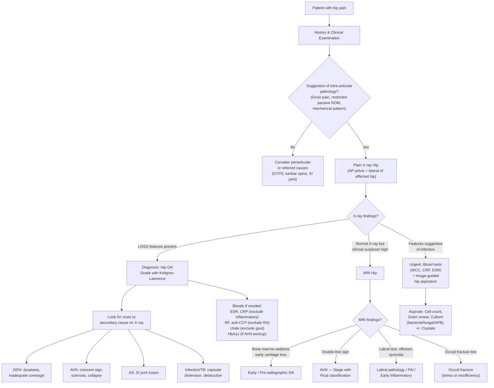

## Diagnostic Criteria, Diagnostic Algorithm & Investigations for Hip Osteoarthritis

### 1. Diagnostic Criteria — How Do We Actually Diagnose Hip OA?

Unlike many medical conditions, hip OA does **not** have a single pathognomonic lab test. The diagnosis is fundamentally **clinical + radiological**. Let's work through this from first principles.

#### 1.1 The ACR (American College of Rheumatology) Clinical Classification Criteria for Hip OA

These are the most widely referenced criteria. They were designed for classification (research) but are used clinically as a diagnostic framework:

**Clinical + Radiographic Criteria (most commonly used)**:
Hip pain **PLUS** at least 2 of the following 3:
1. ESR < 20 mm/hr (i.e., **not** a highly inflammatory process)
2. Radiographic femoral and/or acetabular **osteophytes**
3. Radiographic **joint space narrowing** (superior, axial, and/or medial)

> Sensitivity ~89%, Specificity ~91%.

**Clinical-only Criteria** (when X-ray is not available or normal):
Hip pain **PLUS** all of:
1. Hip internal rotation ≥ 15° **AND** pain on internal rotation **AND** morning stiffness ≤ 60 min **AND** age > 50
**OR**
2. Hip internal rotation < 15° **AND** ESR ≤ 45 mm/hr (or hip flexion ≤ 115° if ESR not available)

#### 1.2 Why These Criteria Make Sense — First Principles

Let's unpack the logic:

- **Pain** is the cardinal symptom — cartilage is aneural, so the pain comes from subchondral bone, synovitis, capsular distension, and periosteal stretching (osteophytes). You need pain to diagnose symptomatic OA.
- **ESR < 20** helps exclude inflammatory arthritis (RA, AS, septic arthritis), where ESR is typically elevated. OA is degenerative, not primarily inflammatory, so acute-phase reactants should be **normal or only mildly elevated**.
- **Osteophytes** are the **most reliable radiographic marker** of OA — they represent the joint's (maladaptive) attempt to increase surface area and redistribute load.
- **Joint space narrowing** = cartilage loss = the hallmark of OA. This is the ***earliest radiographic change*** [2].
- **Reduced internal rotation** is the earliest and most sensitive clinical sign of intra-articular hip pathology — the capsule is tightest in IR, so any swelling, osteophyte, or fibrosis restricts it first.
- **Morning stiffness ≤ 60 min** separates OA (typically ***< 30 min*** [2]) from inflammatory arthritis (> 60 min in RA).
- **Age > 50** reflects the epidemiology — primary OA is overwhelmingly a disease of ageing.

<Callout title="Practical Point">
In everyday clinical practice, you rarely formally apply the ACR criteria. The diagnosis of hip OA is made when a patient over 50 presents with **chronic groin pain**, **mechanical pattern** (worse with activity, better with rest), **restricted ROM** (especially internal rotation), and **characteristic X-ray changes (LOSS)**. The ACR criteria are useful for exams and when the diagnosis is uncertain.
</Callout>

#### 1.3 What Hip OA is NOT

| Feature | Suggests NOT OA — Think Instead |
|---|---|
| Morning stiffness > 60 min | Inflammatory arthritis (RA, AS) |
| Markedly elevated ESR/CRP | Infection (septic arthritis), inflammatory arthritis, malignancy |
| Fever, hot swollen joint | **Septic arthritis** (emergency) |
| Erosions on X-ray | RA, gout |
| Juxta-articular osteopenia | RA |
| Normal passive ROM with lateral hip pain | Greater trochanteric pain syndrome (periarticular, not intra-articular) |
| Neurological deficit | Lumbar radiculopathy (referred, not hip joint) |

---

### 2. Diagnostic Algorithm

The lecture slides emphasise a systematic approach: ***recognise radiological features of common hip disorders*** and ***describe the radiological features by location (acetabular side, articular surface, femoral side)*** [1][12].

---

### 3. Investigation Modalities — Detailed Breakdown

#### 3.1 Plain Radiographs (X-rays) — The First-Line Investigation

***Plain X-ray is the cornerstone investigation for hip OA*** [1][12]. It is cheap, widely available, and provides the key diagnostic information.

##### Required Views

| View | What It Shows | Why It's Important |
|---|---|---|
| **AP pelvis (weight-bearing if possible)** | Both hips for comparison; acetabular coverage; joint space width; alignment; pelvic symmetry | Allows comparison of affected vs. unaffected hip. Weight-bearing compresses the joint, making joint space narrowing more apparent. |
| **Lateral view of affected hip** (frog-leg lateral or cross-table lateral) | Femoral head shape; anterior/posterior osteophytes; crescent sign in AVN | The frog-leg view (abducted, externally rotated) is particularly useful for detecting ***crescent sign*** in AVN [5] and cam morphology in FAI. |

##### The Four Hallmarks of OA on X-ray — ***LOSS*** [2][12][13]

> ***The hallmarks of osteoarthritis: joint space narrowing, subchondral sclerosis, marginal osteophytes, subchondral cysts*** [13]

| Feature | What It Looks Like | Pathophysiology | Clinical Significance |
|---|---|---|---|
| ***Loss of joint space (joint space narrowing)*** | Asymmetric narrowing, typically **superolateral** in hip OA (where maximal weight-bearing occurs); compare with contralateral hip | Represents **cartilage loss** — the cartilage is radiolucent (invisible on X-ray), so as it thins, the apparent gap between the femoral head and acetabulum narrows | ***Earliest radiographic change*** [2]. Superolateral narrowing is typical of primary OA; medial/axial narrowing suggests RA or inflammatory arthritis. |
| ***Osteophytes*** | Bony spurs at the **margins** of the joint — along the acetabular rim and femoral head-neck junction | Reactive new bone formation at the periosteum, driven by TGFβ and BMPs; the joint's attempt to increase surface area and redistribute load | Most **reliable** radiographic feature for diagnosing OA. Look for them on both the acetabular and femoral sides. |
| ***Subchondral sclerosis*** | Increased whiteness (radiodensity) of bone directly beneath the damaged cartilage | Exposed subchondral bone bears increased stress → osteoblast activation → increased bone density. The stiffened bone is **less** shock-absorbing → further damages cartilage (vicious cycle). | Indicates areas of maximal mechanical stress and cartilage loss. |
| ***Subchondral cysts*** (geodes) | Well-defined lucent (dark) areas in the subchondral bone | Two theories: (1) synovial fluid forced through microfractures in the subchondral plate; (2) focal bone necrosis with cyst formation | Can be large and dramatic; may mimic other pathology. Seen in more advanced OA. |

##### X-ray Features of Underlying Causes (Secondary OA) [2]

When you see OA changes, **always look for clues to a secondary cause**:

| Secondary Cause | Specific X-ray Features |
|---|---|
| ***DDH*** | ***Hip dysplasia (inadequate acetabular coverage)***; shallow acetabulum; broken Shenton's line; femoral head subluxation [2] |
| ***AVN*** | ***Osteopenia → sclerosis → crescent sign*** [2][5]; ***cyst (resorption of dead bone + replacement with fibrous and granulation tissue)***; ***sclerosis (thickened trabeculae due to direct deposition of new bone onto dead bone)***; ***crescent sign (subchondral collapse of the necrotic segment)*** [14] |
| ***AS*** | ***Fusion of SI joint*** [2]; protrusio acetabuli (medial migration of femoral head) |
| **RA** | Symmetrical joint space narrowing; juxta-articular osteopenia; erosions; **no osteophytes**; protrusio |
| **TB hip** | ***Soft-tissue swelling or hip joint capsular distension (with widening of the joint space or even subluxation)***; ***radiographic changes in the proximal femoral metaphysis: osteomyelitis*** [6] |
| **Paget's disease** | Coarsened trabecular pattern; cortical thickening; bone enlargement ("picture frame" vertebra if spine) |

<Callout title="Systematic X-ray Reporting for the Hip — Lecture Slide Approach" type="idea">
***The hip joint consists of acetabular side, articular surface and femoral side — describe the radiological features by location*** [12]:

1. **Acetabular side**: coverage/depth, osteophytes, sclerosis, cysts, protrusio, dysplasia
2. **Articular surface (joint space)**: width (narrowed?), symmetry (superolateral vs medial), Shenton's line
3. **Femoral side**: head shape (spherical? collapsed? flattened?), osteophytes, cysts, sclerosis, crescent sign, neck-shaft angle, femoral offset

This systematic approach prevents you from missing pathology and is explicitly what the lecturers expect [12].
</Callout>

##### ***Kellgren-Lawrence (KL) Classification*** [1][7]

This is the standard radiological grading system for OA severity, used for both knee and hip:

> ***Kellgren and Lawrence scoring system*** [1]

| Grade | Description | Key Feature |
|---|---|---|
| **0** | Normal | No OA features |
| **1** | Doubtful | Possible osteophytic lipping, doubtful joint space narrowing |
| **2** | Minimal | **Definite osteophytes**, possible joint space narrowing |
| **3** | Moderate | Moderate osteophytes, **definite joint space narrowing**, some sclerosis, possible cysts |
| **4** | Severe | Large osteophytes, **marked joint space narrowing** (bone-on-bone), severe sclerosis, bone deformity |

**Why does grading matter?** It guides management decisions:
- KL 1–2: Conservative management, lifestyle modification, physiotherapy
- KL 3: Conservative ± consider surgical options (osteotomy if appropriate)
- KL 4: Usually requires arthroplasty (THR) if symptoms warrant

#### 3.2 MRI — The Gold Standard for Soft Tissue and Early Disease

MRI is **not routinely needed** for diagnosing established hip OA (X-ray is sufficient). It is indicated when:
1. **X-ray is normal but clinical suspicion is high** (pre-radiographic OA, occult fracture, early AVN)
2. **Suspected AVN** — ***MRI has 99% sensitivity and specificity*** [14] for AVN
3. **Suspected labral tear or FAI** — MR arthrogram (with intra-articular gadolinium) is the investigation of choice
4. **Distinguishing osteomyelitis from septic arthritis** — ***MRI may be the most useful test to distinguish proximal femoral osteomyelitis from septic arthritis of the hip*** [6]
5. **Suspected occult fracture** — stress fracture or insufficiency fracture with normal X-ray

##### Key MRI Findings

| Condition | MRI Findings | Explanation |
|---|---|---|
| **Early/Pre-radiographic OA** | Bone marrow oedema (BME), cartilage thinning/defects, early osteophytes, synovitis, effusion | ***Structural changes occur before symptoms and before X-ray changes*** [3]. MRI detects these earlier. BME on MRI correlates with pain in OA. |
| **AVN** | ***T2W: double-line sign*** — outer dark line (sclerosis/reactive bone) and inner bright line (granulation tissue/hyperaemia) [5]; T1W: low signal replacing normal fatty marrow | The double-line sign is **pathognomonic** for AVN. MRI detects AVN **before** X-ray changes appear (Ficat Stage 0–I). MRI should include **bilateral** hips because contralateral AVN is common [5]. |
| **Labral tear** | Irregularity, cleft, or detachment of the acetabular labrum; best seen on MR arthrogram | The labrum is a fibrocartilaginous structure; tears appear as high signal within or detachment from the labrum. |
| **Septic arthritis** | Joint effusion, synovial thickening and enhancement, bone marrow oedema in adjacent bone; may show periosteal reaction (osteomyelitis) | Differentiates effusion from bone infection. ***Most useful to distinguish osteomyelitis from septic arthritis*** [6]. |
| **Occult fracture** | Linear low-signal line on T1W with surrounding bone marrow oedema | Fractures that are invisible on X-ray (especially femoral neck stress fractures) are readily detected by MRI. |

##### Natural History — MRI Detects Disease Earlier Than X-ray [3]

> ***Molecular changes → Pre-radiographic changes (MRI/Biomarkers: changes in composition of bone, cartilage, other soft tissues) → Radiographic changes (X-ray: structural changes in bone = joint failure) → End-stage disease (joint death = joint replacement)*** [3]

> ***It is more effective to prevent disease progression by intervention at early stages*** [3]

This concept is critical: by the time you see LOSS on X-ray, significant structural damage has already occurred. MRI (and emerging biomarkers) can identify disease at the pre-radiographic stage, where interventions like weight loss, exercise, and potentially disease-modifying therapies may be most effective.

#### 3.3 Blood Investigations — To Exclude Differential Diagnoses

Hip OA itself does **not** have diagnostic blood tests. Bloods are used to **exclude other conditions**:

| Test | Purpose | Expected in OA | Abnormal in |
|---|---|---|---|
| ***ESR*** [15] | Acute phase reactant | **Normal** (< 20 mm/hr) or mildly elevated | Elevated in RA, AS, septic arthritis, malignancy, TB |
| ***CRP*** [15] | Acute phase reactant | **Normal** or mildly elevated | Elevated in septic arthritis (markedly), RA, crystal arthropathy |
| ***WBC*** [15] | White cell count | **Normal** | Elevated in septic arthritis, osteomyelitis |
| **RF (Rheumatoid Factor)** | Screen for RA | Negative | Positive in ~70% of RA |
| **Anti-CCP** | Highly specific for RA | Negative | Positive in RA (more specific than RF) |
| **Urate** | Screen for gout | Normal | Elevated in gout (though can be normal during an acute flare) |
| **HLA-B27** | If AS suspected | Negative | Positive in ~90% of AS |
| **Blood cultures** [15] | If septic arthritis suspected | Negative | Positive in ~50% of septic arthritis |

<Callout title="When to Order Bloods" type="idea">
Do NOT order a panel of inflammatory markers and autoantibodies for every patient with chronic hip pain and a classic OA presentation. Order them when:
- The clinical picture is atypical (young patient, prolonged morning stiffness, systemic symptoms)
- You need to exclude infection (acute onset, fever, elevated inflammatory markers)
- You suspect an underlying inflammatory or metabolic cause (RA, AS, gout)
</Callout>

#### 3.4 Joint Aspiration — When Infection or Crystal Arthropathy Is Suspected

This is **not** a routine investigation for hip OA but is **critical** when septic arthritis is in the differential.

***Investigations for suspected septic arthritis of the hip*** [15]:
- ***WBC***
- ***CRP***
- ***ESR***
- ***Image-guided hip aspiration*** (usually under ultrasound or fluoroscopy — the hip is deep and cannot be aspirated blindly)
  - ***Cell count*** (WCC > 50,000/μL with > 75% neutrophils suggests septic arthritis)
  - ***Gram smear***
  - ***Bacterial / fungal / AFB cultures*** (AFB = acid-fast bacilli for TB)
  - ***+/- Crystals*** (needle-shaped negatively birefringent = gout; rhomboid weakly positively birefringent = pseudogout)
- ***Blood cultures*** [15]

**Why AFB cultures?** In Hong Kong, ***old TB hip*** [1] is a recognised cause of hip destruction and secondary OA. Mycobacterium tuberculosis grows slowly, and AFB culture (which takes weeks) is needed for diagnosis.

#### 3.5 Other Imaging Modalities

| Modality | Indication | Findings |
|---|---|---|
| **Ultrasound (US)** | Detect hip effusion; guide aspiration; assess GTPS/gluteus medius tendinopathy | Effusion appears as anechoic fluid within the joint capsule. US is quick, bedside, and non-ionising — ideal for confirming effusion before aspiration. |
| **CT scan** | Preoperative planning for complex THR (e.g., DDH with significant bony deformity); acetabular fracture assessment | Better bony detail than MRI; useful for 3D planning of component positioning in THR. |
| ***Radioisotope bone scan*** [6] | Infection workup; suspected metastatic disease; Paget's disease | Increased uptake at areas of high bone turnover. Sensitive but non-specific. Can identify multiple sites of disease (metastases, polyostotic Paget's). |
| **DEXA scan** | If osteoporosis suspected (fragility fracture, AVN assessment) | T-score ≤ -2.5 = osteoporosis. Important for fracture risk assessment in elderly patients with hip OA. |

#### 3.6 Staging of AVN — The Ficat Classification [14]

When AVN is identified as the cause of secondary hip OA, staging guides treatment:

***Ficat classification and treatment*** [14]:

| ***Ficat Stage*** | ***Criteria*** | ***Treatment*** |
|---|---|---|
| ***I*** | ***Normal X-ray*** (MRI may show changes) | ***Core decompression*** |
| ***II*** | ***Sclerotic or cystic lesions*** | ***Core decompression / vascularised bone graft*** |
| ***III*** | ***Subchondral collapse (crescent sign)*** | ***Vascularised bone graft / THR*** |
| ***IV*** | ***OA changes (joint space collapse, acetabular changes)*** | ***THR*** |

**Why core decompression works in early AVN**: The femoral head has a rigid bony shell. When infarction occurs, oedema and inflammation increase intraosseous pressure within this rigid compartment → further compromises blood flow (a vicious cycle, similar in concept to compartment syndrome). Core decompression involves drilling a channel into the femoral head → reduces intraosseous pressure → allows ingrowth of new blood vessels → may halt progression.

**Why THR is needed in late AVN**: Once subchondral collapse has occurred (Ficat III–IV), the articular surface is permanently deformed → incongruent joint → progressive OA. No amount of core decompression can restore a collapsed femoral head — the joint must be replaced.

---

### 4. The Harris Hip Score — Functional Assessment [2][16]

***Harris Hip Score (HHS)*** is the standard functional outcome tool for hip OA and is specifically used for ***follow-up after THR*** [16]:

| Domain | Max Points | Components |
|---|---|---|
| ***Pain*** | ***44*** | Severity and impact on function |
| ***Function*** | ***47*** | ***Gait (33)***: limp, support (none/cane/crutch), distance walked. ***Activity (14)***: stairs, wear socks/shoes, sitting time, enter public transportation |
| **Range of motion** | **5** (recorded as 9 in some versions) | Composite of flexion, abduction, adduction, ER, IR |
| **Absence of deformity** | **4** | Fixed flexion < 30°, fixed adduction < 10°, fixed IR < 10°, LLD < 3.2 cm |

**Total: 100 points**
- 90–100 = Excellent
- 80–89 = Good
- 70–79 = Fair
- < 70 = Poor

<Callout title="Exam Tip — Harris Hip Score" type="idea">
In an OSCE or clinical exam, mentioning that you would use the **Harris Hip Score** to quantify functional impairment and track outcomes after THR demonstrates sophisticated clinical thinking. The key components to remember: **Pain (44)** and **Function (47)** make up the vast majority of the score — pain relief and functional improvement are what matter most to patients [16].
</Callout>

---

### 5. Summary — Putting It All Together

| Investigation | When to Order | Key Findings in Hip OA |
|---|---|---|
| **Plain X-ray (AP pelvis + lateral hip)** | **First-line for all suspected hip OA** | LOSS: joint space narrowing (superolateral), osteophytes, subchondral sclerosis, subchondral cysts |
| **MRI hip** | X-ray normal but suspicion high; suspected AVN, labral tear, occult fracture, infection | Pre-radiographic OA: BME, cartilage defects. AVN: double-line sign. Labral tear: cleft/detachment. |
| **Blood tests (ESR, CRP, WCC)** | Atypical presentation; exclude infection/inflammation | Normal in OA; elevated in septic arthritis, RA, AS |
| **RF, anti-CCP, urate, HLA-B27** | Suspected inflammatory/metabolic cause | Normal in OA; positive in RA, gout, AS respectively |
| **Image-guided hip aspiration** | Suspected septic arthritis or crystal arthropathy | Cell count, Gram stain, culture (bacterial/fungal/AFB), crystals |
| **CT scan** | Preoperative planning, complex bony anatomy | 3D bony detail for THR planning |
| **Ultrasound** | Effusion detection, aspiration guidance, periarticular pathology | Effusion, tendinopathy, bursitis |
| **Bone scan** | Infection, metastasis, Paget's | Increased uptake at sites of bone turnover |
| **Harris Hip Score** | Baseline assessment and follow-up after THR | Quantifies pain, function, ROM, deformity |

---

<Callout title="High Yield Summary — Diagnosis of Hip OA">

1. **Diagnosis is clinical + radiological** — no specific lab test for OA.
2. **ACR criteria**: Hip pain + 2 of 3 (ESR < 20, osteophytes on X-ray, joint space narrowing).
3. **First-line investigation**: Plain X-ray (AP pelvis + lateral of affected hip).
4. **Radiographic hallmarks (LOSS)**: Loss of joint space (earliest), Osteophytes (most reliable), Subchondral sclerosis, Subchondral cysts.
5. **Describe X-ray by location**: acetabular side, articular surface, femoral side.
6. **Kellgren-Lawrence grading**: Grade 0 (normal) to Grade 4 (bone-on-bone).
7. **Always look for secondary causes on X-ray**: DDH (dysplasia), AVN (crescent sign), AS (SI fusion), TB (capsular distension), RA (erosions/osteopenia).
8. **MRI**: 99% sensitive/specific for AVN (double-line sign); best for pre-radiographic OA, labral tears, and distinguishing osteomyelitis from septic arthritis.
9. **Bloods are to exclude differentials**, not to diagnose OA: ESR, CRP, WCC (infection); RF, anti-CCP (RA); urate (gout); HLA-B27 (AS).
10. **Image-guided aspiration**: urgent for suspected septic arthritis — cell count, Gram smear, bacterial/fungal/AFB culture, +/- crystals.
11. **Ficat classification for AVN**: I (normal X-ray) → core decompression; II (sclerotic/cystic) → core decompression/bone graft; III (subchondral collapse) → bone graft/THR; IV (OA changes) → THR.
12. **Harris Hip Score**: Pain (44) + Function (47) + ROM + Deformity = max 100. Used for baseline and post-THR follow-up.
13. **Natural history**: Molecular → Pre-radiographic (MRI/biomarkers) → Radiographic (X-ray) → End-stage. Intervene early.

</Callout>

---

<ActiveRecallQuiz
  title="Active Recall - Diagnosis & Investigations for Hip OA"
  items={[
    {
      question: "State the ACR clinical + radiographic classification criteria for hip OA. Why is ESR included as a criterion?",
      markscheme: "Hip pain PLUS 2 of 3: (1) ESR less than 20, (2) osteophytes on X-ray, (3) joint space narrowing. ESR is included to exclude inflammatory arthritis (RA, AS, septic arthritis) which cause elevated ESR. OA is degenerative with normal/mildly elevated acute-phase reactants."
    },
    {
      question: "List the 4 radiographic hallmarks of OA using the LOSS mnemonic, state which is the earliest and which is the most reliable for diagnosis, and explain the pathophysiology of each.",
      markscheme: "Loss of joint space (earliest; cartilage thinning). Osteophytes (most reliable; reactive bone at margins driven by TGFbeta/BMPs). Subchondral sclerosis (increased bone density from osteoblast activation under stress). Subchondral cysts (synovial fluid intrusion through microfractures or focal necrosis)."
    },
    {
      question: "When is MRI indicated in the workup of hip pain, and what is the pathognomonic MRI finding in AVN? What is the sensitivity and specificity?",
      markscheme: "MRI indicated when: X-ray normal but clinical suspicion high, suspected AVN, labral tear, occult fracture, distinguishing osteomyelitis from septic arthritis. AVN pathognomonic finding: double-line sign on T2W (outer dark sclerosis, inner bright granulation tissue). MRI has 99% sensitivity and specificity for AVN."
    },
    {
      question: "A febrile patient presents with acute hip pain. Describe the investigation workup as per the lecture slides.",
      markscheme: "WBC, CRP, ESR, blood cultures. Image-guided hip aspiration for: cell count, Gram smear, bacterial/fungal/AFB cultures, +/- crystals. Imaging: X-ray (soft-tissue swelling, capsular distension, metaphyseal changes for osteomyelitis), MRI (most useful to distinguish osteomyelitis from septic arthritis), radioisotope scan."
    },
    {
      question: "Describe the Ficat classification for AVN and the treatment at each stage.",
      markscheme: "Stage I: normal X-ray, treat with core decompression. Stage II: sclerotic/cystic lesions, core decompression or vascularised bone graft. Stage III: subchondral collapse (crescent sign), vascularised bone graft or THR. Stage IV: OA changes (joint space collapse, acetabular involvement), THR."
    },
    {
      question: "What are the components and scoring of the Harris Hip Score? Which two domains carry the most points?",
      markscheme: "Pain (44 points), Function (47 points: gait 33 + activity 14), ROM (5 points), Absence of deformity (4 points). Total 100. Pain and Function carry the most points (91/100 combined). Used for baseline assessment and post-THR follow-up."
    }
  ]}
/>

## References

[1] Lecture slides: GC 229. Hip Arthritis (1).pdf (pp. 2, 29, 32)
[2] Senior notes: maxim.md (sections 6.3 OA hip, 9.1 Osteoarthritis)
[3] Lecture slides: GC 228. Knee Osteoarthritis_Part B (1).pdf (p. 13 — Natural History of OA)
[5] Senior notes: maxim.md (section 6.4 AVN of hip)
[6] Lecture slides: GC 229. Hip Arthritis (1).pdf (p. 53 — Imaging for septic arthritis)
[7] Senior notes: maxim.md (section 7.4 OA knee — Kellgren-Lawrence classification)
[12] Lecture slides: GC 229. Hip Arthritis (1).pdf (p. 103 — Take Home Messages)
[13] Lecture slides: GC 228. Knee Osteoarthritis_Part A (1).pdf (p. 32 — Radiographic features)
[14] Lecture slides: GC 229. Hip Arthritis (1).pdf (pp. 15, 20 — AVN investigations and Ficat classification)
[15] Lecture slides: GC 229. Hip Arthritis (1).pdf (p. 51 — Investigations for septic arthritis)
[16] Senior notes: maxim.md (section 6.3 — Harris Hip Score after THR)
