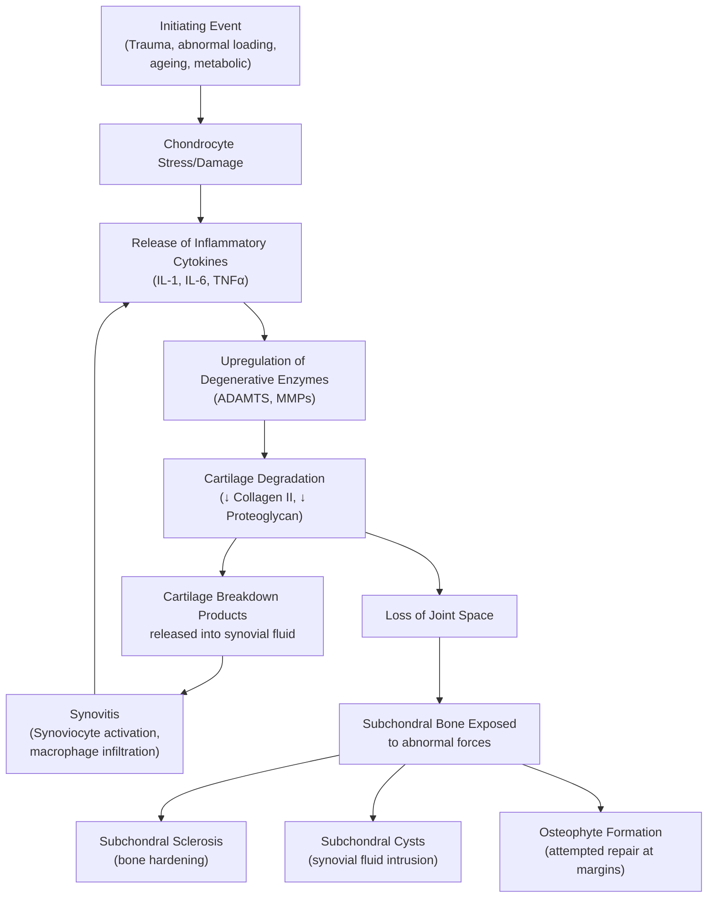

## 1. Definition

Osteoarthritis (OA) of the hip is a **chronic, progressive degenerative joint disease** characterised by the breakdown and eventual loss of articular (hyaline) cartilage of the hip joint, accompanied by reactive changes in the subchondral bone, synovium, and joint capsule [1][2].

Let's break the term down:

- **"Osteo"** = bone; **"arthro"** = joint; **"itis"** = inflammation — though, importantly, OA is primarily a **degenerative** rather than a primarily inflammatory condition. The "-itis" suffix is somewhat misleading; low-grade synovial inflammation _does_ occur, but it is secondary to cartilage breakdown products irritating the synovium, not the primary driver as in rheumatoid arthritis (RA).

The disease involves the **entire joint as an organ** — not just cartilage. This includes:

- **Articular cartilage**: fibrillation, thinning, and eventual loss
- **Subchondral bone**: sclerosis (hardening) and cyst formation
- **Synovium**: low-grade inflammation (synovitis)
- **Joint capsule**: thickening and fibrosis leading to contracture
- **Periarticular muscles**: atrophy (especially gluteal muscles)
- **Osteophytes**: reactive bony spurs at joint margins

<Callout title="Key Concept">
  OA is **not** simply "wear and tear." It is a dynamic process of **failed
  repair** — the joint attempts to remodel but cannot keep up with the rate of
  destruction. Think of it as **joint failure**, analogous to heart failure
  being the failure of the heart as an organ [3].
</Callout>

---

## 2. Epidemiology

### Global

- OA is the **most common joint disease worldwide** and the leading cause of disability in the elderly.
- Hip OA prevalence increases with age, with radiographic evidence in **> 50% of people over 65 years**.
- Symptomatic hip OA affects roughly **5–10%** of adults over 60 globally.
- Women are more affected than men after the age of 50 (hormonal factors — post-menopausal oestrogen decline accelerates cartilage loss).

### Hong Kong / Chinese Population — Critical Distinction

> **_Primary (idiopathic) hip OA is uncommon in the Chinese population_** [1].

This is a **high-yield exam fact**. Why?

- The Chinese population has a **lower prevalence of primary hip OA** compared to Caucasian populations. This is likely due to:
  - **Differences in hip morphology**: lower rates of cam and pincer femoroacetabular impingement (FAI) morphology.
  - **Genetic factors**: differences in collagen and proteoglycan expression.
  - **Lifestyle factors**: historically less obesity, different occupational loading.

- In contrast, **_secondary hip OA is proportionally more common in the Chinese/Hong Kong population_** [1][2]. Common secondary causes include:
  - **Developmental dysplasia of the hip (DDH)** — a significant cause
  - **Avascular necrosis (AVN)** — related to steroid use (e.g., for SLE, which is more prevalent in Chinese women) and alcohol
  - **Previous septic arthritis / tuberculosis of the hip** — **_old TB hip_** is specifically highlighted as a cause [1]
  - **Post-traumatic** (following hip fractures or dislocations)

<Callout title="Exam Pearl" type="idea">
When you see a young Hong Kong patient (< 50 years) with hip OA, your first thought should be: **what is the underlying secondary cause?** Primary OA at this age is rare, especially in this population. Always ask about previous trauma, steroid use, alcohol, childhood hip problems (DDH, Perthes), and infections [1][2].
</Callout>

---

## 3. Risk Factors

### 3.1 Non-modifiable Risk Factors

| Risk Factor                   | Mechanism                                                                                           |
| ----------------------------- | --------------------------------------------------------------------------------------------------- |
| **Age (> 60y)**               | Cumulative cartilage wear + reduced chondrocyte regenerative capacity + senescent cell accumulation |
| **Female sex**                | Post-menopausal oestrogen decline → reduced chondroprotection; ligamentous laxity                   |
| **Genetics / Family history** | Polymorphisms in collagen type II (COL2A1), GDF5, and other structural genes                        |
| **Ethnicity**                 | Primary hip OA less common in Chinese/Asian populations vs. Caucasians                              |
| **Hip morphology**            | Acetabular dysplasia (DDH), cam/pincer FAI → abnormal contact stresses                              |

### 3.2 Modifiable Risk Factors

| Risk Factor                  | Mechanism                                                                                                                                      |
| ---------------------------- | ---------------------------------------------------------------------------------------------------------------------------------------------- |
| **_Obesity_** [4]            | Increased mechanical load on weight-bearing joints; adipokines (leptin, adiponectin) promote a pro-inflammatory catabolic state in cartilage   |
| **_Previous trauma_** [2][4] | Direct cartilage damage → focal loss of cartilage → altered joint biomechanics → progressive degeneration                                      |
| **_Occupation_** [4]         | Repetitive loading (e.g., farming, heavy manual labour) → chronic microtrauma to cartilage                                                     |
| **Muscle weakness**          | Weak hip abductors/extensors → poor dynamic joint stabilisation → increased cartilage contact pressures                                        |
| **Steroid use**              | Predisposes to AVN → secondary OA                                                                                                              |
| **Alcohol**                  | Predisposes to AVN → secondary OA                                                                                                              |
| **Low bone density**         | Paradoxically, some evidence suggests low BMD may be protective against OA (less stiff subchondral bone); however, the relationship is complex |

<Callout title="The 'Defective Load vs. Defective Cartilage' Framework" type="idea">
A useful way to conceptualise secondary OA aetiology [2]:

**Defective Load** (abnormal forces on normal cartilage):

- **Force**: obesity, occupational overuse
- **Area**: joint dysplasia (e.g., DDH) — same force over a smaller contact area = higher stress per unit area

**Defective Cartilage** (normal forces on abnormal cartilage):

- **Damage**: trauma, haemophilia (recurrent haemarthroses)
- **Disease**: inflammatory (RA), metabolic (gout), infection (septic arthritis, TB)
- **Unsupported**: AVN (dead subchondral bone → cartilage loses its structural foundation → collapse)

</Callout>

---

## 4. Anatomy and Function of the Hip Joint

Understanding the anatomy is essential for understanding why hip OA presents the way it does and why certain surgical approaches carry specific risks.

### 4.1 Bony Anatomy

The hip is a **ball-and-socket synovial joint** (the most stable joint in the body):

- **Femoral head** (the "ball") — nearly spherical, covered by articular (hyaline) cartilage except at the fovea (where ligamentum teres attaches)
- **Acetabulum** (the "socket") — formed by the fusion of the ilium, ischium, and pubis. Deepened by the **acetabular labrum** (fibrocartilaginous rim) [2]
  - The labrum acts as a gasket seal, increasing joint stability, distributing load, and maintaining negative intra-articular pressure (a "suction cup" effect)

> The acetabulum faces **anterolaterally and inferiorly**. The femoral neck has an **anteversion angle** of ~15° and a **neck-shaft angle** of ~125°. Abnormalities in these angles (e.g., coxa vara, coxa valga, excessive anteversion) alter biomechanics and predispose to OA.

### 4.2 Neurovascular Supply

**_Arterial supply is retrograde_** [2]:

- **_Medial circumflex femoral artery (MCFA)_** — **main supply** to the femoral head. Arises from the profunda femoris (deep femoral artery).
- **_Lateral circumflex femoral artery (LCFA)_** — also from profunda femoris; supplies the lateral femoral head and greater trochanter.
- These arteries form an **extracapsular arterial ring** at the base of the femoral neck → give off **retinacular arteries** that run along the neck under the capsule → supply the femoral head in a **retrograde** direction (from neck towards head).
- **_Ligamentum teres_**: contains the **artery to the head of femur** (foveal artery), from the obturator artery. This is significant in children but contributes minimally to adult blood supply.
- **Nutrient vessels from bone** (intramedullary supply) — minor contribution.

**Clinical significance**: This retrograde blood supply makes the femoral head vulnerable to **AVN** following:

- **Intracapsular femoral neck fractures** (disrupts retinacular arteries)
- **Hip dislocations** (stretches/tears retinacular arteries)
- Conditions that cause **microvascular thrombosis** (steroids, alcohol, sickle cell, caisson disease)

**_Nerve supply: sciatic, femoral, obturator nerves_** [2] — the same nerves that supply the knee joint.

> **_Hip pain can be referred to the knee and vice versa_** [2]. This is due to **Hilton's Law**: the nerves supplying a joint also supply the muscles moving that joint and the skin over the insertion of those muscles. Since the obturator nerve (L2–L4) supplies both the hip and knee, hip pathology can present as knee pain. **Always examine the hip in a patient presenting with knee pain.**

<Callout title="Clinical Pearl" type="error">
  A child or adolescent presenting with isolated knee pain may actually have hip
  pathology (Perthes disease, SCFE). Always examine the hip!
</Callout>

### 4.3 Gluteal Muscles and Hip Biomechanics

**_Superficial muscles: gluteus medius and minimus (abductors; superior gluteal nerve)_** [2]:

- These are the **primary hip abductors**.
- They are critical for the **Trendelenburg mechanism**: during single-leg stance (as in walking), the abductors on the stance side contract to keep the pelvis level. If they are weak or their lever arm is shortened (e.g., by femoral head collapse in OA, or by a shortened femoral neck), the pelvis drops on the contralateral side → **Trendelenburg sign positive** → **Trendelenburg gait** (waddling gait).

**_Deep muscles: piriformis_** (at the exit of the sciatic nerve) [2]:

- Clinically relevant because the sciatic nerve exits the pelvis **below the piriformis** (in most people), so piriformis pathology can cause sciatica-like symptoms.

**Hip Muscles Summary** [2]:

| Compartment         | Muscles                                                      | Action                                                     | Nerve                              |
| ------------------- | ------------------------------------------------------------ | ---------------------------------------------------------- | ---------------------------------- |
| **Anterior**        | Quadriceps femoris, Sartorius, Pectineus, Iliopsoas          | Knee extension (quads); Hip flexion (iliopsoas, sartorius) | **Femoral nerve (L2–L4)**          |
| **Medial**          | Adductor magnus/longus/brevis, Gracilis, Obturator externus  | Hip adduction                                              | **Obturator nerve (L2–L4)**        |
| **Posterior**       | Hamstrings (biceps femoris, semitendinosus, semimembranosus) | Hip extension, Knee flexion                                | **Sciatic nerve (L4–S3)**          |
| **Lateral/gluteal** | Gluteus medius & minimus                                     | Hip abduction                                              | **Superior gluteal nerve (L4–S1)** |
| **Lateral/gluteal** | Gluteus maximus                                              | Hip extension, external rotation                           | **Inferior gluteal nerve (L5–S2)** |

**Why does the hip adopt an externally rotated posture in OA?**

- **_Externally rotated limb on supine position_** [2]: In hip OA, inflammation and effusion increase intra-articular pressure. The hip joint capsule has its **greatest volume in slight flexion, abduction, and external rotation** — this is the position of maximum capsular relaxation and least intra-articular pressure. The patient therefore subconsciously holds the hip in this position for pain relief. Over time, the capsule contracts in this position, leading to a **fixed flexion and external rotation deformity**.

---

## 5. Etiology (Focus on Hong Kong)

### 5.1 Primary (Idiopathic) OA

- Due to **age-related degeneration** of cartilage without a clear predisposing cause.
- More common in **elderly > 70 years** [2].
- **_Uncommon in Chinese population_** [1] — this is a distinguishing feature of hip OA epidemiology in Hong Kong.

### 5.2 Secondary OA

**_Secondary causes are the dominant aetiology in Hong Kong._** The lecture slides provide a classification [1]:

| Category                          | Examples                                                        | Relevance to Hong Kong                                                                       |
| --------------------------------- | --------------------------------------------------------------- | -------------------------------------------------------------------------------------------- |
| **_Trauma_**                      | Femoral neck fractures, acetabular fractures, hip dislocations  | Post-traumatic OA in young adults                                                            |
| **_Infection_**                   | Septic arthritis, **_old TB hip_**                              | TB hip is specifically highlighted; historically significant in HK                           |
| **_Inflammatory joint diseases_** | **_e.g., Rheumatoid Arthritis_**                                | RA causes cartilage destruction → secondary OA                                               |
| **_Crystal deposition diseases_** | **_e.g., Gout_**                                                | Gout can affect the hip (uncommon but recognised)                                            |
| **_Neuropathic_**                 | **_e.g., Charcot joint_**                                       | Seen in diabetic neuropathy, tabes dorsalis (tertiary syphilis)                              |
| **_Metabolic/Endocrine_**         | Haemochromatosis, acromegaly, hyperparathyroidism               | Less common but examinable                                                                   |
| **Developmental**                 | DDH (developmental dysplasia of the hip)                        | Significant in Chinese population — shallow acetabulum → increased contact stress → early OA |
| **AVN**                           | Steroid use, alcohol, SLE, sickle cell, caisson disease, trauma | Very relevant in HK: SLE common in Chinese women → steroid use → AVN → OA                    |

### 5.3 Avascular Necrosis (AVN) as a Cause of Secondary Hip OA

AVN deserves special attention because it is a **major cause of secondary hip OA in Hong Kong** [1][2].

**Definition**: Cellular death of bone components due to interruption of blood supply [2].

**_AVN Risk Factors_** [1]:

- **_Trauma (femoral neck fracture: 15–50% risk; hip dislocation: 10–25% risk)_**
- **_Alcohol abuse_**
- **_Steroid (> 20 mg/day increases the risk)_**
- **_Caisson disease_** (decompression sickness — nitrogen bubbles block end-arteries)
- **_Sickle cell anaemia_**
- Inflammatory: **SLE** (both the disease itself and the steroid treatment)
- Infection: osteomyelitis, septic arthritis [2]

**Why does AVN lead to OA?**

1. Blood supply is interrupted → osteocyte death → subchondral bone weakens
2. Subchondral bone collapses ("crescent sign" on X-ray = subchondral fracture)
3. Articular cartilage, which depended on the subchondral bone for structural support, loses its foundation
4. Cartilage collapses → incongruity of the joint surface → abnormal loading → secondary OA

### 5.4 Developmental Dysplasia of the Hip (DDH) as a Cause of Secondary Hip OA

DDH is a spectrum: **dysplasia → subluxation → dislocation** [2].

- A **shallow (dysplastic) acetabulum** provides inadequate coverage of the femoral head.
- This means the same body weight is distributed over a **smaller contact area** → higher stress per unit area → accelerated cartilage wear → early OA (often by age 30–50).
- On X-ray: look for **inadequate acetabular coverage**, **broken Shenton's line**, and **subluxation of the femoral head** [2].

**_Management of DDH in young adults_** [1]:

- **_Periacetabular osteotomy (PAO)_**: indicated for **_symptomatic dysplasia in young adult with concentrically reduced hip and congruent joint space_** — **_before OA changes_** develop. The goal is to reorient the acetabulum to provide better coverage and delay/prevent OA.
- **_Total hip replacement (THR)_**: indicated for **_secondary OA changes_** or **_hip subluxation_** where PAO is no longer feasible.

<Callout title="Exam Pearl">
  The decision between PAO and THR for DDH-related hip disease hinges on whether
  OA changes have already developed. If the joint space is preserved and the hip
  is concentrically reduced → PAO. If OA is established → THR [1].
</Callout>

---

## 6. Pathophysiology

Understanding the pathophysiology of OA is fundamental. The lecture slides provide an excellent diagram of the molecular biology [3].

### 6.1 Normal Joint Homeostasis

In a healthy joint:

- **Articular cartilage** is maintained by **chondrocytes**, which balance the synthesis and degradation of the extracellular matrix (ECM).
- The ECM consists of **type II collagen** (tensile strength) and **proteoglycans/aggrecan** (compressive resistance — they attract water due to their negative charge, creating a hydrated gel).
- **Synovial fluid** (produced by synoviocytes) lubricates the joint and provides nutrition to avascular cartilage via diffusion.

### 6.2 Pathological Cascade in OA

**_The biology of OA involves a complex interplay between cartilage, subchondral bone, and synovium_** [3]:

**_Key molecular players_** [3]:

1. **Inflammatory cytokines**: **_IL-1, IL-6, TNFα, Wnts_** are released by stressed chondrocytes and activated synoviocytes.
2. **Degenerative enzymes**: **_ADAMTS (aggrecanases)_** and **_MMPs (matrix metalloproteinases)_** — these are the "demolition crew" that break down the cartilage ECM.
   - **ADAMTS** ("A Disintegrin And Metalloproteinase with Thrombospondin motifs") — specifically cleaves aggrecan (the major proteoglycan).
   - **MMPs** — degrade collagen fibres.
3. **_Inhibition of repair_**: inflammatory cytokines also **_inhibit Collagen II, Proteoglycan synthesis, and TIMP_** (Tissue Inhibitors of Metalloproteinases — the natural brakes on MMPs) [3].
4. **Immune cell involvement** [3]:
   - **_M0 → M1 macrophages_** (pro-inflammatory, release TNFα, IL-12) vs. **_M2 macrophages_** (anti-inflammatory, reparative)
   - **_Th1 and Th17 cells_** (pro-inflammatory) vs. **_Th2 and Tregs_** (anti-inflammatory)
   - The balance is tipped towards a **pro-inflammatory, catabolic state** in OA.
5. **_TGFβ_** plays a dual role: can promote fibrosis and osteophyte formation but also has anti-inflammatory effects [3].
6. **_Cartilage antigens_** released into the synovial fluid activate immune cells → **perpetuating the cycle** of inflammation and degradation [3].

### 6.3 Subchondral Bone Changes

- **Subchondral sclerosis**: Increased mechanical stress on exposed bone → osteoblast activation → bone thickening. This stiff bone is _less_ able to absorb shock → further cartilage damage (vicious cycle).
- **Subchondral cysts** (geodes): Two theories:
  1. Synovial fluid intrudes through microfractures in the subchondral bone plate.
  2. Localised bone necrosis with subsequent cyst formation.
- **Osteophytes**: New bone formation at joint margins — an attempted (but ultimately maladaptive) repair response to increase the joint surface area and redistribute load. Driven by TGFβ and BMPs.

### 6.4 Natural History

**_The structural changes precede symptoms_** [3]:

> **_Molecular changes → Pre-radiographic changes (detectable by MRI/biomarkers) → Radiographic changes (X-ray: structural changes in bone = joint failure) → End-stage disease (joint death = joint replacement)_** [3]

**_It is more effective to prevent disease progression by intervention at early stages_** [3].

<Callout title="Why This Matters">
  By the time a patient has symptomatic hip OA visible on X-ray, significant
  molecular and structural damage has already occurred. This is why research
  focuses on biomarkers and MRI for early detection, and why lifestyle
  modifications (weight loss, exercise) should be started as early as possible
  [3].
</Callout>

---

## 7. Classification

### 7.1 By Aetiology [1][2]

| Type                     | Description                                                                           |
| ------------------------ | ------------------------------------------------------------------------------------- |
| **Primary (Idiopathic)** | No identifiable underlying cause; age-related degeneration; **_uncommon in Chinese_** |
| **Secondary**            | Identifiable predisposing cause (see Etiology section above)                          |

### 7.2 Radiological Grading — Kellgren-Lawrence Classification

This is the most widely used radiological grading system for OA severity:

| Grade | Findings                                                                                  | Clinical Correlation     |
| ----- | ----------------------------------------------------------------------------------------- | ------------------------ |
| **0** | Normal                                                                                    | No OA                    |
| **1** | Doubtful: possible osteophytic lipping                                                    | Questionable OA          |
| **2** | Minimal: definite osteophytes, possible joint space narrowing                             | Mild OA                  |
| **3** | Moderate: moderate osteophytes, definite joint space narrowing, some sclerosis            | Moderate OA              |
| **4** | Severe: large osteophytes, marked joint space narrowing, severe sclerosis, bone deformity | Severe OA (bone-on-bone) |

### 7.3 Functional Assessment — WOMAC Score

**_Western Ontario and McMaster Universities Arthritis Index (WOMAC)_** [2] — a validated patient-reported outcome measure assessing:

- **Pain** (5 items)
- **Stiffness** (2 items)
- **Physical function** (17 items)

Used to track disease progression and treatment response.

### 7.4 Harris Hip Score [1]

**_Harris Hip Score_** is specifically mentioned in the lecture slides as a functional assessment tool for hip OA [1]. It evaluates:

- **Pain** (44 points)
- **Function** (47 points): gait (limp, support, distance) + activities (stairs, shoes/socks, sitting, public transport)
- **Absence of deformity** (4 points)
- **Range of motion** (5 points)

Maximum score = 100. Score < 70 = poor; 70–79 = fair; 80–89 = good; 90–100 = excellent.

> Note: The lecture slides specifically ask about **_function_**: **_walking (level ground/stairs), sitting tolerance, limp, shoes and socks, cutting toe nails, getting on and off public transport_** [1]. These are practical ADL assessments you should ask about in the history.

### 7.5 Radiological Features of OA — The **"LOSS"** Mnemonic [2]

- **_L_** — **_Loss of joint space_** (earliest radiological change; represents cartilage thinning)
- **_O_** — **_Osteophytes_** (reactive bony spurs at joint margins)
- **_S_** — **_Subchondral sclerosis_** (increased bone density beneath damaged cartilage)
- **_S_** — **_Subchondral cysts_** (lucent areas in subchondral bone)

<Callout title="LOSS Mnemonic" type="idea">
  **L**oss of joint space, **O**steophytes, **S**ubchondral sclerosis,
  **S**ubchondral cysts. This is the bread-and-butter of OA radiology. Loss of
  joint space is the earliest sign — it corresponds to cartilage loss, which is
  the hallmark of OA [2].
</Callout>

---

## 8. Clinical Features

### 8.1 History Taking — The Approach

**_When taking a history for hip arthritis, the lecture slides emphasise_** [1]:

1. **_Aetiology_** — always determine the underlying cause:
   - **_Trauma_** (previous fractures, dislocations)
   - **_Nature of work_** (occupational overuse)
   - **_Drug / alcohol_** (steroids → AVN; alcohol → AVN)
2. **_Function_** — this determines the impact on the patient's life and guides management:
   - **_Walking: level ground / stairs_**
   - **_Sitting tolerance_**
   - **_Limp_**
   - **_Shoes and socks_** (can they reach their feet? — tests hip flexion and internal rotation)
   - **_Cutting toe nails_** (same as above)
   - **_Getting on and off public transport_** (step height, balance)

### 8.2 Symptoms (with Pathophysiological Basis)

| Symptom                       | Description                                                                                                                                                                                             | Pathophysiological Basis                                                                                                                                                                                                                                                                                                                                                                             |
| ----------------------------- | ------------------------------------------------------------------------------------------------------------------------------------------------------------------------------------------------------- | ---------------------------------------------------------------------------------------------------------------------------------------------------------------------------------------------------------------------------------------------------------------------------------------------------------------------------------------------------------------------------------------------------- |
| **_Pain_**                    | **Deep groin pain**, often radiating to the **_anterior thigh and knee_** [2]. **_Aggravated by weight-bearing and exertion, relieved by rest_** [2]. In advanced OA, rest pain and night pain develop. | Early: Subchondral bone microfractures, synovitis (inflammatory mediators activate nociceptors). Cartilage itself is **aneural** — it has no nerve endings — so cartilage loss alone does not cause pain. Pain comes from: (1) subchondral bone (richly innervated periosteum exposed), (2) synovitis, (3) capsular stretching/fibrosis, (4) periarticular muscle spasm, (5) osteophyte impingement. |
| **_Morning stiffness_**       | **_< 30 minutes_** after immobility [2]. Short-lived compared to inflammatory arthritis (which typically has > 60 min). **_More prominent in hip OA than knee OA_** [2].                                | During rest, synovial fluid redistributes away from the joint surfaces, and the inflamed/thickened capsule stiffens. With gentle movement, fluid returns and the capsule "loosens up." In RA, ongoing active inflammation means it takes much longer for stiffness to resolve.                                                                                                                       |
| **Stiffness / Loss of range** | Progressive difficulty with certain movements — particularly **internal rotation** (lost earliest), abduction, and flexion. Difficulty putting on **shoes and socks**, **cutting toenails** [1].        | Osteophyte formation at joint margins physically blocks movement. Capsular fibrosis and thickening limit range. The capsule is tightest in internal rotation and extension → these are lost first.                                                                                                                                                                                                   |
| **Swelling**                  | **_Intermittent (effusion) or continuous (capsule thickening)_** [2]                                                                                                                                    | Effusion: inflammatory mediators increase synovial fluid production. Capsule thickening: chronic low-grade synovitis → fibrosis. Hip effusion is deep and rarely visible (unlike knee), but may be detected on ultrasound.                                                                                                                                                                           |
| **Deformity**                 | Progressive external rotation, flexion, and adduction posture of the affected limb → apparent leg-length discrepancy.                                                                                   | Capsular contracture in the position of maximum volume (flexion, external rotation, slight abduction initially → then adduction as adductors tighten). Fixed flexion deformity tilts the pelvis → compensatory lumbar lordosis.                                                                                                                                                                      |
| **Loss of function**          | Difficulty walking, climbing stairs, using public transport, sitting for prolonged periods [1].                                                                                                         | Combination of pain, stiffness, mechanical block, and muscle weakness.                                                                                                                                                                                                                                                                                                                               |
| **Limp**                      | Two types: (1) **_Antalgic gait_** — short stance phase on affected side (pain avoidance); (2) **_Trendelenburg gait_** — trunk sways over affected side (abductor weakness) [2].                       | Antalgic: pain causes the patient to spend less time weight-bearing on the affected leg. Trendelenburg: gluteus medius/minimus weakness (from disuse atrophy, or shortened lever arm due to femoral head migration) → pelvis drops on the contralateral side during single-leg stance → compensatory trunk lean towards the affected side.                                                           |
| **_Referred knee pain_**      | Hip pathology presenting as knee pain, especially in children (Perthes, SCFE).                                                                                                                          | **_Hilton's Law_**: obturator nerve (L2–L4) supplies both hip and knee joints → convergence of afferent signals in the dorsal horn of the spinal cord → brain misinterprets origin [2].                                                                                                                                                                                                              |

<Callout title="Pain Pattern in Hip OA" type="idea">
  The classic pattern is **groin pain** radiating to the anterior thigh and
  sometimes to the knee. Buttock pain is less typical of hip OA and should make
  you think of sacroiliac joint pathology, lumbar spine disease, or piriformis
  syndrome. Lateral hip pain suggests **trochanteric bursitis** or **gluteus
  medius tendinopathy** rather than intra-articular hip OA.
</Callout>

### 8.3 Signs (with Pathophysiological Basis)

| Sign                                                     | Description                                                                                                                                                                                                                  | Pathophysiological Basis                                                                                                                                                                                                                             |
| -------------------------------------------------------- | ---------------------------------------------------------------------------------------------------------------------------------------------------------------------------------------------------------------------------- | ---------------------------------------------------------------------------------------------------------------------------------------------------------------------------------------------------------------------------------------------------- |
| **_Externally rotated limb on supine position_** [2]     | The affected leg lies in external rotation when the patient is supine.                                                                                                                                                       | The hip capsule has its greatest volume in slight flexion, abduction, and external rotation → this is the "resting position" of least intra-articular pressure → patient splints the hip here. Chronic capsular contracture maintains this position. |
| **_Antalgic gait_** [2]                                  | Shortened stance phase on the affected side; the patient "hurries off" the painful leg.                                                                                                                                      | Pain avoidance mechanism — minimising time spent loading the affected hip.                                                                                                                                                                           |
| **_Trendelenburg gait_** [2]                             | Trunk lurches towards the affected side during stance phase; pelvis drops on the contralateral side.                                                                                                                         | Hip abductor (gluteus medius/minimus) insufficiency — from disuse atrophy, pain inhibition, or mechanical disadvantage (shortened femoral neck from OA, femoral head migration → reduced abductor lever arm).                                        |
| **Positive Trendelenburg test**                          | When standing on the affected leg, the contralateral pelvis drops (normally it should rise or stay level).                                                                                                                   | Same mechanism as Trendelenburg gait — tests abductor function.                                                                                                                                                                                      |
| **_Painful passive movement with reduced ROM_** [2]      | Internal rotation is lost first, followed by extension, abduction, and then flexion. Pain at end-range.                                                                                                                      | Osteophytes and capsular contracture limit movement. The capsule is most taut in internal rotation and extension → these are restricted earliest. Pain is from periosteal nociceptors on osteophytes, capsular stretch, and subchondral bone.        |
| **Crepitus**                                             | Grating/grinding sensation felt on passive movement.                                                                                                                                                                         | Irregular, roughened articular surfaces (fibrillated/eroded cartilage, exposed bone) rubbing against each other.                                                                                                                                     |
| **_Fixed flexion deformity (Thomas test positive)_** [2] | **_End-stage_** finding. The hip cannot be fully extended. Thomas test: flex the contralateral hip fully to flatten the lumbar lordosis → the affected hip will flex up off the bed if a fixed flexion deformity is present. | Chronic capsular contracture in flexion. The patient compensates by increasing lumbar lordosis (which masks the flexion deformity during casual observation — Thomas test eliminates this compensation).                                             |
| **Apparent leg-length discrepancy**                      | The affected leg appears shorter despite equal true leg lengths.                                                                                                                                                             | Fixed adduction contracture → functional shortening. Fixed abduction contracture → apparent lengthening. True shortening can occur if the femoral head migrates superiorly (bone loss, cartilage loss).                                              |
| **Muscle wasting**                                       | Wasting of gluteal muscles and quadriceps on the affected side.                                                                                                                                                              | Disuse atrophy from pain-limited activity and reduced joint loading. Gluteal wasting exacerbates the Trendelenburg mechanism.                                                                                                                        |

<Callout title="Examination Sequence — Hip OA" type="idea">
  **Look** (gait, posture, deformity, muscle wasting, scars, leg-length
  discrepancy) → **Feel** (tenderness over groin/greater trochanter, warmth) →
  **Move** (active → passive ROM: flexion, extension, abduction, adduction,
  internal rotation, external rotation; note pain, crepitus, and end-feel) →
  **Special tests** (Thomas test for fixed flexion deformity, Trendelenburg test
  for abductor function, leg-length measurement) → **Neurovascular** (distal
  pulses, sensation, motor power)
</Callout>

### 8.4 Distinguishing OA from Inflammatory Arthritis (RA)

This is a commonly tested comparison [2]:

| Feature                          | **_Degenerative (OA)_**                                                                   | **_Inflammatory (RA)_**                      |
| -------------------------------- | ----------------------------------------------------------------------------------------- | -------------------------------------------- |
| **_Joint involvement_**          | **_Weight-bearing joints: knee, hip, L-spine, C-spine; Small hand joints: 1st CMC, IPJ_** | **_Any joint (especially MCP, PIP, wrist)_** |
| **_Bone density_**               | **_Preserved_**                                                                           | **_Juxta-articular osteopenia_**             |
| **_Periarticular bony erosion_** | **_No_**                                                                                  | **_Yes_**                                    |
| **_Reactive bony changes_**      | **_Yes (osteophytes, sclerosis)_**                                                        | **_No_**                                     |
| Morning stiffness                | < 30 min                                                                                  | > 60 min                                     |
| Swelling                         | Bony (osteophytes)                                                                        | Soft, boggy (synovial thickening)            |
| Systemic features                | Absent                                                                                    | Present (fatigue, fever, weight loss)        |
| Lab findings                     | Normal ESR/CRP (or mildly elevated)                                                       | Elevated ESR/CRP, RF+, anti-CCP+             |

---

## 9. Differential Diagnosis of Hip Pain (Brief Overview)

Before confirming hip OA, exclude other causes of hip pain [2]:

| Condition                                                      | Key Distinguishing Features                                                                                                   |
| -------------------------------------------------------------- | ----------------------------------------------------------------------------------------------------------------------------- |
| **Femoral neck fracture**                                      | Acute onset after trauma/fall; shortened, externally rotated leg; unable to weight-bear                                       |
| **AVN of femoral head**                                        | Younger patient; risk factors (steroids, alcohol, SLE); MRI shows double-line sign; early: limited IR and abduction with pain |
| **Sciatica (lumbar radiculopathy)**                            | Pain radiates below the knee, follows dermatomal distribution; positive SLR; neurological deficit                             |
| **Trochanteric bursitis / Greater trochanteric pain syndrome** | Lateral hip pain over the greater trochanter; tender on palpation; pain lying on affected side                                |
| **Gluteus medius tendinopathy**                                | Similar to trochanteric bursitis; lateral hip pain; difficulty side-lying                                                     |
| **Septic arthritis**                                           | Acute onset; fever; very painful, hot, swollen joint; elevated WCC/CRP; joint aspiration diagnostic                           |
| **Inflammatory arthritis (RA, AS)**                            | Prolonged morning stiffness (> 60 min); systemic features; young patient (AS: HLA-B27+, sacroiliitis)                         |
| **Referred pain from lumbar spine**                            | Back pain with radicular component; neurological signs; no hip ROM restriction                                                |
| **DDH (in young adults)**                                      | Groin pain in young women; X-ray shows acetabular dysplasia; history of childhood hip problems                                |
| **Perthes disease / SCFE**                                     | Children/adolescents; limited IR; specific X-ray findings                                                                     |

---

## 10. Summary Table — Linking Pathophysiology to Clinical Features

| Pathological Process                  | Clinical Feature(s)                                   |
| ------------------------------------- | ----------------------------------------------------- |
| Cartilage loss → bone-on-bone contact | Pain on weight-bearing, crepitus                      |
| Synovitis (inflammatory mediators)    | Effusion, pain, morning stiffness                     |
| Capsular fibrosis/contracture         | Reduced ROM (IR lost first), fixed flexion deformity  |
| Subchondral bone stress               | Rest pain, night pain (advanced)                      |
| Osteophyte formation                  | Mechanical block, pain at end-range, bony enlargement |
| Abductor dysfunction                  | Trendelenburg sign/gait                               |
| Pain avoidance                        | Antalgic gait                                         |
| Obturator nerve convergence           | Referred knee pain                                    |

---

<Callout title="High Yield Summary">

1. **Hip OA = joint failure** — involves cartilage, subchondral bone, synovium, capsule, and periarticular muscles.
2. **_Primary hip OA is uncommon in the Chinese population_** — always think secondary causes in Hong Kong.
3. **Secondary causes to know**: DDH, AVN (steroids > 20 mg/day, alcohol, trauma, SLE, caisson disease, sickle cell), infection (**_old TB hip_**), inflammatory arthritis (RA), crystal deposition (gout), neuropathic (Charcot), metabolic/endocrine.
4. **AVN risk factors**: Trauma (femoral neck fracture 15–50%, hip dislocation 10–25%), alcohol, steroids, caisson disease, sickle cell.
5. **Radiological features (LOSS)**: Loss of joint space (earliest), Osteophytes, Subchondral sclerosis, Subchondral cysts.
6. **Key symptoms**: Deep groin pain aggravated by weight-bearing, morning stiffness < 30 min, stiffness (difficulty with shoes/socks), loss of function (walking, stairs, public transport).
7. **Key signs**: Externally rotated limb at rest, antalgic gait, Trendelenburg gait (end-stage), painful limited ROM (IR lost first), fixed flexion deformity (Thomas test +), muscle wasting.
8. **Internal rotation is the first movement lost** — because the capsule is tightest in IR.
9. **Hip pain can be referred to the knee** (Hilton's Law; obturator nerve L2–L4) — always examine the hip when a patient presents with knee pain.
10. **DDH management**: Periacetabular osteotomy if congruent joint space preserved and no OA; THR if secondary OA established.
11. **Natural history**: Molecular → Pre-radiographic (MRI) → Radiographic (X-ray) → End-stage (joint replacement). Intervene early for best outcomes.
12. **Harris Hip Score** evaluates pain, function (walking, stairs, shoes/socks, sitting, public transport), deformity, and ROM.
13. **OA vs RA**: OA = weight-bearing joints, preserved bone density, osteophytes, no erosions. RA = any joint, juxta-articular osteopenia, erosions, no reactive bony changes.

</Callout>

---

<ActiveRecallQuiz
  title="Active Recall - Hip Osteoarthritis (Pre-DDx/Dx/Mx)"
  items={[
    {
      question:
        "Why is primary hip OA uncommon in the Chinese population, and what are the most important secondary causes to consider in Hong Kong?",
      markscheme:
        "Lower prevalence of FAI morphology, genetic/lifestyle factors. Secondary causes: DDH, AVN (steroids for SLE, alcohol), old TB hip, post-traumatic, inflammatory (RA), crystal (gout), neuropathic (Charcot), metabolic/endocrine.",
    },
    {
      question:
        "What is the LOSS mnemonic for OA radiological features, and which is the earliest sign?",
      markscheme:
        "Loss of joint space (earliest), Osteophytes, Subchondral sclerosis, Subchondral cysts. Loss of joint space is earliest as it represents cartilage thinning.",
    },
    {
      question: "Why is internal rotation the first movement lost in hip OA?",
      markscheme:
        "The hip joint capsule is tightest in internal rotation and extension. Osteophytes and capsular fibrosis restrict these movements first. The capsule contracts in the position of maximum volume (flexion, ER, slight abduction), further limiting IR.",
    },
    {
      question:
        "Explain why hip OA can present as knee pain (name the law and the nerve involved).",
      markscheme:
        "Hilton's Law: nerves supplying a joint also supply muscles moving it and overlying skin. The obturator nerve (L2-L4) supplies both hip and knee joints. Convergence of afferent signals in the spinal cord dorsal horn causes referred pain.",
    },
    {
      question:
        "What are the AVN risk factors highlighted in the lecture slides, including specific thresholds mentioned?",
      markscheme:
        "Trauma (femoral neck fracture 15-50% risk, hip dislocation 10-25%), alcohol abuse, steroids (more than 20 mg/day increases risk), caisson disease, sickle cell anaemia.",
    },
    {
      question:
        "For DDH in a young adult, what determines whether you perform a periacetabular osteotomy versus a total hip replacement?",
      markscheme:
        "PAO: symptomatic dysplasia in young adult with concentrically reduced hip and congruent joint space, before OA changes develop. THR: secondary OA changes already present or hip subluxation where PAO is no longer feasible.",
    },
  ]}
/>

## References

[1] Lecture slides: GC 229. Hip Arthritis (1).pdf
[2] Senior notes: maxim.md (sections 6.3 OA hip, 9.1 Osteoarthritis, 6.1 Anatomy, 6.4 AVN of hip, 11.1 DDH)
[3] Lecture slides: GC 228. Knee Osteoarthritis_Part B (1).pdf (Biology of OA, Natural History slides — principles apply to all OA joints including hip)
[4] Lecture slides: GC 228. Knee Osteoarthritis_Part A (1).pdf (Risk factors, Causes)
