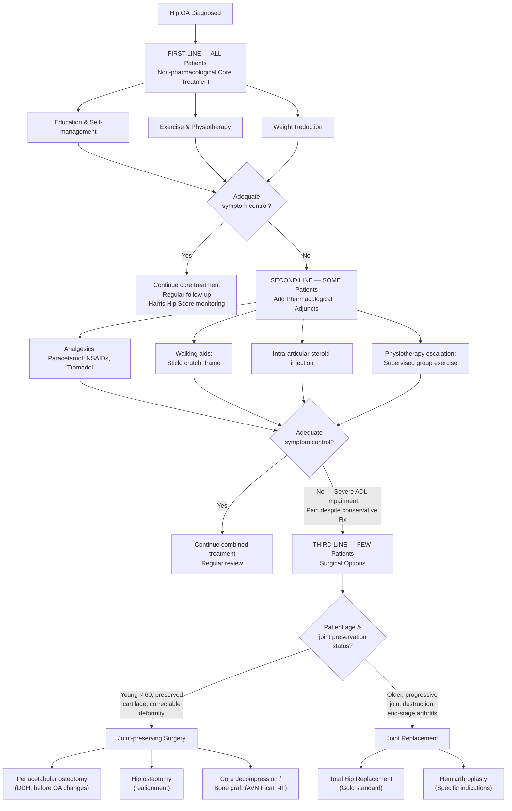

## Management of Hip Osteoarthritis

### 1. Management Principles — The Big Picture

The management of hip OA follows a **stepwise, escalating approach** — you always start with conservative measures and progress to surgery only when these fail. This is not arbitrary; it reflects the fact that OA is a **chronic, progressive condition** where the goal is to **maximise function, minimise pain, and delay or avoid major surgery** for as long as possible.

***The lecture slides present this as the "OA Treatment Pyramid"*** [17]:

> ***First-line treatment (ALL patients): Education, exercise and weight control***
> ***Second-line treatment (SOME patients): Pharmacological pain relief, aids and passive treatments***
> ***Third-line treatment (FEW patients): Surgery***

The key lecture slide message asks: ***"What is the first line management of OA?"*** and the answer is emphatically ***NOT analgesics or TKR/THR*** — it is ***weight reduction, education and exercise*** [18].

<Callout title="Exam Favourite">
***"What is the first-line management of knee/hip OA?"*** — The answer is **weight reduction, education and exercise**, NOT analgesics, NOT surgery. This is consistently tested because students reflexively jump to pharmacological or surgical options [18].
</Callout>

---

### 2. Management Algorithm

---

### 3. First-Line Treatment — Non-Pharmacological Core Treatment (ALL Patients)

This is the foundation of OA management. ***It should be offered to every single patient, regardless of disease severity.***

#### 3.1 Education and Self-Management

***The COME (Comprehensive Osteoarthritis ManagEment) programme at MMRC (MacLehose Medical Rehabilitation Centre)*** is specifically highlighted in the lecture slides as a Hong Kong model [19]:

***Structure*** [19]:
- ***Assessment*** (individual visit)
- ***Comprehensive Osteoarthritis Education*** (3 occasions):
  - ***Occasion 1***: What is OA? Risk factors, Symptoms, Treatment
  - ***Occasion 2***: Exercise, Physical activity in daily living
  - ***Occasion 3***: Coping, Management, OA communicator, To live with OA
- ***PT: Supervised group exercise (6 weeks)***
- ***OT: ADL management and training***
- ***Follow-up I (3 months)***: individual visit PT
- ***Follow-up II (1 year)***: telephone

***Collaborators*** [19]: Department of O&T QMH, Nursing, Physiotherapy, Occupational Therapy — emphasising the ***multidisciplinary approach***.

**Why education works**: Patients who understand their condition engage better with self-management strategies (exercise, weight loss). Empowering the patient to take ownership of their condition reduces catastrophising, improves coping, and decreases unnecessary healthcare utilisation.

> ***Osteoarthritis is a SERIOUS disease. A paradigm shift urgently needed in aging population in HK. Evidence-based management. Multi-disciplinary chronic disease management.*** [20]

#### 3.2 Exercise and Physiotherapy

***Physiotherapy as conservative treatment — Strong Evidence*** [21]:

> ***Strong evidence supports the use of physical therapy as a treatment to improve function and reduce pain for patients with osteoarthritis of the hip and mild to moderate symptoms.***
> ***Strength of Recommendation: Strong Evidence (3 stars)***
> ***Description: Evidence from two or more "High" strength studies with consistent findings*** [21]

***Components of physiotherapy*** [21]:
- ***Muscle strengthening*** — particularly **hip abductors** (gluteus medius/minimus) and **hip extensors** (gluteus maximus). Why? Strong abductors stabilise the pelvis during gait, reduce Trendelenburg mechanism, and reduce abnormal joint loading. Strong extensors improve push-off during walking.
- ***Range of motion exercise*** — maintains flexibility, prevents capsular contracture, delays fixed deformity.
- ***Cardiopulmonary function, endurance*** — general fitness improves overall functional capacity and reduces cardiovascular risk.

***Preoperative physiotherapy*** [21]:

> ***Limited evidence supports the use of pre-operative physical therapy to improve early function in patients with symptomatic osteoarthritis of the hip following total hip arthroplasty.***
> ***Strength of Recommendation: Limited Evidence (2 stars)*** [21]

So while prehabilitation is logical, the evidence is modest. It is still recommended in many centres because patients who are stronger and more mobile pre-operatively tend to recover faster.

**Why exercise works in OA (from first principles)**:
- **Strengthens periarticular muscles** → dynamic joint stabilisation → reduced abnormal contact stresses
- **Maintains ROM** → prevents contracture → preserves function
- **Promotes cartilage nutrition** — cartilage is **avascular** and relies on diffusion from synovial fluid. Cyclic loading during exercise acts as a "pump," driving nutrients into cartilage and waste products out
- **Reduces pain** via endorphin release and descending pain inhibition
- **Reduces body weight** → less mechanical load on the joint

#### 3.3 Weight Reduction

***Obesity is a major modifiable risk factor*** [2][17]. Every 1 kg of body weight lost reduces the load across the hip by approximately **3 kg** during walking (due to lever arm mechanics of the hip abductor mechanism). Even modest weight loss (5–10% of body weight) produces clinically meaningful improvements in pain and function.

**Why weight reduction is critical in hip OA**:
- **Mechanical**: reduced compressive force across the joint surfaces
- **Metabolic/inflammatory**: adipose tissue is an endocrine organ producing pro-inflammatory adipokines (leptin, resistin, IL-6, TNFα) that accelerate cartilage degradation. Weight loss reduces this systemic inflammatory burden.

---

### 4. Second-Line Treatment — Pharmacological and Adjunctive (SOME Patients)

Added when core treatments alone do not achieve adequate symptom control.

#### 4.1 Analgesics

***Analgesics do not affect the natural history of OA*** — they provide symptomatic relief only [22]. This is a critical concept: no currently available drug can reverse or halt cartilage degradation.

| Agent | Role | Mechanism | Key Points from Lectures |
|---|---|---|---|
| ***Paracetamol (Panadol)*** | ***First-line analgesic*** [22] | Central analgesic effect (mechanism incompletely understood — may involve COX-3 inhibition, serotonergic pathways, endocannabinoid system). **No anti-inflammatory effect.** | ***Widely used but network meta-analysis shows paracetamol does not seem to confer any demonstrable effect or benefit in OA at any dose*** [23]. Side effects: ***liver function abnormalities; elderly people with impaired paracetamol clearance*** [23]. Despite weak evidence, still recommended as first-line because of **safety profile relative to NSAIDs**. |
| **NSAIDs** (e.g., ibuprofen, naproxen, diclofenac) | Second-line; ***proven benefit*** [7] | Inhibit cyclooxygenase (COX-1 and COX-2) → reduce prostaglandin synthesis → reduce inflammation and pain in the synovium. | More effective than paracetamol for OA pain. However, significant side effects: **GI bleeding** (COX-1 inhibition reduces protective gastric mucus), **renal impairment** (prostaglandins maintain renal blood flow in hypovolaemia), **cardiovascular risk** (especially COX-2 selective inhibitors). Use at **lowest effective dose for shortest duration**. Add PPI for GI protection in high-risk patients. |
| ***Tramadol*** | ***Non-narcotic*** [22]; ***combine with paracetamol for synergistic effect*** [22]; ***if contraindication to use NSAIDs*** [22] | Weak μ-opioid receptor agonist + inhibits serotonin and noradrenaline reuptake → dual analgesic mechanism. "Non-narcotic" in the sense that it is a weaker opioid, but it can still cause dependence. | Used when paracetamol alone is insufficient and NSAIDs are contraindicated (e.g., renal impairment, GI bleeding history, cardiovascular disease). |
| ***Opioids*** | ***No routine use*** [22] | Strong μ-opioid receptor agonists. | ***CNS depression, addiction*** [22]. ***Opioids offer only limited benefit for chronic OA pain and function*** [24]. ***Potentially serious adverse effects including drug abuse and addiction*** [24]. ***Elderly patients are at particular risk — sedation and dizziness which predispose to falls and fractures*** [24]. Pre-operative opioid use ***independently predicted greater opioid requirement post-surgery, prolonged hospital stay, greater risks of in-hospital complications, and early revision surgery*** [24]. ***Updated Australian GP guidelines do not recommend opioids as a treatment option*** [24]. |

<Callout title="The Opioid Trap" type="error">
***Do NOT routinely prescribe opioids for chronic OA pain.*** The evidence shows minimal benefit with significant harm — addiction, falls in the elderly, worse surgical outcomes. If a patient is on opioids pre-operatively for OA, they will have a harder time after THR, not an easier one [24]. This is a common exam question and a real-world clinical pitfall.
</Callout>

#### 4.2 Topical Treatments

- **Topical NSAIDs** (e.g., diclofenac gel): useful for superficial joints (knee, hand) — less useful for the hip because the joint is deep and topical penetration is limited by the thick soft tissue envelope.
- **Capsaicin cream**: depletes substance P from peripheral nerve endings → reduces pain transmission. More evidence for knee than hip.

#### 4.3 Intra-articular Injections

| Injection | Evidence | Mechanism | Practical Points |
|---|---|---|---|
| **Intra-articular corticosteroid** | Moderate evidence for **short-term** pain relief [2] | Potent anti-inflammatory → suppresses synovitis, reduces effusion. | Hip injections must be done under **image guidance** (US or fluoroscopy) because the hip is deep. Provides weeks to months of relief. Repeated injections (> 3–4/year) may accelerate cartilage loss. Useful as a "bridge" while optimising conservative measures or awaiting surgery. |
| ***Intra-articular hyaluronic acid*** | ***Strong evidence DOES NOT support its use*** [25] | "Viscosupplementation" — hyaluronic acid is a normal component of synovial fluid; injection aims to restore viscoelastic properties. | ***Strong evidence does not support the use of intraarticular hyaluronic acid because it does not perform better than placebo for function, stiffness, and pain in patients with symptomatic osteoarthritis of the hip*** [25]. ***Strength of Recommendation: Strong Evidence (3 stars)*** [25]. Despite ongoing commercial promotion, the evidence is clear — it doesn't work for hip OA. |
| **Platelet-rich plasma (PRP)** | ***?evidence*** [2] | Contains growth factors (PDGF, TGFβ, VEGF) that theoretically promote tissue repair. | Evidence is mixed and mostly low quality. Not currently recommended as standard treatment. Mentioned in senior notes as having uncertain evidence [2]. |

<Callout title="Exam Point — Hyaluronic Acid for Hip OA" type="error">
***Strong evidence AGAINST intra-articular hyaluronic acid for hip OA*** [25]. This is a common exam question — students often mistakenly think viscosupplementation is a reasonable treatment option. For the hip specifically, the AAOS clinical practice guideline (cited in the lecture slides [26]) recommends AGAINST it.
</Callout>

#### 4.4 Walking Aids

***Walking aids relieve weight-bearing*** [2]:

- **Walking stick (cane)**: held in the **contralateral hand** (opposite side to the affected hip). Why? The cane provides an upward force that reduces the force the hip abductors need to generate during single-leg stance → reduces joint reaction force by up to **60%**.
- **Progression**: stick → tripod/quadripod → crutches → walking frame → rollator → wheelchair [11]

#### 4.5 Lifestyle Modifications [2]

- ***Weight loss*** — most impactful single intervention
- ***Regular exercise*** — as above
- ***Smoking cessation*** — smoking impairs tissue healing, worsens cardiovascular fitness, and is associated with increased OA pain perception
- Avoidance of pain-provoking activities; activity modification (e.g., swimming instead of running)

---

### 5. Third-Line Treatment — Surgery (FEW Patients)

***Indications for operative management*** [2]:
- ***Patient factors***: age, functional status, comorbidities, expectations
- ***Disease factors***: ***severe impairment to ADL, pain despite conservative treatment***

The key question is: **joint-preserving surgery vs. joint replacement?**

#### 5.1 Joint-Preserving Surgery

##### 5.1.1 Osteotomy

***Osteotomy: correct deformity and relieve joint pressure*** [2][27]:

| Feature | Details |
|---|---|
| **Indication** | ***Young (< 60y) with preservation of articular cartilage. Pre-requisite: single compartment*** [27] |
| **Contraindications** | ***Severe articular damage, ligament laxity, severe varus deformities*** [27] |
| **For the hip** | ***Hip osteotomy*** [27] — redirect the femoral head or acetabulum to improve coverage and redistribute load |

**Types of osteotomy for the hip**:

- ***Periacetabular osteotomy (PAO)*** [1]:
  - ***Indication***: ***Symptomatic dysplasia in young adult with concentrically reduced hip and congruent joint space — before OA changes*** [1]
  - **Mechanism**: the acetabulum is cut and reoriented to provide better coverage of the femoral head → more even load distribution → delays/prevents OA
  - Requires a skilled surgeon; technically demanding; significant rehabilitation
  
- **Femoral osteotomy** (valgus or varus):
  - Redirects the femoral head within the acetabulum
  - Used in specific deformities (e.g., post-Perthes, post-SCFE)

##### 5.1.2 Core Decompression and Bone Grafting (for AVN)

***Ficat Stage I–II AVN*** [14]:
- ***Core decompression***: drill a channel into the femoral head to reduce intraosseous pressure, relieve pain, and allow vascular ingrowth
- ***Vascularised bone graft (e.g., free vascularised fibular graft — FVFG)***: brings in a new blood supply with viable osteogenic cells

***Ficat Stage III***: ***Vascularised bone graft / THR*** [14]
***Ficat Stage IV (OA changes)***: ***THR*** [14]

##### 5.1.3 Arthroscopic Debridement

- ***Limited role in hip OA*** — can remove loose bodies, trim labral tears, resect osteophytes
- For the knee, the lecture slides explicitly state: ***Limited indication — frequent locking symptoms caused by meniscal tears and loose bodies; short-term relief only; increases rate of progression of OA; shortens time to joint replacement*** [28]. The same principles apply to the hip — arthroscopy is **not** a treatment for OA itself.

#### 5.2 Joint Replacement — The Definitive Treatment for End-Stage Hip OA

***Total hip replacement is a reliable and durable treatment option for patients with end stage arthritis*** [12].

##### 5.2.1 Total Hip Replacement (THR)

**Components**:
- **Acetabular component**: a cup (usually metal-backed with a polyethylene or ceramic liner) press-fitted or cemented into the acetabulum
- **Femoral component**: a stem inserted into the femoral canal (cemented or uncemented) with a head (metal or ceramic) that articulates with the acetabular liner

**Indications** [2][27]:
- Older patients with progressive joint destruction
- ***Secondary OA changes*** and ***hip subluxation*** (e.g., from DDH) [1]
- ***End-stage arthritis*** unresponsive to conservative treatment [12]
- **Intracapsular displaced femoral neck fracture (Garden III/IV) in elderly > 65 with pre-existing OA hip** [7]

**Bearing surfaces**: Metal-on-polyethylene (most common), Ceramic-on-ceramic (least wear, but risk of squeaking/fracture), Ceramic-on-polyethylene (good compromise).

**Fixation**: Cemented (PMMA bone cement — better for osteoporotic bone, immediate fixation), Uncemented (porous-coated — relies on bony ingrowth, better for younger patients with good bone stock), Hybrid (cemented stem + uncemented cup, or vice versa).

##### 5.2.2 Surgical Approaches for THR

***Different surgical approaches defined relative to gluteus medius*** [2]:

| ***Approach*** | ***Advantage*** | ***Disadvantage*** |
|---|---|---|
| ***Posterior — most common*** | ***Preserve abductor mechanism → Rapid rehab*** | ***Sciatic nerve injury; Risk of hip joint dislocation*** |
| ***Anterolateral (modified Hardinge)*** | ***Detach abductor mechanism → Good exposure*** | ***Superior gluteal nerve injury*** |
| ***Anterior (Smith-Petersen) — rare*** | ***For open washout of infected hip*** | Limited exposure; learning curve |

**Why does the posterior approach risk dislocation?** The posterior approach involves detaching the short external rotators (piriformis, obturator internus, gemelli) and the posterior capsule. These structures normally resist posterior dislocation. After surgery, if the patient flexes, adducts, and internally rotates the hip (e.g., sitting on a low chair, crossing legs), the femoral head can dislocate posteriorly through the unhealed posterior capsule.

**Why does the posterior approach risk sciatic nerve injury?** The sciatic nerve exits the pelvis below the piriformis and runs posterior to the hip joint — it is directly in the surgical field during the posterior approach.

**Why does the anterolateral approach risk superior gluteal nerve injury?** The approach splits or detaches the gluteus medius (innervated by the superior gluteal nerve). The nerve enters the muscle from its deep surface, approximately 5 cm proximal to the greater trochanter — surgical dissection beyond this "safe zone" can damage the nerve → hip abductor weakness → Trendelenburg gait.

<Callout title="Direct Anterior Approach — Modern Trend" type="idea">
The **direct anterior approach (DAA)** — distinct from the traditional Smith-Petersen — is gaining popularity. It is truly intermuscular and internervous (passes between sartorius/TFL laterally and rectus femoris medially), preserving the abductors and posterior capsule. Advantages: lower dislocation rate, faster recovery, fewer hip precautions. Disadvantage: steep learning curve, risk of lateral femoral cutaneous nerve injury (meralgia paraesthetica), wound complications in obese patients.
</Callout>

##### 5.2.3 THR Management Goals [29]

***Management goals for THR*** [29]:
- ***Joint***: ***Restore pain-free stable joint***
- ***Bone***:
  - ***Acetabular side: Restore anatomical hip centre***
  - ***Femoral side: Correct femoral side deformity***
- ***Soft tissue***:
  - ***Contracted muscles, ligaments and joint capsule***
  - ***Sciatic nerve*** (must protect from stretch injury, especially in DDH with limb lengthening)
  - ***Femoral shortening*** (may be needed in high-riding DDH to avoid excessive nerve stretch)

##### 5.2.4 Hemiarthroplasty

- Replaces the **femoral side only** (femoral head + stem); the native acetabulum is preserved.
- **Main indication**: **Intracapsular displaced femoral neck fracture in elderly > 65 without pre-existing OA** [7]. If the patient already has OA of the acetabulum, a hemiarthroplasty will articulate a metal/ceramic head against diseased acetabular cartilage → pain persists → THR is preferred.
- Types: **Cemented (Thompson)** vs **Uncemented (Austin-Moore)**; **Unipolar** vs **Bipolar** (additional joint between two components of the prosthetic head → theoretically reduces acetabular erosion) [7].

##### 5.2.5 Arthrodesis (Fusion)

- ***For small joints (e.g., MCP)*** [2], rarely used for the hip in modern practice.
- A fused hip eliminates pain but eliminates all movement → significant functional limitation. Reserved for very specific scenarios: young manual labourers with unilateral disease who cannot have THR (e.g., due to infection risk), or as salvage after failed THR.

#### 5.3 Enhanced Recovery After Surgery (ERAS) [11]

***The senior notes outline the ERAS protocol*** [11]:
- ***MSSA screening***: de-colonisation × 1 week (nasal mupirocin + chlorhexidine body wash to reduce surgical site infection risk)
- ***Pre-op analgesics*** (multimodal: paracetamol, NSAIDs, gabapentinoids)
- ***Dexamethasone on call to OT (16 mg IV stat)*** — reduces post-operative nausea, inflammation, and pain
- ***HbA1c control: < 8*** — hyperglycaemia impairs wound healing and increases infection risk
- ***Confirm definite discharge plan: 1 month full-time carer after TKA*** (principle applies to THR as well)

#### 5.4 Management of Specific Secondary Causes

| Cause | Specific Management Considerations |
|---|---|
| **DDH** | ***PAO if congruent joint space, before OA changes; THR if secondary OA or subluxation*** [1]. THR in DDH is technically challenging: shallow acetabulum, abnormal anatomy, potential need for femoral shortening, sciatic nerve at risk with limb lengthening. |
| **AVN** | ***Ficat I–II: core decompression ± bone graft; Ficat III: bone graft/THR; Ficat IV: THR*** [14]. Address underlying cause (stop steroids if possible, alcohol cessation). |
| **Inflammatory arthritis (RA, AS)** | ***Multidisciplinary approach*** [30]: ***Rheumatologist*** (***diagnosis, medical treatment, screening of associated disorders***) + ***Orthopaedic Surgeon*** (***hip, spine***) [30]. Medical treatment (DMARDs, biologics) must be optimised before considering THR. |
| **Infection (TB hip)** | Treat the infection first (anti-TB regimen for TB: 6–9 months of combination therapy). THR can be performed once infection is eradicated, but has higher complication rates. ***Anterior (Smith-Petersen) approach: for open washout of infected hip*** [2]. |

---

### 6. Summary Table — Management by Disease Stage

| Stage | Clinical Picture | Management |
|---|---|---|
| **Mild (KL 1–2)** | Mild pain, minimal functional limitation | Core treatment: education, exercise, weight loss. Paracetamol ± topical NSAIDs. |
| **Moderate (KL 3)** | Moderate pain, reduced ROM, some ADL limitation | Core treatment + oral NSAIDs (shortest duration), walking aids, PT escalation, intra-articular steroid. Consider osteotomy if young with correctable deformity. |
| **Severe (KL 4)** | Bone-on-bone, severe pain, significant ADL impairment, failed conservative Rx | Core treatment + THR (gold standard for end-stage). |
| **Young with secondary OA** | Early secondary OA from DDH, AVN, post-traumatic | Joint-preserving surgery first: PAO (DDH), core decompression/bone graft (AVN), osteotomy (deformity correction). THR if joint-preserving options exhausted. |

---

### 7. The AAOS Clinical Practice Guideline (2017) [26]

The lecture slides reference the ***AAOS Management of Osteoarthritis of the Hip Evidence-Based Clinical Practice Guideline*** [26]. Key recommendations:

| Intervention | AAOS Recommendation | Strength |
|---|---|---|
| ***Physical therapy*** | ***Strongly recommended for mild-moderate symptoms*** | ***Strong*** |
| ***Preoperative PT*** | ***Limited evidence supports early function improvement post-THR*** | ***Limited*** |
| ***Intra-articular hyaluronic acid*** | ***NOT recommended — does not outperform placebo*** | ***Strong (against)*** |
| **NSAIDs** | Recommended for pain relief | Strong |
| **Opioids** | Not routinely recommended | Against |
| **Weight loss** | Recommended | Moderate |
| **THR** | Recommended for end-stage disease | Strong |

---

<Callout title="High Yield Summary — Management of Hip OA">

1. ***First-line = Education, Exercise, Weight Control (ALL patients)*** — NOT analgesics, NOT surgery.
2. ***OA Treatment Pyramid***: Core non-pharmacological (all) → Pharmacological + adjuncts (some) → Surgery (few).
3. ***Physiotherapy — Strong evidence*** for improving function and reducing pain in mild-moderate hip OA.
4. ***Analgesics do NOT affect natural history*** — symptomatic relief only.
5. ***Paracetamol*** = first-line analgesic but ***network meta-analysis shows no demonstrable benefit in OA at any dose***; used for safety profile relative to NSAIDs.
6. ***NSAIDs have proven benefit*** but GI, renal, and cardiovascular side effects limit their use.
7. ***Tramadol***: non-narcotic, synergistic with paracetamol, use if NSAIDs contraindicated.
8. ***Opioids: NO routine use*** — limited benefit, serious adverse effects (addiction, falls in elderly, worse surgical outcomes).
9. ***Intra-articular hyaluronic acid: Strong evidence AGAINST*** — does not outperform placebo for hip OA.
10. ***Intra-articular steroid***: short-term relief, image-guided, useful as bridge.
11. **Surgical indications**: severe ADL impairment + pain despite conservative treatment.
12. **Joint-preserving**: Osteotomy (young < 60, preserved cartilage), PAO (DDH before OA), Core decompression (AVN Ficat I–II).
13. ***THR = reliable and durable for end-stage arthritis***. Surgical approaches relative to gluteus medius: Posterior (most common, preserves abductors but risk of dislocation/sciatic nerve injury), Anterolateral/Hardinge (good exposure but superior gluteal nerve injury), Anterior/Smith-Petersen (rare, for infected hip washout).
14. ***THR goals***: restore pain-free stable joint, restore anatomical hip centre (acetabular), correct femoral deformity, address soft tissue contractures, protect sciatic nerve.
15. ***Harris Hip Score*** for pre- and post-operative assessment.
16. ***Multidisciplinary approach*** for inflammatory causes (rheumatologist + orthopaedic surgeon).

</Callout>

---

<ActiveRecallQuiz
  title="Active Recall - Management of Hip OA"
  items={[
    {
      question: "What is the first-line management of hip OA according to the OA Treatment Pyramid? What are the three core components?",
      markscheme: "First-line (for ALL patients): Non-pharmacological core treatment. Three components: (1) Education and self-management, (2) Exercise and physiotherapy (muscle strengthening, ROM exercise, cardiopulmonary endurance), (3) Weight reduction. NOT analgesics, NOT surgery."
    },
    {
      question: "The lecture slides state that intra-articular hyaluronic acid should NOT be used for hip OA. What is the strength of recommendation and why?",
      markscheme: "Strong evidence AGAINST (3 stars). Intra-articular hyaluronic acid does not perform better than placebo for function, stiffness, and pain in symptomatic hip OA. Based on two or more high-strength studies with consistent findings against the intervention."
    },
    {
      question: "Name the three surgical approaches for THR, state the key advantage and disadvantage of each, and explain why the posterior approach carries a risk of dislocation.",
      markscheme: "Posterior (most common): preserves abductors, rapid rehab; risk of sciatic nerve injury and dislocation. Anterolateral/Hardinge: good exposure via detaching abductors; risk of superior gluteal nerve injury. Anterior/Smith-Petersen (rare): for infected hip washout. Posterior dislocation risk because short external rotators and posterior capsule are detached; flexion-adduction-IR can dislocate the head posteriorly through the unhealed capsule."
    },
    {
      question: "A 32-year-old woman with DDH has groin pain. X-ray shows a shallow acetabulum with congruent joint space and no OA changes. What is the optimal surgical management and why?",
      markscheme: "Periacetabular osteotomy (PAO). Indicated for symptomatic dysplasia in a young adult with concentrically reduced hip and congruent joint space, before OA changes develop. Reorients the acetabulum to provide better femoral head coverage, redistribute load, and delay/prevent OA. THR would be indicated only if secondary OA changes are already established."
    },
    {
      question: "Why are opioids NOT recommended for routine use in chronic hip OA? List at least 4 specific adverse outcomes mentioned in the lecture slides.",
      markscheme: "Opioids offer only limited benefit for chronic OA pain and function. Adverse effects: (1) CNS depression, (2) drug abuse and addiction, (3) elderly at risk of sedation/dizziness predisposing to falls and fractures, (4) pre-operative opioid use predicts greater post-surgical opioid requirement, (5) prolonged hospital stay, (6) greater in-hospital complications, (7) early revision surgery. Australian GP guidelines do not recommend opioids for OA."
    },
    {
      question: "State the indications and contraindications for osteotomy in hip OA, and contrast with the indications for THR.",
      markscheme: "Osteotomy: Young patient (less than 60), preservation of articular cartilage, single compartment disease, correctable deformity. Contraindicated if severe articular damage, ligament laxity, severe varus deformity. THR: Older patient with progressive joint destruction, end-stage arthritis, secondary OA changes, hip subluxation, failed conservative treatment with severe ADL impairment."
    }
  ]}
/>

## References

[1] Lecture slides: GC 229. Hip Arthritis (1).pdf (p. 81 — Management of DDH)
[2] Senior notes: maxim.md (sections 6.3 OA hip, 9.1 Osteoarthritis — Management)
[7] Senior notes: maxim.md (sections 6.2 Hip trauma, 7.4 OA knee — KL classification, surgical options)
[11] Senior notes: maxim.md (section 1.3 Management overview — ERAS, walking aids)
[12] Lecture slides: GC 229. Hip Arthritis (1).pdf (p. 103 — Take Home Messages)
[14] Lecture slides: GC 229. Hip Arthritis (1).pdf (p. 20 — Ficat classification and treatment)
[17] Lecture slides: GC 228. Knee Osteoarthritis_Part A (1).pdf (pp. 35–36 — OA Treatment Pyramid)
[18] Lecture slides: GC 228. Knee Osteoarthritis_Part B (1).pdf (p. 30 — First-line management question)
[19] Lecture slides: GC 228. Knee Osteoarthritis_Part A (1).pdf (p. 42 — COME programme)
[20] Lecture slides: GC 228. Knee Osteoarthritis_Part B (1).pdf (p. 29 — Conclusion)
[21] Lecture slides: GC 229. Hip Arthritis (1).pdf (pp. 37–38 — Physiotherapy evidence)
[22] Lecture slides: GC 229. Hip Arthritis (1).pdf (p. 39 — Analgesics)
[23] Lecture slides: GC 228. Knee Osteoarthritis_Part B (1).pdf (p. 8 — Paracetamol evidence)
[24] Lecture slides: GC 228. Knee Osteoarthritis_Part B (1).pdf (p. 10 — Opioids)
[25] Lecture slides: GC 229. Hip Arthritis (1).pdf (p. 44 — Intra-articular hyaluronic acid)
[26] Lecture slides: GC 229. Hip Arthritis (1).pdf (p. 34 — AAOS guideline reference)
[27] Senior notes: maxim.md (section 9.1 — Osteotomy vs Arthroplasty table)
[28] Lecture slides: GC 228. Knee Osteoarthritis_Part B (1).pdf (p. 18 — Limited role of arthroscopy)
[29] Lecture slides: GC 229. Hip Arthritis (1).pdf (p. 64 — Management goals for THR)
[30] Lecture slides: GC 229. Hip Arthritis (1).pdf (p. 92 — Multidisciplinary approach for AS)
