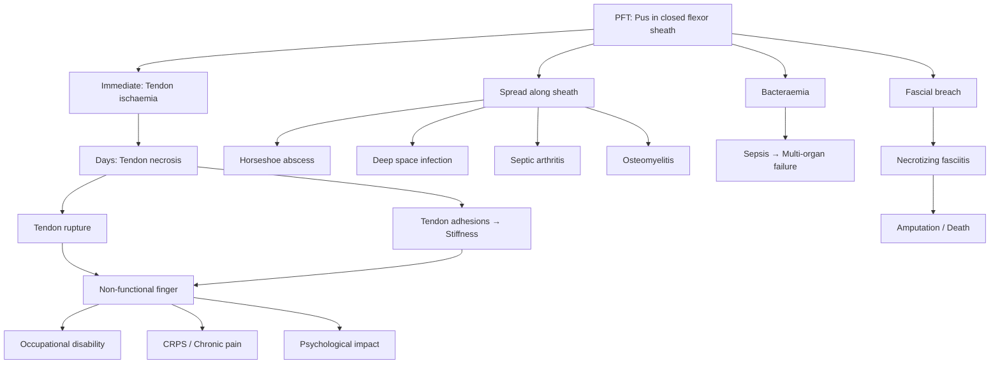

## Complications of Infective (Pyogenic Flexor) Tenosynovitis

---

### Overview

***Understand the sequelae of MSS infections if not treated promptly*** is a stated learning outcome [1]. Complications of PFT arise from two fundamental pathological processes:

1. **The infection itself** — tissue destruction by bacteria, pus, and the host inflammatory response within a closed space
2. **The treatment** — surgical complications and antibiotic side effects

The severity of complications is directly proportional to the **duration of untreated infection** and the **host's immune reserve**. This is why the entire preceding management framework emphasises speed: ***prompt clinical diagnosis*** [1] and ***early surgical intervention*** [1] are the best ways to prevent complications.

---

### 1. Local Complications (Within the Digit and Hand)

#### 1.1 Tendon Necrosis and Rupture

| Aspect | Explanation |
|---|---|
| **Mechanism** | This is the feared complication that makes PFT a surgical emergency. Pus accumulates within the non-distensible tendon sheath → intra-sheath pressure rises → compression of the **vincula** (the mesenteric-like folds carrying blood vessels from the digital arteries to the tendon surface) → **tendon ischaemia**. If pressure is not relieved within ~24–48 hours, the tendon undergoes irreversible **coagulative necrosis**. The necrotic tendon subsequently **weakens and ruptures**. This is identical in principle to how compartment syndrome kills muscle [6] |
| **Clinical consequence** | Loss of active flexion at the DIP (if FDP necroses) and/or PIP (if FDS necroses). A finger that cannot flex is functionally useless for grip. If both tendons necrose, the finger is essentially non-functional |
| **Management** | Prevention is key — early decompression. Once necrosed, the dead tendon must be **debrided** at surgery. Reconstruction with **tendon grafting** (e.g., palmaris longus graft) may be attempted later (usually staged, months after infection clearance), but outcomes are poor due to the scarred sheath bed |

#### 1.2 Tendon Adhesions and Stiffness

| Aspect | Explanation |
|---|---|
| **Mechanism** | Even when the tendon survives, the inflammatory process within the sheath deposits **fibrin** → organisation into **fibrous adhesions** between the tendon surface and the sheath wall. These adhesions **tether** the tendon, preventing normal gliding. Additionally, prolonged immobilisation (splinting during treatment) allows the collateral ligaments of the PIPJ and DIPJ to shorten. Adhesions are a late complication [6] that contributes to a **stiff, non-functional finger** |
| **Clinical consequence** | Restricted active and passive ROM of the PIPJ and DIPJ. The finger may be locked in a fixed flexion deformity (analogous to Green's Grade IV trigger finger [2]) |
| **Management** | **Prevention**: early post-operative rehabilitation (active/passive ROM exercises under hand therapy guidance, starting 48–72h post-op). **Treatment**: tenolysis (surgical release of adhesions) — but this is a secondary procedure performed only after the infection has completely resolved and the tissues have matured (~3–6 months later) |

#### 1.3 Flexion Contracture

| Aspect | Explanation |
|---|---|
| **Mechanism** | Prolonged inflammation → fibrous tissue formation within and around the sheath → shortening of the volar plate and collateral ligaments of the PIPJ → the joint becomes fixed in flexion. If open debridement was performed with a wound left to heal by secondary intention, scar contracture across the flexion crease worsens this (hence the importance of the ***zig-zag incision*** [1] to minimise perpendicular scar formation across creases) |
| **Clinical consequence** | Fixed flexion deformity — the finger cannot be fully extended. This impairs hand function for flat-surface tasks, glove wearing, and aesthetics |
| **Management** | Prevention: splinting in the position of safety, early ROM exercises. Treatment: serial splinting, physiotherapy, and if refractory, surgical release (capsulotomy ± tenolysis) |

<Callout title="Why Stiffness Is So Common After PFT">
The tendon sheath is a precision-engineered gliding mechanism — synovial fluid lubricates the tendon-sheath interface, and the pulleys guide the tendon at exact distances from the bone. Any disruption to this system (inflammation, adhesions, sheath damage during surgery, immobilisation) causes stiffness. This is why the balance between adequate treatment (which disrupts the sheath) and minimal surgical trauma (preserving the sheath) is so important, and why early rehabilitation is mandatory.
</Callout>

#### 1.4 Digital Nerve and Artery Damage

| Aspect | Explanation |
|---|---|
| **Mechanism** | The digital neurovascular bundles run immediately adjacent to the tendon sheath on both sides of the finger. They can be damaged by: (a) the infection itself (inflammatory compression or direct bacterial destruction), (b) surgical manipulation during debridement (iatrogenic injury) |
| **Clinical consequence** | **Nerve damage**: numbness or dysaesthesia in the distribution of the affected digital nerve (one side of the finger distal to the injury). **Artery damage**: digital ischaemia (rare, as there are two digital arteries per finger providing collateral supply) |
| **Management** | Meticulous surgical technique with direct visualisation of neurovascular bundles during open debridement. If nerve transection occurs, microsurgical repair or nerve grafting may be attempted |

---

### 2. Regional Complications (Spread Beyond the Digit)

#### 2.1 Horseshoe Abscess

| Aspect | Explanation |
|---|---|
| **Mechanism** | Infection in the **thumb** sheath (continuous with the radial bursa) or **little finger** sheath (continuous with the ulnar bursa) tracks proximally through the bursa → across the **space of Parona** (potential space deep to pronator quadratus in the distal forearm) → into the other bursa → infects the other digit. This creates a "horseshoe" or "U-shaped" pattern of infection connecting the thumb and little finger via the forearm |
| **Clinical consequence** | Both the thumb AND little finger become infected, plus there is a deep collection in the distal forearm. Massive tissue destruction affecting multiple tendons. This is a **devastating complication** with very poor functional outcomes |
| **Management** | Extensive open debridement via multiple incisions (thumb, little finger, palm, and forearm). Staged debridements are often required. Prolonged IV antibiotics |

#### 2.2 Deep Space Infection of the Hand

| Space | Anatomical Location | How PFT Spreads to It |
|---|---|---|
| **Midpalmar space** | Between the 3rd–5th metacarpals and the palmar aponeurosis | Direct extension from the ring/middle/little finger flexor sheath through the proximal cul-de-sac |
| **Thenar space** | Between the 1st metacarpal and the adductor pollicis | Extension from the index finger or thumb flexor sheath |
| **Hypothenar space** | Deep to the hypothenar muscles | Extension from the little finger sheath |
| **Web spaces** | Between the fingers at the metacarpal heads | Contiguous spread from adjacent digital sheaths |

Deep space infections present with **loss of the normal palmar concavity** (the palm becomes "full" and convex due to the deep collection), severe pain, and systemic toxicity. They require **open drainage** through dedicated incisions.

#### 2.3 Septic Arthritis of Adjacent Joints

| Aspect | Explanation |
|---|---|
| **Mechanism** | The flexor tendon sheath is intimately related to the MCPJ, PIPJ, and DIPJ. Infection can erode through the sheath wall into the joint capsule, or spread via shared vascular channels. In infants (where the growth plate does not act as a barrier), and in adults where the sheath overlies the joint, contiguous spread is common |
| **Clinical consequence** | Joint cartilage destruction → chronic pain, stiffness, and eventually secondary osteoarthritis. ***Septic arthritis*** is one of the ***musculoskeletal infections you cannot miss*** [1] because of irreversible cartilage damage |
| **Management** | ***Joint aspiration for Gram stain, C/ST, crystal, glucose*** [1]; ***operative irrigation*** [4]; ***IV cloxacillin × 4–6 weeks*** [4] |

#### 2.4 Osteomyelitis of the Phalanges

| Aspect | Explanation |
|---|---|
| **Mechanism** | Contiguous spread from the infected tendon sheath to the underlying phalanx. Bacteria penetrate the periosteum and enter the bone → suppuration → rising intraosseous pressure → spread through **Volkmann canals** to the bone surface → **sequestrum** (dead bone), **involucrum** (new reactive bone), **cloacae** (periosteal drainage openings) [4] |
| **Clinical consequence** | Chronic, difficult-to-eradicate bone infection. Draining sinuses. The necrotic bone (sequestrum) acts as a foreign body harbouring bacteria, making eradication without surgical debridement nearly impossible |
| **Management** | ***MRI: best in diagnosis*** [4]. ***IV cloxacillin × 4–6 weeks + surgical debridement*** [4]. May require bone resection if extensive |

---

### 3. Systemic Complications

#### 3.1 Sepsis and Septic Shock

| Aspect | Explanation |
|---|---|
| **Mechanism** | Bacteria from the infected sheath enter the bloodstream (bacteraemia) → systemic inflammatory response → organ dysfunction (sepsis) → if untreated, vasodilatory shock (septic shock). Risk is highest in immunocompromised patients and those with delayed treatment |
| **Clinical consequence** | Multi-organ failure, ICU admission, death |
| **Management** | Sepsis 6 bundle: blood cultures, serum lactate, IV antibiotics, IV fluids, urine output monitoring, oxygen. Source control (surgery) is mandatory |

#### 3.2 Necrotizing Fasciitis

| Aspect | Explanation |
|---|---|
| **Mechanism** | If the infection breaks through the tendon sheath and fascia, it may evolve into ***necrotizing fasciitis*** — a rapidly progressive, life-threatening soft tissue infection that destroys the fascial planes. This is more likely in ***immunocompromised*** patients, those with ***DM***, and infections caused by *S. pyogenes*, *V. vulnificus*, or polymicrobial flora [1] [4] |
| **Clinical consequence** | ***Pain out of proportion to clinical signs, haemorrhagic bullae, systemic toxicity, dirty "dishwater" discharge*** [4]. If hand/forearm is involved, very high risk of limb loss |
| **Management** | ***Aggressive debridement + IV broad-spectrum antibiotics*** [4]. ***LRINEC score > 8 = high risk*** [4] |

---

### 4. Amputation

This is the ultimate local complication — loss of the digit or part of the hand.

***Sequelae if not treated promptly*** [1]:
- ***Amputation***
- ***HK figure: radical debridements (amputations and disarticulations) were performed in 46% of 24 patients***
- ***Mortality ranges from 20 to 75%***

These HK data (from Tang WM et al., JBJS 2001, cited in the lecture [1]) refer specifically to necrotizing fasciitis of the hand, but they underscore the devastating potential of untreated or under-treated hand infections including PFT.

| Aspect | Explanation |
|---|---|
| **Mechanism** | Tendon necrosis + digital artery thrombosis (due to peri-sheath inflammation) → non-viable, gangrenous digit. Or, overwhelming infection with sepsis where the digit is the source and cannot be salvaged |
| ***Risk factors for amputation*** [1] | ***DM*** — microangiopathy impairs perfusion and wound healing; ***Renal failure*** — uraemic immunosuppression; ***Peripheral vascular disease*** — inadequate perfusion for healing |
| **Indications for amputation** | Non-viable digit (gangrene, complete tendon necrosis, absent digital perfusion); uncontrollable infection despite multiple debridements; life-threatening sepsis requiring source control; functionless painful digit (elective, after infection resolved). Indications follow the **3D mnemonic** [6]: **Dead** (ischaemia/gangrene), **Damage** (irreparable trauma), **Danger** (gangrene, ascending sepsis, necrotizing fasciitis, osteomyelitis) |
| **Complications of amputation** | **Early**: bleeding/haematoma, wound infection, phantom limb pain, skin necrosis (poor stump perfusion). **Late**: stump neuroma, osteomyelitis of stump, stump ulceration [6] |

<Callout title="The Hong Kong Data" type="error">

The lecture specifically highlights that ***in a HK series of 24 patients with necrotizing fasciitis, radical debridements (amputations and disarticulations) were performed in 46%*** and ***mortality ranges from 20 to 75%*** [1]. While this refers to necrotizing fasciitis broadly, PFT can be the initiating event that leads to NF of the hand. This is why we consider PFT a genuine emergency — delayed or missed diagnosis can set off a cascade ending in amputation or death.
</Callout>

---

### 5. Complications of Treatment

#### 5.1 Surgical Complications

| Complication | Mechanism | Prevention |
|---|---|---|
| **Iatrogenic nerve injury** | Digital nerves run adjacent to the sheath; can be damaged during incision or debridement | Careful dissection under direct vision; use of zig-zag incision (which avoids crossing directly over the neurovascular bundles) |
| **Iatrogenic artery injury** | Digital arteries similarly at risk | Identify and protect vessels during dissection |
| **Pulley damage** | Overzealous opening of the sheath may damage A2 or A4 pulleys → **bowstringing** (tendons pull away from bone during flexion → loss of mechanical advantage → weakness and poor flexion) | Preserve A2 and A4 pulleys during debridement; only open A3, A5, and cruciate pulleys if needed for access |
| **Wound infection / delayed healing** | Open wounds (left for secondary intention) are vulnerable to secondary infection and slow healing, especially in diabetic/immunocompromised patients | Aseptic dressing technique, optimise glycaemic control, adequate nutrition |
| **Flexion contracture from scar** | If a straight incision crosses a flexion crease → scar contracts → pulls joint into flexion | ***Zig-zag incision*** [1] prevents perpendicular scar across flexion creases |

#### 5.2 Antibiotic Complications

| Complication | Mechanism |
|---|---|
| **Allergic reaction / anaphylaxis** | Hypersensitivity (especially to β-lactams — penicillins, cephalosporins). Always check allergy history |
| **Nephrotoxicity** | Vancomycin (dose-dependent tubular damage); aminoglycosides. Monitor trough levels and renal function |
| **Ototoxicity** | Vancomycin, aminoglycosides — damage to cochlear hair cells |
| ***Clostridioides difficile*** **colitis** | Prolonged broad-spectrum antibiotics disrupt gut flora → *C. difficile* overgrowth → pseudomembranous colitis. Risk highest with fluoroquinolones, clindamycin, broad-spectrum cephalosporins |
| **Hepatotoxicity** | Rifampicin (used for *M. marinum*) — monitor LFTs regularly |
| **Optic neuritis** | Ethambutol (used for *M. marinum*) — monitor visual acuity. *Ethambutol* = "Eye-thambutol" — the name helps you remember the side effect |

---

### 6. Functional and Psychosocial Complications

These are often under-appreciated but profoundly affect patient quality of life:

| Complication | Mechanism / Impact |
|---|---|
| **Chronic pain / CRPS** | Complex Regional Pain Syndrome (CRPS type I) can develop after any hand infection/surgery. Characterised by disproportionate pain, swelling, autonomic changes (colour/temperature asymmetry), and allodynia. Mechanism involves aberrant sympathetic nervous system activity and central sensitisation [6] |
| **Loss of occupation** | Many patients with PFT are manual workers (the demographic most exposed to hand injuries). A stiff, weak finger can make return to their occupation impossible |
| **Psychological impact** | Chronic pain, disability, disfigurement (amputation), prolonged hospitalisation → depression, anxiety, adjustment disorder |
| **Financial burden** | Prolonged hospital stay, multiple surgeries, rehabilitation, inability to work |

---

### 7. Summary: Complications Timeline

| Timing | Complication | Mechanism |
|---|---|---|
| **Immediate** (hours) | Tendon ischaemia | Rising intra-sheath pressure → vincular compression |
| **Early** (days) | Tendon necrosis; horseshoe abscess; deep space infection; septic arthritis; osteomyelitis; sepsis | Unrelieved pressure → necrosis; spread along anatomical pathways; bacteraemia |
| **Intermediate** (weeks) | Tendon adhesions; flexion contracture; necrotizing fasciitis; need for amputation | Fibrin deposition → organisation; fascial spread; non-viable tissue |
| **Late** (months–years) | Chronic stiffness; chronic pain / CRPS; occupational disability; psychological sequelae; stump complications (if amputated) | Adhesion maturation; central sensitisation; loss of function |

---

<Callout title="High Yield Summary">

**Complications of PFT — Key Takeaways:**

1. **Tendon necrosis** is the most feared complication — caused by vincular compression from rising intra-sheath pressure. Irreversible within 24–48 hours. This is why PFT is a surgical emergency.
2. **Tendon adhesions and stiffness** are the most common long-term complications — even with successful treatment. Early rehabilitation is essential.
3. **Horseshoe abscess** occurs when thumb or little finger PFT spreads via the radial/ulnar bursae and space of Parona to involve the opposite digit + forearm.
4. **Contiguous spread** can cause septic arthritis, osteomyelitis, and deep space infection of the hand.
5. **Systemic complications**: sepsis and necrotizing fasciitis — potentially fatal.
6. ***Amputation was performed in 46% of HK patients with hand NF; mortality 20–75%*** [1].
7. ***Risk factors for amputation: DM, renal failure, peripheral vascular disease*** [1].
8. **Treatment complications**: iatrogenic nerve/vessel injury, pulley damage → bowstringing, scar contracture, antibiotic toxicity.
9. **Functional/psychosocial**: CRPS, chronic pain, occupational disability, depression.

</Callout>

---

<ActiveRecallQuiz
  title="Active Recall - Complications of Infective Tenosynovitis"
  items={[
    {
      question: "Explain the pathophysiological mechanism by which PFT causes tendon necrosis, drawing an analogy to another orthopaedic emergency.",
      markscheme: "Pus accumulates in the non-distensible flexor tendon sheath (closed space) causing rising intra-sheath pressure. This compresses the vincula (mesenteric folds carrying blood vessels to the tendon from the digital arteries), leading to tendon ischaemia. If not decompressed within 24-48 hours, irreversible coagulative necrosis occurs. This is analogous to compartment syndrome, where rising pressure in a fascial compartment compresses vessels causing muscle ischaemia."
    },
    {
      question: "Describe the anatomical pathway of a horseshoe abscess and explain why it only involves the thumb and little finger.",
      markscheme: "The thumb flexor sheath is continuous with the radial bursa, and the little finger flexor sheath is continuous with the ulnar bursa. The radial and ulnar bursae communicate at the space of Parona (deep to pronator quadratus in the distal forearm). Infection tracks: thumb sheath -> radial bursa -> space of Parona -> ulnar bursa -> little finger sheath (or vice versa). The index, middle, and ring finger sheaths are discrete closed-ended compartments that do NOT communicate with the bursae, so they cannot form a horseshoe abscess."
    },
    {
      question: "State the HK data on outcomes of necrotizing fasciitis of the hand presented in the lecture, and list 3 risk factors for amputation.",
      markscheme: "HK data: radical debridements (amputations and disarticulations) were performed in 46% of 24 patients; mortality ranges from 20 to 75%. Risk factors for amputation: 1. Diabetes mellitus. 2. Renal failure. 3. Peripheral vascular disease."
    },
    {
      question: "Why is early hand rehabilitation critical after surgical treatment of PFT, and what complication does it aim to prevent?",
      markscheme: "Early active and passive ROM exercises aim to prevent tendon adhesion formation. The inflammatory process within the sheath deposits fibrin which organises into fibrous adhesions between the tendon and sheath wall, tethering the tendon and preventing normal gliding. Additionally, prolonged immobilisation causes shortening of collateral ligaments and the volar plate leading to joint contracture. Early rehabilitation promotes tendon gliding and prevents stiffness, but must be balanced against disrupting healing."
    },
    {
      question: "Name 3 complications of surgical treatment of PFT and explain how each can be minimised.",
      markscheme: "1. Iatrogenic digital nerve injury - minimised by careful dissection under direct vision and use of zig-zag incision which avoids crossing directly over the neurovascular bundles. 2. Pulley damage causing bowstringing - minimised by preserving A2 and A4 pulleys (biomechanically critical) and only opening A3, A5, and cruciate pulleys for access. 3. Flexion contracture from scar - minimised by using zig-zag (Bruner) incision which prevents perpendicular scar formation across flexion creases, plus early mobilisation."
    }
  ]}
/>

---

## References

[1] Lecture slides: GC 237. Musculoskeletal infection [Updated in 2025] (1).pdf (pages 2, 3, 24, 28, 29, 32, 44, 54)
[2] Senior notes: maxim.md (section 506: trigger finger — Green's classification, pulley system)
[4] Senior notes: maxim.md (sections 566–567: osteomyelitis, septic arthritis, necrotizing fasciitis — sequestrum/involucrum, LRINEC score)
[6] Senior notes: maxim.md (section 454: complications of trauma — compartment syndrome, adhesions, CRPS, Volkmann's contracture); felixlai.md (section 1381: amputation — 3D indications, complications)
