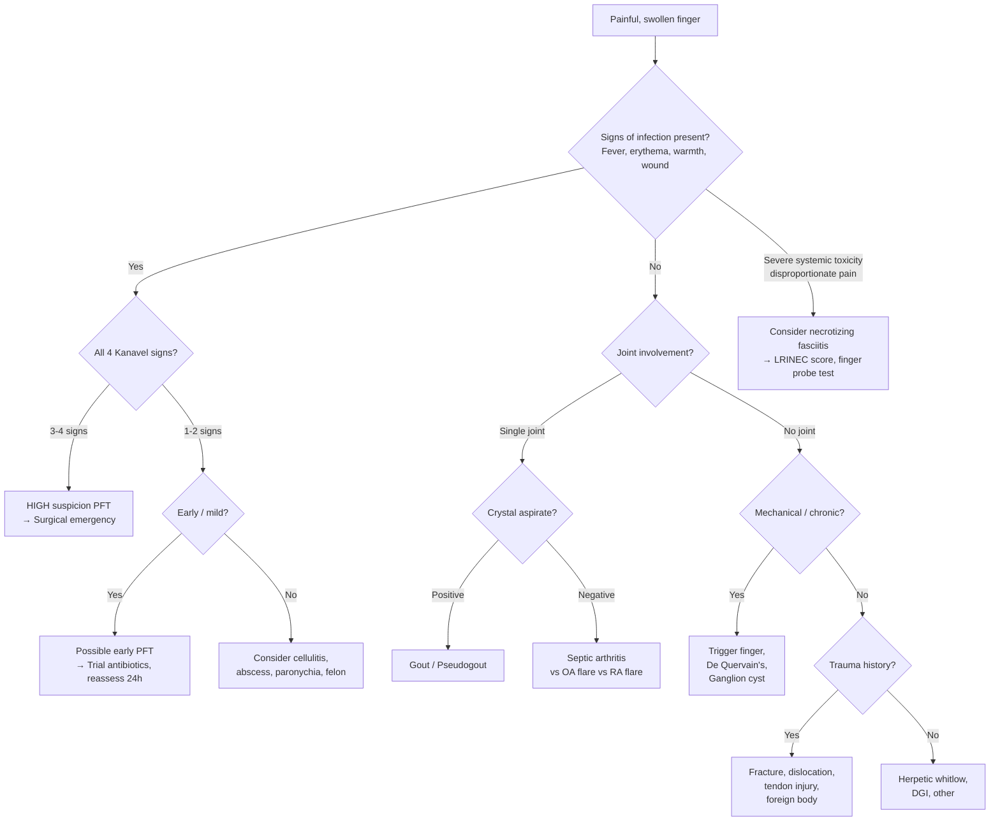

## Differential Diagnosis of Infective (Pyogenic Flexor) Tenosynovitis

The differential diagnosis of a swollen, painful finger is broader than you might think. The key clinical challenge is distinguishing **pyogenic flexor tenosynovitis (PFT)** — a surgical emergency — from conditions that can mimic it. Let's work through this systematically, grouping differentials by anatomical location and pathological process, and explaining *why* each condition can be confused with PFT and *how* to tell them apart.

---

### Guiding Principle: What Makes PFT Unique?

Before diving into differentials, recall what defines PFT clinically — the **4 Kanavel signs** [1]:

1. ***Fusiform (symmetrical) swelling of the entire finger***
2. ***Flexed posture of the involved digit***
3. ***Tenderness over and limited to the flexor sheath***
4. ***Severe pain on passive extension of the finger (especially proximally)***

Any condition that causes a swollen, painful, stiff finger can mimic PFT. The differentials can be organised by the **TIN** framework (Trauma, Infection, Neoplasm) plus Inflammatory, Metabolic, Degenerative, and Vascular categories [3].

---

### Differential Diagnosis Table

| Differential | Why It Mimics PFT | How to Distinguish from PFT |
|---|---|---|
| **Felon (pulp space abscess)** | Painful, swollen fingertip; may coexist with or spread to cause PFT | Swelling and tenderness **confined to the distal pulp** (volar pad of fingertip), not along the entire flexor sheath. No fusiform swelling of the whole digit. No pain on passive extension of PIPJ/MCPJ. The pulp is a **separate closed compartment** (septae of Grayson's ligaments) distinct from the tendon sheath |
| **Paronychia** | Painful, swollen periungual area; can spread contiguously to cause PFT | Swelling and erythema **localised to the nail fold** (lateral or proximal). Pus may be visible under the cuticle. No tenderness along the proximal flexor sheath. No flexed posture |
| **Herpetic whitlow** | Painful vesicular lesion on the fingertip; can be mistaken for a felon or early PFT | **Grouped vesicles** on an erythematous base on the fingertip. Viral prodrome (tingling/burning). Often in healthcare workers (HSV exposure). **Do NOT incise** — will spread the virus. Tzanck smear or viral PCR confirms |
| ***Septic arthritis*** **of PIPJ, DIPJ, or MCPJ** | Hot, swollen, painful joint; limited ROM; fever | Pain and swelling **localised to one joint**, not along the entire sheath. Tenderness is **periarticular**, not along the whole flexor sheath. ***Hot, swollen, tender joint; patient holds joint in flexion; gross limitation of motion*** [1]. Joint aspiration: ***WBC > 50,000/mm³, > 75% PMN, positive Gram stain (60–80%)*** [1]. Can coexist with PFT (contiguous spread) |
| **Subcutaneous abscess / cellulitis of the finger** | Red, swollen, painful finger | Cellulitis: **diffuse erythema** with ill-defined borders, warmth, but **no fusiform swelling along the sheath** and **no pain on passive extension**. Abscess: **focal fluctuant collection**, not tracking along the tendon sheath. Tenderness is superficial and not limited to the flexor sheath pathway |
| **Gout / pseudogout (crystal arthropathy)** | Acute monoarthritis of a finger joint — exquisitely painful, red, swollen | Usually affects **one joint** (MCPJ, PIPJ, or 1st MTPJ in foot). History of prior attacks, tophi, elevated urate. Joint aspirate: **negatively birefringent needle-shaped crystals** (gout) or **positively birefringent rhomboid crystals** (pseudogout). No tenderness along the entire flexor sheath |
| **Trigger finger (stenosing tenovaginitis of A1 pulley)** [2] | Finger locked in flexion — mimics the "flexed posture" Kanavel sign | ***Clicking or locking*** in flexion at the **A1 pulley level** (over MCPJ), **not** along the entire sheath. **No signs of infection** (no fever, no erythema, no warmth). Tenderness is **focal** over the A1 pulley only, not fusiform. **Chronic** and **mechanical**, not acute and infective. Green's classification grades I–IV [2] |
| **De Quervain's tenosynovitis** [2] | Painful tendon sheath pathology; the word "tenosynovitis" itself causes confusion | This is a **non-infective, stenosing tenovaginitis** of the **1st extensor compartment** (APL & EPB) on the **dorsal/radial side of the wrist**, not the flexor sheath of a digit [2]. Positive **Finkelstein's test** [2]. No fever, no fusiform digital swelling |
| **Flexor tendon injury / rupture** | Pain, swelling, inability to flex the finger | History of **acute laceration or forced extension** injury. Inability to actively flex DIP (FDP injury) or PIP (FDS injury). No signs of infection acutely. Tenodesis effect absent for the ruptured tendon |
| **Fracture of phalanx** | Pain, swelling, inability to move the finger; may have flexed posture due to pain | History of **direct trauma**. **Point tenderness over bone**, not along the flexor sheath. Deformity, crepitus may be present. **X-ray** will show fracture line. No systemic infective features |
| **Dislocation of PIPJ or DIPJ** | Painful, swollen, deformed finger held in abnormal position | Obvious **deformity** at the joint. History of hyperextension or axial loading injury. Reducible. X-ray diagnostic |
| ***Necrotizing fasciitis*** | Severe pain, swelling, systemic toxicity — can start in the hand | ***Pain out of proportion to clinical signs; haemorrhagic bullae; dirty "dishwater" discharge; systemic toxicity*** [1] [4]. Rapidly progressive. Skin changes (dusky, necrotic) evolve faster than PFT. ***Finger probe test positive*** (minimal resistance to blunt dissection through fascial planes) [4]. ***LRINEC score > 8 = high risk*** [4]. This is a **life-threatening emergency** |
| ***Osteomyelitis*** **of phalanx** | Chronic painful swollen finger with limited ROM | Usually ***insidious*** onset (unless acute haematogenous). ***Draining sinus tract*** may be present in chronic cases [4]. **X-ray**: periosteal reaction, lytic lesions (may be normal in acute phase). **MRI** is best for diagnosis [4]. Can coexist with PFT (contiguous spread from tendon sheath to bone) |
| **Ganglion cyst** [2] | Swelling on the finger or wrist | ***Solitary spherical painless smooth cystic lesion; transilluminable*** [2]. **Non-tender**, no signs of infection. Chronic, not acute. Located at joint capsule or tendon sheath but does not cause fusiform swelling of the entire digit |
| **Disseminated gonococcal infection (DGI)** | Tenosynovitis (often multiple tendons) + arthritis | Young sexually active patient. **Polytenosynovitis** (multiple tendons of wrists/ankles/fingers — not isolated to one digit). **Migratory polyarthralgia**. **Dermatitis** (scattered painless pustules on trunk/extremities). Blood/genital NAAT positive. Joint aspirate often culture-negative |
| **Gout tophi / rheumatoid nodule** | Chronic nodular swelling near finger joints | Non-tender (unless flaring), **chronic**, no acute infective features. Tophi: chalky white deposits. RA nodules: firm subcutaneous nodules at pressure points |
| **Foreign body reaction / retained foreign body** | Painful swollen finger after penetrating injury | History of penetrating trauma (same as PFT!). May have a **palpable foreign body**. X-ray may show radiopaque material (glass, metal). If foreign body is within the tendon sheath, it can *cause* secondary PFT — so these coexist. Ultrasound helps identify non-radiopaque foreign bodies |

---

### Differential Diagnosis Decision Framework

---

### Key Differentiating Features — The "Discriminators"

When you're standing at the bedside trying to decide if this is PFT or something else, focus on these discriminators:

| Feature | PFT | Felon | Paronychia | Cellulitis | Septic arthritis | Necrotizing fasciitis |
|---|---|---|---|---|---|---|
| **Distribution of swelling** | **Entire digit** (fusiform) | Distal pulp only | Nail fold only | Diffuse, ill-defined | Periarticular, one joint | May extend beyond digit |
| **Tenderness distribution** | **Along entire flexor sheath** | Distal pulp | Periungual | Diffuse, superficial | Periarticular | Deep, out of proportion |
| **Pain on passive extension** | **Yes — severe** | No | No | Minimal | Yes (at affected joint only) | Yes but diffuse |
| **Flexed posture** | **Yes** | No | No | No | Yes (at one joint) | Variable |
| **Skin changes** | Erythema | Tense pulp | Erythema at nail fold | Spreading erythema | Erythema over joint | ***Haemorrhagic bullae***, dusky skin, necrosis [4] |
| **Systemic toxicity** | Moderate (late) | Mild | Mild | Moderate | Moderate | ***Severe, early*** [4] |
| **Speed of progression** | Hours to days | Days | Days | Days | Hours to days | ***Hours — rapidly progressive*** [4] |

<Callout title="The Critical 'Do Not Miss' Diagnoses" type="error">

When evaluating a swollen painful finger/hand, the three diagnoses you **cannot miss** because of devastating consequences are [1]:

1. ***Pyogenic flexor tenosynovitis*** → tendon necrosis, stiff finger, amputation
2. ***Septic arthritis*** → joint destruction
3. ***Necrotizing fasciitis*** → limb loss, death

All three require ***early recognition*** and ***early surgical intervention + empirical antibiotics*** [1]. If in doubt, treat as the most dangerous diagnosis first.
</Callout>

---

### Approach to Narrowing the Differential

**Step 1: Is this infective or non-infective?**
- Infective: fever, wound/portal of entry, leucocytosis, elevated CRP, rapid onset
- Non-infective: chronic/mechanical symptoms, no systemic features (trigger finger, De Quervain's, ganglion)

**Step 2: If infective — where exactly is the infection?**
- **Tendon sheath** → PFT (fusiform swelling, all 4 Kanavel signs)
- **Joint** → Septic arthritis (periarticular swelling, pain with any joint movement, aspiration diagnostic)
- **Pulp** → Felon (focal distal swelling)
- **Nail fold** → Paronychia
- **Subcutaneous tissue** → Cellulitis/abscess
- **Fascia/deep planes** → Necrotizing fasciitis (pain out of proportion, systemic toxicity, skin necrosis)
- **Bone** → Osteomyelitis (usually subacute/chronic unless haematogenous)

**Step 3: If the whole finger is swollen ("sausage digit"), think of:**

| Acute | Chronic |
|---|---|
| PFT (infective) | Psoriatic dactylitis (inflammatory) |
| Septic arthritis (may overlap) | Reactive arthritis (Reiter's) |
| Gout flare | Sarcoidosis |
| Fracture with haematoma | TB dactylitis (spina ventosa) |
| | Sickle cell dactylitis (children) |

The **acute sausage digit with Kanavel signs + a wound** is PFT until proven otherwise.

**Step 4: Check for coexisting/evolving pathology**
- PFT can **arise from** a felon or paronychia (contiguous spread)
- PFT can **progress to** septic arthritis, osteomyelitis, deep space infection, or necrotizing fasciitis
- Always examine for **proximal spread** (palm, wrist, forearm) — suggests horseshoe abscess or deep space involvement

<Callout title="Practical Tip" type="idea">
In the exam or clinical setting, if you're given a scenario of a painful swollen finger after a penetrating injury and you can identify **tenderness along the entire flexor sheath + pain on passive extension**, that is essentially pathognomonic for PFT. The other conditions do not produce this combination. State the diagnosis confidently — don't hedge with a long differential when the Kanavel signs are clearly present.
</Callout>

---

### Special DDx Scenarios Worth Knowing

#### PFT vs Cellulitis
This is the commonest clinical dilemma. Both cause a red, swollen, painful finger after a wound. The key is that in cellulitis, the inflammation is **in the subcutaneous tissue**, not the tendon sheath. So:
- Cellulitis: erythema is **superficial and spreading**, tenderness is **diffuse** (not along the sheath), **no pain on passive extension**, **no fusiform swelling** (irregular swelling instead), **no flexed posture**
- PFT: tenderness **tracks along the sheath** from palm to fingertip, **pain on passive extension is marked**

#### PFT vs Gout Flare (Podagra of the Hand)
An acute gout attack at the MCPJ or PIPJ can produce a red, swollen, exquisitely tender finger. However:
- Gout: periarticular swelling at **one joint**, not fusiform along the entire digit. History of prior attacks, hyperuricaemia, tophi. Joint aspiration with **polarised microscopy** showing negatively birefringent urate crystals is diagnostic [4]
- PFT: tenderness along the **entire** sheath, not limited to one joint

#### PFT vs Disseminated Gonococcal Infection (DGI)
DGI can cause tenosynovitis, but it is characteristically **polytenosynovitis** (multiple tendons, often wrists and ankles, not just one finger). Associated features include migratory polyarthralgia and a characteristic **dermatitis** (scattered painless pustules). The patient is typically young and sexually active.

---

<Callout title="High Yield Summary">

**Differential Diagnosis of Infective Tenosynovitis — Key Takeaways:**

1. The **4 Kanavel signs** are the primary discriminators — no other condition produces all four simultaneously
2. **Pain on passive extension** (most specific) and **tenderness along the entire flexor sheath** (most sensitive) are the best signs to distinguish PFT from other finger infections
3. **Three "cannot miss" diagnoses** in a painful swollen hand: ***PFT, septic arthritis, necrotizing fasciitis*** — all require emergency surgical intervention [1]
4. Commonest diagnostic dilemma is **PFT vs cellulitis** — look for sheath-specific signs (fusiform swelling, flexed posture, pain on passive extension)
5. **Sausage digit** has a broad differential (PFT, dactylitis, gout) — acute onset + wound + Kanavel signs = PFT
6. PFT can **coexist with or evolve from/into** adjacent infections (felon → PFT → septic arthritis → osteomyelitis → deep space infection)
7. ***Necrotizing fasciitis***: pain out of proportion, haemorrhagic bullae, systemic toxicity, dishwater pus, LRINEC > 8 [1] [4]

</Callout>

---

<ActiveRecallQuiz
  title="Active Recall - DDx of Infective Tenosynovitis"
  items={[
    {
      question: "Name 3 'cannot miss' diagnoses in a patient presenting with a painful, swollen hand/finger and explain why each is an emergency.",
      markscheme: "1. Pyogenic flexor tenosynovitis - tendon necrosis from closed-space pressure; 2. Septic arthritis - rapid cartilage destruction; 3. Necrotizing fasciitis - rapidly progressive fascial necrosis, sepsis, and death. All require urgent surgical intervention plus empirical antibiotics."
    },
    {
      question: "A patient has a red, swollen index finger after a thorn prick. How do you clinically distinguish PFT from simple cellulitis at the bedside?",
      markscheme: "PFT: fusiform swelling of the ENTIRE digit, tenderness along the ENTIRE flexor tendon sheath (not just superficial), flexed posture at rest, and severe pain on PASSIVE EXTENSION. Cellulitis: diffuse superficial erythema with irregular swelling, tenderness is diffuse and superficial, no pain on passive extension, no flexed posture, no sheath-specific tenderness."
    },
    {
      question: "A young sexually active woman presents with tenosynovitis of multiple tendons at the wrist and ankle plus scattered pustular skin lesions. What is the likely diagnosis and how does this differ from PFT?",
      markscheme: "Disseminated gonococcal infection (DGI). DGI causes polytenosynovitis (multiple tendons, multiple sites) with migratory polyarthralgia and characteristic dermatitis (painless pustules). PFT is typically isolated to a single digit flexor sheath after penetrating trauma. Diagnosis via NAAT of genital/rectal/pharyngeal swabs and blood cultures."
    },
    {
      question: "What clinical features distinguish necrotizing fasciitis from PFT in a hand infection?",
      markscheme: "Necrotizing fasciitis: pain OUT OF PROPORTION to clinical signs, rapidly progressive, haemorrhagic bullae, dusky/necrotic skin changes, dirty dishwater discharge, severe systemic toxicity early. Positive finger probe test (minimal resistance to blunt dissection). LRINEC score > 8. PFT: pain and signs confined to the flexor tendon sheath with fusiform swelling and Kanavel signs; systemic toxicity is a late feature."
    },
    {
      question: "List 4 causes of a 'sausage digit' (dactylitis) and state one distinguishing feature for each.",
      markscheme: "1. PFT - acute onset after wound, Kanavel signs present; 2. Psoriatic dactylitis - chronic, associated with psoriatic skin/nail changes and sacroiliitis; 3. Gout - periarticular inflammation at one joint, urate crystals on aspirate; 4. TB dactylitis (spina ventosa) - chronic, lytic bone lesion on X-ray, usually in children. Others acceptable: reactive arthritis, sarcoidosis, sickle cell dactylitis."
    }
  ]}
/>

---

## References

[1] Lecture slides: GC 237. Musculoskeletal infection [Updated in 2025] (1).pdf (pages 2, 3, 24, 27, 28, 32, 41, 54)
[2] Senior notes: maxim.md (sections 504–508: tendon-related pathology, De Quervain's, trigger finger, ganglion cyst, Kanavel signs)
[3] Senior notes: maxim.md (section 446: differential diagnosis tiers — TIN framework)
[4] Senior notes: maxim.md (sections 564, 566–567: necrotizing fasciitis, osteomyelitis, septic arthritis, LRINEC score)
