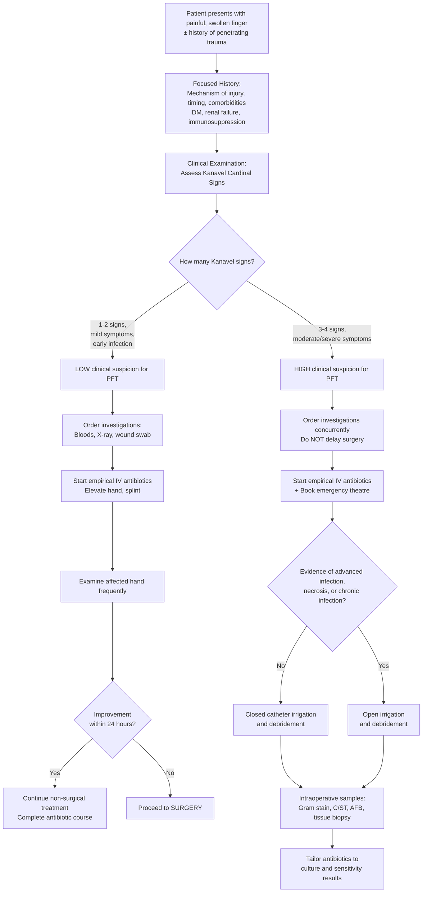

## Diagnostic Criteria, Diagnostic Algorithm, and Investigations for Infective (Pyogenic Flexor) Tenosynovitis

---

### 1. Diagnostic Criteria

PFT is fundamentally a **clinical diagnosis**. There is no single laboratory test or imaging study that confirms it — the diagnosis rests on recognising the clinical pattern at the bedside. This is why Kanavel's cardinal signs, described in 1912, remain the diagnostic gold standard over a century later.

#### 1.1 Kanavel's Cardinal Signs — The Diagnostic Criteria

***Kanavel's Cardinal Signs (described in 1912)*** [1]:

| # | Sign | Sensitivity / Specificity | Pathophysiological Basis |
|---|---|---|---|
| 1 | ***Tenderness over and limited to the flexor sheath*** | **Most sensitive** (~91–97%) | The entire synovial sheath is inflamed and distended with pus → pressure on any point along the sheath (from the distal palmar crease to the fingertip) elicits pain. Tenderness being *limited to* the sheath (not diffusely spread) helps localise the infection |
| 2 | ***Symmetrical enlargement of the digit ("fusiform")*** | Sensitive but less specific | Pus fills the sheath uniformly along its length → the finger swells symmetrically like a sausage/spindle. Other causes of sausage digit (dactylitis, cellulitis) reduce specificity |
| 3 | ***Severe pain on passive extension of the finger (greater proximally)*** | **Most specific** (~97%) | Passive extension stretches the inflamed, tense sheath and increases intra-sheath pressure. Pain is *greater proximally* because the proximal sheath is where pus tends to pool (gravity + anatomy of the cul-de-sac). This sign is rarely positive in non-sheath infections |
| 4 | ***Flexed posture of the involved digit*** | Moderately sensitive | The sheath accommodates maximal volume when the finger is in slight flexion (the sheath is lax). Extension would compress the sheath → the patient instinctively holds the finger flexed to minimise pain. Also contributed to by flexor spasm |

<Callout title="How Many Kanavel Signs Do You Need?">

The lecture slides present a clear threshold [1]:

- ***1–2 Kanavel signs + mild clinical symptoms + early infection*** → **Low clinical suspicion** → Trial of non-operative management
- ***3–4 Kanavel signs + moderate/severe symptoms*** → **High clinical suspicion** → **Surgical emergency** — proceed to operative treatment

**In practice**: if even **2 signs are present in the right clinical context** (e.g., penetrating wound + immunocompromised), maintain a very low threshold for surgery. The signs may not all be present early in the disease course. The key principle is that ***prompt clinical diagnosis*** is essential [1] — waiting for all 4 signs to develop risks tendon necrosis.
</Callout>

#### 1.2 Why Is This a Clinical Diagnosis?

Let's think about this from first principles:

- The flexor tendon sheath is a **tiny, deep structure** — you cannot aspirate it reliably at the bedside (unlike a knee joint in septic arthritis)
- Imaging (X-ray, ultrasound, MRI) can support the diagnosis but none are sensitive or specific enough to confirm or exclude PFT definitively in the acute setting
- **Blood tests** (WCC, CRP) are non-specific — they tell you there is infection *somewhere* but not *where*
- Microbiological confirmation (culture from sheath aspirate or intraoperative samples) comes **after** treatment has begun

Therefore, the clinical decision to operate is made **before** investigations return. Investigations serve to:
1. **Support** the clinical diagnosis
2. **Exclude differentials** (fracture, gout, foreign body)
3. **Guide antibiotic therapy** (culture & sensitivity)
4. **Assess for complications** (osteomyelitis, deep space infection)
5. **Risk-stratify** the patient (DM, renal failure, immunosuppression)

<Callout title="Exam Principle" type="error">
Never delay surgical treatment of PFT while waiting for investigation results. ***Prompt clinical diagnosis*** [1] and treatment takes priority. Investigations are supportive, not gate-keeping.
</Callout>

---

### 2. Diagnostic Algorithm

The following algorithm integrates the clinical assessment with investigation findings and the ***management protocol flow chart*** from the lecture [1]:

<Callout title="Key Decision Points from Lecture" type="idea">

***Non-operative treatment is indicated when:*** [1]
- ***Early presentation, within 48 hours after injury***
- ***Antibiotics started***
- ***Examine the affected hand frequently***
- ***No improvement after 24 to 48 hours → surgery is indicated***

This means non-operative management is only a **monitored trial** — you must reassess regularly and have a very low threshold to escalate to surgery.
</Callout>

---

### 3. Investigation Modalities

Investigations are organised into **bedside**, **blood tests**, **imaging**, and **microbiological** categories. For each, I'll explain *what* you're looking for, *why* it's relevant, and *how* to interpret the findings.

---

#### 3.1 Bedside Investigations

| Investigation | What to Look For | Why / Interpretation |
|---|---|---|
| **Vital signs** | Fever (temperature > 38°C), tachycardia, hypotension | Systemic inflammatory response. Fever supports infective aetiology. Hypotension + tachycardia → concern for sepsis (especially if necrotizing fasciitis or horseshoe abscess) |
| **Wound inspection** | Site, size, depth of any puncture wound; foreign body; discharge | Identifies the **portal of entry**. Purulent discharge from the wound confirms infection. A retained foreign body (thorn, fish bone) may be visible or palpable |
| **Capillary refill time and perfusion** | Prolonged CRT, mottling, pallor of the digit | Vascular compromise — may indicate compartment-like pressure in the sheath, or concurrent peripheral vascular disease |
| **Neurovascular status of the digit** | Sensation (two-point discrimination), motor function, digital Allen's test | Baseline neurovascular assessment before surgery. Also assesses whether digital nerve/artery is compromised by swelling |
| **Blood glucose** (point-of-care) | Hyperglycaemia | Undiagnosed or poorly controlled DM — a major risk factor for poor outcomes and ***amputation*** [1]. Needs aggressive glycaemic control |

---

#### 3.2 Blood Investigations

***Investigations include CBP, ESR, CRP*** [1] (discussed in the context of septic arthritis, but equally applicable to PFT):

| Test | Expected Findings in PFT | Why / Interpretation |
|---|---|---|
| ***Complete blood picture (CBP)*** | **Leucocytosis** with **neutrophilia** (left shift) | Acute bacterial infection stimulates bone marrow neutrophil release. A normal WCC does **not** exclude PFT (can be normal early, or in immunosuppressed patients). A very high WCC ( > 15,000) with bandaemia suggests severe/systemic infection |
| ***Erythrocyte sedimentation rate (ESR)*** | Elevated (often > 30 mm/hr) | Non-specific marker of inflammation. Rises slowly (over days). More useful for monitoring treatment response over time than for acute diagnosis |
| ***C-reactive protein (CRP)*** | Elevated (often > 50 mg/L) | Acute phase reactant synthesised by the liver in response to IL-6. Rises within 6–8 hours of infection onset and peaks at 48 hours. More responsive than ESR for acute infection. Serial CRP is useful for monitoring treatment response — a falling CRP suggests improving infection |
| **Blood cultures** (aerobic + anaerobic) | May be positive (especially in bacteraemia/sepsis) | Should be taken **before** starting antibiotics. Positive in ~10–20% of PFT cases. More likely positive if systemically unwell. Identifies the organism and guides targeted antibiotic therapy. ***Blood for C/ST (50% positive in osteomyelitis)*** [4] — yield is lower in PFT but still important |
| **Renal function (U&E, creatinine)** | Elevated creatinine → ***renal failure*** is a risk factor for ***amputation*** [1] | Assesses comorbidity. Also needed for antibiotic dosing (many antibiotics are renally cleared). Acute kidney injury may indicate sepsis |
| **Liver function tests** | Deranged in liver disease / cirrhosis | Liver disease predisposes to *Vibrio vulnificus* infection — relevant in Hong Kong. Also affects drug metabolism |
| **HbA1c** | > 6.5% indicates diabetes | Identifies undiagnosed DM or assesses chronic glycaemic control in known diabetics. ***DM present in 57% of necrotizing fasciitis patients*** [1] — similarly important in PFT |
| **Blood glucose** | Hyperglycaemia | Acute stress response and/or uncontrolled DM |
| **Uric acid + joint aspirate microscopy** (if DDx gout) | Elevated uric acid; negatively birefringent crystals on polarised microscopy | To exclude crystal arthropathy as a differential. Remember: hyperuricaemia alone does not confirm gout — crystal identification is required |
| **Procalcitonin** (if available) | Elevated in bacterial infection | More specific for bacterial infection than CRP. Helps differentiate bacterial from non-bacterial inflammation. Not universally available |

<Callout title="Interpreting Normal Bloods" type="error">
A **normal WCC and CRP do NOT exclude PFT**, especially in:
- **Early infection** (within first 24 hours — CRP hasn't peaked yet)
- **Immunosuppressed patients** (unable to mount an adequate inflammatory response)
- **Elderly patients** (blunted inflammatory response)

If the clinical picture fits (Kanavel signs present), **treat the patient, not the blood test**.
</Callout>

---

#### 3.3 Imaging Investigations

***Describe the radiological features associated with MSS infections*** is a stated learning outcome [1].

| Modality | What to Look For | Why / Interpretation |
|---|---|---|
| ***X-ray of the affected hand (AP and lateral)*** | **Soft tissue swelling** (fusiform along the digit); **foreign body** (radiopaque material — glass, metal, gravel); **subcutaneous gas** (suggests gas gangrene or necrotizing fasciitis); **fracture** (if trauma); **periarticular osteopenia / joint space changes** (if coexistent septic arthritis or osteomyelitis) | X-ray is the **first-line imaging** — fast, cheap, widely available. Its main role in PFT is to **exclude other diagnoses** (fracture, foreign body, gas gangrene) and **detect complications** (osteomyelitis). ***X-ray: normal in acute osteomyelitis*** [4] — so a normal X-ray does NOT exclude bony involvement. ***Linear streak of gas*** on X-ray suggests gas gangrene [4]. In septic arthritis: ***joint space effusion, periarticular osteopenia*** [4] |
| **Ultrasound (USS) of the tendon sheath** | **Fluid within the tendon sheath** (anechoic or hypoechoic collection surrounding the tendon); **thickened synovial sheath**; **peritendinous oedema**; **foreign body** (even non-radiopaque ones like wood, thorns) | USS is **excellent for detecting fluid in the tendon sheath** — a distended sheath with echogenic fluid (pus) is highly suggestive. It can also identify foreign bodies missed on X-ray. **Limitations**: operator-dependent, cannot differentiate sterile from infected fluid. Best used as a **bedside adjunct** to clinical examination. Can also guide **aspiration** of the sheath if attempted |
| ***MRI of the hand*** | **Fluid signal within the tendon sheath** (T2 hyperintense); **synovial sheath enhancement** (post-gadolinium); **peritendinous oedema**; **adjacent soft tissue infection** (deep space abscess); **osteomyelitis** (bone marrow oedema) | ***MRI: useful to detect any co-existent osteomyelitis — not routine*** [1]. MRI is the **most sensitive and specific imaging modality** for PFT and its complications. It beautifully shows the anatomical extent of infection — critical for surgical planning. However, it is **time-consuming** (30–60 minutes), **expensive**, and **not available emergently** in most centres. Therefore, it is reserved for: (a) diagnostic uncertainty, (b) suspected complications (osteomyelitis, deep space infection), (c) chronic/atypical presentations (*M. marinum*). **Do NOT delay surgery** to obtain an MRI |
| **CT scan** | Soft tissue collections, gas, bony involvement | Less useful than MRI for soft tissue detail. May be used if MRI is unavailable or to look for **gas in deep tissues** (necrotizing fasciitis). ***CT with contrast for deep/organ space infection: rim-enhancing collection*** [5] |

> **Summary of Imaging Hierarchy in PFT:**
> 1. **X-ray** → first line (exclude fracture, foreign body, gas)
> 2. **Ultrasound** → bedside adjunct (detect sheath fluid, foreign body)
> 3. **MRI** → gold standard for soft tissue detail but NOT routine and NOT for acute decision-making
> 4. **CT** → rarely needed; consider if necrotizing fasciitis suspected

---

#### 3.4 Microbiological Investigations

These are the investigations that **guide targeted antibiotic therapy**. Think of them in two stages: **pre-operative** and **intra-operative**.

##### Pre-operative Samples

| Sample | Tests Ordered | Interpretation |
|---|---|---|
| **Wound swab / pus from the entry wound** | Gram stain, culture and sensitivity (C/ST), AFB smear (if chronic/atypical) | ***Wound swab/pus for culture*** [5] — take from the wound itself, **avoid the wound edge** (contamination with skin flora) [5]. Gram stain gives a rapid (< 1 hour) guide to organism morphology (Gram-positive cocci in clusters → *Staph*; Gram-positive cocci in chains → *Strep*; Gram-negative rods → enteric organisms). Culture and sensitivity takes 24–48 hours but gives definitive identification and antibiogram |
| **Blood cultures** (x2 sets, aerobic + anaerobic) | C/ST | Take **before** starting antibiotics. Two sets from different venepuncture sites to reduce contamination. Positive in ~10–20% of PFT; higher yield if systemically septic |
| **Swabs for specific pathogens** (if clinically indicated) | Gonococcal NAAT (genital/rectal/pharyngeal); AFB smear and *Mycobacterium* culture (if chronic/marine exposure) | If DGI suspected: NAAT more sensitive than culture. If *M. marinum* suspected: **warn the lab** — requires **prolonged incubation at 30–32°C** (lower than standard 37°C), otherwise will be missed |

##### Intra-operative Samples (taken during surgical irrigation/debridement)

| Sample | Tests Ordered | Interpretation |
|---|---|---|
| **Sheath fluid / pus aspirate** | Gram stain, C/ST (aerobic + anaerobic + fungal), AFB smear and culture | This is the **most important microbiological sample** — direct from the site of infection, highest yield. Gram stain guides initial empirical therapy refinement |
| **Tissue biopsy** (synovial sheath wall) | Histopathology (H&E, Ziehl-Neelsen, PAS/GMS for fungi), tissue culture (bacterial, mycobacterial, fungal) | Essential if **chronic/granulomatous** infection suspected (*M. marinum*, TB, fungal). Histopathology shows granulomatous inflammation with caseation (TB) or non-caseating granulomas (*M. marinum*). Tissue culture is more sensitive than swab culture for atypical mycobacteria |
| **Foreign body** (if found) | Send for culture | A retained foreign body (thorn, fish bone) may harbour organisms |

<Callout title="Lab Communication for Atypical Organisms" type="idea">
If you suspect ***Mycobacterium marinum*** (marine injury, chronic indolent course), you **must** explicitly communicate this to the microbiology lab. Standard culture protocols incubate at 37°C, but *M. marinum* grows optimally at **30–32°C** and requires **prolonged incubation (up to 6–8 weeks)**. If you don't alert the lab, the culture will be falsely reported as negative.

Similarly, for ***Neisseria gonorrhoeae***, request specific **chocolate agar** or **NAAT** — the organism is fastidious and will not grow on routine media.
</Callout>

---

#### 3.5 Investigations for Differentials (When Diagnosis Is Uncertain)

| Differential Being Considered | Additional Investigation | Key Finding |
|---|---|---|
| **Septic arthritis** | ***Joint aspiration: Gram stain, culture, crystal, glucose*** [1] | ***WCC > 50,000/mm³, > 75% PMN, positive Gram stain (60–80%)*** for bacterial (non-gonococcal) septic arthritis [1]. Low glucose ( < 50% of serum glucose) |
| **Gout / pseudogout** | Joint aspirate with **polarised microscopy** | Negatively birefringent needle-shaped crystals (monosodium urate = gout); positively birefringent rhomboid crystals (calcium pyrophosphate = pseudogout) |
| **Necrotizing fasciitis** | ***LRINEC score*** [4]; ***bedside finger probe test*** [1] | ***LRINEC > 8 = high risk*** [4]. Components: CRP, Hb, WCC, sodium, creatinine, glucose. ***Finger probe test: lack of bleeding, foul smelling dishwater pus, minimal tissue resistance to finger dissection*** [1] |
| **Osteomyelitis** | X-ray (may be normal acutely); ***MRI: best in diagnosis*** [4] | ***X-ray: periosteal reaction, sclerosis in chronic; normal in acute*** [4]. MRI: bone marrow oedema, periosteal enhancement |
| **Foreign body** | X-ray (radiopaque); USS (non-radiopaque) | Radiopaque on X-ray: metal, glass. Non-radiopaque on USS: wood, thorn, plastic — appear as hyperechoic foci with posterior acoustic shadowing |
| **Fracture** | X-ray hand (AP + lateral + oblique) | Fracture line, cortical discontinuity, displacement |
| **Herpetic whitlow** | Viral PCR / Tzanck smear | Multinucleated giant cells on Tzanck; HSV PCR positive |

---

### 4. Interpretation Framework: Putting It All Together

When you receive investigation results, interpret them in the context of the clinical picture:

| Scenario | Bloods | X-ray | USS | Clinical | Interpretation |
|---|---|---|---|---|---|
| **Classic acute PFT** | WCC ↑, CRP ↑ | Soft tissue swelling, no fracture | Fluid in tendon sheath | 3–4 Kanavel signs | Confirmed PFT → emergency surgery |
| **Early PFT** | Normal or mildly ↑ | Normal or mild soft tissue swelling | May show early fluid | 1–2 Kanavel signs | Possible early PFT → antibiotics + close monitoring |
| **PFT with osteomyelitis** | WCC ↑↑, CRP ↑↑, ESR ↑↑ | Periosteal reaction (if chronic) | Fluid in sheath + periosteal changes | Severe, late presentation | Complicated PFT → open debridement + prolonged antibiotics |
| **Chronic granulomatous** | WCC normal, ESR mildly ↑ | Normal or lytic bone changes | Thickened sheath, complex fluid | Indolent sausage digit, marine exposure | Suspect *M. marinum* → tissue biopsy + special cultures |
| **Necrotizing fasciitis** | WCC ↑↑, CRP ↑↑↑, Na ↓, Cr ↑ | Gas in soft tissues | Deep fluid, fascial oedema | ***Pain out of proportion, haemorrhagic bullae, systemic toxicity*** [1] [4] | Emergency → aggressive debridement |

---

### 5. Summary Table: All Investigations at a Glance

| Category | Investigation | Primary Purpose | Timing |
|---|---|---|---|
| **Bedside** | Vital signs, BSL, neurovascular exam | Assess systemic status, risk-stratify | Immediate |
| **Bloods** | ***CBP, ESR, CRP*** [1] | Confirm systemic inflammation | Immediate — do NOT delay treatment |
| **Bloods** | Blood cultures (x2 sets) | Identify organism for targeted Abx | Before starting antibiotics |
| **Bloods** | U&E, Cr, LFT, HbA1c, glucose | Assess comorbidities, Abx dosing | Immediate |
| **Imaging** | X-ray hand (AP + lateral) | Exclude fracture, foreign body, gas | First-line, immediate |
| **Imaging** | USS tendon sheath | Detect sheath fluid, foreign body | Bedside adjunct |
| **Imaging** | MRI (***not routine*** [1]) | Detect osteomyelitis, deep space infection | If diagnostic uncertainty or complications suspected |
| **Microbiology** | Wound swab / pus for C/ST | Identify organism | Pre-operative |
| **Microbiology** | Intra-op sheath fluid + tissue biopsy | Gold standard microbiological sample | During surgery |
| **Special** | Joint aspirate (if DDx septic arthritis) | ***Gram stain, culture, crystal, glucose*** [1] | If joint involvement suspected |

<Callout title="High Yield Summary">

**Diagnosis of PFT — Key Takeaways:**

1. **PFT is a CLINICAL diagnosis** based on ***Kanavel's 4 cardinal signs*** [1] — no investigation can replace bedside assessment
2. **Most sensitive sign**: tenderness along the entire flexor sheath; **Most specific sign**: pain on passive extension
3. **Threshold for surgery**: ***3–4 Kanavel signs → surgical emergency***; ***1–2 signs → trial of antibiotics with reassessment at 24 hours*** [1]
4. **Investigations are supportive, not gate-keeping** — ***prompt clinical diagnosis*** [1] takes priority
5. **First-line imaging**: X-ray (exclude fracture, foreign body, gas); USS (detect sheath fluid); ***MRI is not routine*** but best for complications [1]
6. **Bloods**: ***CBP, ESR, CRP*** [1] + blood cultures before antibiotics + renal function + glucose/HbA1c
7. **Gold standard microbiology**: intra-operative sheath fluid and tissue biopsy sent for Gram stain, C/ST (aerobic, anaerobic, AFB, fungal)
8. **Alert the lab** if you suspect *M. marinum* (30–32°C incubation) or *N. gonorrhoeae* (chocolate agar / NAAT)
9. **Normal bloods do NOT exclude PFT** — treat the patient, not the blood test

</Callout>

---

<ActiveRecallQuiz
  title="Active Recall - Dx Criteria, Algorithm and Investigations for PFT"
  items={[
    {
      question: "PFT is described as a 'clinical diagnosis'. Explain why investigations cannot replace bedside assessment in PFT.",
      markscheme: "The flexor tendon sheath is a tiny, deep structure that is difficult to aspirate reliably. No imaging modality is sensitive or specific enough to confirm or exclude PFT definitively in the acute setting. Blood tests (WCC, CRP) are non-specific and may be normal early. Microbiological confirmation only comes after treatment begins (intraoperative cultures). Therefore, the decision to operate must be based on clinical assessment (Kanavel signs), not investigation results."
    },
    {
      question: "A patient with 2 Kanavel signs and mild symptoms presents within 24 hours of a thorn prick injury. Outline the management pathway according to the lecture algorithm.",
      markscheme: "Low clinical suspicion (1-2 Kanavel signs, mild symptoms, early infection) -> non-surgical treatment with empiric antibiotic coverage -> examine the affected hand frequently -> if no improvement in symptoms after 24 hours -> proceed to surgery. If symptoms improve, continue non-surgical treatment and complete the antibiotic course."
    },
    {
      question: "List 4 blood investigations you would order in suspected PFT and explain the rationale for each.",
      markscheme: "1. CBP - leucocytosis with neutrophilia supports acute bacterial infection. 2. CRP - acute phase reactant, rises within 6-8 hours, useful for monitoring treatment response. 3. Blood cultures (before antibiotics) - identify causative organism for targeted therapy, positive in 10-20% of cases. 4. U and E with creatinine - assess for renal failure (risk factor for amputation) and guide antibiotic dosing. Also accept: ESR, HbA1c/glucose (assess for DM), LFT, procalcitonin."
    },
    {
      question: "What is the role of X-ray in suspected PFT? List 4 specific findings you would look for.",
      markscheme: "X-ray is first-line imaging to EXCLUDE differentials and DETECT complications, not to confirm PFT itself. Look for: 1. Soft tissue swelling (fusiform along digit). 2. Radiopaque foreign body (glass, metal). 3. Subcutaneous or soft tissue gas (suggests gas gangrene or necrotizing fasciitis). 4. Fracture of phalanx. Also accept: periarticular osteopenia or joint effusion (suggests coexistent septic arthritis), periosteal reaction (suggests osteomyelitis)."
    },
    {
      question: "You suspect Mycobacterium marinum tenosynovitis in a fisherman. What two special instructions must you give the microbiology laboratory, and why?",
      markscheme: "1. Incubate at 30-32 degrees Celsius (not standard 37 degrees) because M. marinum grows optimally at lower temperatures; standard incubation will yield a false-negative result. 2. Prolong incubation for up to 6-8 weeks because M. marinum is a slow-growing mycobacterium. Also should request AFB smear and Ziehl-Neelsen stain, and send tissue biopsy for histopathology (granulomatous inflammation)."
    },
    {
      question: "Compare the synovial fluid findings in septic arthritis vs gout using the joint aspirate analysis table from the lecture.",
      markscheme: "Septic arthritis (non-gonococcal): yellow-green colour, opaque, WBC > 50000 per mm3, PMN > 75%, Gram stain positive in 60-80%. Gout: yellow, cloudy, WBC 2000-100000 (inflammatory range), PMN > 50%, Gram stain negative, but NEGATIVELY BIREFRINGENT needle-shaped monosodium urate crystals on polarised microscopy."
    }
  ]}
/>

---

## References

[1] Lecture slides: GC 237. Musculoskeletal infection [Updated in 2025] (1).pdf (pages 2, 3, 19, 21, 24, 27, 28, 29, 32, 54)
[4] Senior notes: maxim.md (sections 565–567: osteomyelitis, septic arthritis, necrotizing fasciitis, gas gangrene, LRINEC score)
[5] Senior notes: maxim.md (section 59: surgical site infection — wound swab for culture, CT with contrast for deep infection)
