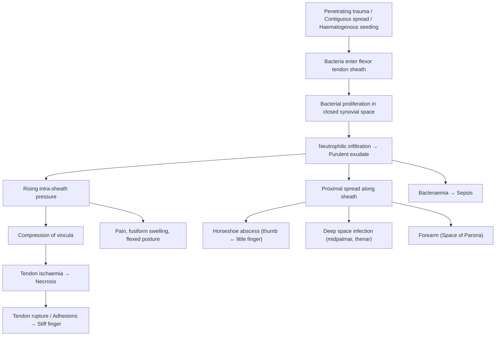

## 1. Definition

**_Pyogenic flexor tenosynovitis (PFT)_** is a **_closed space infection of the flexor tendon sheath of the hand_** [1]. Let's break the name down:

- **"Pyogenic"** → _pyo_ (Greek: pus) + _genic_ (producing) = pus-producing
- **"Flexor"** → the flexor tendons of the fingers (which bend the fingers)
- **"Tenosynovitis"** → _teno_ (tendon) + _syno_ (synovial membrane) + _itis_ (inflammation) = inflammation of the synovial sheath surrounding a tendon

So the name literally tells you: this is a **pus-producing infection of the synovial sheath that surrounds the flexor tendons of the finger**. It is an orthopaedic/hand surgery emergency because the tendon sheath is a closed space — once pus accumulates, pressure rises rapidly and can destroy the tendon and its blood supply within hours.

**_It accounts for approximately 2.5 to 9.4% of all hand infections_** [1].

<Callout title="Why is this an emergency?">
  The flexor tendon sheath is a sealed, low-compliance compartment. Infection →
  pus → rising pressure within a non-distensible space → compression of the
  vincula (the tiny vessels that supply the tendon) → tendon ischaemia and
  necrosis. This is exactly the same principle as compartment syndrome, just on
  a miniature scale. A missed or delayed diagnosis can lead to a stiff,
  non-functional finger or even amputation.
</Callout>

> **Distinguish the terminology** [2]:
>
> - **Tendinosis**: age-related degeneration of a tendon (no inflammation)
> - **Tendinitis**: inflammation of the tendon itself
> - **Tenosynovitis**: inflammation of the synovial sheath
> - **Tenovaginitis**: inflammation of the fibrous sheath (pulley)
>
> Infective tenosynovitis specifically refers to **bacterial infection within the synovial sheath**.

---

## 2. Epidemiology

- Represents **2.5–9.4% of all hand infections** [1]
- Most common mechanism: **penetrating trauma** (thorn prick, knife cut, bite wound, needle stick) introducing bacteria directly into the tendon sheath
- Can also occur via **contiguous spread** from a nearby felon, paronychia, or septic arthritis of a small joint, or rarely by **haematogenous spread**
- **Male predominance** (occupational exposure)
- Peak incidence in **working-age adults** (20–50 years) due to occupational and recreational hand injuries
- The **index and middle fingers** of the dominant hand are most commonly affected (greatest exposure to trauma)
- In Hong Kong, consider:
  - Injuries from **fish bones and seafood handling** (Gram-negative organisms including _Vibrio_, _Mycobacterium marinum_)
  - **Diabetes mellitus** is highly prevalent and is a major risk factor for severe infection and poor outcomes

---

## 3. Risk Factors

### Patient Factors (Host Susceptibility)

**_Risk factors for amputation include_** [1]:

- **_Diabetes mellitus (DM)_** — impaired neutrophil function, microangiopathy reduces local perfusion and antibiotic delivery
- **_Renal failure_** — uraemic immunosuppression, impaired wound healing
- **_Peripheral vascular disease_** — poor tissue perfusion, reduced local immune response and antibiotic penetration

Additional risk factors (general for musculoskeletal infection):

- **_Immunocompromised states_** (HIV, chronic steroid use, malignancy on treatment) [1]
- **_Liver disease / cirrhosis_** — impaired opsonisation, reduced complement, predisposes to _Vibrio vulnificus_ (relevant in Hong Kong with raw seafood exposure) [1]
- **_Drug abuse (IV)_** — direct inoculation, often polymicrobial [1]
- Age > 60 [1]
- Alcohol abuse [1]

### Wound/Mechanism Factors

- **Penetrating trauma**: the single most common cause — a puncture wound (thorn, nail, fish bone, animal/human bite) directly inoculates bacteria into the closed sheath
- **Human bites / fight bites**: high risk of polymicrobial infection including anaerobes
- **Animal bites**: _Pasteurella multocida_ (cats/dogs)
- **Marine injuries**: _Mycobacterium marinum_, _Vibrio_ species — **especially relevant in Hong Kong**
- **Adjacent soft tissue infection**: contiguous spread from paronychia, felon, or web space abscess
- **Post-surgical / post-injection**: iatrogenic inoculation

<Callout title="Hong Kong-Specific Consideration" type="idea">
  In the Hong Kong clinical context, always ask about **seafood handling and
  marine exposure**. Fish bone injuries and handling raw shellfish can introduce
  *Mycobacterium marinum* (causing chronic granulomatous tenosynovitis) or
  *Vibrio vulnificus* (fulminant infection in patients with liver disease). The
  clinical trajectory is very different — *M. marinum* is indolent whereas
  *Vibrio* is rapidly fatal in the immunocompromised.
</Callout>

---

## 4. Anatomy and Function

Understanding the anatomy is **critical** because it explains every single clinical sign, why infection spreads in certain patterns, and why surgical approaches differ.

### 4.1 The Flexor Tendon Sheath

Each finger (index through little) has a **digital flexor tendon sheath** — a closed, tubular, synovial membrane that surrounds:

- **Flexor digitorum superficialis (FDS)** — inserts on the middle phalanx; flexes the PIP joint
- **Flexor digitorum profundus (FDP)** — inserts on the distal phalanx; flexes the DIP joint

The sheath has two layers:

1. **Visceral layer (epitenon)**: directly adherent to the tendon surface
2. **Parietal layer**: lines the inner surface of the fibrous sheath

Between them is the **synovial cavity** — a potential space containing a thin film of synovial fluid for lubrication. This is the space that gets infected in PFT.

### 4.2 The Pulley System

The fibrous sheath (outer to the synovial sheath) forms the **pulley system**, which prevents bowstringing of the flexor tendons during finger flexion [2]:

- **Annular pulleys (A1–A5)**: A1, A3, A5 overlie the MCPJ, PIPJ, and DIPJ respectively; A2 (proximal phalanx) and A4 (middle phalanx) are the most biomechanically important
- **Cruciate pulleys (C1–C3)**: between the annular pulleys, allow sheath flexibility

> The pulley system is relevant because it defines the rigid boundaries of the closed space. Pus trapped between pulleys has nowhere to go except proximally and distally along the sheath.

### 4.3 Extent of the Sheaths — The "Horseshoe" Communication

This is the single most important anatomical concept for PFT:

- The **digital sheaths** of the **index, middle, and ring fingers** are **discrete** — they start at the level of the A1 pulley (at the neck of the metacarpal) and end at the distal phalanx. They are **closed-ended** compartments.
- The **thumb** has a flexor sheath that is continuous with the **radial bursa**.
- The **little finger** has a flexor sheath that is continuous with the **ulnar bursa**.
- The **radial and ulnar bursae communicate** at the **space of Parona** (a potential space deep to the pronator quadratus in the distal forearm, just proximal to the carpal tunnel).

This creates a **"horseshoe" (or "U-shaped") communication** between the thumb and little finger sheaths via the radial bursa → space of Parona → ulnar bursa.

<Callout title="Clinical Pearl — Horseshoe Abscess" type="error">
  If PFT of the **thumb** or **little finger** is not treated promptly,
  infection can track along this horseshoe communication to involve the opposite
  digit and the space of Parona in the forearm. This is called a **"horseshoe
  abscess"** — a devastating complication. This is why PFT of the thumb and
  little finger is considered more dangerous than PFT of the index, middle, or
  ring fingers, whose sheaths are self-contained.
</Callout>

### 4.4 Blood Supply to the Flexor Tendons

Within the digital sheath, the tendons receive their blood supply from:

- **Vincula longa and brevia** — small mesenteric-like folds (mesotendon remnants) carrying vessels from the digital arteries to the tendon surface
- **Diffusion from synovial fluid** within the sheath

When infection causes elevated pressure within the sheath, the **vincula are compressed first** → tendon ischaemia → necrosis. This is why prompt decompression is essential.

### 4.5 Extensor Compartments (for context / DDx)

The **dorsal** side of the wrist has **six extensor compartments** [2]:

1. **APL & EPB** (De Quervain's involves this compartment)
2. **ECRL & ECRB**
3. **EPL**
4. **ED & EI**
5. **EDM**
6. **ECU**

Infective tenosynovitis can occur in extensor sheaths too, but it is far less common and less dangerous because the extensor sheaths are not as tightly enclosed as the flexor sheaths.

---

## 5. Etiology and Pathophysiology

### 5.1 Causative Organisms

**_Empirical antibiotics should cover Staphylococcus and Streptococcus species_** [1]. **_Antibiotics should cover gram-negative rods and anaerobes in case of immunocompromised patients_** [1].

| Organism                                                              | Context                                                                                                                                                       |
| --------------------------------------------------------------------- | ------------------------------------------------------------------------------------------------------------------------------------------------------------- |
| **_Staphylococcus aureus_**                                           | **Most common overall** (~40–75% of cases). Penetrating trauma, skin flora                                                                                    |
| **_Streptococcus spp._** (Group A β-haemolytic Strep = _S. pyogenes_) | Second most common. Can spread rapidly                                                                                                                        |
| **MRSA**                                                              | Consider in IV drug users, healthcare-associated infections, recurrent infections                                                                             |
| **_Gram-negative rods_** (e.g. _Pseudomonas_, _E. coli_, _Eikenella_) | **_Immunocompromised patients_**, IV drug users, bite wounds                                                                                                  |
| **_Anaerobes_**                                                       | **_Immunocompromised patients_**, bite wounds, deep wounds                                                                                                    |
| _Pasteurella multocida_                                               | Cat/dog bites (inoculated from animal oral flora)                                                                                                             |
| _Eikenella corrodens_                                                 | Human bites / fight bites (human oral flora)                                                                                                                  |
| _Mycobacterium marinum_                                               | Marine/aquarium exposure — **important in Hong Kong** (fish bone injuries, seafood handling). Causes **chronic granulomatous** tenosynovitis. Indolent course |
| _Neisseria gonorrhoeae_                                               | Disseminated gonococcal infection — haematogenous spread, often polyarticular. Consider in young sexually active patients                                     |
| Polymicrobial                                                         | Bite wounds, diabetic patients, immunocompromised                                                                                                             |
| Fungal (_Candida_, _Sporothrix_)                                      | Rare. Immunocompromised, gardeners (sporotrichosis)                                                                                                           |

### 5.2 Mechanisms of Infection

1. **Direct inoculation** (most common): penetrating trauma introduces skin flora or environmental organisms into the tendon sheath
2. **Contiguous spread**: from adjacent soft tissue infection (paronychia, felon, web space abscess, septic arthritis of PIPJ/MCPJ)
3. **Haematogenous spread**: bacteraemia seeds the synovial sheath (rare; think _N. gonorrhoeae_ or _S. aureus_ bacteraemia)

### 5.3 Pathophysiology — Step by Step

1. **Inoculation**: bacteria enter the closed synovial sheath via one of the above mechanisms
2. **Bacterial proliferation**: the synovial fluid is a warm, nutrient-rich, relatively immune-privileged environment (poor blood supply, enclosed space) → ideal for bacterial growth
3. **Inflammatory response**: neutrophil recruitment → purulent exudate fills the sheath → **intra-sheath pressure rises**
4. **Vascular compromise**: rising pressure compresses the **vincula** (the tendon's blood supply) → tendon **ischaemia**
5. **Tendon necrosis**: prolonged ischaemia (typically > 24–48 hours of untreated infection) leads to **tendon necrosis and adhesion formation**
6. **Potential spread**:
   - Along the sheath (proximal/distal)
   - Into the midpalmar space or thenar space
   - Via the horseshoe communication (thumb ↔ little finger via radial/ulnar bursae and space of Parona)
   - To bone → osteomyelitis of phalanges
   - Into the carpal tunnel
   - Into the forearm (space of Parona → Parona's abscess)
7. **Systemic spread**: if untreated → bacteraemia → sepsis

<Callout title="Time is Tendon">
  The pathophysiology parallels compartment syndrome. Once pressure in the
  closed sheath exceeds perfusion pressure of the vincula, the tendon starts
  dying. **Every hour of delay worsens outcomes.** This is why PFT is a surgical
  emergency — the goal is to decompress the sheath and drain pus before
  irreversible tendon damage occurs.
</Callout>

---

## 6. Classification

### 6.1 By Clinical Severity / Kanavel Signs

There is no universally accepted formal staging system, but clinical severity is often graded by the **number of Kanavel signs present** (see Clinical Features section) and response to treatment:

| Category                         | Description                                                                     |
| -------------------------------- | ------------------------------------------------------------------------------- |
| **Early / Low suspicion**        | 1–2 Kanavel signs, mild symptoms, early infection                               |
| **Established / High suspicion** | **_3–4 Kanavel signs, moderate/severe symptoms_** [1]                           |
| **Advanced / Complicated**       | Necrosis, abscess formation, proximal spread (horseshoe abscess), osteomyelitis |

**_The management protocol flow chart_** [1] uses this classification to guide surgical vs non-surgical treatment:

- **_Low clinical suspicion for PFT, mild clinical symptoms, 1–2 Kanavel signs, early infection_** → **_Non-surgical treatment with empiric antibiotic coverage_** [1]
- **_High clinical suspicion for PFT, 3–4 Kanavel signs, moderate/severe symptoms_** → **_Surgical treatment + empiric antibiotic coverage_** [1]

### 6.2 By Organism

| Category                  | Examples                                          |
| ------------------------- | ------------------------------------------------- |
| **Acute pyogenic**        | _S. aureus_, _Streptococcus_, Gram-negatives      |
| **Chronic granulomatous** | _Mycobacterium marinum_, _M. tuberculosis_, fungi |
| **Gonococcal**            | _N. gonorrhoeae_ (haematogenous)                  |
| **Polymicrobial**         | Bite wounds, diabetic patients                    |

### 6.3 By Mechanism

- **Post-traumatic** (most common)
- **Contiguous spread** (from adjacent infection)
- **Haematogenous** (disseminated infection)

---

## 7. Clinical Features

The clinical hallmark of PFT is the **four Kanavel signs**, described by Allen B. Kanavel in 1912. These are **the most important clinical features to know for exams**.

### 7.1 Symptoms

| Symptom                                                                                 | Pathophysiological Basis                                                                                                                                                                         |
| --------------------------------------------------------------------------------------- | ------------------------------------------------------------------------------------------------------------------------------------------------------------------------------------------------ |
| **Severe finger pain** — throbbing, progressive, disproportionate to the external wound | Pus accumulating in a non-distensible closed space → rapidly rising pressure → stimulation of nociceptors in the peritendinous tissue and sheath                                                 |
| **Pain worsened by any finger movement** (especially passive extension)                 | Passive extension stretches the inflamed tendon sheath and increases intra-sheath pressure, stimulating pain fibres. This is analogous to why passive stretch is painful in compartment syndrome |
| **Stiffness / inability to move the finger**                                            | Swelling and pain inhibit active flexion/extension; later, tendon adhesions physically restrict movement                                                                                         |
| **Swelling of the entire finger**                                                       | Inflammatory oedema within and around the closed sheath distributes along the whole length of the tendon → uniform ("sausage-like") swelling                                                     |
| **History of penetrating trauma** (often a small, seemingly trivial wound)              | Direct inoculation mechanism — patients often present days after the initial injury because the wound appeared minor                                                                             |
| **Systemic symptoms** (fever, malaise) — in advanced cases                              | Cytokine release and potential bacteraemia                                                                                                                                                       |

### 7.2 Signs — The Four Kanavel Signs

These are **the cardinal signs** of pyogenic flexor tenosynovitis. They directly reflect the underlying pathophysiology:

| #   | **_Kanavel Sign_**                                                                               | Explanation / Pathophysiological Basis                                                                                                                                                                                                                                                                                                                                              |
| --- | ------------------------------------------------------------------------------------------------ | ----------------------------------------------------------------------------------------------------------------------------------------------------------------------------------------------------------------------------------------------------------------------------------------------------------------------------------------------------------------------------------- |
| 1   | **_Fusiform (sausage-shaped/symmetric) swelling of the entire finger_**                          | The synovial sheath runs the full length of the digit from the A1 pulley to the DIP. Pus/inflammatory fluid distends the sheath **uniformly**, making the finger swell symmetrically along its entire length (fusiform = spindle-shaped). This contrasts with a localised abscess which causes focal swelling                                                                       |
| 2   | **_Flexed posture of the finger at rest_**                                                       | The distended sheath holds the greatest volume when the finger is slightly flexed (the sheath is lax in flexion). Extension would compress the sheath and increase pressure → the patient instinctively holds the finger in a semiflexed position to minimise pain. Additionally, the flexors are stronger than extensors, and inflammation/spasm of the flexor muscles contributes |
| 3   | **_Tenderness along the entire flexor tendon sheath_** (from the proximal palm to the fingertip) | The infection involves the **entire length** of the closed sheath, so pressure on any part of it causes pain. This is the most sensitive Kanavel sign. Tenderness is maximal over the proximal sheath (A1 pulley area at the palmar crease) because this is where the sheath begins and pus tends to collect by gravity                                                             |
| 4   | **_Excruciating pain on passive extension of the finger_**                                       | Passive extension stretches the inflamed, distended tendon sheath and increases intra-sheath pressure → intense pain. This is the most specific Kanavel sign. It is analogous to "pain on passive stretch" in compartment syndrome                                                                                                                                                  |

<Callout title="High Yield — Kanavel Signs">

The **4 Kanavel signs** are the clinical cornerstone of diagnosing PFT:

1. **Fusiform swelling** of the entire finger
2. **Flexed posture** at rest
3. **Tenderness along the entire flexor sheath** (most sensitive)
4. **Pain on passive extension** (most specific)

The presence of **_3–4 Kanavel signs_** indicates **_high clinical suspicion_** and warrants **_surgical treatment_** [1]. Only 1–2 signs with mild symptoms may be trialled with antibiotics alone, but close monitoring is mandatory.

</Callout>

### 7.3 Additional Clinical Signs

| Sign                                                                                | Significance                                                                                                       |
| ----------------------------------------------------------------------------------- | ------------------------------------------------------------------------------------------------------------------ |
| **Small wound / puncture mark** on the volar aspect of the finger                   | The portal of entry — often deceptively small                                                                      |
| **Erythema of the finger**                                                          | Local inflammatory response                                                                                        |
| **Warmth**                                                                          | Hyperaemia from inflammation                                                                                       |
| **Lymphangitis / lymphadenopathy** (red streaking up the arm, axillary lymph nodes) | Spread of infection via lymphatic drainage                                                                         |
| **Fever, tachycardia**                                                              | Systemic inflammatory response; suggests bacteraemia or sepsis                                                     |
| **Fluctuance** (late sign)                                                          | Abscess formation — indicates advanced infection                                                                   |
| **Proximal palm / wrist tenderness**                                                | Suggests proximal extension into the radial/ulnar bursa or space of Parona                                         |
| **Thumb AND little finger both involved**                                           | Horseshoe abscess — infection has tracked through the radial bursa → space of Parona → ulnar bursa (or vice versa) |

### 7.4 Special Scenarios

#### Horseshoe Abscess

- When PFT of the **little finger** extends proximally through the **ulnar bursa** → **space of Parona** → **radial bursa** → involves the **thumb** (or vice versa)
- Presents with swelling and tenderness of **both the thumb and little finger** plus **distal forearm swelling/tenderness**
- This is a **catastrophic complication** requiring extensive surgical debridement

#### Chronic/Granulomatous Tenosynovitis (_M. marinum_)

- Indolent course over **weeks to months** (not acute)
- Sausage digit with mild tenderness
- History of **aquarium exposure, fish tank, seafood handling**
- May track along the sheath to form "sporotrichoid" nodules (ascending nodules along lymphatics)
- Requires **prolonged antibiotic therapy** (rifampicin + ethambutol or clarithromycin) ± surgical debridement

#### Gonococcal Tenosynovitis

- Young, sexually active patient
- Often **multiple tendons** involved (polytenosynovitis) — wrists, ankles, fingers
- Associated with **migratory polyarthralgia**, **dermatitis** (pustular skin lesions)
- Part of **disseminated gonococcal infection (DGI)**
- Diagnosis: NAAT of genital/rectal/pharyngeal swabs, blood cultures, joint aspirate

<Callout title="Exam Trap" type="error">
  Do not confuse **infective** tenosynovitis with **De Quervain's
  tenosynovitis** (which is a **non-infective**, mechanical/overuse stenosing
  tenovaginitis of the 1st extensor compartment) or **trigger finger**
  (stenosing tenovaginitis of the A1 pulley). The key discriminator is the
  **presence of infection** — fever, an inoculating wound, all 4 Kanavel signs,
  and systemic toxicity are absent in De Quervain's and trigger finger.
</Callout>

---

## 8. Relevant Anatomy of the Hand for Context (from Lecture Slides)

**_Common musculoskeletal infections that you cannot miss_** [1]:

- **_Bone and joint infections: septic arthritis, osteomyelitis_**
- **_Soft tissue infections: paronychia, soft tissue abscess, infective tenosynovitis, necrotizing fasciitis, gas gangrene_**

PFT sits among these as a **soft tissue infection of the hand** that, if missed, can progress to **septic arthritis of adjacent joints**, **osteomyelitis of phalanges**, **necrotizing fasciitis**, or **sepsis**.

The hand has several **deep spaces** that can become involved as PFT spreads:

- **Thenar space**: deep to thenar muscles, radial to midpalmar septum
- **Midpalmar space**: between metacarpals and palmar aponeurosis, ulnar to midpalmar septum
- **Hypothenar space**: deep to hypothenar muscles
- **Web spaces**: between fingers
- **Space of Parona**: in the distal forearm, deep to pronator quadratus

Understanding these spaces explains why untreated PFT can lead to devastating deep hand infections.

---

## 9. Summary of Pathophysiology Cascade

---

<Callout title="High Yield Summary">

**Infective (Pyogenic Flexor) Tenosynovitis — Key Points:**

1. **Definition**: **_Closed space infection of the flexor tendon sheath of the hand_** — a surgical emergency
2. **Epidemiology**: **_2.5–9.4% of all hand infections_**; most common in working-age adults after penetrating trauma
3. **Most common organisms**: **_Staphylococcus aureus and Streptococcus spp._**; cover **_Gram-negatives and anaerobes in immunocompromised_**
4. **Anatomy**: The flexor tendon sheath is a sealed synovial tube; thumb and little finger sheaths communicate via the **radial/ulnar bursae and space of Parona** (horseshoe communication)
5. **Pathophysiology**: Infection in a non-distensible closed space → rising pressure → compression of vincula → tendon ischaemia → necrosis. Time is tendon.
6. **Kanavel Signs** (4):
   - Fusiform (sausage) swelling of the entire finger
   - Flexed posture at rest
   - Tenderness along the entire flexor sheath (most sensitive)
   - Pain on passive extension (most specific)
7. **Risk factors for amputation**: **_DM, renal failure, peripheral vascular disease_**
8. **Management threshold**: **_1–2 Kanavel signs → trial of antibiotics; 3–4 Kanavel signs → surgical drainage + antibiotics_**
9. **Hong Kong relevance**: Marine injuries (_M. marinum_, _Vibrio_) from seafood handling; high DM prevalence

</Callout>

---

<ActiveRecallQuiz
  title="Active Recall - Infective Tenosynovitis"
  items={[
    {
      question:
        "Name the 4 Kanavel signs of pyogenic flexor tenosynovitis and state which is the most sensitive and which is the most specific.",
      markscheme:
        "1. Fusiform (sausage-shaped) swelling of the entire finger. 2. Flexed posture of the finger at rest. 3. Tenderness along the entire flexor tendon sheath (MOST SENSITIVE). 4. Pain on passive extension of the finger (MOST SPECIFIC).",
    },
    {
      question:
        "Explain the anatomical basis for the 'horseshoe abscess' in pyogenic flexor tenosynovitis. Which two digits are involved and via what structures?",
      markscheme:
        "The thumb flexor sheath is continuous with the radial bursa, and the little finger flexor sheath is continuous with the ulnar bursa. The radial and ulnar bursae communicate at the space of Parona in the distal forearm. Infection of either digit can track through this horseshoe communication to involve the other digit plus the forearm.",
    },
    {
      question:
        "Why does a patient with pyogenic flexor tenosynovitis hold the affected finger in a flexed position at rest?",
      markscheme:
        "The distended tendon sheath accommodates the greatest volume when the finger is in slight flexion (sheath is lax). Extension would compress the sheath and increase intra-sheath pressure, causing severe pain. The patient instinctively adopts flexion to minimise pressure and pain.",
    },
    {
      question:
        "What are the three risk factors for amputation in pyogenic flexor tenosynovitis as stated in the lecture?",
      markscheme:
        "1. Diabetes mellitus. 2. Renal failure. 3. Peripheral vascular disease.",
    },
    {
      question:
        "A 45-year-old fisherman in Hong Kong presents with a 3-week history of gradually progressive swelling and mild tenderness along the index finger with sausage-like appearance but no fever. What organism should you suspect and why?",
      markscheme:
        "Mycobacterium marinum. The indolent (chronic, weeks-long) course, sausage digit, and marine/seafood handling exposure in Hong Kong are classic. M. marinum causes chronic granulomatous tenosynovitis rather than acute pyogenic infection.",
    },
    {
      question:
        "According to the lecture management protocol, how do you decide between non-surgical and surgical treatment for PFT?",
      markscheme:
        "Low clinical suspicion (1-2 Kanavel signs, mild symptoms, early infection) -> non-surgical treatment with empiric antibiotics; reassess at 24 hours. High clinical suspicion (3-4 Kanavel signs, moderate/severe symptoms) -> surgical treatment (closed catheter irrigation or open irrigation and debridement) plus empiric antibiotics. If advanced infection, necrosis, or chronic infection is present, open irrigation and debridement is required.",
    },
  ]}
/>

---

## References

[1] Lecture slides: GC 237. Musculoskeletal infection [Updated in 2025] (1).pdf (pages 2, 3, 24, 28, 32, 33)
[2] Senior notes: maxim.md (sections 504–506: tendon-related pathology, trigger finger)
