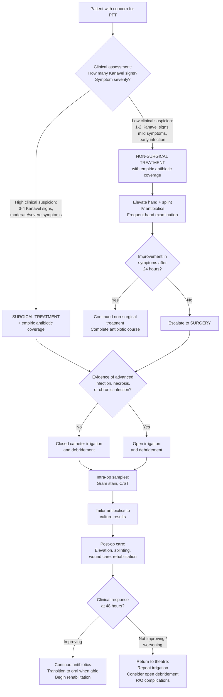
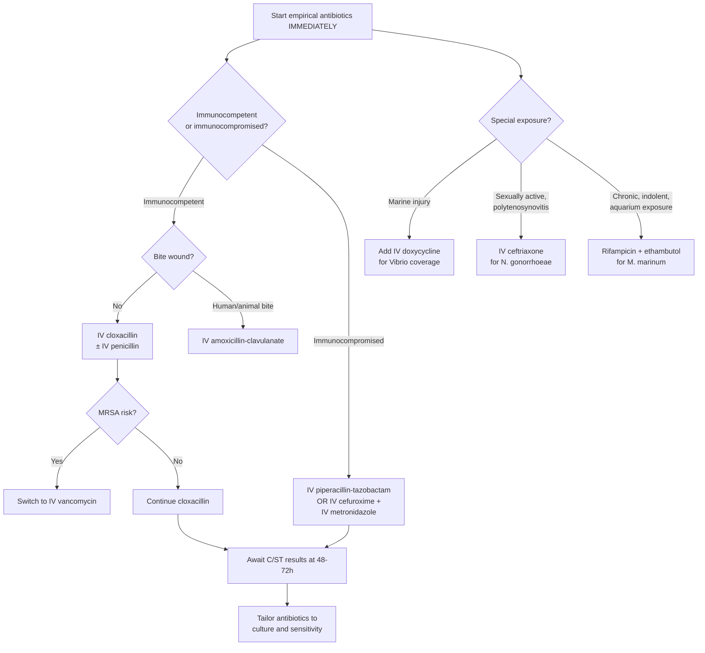

## Management of Infective (Pyogenic Flexor) Tenosynovitis

---

### 1. Overview of Management Principles

The management of PFT follows a simple logic chain derived from its pathophysiology: **bacteria in a closed space → pus → rising pressure → tendon death**. Therefore, the goals of treatment are:

1. **Kill the bacteria** → antibiotics
2. **Decompress the closed space / drain the pus** → surgical irrigation and debridement
3. **Prevent further damage** → splinting, elevation, wound care
4. **Optimise the host** → control comorbidities (DM, renal failure)
5. **Restore function** → rehabilitation

***Management*** [1]:
- ***Prompt clinical diagnosis***
- ***Empirical antibiotics covering Staphylococcus and Streptococcus species***
- ***Antibiotics should cover gram-negative rods and anaerobes in case of immunocompromised patients***
- ***Non-operative treatment***
- ***Operative treatment***

***Empirical antibiotics and early surgical intervention are necessary in case of life-threatening conditions such as septic arthritis, NF and gas gangrene*** [1] — the same urgency applies to PFT.

---

### 2. Management Algorithm

The ***management protocol flow chart*** [1] stratifies patients by clinical suspicion:

---

### 3. Treatment Modalities — Detailed Breakdown

---

#### 3.1 General / Supportive Measures

These form the foundation of management, applied to **all** patients regardless of operative vs non-operative pathway:

| Measure | Rationale (First Principles) | Details |
|---|---|---|
| **Hand elevation** | Elevation above heart level reduces hydrostatic capillary pressure (Starling forces) → decreases oedema formation → lowers intra-sheath pressure → reduces pain and may slow vascular compromise of the tendon | Use a Bradford sling or pillow elevation. The hand should be kept elevated at all times except during examination/treatment |
| **Splinting** | Immobilisation in the "position of safety" (wrist in ~20° extension, MCPJs in ~70° flexion, IPJs in slight flexion) reduces movement-related pain, prevents tendon adhesion in a maximally shortened position, and allows the inflammatory process to settle | A volar forearm-based splint is typically used. The "position of safety" is chosen because it keeps the collateral ligaments of the MCPJ and PIPJ at maximal stretch (preventing contracture), while keeping the hand in a functional position |
| **Analgesia** | Pain control is essential — PFT is excruciatingly painful. Uncontrolled pain also causes sympathetic activation → vasoconstriction → worsens perfusion | Paracetamol + NSAIDs (if not contraindicated) ± opioids for severe pain. **Avoid NSAIDs in necrotizing fasciitis** as they may mask symptoms and contribute to renal failure [1] — but in uncomplicated PFT, they are generally safe |
| **Tetanus prophylaxis** | PFT typically follows penetrating trauma → risk of *Clostridium tetani* inoculation | Check tetanus vaccination status. Give tetanus toxoid booster (or TIG + toxoid if unvaccinated/unknown status) per wound management guidelines |
| **Optimise comorbidities** | ***DM, renal failure, peripheral vascular disease*** are ***risk factors for amputation*** [1]. Poor glycaemic control impairs neutrophil function, delays wound healing, and increases infection severity | Tight glycaemic control (target BSL 6–10 mmol/L in acute setting), manage renal failure (avoid nephrotoxic drugs, adjust antibiotic doses), optimise nutrition |
| **Nil by mouth** | If surgery is anticipated, the patient must be fasted | NBM in case emergency theatre is needed |

---

#### 3.2 Antibiotic Therapy

Antibiotics are the pharmacological cornerstone. Think of them in two phases: **empirical** (started immediately, before cultures return) and **targeted** (adjusted once culture and sensitivity results are available).

##### 3.2.1 Empirical Antibiotics

***Empirical antibiotics covering Staphylococcus and Streptococcus species*** [1].
***Antibiotics should cover gram-negative rods and anaerobes in case of immunocompromised patients*** [1].

| Patient Group | Recommended Empirical Regimen | Why This Covers the Likely Organisms |
|---|---|---|
| **Immunocompetent, standard presentation** | **IV cloxacillin** (or flucloxacillin) 1–2g Q6H ± **IV penicillin** (or ampicillin) | Cloxacillin (*clox* = "anti-staphylococcal penicillin") targets ***S. aureus*** (MSSA — the most common organism). Penicillin covers ***Streptococcus spp.*** Cloxacillin is penicillinase-resistant, meaning it withstands the β-lactamase that *S. aureus* produces. ***IV cloxacillin is the standard for MSS infections*** [4] |
| **MRSA suspected** (healthcare-associated, IV drug user, prior MRSA) | **IV vancomycin** (trough-guided dosing) | Vancomycin is a glycopeptide that inhibits cell wall synthesis by binding D-Ala-D-Ala; active against MRSA because it bypasses the altered PBP mechanism |
| ***Immunocompromised*** (DM, renal failure, liver disease, HIV) | **IV piperacillin-tazobactam** (Tazocin) or **IV ampicillin-sulbactam** (Unasyn) OR IV cefuroxime + IV metronidazole | ***Must cover gram-negative rods and anaerobes*** [1]. Piperacillin-tazobactam is a broad-spectrum β-lactam/β-lactamase inhibitor combination covering Gram-positives + Gram-negatives + anaerobes. Metronidazole (*metro* = "against" + *nidazole* = nitroimidazole) specifically targets anaerobes via DNA damage in anaerobic conditions |
| **Human/animal bite wound** | **IV amoxicillin-clavulanate** (Augmentin) or **IV ampicillin-sulbactam** | Covers oral flora: *Pasteurella multocida* (cat/dog), *Eikenella corrodens* (human), plus anaerobes. Clavulanate/sulbactam provides β-lactamase inhibition |
| **Marine injury** (fish bone, seafood handling — **Hong Kong relevant**) | Add **IV doxycycline** or **ciprofloxacin** to standard regimen | To cover *Vibrio vulnificus* and *Vibrio* spp. Doxycycline is a tetracycline that inhibits the 30S ribosomal subunit. In patients with liver disease + *Vibrio*, the mortality is extremely high without prompt coverage |
| **Suspected *Neisseria gonorrhoeae*** (DGI) | ***IV ceftriaxone*** 1g daily | ***NG: IV ceftriaxone × 1 week*** [4]. Ceftriaxone is a 3rd-generation cephalosporin with excellent Gram-negative coverage and good CNS/joint penetration |
| **Suspected *Mycobacterium marinum*** (chronic, indolent, marine exposure) | **Rifampicin + ethambutol** or **clarithromycin + ethambutol** for 3–6 months | *M. marinum* is an atypical mycobacterium resistant to standard antibiotics. Rifampicin inhibits RNA polymerase; ethambutol inhibits arabinosyl transferase (cell wall synthesis); clarithromycin inhibits the 50S ribosomal subunit. Prolonged treatment is necessary due to slow mycobacterial growth |

<Callout title="Route and Duration">

- **Route**: Always start with **IV** antibiotics in PFT — the tendon sheath has poor blood supply, so high serum drug levels are needed to achieve adequate tissue penetration. Oral antibiotics alone are insufficient for established PFT.
- **Duration**: Typically **IV for 1–2 weeks**, then **step-down to oral** antibiotics once clinical improvement is evident (settling Kanavel signs, falling CRP, afebrile for 48h). Total duration is usually **2–4 weeks** for uncomplicated PFT, but may be **4–6 weeks** if complicated by osteomyelitis (***IV cloxacillin × 4–6 weeks*** for osteomyelitis/septic arthritis) [4].
- **Switch to targeted therapy** as soon as culture and sensitivity results are available (usually 48–72 hours).
</Callout>

##### 3.2.2 Antibiotic Selection Logic Diagram

---

#### 3.3 Non-Operative Treatment

***Non-operative treatment*** [1]:
- ***Indicated when early presentation, within 48 hours after injury***
- ***Antibiotic***
- ***Examine the affected hand frequently***
- ***No improvement after 24 to 48 hours, surgery is indicated***

##### Indications for Non-Operative Management

| Criterion | Rationale |
|---|---|
| ***Early presentation (within 48 hours after injury)*** [1] | The earlier the infection is caught, the less pus has accumulated and the less tendon damage has occurred. Very early infection may be in a "pre-suppurative" (cellulitic) phase where antibiotics alone can abort the infection |
| ***1–2 Kanavel signs only, mild clinical symptoms*** [1] | Fewer Kanavel signs suggest a lower bacterial burden and less intra-sheath pressure. The sheath may not yet be fully distended with pus |
| Immunocompetent host | An intact immune system can assist antibiotics in clearing a low-burden infection |
| No systemic toxicity | Absence of sepsis/SIRS suggests the infection is localised and less severe |

##### Non-Operative Protocol

1. **Admit** the patient (this is NOT outpatient management)
2. **IV empirical antibiotics** as above
3. **Hand elevation** + **splint** in position of safety
4. **Analgesia**
5. ***Examine the affected hand frequently*** [1] — at least Q4–6 hourly, documenting:
   - Number of Kanavel signs
   - Extent of swelling and erythema
   - Pain level
   - Temperature
   - Neurovascular status of the digit
6. **Reassess at 24 hours** [1]:
   - **Improving** (fewer Kanavel signs, less pain, settling swelling, falling CRP) → ***continued non-surgical treatment*** [1], complete antibiotic course
   - ***No improvement after 24 to 48 hours → surgery is indicated*** [1]

<Callout title="Critical Safety Net" type="error">
Non-operative management is a **monitored trial**, not definitive treatment. The patient must be admitted, examined frequently, and have a **pre-arranged plan for surgical escalation**. If there is any doubt about whether the patient is improving, **err on the side of surgery**. A "negative" exploration of the tendon sheath (washing out a sheath that turns out to have less pus than expected) is far safer than a delayed exploration of a sheath containing necrotic tendon.
</Callout>

##### Contraindications to Non-Operative Management

| Contraindication | Reason |
|---|---|
| 3–4 Kanavel signs | Established infection — antibiotics alone are insufficient to clear pus from a closed space |
| Late presentation ( > 48 hours) | More pus, more tendon damage, higher bacterial burden |
| Immunocompromised patient | Reduced ability to clear infection; higher risk of rapid progression |
| Systemic sepsis | Indicates high bacterial burden; source control (drainage) is essential |
| Evidence of complications (abscess, necrosis, horseshoe abscess, osteomyelitis) | Cannot be managed without surgical intervention |
| Failure to improve at 24 hours | The trial period has expired — escalate to surgery |

---

#### 3.4 Operative Treatment

***Operative treatment*** [1] is the definitive management for established PFT. There are two main surgical approaches:

##### 3.4.1 Closed Catheter Irrigation and Debridement

***Closed catheter irrigation and debridement*** [1] — the technique originally described by Neviaser in 1978.

**Principle**: Two small incisions are made at either end of the tendon sheath, and a catheter is passed through the sheath. Sterile saline is then continuously or intermittently irrigated through the catheter to flush out pus and bacteria, while preserving the sheath integrity.

| Aspect | Detail |
|---|---|
| **Incisions** | Two small transverse or midlateral incisions: one **proximal** (at the level of the A1 pulley / distal palmar crease) and one **distal** (at the level of the A5 pulley / DIP crease) |
| **Catheter** | A small paediatric feeding tube or angiocatheter is threaded through the sheath from proximal to distal |
| **Irrigation** | Sterile normal saline (NOT antiseptic solutions — they are cytotoxic to healthy tissue). Continuous or intermittent irrigation for 24–48 hours post-operatively |
| **Samples** | Sheath fluid sent for Gram stain, C/ST (aerobic + anaerobic + AFB + fungal) |
| **Wound** | Incisions left open or loosely approximated to allow continued drainage |

**Indications**:
- ***High clinical suspicion (3–4 Kanavel signs, moderate/severe symptoms)*** [1] **without** evidence of advanced infection, necrosis, or chronic infection
- Failed non-operative treatment (no improvement at 24 hours)
- Relatively early presentation with established but non-advanced infection

**Advantages**:
- Minimally invasive
- Preserves the tendon sheath (important for future tendon gliding and function)
- Can be done under regional anaesthesia (wrist block or digital block — though general anaesthesia is often used)

**Contraindications / When to proceed to open approach**:
- ***Presence of advanced infection, necrosis, chronic infection*** [1]
- Thick organised pus that will not flush out via catheter
- Concurrent deep space infection requiring open drainage
- Horseshoe abscess (need to explore the radial/ulnar bursae and space of Parona)

##### 3.4.2 Open Irrigation and Debridement

***Open irrigation and debridement*** [1] — for advanced or complicated infections.

| Aspect | Detail |
|---|---|
| ***Incision*** | ***Zig-zag incision*** [1] (Bruner incision) along the volar surface of the digit and palm. The zig-zag pattern crosses the flexion creases at an angle, which prevents contracture of the scar across the crease (a straight incision across a flexion crease would contract and cause a flexion contracture) |
| **Exposure** | The flexor tendon sheath is fully exposed. The A3, A5, and cruciate pulleys can be opened/excised to access the sheath lumen, but the **A2 and A4 pulleys must be preserved** (they are biomechanically critical for preventing bowstringing) |
| **Debridement** | Necrotic tendon, necrotic synovium, and organised pus are debrided. Viable tendon and pulleys are preserved |
| **Irrigation** | Copious irrigation with sterile normal saline (litres) |
| **Samples** | Sheath fluid, tissue biopsies (synovium, necrotic tissue), foreign bodies → all sent for Gram stain, C/ST, histopathology, AFB |
| **Wound** | Left open (not closed primarily) for secondary intention healing or delayed primary closure. Daily wound care and dressing changes |
| **Extended exploration** | If horseshoe abscess: extend incision to explore the palm (midpalmar space, thenar space) and the forearm (space of Parona via a separate incision over the distal volar forearm). If osteomyelitis: debride affected bone |

**Indications** [1]:
- ***Presence of advanced infection, necrosis, chronic infection*** [1]
- Failed closed catheter irrigation
- Horseshoe abscess (thumb/little finger with proximal extension)
- Deep space infection (midpalmar, thenar, forearm)
- Concurrent osteomyelitis requiring bone debridement
- Retained foreign body requiring extraction
- Necrotic tendon requiring excision

**Contraindications**:
- There are no absolute contraindications to open debridement when it is indicated — the principle of "life over limb" applies. Even in patients too unwell for general anaesthesia, regional anaesthesia (brachial plexus block) can be used
- Relative: a patient who is too systemically unstable for any surgery may need initial resuscitation/stabilisation (e.g., in septic shock) before theatre — but this is a matter of timing, not a contraindication to surgery itself

<Callout title="Zig-Zag (Bruner) Incision — Why?" type="idea">
The ***zig-zag incision*** [1] is not arbitrary. A straight longitudinal incision along the volar finger would cross the flexion creases of the PIPJ and DIPJ at right angles. As the wound heals by secondary intention (since it is left open), the scar contracts. A scar that crosses a flexion crease at 90° pulls the joint into flexion → **flexion contracture**. The zig-zag pattern ensures that no scar crosses a crease perpendicularly, distributing tension across multiple planes and preventing contracture. This is the same principle used in Dupuytren's fasciectomy incisions.
</Callout>

##### 3.4.3 Comparison of Surgical Approaches

| Feature | Closed Catheter Irrigation | Open Irrigation and Debridement |
|---|---|---|
| Invasiveness | Less invasive | More invasive |
| Sheath preservation | Preserves sheath | May require partial opening of sheath |
| Indication | Moderate/established infection without necrosis | ***Advanced infection, necrosis, chronic infection*** [1] |
| Visualisation | Limited (cannot directly inspect tendon) | Complete (direct visualisation of tendon, sheath, pulleys) |
| Debridement | Irrigation only (cannot mechanically debride) | Full mechanical + irrigation debridement |
| Post-op drainage | Via catheter irrigation | Via open wound |
| Recovery | Faster | Slower (open wound healing) |
| Risk of tendon adhesion | Lower (sheath preserved) | Higher (sheath opened, more surgical trauma) |
| Failure rate | Higher (may need repeat or conversion to open) | Lower (definitive) |

---

#### 3.5 Post-Operative Care

| Component | Details | Rationale |
|---|---|---|
| **Continued IV antibiotics** | As per empirical regimen, then tailored to culture results | Continue killing bacteria; the surgical drainage alone does not sterilise the field |
| **Catheter irrigation** (if closed technique) | Continuous or intermittent saline irrigation for 24–48 hours, then catheter removal | Ongoing lavage flushes residual bacteria and inflammatory debris |
| **Wound care** | Daily dressing changes under aseptic technique; wounds left open for secondary intention or delayed primary closure at 48–72 hours if clean | Allows ongoing drainage and inspection; reduces risk of re-accumulating pus |
| **Hand elevation** | Continue until swelling subsides | Reduces oedema |
| **Splinting** | Position of safety splint between therapy sessions | Prevents contracture in a functional position |
| **Re-examination at 48 hours** | Assess clinical response: Kanavel signs resolving? CRP falling? Afebrile? | If not improving → return to theatre for repeat washout or escalation to open debridement |
| **IV-to-oral antibiotic switch** | When: afebrile for 48h, CRP trending down, clinically improving, tolerating oral intake | Oral antibiotics achieve lower tissue levels but are adequate once the bacterial burden has been substantially reduced by surgery + IV therapy |
| **Rehabilitation** | Early active/passive ROM exercises under hand therapist guidance, starting once infection is controlled (usually 48–72h post-op) | Tendon adhesions form rapidly after any tendon sheath surgery/infection. Early movement promotes tendon gliding and prevents stiffness. This is a balance: too early risks disrupting healing; too late results in a stiff, non-functional finger |

---

#### 3.6 Special Situations

##### Amputation

***Risk factors for amputation*** [1]:
- ***DM***
- ***Renal failure***
- ***Peripheral vascular disease***

**Indications for amputation**:
- Completely necrotic tendon with non-viable digit (no perfusion despite debridement)
- Overwhelming infection with digital gangrene
- Life-threatening sepsis where the digit is the source and cannot be salvaged
- A functionless, painful finger after multiple failed debridements

Amputation is a last resort. The decision should be made by a senior hand surgeon and discussed with the patient.

##### *Mycobacterium marinum* Tenosynovitis

- **Extended antibiotic therapy**: rifampicin + ethambutol (or clarithromycin + ethambutol) for **3–6 months minimum**
- **Surgical synovectomy**: debridement of granulomatous tissue; send tissue for AFB culture at 30–32°C and histopathology
- **No role for standard short-course antibiotics**

##### Horseshoe Abscess

- Requires **extensive open debridement** via:
  - Zig-zag incision along the thumb
  - Zig-zag incision along the little finger
  - Separate incision over the distal volar forearm (to drain the space of Parona)
- Multiple drains and staged debridements often required
- Worst functional outcomes of all PFT presentations

---

### 4. Summary: Management by Clinical Scenario

| Scenario | Treatment | Key Points |
|---|---|---|
| **Early PFT, 1–2 Kanavel signs, < 48h** | ***Non-surgical: IV antibiotics + elevation + splint + frequent examination*** [1] | Reassess at 24h; no improvement → surgery |
| **Established PFT, 3–4 Kanavel signs, no necrosis** | ***Surgical: Closed catheter irrigation + empiric antibiotics*** [1] | Preserve tendon sheath; send intra-op cultures |
| **Advanced PFT, necrosis, or chronic infection** | ***Surgical: Open irrigation and debridement + empiric antibiotics*** [1] | ***Zig-zag incision*** [1]; preserve A2/A4 pulleys |
| **Horseshoe abscess** | Extensive open debridement of thumb, little finger, palm, and forearm | Multiple incisions, staged procedures |
| **Immunocompromised** | Lower threshold for surgery; ***broad-spectrum antibiotics covering Gram-negatives + anaerobes*** [1] | Aggressive approach, close monitoring |
| **M. marinum** | Surgical synovectomy + prolonged antibiotics (3–6 months) | Alert lab to incubate at 30–32°C |
| **Non-salvageable digit** | Amputation | Last resort; discuss with patient |

---

<Callout title="High Yield Summary">

**Management of PFT — Key Takeaways:**

1. ***Prompt clinical diagnosis*** is the first and most important step [1]
2. ***Empirical antibiotics: cover Staph + Strep*** (IV cloxacillin); ***add Gram-negative and anaerobic cover in immunocompromised*** [1]
3. **Non-operative treatment**: ***early presentation within 48 hours, 1–2 Kanavel signs, mild symptoms*** → IV antibiotics + elevation + splinting + ***frequent examination*** → ***no improvement after 24–48 hours → surgery*** [1]
4. **Operative treatment**:
   - ***Closed catheter irrigation***: for moderate/established infection without necrosis [1]
   - ***Open irrigation and debridement (zig-zag incision)***: for ***advanced infection, necrosis, chronic infection*** [1]
5. **Post-operative**: continued IV antibiotics tailored to cultures, wound care, elevation, splinting, early rehabilitation
6. ***Risk factors for amputation: DM, renal failure, peripheral vascular disease*** [1]
7. **Always preserve A2 and A4 pulleys** during open surgery to prevent bowstringing
8. **Zig-zag incision** prevents flexion contracture by avoiding perpendicular scars across flexion creases

</Callout>

---

<ActiveRecallQuiz
  title="Active Recall - Management of Infective Tenosynovitis"
  items={[
    {
      question: "State the 5 key management principles from the lecture for PFT.",
      markscheme: "1. Prompt clinical diagnosis. 2. Empirical antibiotics covering Staphylococcus and Streptococcus species. 3. Antibiotics should cover Gram-negative rods and anaerobes in immunocompromised patients. 4. Non-operative treatment. 5. Operative treatment."
    },
    {
      question: "List the criteria for attempting non-operative management of PFT and the mandatory re-assessment protocol.",
      markscheme: "Criteria: early presentation within 48 hours after injury, 1-2 Kanavel signs only, mild clinical symptoms, early infection. Protocol: admit, start IV antibiotics, elevate hand, splint, examine the affected hand frequently. Re-assess at 24 hours. If no improvement after 24-48 hours, surgery is indicated."
    },
    {
      question: "Compare closed catheter irrigation with open irrigation and debridement: state the indication for each and one key advantage of each technique.",
      markscheme: "Closed catheter irrigation: indicated for high clinical suspicion (3-4 Kanavel signs) without advanced infection, necrosis or chronic infection. Advantage: preserves tendon sheath integrity (better long-term tendon gliding). Open irrigation and debridement: indicated for advanced infection, necrosis, or chronic infection. Advantage: allows direct visualisation and complete debridement of necrotic tissue."
    },
    {
      question: "Explain why a zig-zag (Bruner) incision is used rather than a straight longitudinal incision for open debridement of PFT.",
      markscheme: "A straight longitudinal incision along the volar finger would cross the flexion creases at right angles. During wound healing (by secondary intention since the wound is left open), scar contracture would pull the joints into flexion causing flexion contractures. The zig-zag pattern ensures no scar crosses a flexion crease perpendicularly, distributing tension across multiple planes and preventing contracture."
    },
    {
      question: "A 55-year-old immunocompromised diabetic with renal failure presents with 3 Kanavel signs in the ring finger 3 days after a fish bone injury. Outline your empirical antibiotic strategy, explaining your choice.",
      markscheme: "Broad-spectrum IV antibiotics covering: Staph and Strep (standard organisms) PLUS Gram-negative rods and anaerobes (immunocompromised). Add Vibrio coverage (marine injury). Regimen: IV piperacillin-tazobactam (covers Gram-positives, Gram-negatives, anaerobes) PLUS IV doxycycline (covers Vibrio species from fish bone injury). Proceed directly to surgical treatment given 3 Kanavel signs and late presentation (3 days). Alert: this patient has risk factors for amputation (DM + renal failure)."
    },
    {
      question: "Which pulleys must be preserved during open debridement and why?",
      markscheme: "A2 and A4 pulleys must be preserved. These are the biomechanically critical pulleys that prevent bowstringing of the flexor tendons. A2 overlies the proximal phalanx and A4 overlies the middle phalanx. If cut, the flexor tendons would bowstring away from the bone during finger flexion, dramatically reducing grip strength and finger function."
    }
  ]}
/>

---

## References

[1] Lecture slides: GC 237. Musculoskeletal infection [Updated in 2025] (1).pdf (pages 2, 3, 24, 28, 29, 30, 32, 33, 54)
[4] Senior notes: maxim.md (sections 566–567: osteomyelitis, septic arthritis — IV cloxacillin regimens, ceftriaxone for NG)
