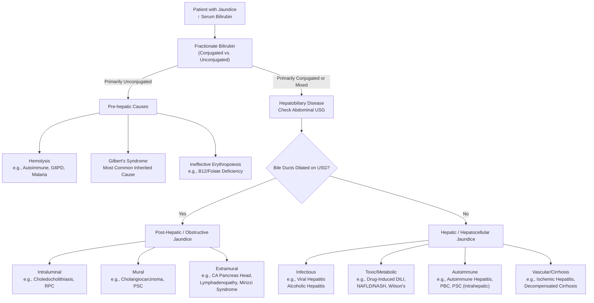

## Differential Diagnosis of Jaundice

The differential diagnosis of jaundice is vast, but a systematic approach based on the **pathophysiological triad** (pre-hepatic, hepatic, post-hepatic) is key. The clinical presentation (painful vs. painless, acute vs. chronic, presence of fever) and simple lab/imaging findings can quickly narrow the list.

The initial, most critical step is to determine if the jaundice is **conjugated or unconjugated**. This splits the differential in two. Remember: **conjugated bilirubin is water-soluble and appears in the urine (bilirubinuria), while unconjugated bilirubin is not.**

Here is a visual algorithm to guide your clinical reasoning:

### 1. Pre-hepatic (Unconjugated Hyperbilirubinemia)
*Pathophysiology: Overproduction of bilirubin overwhelms a normal liver's conjugation capacity.*
*   **Hemolytic Anemias:** Increased RBC breakdown.
    *   **Intrinsic RBC defects:** Hereditary spherocytosis, G6PD deficiency (common in Southern Chinese), sickle cell disease.
    *   **Extrinsic causes:** Autoimmune hemolytic anemia, malaria, mechanical heart valves, microangiopathic hemolytic anemia (e.g., DIC).
    *   *Why jaundice?* The liver's UGT enzyme system is saturated. Bilirubin is primarily unconjugated, so **urine is NOT dark** (no bilirubinuria), but urine urobilinogen is high.
*   **Ineffective Erythropoiesis:** Premature destruction of RBC precursors in bone marrow (e.g., megaloblastic anemias from B12/folate deficiency, thalassemia).
*   **Large Hematoma/Bruise Resorption:** Breakdown of extravasated blood releases heme.
*   **Gilbert's Syndrome:** The **most common** inherited cause. Mild, chronic unconjugated hyperbilirubinemia due to reduced UGT1A1 activity (to ~30% of normal). It's benign, often triggered by fasting, illness, or stress.

### 2. Hepatic (Hepatocellular) Jaundice
*Pathophysiology: Hepatocyte dysfunction impairs uptake, conjugation, AND excretion. Lab shows a **mixed pattern** (both conjugated and unconjugated bilirubin elevated, with conjugated often >50%), markedly elevated transaminases (AST/ALT), and variable elevation in ALP.*
*   **Viral Hepatitis:** Hepatitis A, B, C, D, E. **Chronic Hepatitis B is a leading cause of cirrhosis and HCC in Hong Kong** [1].
*   **Alcoholic Liver Disease:** Spectrum from fatty liver → alcoholic hepatitis → cirrhosis. AST:ALT ratio often >2:1.
*   **Non-Alcoholic Fatty Liver Disease (NAFLD)/NASH:** Now a leading cause of chronic liver disease worldwide, associated with metabolic syndrome.
*   **Drug-Induced Liver Injury (DILI):** A huge list. Can be hepatocellular (e.g., paracetamol overdose, statins), cholestatic (e.g., amoxicillin-clavulanate), or mixed.
*   **Autoimmune Hepatitis:** More common in young to middle-aged women, with positive autoantibodies (ANA, ASMA, anti-LKM1).
*   **Cirrhosis (any cause):** End-stage liver disease. In HK, **HBV is the most common cause** [1]. Jaundice indicates decompensation.
*   **Genetic/Metabolic Disorders:**
    *   **Wilson's Disease:** Copper accumulation. Look for Kayser-Fleischer rings, neurological symptoms, Coombs-negative hemolytic anemia.
    *   **Hemochromatosis:** Iron overload. Look for bronze skin diabetes, cardiomyopathy, arthropathy.
*   **Ischemic Hepatitis ("Shock Liver"):** From profound hypotension or heart failure. AST/ALT can rise to the thousands.

### 3. Post-hepatic / Obstructive (Cholestatic) Jaundice
*Pathophysiology: Mechanical blockage of bile flow. Lab shows a **cholestatic pattern**: conjugated hyperbilirubinemia, **disproportionately high ALP and GGT** relative to AST/ALT.* The key investigation is an **abdominal ultrasound to check for biliary dilation**.

It is critical to classify obstructive causes by their **anatomic relation to the bile duct wall** and by **level of obstruction**, as this guides management [6][7].

*   **Intraluminal (Inside the duct):**
    *   ***Choledocholithiasis (CBD Stone):*** **Most common cause of *painful* obstructive jaundice.** Stone migrates from gallbladder, causing intermittent obstruction, pain (biliary colic), and risk of **acute cholangitis** (fever, pain, jaundice - Charcot's triad).
    *   ***Recurrent Pyogenic Cholangitis (RPC - 'Hong Kong Disease'):*** Characterized by **intrahepatic pigment stone formation**, strictures, and recurrent bacterial infections. A key cause of obstructive jaundice in Southeast Asia [8].
    *   Parasitic infestation (e.g., *Clonorchis sinensis* from raw fish, *Ascaris lumbricoides*).
*   **Mural (Abnormality of the duct wall itself):**
    *   ***Cholangiocarcinoma:*** Malignancy of the bile ducts. **Perihilar (Klatskin tumor)** is the most common type. *Why painless?* It's a slow-growing, infiltrative tumor that doesn't cause acute distention.
    *   ***Primary Sclerosing Cholangitis (PSC):*** **Idiopathic inflammation and fibrosis** causing multifocal strictures of intra- and extra-hepatic ducts. Strongly associated with **Ulcerative Colitis**. Presents with pruritus, jaundice, and episodes of cholangitis [9].
    *   **Malignant Stricture** (e.g., from metastatic lymph nodes).
    *   **Benign Stricture** (e.g., post-surgical, post-traumatic, chronic pancreatitis).
*   **Extramural (Compression from outside the duct):**
    *   ***Carcinoma of the Head of the Pancreas:*** **The classic cause of *painless, progressive obstructive jaundice* in the elderly.** The tumor compresses the intrapancreatic portion of the CBD. **Courvoisier's sign (palpable gallbladder)** is a classic finding [10].
    *   ***Periampullary Carcinoma:*** Tumors arising from the ampulla of Vater, duodenal mucosa, or distal CBD. Can also cause painless jaundice.
    *   ***Lymphadenopathy*** at the porta hepatis (from metastases, lymphoma, TB).
    *   ***Mirizzi Syndrome:*** **Impacted stone in the cystic duct or Hartmann's pouch** causes extrinsic inflammation and compression of the common hepatic duct, leading to jaundice and cholangitis. It is an **exception to Courvoisier's law** (can cause jaundice *with* a palpable gallbladder due to associated acute cholecystitis/mucocele) [11].
    *   ***Pancreatic Pseudocyst / Chronic Pancreatitis*** causing fibrosis and compression.

<Callout title="Key Clinical Pearls">
*   **Painless Progressive Jaundice + Palpable Gallbladder (Courvoisier's Sign) = Malignant Obstruction (e.g., Pancreatic Cancer) until proven otherwise.**
*   **Painful Jaundice + Fever (Charcot's Triad) = Acute Cholangitis, most commonly from choledocholithiasis.**
*   **Painless Jaundice + History of IBD (Ulcerative Colitis) = Think of PSC.**
</Callout>

### 4. Special Considerations & High-Yield Distinctions
*   **Pediatric Jaundice:** Must differentiate physiological from pathological. Causes include biliary atresia, neonatal hepatitis, metabolic disorders, and hemolytic disease of the newborn.
*   **Post-operative Jaundice:** Consider: 1) **Pre-hepatic** (hemolysis from transfusion), 2) **Hepatic** (drugs like anesthetic agents, sepsis, hypotension-induced ischemia), 3) **Post-hepatic** (iatrogenic bile duct injury) [12].
*   **Hepatocellular Carcinoma (HCC):** Can present with jaundice via several mechanisms: 1) **Decompensation of underlying cirrhosis**, 2) **Mass effect** compressing central bile ducts, 3) **Tumor invasion** into bile ducts (icteric-type HCC), 4) **Hemobilia** (bleeding into biliary tree) [13].
*   **Differentiating Stone vs. Tumor:** Crucial in clinical exams.

| Feature | Stone (Choledocholithiasis) | Tumor (e.g., Pancreatic CA) |
| :--- | :--- | :--- |
| **Pain** | **Painful** (biliary colic) as stone passes | **Painless** (until advanced) |
| **Jaundice** | **Intermittent** (stone may pass) | **Progressive and unremitting** |
| **Fever/Cholangitis** | **Common** (bacterial overgrowth behind obstruction) | Less common until late-stage stent blockage |
| **Onset** | Acute | Insidious |
| **Gallbladder** | Usually **not palpable** (fibrotic from chronic cholecystitis) | **May be palpable** (Courvoisier's sign) if distal CBD obstruction |
| **Constitutional Sx** | Less prominent unless septic | **Prominent** (weight loss, anorexia) |

<Callout title="Lecture Slide Emphasis">
*   **Causes of jaundice: Medical cause vs Surgical cause (stone, tumour, benign stricture)** [14].
*   ***Pathology producing jaundice and epigastric mass: Hepatomegaly secondary to biliary obstruction, Hepatomegaly due to metastases or HCC, Lymph node metastases to the coeliac axis or porta hepatis, Carcinoma of stomach with metastatic lymph node in the porta hepatis, Distended stomach due to duodenal obstruction by tumor which obstruct the bile duct as well*** [15].
*   ***Physical Examination findings in malignant obstruction: Jaundice, Stigmata of chronic liver disease, Pruritus, Courvoisier’s law, Troisier’s sign (Virchow’s node), Hepatomegaly, Sister Joseph nodule, Ascites*** [16].
</Callout>

## References

[1] Senior notes: felixlai.md (Liver cirrhosis)
[6] Senior notes: felixlai.md (Causes according to level of obstruction)
[7] Senior notes: maxim.md (Differential diagnosis of obstructive jaundice)
[8] Senior notes: felixlai.md (Recurrent pyogenic cholangitis)
[9] Senior notes: felixlai.md (Primary sclerosing cholangitis)
[10] Senior notes: felixlai.md (Courvoisier's law)
[11] Senior notes: felixlai.md (Mirizzi syndrome)
[12] Senior notes: maxim.md (DDx of post-operative jaundice)
[13] Senior notes: felixlai.md (Hepatocellular carcinoma)
[14] Lecture slides: WCS 056 - Painless jaundice and epigastric mass - by Prof R Poon.ppt (1).pdf (p22)
[15] Lecture slides: WCS 056 - Painless jaundice and epigastric mass - by Prof R Poon.ppt (1).pdf (p32)
[16] Lecture slides: Malignant biliary obstruction.pdf (p6)

<ActiveRecallQuiz
  title="Active Recall - Differential Diagnosis of Jaundice"
  items={[
    {
      question: "A 65-year-old man presents with painless, deepening jaundice, pale stools, and dark urine over 4 weeks. On examination, he has a palpable, non-tender gallbladder. What is the most likely type and cause of his jaundice? Explain the pathophysiology of the physical finding.",
      markscheme: "Type: Post-hepatic/Obstructive Jaundice. Likely Cause: Carcinoma of the head of the pancreas (or other periampullary malignancy). Pathophysiology of palpable gallbladder (Courvoisier's sign): The malignancy causes an acute, distal CBD obstruction. This back-pressurizes and distends a previously normal, compliant gallbladder. In contrast, gallstone disease causes chronic inflammation and fibrosis, rendering the gallbladder non-distensible.",
    },
    {
      question: "A 30-year-old woman with known Ulcerative Colitis presents with pruritus and mild jaundice. Her LFTs show an ALP 3x ULN, GGT elevated, with only mild AST/ALT rise. What is the most likely diagnosis? Which imaging finding would be pathognomonic?",
      markscheme: "Most likely diagnosis: Primary Sclerosing Cholangitis (PSC), given strong association with Ulcerative Colitis and a cholestatic LFT pattern. Pathognomonic imaging finding on MRCP/ERCP: Multiple focal strictures and dilations of the intra- and extra-hepatic bile ducts, creating a 'beaded' appearance.",
    },
    {
      question: "List two causes of obstructive jaundice where the gallbladder might be palpable (i.e., exceptions to Courvoisier's Law), and briefly explain why for each.",
      markscheme: "1. Mirizzi Syndrome: An impacted stone in the cystic duct causes inflammation/compression of the CHD, leading to jaundice. The associated acute cholecystitis or mucocele can cause gallbladder distention/palpability. 2. 'Double Impaction': A stone in the CBD causes jaundice, while a simultaneous stone in the cystic duct causes gallbladder outlet obstruction and mucocele/hydrops, leading to a palpable gallbladder.",
    },
    {
      question: "A patient has jaundice with total bilirubin 150 µmol/L, direct bilirubin 140 µmol/L. Urinalysis is positive for bilirubin. Abdominal USG shows no biliary dilation. What are the two broad pathophysiological categories to consider? Name one specific example from each category.",
      markscheme: "Categories: 1) Hepatic (Hepatocellular) Jaundice and 2) Early or Intrahepatic Obstructive (Cholestatic) Jaundice. Examples: 1) Viral Hepatitis (Hepatic). 2) Primary Biliary Cholangitis (PBC) or drug-induced cholestasis (Intrahepatic Obstructive).",
    },
    {
      question: "What is the fundamental pathophysiological difference between the jaundice caused by acute viral hepatitis and that caused by a common bile duct stone? Refer to bilirubin metabolism.",
      markscheme: "Viral Hepatitis (Hepatic): Hepatocyte inflammation and necrosis impair ALL phases of bilirubin metabolism (uptake, conjugation, excretion), leading to a mixed hyperbilirubinemia with high transaminases. CBD Stone (Obstructive): Mechanical blockage prevents the excretion of already conjugated bilirubin from the liver into the gut. This causes a pure conjugated hyperbilirubinemia, backed-up bile in the liver (cholestasis), and elevated ALP/GGT.",
    },
    {
      question: "Why does a patient with hemolytic jaundice (e.g., from G6PD deficiency) typically have normal-colored stools and urine that is not dark (bilirubin-negative) but may have increased urobilinogen?",
      markscheme: "In hemolysis, the excess bilirubin is unconjugated (lipid-soluble, albumin-bound). It cannot be filtered by the kidneys, so no bilirubinuria (normal-colored urine). The liver conjugates and excretes the increased load as best it can, leading to MORE conjugated bilirubin reaching the intestine. This produces MORE urobilinogen, some of which is reabsorbed and excreted in urine (increased urine urobilinogen) and the rest is excreted as stool pigment (normal or dark stools).",
    }
  ]}
/>
