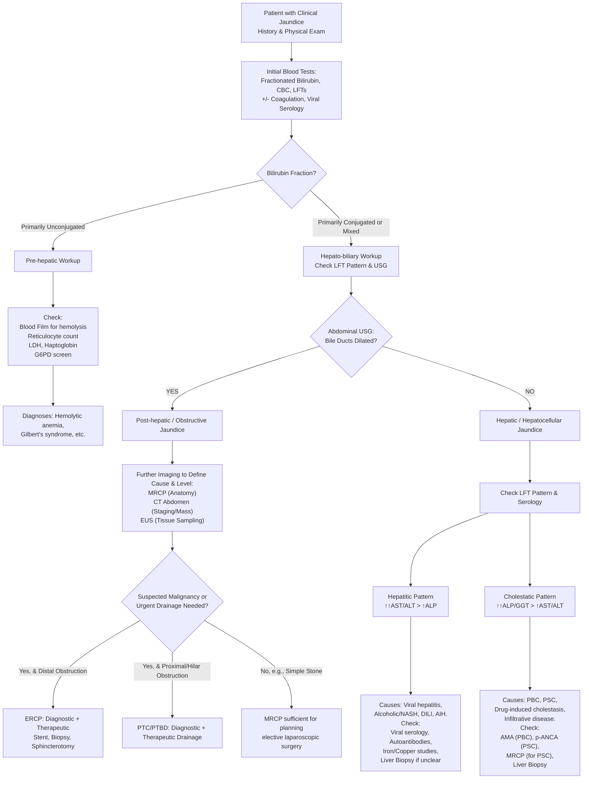

## Diagnostic Criteria, Algorithm, and Investigations for Jaundice

The diagnostic approach to jaundice is a classic example of clinical reasoning: start with non-invasive, cheap, and informative tests to categorize the problem, then proceed to more targeted investigations.

### Diagnostic Approach: History and Physical Examination

Before ordering tests, the history and exam provide critical clues that direct the entire workup.

*   **History:** Focus on the **onset** (acute vs. chronic), **associated symptoms** (pain, fever, pruritus, weight loss), **stool and urine color**, drug history, alcohol use, travel, and personal/family history of liver or hematological disease. **The key is to differentiate medical (pre-hepatic/hepatic) from surgical (obstructive) causes** [17].
*   **Physical Examination:**
    *   ***Jaundice, Stigmata of chronic liver disease, Pruritus, Courvoisier’s law, Troisier’s sign (Virchow’s node), Hepatomegaly, Sister Joseph nodule, Ascites*** [18].
    *   **Courvoisier's Law** is a cornerstone: a **palpable, non-tender gallbladder** in a jaundiced patient suggests **malignant obstruction** (e.g., pancreatic head cancer) rather than gallstones. *Why?* Chronic gallstone inflammation causes a fibrotic, non-distensible gallbladder. Acute malignant obstruction distends a previously normal gallbladder [10][19].
    *   Look for signs of chronic liver disease (spider nevi, palmar erythema, ascites) and clues to malignancy (cachexia, Virchow's node).

### Diagnostic Algorithm

The following algorithm synthesizes a logical, stepwise approach to diagnosing jaundice, integrating history, lab findings, and imaging.

### Investigation Modalities: Key Findings and Interpretation

#### 1. Blood Tests (First Line)
*   **Complete Blood Count (CBC):**
    *   **Leukocytosis:** Suggests infection (e.g., acute cholangitis).
    *   **Anemia:** May be due to chronic disease, hemolysis, or bleeding from esophageal varices.
    *   **Thrombocytopenia:** Could indicate hypersplenism from portal hypertension (cirrhosis) or consumptive coagulopathy.
*   **Liver Function Tests (LFTs):** The pattern is everything.
    *   **Bilirubin Fractionation:** Direct (conjugated) vs. Indirect (unconjugated). **Conjugated hyperbilirubinemia** implies a hepatic or post-hepatic problem.
    *   **Transaminases (AST, ALT):** Markers of **hepatocellular injury**. Very high levels (>1000 U/L) suggest acute viral hepatitis, ischemic hepatitis, or toxin-induced injury. An **AST:ALT ratio >2:1** is suggestive of alcoholic liver disease.
    *   **Alkaline Phosphatase (ALP) & Gamma-Glutamyl Transferase (GGT):** Markers of **cholestasis** (impaired bile flow). A **disproportionate elevation of ALP and GGT relative to AST/ALT** points to an obstructive or infiltrative process. GGT confirms the hepatic origin of an elevated ALP.
    *   **Albumin & Prothrombin Time (PT/INR):** Markers of **hepatic synthetic function**. Low albumin (long half-life) suggests chronic liver disease. **Prolonged PT** that corrects with Vitamin K points to **malabsorption due to obstructive jaundice**; if it doesn't correct, it indicates significant hepatocellular failure.
*   **Viral Serology:** HBsAg, Anti-HCV, etc. Essential in Hong Kong given HBV endemicity [1].
*   **Inflammatory Markers (CRP, ESR):** Elevated in infective/inflammatory conditions (cholangitis, autoimmune hepatitis).
*   **Tumor Markers:** **Never diagnostic on their own**, used in conjunction with imaging.
    *   ***CA 19-9:*** Associated with pancreatic, biliary, and gastric cancers. Also elevated in benign biliary obstruction (e.g., cholangitis, stones) and cholestasis, limiting its specificity [20][21].
    *   ***AFP (Alpha-fetoprotein):*** Marker for **Hepatocellular Carcinoma (HCC)**. Levels >400 ng/mL are highly suggestive in the right clinical context. Also elevated in germ cell tumors and active liver regeneration (e.g., hepatitis).
    *   ***CEA (Carcinoembryonic Antigen):*** Raised in colorectal, gastric, pancreatic, and lung cancers. Non-specific.
*   **Autoantibodies:**
    *   **Anti-Mitochondrial Antibody (AMA):** >95% specific for **Primary Biliary Cholangitis (PBC)**.
    *   **Anti-Nuclear Antibody (ANA), Anti-Smooth Muscle Antibody (ASMA):** Seen in Autoimmune Hepatitis.
    *   **p-ANCA:** Can be positive in Primary Sclerosing Cholangitis (PSC).

<Callout title="Lecture Slide Emphasis">
*Case Example LFTs:* **Serum bilirubin 240 µmol/L, ALP 580 u/L, ALT 60 u/L, AST 55 u/L.** This is a classic **cholestatic pattern** (high bilirubin and ALP with relatively normal transaminases), pointing to an obstructive or intrahepatic cholestatic cause [22].
</Callout>

#### 2. Imaging Modalities
*   ***Ultrasonography (USG) Abdomen: The First and Most Important Imaging Test.***
    *   **Why first?** It's non-invasive, cheap, has no radiation, and answers the critical question: **Are the bile ducts dilated?**
    *   **Key Findings:**
        *   **Dilated Intrahepatic and/or Extrahepatic Bile Ducts:** Confirms **obstructive (post-hepatic) jaundice**. The **level** of dilation (intrahepatic only vs. both) helps localize the obstruction.
        *   **CBD Diameter:** >8mm is generally considered dilated (allow 1mm per decade after age 50). A normal CBD on USG does not completely rule out obstruction (especially distal CBD stones hidden by bowel gas).
        *   **Cause:** May visualize **gallstones** (in gallbladder or CBD), a **mass** in the pancreas or liver, or **lymphadenopathy**.
        *   **Liver Parenchyma:** Can show signs of cirrhosis, fatty liver, or mass lesions.
*   ***Computed Tomography (CT) Abdomen with Contrast:***
    *   **Role:** Excellent for **staging malignancies** (pancreatic cancer, cholangiocarcinoma) and assessing vascular involvement. Better than USG for visualizing the pancreas and retroperitoneum.
    *   **Key Findings for Pancreatic Cancer:** **Hypoattenuating pancreatic mass**, **double-duct sign** (dilated CBD and pancreatic duct), and assessment of resectability (encasement of SMA, SMV, etc.) [23].
*   ***Magnetic Resonance Cholangiopancreatography (MRCP):***
    *   **Role:** The **best non-invasive test** to visualize the biliary and pancreatic ductal anatomy. It has largely replaced diagnostic ERCP. It can show stones, strictures, and masses without the risk of pancreatitis.
    *   **Key Findings:** **Filling defects** (stones), **focal strictures with proximal dilation** (tumor, PSC), and the **"beaded" appearance** of PSC.
*   ***Endoscopic Ultrasound (EUS):***
    *   **Role:** Combines endoscopy and ultrasound. Excellent for **tissue acquisition** (fine-needle aspiration/FNA) of pancreatic or periampullary masses and for detecting **small CBD stones** missed by USG.
*   ***Endoscopic Retrograde Cholangiopancreatography (ERCP):***
    *   **Role:** **Primarily therapeutic, not diagnostic.** It is an invasive procedure with risks (pancreatitis, bleeding, perforation). Used when **intervention is anticipated**.
    *   **Indications:** 1) To **relieve obstruction** (stone extraction, stent placement), 2) To obtain **brushings/biopsy** from a stricture, 3) When MRCP is equivocal and clinical suspicion for obstruction is high.
*   ***Percutaneous Transhepatic Cholangiography (PTC) & Drainage (PTBD):***
    *   **Role:** Used when **ERCP fails or is not possible** (e.g., altered anatomy, previous gastric surgery) or for **proximal/hilar obstructions** (e.g., Klatskin tumor). A needle is passed through the skin into a dilated intrahepatic duct, contrast is injected (PTC), and a drain can be placed (PTBD) to decompress the system.

<Callout title="Imaging Modalities Summary">
*   ***Imaging modalities for obstructive jaundice: Ultrasonography, Endoscopic ultrasonography, Endoscopic retrograde cholangiopancreatography (ERCP), Percutaneous transhepatic cholangiography (PTC) and drainage (PTBD), Computed tomography (CT), Magnetic resonance imaging (MRI) and cholangiopancreatography (MRCP), Positron emission tomography (PET)*** [24].
*   ***Ultrasound/CT: Size of bile duct, Level of obstruction, Cause of obstruction, Other associated features. Malignant disease: staging. Benign disease: gallstones > cx*** [25].
</Callout>

#### 3. Liver Biopsy
*   **Role:** Not routine. Used when the cause of **hepatocellular or intrahepatic cholestatic jaundice** remains unclear after exhaustive non-invasive testing (e.g., diagnosing autoimmune hepatitis, grading/staging NASH, confirming PBC or PSC when serology/MRCP is ambiguous).

### Specific Diagnostic Criteria

*   **Acute Cholangitis (Tokyo Guidelines):**
    *   **Suspected Diagnosis:** **A. Systemic Inflammation** (Fever/Shivers OR lab evidence: ↑WBC, ↑CRP) **AND B. Cholestasis** (Jaundice OR abnormal LFTs: ↑ALP, GGT, AST, ALT).
    *   **Definite Diagnosis:** Suspected diagnosis **AND C. Imaging** evidence of **biliary dilation or an etiology** (stone, stricture, stent) [26].
*   **Primary Biliary Cholangitis (PBC):** Diagnosis requires **2 of 3**: 1) **ALP ≥ 1.5x ULN**, 2) **Positive AMA (≥1:40)**, 3) **Liver biopsy** showing non-suppurative destructive cholangitis [27].
*   **Primary Sclerosing Cholangitis (PSC):** Diagnosis is based on **cholangiographic findings** (MRCP or ERCP) showing multifocal strictures and segmental dilatations of the intra- and/or extra-hepatic bile ducts, **after excluding secondary causes** (e.g., stones, surgery) [9].
*   **Hepatocellular Carcinoma (HCC):** In patients with cirrhosis, a **focal liver lesion >1 cm** with **typical imaging characteristics** (arterial phase hyperenhancement and venous/delayed phase "washout" on multiphase CT or MRI) is diagnostic without the need for biopsy.

## References

[1] Senior notes: felixlai.md (Liver cirrhosis)
[10] Senior notes: felixlai.md (Courvoisier's law)
[17] Senior notes: maxim.md (Important questions in history taking)
[18] Lecture slides: Malignant biliary obstruction.pdf (p6)
[19] Senior notes: felixlai.md (Diagnosis - Courvoisier's law)
[20] Senior notes: felixlai.md (CA 19-9)
[21] Senior notes: maxim.md (Tumor markers)
[22] Lecture slides: WCS 056 - Painless jaundice and epigastric mass - by Prof R Poon.ppt (1).pdf (p4)
[23] Senior notes: felixlai.md (CT findings in pancreatic cancer)
[24] Lecture slides: WCS 056 - Painless jaundice and epigastric mass - by Prof R Poon.ppt (1).pdf (p34)
[25] Lecture slides: Malignant biliary obstruction.pdf (p10)
[26] Senior notes: felixlai.md (Diagnostic criteria for acute cholangitis)
[27] Senior notes: felixlai.md (Diagnostic criteria for PBC)

<ActiveRecallQuiz
  title="Active Recall - Diagnosis of Jaundice"
  items={[
    {
      question: "What is the single most important initial imaging test for a patient with new-onset jaundice, and what is the critical question it must answer?",
      markscheme: "Test: Abdominal Ultrasound (USG). Critical question: Are the intrahepatic and/or extrahepatic bile ducts dilated? This dichotomizes the workup into obstructive vs. non-obstructive causes.",
    },
    {
      question: "A jaundiced patient has a prolonged Prothrombin Time (PT). How can you differentiate between a deficiency caused by obstructive jaundice versus severe hepatocellular failure?",
      markscheme: "Administer parenteral (IV or IM) Vitamin K. If the PT corrects significantly (e.g., >30% improvement) within 24-48 hours, the cause is likely Vitamin K malabsorption from obstructive jaundice. If it does not correct, it indicates profound impairment of hepatic synthetic function (hepatocellular failure).",
    },
    {
      question: "Describe the typical Liver Function Test (LFT) pattern for Obstructive Jaundice and explain the underlying pathophysiology for each component.",
      markscheme: "Pattern: Markedly elevated Conjugated Bilirubin, Alkaline Phosphatase (ALP), and Gamma-Glutamyl Transferase (GGT) with only mild-moderate elevations in AST/ALT. Pathophysiology: Bilirubin: Conjugated bilirubin backs up into blood due to mechanical blockage. ALP/GGT: Induced in bile duct epithelial cells (cholangiocytes) in response to obstruction and retained bile acids. AST/ALT: Only mildly elevated from secondary hepatocyte irritation, not primary injury.",
    },
    {
      question: "According to the Tokyo Guidelines, what three components are required to make a 'definite' diagnosis of acute cholangitis?",
      markscheme: "1) Evidence of systemic inflammation (fever/chills OR raised WBC/CRP). 2) Evidence of cholestasis (jaundice OR abnormal LFTs: ↑ALP/GGT/AST/ALT). 3) Imaging evidence of biliary dilation OR a specific etiology (e.g., stone, stricture).",
    },
    {
      question: "When is an ERCP indicated in the workup of jaundice? What are its primary advantages and risks compared to MRCP?",
      markscheme: "Indication: When therapeutic intervention is anticipated (e.g., stone removal, stent placement for obstruction) or when tissue sampling from the bile duct is needed. Advantage: It is therapeutic. Risks: Invasive with risks of pancreatitis (3-5%), bleeding, perforation, and infection. MRCP is non-invasive, has no therapeutic capability, and is used primarily for diagnosis.",
    },
    {
      question: "A 55-year-old woman with pruritus and jaundice has an ALP of 450 U/L (normal <120) and is positive for Anti-Mitochondrial Antibody (AMA) at a titer of 1:160. What is the most likely diagnosis, and what is the next best step to confirm it?",
      markscheme: "Most likely diagnosis: Primary Biliary Cholangitis (PBC). Next step: A liver biopsy is not mandatory if AMA is positive and LFTs are cholestatic. The diagnosis can be made with 2 out of 3 criteria: cholestatic LFTs, positive AMA, and compatible histology. In this case, she already meets 2 criteria (ALP and AMA), so biopsy may be reserved for atypical cases or staging.",
    }
  ]}
/>
