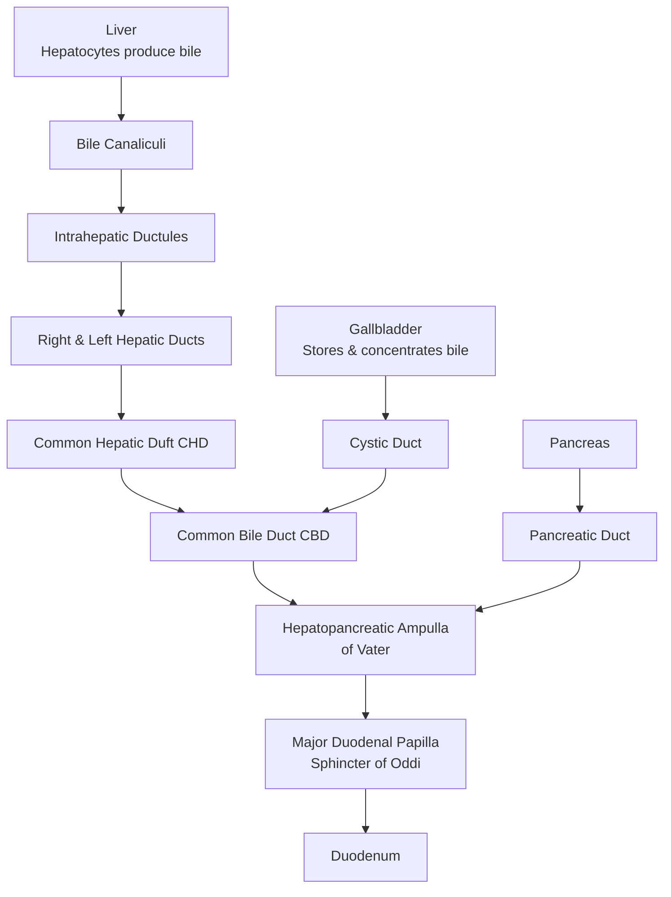

## Definition and Overview

Jaundice, also known as icterus, is a clinical sign characterized by **yellow pigmentation of the skin, sclerae (whites of the eyes), and mucous membranes** due to elevated levels of bilirubin in the blood (hyperbilirubinemia). It becomes clinically detectable when the serum bilirubin level exceeds approximately **40-50 µmol/L (2-3 mg/dL)**. It is not a disease itself but a symptom of an underlying disorder in bilirubin metabolism, transport, or excretion.

<Callout title="Key Concept">
The term "jaundice" comes from the French word "jaune," meaning yellow. The sclera is often the first place to notice jaundice because it has a high affinity for bilirubin due to its high elastin content.
</Callout>

## Epidemiology and Risk Factors

The epidemiology of jaundice is entirely dependent on its underlying cause. However, some patterns are important:
*   **Age:** Neonatal jaundice is extremely common (affecting ~60% of term infants). In adults, the causes shift. Malignant biliary obstruction (e.g., pancreatic cancer, cholangiocarcinoma) is more common in the elderly, while gallstone disease peaks in middle age.
*   **Geography/Hong Kong Context:** Certain etiologies have a higher prevalence in Asia and Hong Kong:
    *   **Hepatitis B Virus (HBV) Infection:** Hong Kong has an intermediate endemicity. Chronic HBV is a leading cause of cirrhosis and hepatocellular carcinoma (HCC), both of which can present with jaundice.
    *   **Recurrent Pyogenic Cholangitis (RPC):** Known historically as "Hong Kong disease." Associated with intrahepatic pigment stone formation and parasitic infections (e.g., *Clonorchis sinensis* from raw freshwater fish).
    *   **Cholangiocarcinoma:** Higher incidence in regions with endemic liver fluke infestation and RPC.
*   **General Risk Factors:**
    *   **Gallstones:** Female gender, obesity, rapid weight loss, pregnancy (the "4 F's" - Female, Fat, Forty, Fertile - is an outdated but classic mnemonic).
    *   **Alcoholic Liver Disease:** Chronic heavy alcohol use.
    *   **Medications:** Many drugs can cause hepatocellular injury or cholestasis (e.g., antibiotics, NSAIDs, anticonvulsants).
    *   **Genetic Disorders:** Gilbert's syndrome (very common, ~5-10% of population), Crigler-Najjar, Dubin-Johnson syndromes.

## Anatomy and Function of the Biliary System

Understanding the biliary tree's anatomy is crucial for localizing the cause of obstructive jaundice.

**Key Anatomical Points:**
*   **Bile Production:** Hepatocytes continuously produce bile, which is modified by ductal cells.
*   **Gallbladder Function:** Stores and concentrates bile by absorbing water and electrolytes. Contracts in response to cholecystokinin (CCK) after a meal, ejecting bile.
*   **Sphincter of Oddi:** A smooth muscle valve that controls the flow of bile and pancreatic juice into the duodenum and prevents duodenal contents from refluxing back.
*   **Blood Supply:** The liver has a dual supply: the **hepatic artery** (25% of flow, 50% of oxygen) and the **portal vein** (75% of flow, 50% of oxygen). The bile ducts are supplied by the hepatic artery, making them vulnerable to ischemic injury.

## Bilirubin Metabolism (The "Lifecycle" of a Red Blood Cell)

To understand jaundice, you must know bilirubin metabolism inside out. This is a classic exam topic.

**Step 1: Production (Pre-hepatic Phase)**
*   **Source:** 80-85% comes from the breakdown of senescent red blood cells (RBCs) in the spleen, liver, and bone marrow. The heme portion of hemoglobin is the precursor.
*   **Process:** Macrophages break down heme into **iron** (recycled), **carbon monoxide** (exhaled), and **biliverdin** (green pigment). Biliverdin is rapidly converted to **unconjugated bilirubin** (UCB).
*   **Characteristics of UCB:** It is **lipid-soluble, insoluble in water**, and tightly bound to albumin in the blood. It **cannot be excreted in urine**.

**Step 2: Hepatic Uptake & Conjugation (Hepatic Phase)**
*   **Uptake:** UCB-albumin complex travels to the liver. UCB dissociates and is taken up by hepatocytes via specific transporters.
*   **Conjugation:** Inside the hepatocyte, UCB is conjugated with glucuronic acid by the enzyme **UDP-glucuronosyltransferase (UGT1A1)** to form **conjugated bilirubin (CB)**.
*   **Characteristics of CB:** It is **water-soluble, non-toxic**, and can be excreted.

**Step 3: Excretion & Enterohepatic Circulation (Post-hepatic Phase)**
*   **Excretion:** CB is actively secreted into bile canaliculi and flows down the biliary tree into the duodenum.
*   **Intestinal Fate:** In the colon, bacteria deconjugate CB and convert it into **urobilinogen**.
    *   Most urobilinogen is oxidized to **stercobilin** (brown pigment) and excreted in stool.
    *   About 20% is reabsorbed into the portal circulation (enterohepatic circulation).
*   **Renal Fate:** The reabsorbed urobilinogen is mostly re-excreted by the liver. A small amount (~2%) is excreted by the kidneys, giving urine its yellow color.

<Callout title="High Yield Summary - Bilirubin Pathways">
*   **Unconjugated = Indirect = Lipid-soluble = Albumin-bound = NOT in urine.**
*   **Conjugated = Direct = Water-soluble = NOT albumin-bound = CAN be in urine (bilirubinuria).**
*   **Urobilinogen** in urine comes from reabsorbed intestinal urobilinogen. Its absence suggests complete biliary obstruction.
</Callout>

## Etiology and Pathophysiology

Jaundice is classified based on which step in bilirubin metabolism is disrupted. The three main categories are **pre-hepatic, hepatic (hepatocellular), and post-hepatic (obstructive/cholestatic)**.

### 1. Pre-hepatic Jaundice (Unconjugated Hyperbilirubinemia)
*   **Pathophysiology:** **Excessive production of bilirubin** overwhelms the liver's normal capacity to conjugate and excrete it. The liver is normal but cannot keep up.
*   **Key Etiologies:**
    *   **Hemolysis:** Breakdown of RBCs. Causes include autoimmune hemolytic anemia, G6PD deficiency, sickle cell crisis, malaria, prosthetic heart valves.
    *   **Ineffective Erythropoiesis:** Seen in megaloblastic anemias (B12/folate deficiency), thalassemia.
    *   **Large Hematoma Resorption:** After major trauma or surgery.
*   **Hong Kong Relevance:** G6PD deficiency is relatively common in Southern Chinese males.

### 2. Hepatic (Hepatocellular) Jaundice
*   **Pathophysiology:** **Dysfunction of the hepatocytes themselves.** This impairs **all three** hepatic steps: uptake, conjugation, and excretion. Therefore, you see a **mixed picture** with elevations of both unconjugated and conjugated bilirubin, but often with a predominance of conjugated because excretion is the rate-limiting step.
*   **Key Etiologies:**
    *   **Viral Hepatitis:** Hepatitis A, B, C, D, E. **HBV is a major cause in HK.**
    *   **Alcoholic Liver Disease:** From fatty liver to hepatitis to cirrhosis.
    *   **Non-Alcoholic Fatty Liver Disease (NAFLD)/NASH:** Increasingly common with the obesity epidemic.
    *   **Cirrhosis (any cause):** End-stage of chronic liver disease. In HK, **HBV is the most common cause of cirrhosis** [1].
    *   **Drug-Induced Liver Injury (DILI):** A huge list (e.g., paracetamol overdose, antibiotics, antituberculous drugs).
    *   **Autoimmune Hepatitis.**
    *   **Genetic Disorders:** Wilson's disease, hemochromatosis, alpha-1 antitrypsin deficiency.
    *   **Ischemic Hepatitis ("Shock Liver").**

### 3. Post-hepatic/Obstructive Jaundice (Conjugated Hyperbilirubinemia)
*   **Pathophysiology:** **Mechanical obstruction of the biliary tree** prevents the flow of conjugated bilirubin from the liver to the intestine. Pressure builds up, causing bile to "back up" into the liver and leak into the bloodstream (cholemia). Conjugated bilirubin is water-soluble and appears in the urine.
*   **Key Etiologies (Use Anatomical Level):**
    *   **Intraluminal:** **Choledocholithiasis** (CBD stone) - the most common cause of *painful* obstructive jaundice.
    *   **Mural (Wall of the duct):**
        *   **Malignant:** ***Cholangiocarcinoma*** (e.g., **Klatskin tumor** at the hilum), malignant stricture.
        *   **Benign:** ***Primary Sclerosing Cholangitis (PSC)***, post-surgical stricture, ***Recurrent Pyogenic Cholangitis (RPC)*** with strictures.
    *   **Extramural (Compression from outside):**
        *   ***Carcinoma of the head of the pancreas*** - the classic cause of *painless progressive obstructive jaundice*.
        *   Lymphadenopathy at the porta hepatis (e.g., from metastases).
        *   ***Mirizzi syndrome***: A gallstone impacted in the cystic duct compresses the CHD/CBD.

<Callout title="Lecture Slide Emphasis">
*   **Causes of jaundice: Medical cause vs Surgical cause (stone, tumour, benign stricture)** [2].
*   **Pathology causing malignant biliary obstruction: Carcinoma of duodenum, Periampullary carcinoma, Carcinoma of pancreas, Lymphoma, Carcinoma of gallbladder, Cholangiocarcinoma at hilum (Klatskin tumor), HCC** [3].
</Callout>

## Classification of Jaundice

Beyond the pathophysiological triad, jaundice can be classified in other useful ways:
*   **Conjugated vs. Unconjugated:** Based on lab findings (the "Direct vs. Indirect" split).
*   **Medical vs. Surgical:** A traditional surgical perspective.
    *   **Medical Jaundice:** Pre-hepatic and hepatic causes. Management is primarily medical.
    *   **Surgical Jaundice:** Almost synonymous with **obstructive/cholestatic jaundice**, where the problem is mechanical and often requires endoscopic, radiological, or surgical intervention to relieve the blockage.
*   **Benign vs. Malignant Obstruction:** A critical distinction in clinical practice.

## Clinical Features: Symptoms and Signs

Connect every symptom and sign back to the underlying pathophysiology. This is what examiners love.

### Symptoms

1.  **Yellow Discoloration (Icterus):**
    *   **Pathophysiology:** Deposition of bilirubin in tissues. Sclera first (due to high elastin affinity), then skin.
2.  **Dark Urine (Bilirubinuria or "Tea-colored"):**
    *   **Pathophysiology:** Exclusive to **conjugated hyperbilirubinemia**. Water-soluble conjugated bilirubin is filtered by the kidneys and colors the urine. *This is a key differentiator between pre-hepatic/hepatic vs. obstructive causes.*
3.  **Pale, Clay-Colored Acholic Stools:**
    *   **Pathophysiology:** Occurs in **complete biliary obstruction**. No bilirubin reaches the intestine → no formation of stercobilin (the brown pigment). Stools become pale, greasy (steatorrhea), and foul-smelling.
4.  **Pruritus (Itching):**
    *   **Pathophysiology:** Primarily associated with **cholestasis** (intra- or extra-hepatic). Bile salts, which are normally excreted in bile, accumulate in the skin and act as irritants. It is often generalized and worse at night. A hallmark of conditions like Primary Biliary Cholangitis (PBC).
5.  **Abdominal Pain:**
    *   **Biliary Colic:** Sudden, severe, constant RUQ/epigastric pain, often radiating to the back or right scapula. Caused by a **gallstone transiently impacting** in the cystic duct or CBD.
    *   **Constant Dull Pain:** Suggestive of **malignant obstruction** (e.g., pancreatic cancer) or chronic inflammation.
    *   *Why pain?* Distention of the biliary tree or gallbladder, inflammation of the capsule (liver or pancreas), or direct tumor invasion of nerves.
6.  **Fever & Rigors (Chills):**
    *   **Pathophysiology:** Indicates **infection in the biliary tree**, i.e., **acute cholangitis**. Biliary obstruction + bacterial overgrowth leads to systemic infection. Classic in choledocholithiasis and acute cholangitis.
7.  **Constitutional Symptoms (Weight Loss, Anorexia, Fatigue):**
    *   **Pathophysiology:** Common in **malignancy** (e.g., pancreatic cancer, cholangiocarcinoma) or advanced chronic liver disease. Weight loss can also be from malabsorption due to steatorrhea.
8.  **Bleeding Tendency (Easy Bruising, Epistaxis):**
    *   **Pathophysiology:** The liver synthesizes clotting factors (II, VII, IX, X). In liver failure or prolonged obstructive jaundice, synthesis is impaired. Also, **obstructive jaundice causes malabsorption of fat-soluble vitamin K**, which is a cofactor for the synthesis of these factors.

### Signs

1.  **Scleral Icterus:** The most sensitive and earliest sign.
2.  **Skin Examination:**
    *   **Jaundice:** Best seen in natural light. Check the palate.
    *   **Excoriations:** Scratch marks from pruritus.
    *   **Spider Angiomas, Palmar Erythema, Dupuytren's Contracture:** Signs of chronic liver disease.
3.  **Abdominal Examination:**
    *   **Hepatomegaly:** May be smooth and tender (e.g., congestion, hepatitis) or hard/nodular (e.g., cirrhosis, metastases).
    *   **Splenomegaly:** Suggests portal hypertension (cirrhosis) or hemolysis.
    *   **Ascites:** Shifting dullness. Suggests portal hypertension (e.g., cirrhosis) or peritoneal metastases.
    *   ***Courvoisier's Sign:*** **A palpable, non-tender gallbladder in the presence of jaundice suggests malignant obstruction of the CBD (e.g., pancreatic head cancer) rather than gallstones.** *Why?* A gallbladder chronically inflamed from stones is fibrotic and cannot dilate. A malignancy causes an acute obstruction, distending a previously healthy, compliant gallbladder.
        *   ***Exception:*** "Double impaction" - a stone in both the cystic duct (causing gallbladder mucocele/hydrops) *and* the CBD (causing jaundice).
    *   **Epigastric/RUQ Mass:** Could be a distended gallbladder (Courvoisier's), a pancreatic mass, enlarged liver, or lymph nodes [4][5].
4.  **Stigmata of Chronic Liver Disease:** As above, plus gynecomastia, testicular atrophy, caput medusae, fetor hepaticus.
5.  **Altered Mental Status:** In severe cases, can indicate **hepatic encephalopathy** (from liver failure) or **sepsis** (from severe cholangitis - part of Reynolds' pentad).

<Callout title="Classic Triads">
*   **Charcot's Triad (Acute Cholangitis):** Fever + RUQ pain + Jaundice.
*   **Reynolds' Pentad (Severe Cholangitis):** Charcot's triad + Hypotension/shock + Altered mental status.
*   **Courvoisier's Law:** *"In painless jaundice, a palpable gallbladder is unlikely to be due to gallstones."*
</Callout>

## References

[1] Senior notes: felixlai.md (Liver cirrhosis)
[2] Lecture slides: WCS 056 - Painless jaundice and epigastric mass - by Prof R Poon.ppt (1).pdf (p22)
[3] Lecture slides: WCS 056 - Painless jaundice and epigastric mass - by Prof R Poon.ppt (1).pdf (p23)
[4] Lecture slides: WCS 056 - Painless jaundice and epigastric mass - by Prof R Poon.ppt (1).pdf (p32)
[5] Lecture slides: WCS 056 - Painless jaundice and epigastric mass - by Prof R Poon.ppt (1).pdf (p33)

<ActiveRecallQuiz
  title="Active Recall - Jaundice Fundamentals"
  items={[
    {
      question: "A patient presents with yellow eyes and dark urine. Their total bilirubin is 80 µmol/L, with a direct (conjugated) fraction of 70 µmol/L. What is the most likely type of jaundice, and name one specific cause that would NOT explain these findings.",
      markscheme: "Type: Conjugated (Obstructive or Hepatic) Hyperbilirubinemia. A cause that would NOT explain it: Pure hemolysis (e.g., G6PD deficiency), as this causes primarily unconjugated hyperbilirubinemia without bilirubinuria.",
    },
    {
      question: "Explain the pathophysiological mechanism behind pale, clay-colored stools in a jaundiced patient.",
      markscheme: "Mechanical obstruction of the biliary tree prevents conjugated bilirubin from reaching the intestine. Intestinal bacteria therefore cannot convert bilirubin into urobilinogen and subsequently stercobilin, the brown pigment that gives stool its normal color.",
    },
    {
      question: "What is Courvoisier's sign, and what is the pathophysiological reason it points towards malignancy rather than gallstones?",
      markscheme: "A palpable, non-tender gallbladder in a jaundiced patient. Reason: Chronic inflammation from gallstones causes a fibrotic, thickened, non-distensible gallbladder. A malignant obstruction (e.g., pancreatic head cancer) develops rapidly, causing back-pressure that distends a previously normal, compliant gallbladder.",
    },
    {
      question: "List the three components of Charcot's triad and state the condition it is classically associated with.",
      markscheme: "Fever, Right Upper Quadrant pain, Jaundice. It is classically associated with Acute Cholangitis.",
    },
    {
      question: "Why does a patient with prolonged obstructive jaundice have an increased risk of bleeding? Provide two distinct physiological reasons.",
      markscheme: "1. Malabsorption of fat-soluble vitamin K (due to lack of bile in the gut), which is a cofactor for hepatic synthesis of clotting factors II, VII, IX, X. 2. Impaired hepatic synthetic function if there is concomitant liver damage/cholestasis, leading to reduced production of clotting factors.",
    },
    {
      question: "Describe the enterohepatic circulation of bilirubin. What happens to the urobilinogen that is reabsorbed from the intestine?",
      markscheme: "Conjugated bilirubin is excreted in bile into the duodenum. Gut bacteria deconjugate it and convert it to urobilinogen. Most urobilinogen is oxidized to stercobilin and excreted in feces. About 20% is reabsorbed into the portal circulation. This reabsorbed urobilinogen is mostly taken up by the liver and re-excreted in bile (enterohepatic circulation). A small fraction (~2%) escapes hepatic uptake and is excreted by the kidneys, giving urine its yellow color.",
    }
  ]}
/>
