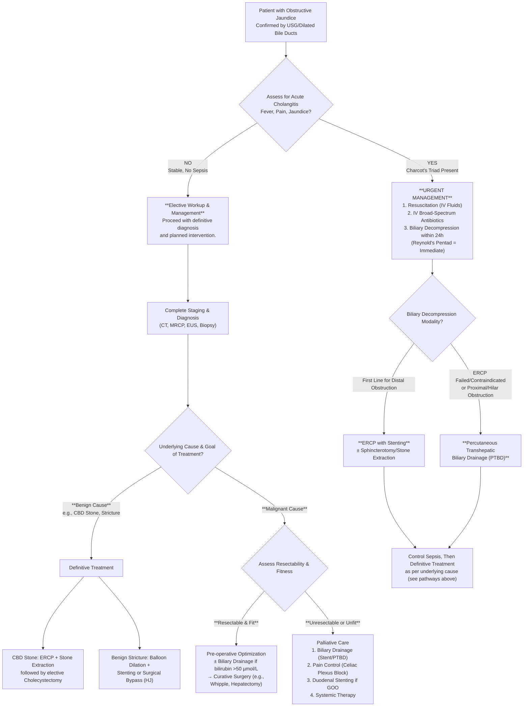

## Management Algorithm and Treatment Modalities for Jaundice

The management of jaundice is entirely directed at treating its underlying cause. However, the approach to **obstructive (surgical) jaundice** involves specific, often urgent, interventions to relieve the blockage and treat complications like infection. The management of **hepatic (medical) jaundice** is primarily supportive and disease-specific.

The cornerstone of managing obstructive jaundice is **biliary decompression** – relieving the blockage to allow bile to flow. The method depends on the cause, level of obstruction, patient fitness, and whether the goal is curative or palliative.

### General Management Principles (Supportive Care)

Before specific treatment, address the systemic effects of jaundice and cholestasis:

- **Correct Coagulopathy:** Administer **parenteral Vitamin K** (e.g., 10 mg IV/IM) to correct PT/INR prolonged due to malabsorption. Fresh Frozen Plasma (FFP) may be needed for urgent procedures.
- **Manage Pruritus:** Cholestyramine (bile acid sequestrant), antihistamines, or rifampicin.
- **Nutritional Support:** Fat-soluble vitamin (A, D, E, K) supplementation. Consider medium-chain triglycerides (MCTs) for steatorrhea as they are absorbed without bile salts.
- **Renal Protection:** Maintain hydration; obstructive jaundice predisposes to hepatorenal syndrome.

### Management Algorithm for Obstructive Jaundice

The following algorithm outlines the decision-making pathway, from initial stabilization to definitive therapy.

### Treatment Modalities for Specific Conditions

#### 1. Acute Cholangitis

A life-threatening infection requiring urgent intervention. Remember the mnemonic **RAD**: **R**esuscitation, **A**ntibiotics, **D**rainage [28].

- **Resuscitation:** IV fluids, monitor vitals, correct electrolytes.
- **_Antibiotics:_** **_IV broad-spectrum antibiotics_** covering enteric Gram-negatives and anaerobes (e.g., piperacillin-tazobactam or cefuroxime + metronidazole) [29].
- **_Biliary Drainage (Decompression):_** Required urgently if no response to antibiotics within 12-24 hours or immediately if **Reynold's pentad** (shock, altered mentation) is present.
  - **_First line: ERCP with biliary stenting_** (and/or sphincterotomy/stone extraction if feasible). This relieves pressure, drains infected bile, and allows antibiotics to penetrate [30].
  - **Alternatives:** **PTBD** (if ERCP fails, contraindicated, or for proximal obstructions) or, rarely, surgical common bile duct exploration (ECBD).
- **Definitive Treatment:** Once sepsis is controlled, treat the underlying cause (e.g., cholecystectomy for gallstones).

#### 2. Choledocholithiasis (CBD Stones)

- **Symptomatic or Complicated Stones** (causing jaundice, cholangitis, pancreatitis):
  - **_ERCP with Sphincterotomy and Stone Extraction_** is the standard first-line therapy [31]. Techniques include balloon trawl, basket extraction, or mechanical lithotripsy for large stones.
  - **Timing:** For concomitant **acute biliary pancreatitis**, ERCP is indicated within 24-72 hours if there is **persistent biliary obstruction or cholangitis**.
  - **Subsequent Cholecystectomy:** **Laparoscopic cholecystectomy** should be performed during the same admission or within 2-4 weeks after ERCP to prevent recurrent biliary events.
- **Asymptomatic CBD Stones:** Management is debated; ERCP may be considered if stones are large (>1cm) or if the patient is undergoing cholecystectomy.

#### 3. Malignant Biliary Obstruction (MBO)

Management hinges on **resectability** (curative intent) vs. **unresectability** (palliative intent) [32].

**A. Curative-Intent Treatment (Resectable Disease)**

- **Pre-operative Preparation:**
  - **_Pre-operative Biliary Drainage_** is controversial. Traditionally used to lower bilirubin (< 50 µmol/L) to reduce surgical risks (coagulopathy, renal impairment, infection). However, it can increase complications (stent occlusion, cholangitis). Current guidelines suggest **avoiding routine drainage** if surgery can be performed within 1-2 weeks. In practice (e.g., QMH), drainage is often done due to surgical waiting times [33].
  - **_Nutritional support_** and correction of coagulopathy.
- **Surgical Resection:**
  - **_Carcinoma of Head of Pancreas/Periampullary:_** **_Pancreaticoduodenectomy (Whipple procedure)_**. Pylorus-preserving (PPPD) is often preferred.
  - **_Cholangiocarcinoma:_**
    - **Perihilar (Klatskin):** Major hepatectomy (often extended hepatectomy) + bile duct resection + caudate lobectomy + Roux-en-Y Hepaticojejunostomy.
    - **Distal CBD:** Pancreaticoduodenectomy (similar to pancreatic head cancer).
    - **Intrahepatic:** Partial hepatectomy.
  - **_Gallbladder Carcinoma:_** Radical cholecystectomy (cholecystectomy + wedge resection of liver segments IVb/V + portal lymphadenectomy).
- **Adjuvant Therapy:** Chemotherapy (e.g., Gemcitabine + Capecitabine for pancreas; Capecitabine for biliary) is standard post-resection to improve survival.

**B. Palliative-Intent Treatment (Unresectable Disease)**
Goals: **_Relieve obstruction, treat sepsis, control pain_** [34].

- **_Biliary Decompression:_**
  - **_Endoscopic Stenting (ERCP):_** **First-line for distal CBD obstructions.** Self-expandable metallic stents (SEMS) are preferred over plastic for longer patency if life expectancy >3-4 months.
  - **_Percutaneous Transhepatic Biliary Drainage (PTBD):_** Indicated for **proximal/hilar obstructions**, or when ERCP fails or is contraindicated (e.g., altered anatomy like Roux-en-Y, gastric outlet obstruction) [35].
- **_Duodenal Stenting or Gastrojejunostomy:_** For malignant gastric outlet obstruction.
- **_Pain Control:_** Opioids, **celiac plexus neurolysis** (EUS or CT-guided).
- **_Systemic Therapy:_** Chemotherapy (e.g., FOLFIRINOX, Gemcitabine-based regimens) for pancreatic/biliary cancers.

<Callout title="Procedure Specifics">
  **ERCP Contraindications [36]:** * Unstable cardiopulmonary status. *
  Suspected bowel perforation. * **Altered upper GI anatomy** (e.g., Billroth II
  gastrectomy, Roux-en-Y reconstruction – makes access technically difficult). *
  Gastric outlet obstruction.
</Callout>

#### 4. Recurrent Pyogenic Cholangitis (RPC - "Hong Kong Disease")

Management is challenging due to intrahepatic stones and strictures.

- **Acute Episode:** Managed as acute cholangitis (**RAD**). **PTBD is often more effective than ERCP** for draining the frequently affected intrahepatic ducts.
- **Definitive/Preventive Therapy:** Aims to break the cycle of stasis-infection-stone formation.
  - **Endoscopic/Interventional:** Repeated **ERCP sessions** for stone clearance and stricture dilation.
  - **Surgical:** **Hepatectomy** of the atrophic, stone-laden liver segment (often left lateral section) + **Roux-en-Y Hepaticojejunostomy** to provide free biliary drainage. This is indicated for localized disease, failed non-operative management, or suspicion of cholangiocarcinoma [37].

#### 5. Choledochal Cysts

**Complete surgical excision is mandatory due to high risk of cholangiocarcinoma.**

- **Procedure:** **Complete cyst excision + Roux-en-Y Hepaticojejunostomy.**
- **Why excision?** Removes the premalignant epithelium. Internal drainage procedures alone (e.g., cyst-enterostomy) are contraindicated as they leave the cancer risk.
- **Type V (Caroli's Disease):** If unilateral, hemihepatectomy. If diffuse, may require liver transplantation.

#### 6. Primary Sclerosing Cholangitis (PSC) & Primary Biliary Cholangitis (PBC)

- **PSC:** No cure except **liver transplantation** for end-stage disease. Dominant strictures causing obstruction/cholangitis may be treated with endoscopic balloon dilation ± stenting. Ursodeoxycholic acid (UDCA) is used but of limited proven benefit.
- **PBC:** First-line treatment is **UDCA 13-15 mg/kg/day**, which slows disease progression. Obeticholic acid is second-line. Liver transplantation for end-stage disease.

## References

[28] Senior notes: maxim.md (Acute management of cholangitis - RAD)
[29] Lecture slides: GC 200. RUQ pain, jaundice and fever Cholecytitis and cholangitis Imaging of GI system.pdf (p13)
[30] Lecture slides: GC 200. RUQ pain, jaundice and fever Cholecytitis and cholangitis Imaging of GI system.pdf (p14)
[31] Senior notes: maxim.md (Choledocholithiasis management)
[32] Lecture slides: Malignant biliary obstruction.pdf (p18)
[33] Lecture slides: WCS 056 - Painless jaundice and epigastric mass - by Prof R Poon.ppt (1).pdf (p67)
[34] Lecture slides: Malignant biliary obstruction.pdf (p30)
[35] Senior notes: felixlai.md (PTBD indications)
[36] Senior notes: felixlai.md (ERCP contraindications)
[37] Senior notes: felixlai.md (RPC surgical treatment)

<ActiveRecallQuiz
  title="Active Recall - Management of Jaundice"
  items={[
    {
      question:
        "What are the three key components of the 'RAD' approach to managing acute cholangitis, and why is drainage so critical?",
      markscheme:
        "R: Resuscitation (IV fluids). A: Antibiotics (IV broad-spectrum). D: Drainage (urgent biliary decompression via ERCP/PTBD). Drainage is critical because antibiotics cannot effectively penetrate the obstructed, infected biliary tree. Relieving the obstruction drains pus, lowers intrabiliary pressure, and restores antibiotic penetration.",
    },
    {
      question:
        "A patient with a distal CBD stone causing obstructive jaundice undergoes ERCP with sphincterotomy and stone extraction. What is the subsequent definitive management, and why is it necessary?",
      markscheme:
        "Subsequent definitive management is laparoscopic cholecystectomy. It is necessary because the gallbladder is the source of the stones. Leaving it in situ carries a high risk of recurrent biliary events (new stones, cholangitis, pancreatitis).",
    },
    {
      question:
        "List two specific clinical scenarios where Percutaneous Transhepatic Biliary Drainage (PTBD) would be preferred over ERCP for biliary decompression.",
      markscheme:
        "1. Proximal/Hilar malignant obstruction (e.g., Klatskin tumor), where endoscopic access and stenting are difficult. 2. Altered upper GI anatomy (e.g., prior Roux-en-Y gastric bypass or Billroth II gastrectomy) that prevents endoscopic access to the ampulla.",
    },
    {
      question:
        "What is the main argument AGAINST routine pre-operative biliary drainage in a patient with resectable pancreatic head cancer and jaundice? What is a practical reason it is often done in Hong Kong?",
      markscheme:
        "Argument against: Pre-operative drainage does not reduce surgical morbidity/mortality and may increase complications (stent-related cholangitis, pancreatitis). Practical reason in HK (e.g., QMH): Long waiting times for major surgery (e.g., 6-8 weeks for Whipple) make the risk of developing cholangitis while waiting unacceptably high without drainage.",
    },
    {
      question:
        "Why is complete surgical excision, rather than simple internal drainage, the mandatory treatment for a Type I choledochal cyst?",
      markscheme:
        "Because the cyst wall has a premalignant epithelium with a lifetime risk of cholangiocarcinoma of up to 30%. Excision removes this risk. Internal drainage procedures (e.g., cyst-enterostomy) leave the cyst in situ and do not eliminate the cancer risk.",
    },
    {
      question:
        "A patient with known PSC develops worsening jaundice and cholangitis. MRCP shows a dominant stricture in the common hepatic duct. What is the appropriate endoscopic intervention?",
      markscheme:
        "Endoscopic balloon dilation of the dominant stricture, with possible short-term stenting if necessary. The goal is to relieve the obstruction and treat cholangitis. Long-term stenting is avoided due to risks of occlusion and infection.",
    },
  ]}
/>
