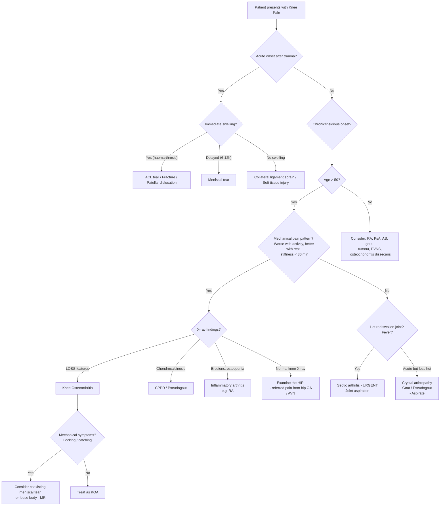

## Differential Diagnosis of Knee Osteoarthritis

When a patient walks into your clinic with a painful, stiff knee, your job is **not** to jump straight to "OA knee." Your job is to systematically consider what else could be causing this presentation, then use the history, examination, and investigations to narrow down. Think of it this way: "knee pain" is the symptom — OA is only one of many possible diagnoses.

The differential diagnosis of KOA is best approached by considering:
1. **Anatomical location** of the pain (anterior, medial, lateral, posterior)
2. **Acuity** (acute injury vs chronic/insidious)
3. **Category of pathology** (degenerative, inflammatory, crystal, infective, traumatic, referred, neoplastic)

---

### 1. Approach by Anatomical Location

***Differential Diagnosis of Knee Pain by Anatomic Site*** [1]:

This is a classic framework and is very high-yield. The knee is a large, complex joint, and different structures live in different compartments. The location of pain gives you a strong clue.

#### 1.1 Anterior Knee Pain

| Condition | Why it mimics KOA / Key Distinguishing Features |
|---|---|
| ***Patellofemoral pain syndrome (chondromalacia patellae)*** | Anterior knee pain worse on stairs, squatting, prolonged sitting ("theatre sign"). Common in young women. Differs from OA: younger age, no radiographic OA features, patellar grind test positive. "Chondromalacia" = "chondro" (cartilage) + "malacia" (softening) — softening of the patellar cartilage, a precursor to patellofemoral OA |
| ***Patellar subluxation or dislocation*** | History of the patella "popping out," usually laterally. Positive apprehension test on lateral patellar translation. Risk factors: young obese female, patella alta, wide Q angle, genu valgum, shallow trochlear groove [6] |
| ***Quadriceps tendonitis*** | Pain above the patella, worse with resisted knee extension. Point tenderness at the superior pole of patella |
| ***Patellar tendonitis ("Jumper's knee")*** | ***Jumper's knee (patellar tendonitis)*** [1] — pain at the inferior pole of the patella, common in athletes who jump (basketball, volleyball). Point tenderness at patellar tendon origin |
| ***Tibial apophysitis (Osgood-Schlatter disease)*** | ***Osgood-Schlatter lesion*** [1] — adolescents (10–15 years), pain and swelling at the tibial tuberosity. Traction apophysitis from repetitive quadriceps pull on the growth plate. Self-limiting |
| ***Housemaid's knee (prepatellar bursitis)*** | ***Housemaids Knee*** [1] — swelling and tenderness directly over the patella (not within the joint). Caused by repetitive kneeling. The bursa is superficial to the patella — fluctuant swelling that doesn't communicate with the joint space |
| ***Arthritis*** | ***Arthritis*** is listed as an anterior cause [1] — this includes patellofemoral OA specifically |

#### 1.2 Medial Knee Pain

| Condition | Key Features |
|---|---|
| ***Medial collateral ligament (MCL) sprain*** | History of valgus force injury. Tenderness along the MCL (medial joint line to medial femoral epicondyle). Valgus stress test positive [6] |
| ***Medial meniscal tear*** | ***Medial meniscus tear*** [1] — history of twisting injury while flexed and weight-bearing [6]. Delayed swelling (6–12 hours), joint line tenderness, McMurray test positive, locking in flexion [7]. Degenerative meniscal tears are common in older patients and coexist with OA |
| ***Pes anserine bursitis*** | ***Pes anserine bursitis*** [1] — pain and tenderness over the anteromedial tibia, ~5 cm below the joint line. "Pes anserinus" = "goose's foot" (the conjoint tendons of **S**artorius, **G**racilis, semi**T**endinosus — "**S**ay **G**race before **T**ea" [6]). Common in obese women with KOA — the two conditions often coexist, so don't attribute all medial knee pain to OA without palpating below the joint line |
| ***Medial plica syndrome*** | ***Medial plica syndrome*** [1] — a plica is a synovial fold (embryological remnant). When thickened/inflamed, it catches over the medial femoral condyle causing snapping and pain. More common in young patients |

#### 1.3 Lateral Knee Pain

| Condition | Key Features |
|---|---|
| ***Lateral collateral ligament (LCL) sprain*** | ***LCL injury*** [1] — less common than MCL. History of varus force. Tenderness at fibular head/lateral femoral condyle. Varus stress test positive |
| ***Lateral meniscal tear*** | ***Lateral meniscus tear*** [1] — similar to medial but lateral joint line tenderness |
| ***Iliotibial band (ITB) syndrome*** | ***ITB syndrome*** [1] — most common cause of lateral knee pain in runners [6]. The ITB is the shared aponeurosis of tensor fasciae latae and gluteus maximus, inserting on Gerdy's tubercle [6]. Repetitive flexion-extension → friction of ITB against the lateral femoral condyle → inflammation. Pain at 30° flexion (Noble's test, Renne test). Risk factors: runners, cyclists, genu varum, hip abductor weakness [6] |

#### 1.4 Posterior Knee Pain

| Condition | Key Features |
|---|---|
| ***Popliteal cyst (Baker's cyst)*** | ***Baker's cyst*** [1][8] — a popliteal synovial cyst arising from the gastrocnemius-semimembranosus bursa. Usually secondary to underlying joint pathology (OA, meniscal tear, RA) — the joint produces excess fluid which herniates posteriorly through a one-way valve mechanism. Presents with posterior knee pain, stiffness, and a palpable mass behind the knee [8]. Can rupture and mimic DVT (pseudothrombophlebitis syndrome) |
| ***Posterior cruciate ligament (PCL) injury*** | ***PCL injury*** [1] — mechanism: dashboard injury (direct blow to proximal tibia with knee flexed), hyperextension. Posterior drawer test positive. Less common than ACL |

<Callout title="Baker's Cyst — Don't Forget the Underlying Cause">
A Baker's cyst is almost always **secondary**. In a middle-aged/elderly patient, the underlying cause is usually OA or a degenerative meniscal tear. In a younger patient, think RA or inflammatory arthritis. Always investigate the joint — don't just treat the cyst.
</Callout>

---

### 2. Approach by Category of Pathology

This is the more systematic approach for exams — thinking through the broad categories of "what causes a painful, stiff knee?"

#### 2.1 Degenerative

- **Osteoarthritis** (our index condition)
- ***Degenerative meniscal tear*** — ***degenerated meniscus, including degenerative meniscus tears, are very common incidental findings on MRI in patients suffering from osteoarthritis of the knee*** [7]. This is crucial: in patients with established KOA, an MRI will often show meniscal tears that are **incidental** and not the primary pain generator. ***Caution should be exercised against the treatment of "incidental" meniscus lesions found on MRI in patients who have no symptoms of locking*** [7]. If the patient has no mechanical symptoms (locking, catching), the degenerative meniscal tear is likely a bystander, not the culprit.
- **Chondromalacia patellae** — softening and fibrillation of patellar cartilage, a precursor/early form of patellofemoral OA.

#### 2.2 Inflammatory Arthritis

| Condition | Key Distinguishing Features from OA |
|---|---|
| **Rheumatoid Arthritis (RA)** | Symmetrical polyarthritis, morning stiffness > 60 min, soft tissue swelling (not bony), RF/anti-CCP positive, radiographs show juxta-articular osteopenia and erosions (NOT osteophytes). ***Valgus deformity (rheumatoid arthritis)*** vs ***varus deformity (osteoarthritis)*** [1] |
| **Psoriatic Arthritis (PsA)** | Look for psoriatic skin lesions/nail changes. Can be oligoarticular or polyarticular. DIP involvement (unlike RA). "Pencil-in-cup" deformity on X-ray |
| **Ankylosing Spondylitis (AS)** | Young male, HLA-B27 positive, predominantly axial but can involve peripheral joints including the knee. SI joint fusion on imaging |
| **Reactive Arthritis** | Acute monoarthritis/oligoarthritis following GU or GI infection. "Can't see, can't pee, can't climb a tree" (conjunctivitis, urethritis, arthritis) |

> **Exam pearl:** The classic deformity distinction: ***varus = OA, valgus = RA*** [1]. This is because OA predominantly destroys the medial compartment (varus), while RA destroys diffusely but lateral structures and ligaments are often more severely involved → valgus.

#### 2.3 Crystal Arthropathy

| Condition | Key Features |
|---|---|
| **Gout** | Acute, excruciatingly painful monoarthritis. Knee is the second most common large joint affected (after 1st MTP). Red, hot, swollen joint. Raised serum urate. Negatively birefringent needle-shaped monosodium urate crystals on joint aspiration. Tophi in chronic disease |
| **Pseudogout (CPPD)** | Calcium pyrophosphate dihydrate deposition disease. Older patients, knee is the most commonly affected joint. Chondrocalcinosis on X-ray (calcification of meniscal cartilage — a linear calcification within the joint space that OA does NOT produce). Weakly positive birefringent rhomboid crystals on aspiration |

<Callout title="CPPD vs OA — A Common Trap" type="error">
CPPD and OA frequently **coexist** in the elderly knee. If you see chondrocalcinosis (calcification of the meniscus/cartilage) on X-ray, consider CPPD. An acute flare of pseudogout can occur on top of chronic OA and be misdiagnosed as "OA flare" — always aspirate if an acutely hot, swollen joint in an OA patient doesn't fit the usual pattern.
</Callout>

#### 2.4 Infective

| Condition | Key Features |
|---|---|
| **Septic arthritis** | Acute hot, red, swollen, extremely painful joint with fever and markedly restricted ROM. Single most important condition to exclude in any acute monoarthritis — medical emergency because cartilage destruction occurs within hours. Risk factors: elderly, immunosuppressed, diabetes, RA, recent joint injection/surgery, skin infection. Joint aspiration: turbid fluid, WBC > 50,000/mm³ (often > 100,000), positive Gram stain/culture. ***Infective causes*** can lead to secondary OA [1] |
| **Tuberculosis (TB)** | Chronic monoarthritis, especially in endemic areas (Hong Kong). Insidious onset, doughy synovial thickening. X-ray: Phemister triad (juxta-articular osteoporosis, peripheral erosions, gradual joint space narrowing). Synovial biopsy with caseating granulomas |

#### 2.5 Traumatic / Mechanical

| Condition | Key Features |
|---|---|
| **ACL tear** | ***Importance of trauma history*** [1] — sudden deceleration/pivoting, audible "pop," immediate haemarthrosis (swelling within hours), instability ("give way"). Lachman test, anterior drawer test, pivot shift test positive [6] |
| **Meniscal tear (traumatic)** | ***Symptoms: mechanical pain, swelling (delayed onset), locking, giving way*** [7]. ***Signs: joint line tenderness, effusion, reduced ROM, provocative signs (McMurray test, Apley grinding test)*** [7]. Traumatic tears are associated with acute injury, degenerative tears with aging/OA |
| **Collateral ligament injuries** | MCL: valgus stress mechanism; LCL: varus stress mechanism [6] |
| **Fractures** | Patellar fracture (inability to extend knee, palpable defect [6]), tibial plateau fracture (high-energy trauma, lipohaemarthrosis, lateral plateau most common [6]), distal femoral fracture. Always get X-rays in acute trauma |
| ***Osteochondritis dissecans*** | ***Osteochondritis dissecans*** [1] — subchondral bone undergoes avascular necrosis, and a fragment of cartilage + bone may separate and become a loose body. Young patients (adolescents/young adults), medial femoral condyle most common. Mechanical symptoms (locking, catching) if loose body present |

> ***Meniscus tear — "Traumatic" vs "Degenerative"*** [7]: Traumatic tears occur at the time of injury in younger patients. Degenerative tears develop over 1–2 months post-minor injury or insidiously with aging, and may lead to secondary OA. Degenerative tears in the context of OA are often incidental on MRI.

#### 2.6 Periarticular / Soft Tissue

| Condition | Key Features |
|---|---|
| **Pes anserine bursitis** | Medial knee pain BELOW the joint line (distinguish from medial compartment OA which is AT the joint line). Common in obese women with coexisting OA [6] |
| **Prepatellar bursitis** | Anterior swelling OVER the patella, not within the joint. Occupational (kneeling) |
| **ITB syndrome** | Lateral knee pain at 30° flexion, runners/cyclists [6] |
| **Quadriceps/patellar tendon rupture** | Acute inability to extend knee, palpable gap in tendon. Different from OA (acute event, not chronic) |

#### 2.7 Referred Pain

| Source | Mechanism |
|---|---|
| **Hip pathology** | ***Hip pain radiating to knee*** [3] — the obturator nerve (L2–L4) innervates both the hip joint and the medial knee. Hip OA, AVN, or hip fracture can present as isolated knee pain, especially in the elderly. **Always examine the hip in a patient with knee pain!** This is a classic exam trap |
| **Lumbar spine** | L3/L4 radiculopathy can refer pain to the anterior/medial knee. ***Sciatica*** [8] — L5-S1 radiculopathy from herniated disc can cause posterior leg pain that patients localise to "behind the knee." Sharp/burning, dermatomal distribution, positive straight leg raise |
| **Vascular** | Popliteal artery aneurysm (pulsatile mass behind knee), chronic compartment syndrome (exercise-induced pain in young athletes) [8] |

<Callout title="The Hip-Knee Trap" type="error">
A patient presents with "knee pain" but the knee examination is completely normal. **Always examine the hip.** OA hip commonly refers pain to the anterior/medial knee via the obturator nerve. This is tested in virtually every orthopaedic OSCE.
</Callout>

#### 2.8 Neoplastic

- **Primary bone tumours** (osteosarcoma — around the knee is the most common site; typically adolescents/young adults; night pain, progressive swelling)
- **Metastases** (less common at the knee compared to spine/pelvis/proximal femur, but possible)
- **Pigmented villonodular synovitis (PVNS)** — benign but locally aggressive proliferative disorder of the synovium. Recurrent haemarthroses, boggy synovial thickening, "rusty" joint fluid. MRI shows characteristic blooming artefact from haemosiderin.

---

### 3. Key History and Examination Clues That Differentiate KOA from Mimics

***Importance of Trauma History*** [1]:

| Clue | Points toward |
|---|---|
| Insidious onset, age > 50, worse with activity, better with rest, stiffness < 30 min | **OA** |
| Acute onset after trauma, "pop" sound, immediate swelling | **ACL tear** |
| Twisting injury, delayed swelling (6–12h), locking | **Meniscal tear** [7] |
| Acute hot red joint, fever, unable to move | **Septic arthritis** |
| Morning stiffness > 60 min, symmetrical, small joint involvement | **RA** |
| Acute excruciating monoarthritis, red/hot, raised urate | **Gout** |
| Chondrocalcinosis on X-ray, acute flare in elderly | **CPPD/pseudogout** |
| Night pain, progressive, adolescent, bony mass | **Tumour** |
| Normal knee exam, limited hip ROM | **Referred from hip** |
| Dermatomal pain, positive SLR, back pain | **Referred from lumbar spine** |

***Knee pain after injury*** — the lecture specifically emphasises checking for ***joint swelling characteristics*** [1]:
- **Immediate swelling (haemarthrosis, within 2 hours):** ACL tear (highly vascular ligament), fracture, patellar dislocation
- **Delayed swelling (6–12 hours):** Meniscal tear (meniscus is avascular in inner zones, so bleeding is minimal; effusion is reactive)
- **No acute swelling, gradual:** OA, overuse injuries

---

### 4. Locking — A Key Differential Feature

***Locking*** is an important presenting complaint that can be confused with OA stiffness [7]:

| Feature | ***Acute Locking*** | ***Intermittent Locking*** |
|---|---|---|
| ***Pathology*** | ***Displaced bucket-handle tear of meniscus*** | ***Displaceable meniscus tear or loose body (usually bony in nature)*** |
| ***Preceding injury*** | ***Usually yes*** | ***Yes or no (loose body: usually no)*** |
| ***Locking position*** | ***Inability to fully extend the knee passively*** | ***Can be in any position of knee flexion*** |
| ***Duration*** | ***Persistent*** | ***Transient*** |
| ***Cause of pain*** | ***Tethering of capsule by the meniscus fragment that remains attached to the capsule*** | ***Meniscus: tethering of capsule; Loose body: increase in pressure at the subchondral bone resulting from impingement of the LB within the joint*** |

This is important because OA patients may describe "stiffness" or "difficulty straightening the knee" — but this is usually a **fixed flexion contracture** or **extension lag**, NOT true mechanical locking. True locking (sudden inability to extend, with a clear onset event) suggests a meniscal tear or loose body.

---

### 5. Differential Diagnosis Decision Algorithm

---

### 6. Summary Table — Key Differentials of Knee OA

| Condition | Age | Onset | Morning Stiffness | Swelling | X-ray | Key Test |
|---|---|---|---|---|---|---|
| **OA** | > 50 | Insidious | < 30 min | Bony +/- effusion | LOSS features | Clinical + X-ray |
| **RA** | Any (30–50) | Insidious | > 60 min | Soft tissue, symmetrical | Erosions, osteopenia | RF, anti-CCP, US |
| **Gout** | > 40 (M), post-menopause (F) | Acute | N/A | Red, hot, tense | Soft tissue swelling, tophi | Aspirate: MSU crystals |
| **CPPD** | > 60 | Acute/chronic | Variable | Warm effusion | Chondrocalcinosis | Aspirate: CPP crystals |
| **Septic arthritis** | Any | Acute | N/A | Red, hot, very tense | Soft tissue swelling, late: destruction | Aspirate: WBC > 50k, culture |
| **Meniscal tear** | Any | Acute/chronic | No | Delayed (traumatic) | Often normal | McMurray, MRI |
| **ACL tear** | Young/active | Acute (trauma) | No | Immediate (haemarthrosis) | Segond fracture | Lachman, MRI |
| **Referred from hip** | > 50 | Insidious | Variable | None at knee | Normal knee | Hip ROM limited |

---

<Callout title="High Yield Summary">

**Anatomical approach to DDx of knee pain:** Anterior (patellofemoral syndrome, patellar tendonitis, Osgood-Schlatter, prepatellar bursitis), Medial (MCL sprain, medial meniscal tear, pes anserine bursitis, medial plica), Lateral (LCL sprain, lateral meniscal tear, ITB syndrome), Posterior (Baker's cyst, PCL injury).

**Category approach:** Degenerative (OA, degenerative meniscal tear), Inflammatory (RA, PsA, AS), Crystal (gout, CPPD), Infective (septic arthritis — EMERGENCY, TB), Traumatic (ACL/meniscal/ligament tears, fractures), Periarticular (bursitis, tendonitis), Referred (hip OA, lumbar radiculopathy), Neoplastic (osteosarcoma, PVNS).

**Critical distinctions:** (1) Varus deformity = OA, Valgus = RA. (2) Stiffness < 30 min = OA, > 60 min = RA. (3) LOSS features on X-ray = OA; erosions + osteopenia = RA; chondrocalcinosis = CPPD. (4) Always examine the hip when knee exam is normal — referred pain via obturator nerve. (5) Degenerative meniscal tears on MRI in OA patients are often incidental — don't operate unless mechanical symptoms (locking). (6) Acute hot joint = septic arthritis until proven otherwise — aspirate.

**Swelling timing post-injury:** Immediate = haemarthrosis (ACL, fracture); Delayed 6–12h = meniscal tear; Chronic = OA.

</Callout>

---

<ActiveRecallQuiz
  title="Active Recall - Differential Diagnosis of Knee OA"
  items={[
    {
      question: "A 65-year-old woman presents with 'knee pain' but her knee examination is entirely normal — no swelling, no tenderness, full ROM, no crepitus. What should you do next and why?",
      markscheme: "Examine the hip. Hip OA commonly refers pain to the anterior/medial knee via the obturator nerve (L2-L4). Also consider lumbar spine radiculopathy (L3/L4). Always examine the joint above and below."
    },
    {
      question: "How do you distinguish OA from RA on plain radiograph? Give three features.",
      markscheme: "OA: preserved bone density, osteophytes (reactive bony changes), no periarticular erosions. RA: juxta-articular osteopenia, periarticular bony erosions, no reactive bony changes. Also: OA = asymmetric joint space narrowing; RA = symmetric."
    },
    {
      question: "A patient with known KOA presents with an acutely hot, red, swollen knee. What is the most important diagnosis to exclude and how?",
      markscheme: "Septic arthritis — a medical emergency. Perform urgent joint aspiration: send for cell count (WBC > 50,000), Gram stain, culture, and crystal analysis (to also exclude gout/pseudogout). Do NOT assume it is an 'OA flare' without ruling out infection."
    },
    {
      question: "What is the significance of chondrocalcinosis on a knee X-ray in an elderly patient with suspected OA?",
      markscheme: "Chondrocalcinosis (calcification of meniscal/articular cartilage) indicates CPPD (calcium pyrophosphate deposition disease / pseudogout). CPPD frequently coexists with OA. An acute flare of pseudogout can occur on top of chronic OA. Joint aspiration shows weakly positive birefringent rhomboid crystals."
    },
    {
      question: "Explain the difference between acute locking and intermittent locking in a knee. What pathology does each suggest?",
      markscheme: "Acute locking: persistent inability to fully extend the knee passively, caused by a displaced bucket-handle meniscal tear, usually preceded by injury. Intermittent locking: transient, can be in any flexion position, caused by a displaceable meniscus tear or loose body (usually bony), may or may not have preceding injury."
    },
    {
      question: "Why are degenerative meniscal tears found on MRI in OA patients often not treated surgically?",
      markscheme: "Degenerative meniscal tears are very common incidental findings on MRI in patients with KOA. The patients symptoms may or may not be related to the meniscus lesion. Caution should be exercised against treating incidental meniscus lesions in patients who have no symptoms of locking. Arthroscopic partial meniscectomy for degenerative tears in OA has not been shown to be superior to physiotherapy."
    }
  ]}
/>

## References

[1] Lecture slides: GC 228. Knee Osteoarthritis_Part A (1).pdf (p16–p22, p32–p33)
[2] Senior notes: maxim.md (section 9.1 Osteoarthritis)
[3] Senior notes: maxim.md (section 6.3 OA hip)
[6] Senior notes: maxim.md (sections 7.2 Soft tissue injuries, 7.3 Bone and joint injuries — ACL tear, MCL/LCL, meniscal tear, ITB syndrome, patella dislocation, tibial plateau fracture)
[7] Lecture slides: GC 230. Knee Sport Injuries_Part 3.pdf (p16, p18, p27)
[8] Senior notes: felixlai.md (Baker's cyst, sciatica, chronic compartment syndrome)
