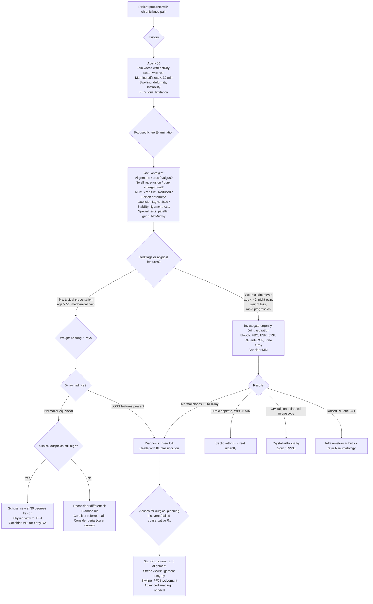

## Diagnostic Criteria, Algorithm, and Investigations for Knee Osteoarthritis

### 1. Diagnostic Criteria

There is no single "gold standard" laboratory test for OA — the diagnosis is fundamentally **clinical + radiographic**. Unlike RA (which has formal ACR/EULAR classification criteria with serological markers), OA diagnosis relies on the constellation of history, examination, and imaging findings. Let's go through the two most widely used criteria sets.

---

#### 1.1 ACR Clinical Classification Criteria for OA of the Knee (1986/1991)

The American College of Rheumatology developed these criteria specifically for classifying KOA. They exist in three formats — **clinical alone**, **clinical + radiographic**, and **clinical + laboratory**. The clinical + radiographic version is the most commonly used and the most relevant for exams.

##### Clinical + Radiographic Criteria (Sensitivity 91%, Specificity 86%)

**Knee pain** PLUS **at least 1 of the following 3:**
1. Age > 50 years
2. Morning stiffness < 30 minutes
3. Crepitus on active motion

**PLUS osteophytes on X-ray**

> The logic here is intuitive: you need knee pain (the symptom), features consistent with a degenerative rather than inflammatory process (age, brief stiffness, crepitus), and radiographic confirmation of OA (osteophytes).

##### Clinical-Only Criteria (Sensitivity 95%, Specificity 69%)

**Knee pain** PLUS **at least 3 of the following 6:**
1. Age > 50 years
2. Morning stiffness < 30 minutes
3. Crepitus on active motion
4. Bony tenderness
5. Bony enlargement
6. No palpable warmth

> The clinical-only criteria are less specific (more false positives) because you're not using imaging. They are useful in primary care settings where X-rays may not be immediately available. Note the inclusion of "no palpable warmth" — this helps exclude inflammatory or septic arthritis.

##### Clinical + Laboratory Criteria (Sensitivity 92%, Specificity 75%)

**Knee pain** PLUS **at least 5 of the following 9:**
1. Age > 50 years
2. Morning stiffness < 30 minutes
3. Crepitus on active motion
4. Bony tenderness
5. Bony enlargement
6. No palpable warmth
7. ESR < 40 mm/hr
8. RF negative
9. Synovial fluid signs of OA (clear, viscous, WBC < 2,000/mm³)

> The laboratory criteria incorporate blood tests and synovial fluid analysis primarily to **exclude** inflammatory and infective arthritis, not to positively diagnose OA. OA is a diagnosis where labs are used to rule out mimics, not to confirm the condition.

<Callout title="Key Exam Point">
OA is a **clinical + radiographic** diagnosis. There is no blood test that "confirms" OA. Labs (ESR, CRP, RF, anti-CCP, urate) are done to **exclude** inflammatory, crystal, and infective arthritis. If a question asks "What investigation confirms KOA?" — the answer is **weight-bearing X-ray showing osteophytes + joint space narrowing** in the right clinical context.
</Callout>

---

#### 1.2 EULAR Recommendations for Diagnosis of KOA (2010)

The European League Against Rheumatism provides a more practical, clinically oriented approach:

Three symptoms + three signs are considered highly predictive of KOA:

**Symptoms:**
1. Persistent knee pain
2. Limited morning stiffness ( ≤ 30 minutes)
3. Reduced function

**Signs:**
1. Crepitus
2. Restricted movement
3. Bony enlargement

> If all six are present in a patient > 40 years old, the diagnosis of KOA can be made with high confidence **without imaging**. However, in practice, imaging is almost always obtained to confirm the diagnosis, assess severity, plan treatment, and exclude other pathology.

---

#### 1.3 NICE Guidelines (2022 Update — Current Practice)

The UK National Institute for Health and Care Excellence states that OA can be diagnosed clinically **without investigations** if:
- Patient is ≥ 45 years old
- Has activity-related joint pain
- Has either no morning stiffness, or morning stiffness ≤ 30 minutes

This reflects the reality that KOA is so common in the appropriate demographic that imaging adds little diagnostic value for typical presentations. Imaging is reserved for atypical features, young patients, or when surgical planning is needed.

---

### 2. Diagnostic Algorithm

The approach to a patient with suspected KOA follows a logical sequence: **History → Examination → Investigations (if needed) → Grading → Treatment planning**.

---

### 3. Investigation Modalities

#### 3.1 Plain Radiography (X-ray) — The Cornerstone

***Workup of Knee Osteoarthritis*** [1] — X-ray is the first-line and most important imaging modality.

##### A. Standard Views

***Radiographic views for KOA*** [2]:

| View | Technique | What it Shows | Why it Matters |
|---|---|---|---|
| ***Weight-bearing AP*** | Standing, full extension, beam directed at joint line | ***Medial vs lateral compartment*** joint space narrowing | **Must be weight-bearing** — non-weight-bearing films underestimate JSN because the cartilage surfaces aren't compressed. This is the single most important view |
| **Lateral** | Supine or standing, knee in 20–30° flexion | ***Anteromedial vs posteromedial*** osteophytes, ***posterior osteophytes***, patella position (alta/baja), joint effusion (suprapatellar pouch fullness), tibial slope | Reveals pathology missed on AP — especially posterior osteophytes that can cause impingement in flexion |
| ***Skyline (Merchant) view*** | Knee flexed 30–45°, beam tangential to patella | ***Patellofemoral joint space***, patellar tilt, subluxation, trochlear dysplasia | Essential for assessing the patellofemoral compartment — anterior knee pain with normal AP/lateral films should prompt a skyline view |
| **Valgus stress view** | AP with manual valgus stress applied | ***Assess medial joint space*** under stress (opens medial compartment) | Tests MCL integrity and whether varus deformity is correctable (useful for surgical planning — unicompartmental vs total knee replacement) |
| **Varus stress view** | AP with manual varus stress applied | ***Assess lateral joint space*** under stress | Tests LCL integrity and lateral compartment cartilage |
| ***Standing scanogram of bilateral lower limbs*** | Full-length standing film from hip to ankle | ***Alignment: Tibiofemoral angle (TFA) — valgus vs varus; Mechanical axis of lower limb — pass through medial or lateral side*** | **Critical for surgical planning** — determines degree of malalignment and guides osteotomy vs arthroplasty decisions. The mechanical axis line runs from the centre of the femoral head to the centre of the ankle — if it falls medial to the knee centre, there is varus malalignment [2] |
| ***Schuss view (30° flexion PA)*** | Standing, knee flexed 30°, PA projection | Posterior femoral condyle cartilage, posterior joint space | ***More sensitive for early OA*** [2] — the posterior femoral condyles bear the most load in flexion, so early cartilage loss here is visible on this view but missed on the standard AP in full extension |

<Callout title="Why Weight-Bearing?" type="error">
This cannot be over-emphasised: **a non-weight-bearing knee X-ray can be falsely reassuring**. Under load, the thinned cartilage compresses and the true joint space narrowing becomes apparent. If you order a supine AP knee X-ray and it looks "normal," you may miss significant OA. Always specify "weight-bearing" on the request form.
</Callout>

##### B. The Four Hallmark Radiographic Features — LOSS

***The hallmarks of knee osteoarthritis*** [1]:

| Feature | Radiographic Appearance | Pathophysiological Basis |
|---|---|---|
| ***Joint space narrowing*** | Reduced distance between femoral condyle and tibial plateau on weight-bearing AP | Loss of articular cartilage (cartilage is radiolucent — as it thins, the "gap" narrows). ***Earliest*** radiographic change [2]. Typically asymmetric (medial > lateral in varus OA) |
| ***Subchondral sclerosis*** | Increased whiteness/density of bone immediately beneath the joint surface | Increased osteoblastic activity in subchondral bone responding to increased mechanical stress transmission (the "shock absorber" cartilage is gone, so bone takes the hit and remodels/thickens) |
| ***Marginal osteophytes*** | Bony spurs at the joint margins | New bone formation at the periosteum, driven by TGFβ and mechanical stress. The body attempts to increase surface area to redistribute load — a failed repair mechanism. Found at margins of femoral condyles, tibial plateaus, and patella |
| ***Subchondral cysts*** | Well-defined radiolucent areas within subchondral bone, often surrounded by a sclerotic rim | Two theories: (1) Synovial fluid intrusion — high intra-articular pressure forces fluid through microfractures in the damaged subchondral plate; (2) Focal osteonecrosis from localised ischaemia under repeated mechanical stress |

##### C. Kellgren-Lawrence (KL) Grading System

***Kellgren-Lawrence OA Classification Scale*** [1][2]:

| Grade | JSN | Osteophytes | Description |
|---|---|---|---|
| ***Grade 0*** | ***No radiographic features of OA*** | None | Normal |
| ***Grade 1*** | ***Doubtful*** | ***Possible*** | Doubtful OA |
| ***Grade 2*** | ***Possible*** | ***Definite*** | ***Mild*** — **Radiographic threshold for "definite OA"** |
| ***Grade 3*** | ***Definite*** | ***Multiple*** | ***Moderate*** — clear structural damage |
| ***Grade 4*** | ***Marked*** | ***Large*** | ***Severe*** — bone-on-bone, end-stage |

> **KL Grade 2** is the minimum grade for a radiographic diagnosis of OA. Below this, the diagnosis is "possible" but not definite. **KL Grade 4** (bone-on-bone) typically warrants discussion of joint replacement if symptoms are concordant.

<Callout title="Radiographic-Symptom Discordance">
A critical concept: **radiographic severity does NOT always correlate with symptom severity**. Up to 40% of patients with KL Grade 3–4 changes may report minimal symptoms, while some patients with only KL Grade 2 may be severely disabled. Treatment decisions must be based on the **clinical picture** (pain, function, quality of life), not the X-ray alone. You treat the **patient**, not the X-ray.
</Callout>

---

#### 3.2 Advanced Imaging

##### A. MRI (Magnetic Resonance Imaging)

***MRI*** is the most sensitive imaging modality for detecting early OA and assessing the whole joint organ [5]:

| What MRI Shows | Clinical Relevance |
|---|---|
| ***Changes in the composition of bone, cartilage, other soft tissues*** [5] | Detects disease at the ***molecular/pre-radiographic*** stage — before X-ray changes appear |
| **Cartilage defects** | Focal or diffuse cartilage thinning, fissuring, full-thickness loss — graded by modified Outerbridge classification |
| **Bone marrow oedema (BME)** / bone marrow lesions | Increased signal on fluid-sensitive sequences (STIR/T2 fat-sat) in subchondral bone. Strongly associated with **pain** in OA (one of the best MRI predictors of who has symptomatic OA). Represents microtrabecular damage, fibrosis, and osteonecrosis |
| **Meniscal pathology** | ***Degenerative meniscus tears are very common incidental findings on MRI in patients with KOA*** [7]. Meniscal extrusion, horizontal tears, complex tears. **Caution:** not all MRI-detected meniscal tears are symptomatic — ***caution should be exercised against the treatment of "incidental" meniscus lesions found on MRI in patients who have no symptoms of locking*** [7] |
| **Synovitis/effusion** | Gadolinium-enhanced MRI can show synovial thickening and hyperaemia — evidence of active inflammation. Effusion volume and signal characteristics |
| **Ligament integrity** | ACL and PCL integrity — relevant for surgical planning (unicompartmental arthroplasty requires ***functionally intact ACL*** [2]) |
| **Osteophytes** | MRI detects osteophytes earlier and more comprehensively than X-ray |
| ***Structural changes in bone, cartilage, other soft tissues*** [5] | MRI/Ultrasound can detect structural changes at the ***pre-radiographic*** stage |

**When to order MRI in KOA:**
- Suspected early OA with normal/equivocal X-rays
- Mechanical symptoms (locking, catching) — to assess for meniscal tears or loose bodies
- Pre-operative planning — assessing ligament integrity, cartilage status in each compartment
- Young patient with suspected secondary OA — to identify the underlying cause (AVN, osteochondral defect)
- Atypical features — to exclude other pathology (tumour, PVNS, stress fracture)

***Natural History of OA: Structural Changes before Symptoms*** — ***more effective to prevent disease progression by intervention at early stages*** [5]. This underpins the rationale for MRI: detecting disease earlier allows earlier intervention.

| Disease Stage | Detection | Key Feature |
|---|---|---|
| ***Molecular*** | ***MRI/Biomarkers*** | ***Changes in composition of bone, cartilage, other soft tissues*** |
| ***Pre-Radiographic*** | ***MRI/US*** | ***Structural changes in bone, cartilage, other soft tissues*** |
| ***Radiographic*** | ***X-ray*** | ***Structural changes in bone (joint failure)*** + symptoms |
| ***End-stage*** | Clinical | ***Joint death*** → ***Joint replacement*** |

##### B. Ultrasound (US)

- Non-invasive, no radiation, real-time dynamic assessment, bedside availability.
- Can detect: effusion, synovitis (power Doppler shows hyperaemia), Baker's cyst, popliteal pathology, superficial osteophytes, periarticular soft tissue pathology (bursitis, tendinopathy).
- ***MRI/US*** can detect ***structural changes in bone, cartilage, other soft tissues*** at the pre-radiographic stage [5].
- **Limitations:** Operator-dependent, cannot assess deep structures (cruciate ligaments, deep cartilage) as well as MRI.
- **Useful for:** Guiding joint aspiration/injection, assessing periarticular soft tissue causes of knee pain (pes anserine bursitis, ITB syndrome), and when MRI is contraindicated.

##### C. CT Scan

- Not routinely used for KOA diagnosis.
- **Useful for:** Complex fractures involving the tibial plateau (pre-operative planning), suspected loose bodies (CT arthrography), assessing bony anatomy when MRI is contraindicated.
- CT arthrography (CT with intra-articular contrast) can provide excellent cartilage assessment as an alternative to MRI.

---

#### 3.3 Laboratory Investigations

OA is a clinical-radiographic diagnosis — **laboratory tests are used to exclude other diagnoses**, not to confirm OA.

##### A. Blood Tests

| Test | Expected in OA | Purpose |
|---|---|---|
| **ESR** | Normal or mildly elevated ( < 40 mm/hr) | Exclude inflammatory arthritis (ESR > 40 in RA, PMR) |
| **CRP** | Normal or mildly elevated | Exclude active inflammation/infection. Note: mild CRP elevation can occur in OA with significant synovitis, but > 50 mg/L should raise concern for infection |
| **Rheumatoid Factor (RF)** | Negative | Exclude RA. **Note:** RF is not specific — can be positive in 5–10% of healthy elderly, and in other conditions (Sjögren's, HCV). Anti-CCP is more specific |
| **Anti-CCP antibodies** | Negative | More specific than RF for RA (specificity > 95%) |
| **Serum urate** | Normal | Exclude gout. **Caveat:** urate may be normal during an acute gout flare (urate is consumed in crystal formation); a normal level does NOT exclude gout |
| **FBC** | Normal | Exclude infection (leucocytosis), anaemia of chronic disease (RA) |
| **Calcium, phosphate, ALP** | Normal | Exclude metabolic bone disease, hyperparathyroidism, Paget's |
| **HLA-B27** | Not routinely tested | Only if spondyloarthropathy suspected (young patient, inflammatory back pain, enthesitis) |

> **In a typical elderly patient with classic KOA on weight-bearing X-rays, no blood tests are strictly necessary.** Blood tests are indicated when: (1) the presentation is atypical, (2) the patient is young, (3) there is suspicion of an inflammatory or crystal arthropathy, or (4) pre-operative screening before surgery.

##### B. Synovial Fluid Analysis (Arthrocentesis)

Joint aspiration is **not routinely required** for straightforward KOA but is essential when:
- Acute monoarthritis (to exclude septic arthritis or crystal arthropathy)
- Significant effusion causing pain (therapeutic aspiration)
- Diagnostic uncertainty

| Parameter | OA | Inflammatory Arthritis | Septic Arthritis | Crystal Arthropathy |
|---|---|---|---|---|
| **Appearance** | Clear, straw-coloured, viscous | Turbid, yellow | Turbid/purulent, thin | Turbid, yellow-white |
| **Viscosity** | High (normal HA) | Low | Very low | Low |
| **WBC count** | < 2,000/mm³ | 2,000–50,000/mm³ | > 50,000/mm³ (often > 100,000) | 2,000–100,000/mm³ |
| **% Neutrophils** | < 25% | > 50% | > 75% | > 50% |
| **Culture** | Negative | Negative | Positive (75%) | Negative |
| **Crystals** | None | None | None | MSU (gout): negatively birefringent, needle-shaped. CPP (pseudogout): weakly +ve birefringent, rhomboid |
| **Mucin clot** | Good (firm, ropy) | Poor (friable) | Poor | Poor |

> The **string test** (stretching the fluid between fingers) gives a quick bedside assessment of viscosity. OA fluid forms a long string ( > 5 cm) because hyaluronic acid is preserved. Inflammatory/infected fluid breaks immediately because enzymes degrade HA.

<Callout title="Septic Arthritis — Don't Miss It" type="error">
In any patient presenting with an acute hot, red, swollen knee — even one with known OA — you **must** aspirate the joint before assuming it's an "OA flare." Septic arthritis destroys cartilage within hours and can be fatal. The presence of pre-existing OA does NOT protect against septic arthritis — in fact, damaged joints are MORE susceptible to infection.
</Callout>

---

#### 3.4 Biomarkers (Emerging — Not Yet Standard of Care)

***MRI/Biomarkers*** can detect ***changes in the composition of bone, cartilage, other soft tissues*** at the ***molecular*** stage of disease [5]. Research biomarkers include:

| Category | Examples | What They Measure |
|---|---|---|
| **Cartilage degradation** | CTX-II (C-terminal crosslinked telopeptide of type II collagen), COMP (cartilage oligomeric matrix protein) | Collagen and matrix breakdown products |
| **Bone remodelling** | CTX-I, NTX-I, osteocalcin | Subchondral bone turnover |
| **Synovial inflammation** | HA (hyaluronic acid), YKL-40 | Synovitis activity |

These are **not yet used in clinical practice** but are being studied in clinical trials for early detection, prognostication, and monitoring treatment response. The concept is important: ***more effective to prevent disease progression by intervention at early stages*** [5].

---

### 4. Putting It All Together — Which Investigations, When?

| Clinical Scenario | Investigations Needed |
|---|---|
| **Typical presentation** (age > 50, mechanical pain, crepitus, bony enlargement) | Weight-bearing AP + lateral X-rays. Skyline view if anterior knee pain. Blood tests usually NOT needed |
| **Atypical features** (young age, hot/red joint, fever, morning stiffness > 60 min, rapid progression, night pain) | X-rays + bloods (ESR, CRP, RF, anti-CCP, urate, FBC) + joint aspiration (cell count, crystals, culture) |
| **Mechanical symptoms** (locking, catching, giving way) in addition to OA features | X-rays + MRI (to assess for meniscal tears, loose bodies, ligament integrity) |
| **Pre-operative planning** (considering surgery) | Weight-bearing AP + lateral + skyline + standing scanogram (alignment) + stress views (ligament integrity). Bloods for pre-op workup. Consider MRI if unicompartmental arthroplasty contemplated (need to confirm intact ACL, full-thickness lateral cartilage) [2] |
| **Suspected secondary OA in young patient** | X-rays + bloods (as above) + MRI (to identify underlying cause — AVN, osteochondral defect, inflammatory arthritis). Consider aspiration |

---

### 5. Interpreting the Key Findings — What Does Each Tell You?

| Finding | Interpretation | Clinical Implication |
|---|---|---|
| **Medial JSN on weight-bearing AP** | Medial compartment OA | May be candidate for medial UKA or HTO if young |
| **Lateral JSN on weight-bearing AP** | Lateral compartment OA (less common) | Consider valgus malalignment. Less suitable for standard HTO |
| **PFJ narrowing on skyline** | Patellofemoral OA | Explains anterior knee pain, especially on stairs. PFJ replacement rarely done in isolation |
| **Bone-on-bone (KL Grade 4)** | End-stage OA | Strong indication for TKR if symptomatic |
| **Varus mechanical axis on scanogram** | Medial overloading | Guides osteotomy planning (HTO corrects varus to slight valgus) |
| **Intact ACL on MRI** | Functional ACL | Required for unicompartmental knee arthroplasty (Oxford criteria: ***functionally intact ACL***) [2] |
| **Bone marrow oedema on MRI** | Active subchondral stress/inflammation | Strongly correlates with symptomatic OA — may explain pain in patients with minimal radiographic changes |
| **Chondrocalcinosis on X-ray** | CPPD (pseudogout) | Consider crystal arthropathy as coexisting or alternative diagnosis |
| **Normal X-ray + knee pain** | Early OA, or not OA at all | Order Schuss view (***more sensitive for early OA*** [2]). Examine the hip. Consider MRI. Consider periarticular causes |

---

<Callout title="High Yield Summary">

**Diagnostic criteria:** ACR clinical + radiographic criteria = knee pain + age > 50 / stiffness < 30 min / crepitus + osteophytes on X-ray. NICE 2022: age ≥ 45, activity-related pain, no/brief stiffness → diagnose clinically without imaging.

**First-line imaging:** Weight-bearing AP and lateral X-rays. Always weight-bearing! Add skyline for PFJ, Schuss view for early OA, standing scanogram for alignment (surgical planning).

**LOSS features:** Joint space narrowing (earliest), Osteophytes, Subchondral sclerosis, Subchondral cysts. Grade with Kellgren-Lawrence (KL 2 = definite OA, KL 4 = bone-on-bone).

**MRI role:** Early detection (pre-radiographic stage), assessing meniscal/ligament integrity, pre-operative planning (UKA needs intact ACL). Beware incidental degenerative meniscal tears — don't operate unless mechanical symptoms.

**Labs:** Not needed for typical KOA. Done to EXCLUDE mimics: ESR/CRP (inflammation), RF/anti-CCP (RA), urate (gout), joint aspirate (infection/crystals). OA synovial fluid: clear, viscous, WBC < 2,000/mm³.

**Key principle:** Treat the patient, not the X-ray — radiographic severity does not always correlate with symptoms.

</Callout>

---

<ActiveRecallQuiz
  title="Active Recall - Diagnosis and Investigations for Knee OA"
  items={[
    {
      question: "State the ACR clinical + radiographic criteria for knee OA.",
      markscheme: "Knee pain PLUS at least 1 of: age > 50, morning stiffness < 30 min, crepitus on active motion, PLUS osteophytes on X-ray. Sensitivity 91%, specificity 86%."
    },
    {
      question: "List the standard X-ray views for KOA workup, and state what each specifically assesses.",
      markscheme: "Weight-bearing AP (medial vs lateral compartment JSN), Lateral (posterior osteophytes, patella position), Skyline/Merchant (patellofemoral joint space), Standing scanogram (lower limb alignment, mechanical axis, TFA), Schuss view at 30 degrees flexion (more sensitive for early OA). Stress views for ligament integrity."
    },
    {
      question: "Why must knee X-rays be taken weight-bearing? What happens if they are not?",
      markscheme: "Weight-bearing compresses the thinned articular cartilage, revealing true joint space narrowing. Non-weight-bearing films allow cartilage surfaces to separate, underestimating JSN and potentially giving a falsely normal appearance — missing significant OA."
    },
    {
      question: "A patient with known KOA has an MRI showing a horizontal meniscal tear but no locking symptoms. Should this be treated surgically? Explain.",
      markscheme: "No. Degenerative meniscal tears are very common incidental findings on MRI in KOA patients. Symptoms may or may not be related to the tear. Caution should be exercised against treating incidental meniscal lesions in patients who have no symptoms of locking. Evidence shows arthroscopic partial meniscectomy for degenerative tears in OA is not superior to physiotherapy."
    },
    {
      question: "What are the synovial fluid characteristics in OA vs septic arthritis? Give at least 4 parameters.",
      markscheme: "OA: clear, straw-coloured, high viscosity, WBC < 2000/mm3, < 25% neutrophils, culture negative, no crystals. Septic arthritis: turbid/purulent, very low viscosity, WBC > 50,000 (often > 100,000), > 75% neutrophils, culture positive in 75%, no crystals."
    },
    {
      question: "At which Kellgren-Lawrence grade is OA considered radiographically 'definite'? What characterises each grade?",
      markscheme: "Grade 2 = definite OA (definite osteophytes, possible JSN). Grade 0 = normal. Grade 1 = doubtful (possible osteophytes, doubtful JSN). Grade 3 = moderate (definite JSN, multiple osteophytes). Grade 4 = severe (marked JSN/bone-on-bone, large osteophytes)."
    }
  ]}
/>

## References

[1] Lecture slides: GC 228. Knee Osteoarthritis_Part A (1).pdf (p2, p13, p22, p28, p32, p33)
[2] Senior notes: maxim.md (sections 7.4 OA knee, 9.1 Osteoarthritis)
[5] Lecture slides: GC 228. Knee Osteoarthritis_Part B (1).pdf (p13)
[7] Lecture slides: GC 230. Knee Sport Injuries_Part 3.pdf (p27)
