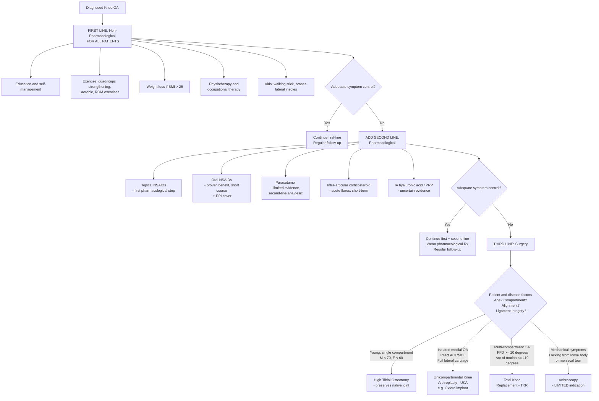

## Management of Knee Osteoarthritis

### Overview — The Treatment Pyramid

The management of KOA follows a **stepwise, evidence-based pyramid approach**. This is a core concept from the lectures and is the single most important framework for managing KOA:

***The OA Treatment Pyramid*** [1]:

| Level | Who Gets It | What It Includes |
|---|---|---|
| ***First line treatment*** | ***All*** patients | ***Education, exercise and weight control*** |
| ***First + second line treatment*** | ***Some*** patients (inadequate response to first line) | ***Pharmacological pain relief, aids and passive treatments given by a therapist*** |
| ***First + second + third line treatment*** | ***Few*** patients (failed conservative management) | ***Surgery*** |

> The pyramid is wide at the base (everyone gets non-pharmacological) and narrow at the top (few need surgery). The critical teaching point: ***the first line management of Knee Osteoarthritis*** is ***weight reduction, education and exercise*** — NOT analgesics, NOT surgery [9].

***Patients are NOT unsatisfied: high unmet medical need*** — ***81% of knee OA patients are highly unsatisfied with current treatment*** [1]. This highlights the need for better comprehensive, multidisciplinary management rather than just handing out painkillers.

***Evidence based management — multi-disciplinary chronic disease management*** [9]:
- ***Non-surgical Mx in OA (Triad)*** = Education + Exercise + Weight control [9]
- ***A paradigm shift urgently needed in aging population in HK*** [9]

---

### Management Algorithm

---

### 1. Non-Pharmacological Management (First Line — FOR ALL)

***The core non-pharmacological Mx of Knee OA*** [1]:

***Core priority treatments for OA include exercise and physical activity, weight-loss, education and support for self-management*** [9].

#### 1.1 Education and Self-Management

***Comprehensive Osteoarthritis Education*** [1]:
- ***What is OA? Risk factors, symptoms, treatment*** (Occasion 1) [1]
- ***Exercise, physical activity in daily living, coping management*** (Occasion 2) [1]
- ***OA communicator — to live with OA*** (Occasion 3) [1]

The purpose of education is to empower the patient. OA is a chronic disease — like diabetes or hypertension, the patient needs to understand and self-manage. Key messages:
- OA is NOT just "inevitable aging" — it is modifiable.
- Exercise does NOT damage the joint further — it protects it (a common patient fear).
- Weight loss has a disproportionate benefit (every 1 kg lost = ~4 kg less force on the knee).
- Self-management reduces reliance on healthcare services and improves outcomes.

***COME (Comprehensive Osteoarthritis ManagEment) programme at MMRC*** [1]:
- ***Aim: to provide comprehensive non-surgical management care for patient with osteoarthritis*** [1]
- ***Collaborators: Department O&T QMH, Nursing Department MMRC, Physiotherapy Department MMRC, Occupational Department MMRC*** [1]
- ***Results showed consecutive significant improvements over each assessment time point*** in: ***PSEQ score*** (pain self-efficacy), ***FACIT score*** (functional assessment), ***one-minute chair test repetitions***, ***right and left quadriceps strength***, ***PSFS score*** (patient-specific functional scale), and ***weekly time spent for exercise*** [1]

> This is a real HKU/QMH programme — mentioning it shows awareness of local practice.

#### 1.2 Exercise and Physiotherapy

***Strong evidence supports the use of physical therapy as a treatment to improve function and reduce pain for patients with osteoarthritis*** [10].
- ***Strength of Recommendation: Strong Evidence*** [10]

Types of exercise:
- ***Muscle strengthening*** [10] — particularly **quadriceps strengthening**. Why? The quadriceps act as dynamic "shock absorbers" for the knee. When the quads are weak, more force is transmitted directly through the articular cartilage and subchondral bone → more pain and faster progression. Strengthening the quads redistributes load away from the damaged compartment [2].
- ***Range of motion exercise*** [10] — maintains joint flexibility, prevents contractures, reduces stiffness.
- ***Cardiopulmonary function, endurance*** [10] — aerobic exercise (e.g., ***bicycle*** [2], swimming, walking) improves overall fitness, aids weight loss, reduces cardiovascular risk, and improves mood/sleep.

***Physiotherapy: quadriceps muscle strengthening to slow disease progression and improve biomechanics*** [2].

***Preoperative physical therapy*** — ***limited evidence supports the use of pre-operative physical therapy to improve early function in patients following total hip arthroplasty*** [10]. The same principle applies to TKR: "prehabilitation" (strengthening before surgery) leads to better post-operative recovery.

<Callout title="Exercise is Medicine">
Exercise is the **single most effective** non-pharmacological intervention for KOA. It has better evidence than paracetamol. The challenge is patient adherence — this is why supervised group exercise programmes (like COME) work better than simply telling patients to "go exercise."
</Callout>

#### 1.3 Weight Loss

- ***Weight reduction*** is part of the non-surgical triad [2][9].
- ***Lifestyle modifications: weight loss, regular exercise, smoking cessation*** [2].
- Target: 5–10% body weight reduction produces clinically meaningful improvement in pain and function.
- Mechanism: reduces mechanical load AND reduces systemic inflammation (adipokines, leptin, IL-6 from adipose tissue).
- Even modest weight loss (5 kg) = 20 kg less force on the knee per step = enormous cumulative benefit.

#### 1.4 Walking Aids and Orthoses

***Relief of weight-bearing: weight reduction, walking aids, muscle strengthening*** [2]:

- **Walking stick/cane:** Held in the **contralateral** hand (reduces load on the affected knee by ~25%). Why contralateral? The cane creates a counterbalancing moment arm on the opposite side, reducing the abductor moment needed and thereby reducing joint reaction force.
- ***P&O to relieve medial compartment pressure (controversial): valgus unloading brace, lateral insole*** [2]:
  - **Valgus unloading brace:** Applies a valgus (corrective) force to the knee, shifting load from the medial to lateral compartment. Useful in medial compartment OA.
  - **Lateral wedge insole:** Inserted in the shoe, tilts the foot laterally → subtly shifts the mechanical axis → theoretically reduces medial compartment loading. Evidence is mixed — some guidelines no longer recommend it, hence "controversial."

***Additional physical or psychological evidence-based adjunctive therapies*** include [9]:
- ***Cognitive behavioural therapy*** (for pain coping and catastrophising)
- ***Heat therapy***
- ***Walking aids and splints***
- ***Manual therapies***
- ***Transcutaneous electrical nerve stimulation (TENS)***

#### 1.5 Occupational Therapy

- ***OT: ADL Mx and training*** [1]
- Activity modification: avoid prolonged kneeling, squatting, heavy lifting.
- Assistive devices for ADLs: raised toilet seat, grab bars, long-handled shoe horn.
- Home modifications to reduce fall risk.

---

### 2. Pharmacological Management (Second Line — SOME)

***Pharmacological Mx of Knee Osteoarthritis*** [9]:

The key principle: **pharmacological treatment does NOT modify the disease course** — it manages symptoms. ***Not affect natural history*** [10]. All drugs are symptomatic relief only.

#### 2.1 Topical NSAIDs (First Pharmacological Step)

- **Examples:** Diclofenac gel, ketoprofen patches.
- **Mechanism:** Inhibit cyclooxygenase (COX-1 and COX-2) → reduce prostaglandin synthesis → reduce inflammation and pain locally.
- **Advantages:** Minimal systemic absorption → far fewer GI, renal, and cardiovascular side effects compared to oral NSAIDs. Effective for superficial joints like the knee (good tissue penetration).
- **Evidence:** OARSI, EULAR, and NICE all recommend topical NSAIDs as first-line pharmacological therapy for KOA, ahead of oral NSAIDs and paracetamol.
- **Indications:** Mild-moderate KOA pain, especially in patients with GI/CV risk factors.
- **Contraindications:** Skin sensitivity, open wounds over application site.

#### 2.2 Oral NSAIDs

***NSAIDs have proven benefit*** [2].

- **Mechanism:** Inhibit COX enzymes → reduce prostaglandin-mediated inflammation, pain, and effusion in the synovium and periarticular tissues.
- **Examples:** Ibuprofen, naproxen (non-selective); celecoxib, etoricoxib (COX-2 selective).
- **Evidence:** Network meta-analysis shows oral NSAIDs are the most effective oral analgesics for KOA — superior to paracetamol [9].
- **Prescribing principles:**
  - Use the **lowest effective dose for the shortest duration**.
  - Always co-prescribe a **PPI** (proton pump inhibitor) for gastroprotection.
  - Consider COX-2 selective agents in patients with high GI risk (but monitor CV risk).

| Side Effect | Mechanism | Management |
|---|---|---|
| GI (peptic ulcer, bleeding) | COX-1 inhibition → reduced gastric prostaglandin → less mucosal protection | Co-prescribe PPI; use COX-2 selective |
| Renal (AKI, fluid retention, HTN) | Prostaglandins maintain renal afferent arteriolar vasodilation; NSAID → afferent vasoconstriction → reduced GFR | Avoid in CKD (eGFR < 30); monitor renal function |
| Cardiovascular (MI, stroke) | COX-2 inhibition → reduced prostacyclin (vasodilator/anti-platelet) → prothrombotic state | Avoid in established CVD; use naproxen (lowest CV risk among non-selective NSAIDs) |

- **Contraindications:** Active peptic ulcer, severe CKD, heart failure, aspirin-sensitive asthma, pregnancy (3rd trimester), concurrent anticoagulants without PPI cover.

#### 2.3 Paracetamol (Acetaminophen)

***Does paracetamol still have a future in osteoarthritis?*** [9]:

- ***Paracetamol is widely used for analgesia in osteoarthritis — largely driven by a lack of effective or tolerated alternative treatments, and their relative safety (cf NSAID)*** [9].
- ***Network meta-analysis — paracetamol does not seem to confer any demonstrable effect or benefit in osteoarthritis, at any dose*** [9].
- ***Side effects: liver function abnormalities; elderly people with impaired paracetamol clearance*** [9].

> This is a paradigm shift. Traditionally, paracetamol was recommended as first-line oral analgesic. Current evidence (as of 2020s guidelines) shows it is **minimally effective** for OA pain. It may still have a role as an adjunct or in patients who cannot take NSAIDs, but it should NOT be relied upon as monotherapy.

- **Mechanism:** Uncertain — thought to involve central COX inhibition and descending serotonergic pathways. Unlike NSAIDs, it has NO peripheral anti-inflammatory effect — which explains its poor efficacy in OA where peripheral inflammation (synovitis) drives much of the pain.
- **Maximum dose:** 4g/day (but 2g/day in elderly/hepatic impairment).
- For hip OA, ***Paracetamol (Panadol): first line*** is still mentioned [10] — the evidence is evolving and some guidelines still list it as a first-line option, particularly for mild symptoms.

<Callout title="Paracetamol in OA — Know the Evidence" type="error">
Many guidelines are moving away from recommending paracetamol as first-line for KOA. It has minimal benefit over placebo in network meta-analyses. However, some older guidelines and exam questions may still list it as first-line. Know both positions: **current evidence says it's poorly effective; traditional teaching says it's "safe first-line."** The safest exam answer is: topical NSAIDs are the preferred first pharmacological step.
</Callout>

#### 2.4 Opioids

***Very limited role of opioids*** [9]:

- ***Opioids offer only limited benefit for chronic OA — pain and function*** [9].
- ***Potentially serious adverse effects, including drug abuse and addiction*** [9].
- ***Elderly patients are at particular risk of experiencing side effects — sedation and dizziness which predispose to falls and fractures*** [9].
- ***Surgery — pre-operative use of opioids independently predicted: opioid requirement post-surgery, associated with a prolonged hospital stay, greater risks of in-hospital complications, and early revision surgery*** [9].
- ***Updated guideline for General Practitioners (GPs) in Australia do not recommend opioids as a treatment option*** [9].

***Tramadol: non-narcotic*** [10]:
- ***Combine with paracetamol: synergistic*** [10]
- ***If contraindication to use NSAIDs*** [10]

***Opioids*** [10]:
- ***CNS depression, addiction*** [10]
- ***No routine use*** [10]

> The take-home message: **opioids should be avoided in KOA management**. They don't work well for chronic OA pain, they cause serious harms (especially in the elderly who are the main KOA population), and they worsen surgical outcomes if the patient eventually needs a TKR. If you must use them, tramadol (a weak opioid with serotonin/noradrenaline reuptake inhibition) is preferred, and only as a bridge.

#### 2.5 Intra-Articular Corticosteroid Injection

***Pain relief: analgesics, intra-articular steroid*** [2]:

- **Mechanism:** Potent local anti-inflammatory effect — suppresses synovitis, reduces effusion, inhibits inflammatory cytokines (IL-1, IL-6, TNFα) and MMP activity in the joint.
- **Agents:** Triamcinolone acetonide, methylprednisolone acetate (depot preparations for prolonged effect).
- **Indications:** Acute flares of KOA with significant effusion and synovitis; diagnostic/therapeutic aspiration followed by steroid injection; patients who cannot tolerate oral NSAIDs.
- **Efficacy:** Provides **short-term** relief (4–8 weeks typically). Does not modify disease progression. May actually accelerate cartilage loss with repeated injections.
- **Frequency:** Generally no more than 3–4 injections per joint per year. Repeated injections may accelerate cartilage degradation and increase risk of peri-procedural infection.
- **Contraindications:** Suspected septic arthritis (injecting steroid into an infected joint is catastrophic), uncontrolled diabetes (transient hyperglycaemia), concurrent anticoagulation (relative — increased bleeding risk).

#### 2.6 Intra-Articular Hyaluronic Acid (Viscosupplementation)

***Intra-articular hyaluronic acid / platelet-rich plasma (?evidence)*** [2]:

- **Mechanism:** HA is a natural component of synovial fluid. In OA, HA concentration and molecular weight are reduced → decreased viscosity and lubrication. Viscosupplementation aims to restore these properties. May also have anti-inflammatory and chondroprotective effects.
- **Evidence:** Highly controversial. Some RCTs show modest benefit; many show no superiority over saline injection. AAOS gives a "limited" recommendation. OARSI conditionally recommends it. The placebo effect of intra-articular injection is significant.
- **Indications:** Patients with mild-moderate KOA who have failed oral therapies and are not yet surgical candidates.

#### 2.7 Platelet-Rich Plasma (PRP)

***Platelet-rich plasma (?evidence)*** [2]:

- **Mechanism:** Autologous blood concentrated in platelets → rich in growth factors (PDGF, TGFβ, VEGF, IGF-1) → theoretically stimulates cartilage repair and reduces inflammation.
- **Evidence:** Emerging but inconsistent. Some studies show benefit over HA; others show no difference from placebo. Not recommended by most major guidelines as standard of care. Lack of standardised preparation protocols.
- **Current status:** Experimental/adjunctive. Not routinely funded by public healthcare in Hong Kong.

#### 2.8 Glucosamine and Chondroitin

- These are "nutraceuticals" (dietary supplements), not prescription drugs.
- **Mechanism (theoretical):** Glucosamine is a building block of glycosaminoglycans in cartilage; chondroitin sulfate is a component of aggrecan. Oral supplementation theoretically provides substrate for cartilage repair.
- **Evidence:** Large RCTs (GAIT trial) show no significant benefit over placebo for pain reduction. Some subgroup analyses suggest possible benefit in moderate-severe OA, but overall evidence is weak. OARSI recommends "uncertain" appropriateness.
- Mentioned as a common patient question — important to counsel that there is no strong evidence of benefit.

#### 2.9 Any New Drug? — The Biology of OA

***Any New Drug?*** [5] — The lecture poses this question in the context of the molecular biology of OA (ADAMTS, MMPs, inflammatory cytokines). Currently:
- **Disease-modifying OA drugs (DMOADs)** remain an unmet need. Unlike RA (which has DMARDs), there is no approved DMOAD for OA.
- Investigational agents targeting:
  - **Anti-NGF antibodies** (e.g., tanezumab) — "NGF" = nerve growth factor; blocking it reduces pain signalling. FDA concerns about rapidly progressive OA/osteonecrosis in some patients.
  - **Wnt pathway inhibitors** — Wnts drive osteophyte formation and subchondral bone remodelling.
  - **MMP inhibitors** — failed in trials due to off-target musculoskeletal toxicity.
  - **Sprifermin (FGF18)** — a recombinant fibroblast growth factor that stimulates chondrocyte proliferation and matrix synthesis. Phase II data showed dose-dependent cartilage thickness increase on MRI, but clinical symptom benefit was marginal.

---

### 3. Surgical Management (Third Line — FEW)

***Surgical Mx of Knee Osteoarthritis*** [9]:

Surgery is indicated when:
- ***Patient factor: age, functional status*** [2]
- ***Disease factor: severe impairment to ADL, pain despite conservative treatment*** [2]
- The key principle: **surgery is for patients who have FAILED adequate conservative management** (at least 3–6 months of optimised non-pharmacological + pharmacological treatment).

***Enhanced recovery after surgery (ERAS)*** protocol [11]:
- ***MSSA screening: de-colonisation x 1 week*** [11]
- ***Pre-op analgesics*** [11]
- ***Dexamethasone on call to OT (16mg IV stat)*** [11]
- ***HbA1c control: < 8*** [11]
- ***Confirm definite discharge plan: 1 month full-time carer after TKA*** [11]

#### 3.1 Arthroscopic Surgery

***Limited role of Knee Arthroscopy in OA Knee*** [9]:

- ***Limited indication*** [9]:
  - ***Frequent locking symptoms caused by meniscal tears and loose bodies*** [9]
  - ***Short term relief of locking symptoms*** [9]
- ***Potential complications*** [9]:
  - ***Adverse outcomes — DVT (0.4%), PE (0.1%), death (0.03%)*** [9]
  - ***Increases rate of progression of osteoarthritis*** [9]
  - ***Shortens time to joint replacement*** [9]

> This is **extremely high yield**. Multiple landmark RCTs (Moseley 2002, Kirkley 2008) have shown that arthroscopic lavage and debridement for KOA is **no better than sham surgery**. Arthroscopy does NOT treat OA — it can only address specific mechanical problems (loose bodies, displaced meniscal tears). If you do arthroscopy on an OA knee without a clear mechanical indication, you may actually make things **worse** by accelerating cartilage loss.

<Callout title="Arthroscopy in OA Knee — Must Know" type="error">
**Arthroscopic debridement/lavage for KOA is NOT recommended.** The only indication for arthroscopy in KOA is **frequent locking symptoms** from a displaced meniscal tear or loose body. Even then, it provides only short-term relief and may accelerate OA progression. This is a common exam topic — students often incorrectly list "arthroscopic debridement" as a treatment for OA.
</Callout>

#### 3.2 High Tibial Osteotomy (HTO)

***High tibial osteotomy: if young (M < 70, F < 60)*** [2]:

- **Concept:** "Osteotomy" = "osteo" (bone) + "tomy" (cutting). You deliberately cut the tibia and realign it to shift the mechanical axis of the limb.
- **Goal:** In medial compartment OA with varus malalignment, a **medial opening-wedge** or **lateral closing-wedge** HTO corrects the varus to slight valgus → shifts the weight-bearing line from the damaged medial compartment to the healthier lateral compartment.
- **Who is it for?** ***Young (< 60y) with preservation of articular cartilage, pre-requisite: single compartment*** [2].
  - Ideal candidate: Active patient, age < 60, medial compartment OA, correctable varus deformity, good lateral and PFJ cartilage, intact ligaments, BMI < 30.
- **Advantage:** **Preserves the native joint** — delays or avoids the need for joint replacement. Important in young patients because TKR prostheses have a finite lifespan (15–25 years), and revision TKR is more complex.
- **Contraindications:** ***Severe articular damage, ligament laxity, severe varus deformities*** [2]. Also: lateral compartment OA, inflammatory arthritis, significant PFJ disease, flexion contracture > 15°, flexion < 90°.

***Osteotomy: correct deformity and relieve joint pressure*** [2].

| Feature | Details |
|---|---|
| **Indication** | Young patient, isolated medial compartment OA, correctable varus, intact lateral cartilage |
| **Contraindication** | Severe articular damage, ligament laxity, severe varus, multicompartment disease |
| **Procedure** | Medial opening-wedge or lateral closing-wedge tibial osteotomy |
| **Goal** | Shift mechanical axis to slight valgus (Fujisawa point: 62% of tibial width from medial edge) |
| **Outcome** | Delays TKR by 10–15 years if successful |

#### 3.3 Unicompartmental Knee Arthroplasty (UKA)

***Unicompartmental knee arthroplasty (UKA): e.g. Oxford implant*** [2]:

"Uni" = one, "compartmental" = compartment, "arthroplasty" = "arthro" (joint) + "plasty" (moulding/reshaping). You replace only ONE compartment of the knee, preserving the other compartments and cruciate ligaments.

**Oxford Partial Knee Replacement Selection Criteria** [2]:
1. ***Medial bone-on-bone*** (end-stage medial compartment OA)
2. ***Functionally intact ACL***
3. ***Functionally intact MCL***
4. ***Full thickness lateral cartilage***
5. ***Acceptable patellofemoral joint***

> These criteria are **essential to memorise**. The logic: UKA only replaces the medial compartment, so the rest of the knee must be healthy. If the ACL is deficient → abnormal kinematics → rapid failure of the UKA. If the lateral compartment has cartilage loss → they'll need a TKR, not a UKA. If the PFJ is severely involved → persistent anterior knee pain after UKA.

| Feature | Details |
|---|---|
| **Indication** | Isolated medial compartment bone-on-bone OA meeting all 5 Oxford criteria |
| **Advantages** | Smaller incision, preserves bone stock, preserves cruciate ligaments → more natural kinematics, faster recovery, better ROM than TKR |
| **Disadvantages** | ***Higher revision rate compared to TKR*** [2] (~1% per year vs ~0.5% for TKR). Revision to TKR is relatively straightforward |
| **Contraindication** | ACL deficiency, MCL incompetence, lateral compartment/PFJ disease, inflammatory arthritis, fixed varus > 15°, flexion contracture > 15° |

#### 3.4 Total Knee Replacement (TKR)

***Total knee replacement (TKR)*** [2]:

This is the definitive surgical treatment for end-stage KOA. Both tibiofemoral condyles and often the patella are resurfaced with metal and polyethylene components.

***TKR is preferred in*** [2]:
- ***Posteromedial OA*** (anteromedial OA may be suitable for UKA, but posteromedial OA is not — the posterior cartilage loss pattern requires total replacement)
- ***Lateral OA*** (lateral UKA is technically more difficult and has higher failure rates)
- ***PFJ OA*** (significant patellofemoral involvement rules out UKA)
- ***Significant fixed flexion contracture (≥ 10°)*** (UKA cannot correct significant fixed deformity)
- ***Arc of motion ≤ 110°*** (limited pre-operative ROM suggests more diffuse joint disease)

| Feature | Details |
|---|---|
| **Indication** | End-stage multicompartment OA, failed conservative management, severe pain/disability. Preferred over UKA when criteria for UKA are not met |
| **Procedure** | Resurfacing of femoral condyles (metal), tibial plateau (metal baseplate + polyethylene insert), and ± patellar button (polyethylene) |
| **Prosthesis types** | **Cruciate-retaining (CR)**: preserves PCL → more natural rollback. **Posterior-stabilised (PS)**: PCL sacrificed, replaced by cam-post mechanism → more reliable kinematics when PCL is damaged |
| **Fixation** | Cemented (most common, immediate fixation) vs uncemented/hybrid (biological fixation, better for younger patients with good bone stock) |
| **Expected outcomes** | 90–95% survival at 15 years. Functional improvement in 85–90% of patients. Expected ROM: 0–120° |
| **Contraindications** | Active infection (absolute), severe peripheral vascular disease, neuropathic joint (Charcot), extensor mechanism deficiency, severe medical comorbidities making anaesthesia unsafe |

#### 3.5 Comparing Surgical Options

| | HTO | UKA | TKR |
|---|---|---|---|
| **Ideal patient** | Young ( < 60), active, medial OA, correctable varus | Any age, isolated medial bone-on-bone, intact ACL/MCL/lateral | Older, multicompartment, failed conservative |
| **Preserves native joint?** | Yes (completely) | Partially (other compartments preserved) | No (all surfaces replaced) |
| **Recovery** | 6–12 weeks partial WB | Fastest — early WB, < 6 weeks | 6–12 weeks, intensive rehab |
| **Longevity** | Delays TKR 10–15 years | ~15–20 year survival | ~15–25 year survival |
| **Revision** | Conversion to TKR if fails | Straightforward conversion to TKR | Revision TKR (complex) |
| **Key contraindication** | Severe articular damage, multicompartment | ACL deficient, lateral/PFJ disease | Active infection |

#### 3.6 Other Surgical Options

- ***Arthrodesis for small joints (e.g., MCP)*** [2] — joint fusion. Eliminates pain by eliminating movement. NOT done for the knee (would eliminate walking ability). Reserved for small joints or salvage situations.
- ***Arthroscopic debridement e.g., remove osteophytes*** [2] — as discussed, limited role in KOA. Only for mechanical symptoms.

---

### 4. Summary Pharmacological Comparison Table

| Agent | Efficacy in KOA | Key Risks | Role |
|---|---|---|---|
| **Topical NSAIDs** | Moderate | Local skin irritation, minimal systemic | First-line pharmacological |
| **Oral NSAIDs** | ***Proven benefit*** [2] | GI bleeding, renal impairment, CV events | Second-line; short courses + PPI |
| **Paracetamol** | ***Does not confer any demonstrable effect or benefit*** [9] | Hepatotoxicity in elderly | Adjunctive only; limited role |
| **Tramadol** | Modest | Nausea, dizziness, seizures, serotonin syndrome | Bridge when NSAIDs contraindicated |
| **Opioids** | ***Limited benefit*** [9] | ***Abuse, addiction, falls, fractures; worse surgical outcomes*** [9] | ***Not recommended*** |
| **IA Corticosteroid** | Good short-term | Infection risk, cartilage damage with repeated use, hyperglycaemia | Acute flares, diagnostic |
| **IA Hyaluronic acid** | ***?evidence*** [2] | Pseudosepsis (local reaction), cost | Uncertain; not standard |
| **PRP** | ***?evidence*** [2] | Minimal | Experimental |
| **Glucosamine** | No significant benefit | Minimal | Not recommended |

---

### 5. Multidisciplinary and Chronic Disease Model

***Multi-disciplinary chronic disease management*** [9]:

The optimal management of KOA requires coordination between:
- **Orthopaedic surgeon** — surgical planning, injection therapy
- **Physiotherapist** — exercise prescription, supervised programmes
- **Occupational therapist** — ADL adaptation, assistive devices
- **Nurse specialist** — education, self-management support
- **Dietitian** — weight management programme
- **Pain specialist** — for refractory pain
- **Psychologist** — cognitive behavioural therapy for pain catastrophising, depression
- **General practitioner** — long-term follow-up, medication management

This mirrors the ***COME programme*** model at QMH [1].

---

<Callout title="High Yield Summary">

**Treatment pyramid:** (1) ALL patients → Education, Exercise, Weight loss (the TRIAD). (2) SOME patients → Pharmacological (topical NSAIDs first, then oral NSAIDs with PPI; paracetamol has limited benefit; opioids NOT recommended; IA steroid for flares). (3) FEW patients → Surgery.

**First-line management is NOT analgesics — it is weight reduction, education and exercise.**

**Paracetamol:** Network meta-analysis shows no demonstrable benefit in OA at any dose. Paradigm shift from traditional teaching.

**Opioids:** Very limited role. Worsen surgical outcomes, cause falls/fractures in elderly, addiction risk. Not recommended by updated guidelines.

**Arthroscopy in OA:** Limited indication ONLY for frequent locking from meniscal tears/loose bodies. Increases rate of OA progression. Shortens time to joint replacement. NOT for debridement/lavage.

**Surgical options:** HTO (young, single compartment, correctable deformity), UKA (Oxford criteria: medial bone-on-bone + intact ACL + intact MCL + full lateral cartilage + acceptable PFJ), TKR (multicompartment, FFD ≥ 10°, arc ≤ 110°, failed conservative).

**Oxford UKA 5 criteria:** (1) Medial bone-on-bone, (2) Functionally intact ACL, (3) Functionally intact MCL, (4) Full thickness lateral cartilage, (5) Acceptable PFJ.

**ERAS protocol:** MSSA screening + decolonisation, pre-op analgesics, dexamethasone IV, HbA1c < 8, confirmed discharge plan.

</Callout>

---

<ActiveRecallQuiz
  title="Active Recall - Management of Knee OA"
  items={[
    {
      question: "What is the first-line management of KOA? What does the treatment pyramid consist of?",
      markscheme: "First-line for ALL patients: Education, Exercise, and Weight control (the non-surgical triad). Pyramid: Base (all) = education, exercise, weight loss. Middle (some) = pharmacological pain relief, aids, passive therapies. Top (few) = surgery. First-line is NOT analgesics."
    },
    {
      question: "What does current evidence say about paracetamol in KOA? Cite the key finding.",
      markscheme: "Network meta-analysis shows paracetamol does not seem to confer any demonstrable effect or benefit in osteoarthritis at any dose. Side effects include liver function abnormalities, especially in elderly with impaired clearance. Its use was largely driven by lack of alternatives and perceived safety compared to NSAIDs."
    },
    {
      question: "List the 5 Oxford criteria for unicompartmental knee arthroplasty selection.",
      markscheme: "(1) Medial bone-on-bone, (2) Functionally intact ACL, (3) Functionally intact MCL, (4) Full thickness lateral cartilage, (5) Acceptable patellofemoral joint."
    },
    {
      question: "Why is arthroscopic debridement NOT recommended for KOA? What is the only accepted indication for knee arthroscopy in OA?",
      markscheme: "RCTs show arthroscopic lavage/debridement is no better than sham surgery for OA. It increases rate of OA progression and shortens time to joint replacement. Complications include DVT, PE, death. The ONLY indication is frequent locking symptoms caused by meniscal tears or loose bodies, and even then it provides only short-term relief."
    },
    {
      question: "Compare HTO, UKA, and TKR: who is each for, and what is the key contraindication for each?",
      markscheme: "HTO: young patient (M < 70, F < 60), single compartment medial OA, correctable varus; contraindicated if severe articular damage, ligament laxity, severe varus. UKA: isolated medial bone-on-bone meeting Oxford criteria; contraindicated if ACL deficient, lateral/PFJ disease. TKR: multicompartment OA, FFD >= 10 degrees, arc <= 110 degrees; contraindicated if active infection."
    },
    {
      question: "Why are opioids discouraged in KOA management? Give at least 4 reasons from the lecture.",
      markscheme: "Limited benefit for chronic OA pain and function. Serious adverse effects: drug abuse and addiction. Elderly at particular risk: sedation and dizziness predispose to falls and fractures. Pre-operative opioid use independently predicts greater opioid requirement post-surgery, prolonged hospital stay, greater in-hospital complications, and early revision surgery."
    }
  ]}
/>

## References

[1] Lecture slides: GC 228. Knee Osteoarthritis_Part A (1).pdf (p2, p11, p34, p35, p36, p42, p43)
[2] Senior notes: maxim.md (sections 7.4 OA knee, 9.1 Osteoarthritis)
[5] Lecture slides: GC 228. Knee Osteoarthritis_Part B (1).pdf (p12)
[9] Lecture slides: GC 228. Knee Osteoarthritis_Part B (1).pdf (p2, p8, p10, p13, p15, p18, p19, p28, p29, p30, p31)
[10] Lecture slides: GC 229. Hip Arthritis (1).pdf (p34, p37, p38, p39)
[11] Senior notes: maxim.md (section 1.3 Management overview — ERAS)
