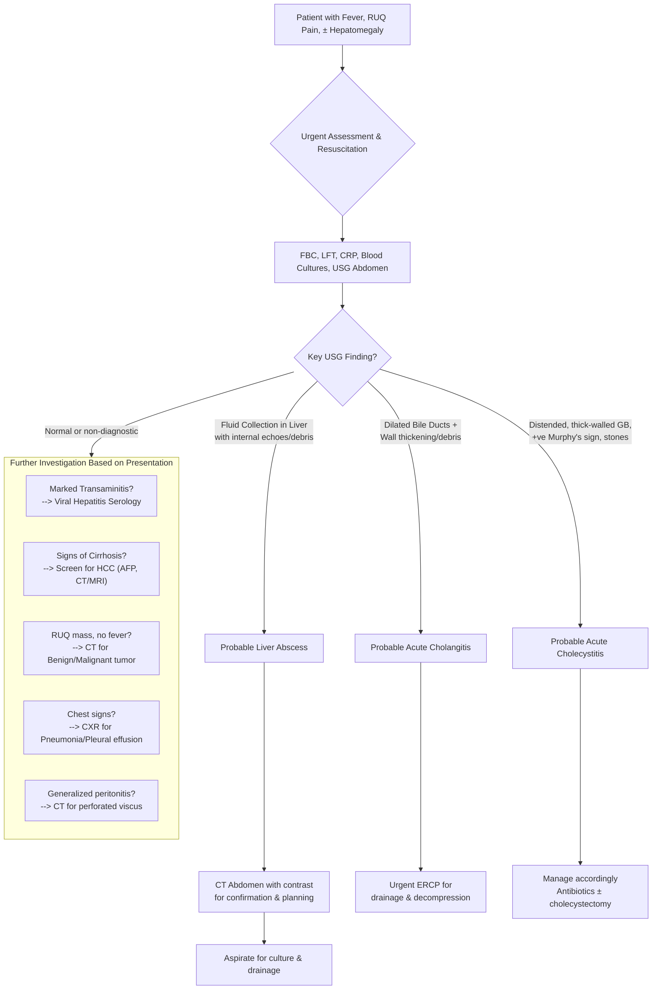

## Differential Diagnosis
When a patient presents with the classic triad of fever, right upper quadrant (RUQ) pain, and hepatomegaly, a liver abscess is high on the list. However, a systematic clinician must consider a broad range of conditions that can mimic this presentation. The differential diagnosis can be organized by the dominant clinical feature and the underlying organ system involved. The goal is not just to list, but to understand *why* each condition can look like a liver abscess.

### 1. Hepatobiliary Infections (The "Look-Alikes" in the Neighbourhood)
These conditions share the anatomical space and inflammatory pathophysiology, making them the most common and challenging differentials.

- ***Acute Cholangitis:*** ***This is the most important and common differential.*** It presents with **Charcot's triad (fever, RUQ pain, jaundice)** [1, 2]. *Why does it mimic a liver abscess?* Both are caused by biliary obstruction (e.g., stones, stricture) leading to bacterial infection. The key difference lies in the site: cholangitis is an infection of the **bile ducts**, while an abscess is a collection within the **liver parenchyma**. However, severe cholangitis can lead to multiple micro-abscesses (a condition known as "ascending suppurative cholangitis"). Imaging is crucial: cholangitis shows dilated, inflamed bile ducts, while an abscess shows a discrete parenchymal fluid collection [1, 2].
- ***Acute Cholecystitis:*** Inflammation of the gallbladder, often due to cystic duct obstruction by a stone. Presents with **fever and constant RUQ pain** (Murphy's sign positive). *Why does it mimic a liver abscess?* The inflamed gallbladder is tender and can be palpable, mimicking hepatomegaly. Fever and leukocytosis are common. Furthermore, complications of cholecystitis like **empyema (pus in the gallbladder)** or **perforation leading to a pericholecystic or intrahepatic abscess** can directly cause a liver abscess [3]. Ultrasound differentiates by showing a thick-walled, distended gallbladder with stones.
- ***Recurrent Pyogenic Cholangitis (RPC / "Hong Kong Disease"):*** A condition endemic to Southeast Asia characterized by intrahepatic pigment stones, biliary strictures, and recurrent cholangitis [1, 3]. *Why does it mimic a liver abscess?* Patients present with recurrent episodes of **Charcot's triad**. The chronic biliary obstruction and stasis are a *direct cause* of liver abscesses. Therefore, a liver abscess may be a *complication* of RPC. Imaging (USG, CT, MRCP) shows the hallmark features: **intrahepatic ductal dilatation with focal strictures and stones**, often with associated abscesses [1, 2].

### 2. Non-Infectious Hepatobiliary & Liver Conditions
These conditions present with hepatomegaly and sometimes pain or systemic symptoms, but typically lack the high, spiking fever of an abscess.

- ***Hepatocellular Carcinoma (HCC):*** Can present with **RUQ pain, weight loss, and a palpable liver mass**. *Why does it mimic a liver abscess?* Large or necrotic HCC tumours can become secondarily infected, presenting with fever. On imaging, a necrotic tumour with central fluid density can look like an abscess. However, HCC often occurs on a background of cirrhosis, shows arterial enhancement on CT/MRI, and has elevated AFP [4].
- ***Metastatic Liver Disease:*** Multiple liver metastases can cause hepatomegaly and dull RUQ pain. *Why does it mimic a liver abscess?* Necrotic metastases (e.g., from colorectal cancer) can appear as hypodense lesions on CT. If they become infected (which is rare), they can be indistinguishable. The key is to look for a known primary malignancy and the typical "target" or "bull's-eye" appearance of metastases. Fever is usually absent unless the tumour is superinfected.
- ***Benign Liver Tumours (e.g., Hemangioma, Adenoma, Focal Nodular Hyperplasia):*** Usually asymptomatic but can cause pain if they bleed or are large. *Why does it mimic a liver abscess?* A large mass can cause hepatomegaly and discomfort. They are typically afebrile. Imaging characteristics (e.g., hemangioma with peripheral nodular enhancement on CT) are diagnostic [4].
- ***Simple Hepatic Cysts / Polycystic Liver Disease:*** Can cause massive hepatomegaly and discomfort. *Why does it mimic a liver abscess?* They appear as fluid-filled structures on ultrasound. The key differentiator is the absence of systemic signs of infection (fever, leukocytosis) and the classic imaging appearance: **thin-walled, anechoic cysts with posterior acoustic enhancement** [4].
- ***Alcoholic or Non-Alcoholic Steatohepatitis (ASH/NASH):*** Can cause tender hepatomegaly due to inflammation. *Why does it mimic a liver abscess?* May present with RUQ discomfort and mild fever in severe alcoholic hepatitis. However, the fever is usually low-grade, and the history of heavy alcohol use or metabolic syndrome is key. LFTs show a predominant transaminitis, not a cholestatic pattern.
- ***Budd-Chiari Syndrome (Hepatic Venous Outflow Obstruction):*** Presents with **acute onset of painful hepatomegaly, ascites, and possibly mild fever** from liver congestion and necrosis. *Why does it mimic a liver abscess?* The pain and liver enlargement are similar. However, the ascites is prominent and often refractory. Fever is not a primary feature. Doppler ultrasound shows **absent or reversed flow in the hepatic veins**.

### 3. Other Intra-Abdominal Inflammatory Conditions
These cause peritonitis or localized inflammation that can refer pain to the RUQ or cause secondary hepatic irritation.

- ***Acute Appendicitis:*** Classically starts with periumbilical pain migrating to the RLQ. *Why does it mimic a liver abscess?* A retrocecal appendix can cause **RUQ pain** and fever. More importantly, a perforated appendix can lead to **pylephlebitis** (septic thrombophlebitis of the portal vein), which is a direct cause of **portal pyemia and multiple liver abscesses** [1, 2].
- ***Acute Pancreatitis:*** Presents with severe epigastric pain radiating to the back. *Why does it mimic a liver abscess?* Severe pancreatitis can cause an inflammatory mass that extends to the liver, and secondary infection of pancreatic necrosis can cause sepsis. Gallstone pancreatitis shares a common etiology (choledocholithiasis) with liver abscess.
- ***Acute Diverticulitis:*** Typically causes left lower quadrant pain. *Why does it mimic a liver abscess?* **Right-sided diverticulitis is more common in Asian populations** and can present with RLQ/RUQ pain, fever, and leukocytosis. Furthermore, complicated diverticulitis can also lead to portal pyemia and liver abscess [2].
- ***Peritonitis (Primary or Secondary):*** Presents with diffuse abdominal pain, rigidity, fever, and systemic sepsis. *Why does it mimic a liver abscess?* A liver abscess rupturing into the peritoneum causes secondary peritonitis. Conversely, peritonitis from another source can be confused if the pain is predominantly upper abdominal. The diffuse nature of peritonitis on exam is a key differentiator.

### 4. Thoracic Conditions
Pathology in the right lower chest can irritate the diaphragm, causing referred RUQ pain.

- ***Right Lower Lobe Pneumonia / Pleurisy:*** Causes fever, cough, and pleuritic chest pain. *Why does it mimic a liver abscess?* Inflammation of the diaphragmatic pleura refers pain to the **right shoulder tip and upper abdomen**, mimicking liver capsule stretch. A CXR is essential to rule this out [2].
- ***Right Pleural Effusion / Empyema:*** A large pleural effusion can cause dullness at the right lung base and may be a **sympathetic reaction to a subphrenic or liver abscess**. Conversely, a liver abscess can rupture into the pleural space, causing an empyema. Imaging (CXR, USG) clarifies the location.

### 5. Systemic Infections with Hepatic Involvement
- ***Viral Hepatitis (Acute):*** Causes malaise, anorexia, jaundice, and tender hepatomegaly. *Why does it mimic a liver abscess?* May present with fever in the prodromal phase. The key difference is the **transaminitis (very high AST/ALT)** and the absence of a discrete fluid collection on imaging.
- ***Milary Tuberculosis / Hepatic TB:*** Can cause fever, weight loss, and hepatomegaly. Hepatic TB can form a **"cold" tuberculous abscess**. It is considered in immunocompromised patients or those from endemic areas. The fever is often chronic and low-grade.
- ***Visceral Leishmaniasis (Kala-azar):*** Causes **massive hepatosplenomegaly, fever, and pancytopenia**. It is a consideration in travelers from endemic regions (e.g., Mediterranean, South Asia).

The following flowchart summarizes the clinical and imaging-based approach to narrowing the differential diagnosis in a patient presenting with suspected liver abscess:

<Callout title="High-Yield Exam Strategy" type="idea">
When faced with a "liver abscess" question, always ask yourself: **"Could this be cholangitis?"** and **"What is the underlying cause?"** (Biliary stones? RPC? Colorectal cancer?). The examiners love to test the association between *Klebsiella pneumoniae* liver abscess and occult colorectal carcinoma, especially in Asian patients without obvious biliary disease.
</Callout>

<ActiveRecallQuiz
    title="Active Recall - Differential Diagnosis"
    items={[
        {
            question: "A 60-year-old diabetic man presents with fever, RUQ pain, and jaundice. Ultrasound shows a 4cm hypoechoic lesion in the right liver lobe and a dilated common bile duct with an echogenic shadow. What are the two most likely competing diagnoses, and what is the next best imaging test to differentiate them?",
            markscheme: "The two main differentials are Pyogenic Liver Abscess and Acute Cholangitis (with possible associated abscess). The next best test is a CT abdomen with contrast, which can better characterize the liver lesion (rim-enhancing abscess vs. ductal inflammation) and define biliary anatomy. An MRCP could also be considered to delineate the biliary obstruction.",
        },
        {
            question: "Why can a retrocecal acute appendicitis be mistaken for a liver abscess, and what is the pathophysiological link between the two conditions?",
            markscheme: "A retrocecal appendix lies in close proximity to the liver and can cause localized RUQ pain and tenderness, mimicking liver abscess pain. The pathophysiological link is that a perforated appendix can lead to pylephlebitis (septic thrombophlebitis of the portal vein), causing septic emboli to lodge in the liver and form one or multiple pyogenic liver abscesses (portal pyemia).",
        },
        {
            question: "A patient with known ulcerative colitis presents with fever and RUQ pain. Ultrasound shows multiple intrahepatic biliary strictures and dilatations but no discrete abscess. What is the most likely diagnosis, and how does it relate to the differential of liver abscess?",
            markscheme: "The most likely diagnosis is Primary Sclerosing Cholangitis (PSC) with an episode of acute cholangitis. PSC is a strong risk factor for both recurrent cholangitis and the development of cholangiocarcinoma. It is a differential for liver abscess because it causes similar symptoms (fever, RUQ pain, jaundice) due to biliary infection and obstruction. Patients with PSC are also at risk for developing liver abscesses as a complication.",
        },
        {
            question: "List three key features on imaging (USG/CT) that help differentiate a simple hepatic cyst from a pyogenic liver abscess.",
            markscheme: "1. Wall: Cyst has a thin, imperceptible wall; Abscess has a thick, irregular, enhancing wall (pyogenic membrane). 2. Internal Contents: Cyst is anechoic/water density with no internal echoes/debris; Abscess contains low-level echoes/heterogeneous fluid/debris (pus). 3. Surroundings: Cyst has no peri-lesional edema; Abscess often has surrounding inflammatory stranding and edema.",
        },
    ]}
/>

## References
[1] Senior notes: felixlai.md  
[2] Senior notes: maxim.md  
[3] Lecture slides: GC 200. RUQ pain, jaundice and fever Cholecystitis and cholangitis Imaging of GI system.pdf  
[4] Lecture slides: WCS 064 - A large liver - by Prof R Poon [20191108].doc.pdf
