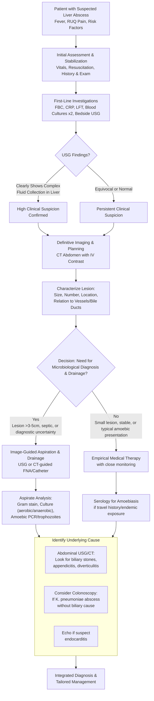

## Diagnostic Criteria
There is no single universally accepted "score" for liver abscess like the Tokyo Guidelines for cholangitis. Instead, diagnosis is based on a combination of clinical suspicion, laboratory evidence of infection/inflammation, and definitive radiological findings. Think of it as building a case.

**Clinical Suspicion (The "Why" to Investigate):**
The diagnosis should be suspected in any patient presenting with:
1.  **Fever (especially spiking) with chills/rigors** – The hallmark of systemic infection.
2.  **Right upper quadrant (RUQ) or epigastric pain** – Due to capsular stretch.
3.  **Hepatomegaly and/or RUQ tenderness** on examination.
4.  **Risk factors** such as diabetes mellitus, known hepatobiliary disease (stones, cancer, RPC), recent abdominal infection, or travel to an amoebic-endemic area.

**Definitive Diagnosis:**
The diagnosis is confirmed when the clinical picture is supported by:
1.  **Radiological Evidence:** Imaging (USG or CT) demonstrating a **focal, fluid-containing lesion within the liver parenchyma** with features consistent with an abscess (e.g., thick, irregular wall, internal debris, peripheral enhancement).
2.  **Microbiological or Pathological Evidence:** (Supportive, not always mandatory for diagnosis) Positive blood cultures, or aspiration of pus from the lesion yielding bacteria or amoebic trophozoites.

<Callout title="Key Concept">
Unlike acute cholangitis, there is no formal diagnostic criterion set for liver abscess. Diagnosis relies on synthesizing clinical context (fever + RUQ pain), laboratory inflammation, and a confirmatory imaging finding of a complex cystic liver lesion. The imaging finding is non-specific; the clinical context is what points towards an abscess over a cyst or tumour.
</Callout>

## Diagnostic Algorithm
The approach is sequential: stabilize the patient, confirm the presence and nature of the lesion, identify the cause, and guide therapy. The following algorithm outlines this pathway.

## Investigation Modalities & Key Findings
The workup serves four main purposes: (1) Confirm the presence of an abscess, (2) Guide drainage, (3) Identify the causative organism, and (4) Find the underlying source.

### I. Laboratory Investigations
These tests confirm the presence of infection/inflammation and assess organ function.

1.  **Full Blood Count (FBC) with Differential:**
    *   **Findings:** ***Leukocytosis with neutrophil predominance*** (left shift) is almost universal [1, 2]. *Why?* Bacterial infection triggers bone marrow release and recruitment of neutrophils to the site. There may be a **normochromic, normocytic anemia** of chronic disease due to cytokine-mediated suppression of erythropoiesis and reduced red cell lifespan.
    *   **Interpretation:** A very high WBC (>20 x 10⁹/L) suggests severe infection or abscess rupture. Absence of leukocytosis is rare but can occur in immunocompromised or elderly patients.

2.  **Inflammatory Markers:**
    *   **C-reactive Protein (CRP) and Erythrocyte Sedimentation Rate (ESR):** ***Markedly elevated*** [1]. CRP is produced by the liver in response to IL-6, a key inflammatory cytokine. It is very sensitive for bacterial infection and is excellent for **monitoring response to therapy**; a falling CRP indicates effective treatment.

3.  **Liver Function Tests (LFTs):**
    *   **Findings:** The pattern is typically **mixed or cholestatic**.
        *   ***Alkaline Phosphatase (ALP) and Gamma-Glutamyl Transferase (GGT) are often disproportionately elevated*** [1, 2]. *Why?* Space-occupying lesions or associated biliary inflammation/obstruction cause intrahepatic cholestasis, inducing the synthesis of these enzymes.
        *   Bilirubin may be normal or mildly elevated. Significant jaundice suggests concomitant **biliary obstruction** (e.g., from stones, stricture) or severe sepsis.
        *   Transaminases (AST, ALT) are variably elevated due to peri-abscess inflammation.
        *   ***Hypoalbuminemia*** is common [1] due to the hepatic acute-phase response (albumin synthesis is downregulated in favour of CRP) and the catabolic state of chronic infection.

4.  **Renal Function and Electrolytes:** Important for assessing sepsis-related organ dysfunction and guiding fluid resuscitation.

5.  **Blood Cultures:**
    *   ***Essential and positive in up to 50% of cases*** [1]. *Why?* Bacteria intermittently spill from the abscess into the bloodstream. Always obtain **at least two sets** from different sites before starting antibiotics.
    *   **Interpretation:** A positive blood culture, especially with *Klebsiella pneumoniae* or *Streptococcus anginosus*, strongly supports the diagnosis and guides targeted antibiotic therapy.

6.  **Amoebic Serology:**
    *   **Indication:** For patients with travel to or residence in endemic areas.
    *   **Test:** Detection of serum ***anti-Entamoeba histolytica antibodies*** (IgG) via ELISA or IHA [1]. IgM appears early but IgG persists for years.
    *   **Interpretation:** A positive serology supports a diagnosis of amoebic liver abscess but does not distinguish between current and past infection. In an endemic setting with a compatible clinical/imaging picture, it is considered diagnostic.

### II. Imaging Investigations
Imaging is the cornerstone of diagnosis, providing confirmation, anatomical detail, and a roadmap for intervention.

1.  **Chest X-Ray (CXR):**
    *   **Findings:** May show ***elevation of the right hemidiaphragm, right basilar atelectasis, or a right pleural effusion*** [1, 2]. *Why?* An abscess in the superior right liver lobe causes inflammation and irritation of the overlying diaphragm, leading to splinting and effusion.
    *   **Role:** Primarily a baseline test and to rule out thoracic causes of pain (e.g., pneumonia).

2.  ***Ultrasound (USG) Abdomen:***
    *   ***This is the initial diagnostic modality of choice*** [1, 2]. It's readily available, non-invasive, inexpensive, and has no radiation.
    *   **Key Findings:**
        *   **Appearance:** A liver abscess appears as a **hypoechoic (dark) mass** within the liver parenchyma.
        *   **Internal Characteristics:** It may contain **internal echoes** (due to debris/pus) and show **posterior acoustic enhancement** (brightening behind the lesion, a feature of fluid-filled structures).
        *   **Walls:** May have a **thick, irregular wall** and sometimes **internal septations**.
        *   ***"Cluster Sign":*** A characteristic finding where multiple small abscesses coalesce into a larger multiloculated mass [2].
    *   **Advantages:** Excellent for initial detection, guiding percutaneous aspiration/drainage in real-time, and assessing the gallbladder and bile ducts for an underlying cause (e.g., stones, ductal dilatation).
    *   **Limitations:** Operator-dependent, can be limited by body habitus or overlying bowel gas. Cannot reliably distinguish pyogenic from amoebic abscess.

3.  ***CT Abdomen with Intravenous Contrast:***
    *   ***The definitive imaging study for diagnosis and pre-procedural planning*** [1, 2]. It provides exquisite anatomical detail of the entire abdomen.
    *   **Key Findings (on contrast-enhanced CT):**
        *   ***"Double-Target" or "Rim Enhancement" Sign:*** The abscess appears as a **hypodense (dark) fluid collection** with a **thick, enhancing rim** (the pyogenic membrane) after contrast administration [2]. The surrounding liver parenchyma may show **edema** (perilesional hypodensity).
        *   ***"Cluster Sign":*** Can also be seen on CT as a collection of small, low-attenuation lesions grouped together.
        *   **Gas within the lesion:** A specific but uncommon sign indicating gas-forming organisms (e.g., *E. coli*, anaerobes).
    *   **Advantages:** Definitively confirms the abscess, accurately measures size/number/location, evaluates for complications (rupture, extension), and identifies underlying abdominal pathology (appendicitis, diverticulitis, malignancy). **It cannot reliably differentiate pyogenic from amoebic abscess** based on morphology alone [1].
    *   **Protocol:** A **triphasic liver protocol CT** (non-contrast, arterial, portal venous phases) is not typically needed just for abscess diagnosis. A standard **portal venous phase** CT is sufficient.

4.  **MRI Abdomen:**
    *   **Role:** Second-line. Useful if CT is contraindicated (e.g., contrast allergy, renal impairment) or if characterization of a complex lesion is needed.
    *   **Findings:** Abscess appears **hypointense on T1-weighted** and **hyperintense on T2-weighted** images, with rim enhancement post-gadolinium. **Diffusion-weighted imaging (DWI)** shows **restricted diffusion** (bright signal) due to the viscous pus and cellular debris, which can help differentiate it from simple cysts.

5.  **Image-Guided Aspiration/Drainage:**
    *   This is both a **diagnostic and therapeutic** procedure.
    *   **Technique:** Performed under **USG or CT guidance** to safely access the abscess cavity.
    *   **Diagnostic Yield:** Aspirated material is sent for:
        *   **Gram stain and Culture** (aerobic and anaerobic): ***Crucial for identifying the causative organism and antibiotic sensitivities*** [1, 2].
        *   **Amoebic PCR or Microscopy:** To look for *E. histolytica* trophozoites. The pus in an amoebic abscess is classically described as ***"anchovy paste"*** – thick, brown-red, and odourless [2].
        *   **Cytology:** To rule out a necrotic tumor if malignancy is suspected.

<Callout title="High-Yield Imaging Summary">
**USG is for screening and guidance. CT is for confirmation, staging, and planning.** On CT, look for the **rim-enhancing hypodense lesion**. Remember the **"cluster sign"** as a classic appearance. The most critical step after imaging is often **guided aspiration** to get a microbiological diagnosis.
</Callout>

<ActiveRecallQuiz
    title="Active Recall - Diagnostics"
    items={[
        {
            question: "What are the three key laboratory findings that together would strongly raise suspicion for a liver abscess in a febrile patient with abdominal pain?",
            markscheme: "1. Marked leukocytosis with neutrophil predominance. 2. Significant elevation of CRP/ESR. 3. A cholestatic pattern of LFT derangement (disproportionate rise in ALP/GGT).",
        },
        {
            question: "A CT scan report describes a liver lesion with a 'rim-enhancing hypodense centre'. Explain the pathophysiological basis for the 'rim-enhancing' component.",
            markscheme: "The 'rim enhancement' represents the pyogenic membrane, a wall of granulation tissue (containing fibroblasts and new blood vessels) that the body forms in an attempt to contain the infection. After IV contrast injection, these newly formed capillaries within the membrane leak contrast, causing it to appear bright (enhancing) on CT.",
        },
        {
            question: "When is an image-guided aspiration of a suspected liver abscess absolutely indicated, versus when might it be deferred in favour of empirical therapy?",
            markscheme: "Aspiration is strongly indicated for: 1. Diagnostic uncertainty (vs. tumour/cyst). 2. Large abscess (>5 cm) requiring drainage. 3. Failure to respond to empirical antibiotics. 4. Immunocompromised host for organism identification. It may be deferred for: 1. Small abscess (<3 cm) in a stable patient. 2. Classic presentation of amoebic abscess (positive serology, travel history) where medical therapy is often sufficient.",
        },
        {
            question: "A patient with a pyogenic liver abscess grows Klebsiella pneumoniae from blood cultures. The abdominal ultrasound shows no gallstones or biliary dilation. What is the next important investigative step and why?",
            markscheme: "The next step is to arrange a colonoscopy. There is a well-established association in Asian populations between Klebsiella pneumoniae liver abscess (KLA) and occult colorectal neoplasia. In the absence of biliary pathology, the liver abscess may be a result of bacterial translocation from a colonic tumor.",
        },
    ]}
/>

## References
[1] Senior notes: felixlai.md  
[2] Senior notes: maxim.md
