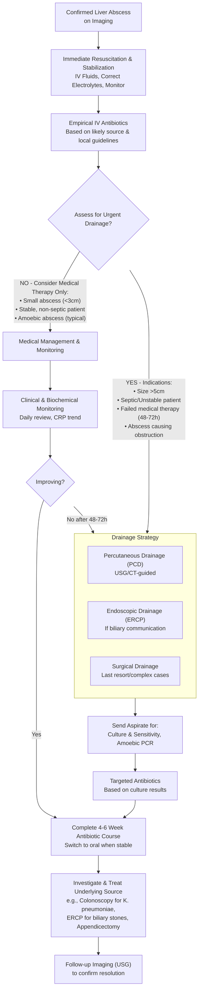

## Management Algorithm & Treatment Modalities

The management of a liver abscess is a dual-pronged attack: **1) Eradicate the infection** with antibiotics and drainage, and **2) Identify and treat the underlying source** to prevent recurrence. The approach is tailored based on the abscess size, number, patient stability, and etiology (pyogenic vs. amoebic). The core principle is that **antibiotics alone are often insufficient for large pyogenic abscesses due to poor penetration into the avascular, necrotic core; drainage is key.**

### I. General Principles & Resuscitation

Before specific treatment, address the systemic illness.

- **Resuscitation:** Patients are often septic. Manage with **IV fluid boluses** to correct hypovolemia and maintain organ perfusion. Monitor urine output.
- **Supportive Care:** Provide analgesia for pain, antiemetics for nausea, and correct any electrolyte imbalances.
- **Monitoring:** Admit to a monitored setting. Track vital signs, urine output, and trend inflammatory markers (CRP, WBC) to assess treatment response.

### II. Medical Management (Antimicrobial Therapy)

Antibiotics are the foundation of treatment. The choice is initially empirical, then tailored to culture results.

**Empirical Therapy:** Must cover the most likely pathogens based on the suspected source and local epidemiology (Hong Kong).

1.  **_Combination Therapy (Traditional & Still Valid):_** A **third-generation cephalosporin (e.g., Ceftriaxone)** PLUS **_Metronidazole_** [1, 2].
    - **Why this combo?** Ceftriaxone covers Gram-negative enteric bacilli (E. coli, Klebsiella) and Gram-positive cocci (Streptococcus anginosus). Metronidazole covers anaerobic bacteria (Bacteroides fragilis) and is also the drug of choice for **amoebiasis**. This is a safe, broad-spectrum starting point.
2.  **_Monotherapy with a β-lactam/β-lactamase Inhibitor:_** **_Piperacillin-tazobactam (Tazocin)_** or Ampicillin-sulbactam [1, 3]. These agents have a broad spectrum covering Gram-positives, Gram-negatives, and anaerobes, making them excellent single-agent choices for moderate to severe infections.

**Special Considerations for Hong Kong / East Asia:**

- **_Klebsiella pneumoniae Liver Abscess (KLA):_** This hypervirulent strain is often resistant to ampicillin but sensitive to cephalosporins. **_High-dose Ceftriaxone (2g IV 12-hourly)_** is recommended, especially if metastatic complications (e.g., endophthalmitis, meningitis) are present or suspected [2]. _Why high dose?_ To achieve adequate CNS penetration in case of silent bacteremic seeding.
- **Amoebic Liver Abscess:** First-line treatment is with **nitroimidazoles**: **_Metronidazole_** (750mg PO/IV 8-hourly for 7-10 days) or Tinidazole. This is followed by a **luminal agent** (Paromomycin or Diloxanide furoate) to eradicate intestinal cysts and prevent relapse. **_Drainage is usually not necessary for amoebic abscesses_** as they respond excellently to medical therapy [2].

**Duration of Therapy:**

- **Total duration is typically 4–6 weeks** [1, 2].
- **Initial IV phase:** Administer IV antibiotics for at least **2 weeks**, or until the patient is clinically stable, afebrile, and CRP is trending down significantly.
- **Oral step-down:** Switch to oral antibiotics (e.g., ciprofloxacin + metronidazole, or amoxicillin-clavulanate) to complete the 4-6 week course. The choice should be guided by culture sensitivities.

<Callout title="Key Principle">
**Antibiotics treat the surrounding cellulitis and prevent seeding, but drainage removes the nidus of infection.** For abscesses >5 cm, antibiotics cannot penetrate the necrotic centre effectively, making drainage mandatory for cure.
</Callout>

### III. Drainage Procedures

Drainage is both therapeutic (decompresses the abscess, removes pus) and diagnostic (provides specimen for culture). The route depends on abscess characteristics and anatomy.

**1. Percutaneous Drainage (PCD):**

- **_The first-line invasive treatment for most pyogenic liver abscesses_** [1, 2].
- **Technique:** Performed under **USG or CT guidance**. A needle is inserted into the abscess cavity, a guidewire is passed, and a drainage catheter (pigtail catheter) is placed over the wire. The catheter is left in place for continuous drainage.
- **Indications:**
  - **_Single abscess >5 cm in diameter_** [1].
  - **Abscess causing significant symptoms or sepsis.**
  - **Failure to improve with antibiotics alone within 48-72 hours.**
  - **Abscess at high risk of rupture** (e.g., large, superficial).
- **Contraindications:** _Relative_ include uncorrectable coagulopathy, lack of a safe percutaneous window (e.g., abscess surrounded by major vessels or bowel), and massive ascites.
- **Catheter Management:** The catheter is left until drainage is minimal (< 10-20 mL/day), usually for **7-10 days**. A follow-up sinogram (contrast study via the catheter) can be done to confirm cavity collapse before removal.

**2. Percutaneous Needle Aspiration:**

- **Technique:** Simple aspiration of pus with a needle under imaging guidance, without leaving a catheter.
- **Indications:** May be considered for **_single abscesses ≤5 cm_** as an alternative to catheter drainage [1]. However, **catheter drainage is generally preferred** as it provides continuous drainage, reducing the need for repeat procedures.
- **Drawback:** Higher recurrence rate compared to catheter drainage, as the cavity may re-accumulate if not fully drained.

**3. Endoscopic Drainage (via ERCP):**

- **Technique:** During ERCP, a stent is placed across the biliary sphincter to facilitate drainage.
- **Indications:** **_Specifically for abscesses that communicate with the biliary tree_** [1]. This is common in:
  - Abscesses secondary to **acute cholangitis** or **biliary obstruction**.
  - Patients with **previous biliary surgery** (e.g., hepaticojejunostomy) where percutaneous access is difficult.
  - **Recurrent Pyogenic Cholangitis (RPC)** with associated abscesses. ERCP can both drain the abscess (if connected) and address the underlying biliary stones/strictures [2, 3].
- **Advantage:** Treats both the abscess and the underlying biliary pathology in one procedure.

**4. Surgical Drainage (Open or Laparoscopic):**

- **_Now largely reserved for complicated cases failed by or unsuitable for percutaneous/endoscopic methods_** [1].
- **Indications:**
  - **Failure of percutaneous drainage** (e.g., persistent sepsis, inadequate drainage).
  - **_Multiple or multiloculated abscesses_** that are difficult to drain percutaneously.
  - **Abscess with very viscous contents** (e.g., fungal abscess) that clog percutaneous catheters.
  - **Concurrent intra-abdominal pathology requiring surgery** (e.g., perforated appendicitis, diverticulitis, gangrenous cholecystitis).
  - **Abscess rupture with generalized peritonitis.**
- **Procedure:** Involves laparotomy/laparoscopy, direct opening of the abscess cavity, evacuation of pus, and placement of large-bore drains. It may also include resection of the affected liver segment (e.g., in RPC with localized disease and atrophy) [2, 3].

### IV. Treatment of the Underlying Cause

This is critical to prevent recurrence. The liver abscess is often a **complication**, not the primary disease.

- **Biliary Source:** If due to choledocholithiasis or cholangitis, definitive treatment with **ERCP stone extraction and/or laparoscopic cholecystectomy** is required after the acute infection resolves.
- **Colonic Source:** As highlighted, **_K. pneumoniae liver abscess without biliary disease warrants a screening colonoscopy_** to exclude occult colorectal cancer [1, 2].
- **Portal Source:** If secondary to appendicitis or diverticulitis, appropriate surgical intervention (appendicectomy, colectomy) may be needed.
- **Other Sources:** Treat infective endocarditis, manage diabetes optimally, etc.

### V. Monitoring Response & Follow-up

- **Clinical:** Daily assessment for defervescence, pain reduction, and overall well-being.
- **Biochemical:** Serial CRP measurement is the best marker. A falling trend indicates effective treatment.
- **Radiological:** Repeat ultrasound or CT is **not routinely needed** if the patient is improving clinically and biochemically. It is indicated if there is clinical deterioration, failure of CRP to fall, or prior to drainage catheter removal. A follow-up scan (USG) at 4-6 weeks post-treatment can confirm complete resolution.

<Callout title="High Yield Summary">
*   **Dual-Pronged Approach:** **1) Antibiotics + Drainage** to eradicate infection, **2) Treat the underlying cause** to prevent recurrence.
*   **Empirical Antibiotics:** **Ceftriaxone + Metronidazole** OR **Piperacillin-tazobactam (Tazocin)** as monotherapy. In HK, use **high-dose Ceftriaxone (2g 12-hourly)** if KLA suspected (for CNS penetration).
*   **Amoebic Abscess:** **Metronidazole** (7-10 days) + luminal agent (Paromomycin). **Drainage usually NOT needed** — excellent response to medical therapy.
*   **Drainage Indications:** Abscess **>5 cm**, septic/unstable patient, failure of antibiotics at 48-72h, diagnostic uncertainty.
*   **First-Line Drainage:** **Percutaneous catheter drainage (PCD)** under USG/CT guidance. Catheter stays until drainage < 10-20 mL/day (~7-10 days).
*   **ERCP Drainage:** When abscess **communicates with biliary tree** (cholangitis, RPC) — treats both abscess and biliary obstruction.
*   **Surgical Drainage:** Last resort — for failed PCD, multiloculated abscesses, viscous contents, concurrent surgical pathology, or rupture with peritonitis.
*   **Antibiotic Duration:** Total **4-6 weeks** (IV for ≥2 weeks → oral step-down guided by cultures).
*   **Treat the Source:** ERCP/cholecystectomy for biliary stones, **colonoscopy for KLA without biliary cause**, appendicectomy for portal pyemia.
*   **Monitoring:** CRP trend is the best marker of response. Repeat imaging only if deteriorating or before catheter removal.
</Callout>

<ActiveRecallQuiz
  title="Active Recall - Management"
  items={[
    {
      question:
        "A 68-year-old diabetic man is diagnosed with a 7cm solitary pyogenic liver abscess in the right lobe. He is febrile but hemodynamically stable. What is the definitive first-line management, and what antibiotic regimen would you start empirically?",
      markscheme:
        "Definitive first-line management is Percutaneous Catheter Drainage (PCD) under USG/CT guidance due to size >5cm. Empirical IV antibiotic regimen: Piperacillin-tazobactam (Tazocin) 4.5g 8-hourly OR Ceftriaxone 2g daily plus Metronidazole 500mg 8-hourly. In Hong Kong, consider high-dose ceftriaxone (2g 12-hourly) if K. pneumoniae is suspected.",
    },
    {
      question:
        "Under what specific circumstance is ERCP, rather than percutaneous drainage, the preferred initial drainage method for a liver abscess?",
      markscheme:
        "ERCP is preferred when the liver abscess is known or suspected to communicate directly with the biliary tree. This is typically in the setting of acute cholangitis, recurrent pyogenic cholangitis (RPC), or in patients with a history of biliary-enteric anastomosis. ERCP allows for both abscess drainage and treatment of the underlying biliary obstruction (e.g., stone removal, stenting).",
    },
    {
      question:
        "A patient with a pyogenic liver abscess has been on IV antibiotics for 72 hours. His fever persists and his CRP has risen. What are the two most likely reasons for treatment failure, and what is the immediate next step?",
      markscheme:
        "The two most likely reasons are: 1) Inadequate drainage of the abscess (requires intervention), or 2) Inappropriate antibiotic coverage (requires re-evaluation of cultures/sensitivities). The immediate next step is to ensure adequate drainage, typically by performing or re-evaluating percutaneous catheter drainage (PCD).",
    },
    {
      question:
        "What is the key difference in the management approach between a 3cm amoebic liver abscess and a 3cm pyogenic liver abscess in a stable patient?",
      markscheme:
        "For the 3cm amoebic abscess, medical therapy with metronidazole (followed by a luminal agent) is usually sufficient, and drainage is rarely needed. For the 3cm pyogenic abscess, while medical therapy may be attempted initially, there is a higher likelihood that percutaneous drainage will be required, especially if the patient does not show rapid clinical improvement within 48-72 hours.",
    },
  ]}
/>

## References

[1] Senior notes: felixlai.md  
[2] Senior notes: maxim.md  
[3] Lecture slides: GC 200. RUQ pain, jaundice and fever Cholecystitis and cholangitis Imaging of GI system.pdf
