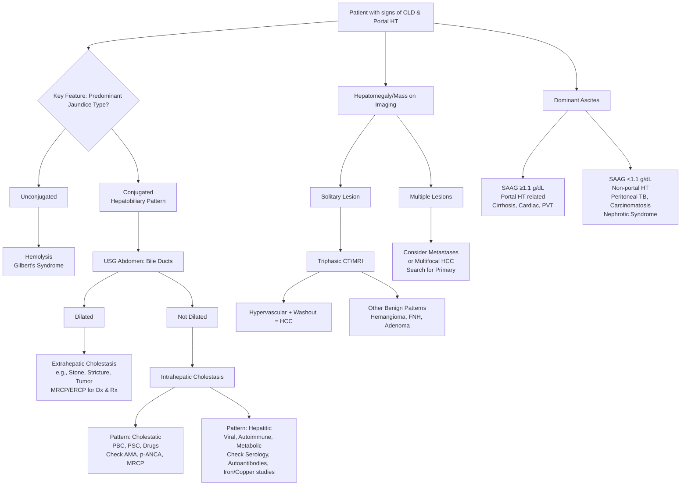

## Differential Diagnosis for Liver Cirrhosis

When a patient presents with signs and symptoms suggestive of liver cirrhosis, the clinician's mind must navigate a broad landscape of potential conditions. The goal is to confirm cirrhosis as the diagnosis while simultaneously identifying its underlying cause. This process is a two-pronged diagnostic challenge: **first, to distinguish cirrhosis from other conditions that mimic its clinical presentation, and second, to pinpoint the specific etiology of the cirrhosis itself.**

The classic triad of **portal hypertension, hepatocellular dysfunction, and specific stigmata** is highly suggestive but not exclusive to cirrhosis. Other diseases can masquerade as cirrhosis, and some can even co-exist with it.

Here’s a systematic approach to the differential diagnosis, structured from the most common to the less common, always anchored in the pathophysiology of the presenting signs.

<Callout title="The Diagnostic Mantra">
In hepatology, always think in two steps: **1. Is this cirrhosis? 2. If so, what caused it?** The differentials below address both challenges—conditions that look like cirrhosis (mimics) and conditions that lead to cirrhosis (etiologies).
</Callout>

### 1. Non-Cirrhotic Causes of Portal Hypertension & Chronic Liver Disease
These conditions can produce portal hypertension, splenomegaly, and even variceal bleeding, but the liver architecture is preserved.
*   **Non-Cirrhotic Portal Hypertension (e.g., Idiopathic Portal Hypertension, Nodular Regenerative Hyperplasia):** The liver develops regenerative nodules *without* significant fibrosis, leading to increased intrahepatic resistance. Patients present with varices and splenomegaly but have relatively preserved liver synthetic function. ***It is a key differential in patients with portal hypertension but near-normal liver enzymes and no obvious cause of cirrhosis*** [1].
*   **Pre-Sinusoidal Portal Hypertension:**
    *   **Portal Vein Thrombosis (PVT):** Blockage of the main portal vein increases pressure upstream without intrinsic liver disease. Common in hypercoagulable states, abdominal sepsis, or after umbilical vein catheterization. Presents with acute variceal bleeding in a patient with a *normal-sized, smooth liver*.
    *   **Schistosomiasis:** A major global cause of non-cirrhotic portal fibrosis. *Schistosoma* eggs lodge in portal venules, triggering a granulomatous inflammatory reaction and presinusoidal fibrosis ("pipe-stem fibrosis"). Endemic in some regions but rare in Hong Kong.
*   **Post-Sinusoidal Portal Hypertension:**
    *   **Budd-Chiari Syndrome:** Thrombosis of the *hepatic veins* or *Inferior Vena Cava (IVC)*. This leads to hepatic outflow obstruction, centrilobular congestion, and eventually fibrosis. Patients present with painful hepatomegaly, ascites (often refractory), and rapid progression to liver failure. ***It is a crucial differential in a young patient with acute-onset ascites and hepatomegaly*** [2].
    *   **Congestive Hepatopathy (Cardiac Cirrhosis):** Chronic right-sided heart failure (e.g., severe tricuspid regurgitation, constrictive pericarditis) causes sustained high pressure in the hepatic veins. This results in chronic passive congestion, centrilobular hepatocyte atrophy, and fibrosis, eventually leading to a **"nutmeg liver"** and cirrhosis. The liver is often *firm, smooth, and pulsatile*. Key clues are elevated jugular venous pressure (JVP) and other signs of heart failure [2].

### 2. Other Chronic Inflammatory & Infiltrative Liver Diseases (Without Established Cirrhosis)
These conditions cause hepatomegaly, abnormal LFTs, and systemic symptoms but may not have yet progressed to the architectural distortion of cirrhosis.
*   **Chronic Viral Hepatitis (B, C, D):** Active inflammation can cause hepatomegaly, fatigue, and jaundice. The liver may be tender. *The absence of stigmata of chronic liver disease and portal hypertension suggests the disease is still in the hepatitis stage rather than cirrhotic.* This is a pre-cirrhotic stage of the same disease [2].
*   **Autoimmune Hepatitis (AIH):** An immune-mediated attack on hepatocytes, typically in young to middle-aged women. Can present with acute hepatitis or insidious onset of fatigue and jaundice. May progress to cirrhosis if untreated. Diagnosed by high serum IgG, positive autoantibodies (ANA, ASMA, anti-LKM1), and characteristic histology (interface hepatitis, plasma cell infiltrate) [2].
*   **Metabolic Dysfunction-Associated Steatotic Liver Disease (MASLD):** This encompasses simple steatosis and its inflammatory form, MASH. Patients are often asymptomatic but may have mild hepatomegaly and elevated ALT/AST. ***Severe hepatomegaly with a soft, smooth edge can be a clue, especially in obese or diabetic patients***. Progression to cirrhosis is possible but takes years [2].
*   **Infiltrative Disorders:**
    *   **Amyloidosis:** Protein deposits in the liver sinusoids cause massive, *rock-hard* hepatomegaly. LFTs are often surprisingly normal until late stages. Look for other systemic signs (macroglossia, periorbital purpura, renal disease).
    *   **Granulomatous Hepatitis:** Sarcoidosis, TB, fungal infections. Causes persistent hepatomegaly and mild LFT derangement. Diagnosis often requires liver biopsy showing non-caseating (sarcoid) or caseating (TB) granulomas.

### 3. Malignant & Benign Space-Occupying Lesions
These can cause hepatomegaly, RUQ pain, and constitutional symptoms, potentially mimicking decompensated cirrhosis or HCC.
*   ***Hepatocellular Carcinoma (HCC):*** This is both a **complication of cirrhosis** and a **differential for new liver masses**. ***It is the commonest primary liver cancer (80%)*** and ***frequently associated with cirrhosis (80% in Hong Kong)*** [3]. A new-onset hepatic bruit, rapid clinical deterioration, or a disproportionate rise in AFP in a cirrhotic patient should raise suspicion. HCC can also arise in non-cirrhotic livers, particularly with HBV [2].
*   ***Cholangiocarcinoma:*** ***Adenocarcinoma of the bile ducts.*** *Perihilar tumors (Klatskin tumors)* present with obstructive jaundice early. *Intrahepatic tumors* can present as a liver mass without jaundice, mimicking HCC. Risk factors include PSC, RPC, and liver flukes (*Clonorchis sinensis* in HK) [4]. It is **not** typically associated with high AFP.
*   ***Liver Metastases:*** Metastatic disease is far more common than primary liver cancer. Carcinomas from the colon, stomach, pancreas, breast, and lung are common culprits. The liver may be enlarged, nodular, and hard. ***Imaging typically shows multiple, hypovascular lesions***, in contrast to the hypervascular profile of HCC [1][2].
*   **Benign Liver Tumours:**
    *   ***Hemangioma:*** ***The most common benign liver tumor*** [2]. Usually asymptomatic and found incidentally. Giant hemangiomas can cause abdominal discomfort. It is hyperechoic on USG and shows characteristic peripheral nodular enhancement on CT with slow fill-in.
    *   ***Focal Nodular Hyperplasia (FNH):*** A benign hyperplastic response to a congenital vascular malformation. Common in young women. It is a **usually solitary** lesion with a central stellate scar on imaging. ***It has no malignant potential and does not rupture*** [2].
    *   ***Hepatic Adenoma:*** A benign neoplasm strongly associated with oral contraceptive use. Presents as a **usually solitary** RUQ mass. The major risk is spontaneous **rupture and hemorrhage**, and it carries a small risk of malignant transformation to HCC [2].

### 4. Primary Biliary & Cholestatic Diseases
These cause pruritus, jaundice, and hepatomegaly, but the primary pathology is in the bile ducts.
*   ***Primary Biliary Cholangitis (PBC):*** An autoimmune disorder destroying small intrahepatic bile ducts. ***Presents with pruritus and fatigue, often in middle-aged women***. Key diagnosis: elevated ALP + positive **Anti-Mitochondrial Antibodies (AMA)**. Can progress to biliary cirrhosis [5].
*   ***Primary Sclerosing Cholangitis (PSC):*** Inflammation and fibrosis of intra- and extra-hepatic bile ducts, leading to a "beaded" appearance on cholangiography. ***Strongly associated with Inflammatory Bowel Disease (especially Ulcerative Colitis)***. Presents with pruritus, jaundice, and recurrent cholangitis. A major risk factor for cholangiocarcinoma [6].

### 5. Systemic & Extra-Hepatic Conditions Mimicking Cirrhosis Complications
*   **Causes of Ascites:**
    *   **Heart Failure:** Causes transudative ascites via increased hepatic sinusoidal pressure (congestive hepatopathy) and systemic venous pressure. Differentiated by elevated JVP, cardiomegaly, and peripheral edema.
    *   **Nephrotic Syndrome:** Severe hypoalbuminemia leads to reduced oncotic pressure and generalized edema, including ascites. Urinalysis shows massive proteinuria.
    *   **Peritoneal Carcinomatosis:** Metastatic seeding of the peritoneum (e.g., from ovarian, gastric, colon cancer) causes exudative, often bloody ascites. Fluid cytology is diagnostic.
    *   **Tuberculous Peritonitis:** Causes exudative ascites with high lymphocyte count. Patients often have fever, night sweats, and may have evidence of TB elsewhere.
*   **Causes of Upper GI Bleeding (mimicking variceal hemorrhage):** Peptic ulcer disease, gastritis, Mallory-Weiss tear, and gastric cancer can all present with hematemesis. In a patient without known liver disease, these are more common than varices [7].

### 6. Genetic & Metabolic Disorders (Rare but Important)
These are specific etiologies of cirrhosis that must be identified due to targeted treatments.
*   **Hemochromatosis:** Iron overload leads to progressive fibrosis. Look for triad: *cirrhosis, diabetes mellitus ("bronze diabetes"), and skin pigmentation*. Diagnosed with high transferrin saturation and ferritin, confirmed by genetic testing (HFE gene) or liver biopsy with iron quantification [2].
*   **Wilson's Disease:** Copper accumulation. Can present as acute hepatitis, chronic liver disease, or neurological symptoms (parkinsonism, psychiatric). Keys: **Kayser-Fleischer rings** (on slit-lamp exam), low serum ceruloplasmin, high urinary copper [2].
*   **Alpha-1 Antitrypsin Deficiency:** Mutant protein (PiZZ) polymerizes in hepatocytes. Can present with neonatal cholestasis, childhood cirrhosis, or emphysema in adults. Diagnosed by low serum A1AT level and phenotype/genotype confirmation [2].

The following Mermaid diagram summarizes the clinical approach to differentiating the causes of a patient presenting with signs of chronic liver disease and portal hypertension.

<Callout title="The High-Yield HK Shortlist">
For your exams in Hong Kong, the most critical differentials to rule in/out are:
1.  **Chronic Hepatitis B** – is this the cause?
2.  **Hepatocellular Carcinoma** – has it developed on top of cirrhosis?
3.  **Alcoholic Liver Disease** – especially with a relevant history.
4.  **Non-Cirrhotic Portal Hypertension** (e.g., Portal Vein Thrombosis) – if the story doesn't quite fit.
5.  **Congestive Hepatopathy** – don't forget to examine the heart and JVP.
</Callout>

<ActiveRecallQuiz
title="Active Recall - Differential Diagnosis"
items={[
{
question: "A 45-year-old man with known HBV carrier status presents with abdominal distension and mild jaundice. Ultrasound shows a shrunken, nodular liver, massive ascites, and splenomegaly. What is the most likely diagnosis, and what is the single most important differential diagnosis you must actively exclude?",
markscheme: "Most likely: Decompensated liver cirrhosis secondary to chronic Hepatitis B. The crucial differential to exclude is Hepatocellular Carcinoma (HCC), which commonly complicates HBV cirrhosis and can present with similar features. An AFP level and contrast-enhanced imaging (triphasic CT/MRI) are mandatory.",
},
{
question: "A 60-year-old woman presents with progressive, painless jaundice and severe pruritus. LFT shows a cholestatic pattern (markedly elevated ALP). Abdominal USG shows no biliary dilation. Which two autoimmune liver diseases are highest on your differential list, and what is the key serological test for each?",
markscheme: "Primary Biliary Cholangitis (PBC) and Primary Sclerosing Cholangitis (PSC). For PBC, check Anti-Mitochondrial Antibodies (AMA). For PSC, check p-ANCA and perform an MRCP to look for characteristic biliary stricturing and dilation.",
},
{
question: "A patient presents with ascites and splenomegaly but has near-normal liver enzymes and synthetic function (normal albumin, INR). What category of conditions should you suspect, and name two specific examples.",
markscheme: "Suspect Non-Cirrhotic Portal Hypertension. Two examples are: 1) Portal Vein Thrombosis, and 2) Idiopathic Portal Hypertension / Nodular Regenerative Hyperplasia.",
},
{
question: "What is the key imaging feature on a triphasic CT scan that differentiates a typical HCC from a liver metastasis?",
markscheme: "HCC is typically hypervascular, showing strong enhancement in the arterial phase followed by 'washout' (becoming hypodense) in the portal venous/delayed phase. Metastases are typically hypovascular and do not show this arterial enhancement/washout pattern.",
},
{
question: "A patient with a history of ulcerative colitis develops jaundice and recurrent episodes of fever with chills. What hepatobiliary condition is strongly associated with their underlying disease, and what is its major long-term risk?",
markscheme: "Primary Sclerosing Cholangitis (PSC) is strongly associated with Ulcerative Colitis. Its major long-term risk is the development of Cholangiocarcinoma.",
}
]}
/>

## References
[1] Lecture slides: WCS 064 - A large liver - by Prof R Poon [20191108].doc.pdf (Hepatomegaly – Differential Diagnosis)
[2] Senior notes: felixlai.md (Causes of liver cirrhosis, Differential diagnosis of hepatomegaly and HCC)
[3] Lecture slides: WCS 064 - A large liver - by Prof R Poon [20191108].doc.pdf (HCC Aetiology, Pathology)
[4] Senior notes: felixlai.md (Cholangiocarcinoma etiology and clinical features)
[5] Senior notes: felixlai.md (Primary biliary cholangitis - Overview, Clinical manifestations)
[6] Senior notes: felixlai.md (Primary sclerosing cholangitis - Overview, Associated conditions)
[7] Senior notes: felixlai.md (Differential diagnosis of upper GI bleeding)
