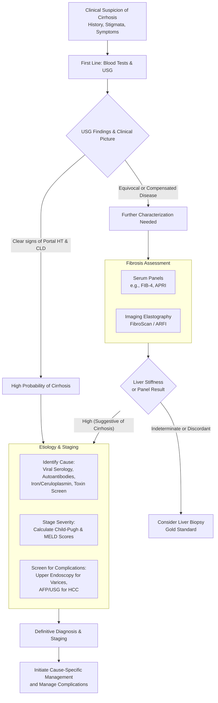

## Diagnostic Criteria, Algorithm, and Investigations for Liver Cirrhosis

The diagnosis of cirrhosis is not made by a single test, but rather by synthesizing evidence from the clinical presentation, blood tests, imaging, and sometimes histology. The goals are twofold: **1) To confirm the presence of cirrhosis and assess its severity, and 2) To identify the underlying etiology**, as this directly determines management.

### Diagnostic Criteria: A Composite Picture

There is no single "diagnostic criteria" checklist for cirrhosis itself. Instead, diagnosis is based on a combination of findings. For **compensated cirrhosis** (often asymptomatic), the diagnosis may be subtle and rely more on imaging or biopsy. For **decompensated cirrhosis**, the presence of clear complications (ascites, variceal hemorrhage, hepatic encephalopathy) in the right clinical context is often sufficient.

However, for specific diseases *causing* cirrhosis, there are established criteria:

*   **Primary Biliary Cholangitis (PBC):** Diagnosis requires at least 2 of the following: 1) **ALP ≥ 1.5x ULN**, 2) **Positive AMA at titer ≥1:40**, and 3) Histologic evidence of non-suppurative destructive cholangitis [1][10].
*   **Hepatocellular Carcinoma (HCC):** In a cirrhotic liver, a liver lesion >1 cm with the **typical vascular pattern on dynamic imaging (arterial hyperenhancement and venous/delayed phase washout)** is diagnostic without the need for biopsy [8][11].

The functional severity of cirrhosis is formally classified using the **Child-Pugh Score** (which grades from A to C) and quantified by the **Model for End-Stage Liver Disease (MELD) score**, critical for transplant prioritization.

### Diagnostic Algorithm: A Stepwise Approach

When cirrhosis is suspected, follow a logical, tiered investigation strategy. The following algorithm outlines the pathway from initial suspicion to confirmation and etiological diagnosis.

### Investigation Modalities and Key Findings

#### 1. Blood Tests: The Functional and Etiological Clues

Blood tests assess the liver's synthetic and metabolic function and point to the cause.

**A. Complete Blood Count (CBC) & Clotting Profile**
*   **Thrombocytopenia:** ***A common finding.*** Caused by: 1) **Portal hypertension-induced splenomegaly and hypersplenism** (platelet sequestration), and 2) **Decreased hepatic production of thrombopoietin** [3].
*   **Leukopenia:** Also due to hypersplenism.
*   **Anemia:** Multifactorial: chronic disease, gastrointestinal blood loss (varices, gastropathy), nutritional deficiencies (folate in alcoholics), and direct alcohol toxicity.
*   **Prolonged PT/INR:** Reflects impaired synthesis of vitamin K-dependent clotting factors (II, VII, IX, X). ***Factor VII has the shortest half-life (~6 hours), so an isolated prolonged PT/INR is often the earliest lab sign of synthetic dysfunction*** [3]. It can also be due to vitamin K malabsorption from cholestasis.

**B. Liver Function Tests (LFTs) & Biochemistry**
*   **Bilirubin:** May be normal in compensation. A rising bilirubin indicates worsening liver function or superimposed events (e.g., alcoholic hepatitis, cholangitis).
*   **Aminotransferases (AST, ALT):** Often only mildly elevated. ***A characteristic AST:ALT ratio >1 (often ~2:1) is suggestive of cirrhosis***, especially alcoholic etiology. *Why?* AST is mitochondrial and is released with more severe cell injury; ALT is cytosolic. In advanced fibrosis, ALT production may be diminished.
*   **Alkaline Phosphatase (ALP) & GGT:** Mild elevations are common. ***Marked elevation (e.g., >3x ULN) suggests a cholestatic component*** (e.g., PBC, PSC, biliary obstruction) [4]. GGT is particularly sensitive to alcohol use.
*   **Albumin:** ***Hypoalbuminemia is a key marker of chronic synthetic failure*** (albumin half-life ~20 days). It contributes to peripheral edema and ascites formation by lowering plasma oncotic pressure.
*   **Globulins:** ***Polyclonal hypergammaglobulinemia*** is common, leading to a **reversed A:G ratio**. *Mechanism:* Portosystemic shunting allows gut-derived antigens to bypass the liver's Kupffer cells, leading to sustained B-cell stimulation in the spleen and lymph nodes [3][4].
*   **Renal Function & Electrolytes:** Hyponatremia is common due to **non-osmotic ADH release** from effective arterial hypovolemia. Rising creatinine may indicate hepatorenal syndrome.

**C. Etiology-Specific Serology & Markers**
*   ***Viral Hepatitis:*** **HBsAg, Anti-HCV.** In HBV, check HBeAg/Ab and HBV DNA. In HCV, check HCV RNA. ***In Hong Kong, Hepatitis B serology is the most critical test*** [1][2].
*   ***Autoimmune:*** **ANA** (Autoimmune Hepatitis), **AMA** (PBC), **p-ANCA** (PSC).
*   ***Metabolic:*** **Ferritin, Transferrin Saturation** (Hemochromatosis), **Ceruloplasmin** (Wilson's), **Alpha-1 Antitrypsin level and phenotype**.
*   ***Tumour Marker:*** **Alpha-fetoprotein (AFP)**. Used for HCC screening. ***>400 ng/mL is highly suggestive of HCC***, but levels can be elevated in active hepatitis and regeneration. ***30% of HCC patients have normal AFP*** [9][11].
*   ***Others:*** **IgG4** (for IgG4-related disease mimicking PSC), **CA 19-9** (cholangiocarcinoma).

#### 2. Imaging: Visualizing Structure and Consequences

**A. Abdominal Ultrasound (USG) – First-Line Imaging**
*   ***Findings of Cirrhosis:*** **Surface nodularity, coarse heterogeneous echotexture, atrophy of the right lobe with hypertrophy of the caudate/left lobe** [5].
*   ***Findings of Portal Hypertension:*** **Splenomegaly, ascites, collateral vessels (e.g., recanalized umbilical vein), portal vein dilatation (>13mm), and reduced/ reversed portal vein flow** [5].
*   ***Additional Role:*** Screening for **HCC** (any solid nodule >1 cm needs further investigation) and detecting **portal vein thrombosis**.

**B. Transient Elastography (FibroScan)**
*   ***A non-invasive method to estimate liver stiffness, correlating with fibrosis stage.*** It uses a shear wave to measure propagation speed; stiffer (fibrotic) livers transmit the wave faster. It is excellent for diagnosing advanced fibrosis/cirrhosis and monitoring progression. Values >12-15 kPa are highly suggestive of cirrhosis.

**C. Cross-Sectional Imaging (CT/MRI)**
*   Not for routine cirrhosis diagnosis, but crucial for:
    1.  **Characterizing focal lesions** found on USG.
    2.  **Detailed assessment of vascular anatomy** (for transplant or TACE planning).
    3.  **Evaluating for HCC.** ***Triphasic (multiphase) CT or MRI is the gold standard imaging for HCC diagnosis.*** The classic hallmark is **"wash-in and washout"** – the lesion enhances brightly in the **arterial phase** (hepatic artery supply) and becomes hypodense/intense relative to the liver in the **portal venous/delayed phase** [8][9].
    4.  **MRI** is superior for characterizing certain nodules, assessing iron overload (hemochromatosis), or copper deposition (Wilson's).

#### 3. Invasive Diagnostic Procedures

**A. Liver Biopsy – The Histological Gold Standard**
*   **Indications:** When diagnosis is uncertain despite non-invasive tests, in suspected autoimmune hepatitis, or to assess disease activity and stage (e.g., NASH activity score).
*   **Histological Diagnosis:** Confirms the triad of **bridging fibrosis, regenerative nodules, and architectural distortion** [5][6].
*   **Limitations:** Invasive, risk of bleeding (correct coagulopathy first), sampling error.

**B. Hepatic Venous Pressure Gradient (HVPG) Measurement**
*   A catheter is placed in the hepatic vein to measure the gradient between the wedged (occluded) and free pressures. This directly measures sinusoidal pressure.
*   **Normal HVPG:** 1-5 mmHg.
*   ***Clinically Significant Portal Hypertension:*** **HVPG ≥10 mmHg** – threshold for developing varices and ascites [7].
*   **Used for:** Confirming portal hypertension, assessing response to therapy (e.g., beta-blockers for varices), and in clinical trials.

**C. Diagnostic Paracentesis**
*   ***The first step in the evaluation of new-onset ascites in a cirrhotic patient*** [6].
*   **Analyze:** Cell count (neutrophil count >250/mm³ diagnoses Spontaneous Bacterial Peritonitis), culture, albumin (to calculate SAAG), and cytology if malignancy is suspected.
*   **Serum-Ascites Albumin Gradient (SAAG):** **SAAG ≥1.1 g/dL** confirms portal hypertension as the cause of ascites (high accuracy).

<Callout title="High-Yield Diagnostic Synthesis">
1.  **Compensated Cirrhosis:** Often diagnosed via **Ultrasound nodularity + FibroScan stiffness >15 kPa + Thrombocytopenia**. Etiology is pinned down by bloods (HBsAg, etc.).
2.  **Decompensated Cirrhosis:** Clinically obvious (ascites, encephalopathy). Workup focuses on **assessing severity (Child-Pugh/MELD) and screening for complications** (USG for HCC, endoscopy for varices).
3.  **HCC Diagnosis in Cirrhosis:** **Lesion >1cm on USG → Multiphasic CT/MRI showing arterial hyperenhancement and washout = Diagnostic.** AFP supports but is not required.
4.  **Child-Pugh Score:** Memorize the parameters (Albumin, Bilirubin, INR, Ascites, Encephalopathy). It's a classic exam question for prognosis and surgical risk.
</Callout>

<ActiveRecallQuiz
title="Active Recall - Diagnosis of Cirrhosis"
items={[
{
question: "Calculate the Child-Pugh score for a patient with: Albumin 28 g/L, Bilirubin 50 μmol/L, INR 2.0, moderate ascites, and grade 2 encephalopathy. What is their Child-Pugh class and what is the approximate 1-year survival?",
markscheme: "Albumin 28 g/L = 2 pts, Bilirubin 50 μmol/L = 3 pts, INR 2.0 = 2 pts, Moderate Ascites = 3 pts, Grade 2 Encephalopathy = 2 pts. Total = 12 points. This is Child-Pugh Class C. Approximate 1-year survival is 45%.",
},
{
question: "A cirrhotic patient on surveillance ultrasound is found to have a new 2.5 cm solid liver nodule. What is the next definitive diagnostic step, and what imaging finding would confirm hepatocellular carcinoma without needing a biopsy?",
markscheme: "The next step is a multiphasic contrast-enhanced CT or MRI of the liver. The finding that confirms HCC is 'arterial phase hyperenhancement' followed by 'washout' in the portal venous or delayed phases.",
},
{
question: "Explain the pathophysiological reasons for two common hematological findings in cirrhosis: thrombocytopenia and a prolonged prothrombin time (PT).",
markscheme: "Thrombocytopenia: 1) Sequestration of platelets in an enlarged spleen due to portal hypertension (hypersplenism). 2) Reduced hepatic production of thrombopoietin. Prolonged PT: Reduced synthesis of vitamin K-dependent clotting factors (II, VII, IX, X) by the failing liver. Factor VII has the shortest half-life, so PT prolongs early.",
},
{
question: "What is the significance of a Serum-Ascites Albumin Gradient (SAAG) ≥1.1 g/dL in a patient with ascites? What are the two most common causes in this category?",
markscheme: "A SAAG ≥1.1 g/dL indicates that portal hypertension is the cause of the ascites. The two most common causes are Liver Cirrhosis and Heart Failure (congestive hepatopathy).",
},
{
question: "A middle-aged woman presents with pruritus and fatigue. LFT shows isolated elevation of ALP (3x ULN) and GGT. Ultrasound shows no biliary dilation. What is the most specific diagnostic blood test you should order, and what is the likely diagnosis?",
markscheme: "The most specific test is Anti-Mitochondrial Antibody (AMA). The likely diagnosis is Primary Biliary Cholangitis (PBC).",
}
]}
/>

## References
[1] Senior notes: felixlai.md (Causes of liver cirrhosis, HBV most common in HK)
[2] Lecture slides: WCS 064 - A large liver - by Prof R Poon [20191108].doc.pdf (HCC Aetiology)
[3] Senior notes: felixlai.md (Biochemical tests - CBC, clotting, mechanisms)
[4] Senior notes: felixlai.md (LFT patterns in cirrhosis)
[5] Senior notes: felixlai.md (Radiological tests - USG, CT, MRI findings)
[6] Senior notes: felixlai.md (Diagnostic paracentesis as first step)
[7] Senior notes: felixlai.md (Pathophysiology of portal hypertension, HVPG thresholds)
[8] Senior notes: felixlai.md (HCC diagnostic guidelines and radiological features)
[9] Senior notes: maxim.md (Triphasic CT as gold standard for HCC, AFP)
[10] Senior notes: felixlai.md (PBC diagnostic criteria)
[11] Lecture slides: WCS 064 - A large liver - by Prof R Poon [20191108].doc.pdf (AFP >400 ng/ml diagnostic of HCC)
