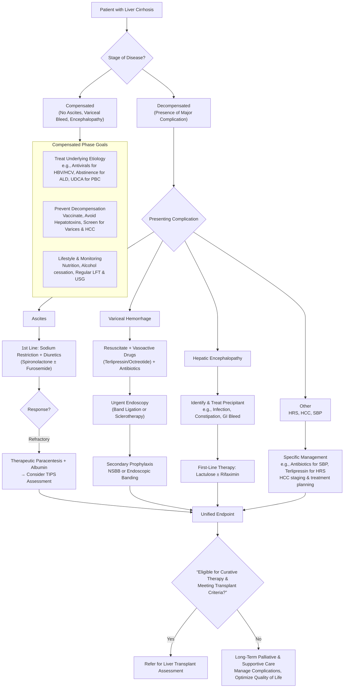

## Management Algorithm and Treatment Modalities for Liver Cirrhosis

The management of cirrhosis is a lifelong commitment, shifting from a focus on **slowing progression and preventing complications in the compensated stage** to **aggressively managing life-threatening complications and evaluating for transplant in the decompensated stage.** The overarching principle is to treat the **underlying etiology** whenever possible and to use a **multidisciplinary approach** involving hepatologists, surgeons, radiologists, and transplant teams.

The management strategy can be visualized in the following algorithm, which guides decisions based on the stage of the disease and the presence of specific complications.

### 1. General Management & Treatment of the Underlying Cause

This is the most critical step, as it can halt progression and even lead to regression of fibrosis in some cases.

- **Chronic Hepatitis B (HBV):**
  - **Goal:** Suppress viral replication to undetectable levels (HBV DNA).
  - **First-line Agents:** **Entecavir** or **Tenofovir** (TAF/TDF). These are potent nucleos(t)ide analogs with high barriers to resistance. _They are indicated in all cirrhotic patients with detectable HBV DNA, regardless of ALT level_ [1][9].
  - **_Mechanism:_** _They inhibit the HBV reverse transcriptase, stopping viral DNA synthesis._
  - **Monitoring:** HBV DNA, LFTs, renal function (for Tenofovir).

- **Chronic Hepatitis C (HCV):**
  - **Goal:** Achieve sustained virologic response (SVR), which is a "cure."
  - **Agents:** **Direct-acting antivirals (DAAs)** – e.g., Sofosbuvir/Velpatasvir, Glecaprevir/Pibrentasvir. These are oral, well-tolerated, and have >95% cure rates in 8-12 weeks.
  - **_Mechanism:_** _They target specific non-structural proteins of HCV (NS3/4A protease, NS5A, NS5B polymerase) crucial for viral replication._

- **Alcohol-Related Liver Disease (ALD):**
  - **Cornerstone:** Complete, lifelong **abstinence**. This is non-negotiable and can dramatically improve prognosis.
  - **Support:** Referral to addiction services, counseling, and potentially medications like acamprosate or naltrexone (if liver function allows).
  - **Nutrition:** Correct malnutrition and specific vitamin deficiencies (especially B vitamins).

- **Metabolic Dysfunction-Associated Steatotic Liver Disease (MASLD/MASH):**
  - **Goal:** Weight loss and control of metabolic drivers.
  - **Lifestyle:** **Weight loss of 7-10%** is the most effective therapy. Achieved through calorie restriction and exercise (150+ min/week).
  - **Pharmacotherapy:** For patients with MASH and significant fibrosis, consider **GLP-1 agonists** (e.g., semaglutide) or other metabolic agents. Vitamin E may be considered in non-diabetic patients.

- **Autoimmune Hepatitis (AIH):**
  - **Goal:** Induce and maintain remission to prevent progression.
  - **First-line:** **Prednisolone** (induction) followed by **Azathioprine** (maintenance). Budesonide (a topical steroid with high first-pass metabolism) may be used in non-cirrhotic patients.
  - **_Mechanism:_** _Suppress the immune-mediated attack on hepatocytes._

- **Primary Biliary Cholangitis (PBC):**
  - **First-line:** **_Ursodeoxycholic acid (UDCA) at 13-15 mg/kg/day._** _It improves liver biochemistry, delays histological progression, and improves transplant-free survival_ [10][11].
  - **_Mechanism:_** _Thought to replace toxic endogenous bile acids, stimulate bile flow, and have anti-apoptotic effects on cholangiocytes._
  - **Second-line:** **Obeticholic acid** (a FXR agonist) for patients with an inadequate biochemical response to UDCA.

- **Genetic/Metabolic Disorders:**
  - **Hemochromatosis:** Weekly **therapeutic phlebotomy** to deplete iron stores. Target ferritin < 100 ng/mL.
  - **Wilson's Disease:** **Copper chelation** with D-penicillamine or Trientine. **Zinc acetate** (induces metallothionein, blocking copper absorption) for maintenance.
  - **Alpha-1 Antitrypsin Deficiency:** Supportive. No specific therapy for the liver disease other than avoiding alcohol/smoking. Augmentation therapy is for lung disease.

### 2. Management of Complications

#### A. Ascites and Edema

- **Step 1: Diagnostic Paracentesis** – Always perform first to rule out SBP [6].
- **Step 2: Dietary Sodium Restriction** – Strict < 2g/day (88 mmol/day). This is often the hardest part for patients.
- **Step 3: Diuretic Therapy:**
  - **Start with:** **_Spironolactone_** (an aldosterone antagonist). _Why?_ Cirrhosis causes secondary hyperaldosteronism. Start at 100mg/day.
  - **Add-on:** **Furosemide** 40mg/day if response is inadequate. The 100:40 ratio helps maintain normokalemia.
  - **Goal:** Weight loss of 0.5-1.0 kg/day in patients with edema, 0.3-0.5 kg/day without edema. Monitor renal function and electrolytes.
- **Refractory Ascites:** Defined as failure to respond to sodium restriction and high-dose diuretics (spironolactone 400mg/day + furosemide 160mg/day) or rapid recurrence after therapeutic paracentesis.
  - **Therapeutic Paracentesis:** For large-volume (>5L) taps, administer **IV albumin (8g per liter removed)** to prevent post-paracentesis circulatory dysfunction (PPCD) [6].
  - **_Transjugular Intrahepatic Portosystemic Shunt (TIPS):_** _A radiologically placed stent connecting the portal vein to a hepatic vein, dramatically reducing portal pressure._
    - **Indication:** Refractory ascites or recurrent ascites requiring frequent paracentesis.
    - **Contraindications:** Severe hepatic failure (Child-Pugh >11, MELD >18), severe hepatic encephalopathy, cardiac/pulmonary failure, portal vein thrombosis.

#### B. Spontaneous Bacterial Peritonitis (SBP)

- **Diagnosis:** Ascitic fluid neutrophil count > **250 cells/mm³**.
- **Empirical Antibiotics:** **IV 3rd generation cephalosporin** (e.g., Cefotaxime) for 5-7 days. Adjust based on culture.
- **Albumin Infusion:** Give **IV albumin (1.5 g/kg on day 1, 1.0 g/kg on day 3)** to reduce the risk of hepatorenal syndrome and improve survival.
- **Secondary Prophylaxis:** After one episode of SBP, lifelong **Norfloxacin 400mg daily** or **Ciprofloxacin** is indicated to prevent recurrence.

#### C. Acute Variceal Hemorrhage

A **life-threatening emergency** requiring coordinated, urgent management.

- **Resuscitation & General Measures:**
  - Secure airway if encephalopathic.
  - **Restrictive transfusion strategy** – target Hb ~7-8 g/dL. Over-transfusion increases portal pressure and re-bleeding risk [2].
  - Correct coagulopathy (FFP, Vitamin K) and thrombocytopenia (platelets if < 50,000).
- **Pharmacological Therapy (START IMMEDIATELY):**
  - **_Vasoactive Drugs:_** **_Terlipressin_** _(preferred – reduces portal inflow by splanchnic vasoconstriction) or **Octreotide/Somatostatin** analogs. Continue for 2-5 days._
  - **IV Antibiotics:** **Ceftriaxone** for 7 days. _Infection is a major precipitant of re-bleeding and mortality._
- **Endoscopic Therapy (Within 12 hours):**
  - **_Gold Standard:_** **_Endoscopic Variceal Band Ligation (EVL)._** _Bands are placed on the varices, causing them to thrombose and slough off._
  - Alternative: Sclerotherapy (if banding technically difficult).
- **Rescue Therapy for Uncontrolled Bleeding:**
  - **Balloon Tamponade** (Sengstaken-Blakemore tube) – temporary bridge.
  - **TIPS** – very effective at controlling hemorrhage as a salvage procedure.
- **Secondary Prophylaxis:** Start **non-selective beta-blockers (NSBB)** – **_Propranolol or Carvedilol_** – to reduce portal pressure. _Mechanism: β1-blockade reduces cardiac output; β2-blockade allows unopposed α-adrenergic tone, causing splanchnic vasoconstriction._ Titrate to heart rate ~55-60 bpm. If NSBB contraindicated, perform serial EVL.

#### D. Hepatic Encephalopathy (HE)

- **Identify & Treat Precipitants:** Infection (especially SBP), GI bleed, constipation, dehydration, medications.
- **First-Line Therapy:**
  - **_Lactulose:_** _A non-absorbable disaccharide. Gut bacteria ferment it to organic acids, lowering colonic pH. This "traps" ammonia (NH3) as ammonium (NH4+), which is not absorbed, and acts as an osmotic laxative to clear ammonia-producing bacteria._ Titrate to **2-4 soft stools per day** [4].
  - **_Rifaximin:_** _A non-absorbable antibiotic that modulates gut flora, reducing ammonia production. Used as an **add-on** to lactulose for recurrent episodes._
- **Nutrition:** No long-term protein restriction. Provide adequate calories to prevent catabolism.

#### E. Hepatorenal Syndrome (HRS)

- **Definition:** Functional renal failure in advanced cirrhosis, a diagnosis of exclusion.
- **Treatment:**
  - **IV Albumin** (1g/kg on day 1, then 20-40g/day) for volume expansion.
  - **Vasoconstrictors:** **Terlipressin** (or norepinephrine in ICU) to counteract splanchnic vasodilation. This increases effective arterial blood volume and renal perfusion.
  - **TIPS** can be effective in selected patients.
  - **Ultimate Therapy:** **Liver transplantation.**

### 3. Management of Hepatocellular Carcinoma (HCC) in Cirrhosis

The choice of therapy depends on **tumor stage, liver function (Child-Pugh), and patient performance status.** The **Hong Kong Liver Cancer (HKLC) Staging System** is commonly used locally [7][8].

<Callout title="Key Concept: The 'Therapeutic Window' in HCC">
  Many HCC patients are caught between two diseases: the cancer and the
  underlying cirrhosis. The ideal treatment must address both – removing/killing
  the tumor while preserving enough functional liver reserve to avoid
  post-treatment liver failure.
</Callout>

**A. Curative Therapies (for Early-Stage HCC):**

- **_Hepatic Resection:_**
  - **Ideal Candidate:** Single tumor, **Child-Pugh Class A** cirrhosis, **no clinically significant portal hypertension**, and adequate **future liver remnant (FLR >40%)**. _Portal hypertension is assessed by the presence of varices, splenomegaly with thrombocytopenia, or HVPG ≥10 mmHg_ [8][12].
  - **Advantage:** Potential cure with preservation of native liver.
  - **Disadvantage:** High recurrence rate (~70% at 5 years) due to "field change" in the cirrhotic liver.
- **_Liver Transplantation:_**
  - **Ideal Candidate:** Meets **Milan Criteria** (single ≤5cm, or ≤3 nodules each ≤3cm, no vascular invasion/extrahepatic spread) and has **decompensated cirrhosis (Child-Pugh B/C)**.
  - **Advantage:** Cures both the cancer and the underlying liver disease.
  - **_Contraindications:_** _Macroscopic vascular invasion, extrahepatic metastasis, active infection, active substance abuse._
  - **Bridging Therapy:** While on the waitlist, treatments like **TACE** or **RFA** are used to prevent tumor progression.
- **_Local Ablation (e.g., Radiofrequency Ablation - RFA):_**
  - **Ideal Candidate:** Small tumors (< 3 cm), ≤3 nodules, not suitable for resection/transplant. Often used for lesions deep in the liver parenchyma.
  - **Mechanism:** Image-guided insertion of a needle electrode that generates heat, destroying the tumor.

**B. Palliative/Locoregional Therapies (for Intermediate-Stage HCC):**

- **_Transarterial Chemoembolization (TACE):_**
  - **Ideal Candidate:** Large or multifocal HCC, **Child-Pugh A/B**, **no main portal vein thrombosis**, no extrahepatic spread.
  - **_Mechanism:_** _Catheter is advanced into the hepatic artery branches feeding the tumor. A mixture of chemotherapeutic drug (e.g., doxorubicin) and an embolic agent (e.g., lipiodol/gelfoam) is injected. This achieves high local drug concentration and cuts off the tumor's blood supply (HCC is hypervascular and fed predominantly by the hepatic artery)._
  - **_Contraindications:_** _Decompensated cirrhosis (Child-Pugh C), main portal vein thrombosis (risk of liver infarction), extensive tumor burden (>50% liver involvement), poor performance status_ [7][13].
- **_Transarterial Radioembolization (TARE / SIRT):_** Uses radioactive microspheres (Yttrium-90). Particularly useful for tumors with portal vein thrombosis.

**C. Systemic Therapy (for Advanced-Stage HCC):**

- **First-line:** **Atezolizumab (anti-PD-L1) + Bevacizumab (anti-VEGF).** Immunotherapy + anti-angiogenic combination.
- **Other options:** **Lenvatinib** (multi-kinase inhibitor), **Sorafenib** (the original standard, now often second-line).

### 4. Liver Transplantation

This is the definitive treatment for eligible patients with **decompensated cirrhosis** or **early HCC within criteria**.

- **Indications:** End-stage liver disease (Child-Pugh C, MELD score ≥15), HCC within Milan/UCSF criteria, acute liver failure, certain metabolic diseases.
- **Contraindications (Absolute):** Active/uncontrolled infection/sepsis outside biliary tree, extrahepatic malignancy, advanced cardiopulmonary disease, active substance abuse, inability to comply with lifelong immunosuppression.
- **Prioritization:** In HK, the **MELD score** is used. For HCC patients meeting Milan criteria, they receive a standard "exception score" to reflect their mortality risk from cancer while waiting.
- **Post-Transplant Management:** Lifelong **immunosuppression** (e.g., tacrolimus, mycophenolate) to prevent rejection, with monitoring for side effects (renal impairment, diabetes, hypertension, infection, malignancy).

<Callout title="High-Yield Summary: Management Principles">
  1. **Etiology First:** Always treat the cause (antivirals for HBV/HCV,
  abstinence for ALD, UDCA for PBC). 2. **Ascites:** Na+ restriction →
  Spironolactone ± Furosemide → Refractory → Large-volume paracentesis + albumin
  → Consider TIPS. 3. **Variceal Bleed:** *Urgent endoscopy (banding) is key.*
  Start vasoactive drugs (terlipressin) and antibiotics immediately. Use
  restrictive transfusion. 4. **Hepatic Encephalopathy:** Lactulose ± Rifaximin.
  **Always look for a precipitant.** 5. **HCC Staging & Treatment:** Think of
  the **"therapeutic window"** between tumor and liver function. * **Early
  (Preserved liver function):** Resection. * **Early (Poor liver function):**
  Transplant. * **Intermediate:** TACE. * **Advanced:** Systemic therapy
  (Atezo+Bev). 6. **Transplant:** The only cure for advanced cirrhosis. Milan
  Criteria are key for HCC.
</Callout>

<ActiveRecallQuiz
  title="Active Recall - Management of Cirrhosis"
  items={[
    {
      question:
        "A patient with decompensated cirrhosis due to Hepatitis B presents with massive ascites refractory to maximum diuretic doses (spironolactone 400mg + furosemide 160mg daily) and requires weekly large-volume paracentesis. What is the next most appropriate interventional treatment to consider, and what is one major contraindication to its use?",
      markscheme:
        "Transjugular Intrahepatic Portosystemic Shunt (TIPS). A major contraindication is severe hepatic failure (e.g., Child-Pugh score >11, MELD >18) or severe, refractory hepatic encephalopathy.",
    },
    {
      question:
        "Outline the immediate (first 12 hours) management steps for a cirrhotic patient presenting with hematemesis and shock, suspected to be from variceal bleeding.",
      markscheme:
        "1. Resuscitate: Secure airway if needed, two large-bore IVs, restrictive blood transfusion (target Hb ~7-8 g/dL), correct coagulopathy. 2. Start IV vasoactive drug (Terlipressin or Octreotide). 3. Start IV antibiotics (Ceftriaxone). 4. Arrange for urgent upper endoscopy with band ligation (within 12 hours).",
    },
    {
      question:
        "What is the first-line pharmacological therapy for Primary Biliary Cholangitis (PBC), what is the standard dose, and what is its mechanism of action?",
      markscheme:
        "Ursodeoxycholic acid (UDCA). Dose: 13-15 mg/kg/day. Mechanism: It replaces toxic hydrophobic bile acids, stimulates hepatobiliary secretion, and has anti-apoptotic and anti-inflammatory effects on cholangiocytes.",
    },
    {
      question:
        "According to the Milan Criteria, which a patient must meet to be eligible for liver transplantation for HCC, what are the specifications for tumor size and number?",
      markscheme:
        "Single lesion ≤5 cm in diameter, OR up to 3 lesions each ≤3 cm in diameter. There must be no evidence of gross vascular invasion or extrahepatic metastasis.",
    },
    {
      question:
        "Explain why non-selective beta-blockers (e.g., propranolol) are used for primary and secondary prophylaxis of variceal bleeding in cirrhosis, including the pharmacological rationale.",
      markscheme:
        "They reduce portal pressure through a dual mechanism: 1) Beta-1 blockade reduces cardiac output, decreasing portal inflow. 2) Beta-2 blockade allows unopposed alpha-adrenergic activity, causing splanchnic vasoconstriction, which further reduces portal venous inflow.",
    },
  ]}
/>

## References

[1] Senior notes: felixlai.md (Treatment of hepatitis B with nucleoside analogues)
[2] Senior notes: felixlai.md (Initial management of variceal hemorrhage - fluid restriction, blood transfusion thresholds)
[3] Senior notes: felixlai.md (Management of ascites - diuretics, paracentesis, TIPS)
[4] Senior notes: felixlai.md (Medical treatment of hepatic encephalopathy - lactulose, rifaximin)
[5] Senior notes: felixlai.md (Management of hepatorenal syndrome - terlipressin + albumin)
[6] Senior notes: felixlai.md (Diagnostic paracentesis as first step, albumin replacement for large-volume taps)
[7] Senior notes: felixlai.md (Hong Kong Liver Cancer Staging System, TACE indications/contraindications)
[8] Senior notes: maxim.md (Liver resection prerequisites, Milan/UCSF criteria for transplant)
[9] Senior notes: felixlai.md (Etiology of cirrhosis - HBV most common)
[10] Senior notes: felixlai.md (PBC treatment - UDCA)
[11] Senior notes: felixlai.md (PBC - UDCA improves survival)
[12] Senior notes: maxim.md (Resectability factors for HCC)
[13] Senior notes: felixlai.md (Contraindications to TACE)
