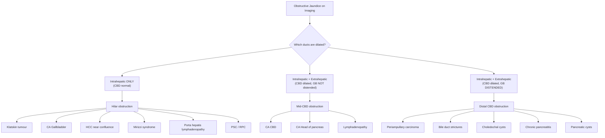
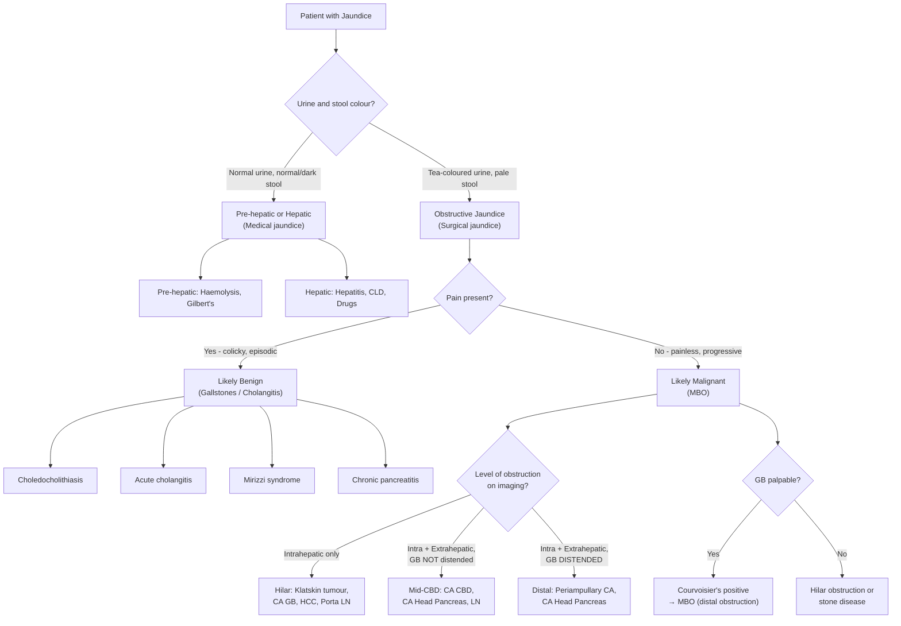

## Differential Diagnosis of Malignant Biliary Obstruction

The differential diagnosis of MBO is really about answering a series of nested clinical questions. When a patient walks in with jaundice, you don't jump straight to "cancer" — you systematically narrow down: **Is this jaundice? → Is it obstructive? → Is the obstruction benign or malignant? → What is the specific malignant cause?** Let's work through this framework from first principles.

---

### 1. The Overarching Framework: Classifying Jaundice

Before you can diagnose MBO, you must first establish that the jaundice is **obstructive** (post-hepatic/surgical) rather than **pre-hepatic** or **hepatic** (medical). This is fundamental because the management pathways are completely different — medical jaundice goes to the gastroenterologist/physician; obstructive jaundice goes to the surgeon.

| Category | Mechanism | Urine | Stool | Key Features |
|---|---|---|---|---|
| **Pre-hepatic** | Excess bilirubin production (unconjugated) — overwhelms hepatic conjugation capacity | Normal or slightly dark (urobilinogen ↑) | Normal or dark (↑ stercobilin) | Haemolysis (palpitations, dizziness, anaemia, splenomegaly), Gilbert's syndrome |
| **Hepatic** | Hepatocyte dysfunction — impaired uptake, conjugation, or excretion of bilirubin | May be dark | May be normal or slightly pale | Hepatitis (fever, RUQ pain, N/V, transaminases ↑↑), decompensated CLD (ascites, spider naevi, encephalopathy), drugs |
| ***Post-hepatic (Obstructive)*** | ***Mechanical obstruction of bile flow — conjugated bilirubin cannot reach gut*** | ***Tea-coloured*** | ***Pale-coloured*** | ***Steatorrhoea, pruritus, cholestatic LFT pattern (ALP/GGT ↑↑), ± palpable GB*** [2] |

**Why does this distinction matter?** Because conjugated bilirubin is water-soluble — it is filtered by the kidneys and appears in urine (dark/tea-coloured). Unconjugated bilirubin is albumin-bound and NOT filtered by the kidneys — so urine stays normal in pre-hepatic jaundice. And if bile can't reach the gut, there's no stercobilin production → pale stool. These are bedside clues you can elicit in 30 seconds. [2]

<Callout title="History Tip" type="idea">
When asking about tea-coloured urine, always exclude non-pathological causes: ***no recent intake of rifampicin, Pyridium (phenazopyridine), or beetroot*** — these can all turn urine dark/red and mislead you. [2]
</Callout>

---

### 2. Differential Diagnosis of Obstructive Jaundice

Once you've established the jaundice is obstructive, the next question is: **what is causing the obstruction?** A clean way to think about this is by the **anatomical relationship** of the pathology to the bile duct wall [2]:

***Differential diagnosis of obstructive jaundice:*** [2]
- ***Intraluminal: gallstone (choledocholithiasis, acute cholangitis), RPC***
- ***Mural: cholangiocarcinoma, PSC***
- ***Extramural: CA head of pancreas, lymphadenopathy, gallstone (Mirizzi's syndrome)***

| Relationship to Duct Wall | Pathology | Mechanism of Obstruction |
|---|---|---|
| **Intraluminal** | Choledocholithiasis (CBD stones) | Stone physically blocks the duct lumen — "ball-valve" effect causes fluctuating jaundice |
| | Acute cholangitis | Stone + superimposed infection (obstruction + bacteria = cholangitis) [13] |
| | RPC | Intrahepatic pigment stones + strictures → recurrent cholangitis [6] |
| | Blood clot / haemobilia | Post-procedural or tumour erosion into a vessel → clot in bile duct |
| | Parasites | *Ascaris lumbricoides*, *Clonorchis sinensis* physically inhabit the ducts |
| **Mural (intrinsic)** | Cholangiocarcinoma | Tumour arises FROM the bile duct epithelium → intrinsic narrowing/obstruction [3] |
| | PSC | Chronic inflammation → fibrosis → stricturing of bile ducts [16] |
| | PBC | T-cell attack on small intralobular bile ducts → intrahepatic cholestasis [17] |
| | Benign strictures | Iatrogenic (post-surgical), TB, autoimmune → scarring narrows lumen [5] |
| **Extramural (extrinsic)** | CA head of pancreas | Pancreatic head wraps around distal CBD → compression [7] [14] |
| | CA gallbladder | Spread to cystic duct LN, direct infiltration of CBD [1] [5] |
| | Lymphadenopathy | Porta hepatis / coeliac nodes compress CBD from outside |
| | Mirizzi syndrome | Stone impacted in Hartmann's pouch compresses CHD externally [12] |
| | Chronic pancreatitis / pancreatic cysts | Inflammatory mass or cyst compresses distal CBD |
| | Choledochal cysts | Congenital dilatation → stasis ± compression |

---

### 3. Differentiating Benign vs Malignant Biliary Obstruction

This is the crux of the matter. The clinical approach is: **Is this stone disease (benign) or cancer (malignant)?** The distinction drives urgency and management.

| Feature | **Benign (Stone Disease)** | **Malignant (MBO)** |
|---|---|---|
| **Pain** | Colicky, episodic (biliary colic — visceral pain from acute duct distension by stone) | ***Painless*** (gradual tumour growth → slow obstruction → no acute distension) |
| **Jaundice course** | **Fluctuating** (stone acts as ball-valve — moves in and out of ampulla) | ***Progressive*** (tumour relentlessly grows — obstruction only worsens) |
| **Fever** | Common — cholangitis (***Charcot's triad: fever, RUQ pain, jaundice***) [13] | Uncommon unless superimposed cholangitis from stasis |
| **GB palpable** | Usually **NOT** palpable — chronic cholecystitis → fibrosed, contracted GB | Often ***palpable*** — Courvoisier's sign (previously normal GB distends from back-pressure) [5] [12] |
| **Weight loss** | Minimal | ***Significant*** (cancer cachexia + fat malabsorption) |
| **Age** | Any age (peak 40–60) | Typically ***elderly*** ( > 60) |
| **History** | Known gallstones, previous episodes of biliary colic/cholecystitis | New-onset DM (pancreatic CA), smoking history, PSC/RPC |
| **LFT pattern** | Cholestatic (↑ ALP, GGT, conjugated bilirubin) — **may fluctuate** | Cholestatic — **persistently rising** |

<Callout title="Courvoisier's Law — The Exam Classic" type="error">
***"In painless jaundice, if the gallbladder is palpable, it is unlikely to be due to gallstones"*** → points towards MBO [5] [12]

**Why?** Gallstones develop over years → repeated bouts of cholecystitis → GB wall becomes fibrosed and contracted → even if CBD is obstructed, the GB **cannot distend**. In MBO, the GB was previously **normal and compliant** → back-pressure from distal obstruction → GB distends.

***Exceptions*** (palpable GB WITH stones) [5] [12]:
1. **Double impaction** — stone at CBD (jaundice) + stone at cystic duct (GB distension via mucocele)
2. **Mirizzi syndrome** — stone at Hartmann's pouch compresses CHD externally; the GB itself may not be chronically inflamed
3. **RPC** — pathology is in the intrahepatic ducts, NOT in the GB; GB is not fibrosed and can distend
</Callout>

---

### 4. Differential Diagnosis by Level of Obstruction

This is clinically extremely useful. When you get imaging back (USG, CT, MRCP), you determine **which parts of the biliary tree are dilated** and this tells you WHERE the obstruction is. Then you generate a focused differential for that level [5]:

| Level of Obstruction | Imaging Finding | Malignant Causes | Benign Causes |
|---|---|---|---|
| **Hilum** | Dilated intrahepatic ducts; CBD may be normal; GB usually NOT distended (obstruction ABOVE cystic duct junction) | ***Klatskin's tumour (cholangioCA at hilum)*** [1], CA gallbladder, HCC, porta lymphadenopathy, ***lymphoma*** [1] | Mirizzi syndrome, PSC, RPC |
| **Mid-CBD** | Dilated intrahepatic + proximal extrahepatic ducts; GB variably distended | CA CBD, ***CA head of pancreas*** [1], lymphadenopathy | — |
| **Distal CBD** | Dilated intrahepatic + extrahepatic ducts; ***GB distended (Courvoisier's sign)*** | ***Periampullary carcinoma*** (CA head of pancreas, CA ampulla, CA distal CBD, CA duodenum) [1] [5] | Choledochal cysts, pancreatic cysts, chronic pancreatitis, benign strictures |

**Why does the GB distend only in distal obstruction?** Because the cystic duct enters the CBD approximately at the junction of the upper and middle thirds. If the obstruction is **below** the cystic duct junction (distal CBD), back-pressure transmits into the gallbladder via the cystic duct → GB distends. If the obstruction is **above** the cystic duct junction (hilum), the cystic duct is still patent and drains into a non-obstructed distal CBD → no GB distension. [5]

**A special note on hilar obstruction**: Obstruction of just ONE hepatic duct (e.g., only the right) will **NOT** cause jaundice because the contralateral lobe excretes bilirubin normally through its patent duct. The Klatskin tumour causes jaundice because it sits at the **confluence** and blocks BOTH ducts. [5] [8]

---

### 5. The Specific Malignant Causes — Differentiating Between Them

Once you suspect MBO, the next step is: **which cancer is it?** This matters because treatment differs.

#### 5.1 ***Pathology Causing Malignant Biliary Obstruction*** [1]

The lecture slide specifically lists:

> ***Carcinoma of duodenum, periampullary carcinoma, carcinoma of pancreas, lymphoma, carcinoma of gallbladder (cystic duct LN, direct infiltration of CBD, tumour fragments), cholangiocarcinoma at hilum (Klatskin tumour), HCC (direct infiltration, compression, tumour fragments in CBD)*** [1]

| Malignancy | Key Differentiating Features | Age/Sex | Tumour Marker Clues |
|---|---|---|---|
| **CA head of pancreas** | ***Painless progressive jaundice*** + ***severe epigastric pain radiating to back*** (body/tail) + new-onset DM + weight loss; double duct sign on CT [14] | Elderly, ***male*** | CA 19-9 (↑ in 72–79% but not specific) [18] |
| **CA ampulla of Vater** | Earliest presentation with jaundice (narrow ampulla); ***best prognosis*** among periampullary CAs [5]; intermittent jaundice possible (tumour can intermittently bleed and slough → temporarily relieving obstruction) | Elderly | CA 19-9, CEA |
| **CA duodenum** | May present with duodenal obstruction (GOO) + jaundice; rare | Elderly | CEA |
| **CA distal CBD** | Pure obstructive jaundice without pancreatic insufficiency features | Elderly | CA 19-9, CEA |
| **Cholangiocarcinoma / Klatskin tumour** | Hilar obstruction → intrahepatic duct dilatation only; ***intrahepatic CC does NOT cause jaundice*** [8]; ***slow growth, perineural invasion*** [8]; prone to cholangitis [3] | Elderly, M > F slightly | CA 19-9 (↑ in 80%), CEA, AFP (to differentiate from HCC) [3] |
| **CA gallbladder** | History mimics cholecystitis/gallstones (95% have co-existing stones); late: obstructive jaundice, palpable mass; direct extension into liver segments IV & V [10]; female predominance [10] | Elderly, ***female*** | CA 19-9 |
| **HCC** | Known CLD/cirrhosis/HBV carrier in HK; hepatomegaly; stigmata of CLD; ***obstructive jaundice NOT common*** — occurs only near confluence or by tumour fragments in CBD [4] [5]; AFP elevated in 70–90% [18] | Elderly (50–70), male (HBV HK) | ***AFP*** (70–90%) [18] |
| ***Lymphoma*** [1] | B symptoms (fever, night sweats, weight loss); lymphadenopathy elsewhere; younger age possible | Variable | LDH ↑, β2-microglobulin |
| **Secondary lymphadenopathy** | Known primary (CRC, gastric CA); ***CA stomach with metastatic LN in porta hepatis*** [11] | Variable | CEA (if CRC/gastric) |

<Callout title="Tumour Markers — Useful but NOT Diagnostic">
***Tumour markers such as AFP, CA 19-9, and CEA are often elevated but are NOT diagnostically useful since they lack sensitivity and specificity.*** [5] [7]

- ***CA 19-9***: Raised in pancreatic CA (72–79%), biliary CA (67–73%), gastric CA (42–62%), CRC (19–41%), **and also in benign biliary diseases (cholangitis, cholelithiasis)** [18]
- ***CEA***: Raised in CRC (30–70%), but also in smoking, liver disease, pancreatitis [18]
- ***AFP***: Primarily for HCC (70–90%), but also raised in hepatitis, cirrhosis, biliary obstruction itself [18]
- **Absence of elevated tumour markers does NOT exclude underlying malignancy** [5]
- **Serial assay after resection** may aid in detection of persistent or recurrent disease [5]
</Callout>

#### 5.2 Cystic vs Solid Pancreatic Mass

The senior notes highlight that ***the differential diagnosis for pancreatic cancer is broad and should be based upon whether the mass is cystic or solid on imaging*** [7]:

| **Solid mass** | **Cystic mass** |
|---|---|
| Pancreatic ductal adenocarcinoma (most common) | IPMN (intraductal papillary mucinous neoplasm) |
| Chronic pancreatitis (focal) | Mucinous cystic neoplasm (MCN) |
| Pancreatic neuroendocrine tumour | Serous cystadenoma (benign) |
| Metastasis to pancreas (RCC most common, also lung, breast) [14] | Pseudocyst (post-pancreatitis) |
| Lymphoma | Solid pseudopapillary neoplasm |
| Autoimmune pancreatitis (IgG4-related) | |

---

### 6. Differential Diagnosis of "Jaundice + Epigastric Mass"

This is a specific clinical scenario highlighted by the lecture slides [11]. When both jaundice AND an epigastric mass are present, consider:

> ***Pathology producing jaundice and epigastric mass:*** [11]
> - ***Hepatomegaly secondary to biliary obstruction***
> - ***Hepatomegaly due to metastases or HCC***
> - ***Lymph node metastases to the coeliac axis or porta hepatis***
> - ***Carcinoma of stomach with metastatic lymph node in the porta hepatis***
> - ***Distended stomach due to duodenal obstruction by tumour which obstructs the bile duct as well***

Why do these all cause BOTH jaundice AND a mass?

| Pathology | Why Jaundice? | Why Mass? |
|---|---|---|
| **Hepatomegaly from biliary obstruction** | Distal bile duct obstruction → cholestasis | Congested, swollen liver palpable below costal margin |
| **Hepatomegaly from metastases/HCC** | Tumour near hilum compresses bile ducts, OR massive liver infiltration → hepatocyte dysfunction | Enlarged liver riddled with tumour nodules — often irregular, hard, nodular surface |
| **Coeliac/porta hepatis LN metastases** | Enlarged nodes compress CBD/CHD | Palpable lymph node mass in epigastrium |
| ***CA stomach with porta hepatis LN*** [11] | Metastatic lymph nodes compress the bile duct | Primary gastric tumour ± lymph node mass |
| **Distended stomach from duodenal obstruction** | Tumour causing GOO also compresses bile duct (e.g., CA head of pancreas invading both duodenum and CBD) | Distended, fluid-filled stomach — succussion splash on examination [15] |

---

### 7. Specific Benign Mimics of MBO That Must Be Excluded

#### A. Acute Cholangitis [13]

***Charcot's triad (50–70%): Fever, RUQ pain, jaundice***
***Reynold's pentad ( < 10%): above + shock + altered mental status*** [13]

- Usually caused by choledocholithiasis (most common), but MBO itself can cause cholangitis (stasis + bacteria)
- The presence of **fever and pain** distinguishes cholangitis from "pure" MBO. However, MBO can be *complicated* by cholangitis — so cholangitis doesn't exclude MBO, it just means there's superimposed infection.

#### B. Mirizzi Syndrome [12]

- ***CHD obstruction caused by extrinsic compression from an impacted stone in Hartmann's pouch/cystic duct*** [12]
- Can present as ***jaundice with palpable GB*** — an exception to Courvoisier's Law [12]
- Important to recognise because it can mimic cholangiocarcinoma on imaging — CT with contrast needed to ***rule out malignant causes (e.g., porta hepatis LN)*** [12]

#### C. PSC [16]

- Chronic progressive inflammation → fibrosis → "beading" of bile ducts on cholangiography
- ***Strong association with ulcerative colitis*** [16]
- Can itself be a **risk factor** for cholangiocarcinoma — so PSC and cholangiocarcinoma can coexist, making differentiation extremely difficult
- ***IgG4-associated cholangitis*** must be distinguished from PSC (elderly male, responds to steroids) [16]

#### D. PBC [17]

- T-lymphocyte attack on **small intralobular bile ducts** → intrahepatic cholestasis
- Extreme **female predominance (90–95%)**, middle-aged [17]
- Anti-mitochondrial antibody (AMA) positive
- Does NOT cause extrahepatic duct dilatation — this is a key imaging distinction from MBO

#### E. Choledochal Cysts [19]

- Congenital dilatation of intra/extrahepatic biliary system
- Most diagnosed before age 10 (60%)
- Classic triad: RUQ mass + pain + jaundice + fever
- Important because they are a **risk factor for cholangiocarcinoma** — can undergo malignant transformation

#### F. IgG4-Related Sclerosing Cholangitis

- Infiltration of biliary system with IgG4-positive plasma cells; predominantly elderly male [16]
- Can mimic cholangiocarcinoma or PSC on imaging
- **Serum IgG4** elevated; responds dramatically to **corticosteroids** (unlike cholangiocarcinoma)
- Must be distinguished from cholangiocarcinoma before committing to major surgery [8]

#### G. Autoimmune Pancreatitis

- IgG4-related disease affecting the pancreas → can cause a pancreatic head mass mimicking pancreatic cancer
- "Sausage-shaped" pancreas on CT; elevated IgG4; responds to steroids
- Critical to differentiate because treatment is medical (steroids), not surgical (Whipple's)

---

### 8. The Clinical Approach — Systematic DDx Algorithm

---

### 9. Differential Diagnosis of Specific Cholangiocarcinoma [8]

The senior notes specifically list the DDx for cholangiocarcinoma — which is essentially the DDx for any patient presenting with hilar or proximal biliary obstruction:

- **Choledocholithiasis** — stones cause intraluminal obstruction; fluctuating jaundice, pain, fever
- **Viral hepatitis** — hepatic cause; transaminases ↑↑; no duct dilatation on imaging
- **HCC** — AFP elevated; known CLD/HBV; usually hepatomegaly rather than obstructive jaundice
- **Pancreatic cancer** — distal CBD obstruction; double duct sign; CA 19-9
- **Cancer of the ampulla of Vater** — earliest jaundice; visible on OGD at ampulla
- **PSC** — beaded bile ducts on cholangiography; associated with UC; chronic course
- **PBC** — AMA positive; female; small duct cholestasis; no extrahepatic dilatation

---

### 10. Summary Table: Key Differentials and How to Distinguish Them

| Diagnosis | Pain | Jaundice | Fever | GB | Weight Loss | Key Investigation Finding |
|---|---|---|---|---|---|---|
| **CBD stone** | Colicky | Fluctuating | ± (cholangitis) | Not palpable | Minimal | Stone on USG/MRCP |
| **CA head pancreas** | Late, radiates to back | Progressive, painless | Rare | ***Palpable*** | Marked | Hypoattenuating mass, double duct sign on CT |
| **Klatskin tumour** | Dull RUQ | Progressive, painless | ± cholangitis | Not palpable (hilar) | Moderate | Intrahepatic dilatation only; MRCP shows hilar stricture |
| **CA gallbladder** | RUQ (mimics cholecystitis) | Late | Rare | May be mass | Late | GB mass on USG/CT; segments IV/V involvement |
| **HCC** | RUQ | Uncommon | Rare | Not palpable | Variable | AFP ↑; cirrhotic liver; arterial enhancement on CT |
| **CA ampulla** | Minimal | Progressive (may intermittently resolve) | Rare | ***Palpable*** | Moderate | Visible on OGD; periampullary mass |
| **Mirizzi syndrome** | RUQ (cholecystitis-like) | Variable | ± cholangitis | ***Palpable*** (exception) | Minimal | Stone at GB neck compressing CHD on MRCP |
| **PSC** | Dull RUQ | Chronic, progressive | ± cholangitis | Not palpable | Late | Beaded ducts on MRCP; p-ANCA +; UC history |
| **Cholangitis** | RUQ | Yes | ***Yes (Charcot's)*** | Not palpable | Minimal | Dilated duct + stone; blood culture + |

---

<Callout title="High Yield Summary">

1. **Systematic approach**: Jaundice → Pre-hepatic/Hepatic/Obstructive (urine + stool colour) → If obstructive: Benign (stone) vs Malignant (tumour) → Level of obstruction (hilar/mid/distal) → Specific cause.

2. ***Differential of obstructive jaundice***: Intraluminal (stone, RPC), Mural (cholangiocarcinoma, PSC), Extramural (CA head pancreas, lymphadenopathy, Mirizzi's) [2].

3. **Stone vs Tumour**: Stone = painful, fluctuating jaundice, fever, GB NOT palpable. Tumour = painless, progressive jaundice, weight loss, GB palpable (Courvoisier's).

4. ***Malignant causes from lecture***: CA duodenum, periampullary CA, CA pancreas, lymphoma, CA gallbladder, cholangioCA/Klatskin tumour, HCC [1].

5. **Level of obstruction on imaging**: Hilar (intrahepatic dilatation only → Klatskin, CA GB, HCC), Mid-CBD (CA CBD, CA pancreas head, LN), Distal (periampullary CA → GB distended).

6. ***Jaundice + epigastric mass***: Hepatomegaly (obstruction/metastases/HCC), porta hepatis LN metastases, CA stomach with porta LN, distended stomach from duodenal obstruction [11].

7. **Tumour markers (CA 19-9, CEA, AFP)** are neither sensitive nor specific — absence does NOT exclude malignancy; presence does NOT confirm it [5] [18].

8. **Must-exclude benign mimics**: Mirizzi syndrome, PSC, IgG4-related cholangitis, autoimmune pancreatitis, choledochal cysts — all can mimic MBO on imaging.

</Callout>

---

<ActiveRecallQuiz
  title="Active Recall - Differential Diagnosis of MBO"
  items={[
    {
      question: "Classify the differential diagnosis of obstructive jaundice by the anatomical relationship to the bile duct wall. Give two examples for each category.",
      markscheme: "Intraluminal: choledocholithiasis, RPC. Mural: cholangiocarcinoma, PSC. Extramural: CA head of pancreas, Mirizzi syndrome (or lymphadenopathy).",
    },
    {
      question: "A patient with painless progressive jaundice has dilated intrahepatic ducts but a NORMAL calibre CBD on imaging. The gallbladder is NOT distended. Where is the obstruction and what are the top three differential diagnoses?",
      markscheme: "Obstruction is at the hilum (above the cystic duct junction). Top 3: (1) Klatskin tumour (cholangiocarcinoma at CHD bifurcation), (2) CA gallbladder with hilar invasion/LN, (3) HCC near confluence (segment 4/5). Others: porta hepatis lymphadenopathy, Mirizzi syndrome, PSC, RPC.",
    },
    {
      question: "Why does CA ampulla of Vater have the best prognosis among periampullary carcinomas? Explain from first principles.",
      markscheme: "The ampulla of Vater is the narrowest point of the biliary/pancreatic drainage system. Even a tiny tumour here causes obstruction and early jaundice, leading to early clinical presentation, earlier diagnosis, and better stage at diagnosis. Earlier stage means higher resectability rate and better survival.",
    },
    {
      question: "List five causes of jaundice with an epigastric mass as per the lecture.",
      markscheme: "(1) Hepatomegaly secondary to biliary obstruction, (2) Hepatomegaly due to metastases or HCC, (3) Lymph node metastases to coeliac axis or porta hepatis, (4) Carcinoma of stomach with metastatic lymph node in porta hepatis, (5) Distended stomach due to duodenal obstruction by tumour which also obstructs the bile duct.",
    },
    {
      question: "How would you distinguish IgG4-related sclerosing cholangitis from cholangiocarcinoma? Why is this distinction critical?",
      markscheme: "IgG4-related: elderly male, elevated serum IgG4, may have autoimmune pancreatitis (sausage-shaped pancreas), responds dramatically to corticosteroids. CholangioCA: does not respond to steroids, progressive obstruction, tissue diagnosis shows adenocarcinoma. Distinction is critical because IgG4-disease is treated medically with steroids (avoid unnecessary major surgery like Whipple's or hepatectomy), whereas cholangiocarcinoma requires surgical resection.",
    },
    {
      question: "Explain why obstruction of only the right hepatic duct does NOT cause jaundice, but a Klatskin tumour at the confluence does.",
      markscheme: "Isolated right hepatic duct obstruction means the left hepatic duct still drains bile from the left lobe normally. Bilirubin from the obstructed right lobe is reabsorbed into blood and re-excreted through the unaffected left lobe's patent ducts, so total serum bilirubin does not rise significantly. A Klatskin tumour sits at the CHD bifurcation, blocking drainage from BOTH right and left hepatic ducts, so bilirubin has no route of excretion and accumulates in the blood, causing jaundice.",
    },
  ]}
/>

## References

[1] Lecture slides: WCS 056 - Painless jaundice and epigastric mass - by Prof R Poon.ppt (1).pdf, p23
[2] Senior notes: maxim.md, Section 5.3 Obstructive jaundice
[3] Senior notes: maxim.md, Cholangiocarcinoma section
[4] Senior notes: maxim.md, Hepatocellular carcinoma section
[5] Senior notes: felixlai.md, Malignant biliary obstruction section (pp. 498–502)
[6] Senior notes: maxim.md, Recurrent pyogenic cholangitis section
[7] Senior notes: felixlai.md, Pancreatic cancer section (p. 591)
[8] Senior notes: felixlai.md, Cholangiocarcinoma clinical manifestation and DDx (p. 548)
[10] Senior notes: maxim.md, CA gallbladder section
[11] Lecture slides: WCS 056 - Painless jaundice and epigastric mass - by Prof R Poon.ppt (1).pdf, p32
[12] Senior notes: maxim.md, Mirizzi syndrome section; felixlai.md, Courvoisier's Law
[13] Senior notes: felixlai.md, Acute cholangitis section (p. 520); maxim.md, Acute cholangitis section
[14] Senior notes: maxim.md, Pancreatic carcinoma section (p. 146)
[15] Senior notes: maxim.md, Gastric outlet obstruction section
[16] Senior notes: felixlai.md, Primary sclerosing cholangitis section
[17] Senior notes: felixlai.md, Primary biliary cholangitis section
[18] Lecture slides: Malignant biliary obstruction.pdf, p8
[19] Senior notes: maxim.md, Choledochal cyst section
