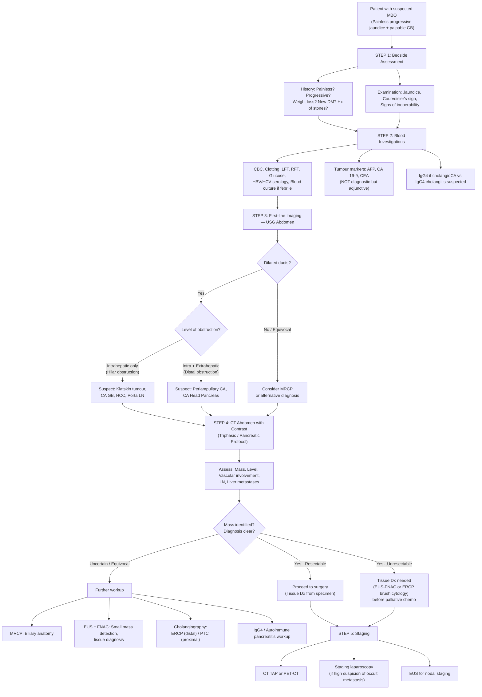

## Diagnosis of Malignant Biliary Obstruction — Criteria, Algorithm & Investigations

### 1. Diagnostic Approach — The Logic

There is no single "diagnostic criterion" for MBO the way there is for, say, acute cholangitis (Tokyo Guidelines) or PBC (AMA + ALP + histology). MBO is a **clinical-radiological diagnosis** — you put together the clinical picture (painless progressive jaundice, Courvoisier's sign) with biochemistry (cholestatic LFT) and imaging (dilated ducts + mass) to arrive at a diagnosis and then characterise the underlying malignancy.

The lecture frames the management approach in four sequential steps [20]:

> ***Management of MBO:*** [20]
> 1. ***Establish diagnosis***
> 2. ***Delineate level and cause of obstruction***
> 3. ***Treat suppurative cholangitis***
> 4. ***Definitive treatment***

And the learning objectives explicitly state [1]:

> ***Imagings for jaundice and epigastric mass*** [1]

So the diagnostic workup is systematically: **Clinical assessment → Bloods → Imaging (anatomical → cholangiographic → tissue) → Staging**. Let's go through each layer.

---

### 2. Physical Examination — What to Look For and Why

Physical examination in MBO is not just "ticking boxes" — each finding tells you something about the disease and its stage.

#### 2.1 General Examination [5]

| Finding | What It Tells You |
|---|---|
| **Jaundice** | Bilirubin > 50 μmol/L; sclera first (elastin affinity) → skin |
| **Cachexia** | Advanced malignancy; cancer cachexia (TNF-α, IL-6) + fat malabsorption |
| **Scratch marks (excoriation)** | Pruritus from bile salt deposition in skin — indicates significant cholestasis [5] |
| **Lymphadenopathy** | Check left supraclavicular (Virchow's node/Troisier's sign — thoracic duct drainage from abdominal malignancy), cervical, axillary |

#### 2.2 Abdominal Examination [5]

| Finding | Significance |
|---|---|
| ***Courvoisier's sign (palpable GB)*** | ***ALWAYS look for a palpable gallbladder in MBO*** [5]. Distal obstruction in previously normal GB. |
| **Hepatomegaly** | Biliary congestion, metastatic deposits, or HCC. **Irregular surface** = metastatic deposits or HCC [5] |
| **Stigmata of chronic liver disease** | Spider naevi, palmar erythema, gynaecomastia → suggests underlying cirrhosis (HCC more likely) |
| ***Signs of inoperability*** [5] | These are critical because finding them on examination means the cancer is **advanced/metastatic** and curative resection is not possible: |

***Signs of inoperability*** [5]:
- ***Irregular surface hepatomegaly*** — suggests metastatic liver deposits; irregular nodular surface
- ***Troisier's sign (Virchow's node)*** — left supraclavicular lymph node; indicates distant lymphatic spread via thoracic duct
- ***Blumer's shelf*** — palpable mass on digital rectal exam; peritoneal metastasis seeding to the rectovesical/rectouterine pouch (most dependent peritoneal recess)
- ***Sister Mary Joseph nodules*** — umbilical nodule; peritoneal metastasis tracking along the obliterated umbilical vein (ligamentum teres)
- ***Ascites*** — peritoneal carcinomatosis (malignant ascites)

<Callout title="Why These Signs Mean Inoperability">
Each sign represents **distant metastatic spread**: Virchow's node = distant lymphatic spread, Blumer's shelf and Sister Mary Joseph nodule = peritoneal seeding, irregular hepatomegaly = liver metastases, ascites = carcinomatosis. Any of these means the cancer has spread beyond what a surgeon can remove with curative intent. The operation would carry all the morbidity but provide no survival benefit.
</Callout>

---

### 3. Biochemical Investigations

#### 3.1 Blood Tests — The Rationale for Each

| Test | Expected Finding in MBO | Why Order It? (Pathophysiological Basis) |
|---|---|---|
| ***CBC with differentials*** | Pancytopenia (if underlying cirrhosis + hypersplenism); **leukocytosis** (if biliary sepsis); ***thrombocytopenia*** (important for planning invasive procedures like ERCP) [5] | Anaemia may indicate chronic disease or GI blood loss. Leukocytosis flags superimposed cholangitis. Platelets must be checked before ANY biliary instrumentation. |
| ***Clotting profile (PT/INR)*** | ***Prolonged PT/INR — coagulopathy due to Vitamin K deficiency from decreased absorption of fat-soluble vitamins due to obstructive jaundice*** [5] | Must be corrected with **parenteral Vitamin K** before any invasive procedure or surgery. If PT does NOT correct with Vitamin K → suspect hepatocellular dysfunction (worse prognosis). |
| ***LFT*** | ***↑ Bilirubin (conjugated/direct), ↑ ALP and GGT (cholestatic pattern)*** [5] | The **cholestatic pattern** (ALP/GGT ↑↑ > AST/ALT) distinguishes obstructive from hepatocellular jaundice. ALP is produced by bile duct epithelium in response to obstruction. GGT confirms the excess ALP is of **hepatobiliary origin** (not bone). [8] |
| ***HBV and HCV serology*** | May be positive | Screen for viral hepatitis — if positive, raises suspicion for HCC as the cause of MBO. Also important for perioperative planning. [5] |
| **RFT (Renal function)** | May show rising creatinine | Obstructive jaundice → cholemic nephrosis / hepatorenal vulnerability. Baseline essential before contrast imaging or surgery. |
| **Serum glucose** | May show new-onset hyperglycaemia | ***New-onset DM can be an early manifestation of occult pancreatic cancer*** [7]. Also important for perioperative glucose control. |
| **Serum amylase/lipase** | May be elevated | If pancreatic duct also obstructed → pancreatitis; or direct pancreatic parenchymal involvement [14] |
| **Serum albumin** | May be low | Marker of nutritional status and hepatic synthetic function. Low albumin = poor prognosis, higher operative risk. [7] |
| ***Serum IgG4*** | May be elevated | ***Evaluate for the possibility of IgG4-related sclerosing cholangitis*** [8] — this is a critical mimic of cholangiocarcinoma that responds to steroids instead of surgery |
| **Blood culture** | May be positive | ***Must order if fever/cholangitis suspected*** [13] — identify organism and guide antibiotic therapy |

#### 3.2 Tumour Markers

This is an area where students often get confused. Let's be crystal clear:

> ***Tumour markers such as AFP, CA 19-9, and CEA are NOT very useful for MBO as a screening tool and are not included in the initial testing.*** [5]
> ***Common tumour markers are neither sensitive nor specific for periampullary tumours.*** [5]
> ***Absence of an elevated tumour marker does not exclude underlying malignancy.*** [5]

The lecture slide provides a detailed marker table [18]:

| Marker | Upper Normal | Raised In Malignancy | Sensitivity | ***Non-malignant Causes of Elevation*** |
|---|---|---|---|---|
| ***AFP*** | 10 ng/mL | ***HCC (70–90%)***; cholangioCA (10%) | Moderate for HCC | ***Hepatitis, cirrhosis, biliary tract obstruction, ALD*** [18] |
| ***CEA*** | 5 ng/mL | ***CRC (30–70%)***; gastric, pancreatic, lung, breast CA | Low–moderate | ***Smoking, liver disease (obstructive jaundice, hepatitis, alcohol), bowel diseases, peptic ulcer, pancreatitis, renal failure*** [18] |
| ***CA 19-9*** | 37 U/mL | ***Pancreatic CA (72–79%)***, ***biliary CA (67–73%)***, gastric CA (42–62%), CRC (19–41%) | Moderate | ***Benign biliary diseases, benign pancreatic diseases*** [18] |
| ***CA 125*** | 35 U/mL | ***Ovarian CA (80%)***, pancreatic CA (60%), other GI malignancies | Variable | ***Benign pancreatic and liver disease*** [18] |
| ***DUPAN-2*** | 150 U/mL | ***Pancreatic and biliary tract CA (70%)*** | Moderate | ***Benign hepatobiliary diseases (hepatitis, cholelithiasis)*** [18] |

<Callout title="When ARE Tumour Markers Actually Useful?" type="idea">
While tumour markers are poor **screening/diagnostic** tools, they have specific roles:
1. ***Serial assay after resection*** — to monitor for disease **recurrence** (if initially elevated, a rising level post-resection suggests recurrence) [5] [7]
2. **Prognostic value** — high CA 19-9 at diagnosis correlates with worse prognosis in pancreatic CA [7]
3. **Differentiation** — AFP helps distinguish HCC from cholangiocarcinoma. If AFP is very high ( > 400 ng/mL) in a cirrhotic patient, think HCC. [18]
4. **Note**: CA 19-9 requires the **Lewis blood group antigen** to be expressed — Lewis-negative individuals (5–10% of population) will have falsely normal CA 19-9 even with pancreatic CA [7]
</Callout>

---

### 4. Imaging Investigations

This is the heart of the diagnostic workup. The lecture slide states [21]:

> ***Imaging:*** [21]
> - ***Ultrasound / CT***
> - ***Size of bile duct***
> - ***Level of obstruction***
> - ***Cause of obstruction***
> - ***Other associated features***
> - ***Malignant disease: staging***
> - ***Benign disease: gallstones > complications***

#### 4.1 Transabdominal Ultrasound (USG) — First-Line

**Why USG first?** It is non-invasive, widely available, cheap, no radiation, and excellent at detecting biliary dilatation and gallstones. It answers the first critical question: **Is there biliary obstruction?**

| Feature | Details |
|---|---|
| **Role** | ***Initial imaging modality*** for any patient with jaundice [5] [7] [21] |
| **What to look for** | ***Size of bile duct for any dilatation ± stones*** [5] |
| **Normal values** | ***Intrahepatic ducts: normally not visible on USG ( < 2–3 mm)*** [5]; ***CBD: > 0.8 cm (8 mm) is pathological*** [5] |
| **CBD size rule of thumb** | ***0.1 cm for every 10 years old*** (e.g., 6 mm at age 60 is upper normal) [20] — but this applies to post-cholecystectomy or age-related dilatation; in the context of jaundice, any dilatation with symptoms is significant |
| **Localising the level** | **Perihilar lesion** = intrahepatic duct dilatation with normal extrahepatic duct; **Distal lesion** = both intra- and extrahepatic duct dilatation [8] |
| **Identifying the cause** | Gallstones (echogenic focus with posterior acoustic shadow); mass lesion (hypoechoic pancreatic mass, GB mass, liver mass) |
| **Vascular assessment** | Duplex USG can evaluate portal vein and hepatic artery involvement — ***encasement, compression, or thrombosis of portal vein; encasement or occlusion of hepatic artery*** [8] |
| **Limitations** | ***Distal CBD often obscured by bowel gas*** [20]; operator-dependent; limited in obese patients; cannot stage distant disease well |

**Key USG finding**: ***Malignant obstruction is suggested by ductal dilatation ( > 6 mm in adults) in the absence of stones*** [8]

#### 4.2 CT Abdomen with Contrast — The Workhorse

CT is the **definitive cross-sectional imaging** for MBO. It simultaneously assesses: the mass, the level of obstruction, vascular involvement, lymph node status, and distant metastases.

***For pancreatic cancer specifically, the CT protocol is critical:*** [14]

> ***CT abdomen with contrast (pancreatic protocol) — thin-sliced triphasic (arterial + pancreatic + portovenous phases)*** [14]

| Phase | What It Shows | Why |
|---|---|---|
| **Arterial phase** | ***Enhancement of celiac axis, SMA, and peripancreatic arteries*** [7] | Assess for **arterial encasement** — determines resectability |
| **Venous/Pancreatic phase** | ***Attenuation difference between tumour and normal pancreas — increases lesion conspicuity*** [7] | Pancreatic adenocarcinoma is **hypoattenuating** (desmoplastic, hypovascular) relative to enhancing normal pancreatic parenchyma |
| **Portal venous phase** | ***Enhancement of SMV, splenic vein, and portal vein*** [7] | Assess for **venous encasement/thrombosis** — key for resectability |

**Key CT findings for different MBO causes:**

| Cause | Typical CT Findings |
|---|---|
| **CA head of pancreas** | ***Ill-defined hypoattenuating mass within the pancreas*** [7]; ***double-duct sign (dilated pancreatic duct + CBD)*** [14]; pancreatic duct cutoff; parenchymal atrophy; contour abnormalities [7] |
| **Cholangiocarcinoma (perihilar)** | Hilar mass with upstream intrahepatic duct dilatation; liver atrophy on the affected side; delayed enhancement (desmoplastic tumour) [8] |
| **Cholangiocarcinoma (intrahepatic)** | Mass lesion in non-cirrhotic liver; peripheral rim enhancement; capsular retraction [8] |
| **CA gallbladder** | GB wall thickening/mass ± invasion into liver segments IV/V; loss of fat plane with adjacent structures [10] |
| **HCC** | Arterial-phase hyperenhancement with washout in portal venous phase ("wash-in / wash-out"); cirrhotic liver background [4] |
| **Lymphadenopathy** | Enlarged porta hepatis / coeliac / para-aortic nodes |

> ***Determine resectability: encasement of SMA, hepatic artery, celiac trunk, SMV, PV*** [14] [3]

<Callout title="The Double-Duct Sign — Explain It From First Principles">
The **double-duct sign** means simultaneous dilatation of both the CBD and the main pancreatic duct. Why? The CBD and the main pancreatic duct both converge at the ampulla of Vater, running through/adjacent to the head of the pancreas. A mass in the pancreatic head compresses BOTH ducts simultaneously. This sign is highly suggestive of (though not pathognomonic for) **CA head of pancreas**. Other causes include ampullary carcinoma and chronic pancreatitis.
</Callout>

#### 4.3 Cholangiography — Delineating the Biliary Tree

Once USG/CT has confirmed obstruction and localised the level, you need detailed **mapping of the biliary anatomy** — this is essential for surgical planning.

##### A. MRCP (Magnetic Resonance Cholangiopancreatography) — Non-invasive [20]

- ***Non-contrast, T2-weighted*** MRI [20]
- ***Non-invasive imaging of biliary system and GB*** [20]
- ***Superior in delineating the anatomy of biliary tree*** especially if the system is not completely obstructed [7]
- ***Largely replaces ERCP as a diagnostic tool*** [5]
- ***Avoids complications associated with ERCP, but NOT therapeutic*** [20]
- **When to use**: Patients without high suspicion of biliary obstruction (mild bilirubin/ALP elevation, equivocal CT findings) [5]; when anatomy delineation is needed before surgery; when ERCP is not indicated therapeutically

##### B. ERCP (Endoscopic Retrograde Cholangiopancreatography) — Invasive, Diagnostic + Therapeutic

- ***ERCP is both diagnostic AND therapeutic*** [5]
- **Diagnostic**: Direct cholangiogram; brush cytology; forceps biopsy for tissue diagnosis
- **Therapeutic**: Biliary stent placement; sphincterotomy; stone extraction
- ***Preferred for distal tumours*** [3] — the scope goes through the mouth → oesophagus → stomach → D2 → accesses the ampulla → cannulates the CBD from below
- ***ERCP brush cytology / biopsy: can also relieve jaundice by placing temporary stent*** [14]
- **Complications**: Pancreatitis (most common), bleeding, cholangitis, perforation — this is why ERCP has ***evolved into a mainly therapeutic modality*** [7]

##### C. PTC / PTBD (Percutaneous Transhepatic Cholangiography / Biliary Drainage) — Invasive [20]

- **Diagnostic**: Visualisation of biliary tree by percutaneous needle insertion through the liver into a dilated intrahepatic duct, then injection of contrast
- **Therapeutic**: External bile drainage by catheter (PTBD) or insertion of indwelling stents
- ***Preferred to ERCP for stricture/obstruction at or above the level of confluence of hepatic ducts*** [20] — because ERCP approaches from below and may not be able to pass contrast above a complete hilar obstruction
  - ***Examples: cholangiocarcinoma, PSC, RPC*** [20]
- ***Complications: bacteraemia (thus antibiotic prophylaxis required), haemobilia*** [20]

<Callout title="ERCP vs PTC — When to Use Which?">
Think of it anatomically:
- **ERCP** approaches from **below** (through the ampulla) → best for **distal** obstruction (periampullary CA, distal CBD stone/tumour)
- **PTC** approaches from **above** (through the liver) → best for **proximal/hilar** obstruction (Klatskin tumour, PSC, RPC) where the distal CBD may be completely blocked and ERCP cannot get contrast above the stricture [3] [20]
</Callout>

#### 4.4 Endoscopic Ultrasound (EUS) ± FNAC / Biopsy

EUS combines endoscopy (placing a probe in the duodenum/stomach) with high-frequency ultrasound — giving you extremely close-up, high-resolution images of the pancreas, bile duct, and surrounding structures.

| Feature | Details |
|---|---|
| **Role** | ***Indicated for FNAC or trucut biopsy*** [5]; staging (local tumour extent, lymph node involvement) |
| **CA head of pancreas** | ***CA head of pancreas normally cannot be seen with OGD unless it has invaded through the wall of duodenum; EUS helps to acquire histological diagnosis*** [5]; ***detects small pancreatic masses that could be missed by CT*** [7] |
| **CA ampulla / CA duodenum** | ***NO role for EUS*** — these are visible directly on OGD (they are mucosal lesions at the ampulla/duodenal surface) [5] |
| **Cholangiocarcinoma** | ***EUS with brush cytology can be performed but with low sensitivity and specificity*** [5]; ***EUS cannot reach the lumen of bile duct in majority of cases → requires mother-baby cholangioscopy*** [5] |
| **Advantage over percutaneous biopsy** | ***EUS-guided FNAC/biopsy preferred over percutaneous USG/CT-guided biopsy*** — ***lower risk of tumour seeding*** [14] |

#### 4.5 Tissue Diagnosis — When Is It Mandatory?

This is a nuanced and commonly examined point:

> ***Tissue diagnosis is NOT mandatory if potentially resectable*** [14]

**Why not?** Because:
1. If imaging is classic for pancreatic CA and the tumour is resectable, **going to surgery provides both the definitive treatment AND the tissue diagnosis** (histology from the resected specimen)
2. Delaying surgery for a biopsy can set back treatment
3. Percutaneous biopsy carries risk of **tumour seeding** along the needle tract

**When IS tissue diagnosis indicated?** [7] [14]:
- CT failed to demonstrate typical features (uncertain diagnosis)
- Before starting **neoadjuvant chemotherapy** (need confirmed malignancy before giving toxic treatment)
- Suspected **secondary metastasis** to pancreas (need to identify the primary)
- To exclude **mimics** like autoimmune pancreatitis or chronic pancreatitis (which respond to steroids/medical treatment, NOT surgery) [7]
- Local evidence of **unresectability** on staging (patient will receive palliative chemo → need tissue confirmation first)

Methods of tissue diagnosis:
- ***EUS-guided FNAC/biopsy*** — preferred (less seeding risk) [14]
- **ERCP brush cytology / forceps biopsy** — can also relieve jaundice simultaneously [14]
- **CT-guided percutaneous biopsy** — higher seeding risk; used when EUS not available or not feasible
- ***Mother-baby cholangioscopy*** (SpyGlass) — for biliary strictures where EUS cannot reach the duct lumen [5]

#### 4.6 Staging Investigations

Once MBO is confirmed, staging determines **resectability** — this is the single most important question after diagnosis:

| Modality | What It Assesses |
|---|---|
| ***CT thorax + abdomen + pelvis (CT TAP)*** | Distant metastases (lung, liver, peritoneum) [14] |
| ***PET-CT (FDG)*** | ***Evaluate for occult distant metastasis that MRCP and MDCT are unable to detect*** [8]; particularly useful for cholangiocarcinoma and equivocal CT findings |
| ***Staging laparoscopy*** | ***General exploration of peritoneal surfaces*** to detect peritoneal/omental/liver surface metastases invisible on CT [7]. ***Indicated when there is high suspicion of metastatic disease***: body/tail tumours, large tumours > 4 cm, high CA 19-9, equivocal ascites/metastasis on CT [7] |
| ***EUS*** | ***Nodal involvement*** (local/regional LN staging) [3] |
| **MRCP** | ***Intrahepatic metastasis*** (for cholangioCA); biliary tree anatomy [3] |
| **Bone scan** | If bony metastases suspected (pain, elevated ALP out of proportion) |

---

### 5. The Diagnostic Algorithm — Putting It All Together

---

### 6. Special Investigation Scenarios by Suspected Malignancy

| Suspected Cause | Key Investigations | Rationale |
|---|---|---|
| **CA head of pancreas** | USG → ***triphasic CT (pancreatic protocol)*** → EUS-FNAC if tissue needed; ERCP only if stenting needed [14] | CT is both diagnostic and staging; EUS detects small tumours CT misses; ***tissue Dx NOT mandatory if resectable*** [14] |
| **Perihilar cholangioCA (Klatskin)** | USG → CT → ***MRCP*** (biliary anatomy) → ***PTC*** (preferred over ERCP for proximal obstruction) [3] [20]; ***PET-CT*** for occult metastases [8] | PTC approaches from above; MRCP maps extent of biliary involvement for Bismuth-Corlette staging |
| **Intrahepatic cholangioCA** | USG → CT/MRI (mass in non-cirrhotic liver) → ***CT-guided biopsy*** or EUS-FNAC; ***AFP*** (to differentiate from HCC) [8] [18] | Presents as a liver mass, not obstructive jaundice; AFP helps distinguish from HCC |
| **CA gallbladder** | USG → CT → ***MRI/MRCP*** → ***percutaneous biopsy*** if needed [10]; ***staging laparoscopy*** [10] | Often incidental finding on cholecystectomy specimen; if suspected pre-op, stage before surgery |
| **HCC** | USG → ***triphasic CT or MRI*** (arterial enhancement + washout) → ***AFP*** [4]; biopsy rarely needed if imaging classic + AFP elevated in cirrhotic patient | Diagnosis can be made on imaging criteria alone in cirrhotic patients (AASLD criteria: arterial hyperenhancement + washout) |
| **CA ampulla** | ***OGD with biopsy*** (directly visible at ampulla!) → CT for staging [5] | EUS has NO role here — the tumour is on the mucosal surface and directly accessible endoscopically |

<Callout title="Why OGD (Not EUS) for CA Ampulla?" type="idea">
The ampulla of Vater opens into the duodenal lumen. An ampullary carcinoma grows INTO the duodenal lumen and is **directly visible** when the endoscopist passes the scope to D2. You can see it, biopsy it, and make a tissue diagnosis immediately — no need for ultrasound through the wall. This is why the notes specifically state: ***NO role for EUS in diagnosing CA ampulla of Vater and CA duodenum*** [5].
</Callout>

---

### 7. Specific Imaging Findings — Interpretation Guide

#### 7.1 Ultrasound Findings

| Finding | Interpretation |
|---|---|
| Dilated intrahepatic ducts + normal CBD | **Hilar obstruction** (Klatskin, CA GB, HCC) |
| Dilated intrahepatic + extrahepatic ducts + distended GB | **Distal CBD obstruction** (periampullary CA) |
| ***Ductal dilatation > 6 mm without stones*** [8] | ***Suggests malignant obstruction*** |
| Hypoechoic pancreatic mass | CA head of pancreas |
| GB wall thickening / polypoid mass | CA gallbladder |
| Focal liver lesion in non-cirrhotic liver | Intrahepatic cholangioCA or metastasis |

#### 7.2 CT Findings

| Finding | Interpretation |
|---|---|
| ***Ill-defined hypoattenuating mass within the pancreas*** [7] | CA head of pancreas (hypovascular, desmoplastic) |
| ***Double-duct sign (dilated pancreatic duct + CBD)*** [7] [14] | CA head of pancreas (compresses both ducts through pancreatic head) |
| Pancreatic duct cutoff + parenchymal atrophy [7] | Upstream pancreatic duct dilatation → distal parenchymal atrophy from disuse |
| Arterial-phase hyperenhancement + portal venous washout | HCC (classic "wash-in / wash-out" pattern) |
| Delayed enhancement at hilum | Perihilar cholangioCA (desmoplastic tumour enhances late) |
| ***Encasement of SMA, hepatic artery, celiac trunk, SMV, PV*** [14] | ***Vascular encasement → unresectable*** |
| Liver metastases / peritoneal nodules / ascites | Distant metastases → unresectable |

#### 7.3 MRCP Findings

| Finding | Interpretation |
|---|---|
| Abrupt cutoff of CHD at bifurcation | Klatskin tumour |
| "Beaded" appearance of intrahepatic ducts | PSC (alternating strictures and dilatations) |
| Cystic dilatation of extrahepatic duct | Choledochal cyst |
| Smooth tapering of distal CBD | Pancreatic head mass compressing from outside |

#### 7.4 Cholangiographic Findings (ERCP/PTC)

| Finding | Interpretation |
|---|---|
| Irregular, asymmetric stricture | Malignant stricture (cholangioCA) |
| Smooth, concentric stricture | Benign stricture (PSC, post-surgical) |
| Rat-tail narrowing of distal CBD | Pancreatic head mass |
| No contrast passing above hilum | Complete hilar obstruction (Klatskin Type IV) |
| "Meniscus" sign at stone | CBD stone (smooth rounded filling defect) |

---

### 8. Criteria for Unresectability on Imaging [3] [7] [14]

This is critical because it determines whether the patient gets curative surgery or palliative care:

> ***Unresectable if:*** [3]
> - ***Invasion of major vessels (e.g., main PV, main hepatic artery, celiac trunk, SMA, SMV)*** [3] [14]
> - ***Extensive involvement of biliary tree (bilaterally > 2° radicles)*** [3]
> - ***LN metastasis (retropancreatic, paracoeliac, paraaortic)*** [3]
> - ***Distal organ metastasis (lung, peritoneum)*** [3]

For **pancreatic cancer specifically** [14]:
- **Borderline resectable**: Tumour abutting ( ≤ 180° contact) SMA/celiac axis or short-segment encasement of hepatic artery (without extension to celiac); SMV/PV involvement with potential for reconstruction
- **Unresectable (locally advanced)**: Tumour encasing ( > 180°) SMA/celiac axis; unreconstructable SMV/PV occlusion
- **Unresectable (metastatic)**: Any distant metastasis

---

### 9. Summary Table: Investigation Modalities at a Glance

| Modality | Invasive? | Diagnostic | Therapeutic | Best For | Limitations |
|---|---|---|---|---|---|
| **USG abdomen** | No | ✅ Duct dilatation, stones, mass | ✗ | ***First-line for jaundice*** | Distal CBD obscured by gas; operator-dependent |
| **CT triphasic** | No* | ✅ Mass, level, staging, vasculature | ✗ | ***Definitive cross-sectional imaging; resectability*** | Contrast → nephrotoxicity risk; radiation |
| **MRCP** | No | ✅ Biliary anatomy | ✗ | ***Non-invasive cholangiogram; replaces diagnostic ERCP*** | Not therapeutic; expensive; claustrophobia |
| **ERCP** | Yes | ✅ Cholangiogram, brush cytology, biopsy | ✅ Stent, sphincterotomy | ***Distal obstruction; therapeutic drainage*** | Pancreatitis risk; cannot access above complete hilar obstruction |
| **PTC/PTBD** | Yes | ✅ Cholangiogram | ✅ External drainage, stent | ***Proximal/hilar obstruction*** | Bacteraemia, haemobilia; external drain inconvenience |
| **EUS ± FNAC** | Yes | ✅ Small masses, LN staging, tissue Dx | ✗ | ***CA pancreas (tissue Dx with less seeding)*** | No role for CA ampulla/duodenum; cannot reach bile duct lumen |
| **OGD + biopsy** | Yes | ✅ Direct visualisation + biopsy | ✗ | ***CA ampulla, CA duodenum*** | Limited to mucosal/luminal lesions |
| **PET-CT** | No* | ✅ Occult distant metastases | ✗ | ***Cholangiocarcinoma staging; equivocal CT*** | Expensive; false positives with inflammation |
| **Staging laparoscopy** | Yes | ✅ Peritoneal disease | ✗ | ***High-risk patients (body/tail CA, large tumour, high CA 19-9)*** | Requires GA; decreasing role as CT quality improves |

---

<Callout title="High Yield Summary">

1. ***MBO management starts with: (1) Establish diagnosis, (2) Delineate level and cause, (3) Treat cholangitis, (4) Definitive treatment*** [20].

2. **Physical exam**: Always check for ***Courvoisier's sign*** and ***signs of inoperability*** (Virchow's node, Blumer's shelf, Sister Mary Joseph nodule, irregular hepatomegaly, ascites) [5].

3. **Bloods**: Cholestatic LFT pattern (↑ ALP, GGT, conjugated bilirubin); clotting profile (Vitamin K deficiency); ***tumour markers are NOT diagnostic*** — neither sensitive nor specific [5] [18].

4. ***USG is the first-line imaging*** — establishes duct dilatation, level, stones vs no stones. ***CBD > 0.8 cm is pathological; intrahepatic ducts normally not visible ( < 2–3 mm)*** [5].

5. ***CT triphasic (pancreatic protocol)*** is the definitive staging investigation — identifies mass, vascular involvement (resectability), LN, metastases [7] [14].

6. **Cholangiography**: ***MRCP*** for non-invasive biliary mapping; ***ERCP for distal obstruction (diagnostic + therapeutic)***; ***PTC for proximal/hilar obstruction*** [3] [20].

7. ***Tissue diagnosis is NOT mandatory if tumour is resectable*** — proceed to surgery. Tissue diagnosis needed for: uncertain diagnosis, neoadjuvant chemo, unresectable disease, suspected mimics (autoimmune pancreatitis, IgG4 cholangitis) [7] [14].

8. ***EUS-FNAC is preferred over percutaneous biopsy (lower tumour seeding risk)*** [14]; ***EUS has NO role for CA ampulla or CA duodenum*** (use OGD) [5].

9. **Staging**: CT TAP/PET-CT for distant mets; staging laparoscopy if high suspicion of peritoneal disease [7].

10. ***Unresectability criteria***: Major vessel encasement (SMA, celiac, PV, SMV), bilateral biliary involvement > 2° radicles, distant LN (retropancreatic, paracoeliac, paraaortic), organ metastasis [3] [14].

</Callout>

---

<ActiveRecallQuiz
  title="Active Recall - Diagnosis of MBO"
  items={[
    {
      question: "List the four sequential steps in the management/diagnostic approach to MBO as stated in the lecture.",
      markscheme: "(1) Establish diagnosis, (2) Delineate level and cause of obstruction, (3) Treat suppurative cholangitis, (4) Definitive treatment.",
    },
    {
      question: "What are the normal size limits for the intrahepatic ducts and CBD on USG? What constitutes pathological dilatation?",
      markscheme: "Intrahepatic ducts normally not visible on USG (less than 2-3 mm). CBD greater than 0.8 cm (8 mm) is pathological. Rule of thumb: 0.1 cm per 10 years of age as upper limit.",
    },
    {
      question: "Explain the double-duct sign. What pathology does it suggest and why?",
      markscheme: "Double-duct sign = simultaneous dilatation of both the common bile duct and main pancreatic duct. Suggests CA head of pancreas because a mass in the pancreatic head compresses both ducts as they converge at the ampulla of Vater. Can also be seen in ampullary carcinoma or chronic pancreatitis.",
    },
    {
      question: "When is tissue diagnosis NOT mandatory before surgery in suspected pancreatic cancer? When IS it indicated?",
      markscheme: "NOT mandatory if imaging is classic and tumour is potentially resectable - surgery provides both treatment and tissue diagnosis. IS indicated if: (1) CT findings atypical/uncertain, (2) before neoadjuvant chemotherapy, (3) suspected 2nd primary/metastasis to pancreas, (4) unresectable disease requiring palliative chemo confirmation, (5) differential includes autoimmune pancreatitis or chronic pancreatitis.",
    },
    {
      question: "Compare ERCP and PTC: which is preferred for proximal vs distal obstruction, and why?",
      markscheme: "ERCP preferred for distal obstruction - approaches from below through the ampulla, can cannulate and stent the distal CBD, and provides direct visualisation. PTC preferred for proximal/hilar obstruction (e.g., Klatskin tumour, PSC, RPC) - approaches from above through the liver into dilated intrahepatic ducts, can pass contrast above a complete hilar obstruction that ERCP cannot traverse from below.",
    },
    {
      question: "List four criteria for unresectability in cholangiocarcinoma/periampullary cancer.",
      markscheme: "(1) Invasion of major vessels: main portal vein, main hepatic artery, celiac trunk, SMA, SMV. (2) Extensive biliary involvement bilaterally beyond secondary radicles. (3) Distant lymph node metastasis: retropancreatic, paracoeliac, paraaortic. (4) Distant organ metastasis: lung, peritoneum, liver.",
    },
  ]}
/>

## References

[1] Lecture slides: WCS 056 - Painless jaundice and epigastric mass - by Prof R Poon.ppt (1).pdf, p3
[3] Senior notes: maxim.md, Cholangiocarcinoma section (investigations and management)
[4] Senior notes: maxim.md, Hepatocellular carcinoma section
[5] Senior notes: felixlai.md, Malignant biliary obstruction section (pp. 501–503)
[7] Senior notes: felixlai.md, Pancreatic cancer section (pp. 596–598)
[8] Senior notes: felixlai.md, Cholangiocarcinoma diagnosis section (pp. 549–551)
[10] Senior notes: maxim.md, CA gallbladder section
[13] Senior notes: felixlai.md, Acute cholangitis section; maxim.md, Acute cholangitis section
[14] Senior notes: maxim.md, Pancreatic carcinoma section (p. 146)
[18] Lecture slides: Malignant biliary obstruction.pdf, p8
[20] Senior notes: maxim.md, HBP investigations section; Lecture slides: Malignant biliary obstruction.pdf, p10 and p15
[21] Lecture slides: Malignant biliary obstruction.pdf, p10
