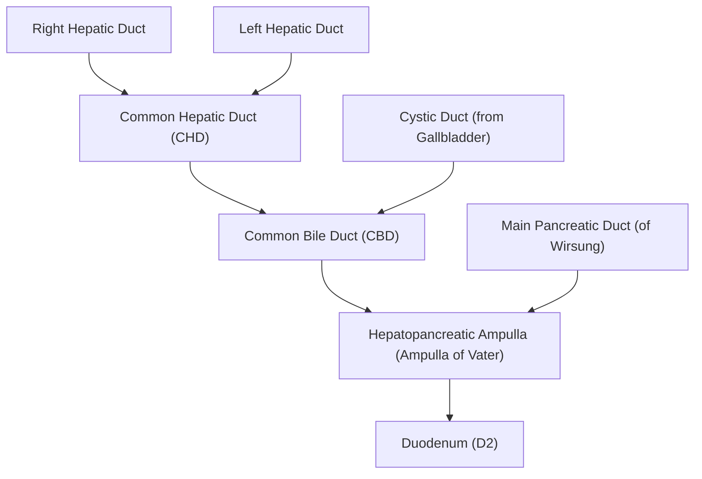
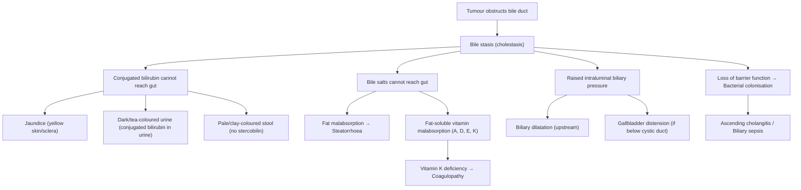

# Malignant Biliary Obstruction (MBO)

## 1. Definition

***Malignant biliary obstruction (MBO) refers to obstruction of the biliary tract by cancer growth within or around the biliary tract.*** [1]

Let's break the name down:
- **"Malignant"** = caused by cancer (as opposed to benign causes like gallstones or strictures)
- **"Biliary"** = relating to bile or the bile ducts (from Latin *bilis* = bile)
- **"Obstruction"** = blockage of flow

The key consequence is that bile — which is produced by hepatocytes and normally drains through the intrahepatic ducts → common hepatic duct → common bile duct → ampulla of Vater → duodenum — cannot reach the intestine. This causes **conjugated (direct) hyperbilirubinaemia** and the clinical syndrome of **obstructive jaundice**.

<Callout title="Clinical Pearl">
***Painless progressive obstructive jaundice in an elderly patient is malignant biliary obstruction until proven otherwise.*** [2] This is a classic exam stem and ward-round teaching point. The "painless" and "progressive" nature distinguishes it from gallstone disease, which typically causes episodic colicky pain.
</Callout>

---

## 2. Epidemiology

### Global & Hong Kong Context

- MBO is not a single disease — it is a clinical syndrome caused by various malignancies. Epidemiology therefore depends on the underlying cause.
- **Pancreatic cancer** (the most common cause of MBO) is the 4th–5th leading cause of cancer death globally and has been rising in Hong Kong.
- **Cholangiocarcinoma**: Perihilar cholangiocarcinoma (Klatskin tumour) is the most common subtype (≈60%) [3]. Intrahepatic cholangiocarcinoma has been increasing in incidence worldwide.
- **Hepatocellular carcinoma (HCC)**: The 5th most common cancer in Hong Kong and 3rd in cancer mortality [4]. HCC is disproportionately common in HK due to endemic hepatitis B.
- **Gallbladder carcinoma**: Female predominance (M:F = 1:2–3) [5]. 95% have co-existing gallstones.
- **Recurrent pyogenic cholangitis (RPC)** — also known as ***"Hong Kong disease" / oriental cholangiohepatitis*** [6] — is a significant risk factor for cholangiocarcinoma in the local population due to chronic biliary inflammation and intrahepatic stone disease.

### Age & Sex
- MBO as a whole predominantly affects **older adults** (> 60 years).
- Pancreatic cancer: **Male** predominance [7].
- Gallbladder cancer: **Female** predominance [5].
- Cholangiocarcinoma: slight male predominance overall.

---

## 3. Anatomy & Function of the Biliary System

Understanding the anatomy is absolutely essential to understanding where obstruction occurs and what it causes.

### 3.1 The Biliary Tree — From Liver to Duodenum

1. **Intrahepatic bile ducts**: Small bile canaliculi between hepatocytes → interlobular ducts → segmental ducts → **right and left hepatic ducts**
2. **Common hepatic duct (CHD)**: Formed by confluence (bifurcation) of right and left hepatic ducts at the **hepatic hilum**
3. **Cystic duct**: Drains the gallbladder and joins the CHD
4. **Common bile duct (CBD)**: Formed by junction of CHD + cystic duct. Approximately 7–8 cm long, runs in the **hepatoduodenal ligament** (free edge of lesser omentum), passes behind the first part of duodenum, through the head of pancreas
5. **Ampulla of Vater**: Where CBD and main pancreatic duct converge, opening into the second part of the duodenum (D2) at the major duodenal papilla
6. **Sphincter of Oddi**: Circular smooth muscle around the ampulla — controls bile and pancreatic juice flow into the duodenum

### 3.2 Regional Classification (Critical for MBO Localisation)

The biliary tree is divided into regions, and the level of obstruction determines which structures are dilated and which clinical features arise:

| Region | Anatomical Boundaries | Key Pathologies |
|---|---|---|
| **Intrahepatic** | Ducts proximal to CHD bifurcation | Intrahepatic cholangiocarcinoma, HCC, RPC, hepatic metastases |
| **Perihilar (Hilar)** | Between CHD bifurcation and cystic duct origin | ***Klatskin tumour***, CA gallbladder, Mirizzi syndrome, porta hepatis lymphadenopathy, PSC, RPC |
| **Mid-CBD** | Between cystic duct origin and upper border of pancreas | CA CBD, CA head of pancreas, lymphadenopathy |
| **Distal CBD** | From upper border of pancreas to ampulla | ***Periampullary carcinoma*** (CA head of pancreas, CA ampulla, CA distal CBD, CA duodenum), chronic pancreatitis, choledochal cysts |

<Callout title="Why does it matter WHERE the obstruction is?">
The level of obstruction determines:
1. **Which parts of the biliary tree are dilated** on imaging (e.g., intrahepatic dilatation only vs. both intra- and extrahepatic)
2. **Whether the gallbladder is distended** (obstruction below the cystic duct junction → GB distends = positive Courvoisier's sign)
3. **The surgical approach** (Whipple's for distal, hepatectomy ± bile duct resection for perihilar, etc.)
4. **Whether jaundice occurs at all** — obstruction of only ONE hepatic duct (e.g., just the right) will NOT cause jaundice because the contralateral lobe compensates by excreting bilirubin normally [8]
</Callout>

### 3.3 Key Anatomical Relationships

- The **hepatoduodenal ligament** (part of lesser omentum) contains the "portal triad": CBD (anterolateral), hepatic artery proper (anteromedial), portal vein (posterior). Tumours here can compress all three.
- The **head of the pancreas** wraps around the distal CBD — this is why even small pancreatic head tumours cause early biliary obstruction.
- The **ampulla of Vater** is the most distal point — tumours here present earliest with jaundice (and therefore have the best prognosis among periampullary carcinomas) because even tiny tumours obstruct the narrow ampullary lumen [5].

### 3.4 Functions of Bile

Understanding bile function explains the clinical consequences of obstruction:

| Bile Component | Function | Consequence When Obstructed |
|---|---|---|
| **Bile salts** | Emulsify dietary fats → enable fat absorption | **Steatorrhoea** (fatty, pale, foul-smelling stool), **fat-soluble vitamin malabsorption** (A, D, E, K) |
| **Conjugated bilirubin** | Excreted in bile → converted to urobilinogen/stercobilin in gut → gives stool its brown colour | **Pale stool** (no stercobilin), **dark/tea-coloured urine** (excess conjugated bilirubin spills into urine), **jaundice** |
| **Cholesterol & phospholipids** | Cholesterol excretion pathway | Cholesterol retention |
| **IgA & antimicrobial factors** | Mucosal defence in biliary tree | **Biliary sepsis risk** |
| **Alkaline fluid** | Neutralises gastric acid in duodenum | Impaired duodenal pH buffering |

---

## 4. Etiology (Causes of MBO)

### 4.1 Malignant Causes of Biliary Obstruction

These are the cancers that directly cause MBO. The lecture slides specifically list: [1] [9]

> ***Pathology causing malignant biliary obstruction:*** [1]
> - ***Carcinoma of duodenum***
> - ***Periampullary carcinoma***
> - ***Carcinoma of pancreas***
> - ***Lymphoma***
> - ***Carcinoma of gallbladder — cystic duct LN, direct infiltration of CBD, tumour fragments***
> - ***Cholangiocarcinoma at hilum, Klatskin tumour***
> - ***HCC — direct infiltration, compression, tumour fragments in CBD***

Let me elaborate on each:

#### A. Periampullary Carcinomas (Grouped Together)

These four tumours are grouped because their **presentation and management are similar** [5]:

| Tumour | Mechanism of Obstruction | Key Features |
|---|---|---|
| **CA head of pancreas** | Direct compression/invasion of distal CBD as it passes through pancreatic head | Most common cause of MBO overall; 70% of pancreatic cancers are in the head [7] |
| **CA ampulla of Vater** | Obstruction at the ampullary orifice | ***Best prognosis*** among periampullary CAs — presents earliest because even small tumours obstruct the narrow ampulla [5] |
| **CA distal CBD** | Intrinsic obstruction of distal CBD | Relatively uncommon as isolated entity |
| **CA duodenum** | Invasion into ampulla or compression of distal CBD | Rare; may also cause duodenal obstruction |

#### B. Cholangiocarcinoma (CC)

- **Definition**: Carcinoma of the bile duct; > 90% are **adenocarcinoma** [3] [8]
- **Klatskin tumour**: Specifically refers to cholangiocarcinoma at the **CHD bifurcation** (hepatic confluence) — usually perihilar type [3]
- **Mechanism**: Direct intrinsic obstruction of the bile duct lumen
- ***Obstruction of the bifurcation of left and right hepatic duct → jaundice in early stage*** [8]
- ***Intrahepatic cholangiocarcinoma will NOT cause jaundice*** since bilirubin can be reabsorbed and re-excreted through unaffected parts of the liver [8]
- Characterised by ***slow growth, high rate of local invasion, mucin production, and tendency to invade perineural sheath and spread along nerves*** [8]

**Bismuth-Corlette Classification** (for perihilar cholangiocarcinoma): [3]

| Type | Description |
|---|---|
| **I** | Below CHD bifurcation |
| **II** | Reaching CHD bifurcation |
| **IIIa** | Involves CHD and **right** hepatic duct |
| **IIIb** | Involves CHD and **left** hepatic duct |
| **IV** | Involves CHD, RHD and LHD / Multicentric |

#### C. Hepatocellular Carcinoma (HCC)

HCC causes MBO through several mechanisms [5]:
- ***Compression*** causing obstructive jaundice — usually when mass is situated near the confluence of left and right intrahepatic ducts
  - ***From anterior liver = Segment 4/5***
  - ***From posterior liver = Caudate segment (uncommon)***
- ***Spread to lymph nodes (porta hepatis) in liver hilum***
- ***Direct infiltration of CBD***
- ***Tumour fragments in CBD***

#### D. Carcinoma of the Gallbladder

Mechanism of MBO [5]:
- ***Spread to cystic duct lymph nodes***
- ***Direct infiltration of CBD***
- ***Tumour fragments in CBD***
- Direct extension into liver (adjacent segments IV & V) [10]

#### E. Secondary Causes
- ***Lymphoma*** [1]
- **Secondary hilar lymphadenopathy** from GI malignancy (e.g., colorectal cancer metastatic to porta hepatis nodes) [5]
- ***Carcinoma of stomach with metastatic lymph node in the porta hepatis*** [11]

### 4.2 Causes by Level of Obstruction

This is a clinically useful framework — when you see the imaging, you determine the level of dilatation and then generate your differential [5]:

| Level | Malignant Causes | Benign Causes |
|---|---|---|
| **Hilum** | CA gallbladder, HCC, Klatskin's tumour, porta lymphadenopathy | Mirizzi syndrome, PSC, RPC |
| **Mid-CBD** | CA CBD, CA head of pancreas, lymphadenopathy | — |
| **Distal CBD** | Periampullary carcinoma | Bile duct strictures, choledochal cysts, pancreatic cysts, chronic pancreatitis |

### 4.3 Benign Causes of Biliary Obstruction (Important Differentials)

These must be distinguished from MBO [5]:

- **Choledocholithiasis** (CBD stones) — most common cause of biliary obstruction overall
- **Benign strictures**: TB, autoimmune, iatrogenic (post-surgical), RPC
- **Primary biliary cholangitis (PBC)**
- **Primary sclerosing cholangitis (PSC)**
- **Chronic pancreatitis** / Pancreatic cysts
- **Mirizzi syndrome** — ***CHD obstruction caused by extrinsic compression from an impacted stone in Hartmann's pouch/cystic duct*** [12]
- Blood clot (haemobilia) / mucus / foreign body / tumour thrombus

<Callout title="Differentiating Stone vs Tumour — Key History Points" type="idea">
From the senior notes [2], important questions to differentiate:
- **Stone**: History of episodic **colicky pain** (waxing-waning), **fever** (cholangitis), **fluctuating jaundice** (stone moves = "ball-valve" effect), history of gallstones
- **Tumour**: ***Painless, progressive jaundice***, **weight loss**, **constitutional symptoms**, **new-onset diabetes** (pancreatic CA), **palpable gallbladder** (Courvoisier's sign)
- **Urine/stool changes**: Both cause tea-coloured urine and pale stools, but in tumour obstruction these are **progressive and persistent**; in stone disease they may fluctuate
</Callout>

---

## 5. Risk Factors for the Underlying Malignancies

Since MBO is caused by various cancers, we must understand the risk factors for each:

### 5.1 Cholangiocarcinoma Risk Factors [3] [8]

| Category | Risk Factor | Mechanism |
|---|---|---|
| **Cholestatic/Inflammatory** | ***Primary sclerosing cholangitis (PSC)*** | Chronic biliary inflammation → dysplasia → carcinoma; strong association especially with perihilar disease. PSC strongly associated with ulcerative colitis |
| | ***Recurrent pyogenic cholangitis (RPC)*** | Chronic intrahepatic stone disease → biliary stasis → recurrent inflammation |
| | Cholelithiasis / Hepatolithiasis | Chronic inflammation of bile ducts |
| **Congenital** | ***Choledochal cysts / Caroli's disease*** | Biliary stasis + chronic inflammation from reflux of pancreatic juice + abnormalities in bile salt transporter proteins |
| | ***Lynch syndrome (HNPCC)*** | Germline mutation in DNA mismatch repair genes → increased cancer risk |
| | Multiple biliary papillomatosis | Multiple adenomatous polyps in intrahepatic bile ducts |
| **Infectious** | ***Parasitic infection (liver flukes)*** | ***Clonorchis sinensis*** and ***Opisthorchis viverrini*** from undercooked freshwater fish → adult worms inhabit biliary system → chronic inflammatory state → malignant transformation |
| | Chronic liver disease (HBV, HCV) | Chronic hepatitis → cirrhosis → cholangiocarcinoma |
| **Chemical** | ***Thorotrast (thorium dioxide) exposure*** | Historical radiological contrast agent — radioactive α-emitter retained in reticuloendothelial system |
| **Metabolic** | Obesity, DM, metabolic syndrome | Chronic inflammation, insulin resistance |

### 5.2 Pancreatic Cancer Risk Factors [7]

| Non-Modifiable | Modifiable |
|---|---|
| Advanced age | ***Smoking*** (3x risk) |
| ***Male sex*** | Chronic pancreatitis |
| Non-O blood group | ***Diabetes mellitus*** (new-onset DM can be early sign of occult pancreatic CA) |
| Family history / Hereditary syndromes (Lynch, BRCA1/2, Peutz-Jeghers, FAMMM) | Obesity, physical inactivity |
| | Heavy alcohol |
| | High fat/protein diet, low fibre |
| | Pancreatic cysts (IPMN — most common neoplastic pancreatic cyst with high risk of malignant degeneration) |

### 5.3 Gallbladder Cancer Risk Factors [5] [10]

- ***Gallstones (95% of patients have gallstones)*** — strongest risk factor; larger and symptomatic stones carry higher risk
- ***Gallbladder polyps > 1 cm*** — prophylactic cholecystectomy recommended
- ***Porcelain gallbladder*** — calcified GB wall from chronic cholecystitis → ***ALL porcelain gallbladders should be removed*** (absolute indication for cholecystectomy) [5]
- ***Primary sclerosing cholangitis***
- ***Abnormal pancreaticobiliary junction*** — long common channel → reflux of pancreatic juice into biliary tree
- ***Choledochal cysts***

### 5.4 HCC Risk Factors [4]

- **Any cause of cirrhosis**: HBV (most common in HK), HCV, ALD, NAFLD, Wilson's disease, PBC, PSC
- HBV is carcinogenic even without cirrhosis (HBV DNA integration → direct DNA damage)
- Aflatoxin exposure
- Smoking, alcohol, obesity, DM

---

## 6. Pathophysiology

### 6.1 Normal Bile Flow and Barrier Mechanisms

To understand what goes wrong, we first need to know what keeps things working normally [13]:

- **Continuous flushing action of bile** — physically washes away bacteria
- **Bacteriostatic activity of bile salts** — bile salts are inherently antimicrobial
- **Biliary mucous and secretory IgA** — anti-adherence factors preventing bacterial colonisation
- **Sphincter of Oddi** — acts as a mechanical barrier to ascending duodenal reflux and bacterial infection

### 6.2 Consequences of Malignant Biliary Obstruction

When a tumour obstructs the biliary tree, a cascade of pathophysiological consequences follows:

### 6.3 Manifestations of Pathophysiological Disturbance

The lecture specifically highlights these consequences [1] [9]:

#### ***A. Bleeding Tendency*** [5]
- **Why?** Vitamin K is a fat-soluble vitamin (along with A, D, E). Bile salts are required for fat emulsification and absorption in the small intestine. Without bile reaching the gut, fat-soluble vitamins cannot be absorbed.
- Vitamin K is a cofactor for hepatic synthesis of clotting factors **II, VII, IX, X** (and proteins C and S).
- ***Vitamin K deficiency → impaired clotting factor synthesis → coagulopathy → bleeding tendency***
- This is a **correctable** coagulopathy — give **parenteral (IV/IM) vitamin K** (not oral, because oral vitamin K still requires bile salts for absorption!)

<Callout title="Exam Trap" type="error">
Do NOT confuse the coagulopathy of obstructive jaundice (vitamin K deficiency — correctable with IV vitamin K) with the coagulopathy of liver failure (impaired synthetic function — NOT correctable with vitamin K alone because the hepatocytes themselves are damaged). The **response to parenteral vitamin K** is a useful clinical test to distinguish these.
</Callout>

#### ***B. Infection (Biliary Sepsis)*** [5] [9]

***Causes of mortality in MBO include: biliary sepsis, cancer cachexia, and liver failure.*** [9]

- ***Endotoxaemia*** — the liver normally clears gut-derived endotoxins (lipopolysaccharide from Gram-negative bacteria) via the reticuloendothelial system (Kupffer cells). In biliary obstruction, this function is impaired.
- ***Impaired reticuloendothelial function*** — Kupffer cells in the obstructed liver are dysfunctional
- ***Impaired cell-mediated immunity*** — obstructive jaundice suppresses T-cell and NK cell function
- Combined with loss of the biliary barrier (bile salts, IgA, sphincter of Oddi function), there is high susceptibility to **ascending cholangitis** and **bacteraemia**

The common organisms are [13]:
- **Gram-negative**: *E. coli*, *Klebsiella pneumoniae*, *Enterobacter* spp., *Bacteroides fragilis*
- **Gram-positive**: *Enterococcus* spp.
- **If stent present**: *Pseudomonas* (biofilm former on foreign bodies)

#### ***C. Poor Wound Healing / Poor Anastomotic Healing*** [5]
- ***Impaired protein synthesis*** — the obstructed, cholestatic liver has reduced synthetic function
- Malnutrition from cancer cachexia + fat malabsorption compounds this
- This is why MBO patients are **high-risk surgical candidates** [1]

#### ***D. Liver Failure*** [9]
- Prolonged biliary obstruction → secondary biliary cirrhosis
- Progressive hepatocyte damage from retained bile acids (which are cytotoxic)
- Combined with biliary sepsis → hepatocellular damage → liver failure

#### ***E. Renal Failure (Hepatorenal Syndrome / Cholemic Nephrosis)***
- Conjugated bilirubin and bile acids are directly nephrotoxic
- Endotoxaemia causes renal vasoconstriction
- Patients with obstructive jaundice are at high risk of post-operative acute kidney injury — this is why **aggressive hydration** and **avoidance of nephrotoxins** are critical peri-operatively

### 6.4 Why MBO Patients Are High-Risk Surgical Candidates

***The lecture emphasises: operative risk and strategy to reduce the risk.*** [1]

The combination of:
1. **Coagulopathy** (vitamin K deficiency)
2. **Immunosuppression** (impaired reticuloendothelial function, impaired cell-mediated immunity)
3. **Impaired wound/anastomotic healing** (poor protein synthesis)
4. **Renal vulnerability** (cholemic nephrosis)
5. **Malnutrition** (cancer cachexia + fat malabsorption)
6. **Liver dysfunction** (cholestasis ± secondary biliary cirrhosis)

...makes these patients among the highest-risk in surgery. Perioperative optimisation is crucial.

---

## 7. Classification

### 7.1 By Underlying Pathology

As detailed in Section 4.1 above.

### 7.2 By Level of Obstruction [5]

| Level | Imaging Findings | Key Causes |
|---|---|---|
| **Intrahepatic** | Dilated intrahepatic ducts ONLY; CBD normal | Intrahepatic CC, HCC |
| **Hilar** | Dilated intrahepatic ducts; CBD normal or mildly dilated; GB may not be distended | Klatskin tumour, CA GB, HCC near hilum |
| **Distal** | Dilated intrahepatic AND extrahepatic ducts; **GB distended** (Courvoisier's) | Periampullary CA, CA head of pancreas |

### 7.3 Bismuth-Corlette Classification (Perihilar Cholangiocarcinoma)

As detailed in Section 4.1B above. This classification guides surgical planning — determines how much liver and bile duct needs resection. [3]

### 7.4 ***Pathology Producing Jaundice AND Epigastric Mass*** [11]

The lecture slide specifically lists scenarios where a patient presents with **both jaundice AND an epigastric mass**:

> ***Pathology producing jaundice and epigastric mass:*** [11]
> - ***Hepatomegaly secondary to biliary obstruction***
> - ***Hepatomegaly due to metastases or HCC***
> - ***Lymph node metastases to the coeliac axis or porta hepatis***
> - ***Carcinoma of stomach with metastatic lymph node in the porta hepatis***
> - ***Distended stomach due to duodenal obstruction by tumour which obstructs the bile duct as well***

---

## 8. Clinical Features

### 8.1 Symptoms

| Symptom | Pathophysiological Basis |
|---|---|
| ***Painless progressive jaundice*** | Gradual tumour growth → slowly progressive obstruction. **Painless** because there is no acute distension or inflammation (unlike gallstone colic). The jaundice is **progressive** because the tumour grows relentlessly. This is THE hallmark symptom. [2] |
| ***Tea-coloured / dark urine*** | Conjugated (water-soluble) bilirubin cannot drain into the gut → accumulates in blood → filtered by kidneys → excreted in urine, giving it a dark tea/cola colour [5] [8] |
| ***Pale / clay-coloured stool (acholic stool)*** | Bilirubin cannot reach the gut → no conversion to stercobilin (which normally gives stool its brown colour) → pale, putty-like stool [5] [8] |
| **Steatorrhoea** | Bile salts cannot reach the duodenum → impaired fat emulsification → fat malabsorption → floating, foul-smelling, difficult-to-flush stool [2] |
| ***Pruritus*** | Bile salts accumulate in the blood and deposit in the skin → stimulate sensory nerve endings. Can be intensely distressing and precede visible jaundice. [8] |
| ***Weight loss / anorexia (constitutional symptoms)*** | Cancer cachexia (cytokine-mediated — TNF-α, IL-6) + fat malabsorption + anorexia [5] [7] |
| **Epigastric/RUQ pain** | Late feature in MBO (unlike gallstone disease). When present: tumour invasion of retroperitoneal structures (especially in pancreatic body/tail CA — ***severe epigastric pain radiating to the back*** from retroperitoneal/coeliac plexus infiltration) [7] [14] |
| ***New-onset diabetes mellitus*** | Specific to pancreatic cancer — destruction of islet cells by tumour or tumour-associated insulin resistance. New-onset DM in elderly can be early manifestation of occult pancreatic CA [7] |
| **Nausea and vomiting** | If tumour also causes duodenal/gastric outlet obstruction (especially CA head of pancreas — ***distended stomach due to duodenal obstruction by tumour which obstructs the bile duct as well***) [11] |
| **Fever/rigors** | If secondary cholangitis develops (biliary sepsis). Note: isolated MBO without infection = **no fever**. Fever suggests superimposed infection [13] |
| ***Symptoms of pancreatic insufficiency*** | Steatorrhoea, maldigestion, malabsorption — if pancreatic duct also obstructed (double duct sign) [14] |
| ***Trousseau syndrome*** | Pancreatic cancer: hypercoagulable state → ***migratory superficial thrombophlebitis*** (a paraneoplastic phenomenon). "Trousseau" = Greek physician who described this and ironically died of it [14] |

<Callout title="The Classic Exam Presentation">
A 65-year-old man presents with progressive yellowing of the eyes for 3 weeks, dark urine, pale stools, 5 kg weight loss, and no pain. On examination, the gallbladder is palpable. → This is **MBO (likely CA head of pancreas) until proven otherwise.**
</Callout>

### 8.2 Signs

| Sign | Pathophysiological Basis |
|---|---|
| ***Jaundice (yellow sclera and skin)*** | Bilirubin > 50 μmol/L becomes clinically detectable [2]. Sclera affected first because bilirubin has high affinity for elastin (sclera is rich in elastic fibres). |
| ***Palpable, non-tender gallbladder (Courvoisier's sign)*** | ***Courvoisier's Law: "In painless jaundice, if the gallbladder is palpable, it is unlikely to be due to gallstones"*** → **points towards malignant biliary obstruction** [5] [12]. **Why?** Gallstones develop chronically → repeated cholecystitis → fibrosed, contracted gallbladder → CANNOT distend. Malignant obstruction develops over weeks-months in a previously **normal, compliant gallbladder** → back-pressure → GB distends. |
| **Hepatomegaly** | ***Hepatomegaly secondary to biliary obstruction*** (congested, cholestatic liver) OR ***hepatomegaly due to metastases or HCC*** [11] |
| ***Epigastric mass*** | Could be: distended GB, hepatomegaly, enlarged lymph nodes at porta hepatis/coeliac axis, or ***distended stomach*** (from duodenal obstruction) [11] |
| **Scratch marks (excoriation)** | Secondary to pruritus from bile salt deposition in skin |
| **Cachexia / muscle wasting** | Cancer cachexia + malnutrition |
| **Ascites** | Peritoneal metastases (carcinomatosis) or portal hypertension from hepatic/portal vein invasion |
| **Bruising / petechiae** | Coagulopathy from vitamin K deficiency |
| ***Signs of metastasis*** | Virchow's node (left supraclavicular — "Troisier's sign"), Sister Mary Joseph nodule (umbilical metastasis), Blumer's shelf (palpable mass on rectal exam from pelvic peritoneal metastasis), Krukenberg tumour (ovarian metastasis), hepatomegaly (liver metastasis) |
| **Succussion splash** | If gastric outlet obstruction present (distended stomach with retained fluid) [15] |

<Callout title="Courvoisier's Law — Know the Exceptions!" type="error">
***Exceptions to Courvoisier's Law*** (palpable GB WITH gallstone disease) [5] [12]:
1. ***Double impaction***: One stone at CBD causing jaundice + another at cystic duct causing GB distension (mucocele in a fibrotic GB)
2. ***Mirizzi syndrome***: Stone impacted at Hartmann's pouch/cystic duct → extrinsic compression of CHD (jaundice + palpable GB — because the essential pathology is CHD compression, NOT chronic cholecystitis)
3. ***Recurrent pyogenic cholangitis (RPC)***: Essential pathology is in bile duct, NOT gallbladder → CBD obstruction by intrahepatic stones → jaundice WITHOUT chronic cholecystitis → GB not fibrosed → can distend [5]
</Callout>

### 8.3 Distinguishing Medical vs Surgical Jaundice on History [2]

| Feature | Medical (Pre-hepatic/Hepatic) | Surgical (Obstructive) |
|---|---|---|
| **Urine colour** | Normal | ***Tea-coloured*** |
| **Stool colour** | Normal | ***Pale-coloured*** |
| **Steatorrhoea** | Absent | Present (floating, foul-smelling, difficult to flush) |
| **Pruritus** | Uncommon (except intrahepatic cholestasis) | Common and prominent |
| **Associated features** | Pre-hepatic: palpitations, dizziness (haemolysis). Hepatic: fever, RUQ pain, N/V (hepatitis) | Progressive jaundice, weight loss, palpable GB |

### 8.4 Distinguishing Stone vs Tumour [2]

| Feature | Gallstone | Tumour |
|---|---|---|
| **Pain** | Colicky, episodic | ***Painless*** (or constant dull ache if advanced) |
| **Jaundice course** | **Fluctuating** (stone acts as ball-valve) | ***Progressive*** |
| **Fever** | Common (cholangitis) | Uncommon unless superimposed cholangitis |
| **GB palpable** | Usually NOT (fibrosed) | Often YES (Courvoisier's) |
| **Weight loss** | Minimal | Significant |
| **Age** | Any | Typically elderly |

---

## 9. Specific Clinical Features by Underlying Malignancy

### 9.1 Pancreatic Cancer [7] [14]

- ***Painless progressive obstructive jaundice*** (tumour at **head** — 70%)
- ***Severe epigastric pain radiating to the back*** (tumour at **body/tail** — retroperitoneal infiltration of coeliac plexus)
- Constitutional symptoms (weight loss, anorexia)
- ***Symptoms of pancreatic insufficiency***: steatorrhoea, maldigestion, malabsorption, **new-onset DM**
- Acute pancreatitis / gastric outlet obstruction (GOO)
- ***Paraneoplastic manifestations***: Trousseau syndrome (migratory superficial thrombophlebitis), paraneoplastic pemphigoid [14]
- **Double duct sign** on imaging — dilated pancreatic duct + dilated CBD (both ducts compressed by pancreatic head mass)
- Sites of metastasis: liver, peritoneum, lung, bone

### 9.2 Cholangiocarcinoma [3] [8]

- ***Jaundice: ONLY in extrahepatic (perihilar/distal) cholangiocarcinoma***
- ***Intrahepatic cholangiocarcinoma will NOT cause jaundice*** (bilirubin reabsorbed and re-excreted through unaffected liver) — instead presents as a liver mass
- ***Dark urine and pale stools*** (extrahepatic cholestasis)
- Pruritus, RUQ pain, fever (if cholangitis), weight loss
- Haemobilia (UGIB from biliary tree) — uncommon [3]
- Hepatomegaly (intrahepatic type)
- Palpable GB (Courvoisier's law — if distal tumour) [3]

### 9.3 Gallbladder Cancer [5] [10]

- ***Early stage: often asymptomatic or mimics cholelithiasis/cholecystitis*** (biliary colic, RUQ pain)
- ***Late stage: obstructive jaundice, palpable mass, constitutional symptoms***
- ***Metastasis: direct extension into liver (segments IV & V), peritoneal seeding*** [10]
- Ascites, dyspnoea/cough/haemoptysis (distant metastases) [5]

### 9.4 HCC [4]

- RUQ pain ± right shoulder pain (Glisson's capsule distension)
- Hepatomegaly
- ***Obstructive jaundice: NOT common*** — occurs only when mass near confluence or by tumour fragments/direct infiltration of CBD
- Deranged LFT in cirrhotic patients: encephalopathy, coagulopathy, portal HT (ascites, oedema, variceal bleeding)
- Paraneoplastic syndromes: erythrocytosis (EPO), hypoglycaemia (IGF-2), hypercalcaemia (PTHrP)
- Ruptured HCC (haemoperitoneum — surgical emergency)

---

## 10. Important Concepts — Tying It Together

### 10.1 The "Why" Behind Painless Jaundice

The reason MBO causes **painless** jaundice is fundamentally about the **speed of obstruction**:
- Gallstones cause **acute**, **sudden** obstruction → rapid biliary distension → **pain** (visceral pain from stretching of bile duct wall)
- Malignant tumours grow **slowly** → gradual obstruction → bile ducts have time to dilate and accommodate → **no acute pain**
- The gallbladder similarly has time to distend gradually → **painless, palpable GB**

### 10.2 Why CA Ampulla Has the Best Prognosis

The ampulla of Vater is the **narrowest point** of the entire biliary/pancreatic drainage system. Even a **tiny** tumour here will cause obstruction → **early jaundice** → **early presentation** → **earlier diagnosis** → **better stage at diagnosis** → **better prognosis** [5].

In contrast, pancreatic body/tail tumours have no nearby duct to obstruct early, so they present late with pain and metastases.

### 10.3 ***Causes of Mortality in MBO*** [9]

> ***The three main causes of death in MBO are:***
> 1. ***Biliary sepsis***
> 2. ***Cancer cachexia***
> 3. ***Liver failure***

---

<Callout title="High Yield Summary">

1. **Definition**: MBO = obstruction of the biliary tract by cancer growth within or around it. ***Painless progressive obstructive jaundice in elderly = MBO until proven otherwise.***

2. **Key Causes** (from lecture slides): ***CA duodenum, periampullary CA, CA pancreas, lymphoma, CA gallbladder (cystic duct LN, direct CBD infiltration, tumour fragments), cholangiocarcinoma at hilum (Klatskin tumour), HCC (direct infiltration, compression, tumour fragments in CBD).***

3. **Anatomy**: Know the biliary tree from intrahepatic ducts → CHD → CBD → Ampulla of Vater. Level of obstruction determines clinical features and imaging findings.

4. **Pathophysiology of obstruction**: Bile stasis → jaundice, dark urine, pale stool, steatorrhoea, fat-soluble vitamin malabsorption (especially Vitamin K → coagulopathy), loss of biliary barrier → cholangitis/sepsis, impaired immunity, poor wound healing, renal vulnerability.

5. ***Causes of mortality in MBO: biliary sepsis, cancer cachexia, liver failure.***

6. **Courvoisier's Law**: In painless jaundice + palpable GB → unlikely gallstones → think MBO. Exceptions: double impaction, Mirizzi syndrome, RPC.

7. **Clinical differentiation**: Stone = painful, fluctuating jaundice, fever. Tumour = painless, progressive jaundice, weight loss, palpable GB.

8. **Bismuth-Corlette**: Classification of perihilar cholangiocarcinoma (Types I–IV) — essential for surgical planning.

9. ***Jaundice + epigastric mass***: Hepatomegaly (obstruction/metastases/HCC), porta hepatis lymphadenopathy, distended stomach from duodenal obstruction.

10. **MBO patients are high-risk surgical candidates** due to coagulopathy, immunosuppression, poor wound healing, renal vulnerability, malnutrition, and liver dysfunction.

</Callout>

---

<ActiveRecallQuiz
  title="Active Recall - Malignant Biliary Obstruction"
  items={[
    {
      question: "State Courvoisier's Law and explain the pathophysiological basis. Name three exceptions.",
      markscheme: "In painless jaundice, if the gallbladder is palpable, it is unlikely due to gallstones (points to MBO). Basis: chronic gallstones cause repeated cholecystitis leading to fibrosed, contracted GB that cannot distend; malignant obstruction occurs in a normal compliant GB that can distend. Exceptions: (1) Double impaction (stone at CBD + stone at cystic duct), (2) Mirizzi syndrome, (3) Recurrent pyogenic cholangitis (RPC).",
    },
    {
      question: "List the pathophysiological disturbances caused by MBO and the mechanism for each.",
      markscheme: "(1) Bleeding tendency - Vitamin K deficiency from impaired fat-soluble vitamin absorption due to lack of bile salts in gut, leading to reduced synthesis of factors II, VII, IX, X. (2) Biliary sepsis/infection - endotoxaemia from impaired reticuloendothelial function and impaired cell-mediated immunity plus loss of biliary barrier. (3) Poor wound healing - impaired hepatic protein synthesis plus malnutrition. (4) Liver failure - prolonged obstruction causing secondary biliary cirrhosis and bile acid cytotoxicity. (5) Renal failure - conjugated bilirubin and bile acid nephrotoxicity plus endotoxaemia-mediated renal vasoconstriction.",
    },
    {
      question: "List the malignant causes of biliary obstruction and the mechanism by which each causes obstruction.",
      markscheme: "(1) CA head of pancreas - direct compression/invasion of distal CBD. (2) Cholangiocarcinoma/Klatskin tumour - intrinsic obstruction at hilum. (3) HCC - compression near confluence, direct CBD infiltration, tumour fragments in CBD, porta hepatis lymphadenopathy. (4) CA gallbladder - cystic duct LN spread, direct CBD infiltration, tumour fragments. (5) Periampullary CA (ampulla, distal CBD, duodenum) - obstruction at ampullary/distal level. (6) Lymphoma. (7) Secondary hilar lymphadenopathy from GI malignancy.",
    },
    {
      question: "Why does intrahepatic cholangiocarcinoma NOT typically cause jaundice while perihilar cholangiocarcinoma does?",
      markscheme: "Intrahepatic cholangiocarcinoma obstructs only segmental/sectoral ducts; bilirubin from those segments is reabsorbed into the blood and re-excreted through unaffected parts of the liver via patent ducts, so total bilirubin does not rise significantly. Perihilar cholangiocarcinoma (Klatskin tumour) obstructs the confluence of the right and left hepatic ducts, blocking drainage from both lobes, so bilirubin cannot be excreted at all, leading to jaundice.",
    },
    {
      question: "Name the three main causes of mortality in MBO. For biliary sepsis, explain why MBO patients are particularly susceptible.",
      markscheme: "Three causes: (1) Biliary sepsis, (2) Cancer cachexia, (3) Liver failure. Susceptibility to biliary sepsis: biliary stasis removes the flushing action of bile, bile salts bacteriostatic effect is lost, secretory IgA reduced, sphincter of Oddi barrier may be disrupted (especially post-ERCP/stenting). Additionally, impaired reticuloendothelial (Kupffer cell) function reduces clearance of gut endotoxins, and impaired cell-mediated immunity (T-cell/NK cell suppression) from obstructive jaundice.",
    },
    {
      question: "A 70-year-old presents with painless progressive jaundice and a palpable gallbladder. How would you differentiate between gallstone disease and malignant obstruction based on history and examination?",
      markscheme: "Tumour: painless, progressive jaundice, significant weight loss, palpable non-tender GB (Courvoisier's), new-onset DM (if pancreatic), no fever unless superimposed cholangitis. Stone: colicky episodic pain, fluctuating jaundice (ball-valve effect), fever and rigors (cholangitis), GB usually NOT palpable (fibrosed from chronic cholecystitis). Both have tea-coloured urine and pale stools, but in tumour these are persistent and progressive while in stone disease they may fluctuate.",
    },
  ]}
/>

---

## References

[1] Lecture slides: WCS 056 - Painless jaundice and epigastric mass - by Prof R Poon.ppt (1).pdf, p2–3
[2] Senior notes: maxim.md, Section 5.3 Obstructive jaundice
[3] Senior notes: maxim.md, Cholangiocarcinoma section
[4] Senior notes: maxim.md, Hepatocellular carcinoma section
[5] Senior notes: felixlai.md, Malignant biliary obstruction section (pp. 498–505)
[6] Senior notes: maxim.md, Recurrent pyogenic cholangitis section
[7] Senior notes: felixlai.md, Pancreatic cancer section (p. 591)
[8] Senior notes: felixlai.md, Cholangiocarcinoma clinical manifestation section (p. 548)
[9] Lecture slides: Malignant biliary obstruction.pdf, p29
[10] Senior notes: maxim.md, CA gallbladder section
[11] Lecture slides: WCS 056 - Painless jaundice and epigastric mass - by Prof R Poon.ppt (1).pdf, p32
[12] Senior notes: maxim.md, Courvoisier's Law note (p. 130); felixlai.md, Courvoisier's Law (p. 567)
[13] Senior notes: felixlai.md, Acute cholangitis section (p. 520)
[14] Senior notes: maxim.md, Pancreatic carcinoma section (p. 146)
[15] Senior notes: maxim.md, Gastric outlet obstruction section (p. 130)
