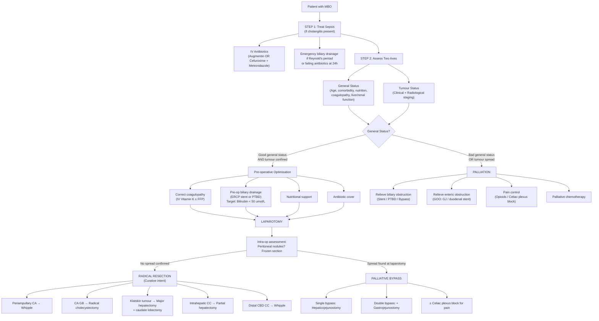

## Management of Malignant Biliary Obstruction

### 1. The Management Framework — Thinking From First Principles

The management of MBO follows a clear logical sequence. You cannot just "operate" — these patients are among the highest-risk in all of surgery. The lecture provides the overarching framework [20]:

> ***Management:*** [20]
> 1. ***Establish diagnosis***
> 2. ***Delineate level and cause of obstruction***
> 3. ***Treat suppurative cholangitis***
> 4. ***Definitive treatment***

And a more granular decision-making algorithm from the lecture slides [22]:

> ***MBO → Treat SEPSIS → (1) Assess tumour resectability, (2) Patient general fitness, (3) Liver function reserve → Resectable vs Non-resectable → Palliation*** [22]

The key decision point is a **two-axis assessment** [5]:

| Axis | Good | Bad | Outcome |
|---|---|---|---|
| ***General status*** | Fit, good nutrition, no major comorbidity | Cachectic, significant comorbidity | Bad → Palliation (PTBD or endoprosthesis) |
| ***Tumour status*** | Confined (no metastases, resectable) | Spread (metastases, unresectable) | Spread → Palliation |
| Both good + confined | → | ***Laparotomy*** → Radical resection if confirmed confined; Bypass if found to have spread [5] | |

---

### 2. The Master Management Algorithm

---

### 3. Step 1 — Treat Sepsis First

Before ANY definitive treatment decision, you must address superimposed **biliary sepsis** (cholangitis), which is life-threatening:

> ***Palliative care: Treat sepsis, Relieve obstruction (enteric/biliary), Pain control*** [23]

**Antibiotics** [5]:
- ***Augmentin (amoxicillin-clavulanate) OR Cefuroxime (Zinacef) + Metronidazole (Flagyl)*** [5]
- Why these agents? They cover the typical biliary pathogens: Gram-negative rods (*E. coli*, *Klebsiella*) + anaerobes (*Bacteroides*) + Enterococci [13]
- For severe sepsis/shock: escalate to ***IV Tazocin (piperacillin-tazobactam)*** [13]

**Emergency biliary drainage** [13]:
- Indicated if: ***Reynold's pentad*** (fever + jaundice + RUQ pain + shock + altered mental status) or ***not responding to antibiotics for 24 hours*** (because antibiotics cannot be adequately secreted into bile when the duct is obstructed) [13]
- QMH practice: ***ERCP → PTBD → surgical exploration (ECBD with T-tube)*** [13]

---

### 4. Step 2 — Assess the Two Axes

#### 4.1 Assessing General Status (Patient Fitness) [5]

| Parameter | Assessment | Why |
|---|---|---|
| **Age / Comorbidity** | CXR, ECG, spirometry for hidden medical illness | Major surgery (Whipple, hepatectomy) carries significant morbidity/mortality; must ensure patient can tolerate it |
| **Nutrition** | LFT (albumin), weight loss history | ***Cancer cachexia → malnutrition*** [24] — malnourished patients have poor wound healing, higher infection risk |
| **Fluid & Electrolytes** | RFT, electrolytes | Dehydration, renal vulnerability from cholemic nephrosis |
| **Coagulopathy** | CBC, clotting profile (PT/INR) | ***Liver function impairment → bleeding tendency*** [24] — must be corrected before any intervention |

#### 4.2 Assessing Tumour Status (Resectability) [5]

**Clinical signs of inoperability** (found on physical exam) [5]:
- ***Irregular surface hepatomegaly*** → liver metastases
- ***Troisier's sign (Virchow's node)*** → distant lymphatic spread
- ***Blumer's shelf*** → peritoneal metastases
- ***Sister Mary Joseph nodules*** → peritoneal metastases
- ***Ascites*** → peritoneal carcinomatosis

**Radiological signs of inoperability** [5] [3]:
- ***LN metastasis*** (retropancreatic, paracoeliac, paraaortic)
- ***Distant metastasis*** (liver, lung, peritoneum)
- ***Arterial involvement (SMA / Celiac axis)*** — encasement > 180°
- ***Venous involvement (SMV / PV)*** — **NOTE**: ***Portal vein involvement is NOT an absolute contraindication*** [5]
  - ***Venous resection is appropriate to improve resectability and achieve R0 resection (absence of microscopic residual tumour)*** [5]
  - ***Depends on the extent of involvement and QMH may consider resection of portal vein*** [5]
- ***Extensive involvement of biliary tree (bilaterally > 2° radicles)*** [3]

<Callout title="Portal Vein Involvement — NOT an Absolute Contraindication!">
This is a commonly examined point. Unlike arterial encasement (SMA, celiac axis), portal vein involvement **can** sometimes be managed with en-bloc venous resection and reconstruction. The goal is ***R0 resection*** — microscopically clear margins. QMH will consider PV resection on a case-by-case basis depending on the extent of involvement. [5]
</Callout>

---

### 5. Step 3 — Pre-operative Optimisation

***Why is malignant biliary obstruction so risky for operation?*** [24]
> - ***Cancer cachexia → malnutrition***
> - ***Liver function impairment***
> - ***Superimposed biliary infection***

These three problems must be addressed before taking a patient to theatre:

| Problem | Pre-op Measure |
|---|---|
| ***Cancer cachexia → malnutrition*** | ***Nutritional support*** — enteral feeding (NG/NJ tube or oral supplements) preferred over TPN; correct hypoalbuminaemia [5] |
| ***Liver derangement → bleeding tendency*** | ***IV Vitamin K and FFP during surgery*** [5] — Vitamin K corrects the synthetic deficit (factors II, VII, IX, X); FFP provides immediate clotting factor replacement for surgery |
| ***Superimposed biliary infection*** | ***Antibiotic cover*** [5] — broad-spectrum as above; ensure sepsis is controlled before elective surgery |

#### 5.1 Pre-operative Biliary Drainage

This is a nuanced and commonly examined topic:

> ***Relief of biliary obstruction before surgery*** [25]:
> - ***ERCP and endoprosthesis***
> - ***Percutaneous transhepatic biliary drainage***
> - ***Target level: Serum bilirubin < 50 µmol/L or < 20 µmol/L for concomitant partial hepatectomy*** [25]

**Why drain pre-operatively?** [5]
- Minimise risk of developing cholangitis while awaiting surgery
- Relieve jaundice and pruritus
- Prevent complications of prolonged cholestasis (renal impairment, coagulopathy, immune dysfunction)
- Allow time for neoadjuvant therapy in locally advanced disease

**The debate — to drain or not to drain?** [5]

> ***Theoretically: Do NOT need to drain if no sepsis + early surgery can be offered within 1–2 weeks*** [5]
> - Pre-operative biliary drainage increases risk of serious complications (pancreatitis, cholangitis, stent occlusion) even in expert hands
> - Surgical-related complications are comparable even without drainage

> ***Practically (QMH): Drain ALL patients since QMH cannot offer early surgery*** [5]
> - ***Whipple operation has to wait for 6–8 weeks and the chance of biliary sepsis will be very high without drainage while waiting*** [5]

**Advantages of pre-op drainage** [5]:
- Minimise cholangitis risk during the wait
- Relieve symptoms (jaundice, pruritus)
- Allow neoadjuvant therapy

**Disadvantages of pre-op drainage** [5]:
- ***Increase the number of interventions and associated costs***
- ***Increase risk of procedure-related complications: cholangitis, pancreatitis, bleeding, perforation, stent blockage***

<Callout title="Target Bilirubin Levels" type="error">
***Bilirubin < 50 µmol/L*** for standard surgery (e.g., Whipple)
***Bilirubin < 20 µmol/L*** for surgery involving ***concomitant partial hepatectomy*** (e.g., Klatskin tumour resection) [25]

Why the stricter target for hepatectomy? Because you are removing liver parenchyma — the remaining liver (future liver remnant, FLR) must be functional enough to sustain the patient. A cholestatic liver has impaired regenerative capacity, and operating on it with high bilirubin dramatically increases the risk of post-hepatectomy liver failure.
</Callout>

---

### 6. Curative Treatment — Surgical Resection

***Role of surgery:*** [26]
> - ***Oncological clearance — R0 resection***
> - ***Relieve obstruction***
> - ***Pain control***

***Laparotomy is indicated if patient's general status is good and tumour is confined*** [5]:
- ***No promise of resection until laparotomy findings document absence of spread*** [5]
- ***Look for peritoneal nodules after laparotomy before resection and send for frozen section to rule out malignancy if suspicious*** [5]

#### 6.1 Surgical Treatment by Underlying Pathology

| Pathology | Curative Operation | Key Details |
|---|---|---|
| ***Periampullary carcinoma*** (CA head of pancreas, CA ampulla, CA duodenum, CA distal CBD) | ***Whipple operation (Pancreaticoduodenectomy)*** [5] | Removes: head of pancreas, duodenum, distal CBD, gallbladder, distal stomach (or pylorus-preserving variant). Reconstruction: pancreaticojejunostomy + hepaticojejunostomy + gastrojejunostomy (3 anastomoses) |
| | ***PPPD (Pylorus-preserving pancreaticoduodenectomy)*** — can be considered if R0 achievable [5] | ***Shorter operative time, less blood loss, improved post-op nutrition, lower risk of dumping, marginal ulceration, and bile reflux gastritis*** [5] |
| ***CA gallbladder*** | ***Radical cholecystectomy*** [5] | ***Removal of tumour, part of liver (segment 4b and 5), and draining LNs*** [5]; intra-op frozen section of cystic duct margin [10] |
| ***Klatskin tumour (perihilar CC)*** | ***Major hepatectomy + Caudate lobectomy*** + extrahepatic bile duct resection + portal LN dissection + Roux-en-Y hepaticojejunostomy [5] [3] | Caudate lobe resected because its bile ducts drain directly into the hepatic duct bifurcation and are almost always involved by Klatskin tumours |
| ***Intrahepatic cholangioCA*** | ***Partial hepatectomy + portal LN dissection*** [3] | Treated like a liver tumour rather than a bile duct tumour |
| ***Distal CBD cholangioCA*** | ***Whipple's procedure*** [3] | Same as for periampullary CA — the distal CBD is resected en bloc with pancreatic head and duodenum |

#### 6.2 The Whipple Operation — Understanding Why It Removes So Much

Let's explain from first principles why the Whipple operation (pancreaticoduodenectomy) requires resection of so many structures:

The head of the pancreas, the duodenum (D1–D3), the distal CBD, and the gallbladder share an **intimate blood supply** (gastroduodenal artery, inferior pancreaticoduodenal artery) and **anatomical connections** (the CBD runs through the pancreatic head; the pancreatic duct and CBD converge at the ampulla in D2). You **cannot** remove the pancreatic head without devascularising the duodenum, and you **cannot** leave the distal CBD behind without leaving residual tumour. Therefore, all these structures must come out as a single specimen.

**Three reconstruction anastomoses after Whipple:**
1. **Pancreaticojejunostomy** — reconnects remaining pancreatic body/tail to jejunum (so pancreatic juice drains into bowel)
2. **Hepaticojejunostomy** — reconnects remaining hepatic duct to jejunum (so bile drains into bowel)
3. **Gastrojejunostomy** (or duodenojejunostomy if PPPD) — reconnects stomach to jejunum (so food can pass into bowel)

#### 6.3 Cholangiocarcinoma — Additional Surgical Considerations [3]

- ***If FLR (future liver remnant) inadequate: portal vein embolisation (PVE) to induce atrophy of affected segment + hypertrophy of unaffected segments*** [3]
  - **Why?** Blocking the portal vein branch to the side with the tumour causes that side to atrophy while the healthy side hypertrophies over 4–6 weeks — increasing the volume of functional liver that will remain after resection. Without this, post-hepatectomy liver failure is a major risk.
- ***Pre-operative drainage (ERCP / PTBD) considered if biliary sepsis / poor LFT*** [3]

#### 6.4 Gallbladder Cancer — Specific Surgical Approach [10]

- ***Open approach for cholecystectomy is generally recommended*** since port site recurrences and late peritoneal metastasis associated with bile spillage are reported with laparoscopic approach [10]
- ***Open cholecystectomy with intra-op frozen section*** [10]:
  - ***Stage I disease (T1N0, confined to mucosa): no further treatment required***
  - ***Higher stage disease (extending to serosa/transmural): extended cholecystectomy*** [10]
    - ***En-bloc resection of gallbladder with rim of liver ≥ 2 cm adjacent to gallbladder bed***
    - ***Segmental hepatectomy (segments IVb, V)***
    - ***Extrahepatic bile duct resection (if cystic duct involved)***
    - ***Regional lymphadenectomy (porta hepatis LN)*** [10]

**Intra-op frozen section of cystic duct** [10]:
- ***Positive*** → regional LN dissection + extrahepatic bile duct resection with Roux-en-Y hepaticojejunostomy [10]
- ***Negative*** → regional LN dissection only

**Absolute contraindications for radical resection of CA gallbladder** [10]:
- ***Liver metastasis***
- ***Peritoneal metastasis***
- ***Malignant ascites***
- ***Encasement or occlusion of major vessels (hepatic artery / portal vein)***
- ***Involvement of paraaortic, pericaval, SMA, or celiac artery lymph nodes*** (considered distant metastatic disease)
- ***Extensive involvement of the hepatoduodenal ligament***

#### 6.5 Adjuvant Therapy

| Cancer | Adjuvant Chemotherapy |
|---|---|
| **CA pancreas** | ***Indicated for ALL resected CA pancreas; start within 12 weeks post-op*** [14]: ***FOLFIRINOX (folinic acid, 5-FU, irinotecan, oxaliplatin)*** or ***Gemcitabine + capecitabine × 6 months*** [14] |
| **Cholangiocarcinoma** | ***Adjuvant chemotherapy has survival advantage for resected cholangioCA***: Gemcitabine, Capecitabine, or Leucovorin-modulated 5-FU [8] |
| **CA pancreas — Neoadjuvant** | ***Neoadjuvant chemoradiotherapy to downstage patients with borderline resectable disease*** [7] |

---

### 7. Palliative Treatment — For Unresectable Disease

Only **15–20% of patients with pancreatic cancer** are surgical candidates due to late presentation [7]. For the majority, palliation focuses on **three pillars** [23] [7]:

> ***Palliative care: Treat sepsis, Relieve obstruction (enteric/biliary), Pain control*** [23]

#### 7.1 Relieving Biliary Obstruction — Stenting vs PTBD vs Surgical Bypass

##### A. ERCP with Endoprosthesis (Endoscopic Stenting) — First Line [5]

> ***ERCP with endoprosthesis is ALWAYS 1st line regardless of the level of obstruction especially for periampullary carcinoma*** [5]

**Exceptions (when ERCP is NOT feasible)** [5]:
- ***Contraindications for ERCP*** (e.g., structural upper GI abnormalities, partial gastrectomy with Billroth II or Roux-en-Y anastomosis — altered anatomy prevents scope from reaching the ampulla)
- ***Multiple stenting required or difficulty in reaching intrahepatic bile ducts*** (proximal/hilar obstruction)

**Types of stents** [3] [5] [27]:

| | Plastic Stent | Metallic Stent (SEMS) |
|---|---|---|
| **Durability** | Shorter patency (weeks-months) | ***Longer patency (months)*** |
| **Removability** | Can be removed and exchanged easily | ***Cannot be removed*** (especially uncovered) |
| **Cost** | Cheaper | More expensive |
| **When to use** | Temporary drainage (pre-op bridge to surgery); uncertain diagnosis | ***Confirmed inoperable malignancy*** [5] — when you know the patient will not go to surgery |
| **Covered vs Uncovered** | N/A | ***Uncovered stents preferred: lower risk of occluding branches of biliary system*** [3]; but uncovered stents can have tumour **ingrowth** through the mesh |

<Callout title="Plastic vs Metal Stent — Decision Logic" type="idea">
- **Not sure if operable yet?** → Use a **plastic** stent (temporary, removable — can be removed before curative surgery)
- **Confirmed inoperable?** → Use a ***metallic (SEMS)*** stent (durable, longer patency — patient needs it for the rest of their life) [3] [5]
</Callout>

**Complications of stenting** [5] [3]:
- ***Stent occlusion*** — from bile sludge, ***tumour ingrowth*** (through uncovered mesh), or ***tumour overgrowth*** (tumour growing over the stent ends) → ***Managed by sweeping or placing a new stent*** [3]
- ***Stent migration*** [3]
- ***Cholangitis / Cholecystitis*** [5]

##### B. Percutaneous Transhepatic Biliary Drainage (PTBD) [5]

- ***Indicated when ERCP is unsuccessful, unavailable, or contraindicated*** [5]
- ***ERCP with endoprosthesis is preferred over PTBD*** because [5]:
  - ***PTBD is technically more difficult***
  - ***Bleeding is common due to puncture of hepatic artery or portal vein before reaching the bile duct (Portal triad)*** [5]

**Types of PTBD** [5]:
- **Simple external PTBD**: ***Short-term drainage to bridge to surgery***; prone to electrolyte and fluid loss due to bile output
- **External-internal type PTBD**: ***Long-term palliation***; catheter passes through the obstruction into the duodenum; side-holes above AND below the obstruction allow internal drainage; can be capped to internalise flow [5] [27]

**PTBD complication management** [5]:
- If bleeding after PTBD insertion:
  1. ***Stabilise and resuscitate***
  2. ***Clamp the PTBD catheter***
  3. ***Perform cholangiogram by injecting contrast into PTBD*** to determine if catheter is in hepatic artery or portal vein
  4. ***Remove catheter slowly to control bleeding — do NOT remove immediately*** as this converts the situation into free haemoperitoneum [5]

***Complications of PTBD*** [5]:
- ***Cholangitis / Biliary sepsis***
- ***Haemobilia*** (communication of the tract with a major vascular structure)

##### C. Palliative Bypass Surgery [5]

Palliative bypass is used when endoscopic/percutaneous approaches fail or when unresectability is discovered **at laparotomy** [14]:

| Bypass Type | Components | Indication |
|---|---|---|
| ***Single bypass*** | ***Hepaticojejunostomy*** (anastomosis between common hepatic duct and jejunum) [5] | Biliary obstruction alone. ***Choledochojejunostomy not performed at QMH*** [5]. ***Choledochoduodenostomy NOT advised*** because of proximity of duodenum to tumour [7] |
| ***Double bypass*** | Single bypass ***+ Gastrojejunostomy*** [5] | ***Biliary + enteric obstruction*** — especially CA head of pancreas which compresses both bile duct AND duodenum → GOO [5] |
| ***Triple bypass*** | Double bypass ***+ Pancreaticojejunostomy*** [5] | Biliary + enteric + pancreatic duct obstruction. ***Pancreatic duct is small and anastomosis is difficult → high risk of anastomotic leakage*** [5] |

**When tumour found unresectable during laparotomy** [14]:
- ***Double bypass surgery*** (gastric bypass + biliary bypass)
- ***Obtain transduodenal trucut biopsy ± celiac plexus block*** [14]

##### D. Comparison: Stenting/PTBD vs Surgical Bypass [28]

> ***Prospective randomised trials comparing percutaneous or endoscopic drainage with surgical biliary bypass:*** [28]

| | ***Stent / PTBD*** | ***Surgical Bypass*** |
|---|---|---|
| **Initial morbidity & mortality** | ***Lower*** | ***Higher*** |
| **Hospital stay** | Shorter | ***Longer*** |
| **Late biliary complications** | ***More*** (stent occlusion, cholangitis) | Fewer |
| **Re-interventions** | ***More (OR 7.23)*** [28] | Fewer |
| **Long-term results** | Worse | ***Better*** |

**Clinical decision**: If the patient has a **short life expectancy** ( < 3–6 months), stenting is preferred (lower initial morbidity, avoids major surgery). If the patient has **longer expected survival** or **unresectability is found at laparotomy**, surgical bypass gives better long-term palliation.

#### 7.2 Relieving Enteric Obstruction (Gastric Outlet Obstruction) [7]

CA head of pancreas can compress the duodenum → GOO:

- ***Endoscopic duodenal wall stenting*** [7] — self-expanding metallic stent placed endoscopically across the duodenal stricture
- ***Gastrojejunostomy (GJ)*** — surgical bypass of the duodenal obstruction [5]
- ***Percutaneous endoscopic gastrostomy (PEG) placement for decompression*** [7] — in patients unfit for any other intervention

#### 7.3 Pain Control [5] [7]

Pain in MBO is primarily from **retroperitoneal tumour infiltration** of the **celiac plexus** (especially in CA body/tail of pancreas):

- **Step 1**: Analgesic ladder — paracetamol → NSAIDs → ***opioids (morphine)*** [7]
- **Step 2**: ***Endoscopic USG / CT-guided celiac plexus neurolysis (celiac plexus block)*** [5] [7]
  - **How it works**: Injection of alcohol (ethanol) or phenol into/around the celiac plexus (located anterior to the aorta at T12–L1) → chemical destruction of the sympathetic nerve fibres that transmit visceral pain from the upper abdomen
  - ***Adequate pain control*** is explicitly listed as a component of palliative care [5]
- **Step 3**: Short-course **radiotherapy** for local pain relief [14]

#### 7.4 Palliative Chemotherapy [7] [8]

| Cancer | Regimen | Notes |
|---|---|---|
| **CA pancreas** | ***Gemcitabine*** — ***symptomatic improvement, improved pain control, performance status, and weight gain*** [7]; ***FOLFIRINOX*** for fitter patients [14] | ***Erlotinib*** (EGFR inhibitor), ***Capecitabine***, ***5-FU*** also used [7] |
| **Cholangiocarcinoma** | ***Gemcitabine + Cisplatin*** (ABC-02 trial); ***Capecitabine***; ***5-FU*** [8] | |
| | ***Photodynamic therapy*** — ***injection of IV porphyrin photosensitiser followed by endoscopic application of light of specific wavelength to the tumour bed*** [8] | Novel palliative approach for hilar cholangioCA |

#### 7.5 Management of Pancreatic Insufficiency [14]

If the pancreatic duct is also obstructed or pancreatic parenchyma is destroyed:
- **Exocrine insufficiency** → ***Pancreatic enzyme replacement*** (Creon)
- **Endocrine insufficiency** → ***OHA / insulin*** for diabetes management [14]

---

### 8. EUS-Guided Interventions — Advanced Approaches [27]

When both ERCP and PTBD fail (or are contraindicated), EUS-guided transmural drainage offers alternatives:

| Procedure | Description |
|---|---|
| **EUS-guided choledochoduodenostomy (CDS)** | Create a fistula between CBD and D1 under EUS guidance, then place a lumen-apposing metal stent (LAMS) |
| **EUS-guided hepaticogastrostomy (HGS)** | Create a fistula between a left intrahepatic bile duct and the stomach |
| **EUS-guided gallbladder drainage (EGBD)** | Create a cholecystoduodenal fistula — used when biliary tree cannot be accessed |

These are increasingly available at specialised centres (including QMH) as rescue techniques.

---

### 9. Special Considerations — Pre-operative Drainage in Detail

#### 9.1 Method Selection [5] [25]

| Method | Preferred When | Advantages | Disadvantages |
|---|---|---|---|
| ***ERCP + stent*** | ***Distal obstruction; periampullary CA; always first line*** [5] | Less invasive than PTBD; internal drainage (no external bag); can obtain brush cytology simultaneously | Cannot always cross hilar obstruction; complications (pancreatitis, cholangitis) |
| ***PTBD*** | ***Proximal/hilar obstruction; ERCP failed or contraindicated*** [5] | Higher success rate for hilar lesions; easy output monitoring | External drainage (fluid/electrolyte loss); bleeding risk; bacteraemia; patient discomfort |

#### 9.2 Stent Placement for Hilar Obstruction

- ***Use of unilateral or bilateral stents is controversial for hilar obstruction*** [8]
- **Unilateral**: Drains only one side; simpler; lower complication rate; but may not adequately relieve jaundice if both lobes are obstructed (Bismuth Type IV)
- **Bilateral**: Drains both lobes; better jaundice relief; but technically more difficult; higher complication rate
- ***Endoscopic method is preferred due to less inconvenience without external drainage, lower risk of bile leaks and bleeding*** [8]
- ***Percutaneous method has a higher success rate of palliation of jaundice and lower risk of early cholangitis but external drainage is inconvenient*** [8]

---

### 10. Summary — Decision Flowchart by Clinical Scenario

| Clinical Scenario | Management |
|---|---|
| **MBO + cholangitis (sepsis)** | IV antibiotics → emergency biliary drainage (ERCP first line) → once sepsis controlled → assess resectability |
| **MBO, resectable, fit patient** | Pre-op optimisation (Vitamin K, drainage to bilirubin < 50, nutrition, antibiotics) → laparotomy → radical resection |
| **MBO, resectable, fit, but Klatskin with planned hepatectomy** | Pre-op drainage to bilirubin ***< 20 µmol/L*** [25]; consider PVE if FLR inadequate → major hepatectomy + caudate lobectomy |
| **MBO, unresectable on imaging** | Tissue diagnosis (EUS-FNAC) → palliative stenting (SEMS) + palliative chemotherapy ± celiac plexus block |
| **MBO, unresectable found at laparotomy** | Palliative bypass (double bypass for CA head of pancreas) + transduodenal biopsy ± celiac plexus block [14] |
| **MBO + GOO** | Double bypass (hepaticojejunostomy + gastrojejunostomy) or duodenal stent [5] |
| **MBO, unfit patient** | PTBD or endoscopic stenting only; best supportive care |

---

<Callout title="High Yield Summary">

1. ***Management framework***: Treat sepsis → Assess (general status + tumour status) → Resectable + Fit → Laparotomy; Unresectable or Unfit → Palliation [20] [22].

2. ***MBO is high-risk for surgery because of: cancer cachexia → malnutrition, liver function impairment, superimposed biliary infection*** [24].

3. ***Pre-op measures***: IV Vitamin K + FFP (coagulopathy), nutritional support (cachexia), antibiotics (infection), pre-op biliary drainage (target bilirubin < 50 µmol/L; < 20 µmol/L if hepatectomy planned) [25].

4. ***QMH practice: Drain ALL patients pre-op*** because Whipple wait time is 6–8 weeks [5].

5. ***ERCP with endoprosthesis is ALWAYS 1st line*** for biliary drainage; PTBD if ERCP fails/contraindicated [5].

6. ***Metallic stents for confirmed inoperable disease*** (durable, longer patency, cannot be removed); ***plastic stents for temporary pre-op drainage*** (removable) [3] [5].

7. ***Curative surgery by pathology***: Periampullary → Whipple; CA GB → Radical cholecystectomy; Klatskin → Major hepatectomy + caudate; Intrahepatic CC → Partial hepatectomy; Distal CC → Whipple [5] [3].

8. ***Palliative bypass***: Single (hepaticojejunostomy), Double (+ gastrojejunostomy for GOO), Triple (+ pancreaticojejunostomy — high leak risk) [5].

9. ***Stent/PTBD vs Surgical bypass***: Stent = lower initial morbidity, more re-interventions; Surgery = higher initial morbidity, better long-term results [28].

10. ***Role of surgery: Oncological clearance (R0 resection), relieve obstruction, pain control*** [26]. ***Portal vein involvement is NOT an absolute contraindication*** [5].

</Callout>

---

<ActiveRecallQuiz
  title="Active Recall - Management of MBO"
  items={[
    {
      question: "State the three reasons why MBO is high-risk for operation and the pre-operative measures to address each.",
      markscheme: "(1) Cancer cachexia leading to malnutrition — nutritional support (enteral feeding, albumin correction). (2) Liver function impairment leading to bleeding tendency — IV Vitamin K and FFP during surgery. (3) Superimposed biliary infection — broad-spectrum antibiotic cover (Augmentin OR Cefuroxime + Metronidazole).",
    },
    {
      question: "What is the target bilirubin before surgery in MBO? Why is the target different for operations involving hepatectomy?",
      markscheme: "Target bilirubin less than 50 micromol/L for standard surgery (e.g. Whipple). Less than 20 micromol/L for surgery with concomitant partial hepatectomy. The stricter target for hepatectomy is because the remaining future liver remnant must be functional; operating on a cholestatic liver with high bilirubin dramatically increases the risk of post-hepatectomy liver failure due to impaired hepatic regenerative capacity.",
    },
    {
      question: "Compare single, double, and triple palliative bypass. What does each bypass, and when is each indicated?",
      markscheme: "Single bypass = Hepaticojejunostomy — bypasses biliary obstruction only. Double bypass = Single + Gastrojejunostomy — bypasses biliary AND enteric obstruction (GOO); indicated especially for CA head of pancreas which compresses both CBD and duodenum. Triple bypass = Double + Pancreaticojejunostomy — additionally bypasses pancreatic duct obstruction; rarely performed because pancreatic duct is small and anastomosis carries high risk of anastomotic leakage.",
    },
    {
      question: "ERCP stenting is always first line for palliative biliary drainage. State three situations where it cannot be used, and what alternative is employed.",
      markscheme: "(1) Structural upper GI abnormalities or altered anatomy (e.g. Billroth II, Roux-en-Y reconstruction — scope cannot reach ampulla). (2) Multiple stenting required or difficulty reaching intrahepatic bile ducts (proximal/hilar obstruction). (3) Failed ERCP cannulation. Alternative: Percutaneous transhepatic biliary drainage (PTBD).",
    },
    {
      question: "When should you use a plastic stent vs a metallic stent in MBO, and why?",
      markscheme: "Plastic stent: temporary pre-operative drainage or uncertain diagnosis — because plastic stents can be removed and exchanged easily; allows flexibility if patient proceeds to curative surgery. Metallic stent (SEMS): confirmed inoperable malignancy — because metallic stents have longer patency (months vs weeks), are more durable, but cannot be removed. Uncovered metallic stents preferred to avoid occluding biliary branches.",
    },
    {
      question: "What is the role of portal vein embolisation in the management of Klatskin tumour? Explain the mechanism.",
      markscheme: "PVE is performed when the future liver remnant (FLR) is inadequate after planned major hepatectomy. Mechanism: the portal vein branch supplying the tumour-bearing side is embolised, cutting off its portal blood flow. This causes atrophy of the affected segments and compensatory hypertrophy of the unaffected segments over 4-6 weeks, thereby increasing the volume of functional liver that will remain post-resection and reducing the risk of post-hepatectomy liver failure.",
    },
  ]}
/>

## References

[3] Senior notes: maxim.md, Cholangiocarcinoma management section
[5] Senior notes: felixlai.md, Malignant biliary obstruction section (pp. 503–506)
[7] Senior notes: felixlai.md, Pancreatic cancer treatment section (pp. 598–600)
[8] Senior notes: felixlai.md, Cholangiocarcinoma treatment section (pp. 550–551)
[10] Senior notes: maxim.md, CA gallbladder section; felixlai.md, CA gallbladder treatment section (pp. 568–570)
[13] Senior notes: felixlai.md, Acute cholangitis treatment section (pp. 522–525); maxim.md, Acute cholangitis section
[14] Senior notes: maxim.md, Pancreatic carcinoma section (pp. 146–148)
[20] Lecture slides: Malignant biliary obstruction.pdf, p15
[22] Lecture slides: Malignant biliary obstruction.pdf, p18–19
[23] Lecture slides: Malignant biliary obstruction.pdf, p30
[24] Lecture slides: WCS 056 - Painless jaundice and epigastric mass - by Prof R Poon.ppt (1).pdf, p63
[25] Lecture slides: WCS 056 - Painless jaundice and epigastric mass - by Prof R Poon.ppt (1).pdf, p67
[26] Lecture slides: Malignant biliary obstruction.pdf, p19
[27] Senior notes: maxim.md, Methods of biliary drainage section (p. 7)
[28] Lecture slides: Malignant biliary obstruction.pdf, p35
