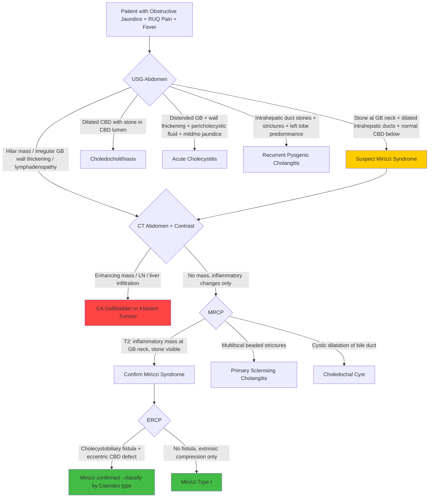

## Differential Diagnosis of Mirizzi Syndrome

### Conceptual Framework: Why is the DDx Challenging?

The fundamental difficulty with Mirizzi syndrome is that it presents as **obstructive jaundice ± cholangitis ± cholecystitis** — a constellation shared by many hepatobiliary conditions. The stone is *not* in the CBD (where you'd expect it in choledocholithiasis), but its effects *mimic* a CBD stone. Additionally, the pericholecystic inflammation can mimic a hilar mass (gallbladder carcinoma, Klatskin tumour). This is why Mirizzi syndrome is frequently diagnosed only intraoperatively [1].

The DDx can be approached systematically by:
1. **Level of biliary obstruction** (hilar vs. mid-CBD vs. distal CBD) [3]
2. **Mechanism of obstruction** (intraluminal vs. mural vs. extramural) [4]
3. **Clinical presentation pattern** (cholangitis-predominant vs. cholecystitis-predominant vs. painless jaundice)

---

### Approach 1: DDx by Level of Obstruction

Mirizzi syndrome causes obstruction at the **hilum / proximal CHD level** — the stone in Hartmann's pouch compresses the CHD just below the hepatic confluence. This means the DDx is primarily against other causes of **hilar-level** obstruction [1][3].

***Causes according to level of obstruction*** [3]:

| Level | Differential Diagnoses | Key Distinguishing Features from Mirizzi |
|---|---|---|
| ***Hilum*** (where Mirizzi acts) | ***CA Gallbladder***, ***HCC***, ***Klatskin's tumour*** (hilar cholangiocarcinoma), ***Mirizzi syndrome***, ***Porta lymphadenopathy***, ***Primary sclerosing cholangitis (PSC)***, ***Recurrent pyogenic cholangitis (RPC)*** [3] | See individual entries below |
| ***Mid-CBD*** | ***CA CBD***, ***CA Head of pancreas***, ***Lymphadenopathy*** [3] | Stone in Mirizzi is at GB neck/cystic duct level, not mid-CBD; imaging shows stone at GB neck rather than within CBD lumen |
| ***Distal CBD*** | ***Bile duct strictures***, ***Periampullary carcinoma***, ***Choledochal cysts***, ***Pancreatic cysts***, ***Chronic pancreatitis*** [3] | Distal CBD obstruction shows different dilatation pattern (dilated CBD + CHD); Mirizzi shows normal-calibre CBD below obstruction |

---

### Approach 2: DDx by Mechanism of Obstruction

***Differential diagnosis of obstructive jaundice*** [4]:

| Mechanism | Conditions | Explanation |
|---|---|---|
| ***Intraluminal*** | ***Choledocholithiasis***, ***Acute cholangitis***, ***RPC*** [4] | Stone is *inside* the CBD lumen, not compressing from outside |
| ***Mural*** | ***Cholangiocarcinoma***, ***PSC*** [4] | Pathology is in the bile duct wall itself (tumour or fibrosis) |
| ***Extramural*** | ***CA head of pancreas***, ***Lymphadenopathy***, ***Gallstone (Mirizzi syndrome)*** [4] | Mirizzi is classified as *extramural* — the stone is outside the bile duct compressing it |

<Callout title="Mirizzi is Extramural Obstruction">
This is a key conceptual point: even though Mirizzi syndrome is caused by a gallstone (which you'd normally associate with intraluminal obstruction), the stone is in the *cystic duct/Hartmann's pouch*, not inside the CBD. It compresses the CHD from outside — hence it is classified as **extramural** obstruction [4]. This is the same category as a pancreatic head mass compressing the CBD. Understanding this helps you see why imaging may not show a stone *within* the CBD.
</Callout>

---

### Approach 3: Individual Differential Diagnoses with Distinguishing Features

These are the key conditions listed in the senior notes that must be systematically differentiated from Mirizzi syndrome [1]:

#### 1. Choledocholithiasis (CBD Stones)

**The most important differential** — and the condition Mirizzi syndrome is most frequently confused with.

- **Mechanism**: Gallstone migrates from gallbladder through cystic duct and lodges *within* the CBD lumen [2][5]
- **Why it mimics Mirizzi**: Both cause obstructive jaundice, RUQ pain, and cholestatic LFTs. Both are stone-related. Both may present with Charcot's triad if complicated by cholangitis.
- **How to distinguish**:

| Feature | Choledocholithiasis | Mirizzi Syndrome |
|---|---|---|
| Stone location | *Within* CBD lumen | In Hartmann's pouch / cystic duct (*outside* CBD) |
| CBD calibre | **Dilated CBD** with stone visible within it on USG [5] | **Normal-calibre CBD** below the level of obstruction; dilatation is *above* GB neck level only [1] |
| USG finding | Dilated CBD ( > 8 mm) ± visible stone in CBD | Contracted/inflamed GB with stone at neck; dilated biliary system *above* GB neck with abrupt transition to normal CBD below [1] |
| ERCP finding | Stone within CBD lumen | Eccentric/excavating defect on *lateral wall* of CBD at level of cystic duct; ± contrast passing into GB via fistula [1] |
| Gallbladder | Usually contains stones but may not be inflamed | Typically contracted and inflamed, often with a large stone impacted at neck |

<Callout title="The Key USG Clue" type="idea">
The single most helpful USG finding that points to Mirizzi over choledocholithiasis is: **dilated intrahepatic ducts + stone at GB neck + normal-calibre CBD distal to the stone** [1]. In choledocholithiasis, the CBD itself is dilated and you may see the stone within it.
</Callout>

#### 2. Acute Cholecystitis

- **Mechanism**: Prolonged gallstone impaction at Hartmann's pouch/cystic duct → gallbladder distension → chemical then bacterial inflammation [6][7]
- **Why it mimics Mirizzi**: Both involve stone impaction at the same anatomical site (Hartmann's pouch/cystic duct). Both cause RUQ pain, fever, positive Murphy's sign. In fact, ***up to 1/3 of Mirizzi syndrome patients present with acute cholecystitis*** [1].
- **How to distinguish**:

| Feature | Acute Cholecystitis | Mirizzi Syndrome |
|---|---|---|
| Jaundice | Usually absent or mild (bilirubin only mildly elevated from pericholecystic inflammation) [8] | ***Prominent jaundice*** — because CHD is obstructed, not just cystic duct [1] |
| LFT | Usually **normal** or mildly abnormal [8] | Significantly **elevated ALP and bilirubin** (cholestatic pattern) [1] |
| Intrahepatic duct dilatation | Absent (obstruction limited to gallbladder outflow) | Present (CHD obstruction causes upstream dilatation) |
| CBD calibre | Normal | Normal *below* stone, but dilated CHD *above* |

> **Clinical pearl**: If you see a patient with what looks like acute cholecystitis but with *disproportionately significant jaundice and dilated intrahepatic ducts*, think Mirizzi syndrome. "Severe jaundice is suggestive of cholangitis, CBD obstruction or obstruction of the bile ducts by severe pericholecystic inflammation or ***Mirizzi syndrome***" [8].

#### 3. Gallbladder Carcinoma (CA Gallbladder)

- **Mechanism**: Malignant neoplasm of the gallbladder (90% adenocarcinoma), often arising in a background of chronic cholecystitis/cholelithiasis [9]
- **Why it mimics Mirizzi**: Both can present with obstructive jaundice at the hilar level [3]. Both are associated with gallstones. The inflammatory mass in Mirizzi can look exactly like a gallbladder tumour on imaging. ***Critically, Mirizzi syndrome itself is a risk factor for gallbladder carcinoma*** — the two can coexist [1][2].
- **How to distinguish**:

| Feature | CA Gallbladder | Mirizzi Syndrome |
|---|---|---|
| Jaundice character | ***Painless progressive obstructive jaundice*** (late stage) [4] | Painful jaundice with cholangitis/cholecystitis features |
| Constitutional symptoms | Weight loss, anorexia, cachexia (more prominent) | Less prominent unless concurrent malignancy |
| Imaging | ***CT: enhancing mass lesion, porta hepatis lymphadenopathy, liver infiltration (segments IV/V)*** [1][9] | ***MRCP: T2-weighted images can differentiate inflammatory from neoplastic mass*** [1]; CT shows no enhancing mass |
| Gallbladder wall | Irregular thickening or mass, loss of GB-liver interface | Diffuse thickening (inflammatory), preserved interface |
| Histology | Malignant cells on biopsy/frozen section | Inflammatory changes |

<Callout title="Always Rule Out CA Gallbladder" type="error">
***CT abdomen should be performed in all suspected Mirizzi syndrome to determine whether malignancy is present by demonstrating enlarged porta hepatis LNs or hepatic infiltration/metastasis*** [1]. This is non-negotiable. The 5–28% coexistence rate of gallbladder cancer with Mirizzi syndrome means you cannot assume it is "just" Mirizzi.
</Callout>

#### 4. Klatskin's Tumour (Hilar Cholangiocarcinoma)

- **Mechanism**: Cholangiocarcinoma (adenocarcinoma, > 90%) arising at the **confluence of the hepatic ducts** — "Klatskin" = perihilar cholangiocarcinoma [3][10]
- **Why it mimics Mirizzi**: Both cause hilar-level obstruction with intrahepatic duct dilatation. Both cause obstructive jaundice.
- **How to distinguish**:

| Feature | Klatskin's Tumour | Mirizzi Syndrome |
|---|---|---|
| Pain | Often ***painless*** progressive jaundice [4] | Typically *painful* (cholecystitis/cholangitis) |
| Gallstones | Usually absent | Present (the cause) |
| MRCP/ERCP | Stricture/occlusion at the hepatic duct confluence; no gallstone at GB neck | Stone at GB neck; extrinsic compression of CHD |
| CT | Enhancing hilar mass, biliary dilatation *above* confluence, vascular encasement | Inflammatory changes at GB neck, no true mass |
| Risk factors | PSC, RPC, choledochal cysts, Caroli's disease, parasites [10] | Gallstones (5Fs) |

#### 5. Recurrent Pyogenic Cholangitis (RPC)

- **Mechanism**: Recurrent cholangitis from de novo intrahepatic pigment stone formation → stricturing and dilatation of the intrahepatic biliary tree [11]
- **Why it mimics Mirizzi**: Both cause cholangitis (Charcot's triad), both involve stones, and ***RPC is also an exception to Courvoisier's Law*** [2]. Both are common in the Hong Kong population.
- **How to distinguish**:

| Feature | RPC | Mirizzi Syndrome |
|---|---|---|
| Stone type | ***Brown pigment / calcium bilirubinate stones*** formed de novo in intrahepatic ducts [11] | Usually cholesterol stones formed in gallbladder |
| Stone location | *Intrahepatic* ducts primarily [11] | Hartmann's pouch / cystic duct |
| Imaging | Disproportionate dilatation of intrahepatic ducts (especially left lobe) with intrahepatic stones and strictures [11] | Dilated ducts above GB neck with stone at GB neck; no intrahepatic stones |
| Epidemiology | ***Southeast Asia ("Hong Kong disease")***, equal M:F, peak 30–40s [11] | Follows gallstone epidemiology (F > M) |
| Parasitic association | ***Clonorchis sinensis, Ascaris lumbricoides*** [11] | Not directly parasitic |

#### 6. Liver Abscess

- **Mechanism**: Pyogenic (usually from biliary source or portal pyaemia) or amoebic abscess
- **Why it mimics Mirizzi**: Both cause fever, RUQ pain, and leukocytosis. A large abscess near the porta hepatis could compress the bile ducts.
- **How to distinguish**: USG/CT shows a **fluid collection within the liver parenchyma** (not a stone at GB neck). No intrahepatic duct dilatation pattern characteristic of biliary obstruction unless the abscess itself compresses ducts. Blood cultures/aspirate culture positive for organisms.

#### 7. Infected Choledochal Cysts

- **Mechanism**: Congenital dilatation of biliary tree → bile stasis → infection [12]
- **Why it mimics Mirizzi**: Both cause RUQ pain, jaundice, and fever. Choledochal cysts can present with a palpable mass.
- **How to distinguish**: ***Diagnosed predominantly before age 10 (60%)*** [12]. USG/MRCP shows a **cystic dilatation** of the bile duct rather than a stone at GB neck. Classic triad of RUQ mass + pain + jaundice (though only present in minority of adults).

#### 8. Acute Pancreatitis

- **Mechanism**: Premature activation of pancreatic enzymes → autodigestion [13]
- **Why it mimics Mirizzi**: Both can be caused by gallstones. Both cause RUQ/epigastric pain. Both elevate LFTs.
- **How to distinguish**: Pain in pancreatitis **radiates to the back** and is **relieved by sitting up/leaning forward** [13]. ***Markedly elevated serum amylase/lipase ( > 3× upper limit of normal)***. Pancreatic inflammation on CT. In Mirizzi, amylase may be mildly elevated but not to the degree seen in pancreatitis.

#### 9. Acute Appendicitis

- **Mechanism**: Appendiceal luminal obstruction → distension → ischaemia → bacterial infection [1]
- **Why it is listed**: Both cause acute abdominal pain with fever and leukocytosis. However, appendicitis typically presents with **periumbilical pain migrating to RIF (McBurney's point)**, not RUQ. Jaundice is absent. Listed as a DDx primarily because of the overlap in the "acute abdomen with fever and leucocytosis" category.

#### 10. Primary Sclerosing Cholangitis (PSC)

- **Mechanism**: Chronic progressive inflammation, fibrosis, and stricturing of both intra- and extrahepatic bile ducts of unknown aetiology [14]
- **Why it mimics Mirizzi**: Both can cause obstructive jaundice at the hilar level [3]. Both can cause cholangitis.
- **How to distinguish**: PSC has a **strong association with ulcerative colitis** [14]. Cholangiogram (MRCP/ERCP) shows ***"beaded" pattern*** of multifocal strictures alternating with dilatation throughout the biliary tree — very different from the focal hilar obstruction of Mirizzi. ***p-ANCA positive in ~80%***. No gallstone at GB neck.

#### 11. Biliary Leaks

- **Mechanism**: Post-surgical or post-traumatic disruption of bile duct integrity
- **Why it mimics Mirizzi**: Both can cause jaundice and biliary collections. However, biliary leaks present in the *post-operative* context. HIDA scan or ERCP demonstrates active extravasation of bile.

---

### DDx Approach: Differentiating Stone vs. Tumour

***In the history, differentiate stone vs tumour*** [4]:

| Feature | Stone (including Mirizzi) | Tumour (malignant biliary obstruction) |
|---|---|---|
| Pain | ***Painful*** (biliary colic, cholangitis) | Often ***painless*** (especially pancreatic head CA) |
| Jaundice pattern | Intermittent/fluctuating | ***Progressive*** |
| Fever | Common (cholangitis) | Less common unless secondary infection |
| Stool/urine | ***Tea-coloured urine, pale stool*** [4] | Same pattern |
| Weight loss | Less prominent | Significant |
| History of gallstones | Usually present | May be absent |
| Age | Any age (F > M) | Elderly (consider ***painless progressive obstructive jaundice in elderly = malignant until proven otherwise*** [4]) |
| Courvoisier's sign | Usually negative (exception: Mirizzi, double impaction, RPC) [2] | Usually positive |

---

### Mermaid Diagram: DDx Algorithm for Suspected Mirizzi Syndrome

---

### Summary Table: Complete DDx at a Glance

| Differential | Key Distinguishing Feature from Mirizzi | Investigation That Clinches It |
|---|---|---|
| **Choledocholithiasis** | Stone *within* CBD; dilated CBD | USG/MRCP: stone in CBD lumen |
| **Acute cholecystitis** | Jaundice absent/mild; LFT normal/mild; no intrahepatic duct dilatation | USG: 5 cardinal signs; no duct dilatation |
| **CA Gallbladder** | Painless progressive jaundice; enhancing mass; LN; liver infiltration | CT + biopsy/frozen section |
| **Klatskin's tumour** | Painless jaundice; stricture at hepatic confluence; no gallstone | MRCP/ERCP: hilar stricture pattern |
| **RPC** | Intrahepatic pigment stones; left lobe predominance; SE Asian | MRCP: intrahepatic stones + strictures |
| **Liver abscess** | Fluid collection in liver parenchyma; no biliary duct stone | USG/CT: abscess cavity |
| **Infected choledochal cyst** | Cystic dilatation of bile duct; paediatric | MRCP: cyst morphology |
| **Acute pancreatitis** | Back-radiating pain; amylase/lipase > 3× ULN | Lipase + CT severity |
| **Acute appendicitis** | RIF pain; no jaundice | Clinical + CT |
| **PSC** | Beaded biliary strictures; UC association; p-ANCA+ | MRCP: multifocal strictures |
| **Biliary leak** | Post-surgical context | HIDA/ERCP: active extravasation |

---

<Callout title="High Yield Summary">

**Mirizzi syndrome DDx — key principles**:

1. **Mirizzi is an extramural cause of obstructive jaundice** — classified with pancreatic head CA and lymphadenopathy, NOT with intraluminal stones [4]

2. **Most commonly confused with choledocholithiasis** — the key USG differentiator is: in Mirizzi, intrahepatic ducts are dilated but CBD is normal-calibre below the GB neck; in choledocholithiasis, the CBD itself is dilated [1]

3. **Acute cholecystitis with disproportionate jaundice** should trigger suspicion for Mirizzi [8]

4. **Always rule out CA gallbladder** with CT (5–28% coexistence rate) and MRCP (T2 differentiates inflammatory from neoplastic mass) [1]

5. **Listed DDx from senior notes** [1]: Choledocholithiasis, Acute cholecystitis, Liver abscess, Infected choledochal cysts, Biliary leaks, Acute pancreatitis, Acute appendicitis, RPC

6. **In Hong Kong**, RPC and parasitic-related biliary disease are particularly important differentials [11]

7. ***Painless progressive obstructive jaundice in elderly = malignant biliary obstruction until proven otherwise*** [4]

</Callout>

---

<ActiveRecallQuiz
  title="Active Recall - Mirizzi Syndrome Differential Diagnosis"
  items={[
    {
      question: "Mirizzi syndrome is classified as what type of biliary obstruction (intraluminal, mural, or extramural)? Why?",
      markscheme: "Extramural. The stone is in the cystic duct/Hartmann's pouch (outside the bile duct), compressing the CHD from the outside. The stone is not within the CBD lumen (intraluminal) nor is the pathology in the bile duct wall itself (mural).",
    },
    {
      question: "What is the single most helpful USG finding that distinguishes Mirizzi syndrome from choledocholithiasis?",
      markscheme: "In Mirizzi: dilated intrahepatic ducts above the GB neck level + stone impacted at GB neck + normal-calibre CBD below. In choledocholithiasis: the CBD itself is dilated with a stone visible within the CBD lumen.",
    },
    {
      question: "A patient with known gallstones presents with acute cholecystitis but has disproportionately significant jaundice and dilated intrahepatic ducts on USG. What diagnosis should you suspect and why?",
      markscheme: "Mirizzi syndrome. In uncomplicated acute cholecystitis, jaundice is usually absent or mild because obstruction is limited to gallbladder outflow (cystic duct) without CHD compression. Significant jaundice with intrahepatic duct dilatation indicates CHD obstruction, which in the setting of a stone at GB neck suggests Mirizzi syndrome.",
    },
    {
      question: "Name 3 conditions that are exceptions to Courvoisier's Law (jaundice + palpable GB from stone-related causes).",
      markscheme: "1. Mirizzi syndrome (stone at GB neck compresses CHD while GB body distends). 2. Double impaction (stone in cystic duct causing GB distension + stone in distal CBD causing jaundice). 3. Recurrent pyogenic cholangitis (pathology is in bile ducts, not GB, so GB is not fibrosed and can distend).",
    },
    {
      question: "Why must CT abdomen with contrast be performed in all suspected Mirizzi syndrome cases?",
      markscheme: "To rule out concurrent gallbladder carcinoma (5-28% coexistence rate) and other malignancies. CT can demonstrate enhancing mass lesions, porta hepatis lymphadenopathy, and hepatic infiltration/metastasis that would indicate malignancy rather than (or in addition to) Mirizzi syndrome.",
    },
    {
      question: "How does RPC differ from Mirizzi syndrome in terms of stone type, stone location, and imaging pattern?",
      markscheme: "RPC: brown pigment/calcium bilirubinate stones, formed de novo in intrahepatic ducts, imaging shows intrahepatic duct dilatation with strictures (left lobe predominance) and intrahepatic stones. Mirizzi: usually cholesterol stones formed in gallbladder, impacted at Hartmann's pouch/cystic duct, imaging shows dilated ducts above GB neck with normal CBD below and no intrahepatic stones.",
    },
  ]}
/>

## References

[1] Senior notes: felixlai.md (Mirizzi syndrome DDx and diagnosis, pp. 572–574; Cholecystitis and Mirizzi, p. 556)
[2] Senior notes: maxim.md (Mirizzi syndrome, pp. 130–132; Courvoisier's Law and exceptions, p. 130)
[3] Senior notes: felixlai.md (Causes of obstructive jaundice by level of obstruction, p. 500)
[4] Senior notes: maxim.md (Obstructive jaundice DDx and approach, p. 251)
[5] Senior notes: maxim.md (Choledocholithiasis, p. 136)
[6] Senior notes: maxim.md (Acute calculous cholecystitis, p. 131)
[7] Senior notes: felixlai.md (Cholecystitis overview, p. 553)
[8] Senior notes: felixlai.md (Acute cholecystitis physical examination — jaundice and Mirizzi, p. 556)
[9] Senior notes: maxim.md (Gallbladder carcinoma, pp. 138–139)
[10] Senior notes: maxim.md (Cholangiocarcinoma classification and risk factors, pp. 139–140)
[11] Senior notes: felixlai.md (Recurrent pyogenic cholangitis, pp. 526–527); Senior notes: maxim.md (RPC, p. 136)
[12] Senior notes: maxim.md (Choledochal cyst, p. 138)
[13] Senior notes: felixlai.md (Acute pancreatitis, pp. 579–580)
[14] Senior notes: felixlai.md (Primary sclerosing cholangitis, p. 529)
