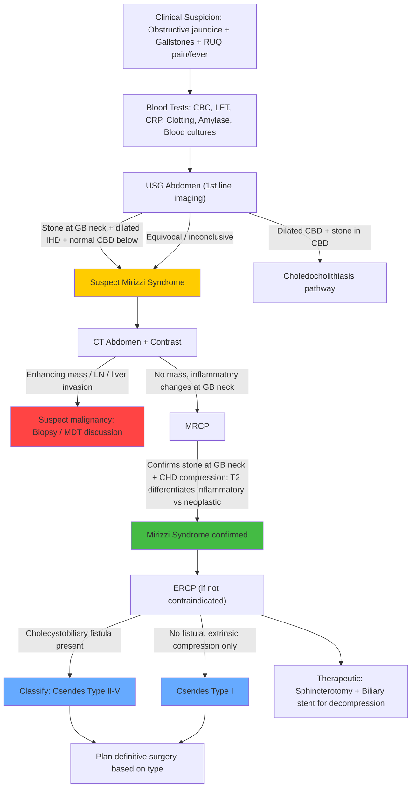

## Diagnostic Criteria for Mirizzi Syndrome

### Why There Are No Formal "Diagnostic Criteria"

Unlike acute cholecystitis (Tokyo Guidelines 2018) or acute cholangitis (Tokyo Guidelines 2018), **there is no universally accepted set of formal diagnostic criteria for Mirizzi syndrome**. The diagnosis is made by combining clinical suspicion with imaging findings. In fact, the majority of cases are diagnosed **intraoperatively** — only about 8–27% of cases are diagnosed preoperatively [1][2].

This is because:
1. The clinical presentation is **non-specific** — it overlaps with cholecystitis, choledocholithiasis, and cholangitis
2. The pathognomonic finding (stone at GB neck compressing CHD ± cholecystobiliary fistula) requires high-quality imaging to detect
3. The dense pericholecystic inflammation makes anatomical delineation difficult even on cross-sectional imaging

<Callout title="Practical Diagnostic Approach" type="idea">
In practice, you **suspect** Mirizzi syndrome when a patient with gallstones has features of obstructive jaundice and imaging shows dilated intrahepatic ducts with a stone at the GB neck but a normal-calibre CBD below. You **confirm** it with MRCP and/or ERCP. The Csendes type (presence and extent of cholecystobiliary fistula) is often only definitively determined at ERCP or intraoperatively.
</Callout>

### Working Diagnostic Framework

While no formal criteria exist, the diagnosis rests on demonstrating the following:

| Component | What You Need to Show |
|---|---|
| **1. Gallstone impaction** | Stone impacted in Hartmann's pouch or cystic duct [1][2] |
| **2. CHD obstruction** | Evidence of biliary obstruction *at the level of the GB neck* — dilated intrahepatic ducts *above*, normal CBD *below* [1] |
| **3. Exclusion of other causes** | No stone in CBD lumen; no hilar mass; no malignancy on CT [1][2] |
| **4. Fistula assessment** | Presence and extent of cholecystobiliary fistula (determines Csendes type) — usually by ERCP or intraoperative findings [1][2] |

When the patient also presents with features of **acute cholangitis**, the **Tokyo Guidelines 2018 (TG18)** criteria for cholangitis apply in parallel [7]:

> **Suspected cholangitis**: ONE systemic inflammation criterion (fever/rigors OR abnormal WBC/CRP) **AND** ONE cholestasis criterion (jaundice OR abnormal LFTs)
>
> **Definite cholangitis**: Suspected criteria met **PLUS** biliary dilatation on imaging **AND** evidence of aetiology (stone, stricture, stent) on imaging [7]

When the patient presents with features of **acute cholecystitis**, the **Tokyo Guidelines 2018 (TG18)** criteria for cholecystitis apply [8]:
- **A**: Local signs (Murphy's sign, RUQ mass/pain/tenderness)
- **B**: Systemic signs (fever, leukocytosis, elevated CRP)
- **C**: Imaging findings characteristic of acute cholecystitis
- Suspected = A + B; Definite = A + B + C [8]

---

## Diagnostic Algorithm

The diagnostic workup for suspected Mirizzi syndrome follows a logical stepwise approach: **Bloods → USG → CT → MRCP → ERCP**. Each modality answers a specific question:

| Step | Modality | Question It Answers |
|---|---|---|
| 1 | **Blood tests** | Is there obstruction? Infection? Coagulopathy? |
| 2 | **USG abdomen** | Is there a stone at GB neck? Are intrahepatic ducts dilated? What is CBD calibre? |
| 3 | **CT abdomen + contrast** | Is there malignancy? Lymphadenopathy? Liver metastases? |
| 4 | **MRCP** | What is the precise biliary anatomy? Is it inflammatory or neoplastic? |
| 5 | **ERCP** | Is there a cholecystobiliary fistula? Can we decompress the biliary tree? |

### Mermaid Diagnostic Algorithm

---

## Investigation Modalities: Detailed Findings and Interpretation

### 1. Blood Tests (Laboratory Investigations)

Blood tests do not diagnose Mirizzi syndrome per se, but they characterise the degree of obstruction, infection, and fitness for intervention.

#### a. Complete Blood Count with Differentials (CBC D/C)

- **Expected finding**: ***Leukocytosis*** [1]
- **Why**: Leukocytosis (↑ WBC with neutrophil predominance and left shift / band forms) indicates an **acute inflammatory/infectious process** — present in concurrent ***acute cholecystitis, cholangitis, or pancreatitis*** [1]
- **Interpretation**:
  - Mild leukocytosis (12,000–15,000/µL) → uncomplicated cholecystitis
  - Marked leukocytosis ( > 20,000/µL) → suggests complicated disease (empyema, gangrenous cholecystitis, or suppurative cholangitis) [8]
- **Also check**: ***Thrombocytopenia*** — relevant when planning invasive procedures such as ERCP (need adequate platelets for sphincterotomy) [3][15]
- In patients with underlying cirrhosis: ***pancytopenia*** from hypersplenism may be present [15]

#### b. Liver Function Tests (LFT)

- **Expected finding**: ***↑ ALP and bilirubin*** [1] — the classic **cholestatic pattern**
- **Why**: CHD obstruction prevents bile from draining into the duodenum
  - **↑ Conjugated bilirubin**: bile cannot flow → backs up into blood → conjugated (water-soluble) bilirubin spills into circulation
  - **↑ ALP (alkaline phosphatase)**: ALP is concentrated in bile duct epithelium. Obstruction → back-pressure → induction of ALP synthesis + leakage into blood. The biliary isoenzyme is predominant.
  - **↑ GGT (gamma-glutamyl transferase)**: rises in parallel with ALP in cholestasis; confirms biliary origin of ALP elevation [3][15]
  - **Transaminases (AST/ALT)**: may be mildly elevated (back-pressure hepatocyte injury) but typically NOT dramatically elevated unless acute biliary obstruction with "transaminitis" from sudden complete obstruction

<Callout title="Cholestatic Pattern = Think Obstruction">
The **cholestatic LFT pattern** (ALP and GGT disproportionately elevated relative to transaminases, with raised conjugated bilirubin) points to biliary obstruction. This is different from the **hepatocellular pattern** (transaminases disproportionately elevated) seen in hepatitis. Always fractionate the bilirubin — in Mirizzi, it is **primarily conjugated** [7].
</Callout>

#### c. Clotting Profile (PT/INR)

- **Expected finding**: ***Prolonged PT/INR*** in prolonged obstruction [3][15]
- **Why**: Obstructive jaundice → no bile salts reaching the gut → ***impaired absorption of fat-soluble vitamin K*** → vitamin K is a cofactor for hepatic γ-carboxylation of clotting factors **II, VII, IX, X** → coagulopathy [3]
- **Clinical importance**: Must be corrected before any invasive procedure. Give **Vitamin K 10 mg IV/IM** at least 24–48 hours before surgery or ERCP. If urgent, give **Fresh Frozen Plasma (FFP)** for immediate correction [3]
- **Diagnostic value**: If PT corrects with vitamin K → the liver is still functional (just vitamin K deficient). If PT does NOT correct → hepatocellular dysfunction (liver cannot synthesise factors regardless of vitamin K availability)

#### d. Inflammatory Markers

- **CRP**: Elevated in acute inflammation/infection (cholecystitis, cholangitis)
- **ESR**: Less specific, may be elevated [7]

#### e. Renal Function Tests (RFT)

- **Why**: Obstructive jaundice predisposes to ***hepatorenal syndrome*** and renal impairment (cholestasis → endotoxin-mediated renal vasoconstriction). Also essential as baseline before any contrast-enhanced imaging or ERCP [7]

#### f. Serum Amylase / Lipase

- **Why**: To **rule out concurrent acute pancreatitis** [1]. A stone in Hartmann's pouch can occasionally also cause pancreatitis if there is distal migration or ampullary impaction. Amylase > 3× upper limit of normal suggests pancreatitis.

#### g. Blood and Bile Cultures

- **Why**: If cholangitis is suspected, **blood cultures MUST be sent before starting antibiotics** [16]. Common organisms: Gram-negatives (*E. coli, Klebsiella*), enterococci. Positive bile cultures are common with biliary obstruction [7].

#### h. Tumour Markers

- ***CEA and CA 19-9***: May be checked to evaluate for concurrent malignancy (gallbladder carcinoma or cholangiocarcinoma), but ***are NOT diagnostically useful since they lack sensitivity and specificity*** [15]. Their role is primarily in **serial monitoring** after resection for recurrence detection, not in primary diagnosis.

> **Summary of expected blood findings in Mirizzi syndrome**: Leukocytosis, ↑ ALP, ↑ GGT, ↑ conjugated bilirubin, ± prolonged PT, ± elevated amylase (if concurrent pancreatitis), ± positive blood cultures (if cholangitis).

---

### 2. USG Abdomen (First-Line Imaging)

**Why USG first?** It is readily available, non-invasive, does not involve radiation or contrast, and is the standard first-line investigation for any patient with RUQ pain or obstructive jaundice [1][2][4].

#### Key Findings Suggestive of Mirizzi Syndrome [1][2]

| USG Finding | Interpretation / Pathophysiological Basis |
|---|---|
| ***Gallstones present*** | Confirms underlying cholelithiasis — the prerequisite for Mirizzi syndrome |
| ***Contracted gallbladder*** | Chronic cholecystitis → fibrosis → shrunken GB (though in acute presentations, GB may be distended) [1][2] |
| ***Stone impacted in the gallbladder neck*** | The causative stone — seen as a hyperechoic focus with posterior acoustic shadowing at the GB neck / Hartmann's pouch [1] |
| ***Dilatation of biliary system above the level of gallbladder neck*** [1] | CHD obstruction → back-pressure → intrahepatic duct dilatation. Intrahepatic ducts (normally not visible on USG at < 2–3 mm) become visible when dilated [15] |
| ***Abrupt change to a normal width of CBD below the level of stones*** [1] | This is the **signature finding**: the obstruction is at the level of the GB neck/cystic duct — *above* this point, the biliary tree is dilated; *below* this point, the CBD is normal calibre ( < 8 mm). This distinguishes Mirizzi from choledocholithiasis (where CBD itself is dilated) [1] |

#### Limitations of USG

- **Operator-dependent**: requires experienced sonographer [6]
- **Limited by body habitus**: obesity and bowel gas reduce image quality
- **Cannot reliably demonstrate the cholecystobiliary fistula** — this usually requires ERCP or MRCP
- **Cannot exclude malignancy** — a contracted, inflamed GB with pericholecystic changes can look similar to GB carcinoma on USG
- **Distal CBD poorly visualized**: overlying duodenal gas obscures this region [4][5]

<Callout title="USG Sensitivity for Mirizzi" type="error">
USG has a **sensitivity of only ~29–50%** for diagnosing Mirizzi syndrome. It is excellent for detecting gallstones and biliary dilatation, but it cannot reliably identify the specific compression of CHD by the GB neck stone, nor can it demonstrate a fistula. This is why USG raises suspicion but MRCP/ERCP are needed for confirmation [1].
</Callout>

---

### 3. CT Abdomen with Contrast

**Why CT?** The primary role of CT is to ***determine whether malignancy is present*** [1][2].

#### Key Findings and Their Interpretation

| CT Finding | Interpretation |
|---|---|
| ***Enlarged porta hepatis lymph nodes*** [1] | Suggests malignancy (gallbladder carcinoma, cholangiocarcinoma, lymphoma) rather than simple Mirizzi syndrome |
| ***Hepatic infiltration or metastasis*** [1] | Direct liver invasion (segments IV/V adjacent to GB fossa) suggests GB carcinoma |
| **Gallstone at GB neck with pericholecystic inflammation** | Supportive of Mirizzi diagnosis — shows the inflammatory mass around the GB neck |
| **Dilated intrahepatic ducts** | Confirms proximal biliary obstruction |
| **Normal CBD below GB neck** | Supports Mirizzi over choledocholithiasis |
| **No enhancing mass lesion** | Argues against malignancy (though cannot 100% exclude it) |

#### Why CT Cannot Definitively Diagnose Mirizzi

CT is not very sensitive for biliary stones (only ~75% of gallstones are visible on CT [4]) and cannot reliably demonstrate a cholecystobiliary fistula. Its main value is **excluding malignancy** and **evaluating the extent of inflammation**.

---

### 4. MRCP (Magnetic Resonance Cholangiopancreatography)

**MRCP = "MR" (magnetic resonance) + "CP" (cholangiopancreatography)** — non-invasive imaging of the biliary tree and pancreatic duct using heavily **T2-weighted sequences** where fluid (bile) appears bright white [4].

**Why MRCP?** It has ***high sensitivity for Mirizzi syndrome*** [1] and plays a critical role in:
1. Delineating biliary anatomy preoperatively
2. Differentiating inflammatory from neoplastic pathology
3. Avoiding the complications of ERCP in diagnostic-only scenarios

#### Key Findings and Their Interpretation

| MRCP Finding | Interpretation |
|---|---|
| **Stone at GB neck / cystic duct** (low signal filling defect) | Confirms the impacted stone causing extrinsic compression |
| **Compressed or narrowed CHD** at the level of the stone | Demonstrates the obstruction mechanism — CHD is narrowed from outside, not from within |
| **Dilated intrahepatic ducts proximal to compression** | Confirms obstruction |
| **Normal CBD calibre distal to compression** | Distinguishes from choledocholithiasis |
| ***T2-weighted images can differentiate between a neoplastic and inflammatory mass*** [1] | **Critical for excluding GB carcinoma**: inflammatory tissue has a different T2 signal pattern from neoplastic tissue. An inflammatory mass shows T2 hyperintensity (oedema = high water content = bright on T2), whereas a neoplastic mass may show heterogeneous or lower T2 signal depending on cellularity. ***This differentiation may not be possible on abdominal USG or CT scan*** [1] |
| ***Extent of pericholecystic inflammation*** [1] | Helps surgical planning — how densely inflamed is Calot's triangle? |
| **Presence of cholecystobiliary fistula** | May be visible as a communication between GB and CHD, though ERCP is more sensitive for this |

<Callout title="MRCP vs ERCP: When to Use Which?">
**MRCP** is non-invasive, has no radiation, requires no contrast injection into the biliary tree, and carries no risk of post-procedure pancreatitis. It is the preferred **diagnostic** modality when you suspect Mirizzi but need better anatomical delineation than USG provides. However, ***MRCP is NOT therapeutic*** — it cannot decompress the biliary tree or remove stones [4]. If therapeutic intervention is needed, you proceed to **ERCP**.
</Callout>

#### Advantages of MRCP over Other Modalities

- ***Non-contrast, non-invasive*** [4] — no iodinated contrast, no radiation
- ***Superior to USG*** in detecting stones in the cystic duct [8]
- Excellent for visualising the entire biliary tree in one image
- Can identify concurrent choledocholithiasis (stones within CBD)
- ***Differentiates inflammatory vs neoplastic mass*** — the key advantage over USG and CT [1]

---

### 5. ERCP (Endoscopic Retrograde Cholangiopancreatography)

**ERCP = "E" (endoscopic) + "R" (retrograde) + "C" (cholangio-) + "P" (pancreatography)** — an endoscopic procedure where a side-viewing duodenoscope is used to cannulate the ampulla of Vater and inject contrast *retrogradely* into the biliary and pancreatic ducts under fluoroscopy.

**Why ERCP?** ***Both diagnostic and therapeutic*** [1][2] — this is the gold standard for:
1. **Confirming** Mirizzi syndrome
2. **Determining if cholecystobiliary fistula is present** (critical for Csendes classification) [1][2]
3. **Biliary decompression** (stenting) as a bridge to definitive surgery

#### Key Findings on Cholangiography [1]

| ERCP Finding | Interpretation |
|---|---|
| ***Stone in the neck of gallbladder or cystic duct*** [1] | Identifies the causative impacted stone |
| ***Eccentric or excavating defect on lateral wall of CBD at the level of cystic duct or gallbladder neck*** [1] | This is the **pathognomonic ERCP finding**: the stone is compressing or eroding the CBD from the side (lateral/anterolateral), creating a crescentic or excavating defect — NOT a central filling defect as you'd see with an intraluminal CBD stone |
| ***Cholecystobiliary fistula demonstrated by passage of contrast material from proximal dilated biliary channels into the gallbladder*** [1] | If contrast injected into the CBD flows into the gallbladder (when the cystic duct should be obstructed by the stone), there must be an **abnormal fistulous communication**. This confirms Csendes Type II or above |
| **Dilated intrahepatic ducts proximal to the compression** | Confirms obstruction at the hilar/CHD level |

#### Therapeutic Interventions Performed at ERCP [1][2]

| Intervention | Purpose |
|---|---|
| ***Sphincterotomy*** [1] | Cutting the sphincter of Oddi to allow passage of stones and instruments; facilitates stent placement |
| ***Biliary stenting with endoprosthesis placement*** [1] | ***Temporary decompression of the biliary tree*** — reduces bilirubin, resolves cholangitis, and optimises the patient for definitive surgery. The stent bridges the obstruction, allowing bile to drain into the duodenum. |
| ***Stone extraction*** [2] | If CBD stones are found (concomitant choledocholithiasis), they can be extracted using wire baskets, extraction balloons, or mechanical lithotripsy [5] |

#### Complications of ERCP

ERCP is invasive and carries significant risks:
- **Post-ERCP pancreatitis** (most common, ~3–5%) — guidewire or contrast traumatises the pancreatic duct orifice
- **Perforation** (duodenal or bile duct)
- **Haemorrhage** (from sphincterotomy site)
- **Cholangitis** (introducing bacteria with instrumentation)
- **Bacteraemia** — hence **antibiotic prophylaxis is required** [4]

<Callout title="ERCP: When to Use It" type="idea">
***ERCP should be reserved for when therapeutic intervention is needed*** (biliary decompression, stone removal) or when MRCP is inconclusive and you need to definitively assess for a cholecystobiliary fistula. Do NOT use ERCP purely for diagnosis if MRCP can provide the answer — the risk profile of ERCP is too high for a purely diagnostic study [2][4].
</Callout>

---

### 6. Additional / Adjunct Investigations

#### a. Intraoperative Cholangiogram (IOC)

- Performed during cholecystectomy by injecting contrast via the cystic duct under fluoroscopy
- Many cases of Mirizzi syndrome are **first diagnosed intraoperatively** via IOC when the surgeon encounters unexpected biliary anatomy or a fistula
- ***Exploration of CBD (ECBD) should be performed in all patients with cholecystobiliary fistula to rule out concomitant choledocholithiasis*** unless already done endoscopically [1]

#### b. Percutaneous Transhepatic Cholangiography (PTC / PTBD)

- ***Preferred to ERCP*** when obstruction is at or above the level of the hepatic confluence [4]
- In Mirizzi syndrome (hilar-level obstruction), PTC can access the dilated intrahepatic system from above and provide drainage
- Complications: bacteraemia, haemobilia [4]
- Rarely needed as ERCP can usually manage Mirizzi syndrome adequately

#### c. Endoscopic Ultrasound (EUS)

- Can provide detailed images of the GB neck, cystic duct, and adjacent structures
- Useful for ***FNAC or trucut biopsy*** if there is suspicion of malignancy [15]
- Less commonly used in Mirizzi workup specifically but valuable when imaging is equivocal for malignancy

#### d. HIDA Scan (Hepatobiliary Iminodiacetic Acid Scan / Cholescintigraphy)

- Primarily used for **acute cholecystitis** (non-visualisation of GB = cystic duct obstruction) [4][8]
- Not specific for Mirizzi syndrome but may show non-filling of the gallbladder (cystic duct obstruction) + delayed hepatic clearance (CHD obstruction)
- Largely replaced by MRCP in Mirizzi workup

#### e. AXR (Plain Abdominal X-ray)

- Limited utility in Mirizzi specifically
- Only ~15% of gallstones are radio-opaque [6]
- However, if there is concurrent **gallstone ileus (Csendes Type 5B)**: look for ***Rigler's triad: pneumobilia + small bowel obstruction + ectopic gallstone*** [2]

---

### Summary: Investigations at a Glance

| Investigation | Role in Mirizzi Syndrome | Key Findings | Limitations |
|---|---|---|---|
| **CBC D/C** | Assess infection | Leukocytosis, neutrophilia | Non-specific |
| **LFT** | Confirm obstruction | ***↑ ALP, ↑ bilirubin*** (cholestatic pattern) [1] | Does not localise |
| **Clotting** | Assess coagulopathy | Prolonged PT/INR | |
| **USG** (1st line) | Initial assessment | ***Stone at GB neck, dilated IHD, normal CBD below*** [1][2] | Sensitivity only 29–50%; cannot show fistula; operator-dependent |
| **CT + contrast** | Exclude malignancy | ***Porta hepatis LN, liver invasion*** [1][2] | Poor for gallstone detection; cannot show fistula |
| **MRCP** | Confirm diagnosis; differentiate inflammatory vs neoplastic | ***T2 differentiates neoplastic from inflammatory mass*** [1]; biliary anatomy | Not therapeutic |
| ***ERCP*** | **Confirm fistula + therapeutic** | ***Eccentric CBD defect, contrast into GB via fistula*** [1]; ***stenting, sphincterotomy*** [1][2] | Invasive; risk of pancreatitis, perforation, bleeding |
| **IOC** | Intraoperative diagnosis | Unexpected biliary anatomy / fistula | Only available during surgery |
| **Tumour markers** | Exclude malignancy | CEA, CA 19-9 | ***Not diagnostically useful — lack sensitivity and specificity*** [15] |

---

<Callout title="High Yield Summary">

**Diagnostic criteria**: No formal criteria exist. Diagnosis is based on clinical suspicion + imaging confirmation of (1) stone at GB neck, (2) CHD obstruction at that level, (3) exclusion of malignancy, (4) assessment of cholecystobiliary fistula.

**First-line investigation**: **USG abdomen** — look for the signature triad: stone at GB neck + dilated IHD above + normal CBD below.

**CT abdomen + contrast**: Essential to **rule out malignancy** (porta hepatis LN, liver invasion).

**MRCP**: ***High sensitivity***, non-invasive, ***differentiates inflammatory from neoplastic mass on T2-weighted images*** — something USG and CT cannot reliably do.

**ERCP**: ***Both diagnostic and therapeutic*** — confirms cholecystobiliary fistula (contrast passes from CBD into GB), determines Csendes type, and enables ***sphincterotomy + biliary stenting for temporary decompression***.

**Blood tests**: Cholestatic LFT pattern (↑ ALP, ↑ conjugated bilirubin, ↑ GGT), leukocytosis, prolonged PT (correct with vitamin K before intervention).

**Most cases diagnosed intraoperatively** — preoperative diagnosis rate only 8–27%.

</Callout>

---

<ActiveRecallQuiz
  title="Active Recall - Mirizzi Syndrome Diagnosis and Investigations"
  items={[
    {
      question: "What is the characteristic USG triad suggestive of Mirizzi syndrome?",
      markscheme: "(1) Stone impacted in the gallbladder neck/Hartmann's pouch. (2) Dilatation of biliary system above the level of gallbladder neck (intrahepatic duct dilatation). (3) Abrupt change to normal width of CBD below the level of stones. Also: contracted gallbladder with gallstones.",
    },
    {
      question: "What are the pathognomonic ERCP findings in Mirizzi syndrome? Describe how you would identify a cholecystobiliary fistula on ERCP.",
      markscheme: "ERCP findings: (1) Stone in neck of GB or cystic duct. (2) Eccentric or excavating defect on the lateral wall of CBD at the level of cystic duct / GB neck (not a central filling defect). (3) Cholecystobiliary fistula is demonstrated by passage of contrast from proximal dilated biliary channels into the gallbladder (contrast should not enter GB if cystic duct is obstructed by stone - if it does, there is a fistulous communication).",
    },
    {
      question: "Why is MRCP considered superior to USG and CT in differentiating Mirizzi syndrome from gallbladder carcinoma?",
      markscheme: "T2-weighted MRCP images can differentiate between a neoplastic mass and an inflammatory mass based on signal characteristics (inflammatory tissue shows T2 hyperintensity due to oedema/high water content; neoplastic tissue shows heterogeneous/lower T2 signal). This differentiation may not be possible on abdominal USG or CT scan. MRCP also shows extent of pericholecystic inflammation and precise biliary anatomy.",
    },
    {
      question: "List 3 therapeutic interventions that can be performed at ERCP in a patient with Mirizzi syndrome.",
      markscheme: "(1) Sphincterotomy (cutting sphincter of Oddi to facilitate stent/stone passage). (2) Biliary stenting with endoprosthesis placement for temporary decompression of the biliary tree. (3) Stone extraction (if concomitant CBD stones found) using wire baskets, extraction balloons, or mechanical lithotripsy.",
    },
    {
      question: "A patient with obstructive jaundice from suspected Mirizzi syndrome has a prolonged PT/INR. Explain the mechanism and how you would correct it before ERCP.",
      markscheme: "Mechanism: Obstructive jaundice prevents bile salts from reaching the gut, impairing absorption of fat-soluble vitamin K. Vitamin K is required as a cofactor for hepatic gamma-carboxylation of clotting factors II, VII, IX, and X. Deficiency leads to prolonged PT/INR. Correction: Give vitamin K 10 mg IV/IM at least 24-48 hours before ERCP. If urgent, give FFP for immediate correction. If PT corrects with vitamin K, liver synthetic function is intact (pure malabsorption). If it does not correct, suspect hepatocellular dysfunction.",
    },
    {
      question: "Why should CT abdomen with contrast be performed in all patients with suspected Mirizzi syndrome, even if USG already suggests the diagnosis?",
      markscheme: "CT is essential to rule out concurrent malignancy, specifically gallbladder carcinoma (5-28% coexistence rate). CT can demonstrate enlarged porta hepatis lymph nodes, hepatic infiltration or metastasis, and enhancing mass lesions that would indicate malignancy. USG cannot reliably exclude malignancy due to the dense pericholecystic inflammation that mimics a neoplastic mass.",
    },
  ]}
/>

## References

[1] Senior notes: felixlai.md (Mirizzi syndrome diagnosis, pp. 573–574; treatment and ECBD, p. 575)
[2] Senior notes: maxim.md (Mirizzi syndrome investigations and management, pp. 131–132)
[3] Lecture slides: Malignant biliary obstruction.pdf (Manifestations of pathophysiological disturbance of MBO: bleeding tendency, infection, poor wound healing)
[4] Senior notes: maxim.md (HBP investigations: USG, MRCP, ERCP, PTC, pp. 250–251)
[5] Senior notes: maxim.md (Choledocholithiasis investigations and stone removal, p. 136)
[6] Senior notes: maxim.md (Biliary colic investigations: USG, AXR, p. 130)
[7] Senior notes: felixlai.md (Acute cholangitis diagnostic criteria — Tokyo Guidelines, p. 521)
[8] Senior notes: felixlai.md (Acute cholecystitis diagnostic criteria — Tokyo Guidelines 2013, physical examination, pp. 555–557)
[15] Senior notes: felixlai.md (MBO biochemical tests and radiological tests, pp. 502–503)
[16] Senior notes: maxim.md (Acute cholangitis urgent investigations — blood culture, p. 135)
