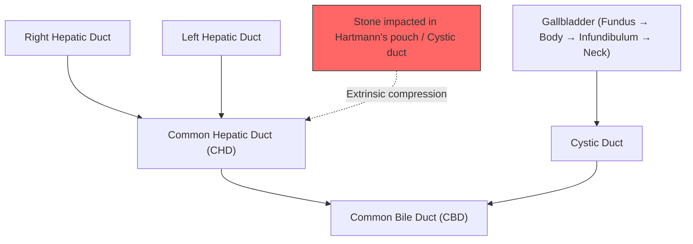
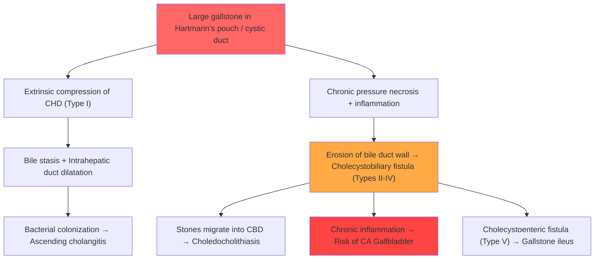

# Mirizzi Syndrome

## 1. Definition

Mirizzi syndrome is defined as **obstruction of the common hepatic duct (CHD) caused by extrinsic compression from an impacted gallstone in the cystic duct or Hartmann's pouch (infundibulum) of the gallbladder** [1][2]. The name tells you the core pathology: a gallstone that's not inside the common bile duct (CBD), but *beside* it, pushing on it from the outside.

The key conceptual distinction: this is *extrinsic* compression — the stone is in the gallbladder/cystic duct, not in the CBD itself, yet it still causes obstructive jaundice. This is what makes it a diagnostic trap.

As chronic inflammation persists, the impacted stone can erode through the wall of the cystic duct/gallbladder into the adjacent bile duct, creating a **cholecystobiliary fistula** (an abnormal communication between gallbladder and the common hepatic duct or CBD) [1][2]. This fistula is the basis for the classification system and dictates surgical approach.

<Callout title="Courvoisier's Law Exception" type="error">
***Mirizzi syndrome is a classic exception to Courvoisier's Law*** [2]. Courvoisier's Law states that in painless jaundice with an enlarged gallbladder, the cause is unlikely to be gallstones (because a chronically stone-diseased gallbladder is fibrosed and cannot distend). However, in Mirizzi syndrome, the gallbladder may be palpable because the stone is impacted at the neck/cystic duct — the gallbladder body and fundus can still distend proximal to the impaction while simultaneously causing CHD obstruction. Students frequently forget this exception.
</Callout>

---

## 2. Epidemiology

| Parameter | Detail |
|---|---|
| Incidence | **0.05–4% of patients undergoing surgery for cholelithiasis** [1] |
| Sex | Female predominance: **~50–77% are female**, reflecting the higher incidence of gallstones in women [1] |
| Age | Typically older adults (mean age 60–70 years) — correlates with long-standing gallstone disease |
| Geography | Found worldwide; follows the epidemiology of gallstone disease. In **Hong Kong**, cholelithiasis is common, and Mirizzi syndrome is an important differential for obstructive jaundice in the biliary surgical setting |

**Why the female predominance?** Because Mirizzi syndrome is a *complication* of gallstones, and gallstones are far more common in women — remember the **5Fs: Female, Fat, Forty, Fertile, Family history** [1]. More gallstones → more chance of impaction at Hartmann's pouch → more Mirizzi syndrome.

---

## 3. Risk Factors

Since Mirizzi syndrome is fundamentally a complication of gallstone disease, the risk factors are those for cholelithiasis, *plus* anatomical factors that predispose to the specific impaction pattern:

### 3a. Risk Factors for Gallstone Formation (upstream cause)

- **5Fs**: ***Female, Forty (middle age), Fat (obesity), Fertile (pregnancy/multiparity), Family history*** [1]
- Rapid weight loss (e.g., post-bariatric surgery) — increases biliary cholesterol saturation
- Diabetes mellitus
- Liver cirrhosis
- Haemolytic disorders (thalassaemia, hereditary spherocytosis, sickle cell disease) — excess bilirubin → pigment stones
- Drugs: oral contraceptives, estrogen replacement therapy — increase biliary cholesterol secretion
- Crohn's disease (terminal ileal disease → impaired bile salt reabsorption → altered bile composition)
- Total parenteral nutrition (TPN) — gallbladder stasis

### 3b. Anatomical Risk Factors Specific to Mirizzi Syndrome

- **Low insertion of the cystic duct** — when the cystic duct runs parallel to and closely alongside the CHD for a long distance, an impacted stone in the cystic duct is more likely to compress the CHD
- **Long cystic duct** running parallel to the CHD
- **Large gallstones** — stones > 1 cm are more likely to impact at Hartmann's pouch and are large enough to exert significant extrinsic compression
- **Chronic cholecystitis with recurrent inflammation** — leads to fibrosis and adhesions that "fix" the gallbladder to the bile duct, facilitating compression and eventual fistula formation

<Callout title="Why anatomy matters">
The normal anatomy has the cystic duct joining the CHD at an angle. If anatomical variants cause the cystic duct and CHD to run in close parallel, even a modestly sized stone can compress the CHD. This is why Mirizzi syndrome is relatively rare — it requires the "perfect storm" of a large stone, impacted at exactly the right spot, in a patient with favourable (or rather unfavourable) anatomy.
</Callout>

---

## 4. Anatomy and Function

Understanding Mirizzi syndrome requires a solid grasp of biliary anatomy:

### 4a. Gallbladder Anatomy

The gallbladder is a pear-shaped hollow organ on the inferior surface of the liver (segments IV and V). It has four anatomical parts [1]:

1. **Fundus** — the blind end, projects beyond the inferior liver edge at the tip of the 9th costal cartilage (transpyloric plane landmark)
2. **Body** — the main portion, lying in the gallbladder fossa
3. **Infundibulum (Hartmann's pouch)** — a saccular outpouching at the junction of the body and neck; the convexity of the curved neck. ***This is where stones classically impact in Mirizzi syndrome*** [1][2]
4. **Neck** — the narrow tapered portion leading to the cystic duct; contains the spiral valves of Heister

### 4b. The Cystic Duct and Its Relation to the CHD

- The **cystic duct** (typically 2–4 cm long) connects the gallbladder neck to the common hepatic duct
- The CHD is formed by the confluence of the right and left hepatic ducts at the **hilum (porta hepatis)**
- The cystic duct joins the CHD (usually on its lateral aspect) to form the **common bile duct (CBD)**
- **Calot's triangle** (cystohepatic triangle): bounded by the cystic duct inferiorly, common hepatic duct medially, and inferior liver edge superiorly. Contains the cystic artery (branch of right hepatic artery) and the cystic lymph node (of Lund). This is the critical dissection zone in cholecystectomy — and in Mirizzi syndrome, it is obliterated by inflammation and fibrosis, making surgery treacherous.

### 4c. The "Compression Zone"

The **proximity of Hartmann's pouch/cystic duct to the common hepatic duct** is the anatomical basis for Mirizzi syndrome. When a large stone impacts in this region, it compresses the CHD from the lateral or anterolateral aspect. The closer these structures are anatomically (particularly with a long parallel cystic duct), the easier it is for a stone to cause obstruction.

### 4d. Function

- The gallbladder concentrates and stores bile (up to 10-fold concentration) between meals
- Upon fatty meal ingestion → CCK release from duodenal I-cells → gallbladder contraction + sphincter of Oddi relaxation → bile ejection into duodenum
- In Mirizzi syndrome, gallbladder function is typically already impaired by chronic stone disease and inflammation

---

## 5. Etiology (Focused on Hong Kong Context)

### 5a. Primary Cause

**Cholelithiasis** is the overwhelmingly dominant cause. Mirizzi syndrome is essentially always caused by gallstones — specifically, **large stones (often > 1–2 cm) impacted in Hartmann's pouch or the cystic duct** [1][2].

### 5b. Types of Gallstones in Hong Kong

| Stone Type | Composition | Associations | Relevance in HK |
|---|---|---|---|
| **Cholesterol stones** (most common in West and increasingly in HK) | > 50% cholesterol monohydrate crystals | Obesity, metabolic syndrome, 5Fs, supersaturated bile | Rising prevalence with Westernisation of diet |
| **Brown pigment stones** | Calcium bilirubinate + bacterial glycoproteins | Biliary stasis, bacterial infection (E. coli β-glucuronidase), parasitic infection | ***Particularly relevant in Hong Kong*** — associated with recurrent pyogenic cholangitis (RPC / "Hong Kong disease") [1] |
| **Black pigment stones** | Calcium bilirubinate + polymers | Haemolytic disorders, cirrhosis, TPN | Less common cause of Mirizzi |

In the Hong Kong context, **recurrent pyogenic cholangitis (RPC)** is an important associated condition. RPC (also called "Oriental cholangiohepatitis" or "Hong Kong disease") involves recurrent formation of brown pigment stones within intrahepatic ducts [1]. While RPC stones typically form *within* bile ducts (de novo), the chronic biliary inflammation and stone burden can contribute to gallbladder stone formation and, rarely, Mirizzi syndrome.

***Parasitic infections*** relevant to Hong Kong and Southeast Asia that predispose to biliary stone disease include [1]:
- ***Clonorchis sinensis*** (Chinese liver fluke) — endemic in southern China, including Hong Kong
- *Opisthorchis viverrini*
- *Ascaris lumbricoides*

These parasites cause biliary inflammation, stasis, and serve as nidi for stone formation.

### 5c. Rare Causes of "Mirizzi-like" Syndrome

While classic Mirizzi syndrome is stone-related, extrinsic CHD compression can rarely be caused by:
- Gallbladder tumour (gallbladder carcinoma at the neck)
- Xanthogranulomatous cholecystitis
- Large parasitic cysts

---

## 6. Pathophysiology

This is the heart of understanding the condition. The pathophysiology proceeds in a stepwise fashion:

### Step 1: Stone Impaction

A large gallstone migrates into or forms within **Hartmann's pouch or the proximal cystic duct**. The stone becomes *impacted* — it cannot pass distally through the cystic duct (too large) and cannot fall back into the gallbladder body. This is the initiating event.

**Why Hartmann's pouch?** Because it is a natural "trap" — the pouch-like outpouching at the gallbladder neck creates a pocket where stones can lodge. The spiral valves of Heister in the cystic duct further prevent passage.

### Step 2: Extrinsic Compression of the CHD

Due to the **anatomical proximity of Hartmann's pouch/cystic duct to the CHD**, the impacted stone exerts **direct mechanical compression** on the CHD from outside [1][2]. This causes:
- **Partial or complete obstruction of bile flow** through the CHD
- **Dilatation of intrahepatic bile ducts** proximal to the obstruction
- **Normal-calibre CBD** distal to the obstruction (below the level of cystic duct insertion)

This creates the characteristic imaging finding: **dilated biliary system above the level of the gallbladder neck with an abrupt transition to normal-calibre CBD below** [1].

### Step 3: Secondary Inflammation and Cholangitis

The impacted stone and obstructed bile flow trigger:
- **Local inflammatory response** — pericholecystic inflammation, oedema, fibrosis
- **Bile stasis** proximal to obstruction → bacterial colonization → **ascending cholangitis**
- ***Recurrent episodes of cholangitis*** further exacerbate inflammation

**Why does bile stasis predispose to infection?** Normally, bile flow is sterile and the continuous antegrade flow "flushes" bacteria. When flow is obstructed, bacteria (normally present in small numbers from the duodenum via the sphincter of Oddi) multiply in the stagnant bile. The most common organisms are enteric Gram-negatives: *E. coli, Klebsiella*, and anaerobes [1].

### Step 4: Cholecystobiliary Fistula Formation (Types II–IV/V)

With **chronic inflammation and pressure necrosis**, the impacted stone can:
- **Erode through the wall of the cystic duct/gallbladder** *and* the adjacent **wall of the CHD/CBD**
- Create an **internal fistula** between the gallbladder and the bile duct — the **cholecystobiliary fistula** (or "cholecystohepatic" / "cholecystocholedochal" fistula) [1][2]

**Why does this happen?** The stone sits pressed against the bile duct wall for weeks to months. Constant pressure + inflammatory mediators + ischaemia of the compressed wall → **pressure necrosis** → wall breakdown → fistula. This is the same mechanism by which a gallstone can erode into the duodenum (creating a cholecystoenteric fistula in gallstone ileus).

The extent of bile duct wall destruction determines the **Csendes classification type** (see below).

### Step 5: Complications Cascade

Once the fistula is established:
- **Gallstones can migrate through the fistula into the CBD** → choledocholithiasis
- Chronic inflammation + biliary stasis → predispose to **gallbladder carcinoma** [1][2]
- ***Cholecystoenteric fistula*** may also form (Type V) → gallstone ileus if stone passes into bowel [2]

<Callout title="Pathophysiology in One Sentence" type="idea">
A large stone impacts in Hartmann's pouch → compresses the CHD from outside → obstructive jaundice → chronic inflammation → pressure necrosis → cholecystobiliary fistula → stone migration, recurrent cholangitis, and cancer risk.
</Callout>

---

## 7. Classification: Csendes Classification (Modified)

The **Csendes classification** (1989, updated by Csendes and Beltran 2008) is the standard classification system. It is based on the **presence, size, and extent of the cholecystobiliary fistula**, which directly determines the **surgical approach** [1][2].

| Type | Fistula | Description | Frequency | Surgical Implication |
|---|---|---|---|---|
| **Type I** | ❌ No fistula | Extrinsic compression of CHD by impacted stone in cystic duct / Hartmann's pouch. Bile duct wall is *intact*. | ~11% [1] | Cholecystectomy (laparoscopic or open). ECBD usually NOT required [1]. |
| **Type II** | ✅ Present | Cholecystobiliary fistula involving **< 1/3 of the circumference** of the CBD wall | ~41% [1] | Cholecystectomy + closure of fistula (suture repair / T-tube / choledochoplasty with gallbladder remnant) [1] |
| **Type III** | ✅ Present | Fistula involving **1/3 to 2/3 of the circumference** of the CBD wall | ~44% [1] | Cholecystectomy OR bilioenteric anastomosis (choledochoduodenostomy / choledochojejunostomy). Suture of fistula NOT required [1]. |
| **Type IV** | ✅ Present | Fistula involving **> 2/3 of the circumference** (i.e., complete destruction of the CBD wall) | ~4% [1] | **Bilioenteric anastomosis** — typically Roux-en-Y choledochojejunostomy (entire CBD wall destroyed, cannot be primarily repaired) [1] |
| ***Type V*** | Any of above + ***cholecystoenteric fistula*** | ***5A: without gallstone ileus; 5B: with gallstone ileus*** [2] | — | Address bowel obstruction (enterolithotomy for ileus) + manage biliary fistula per type |

<Callout title="Why does the classification matter?">
The extent of bile duct wall destruction dictates whether you can simply close the hole (Types II–III), or whether the entire duct is so destroyed that you need to bypass it entirely with a bilioenteric anastomosis (Type IV). A surgeon who doesn't know the Csendes type preoperatively may get a very unpleasant surprise intraoperatively.
</Callout>

<Callout title="Type V — Added Later" type="idea">
The original Csendes classification (1989) had Types I–IV. ***Type V was added by Csendes and Beltran in 2008*** to account for cases where a cholecystoenteric fistula coexists — this acknowledges the association between Mirizzi syndrome and gallstone ileus [2]. Subtypes 5A (no ileus) and 5B (gallstone ileus) are clinically important because gallstone ileus is a surgical emergency.
</Callout>

---

## 8. Clinical Features

Mirizzi syndrome has a **variable clinical presentation** [2], which is one reason it is frequently diagnosed late (often intraoperatively). The presentation depends on whether the patient has acute cholecystitis, cholangitis, or chronic biliary symptoms.

### 8a. Symptoms

| Symptom | Pathophysiological Basis |
|---|---|
| ***Jaundice*** (most common presenting feature, ~60–100%) [1][2] | Extrinsic compression of the CHD by the impacted stone → bile cannot flow from the liver to the duodenum → conjugated bilirubin accumulates in the blood → deposits in skin and sclera. This is an **obstructive (post-hepatic) jaundice** with conjugated hyperbilirubinaemia. |
| ***Right upper quadrant (RUQ) pain*** [1][2] | (i) The impacted stone in Hartmann's pouch causes gallbladder distension and inflammation → visceral pain referred to the epigastrium/RUQ. (ii) Pericholecystic inflammation involves the parietal peritoneum → localised somatic RUQ pain. (iii) May also reflect concurrent acute cholecystitis. |
| ***Fever*** (with or without rigors) [1][2] | Bile stasis → bacterial infection → ascending cholangitis (***Charcot's triad: fever, jaundice, RUQ pain***). Fever reflects systemic inflammatory response to bacteraemia. Rigors suggest Gram-negative bacteraemia with endotoxin release. |
| **Tea-coloured (dark) urine** [3] | Conjugated bilirubin is water-soluble → filtered by the kidneys → excreted in urine → dark "tea-coloured" or "cola-coloured" urine. |
| **Pale (clay-coloured) stools** [3] | Obstruction prevents conjugated bilirubin from reaching the duodenum → no conversion to stercobilinogen/stercobilin → stools lose their brown colour. |
| **Pruritus** | Retained bile salts deposit in the skin → stimulate cutaneous nerve endings → itching. The exact mechanism is debated (may involve lysophosphatidic acid and autotaxin rather than bile salts directly), but the association with obstructive jaundice is well-established. |
| **Nausea and vomiting** | Vagal-mediated reflex from gallbladder/biliary distension. Also exacerbated by concurrent pancreatitis if present. |
| **Weight loss / anorexia** | Chronic illness, recurrent biliary infections, and malabsorption of fats (due to reduced bile reaching the duodenum). Also raises concern for concurrent gallbladder carcinoma [1][2]. |

<Callout title="Charcot's Triad in Mirizzi Syndrome">
Up to 1/3 of patients present with features of **acute cholecystitis** [1], and many others present with Charcot's triad (fever + jaundice + RUQ pain) — indistinguishable from acute cholangitis from other causes. This is why Mirizzi syndrome is classically a *preoperative* or *intraoperative* surprise.
</Callout>

### 8b. Signs

| Sign | Pathophysiological Basis |
|---|---|
| **Jaundice** (scleral icterus, skin yellowing) | Conjugated hyperbilirubinaemia (clinically detectable when bilirubin > 50 µmol/L [3]). The sclerae are affected first because of high elastin content with affinity for bilirubin. |
| **RUQ tenderness** | Inflammation of the gallbladder and pericholecystic tissues → peritoneal irritation → localised tenderness. |
| **Murphy's sign** (positive in concurrent acute cholecystitis) | During deep palpation of the RUQ, the inflamed gallbladder descends with inspiration and contacts the examiner's hand → sharp pain causes inspiratory arrest. Indicates parietal peritoneal involvement by the inflamed gallbladder. |
| ***Palpable gallbladder*** [2] | The stone is impacted at the gallbladder neck/cystic duct — the body and fundus of the gallbladder proximal to the obstruction can distend (with bile/mucus/pus). This is the basis for ***Mirizzi syndrome being an exception to Courvoisier's Law*** [2]. |
| **Hepatomegaly** (mild) | Biliary obstruction → back-pressure on intrahepatic ducts → mild hepatic congestion and swelling. |
| **Fever with tachycardia** | Systemic inflammatory response to cholangitis/cholecystitis. If persistent high fever with hypotension (Reynolds' pentad: Charcot's triad + altered mental status + hypotension), suggests **suppurative cholangitis** — a surgical emergency. |
| **Excoriations** (scratch marks) | Secondary to pruritus from bile salt deposition in skin. |
| **Bleeding tendency** (ecchymoses, prolonged bleeding) [3] | ***Obstructive jaundice → reduced bile salts in gut → impaired absorption of fat-soluble vitamins (A, D, E, K) → Vitamin K deficiency → reduced synthesis of clotting factors II, VII, IX, X → coagulopathy*** [3]. |

### 8c. Associated Presentations

***Up to 1/3 of patients with Mirizzi syndrome present with concurrent acute cholecystitis*** [1], and ***in rare cases, acute pancreatitis*** [1] (if a stone also obstructs the pancreatic duct or ampulla).

***There is an important association with gallbladder cancer*** [1][2][3]:
- The chronic inflammation, biliary stasis, and repeated mucosal injury predispose to **dysplasia-carcinoma sequence**
- Incidence of concurrent gallbladder carcinoma in Mirizzi syndrome is reported as **5–28%** in various series
- This is why **CT abdomen with contrast** should be performed to look for ***enlarged porta hepatis lymph nodes or hepatic infiltration of metastasis*** [1]

<Callout title="Mirizzi Syndrome and Gallbladder Cancer" type="error">
Always think about concurrent gallbladder carcinoma when you diagnose Mirizzi syndrome. The chronic inflammation is a risk factor for malignant transformation. This is also why intraoperative frozen section of the gallbladder specimen should be considered, and why CT is essential in the workup — you need to rule out malignancy before planning surgery [1][3].
</Callout>

---

## 9. Key Pathophysiological Consequences of Obstructive Jaundice in Mirizzi Syndrome

These are the systemic effects of biliary obstruction that apply to any cause of obstructive jaundice but are directly relevant to Mirizzi syndrome management [3]:

| Consequence | Mechanism |
|---|---|
| ***Bleeding tendency*** [3] | Bile salt deficiency → malabsorption of fat-soluble vitamin K → ↓ hepatic synthesis of factors II, VII, IX, X |
| ***Infection / biliary sepsis*** [3] | (i) Endotoxaemia — obstructed liver cannot clear gut-derived endotoxins via portal circulation. (ii) Impaired reticuloendothelial (Kupffer cell) function. (iii) Impaired cell-mediated immunity. |
| ***Poor wound healing / poor anastomotic healing*** [3] | Impaired hepatic protein synthesis (albumin, pre-albumin) in the setting of biliary obstruction and chronic inflammation → poor nutritional status → poor tissue repair. |
| ***Renal impairment (hepatorenal syndrome)*** | Cholestasis → impaired renal perfusion via systemic vasodilation and endotoxin-mediated renal vasoconstriction. |

<Callout title="Preoperative Correction" type="idea">
Before operating on Mirizzi syndrome with obstructive jaundice, you must correct coagulopathy (give **Vitamin K IM/IV** at least 24–48 hours preoperatively), optimise nutrition, and ensure adequate hydration to protect the kidneys. ***Biliary decompression*** (via ERCP stenting) may be performed preoperatively to reduce bilirubin and improve hepatic function before definitive surgery [1][2].
</Callout>

---

## 10. Summary of Clinical Approach (Pre-Diagnostic Framework)

Before diving into investigations (which will be covered in the next section), the clinical approach to a suspected Mirizzi syndrome patient follows this logic:

1. **Suspect it** when you see obstructive jaundice + gallstones + features that don't quite fit choledocholithiasis (e.g., imaging shows dilated intrahepatic ducts but *no stone in the CBD*, or a contracted/inflamed gallbladder with stone at the neck)
2. **Assess severity**: Is there cholangitis? (Charcot's/Reynolds') → this determines urgency of biliary decompression
3. **Rule out malignancy**: The overlap between Mirizzi syndrome and gallbladder cancer / cholangiocarcinoma is significant — CT is essential
4. **Classify**: The Csendes type determines the surgical approach — this is usually determined by ERCP and/or intraoperative findings

> **High Yield**: Mirizzi syndrome is a "great mimicker" — it can present like acute cholecystitis, acute cholangitis, choledocholithiasis, or even biliary malignancy. The diagnosis is often made intraoperatively. Preoperative recognition is critical because it changes the surgical plan and reduces the risk of bile duct injury during cholecystectomy.

---

<Callout title="High Yield Summary">

**Definition**: CHD obstruction by extrinsic compression from a stone impacted in Hartmann's pouch / cystic duct ± cholecystobiliary fistula.

**Epidemiology**: 0.05–4% of patients undergoing cholecystectomy; F > M (reflects gallstone epidemiology).

**Risk factors**: Same as gallstones (5Fs) + anatomical factors (low cystic duct insertion, long parallel cystic duct, large stones).

**Key anatomy**: Hartmann's pouch (infundibulum) sits adjacent to the CHD — the proximity is the anatomical basis for extrinsic compression.

**Pathophysiology sequence**: Large stone impacts in Hartmann's pouch → extrinsic CHD compression → obstructive jaundice + bile stasis → chronic inflammation → pressure necrosis of bile duct wall → cholecystobiliary fistula (Types II–IV) → ± cholecystoenteric fistula (Type V).

**Csendes classification**: Type I (no fistula), Type II ( < 1/3 CBD wall), Type III (1/3–2/3), Type IV ( > 2/3 / complete destruction), Type V (any + cholecystoenteric fistula ± gallstone ileus).

**Clinical features**: Jaundice + RUQ pain + fever (Charcot's triad); ***exception to Courvoisier's Law*** (palpable GB with jaundice from stones); tea-coloured urine, pale stools, pruritus.

**Associations**: Gallbladder carcinoma (5–28%), gallstone ileus (Type V), concurrent acute cholecystitis (1/3 of cases).

**Systemic effects of obstruction**: Bleeding tendency (Vit K malabsorption), biliary sepsis (impaired Kupffer cell function), poor wound healing (impaired protein synthesis).

</Callout>

---

<ActiveRecallQuiz
  title="Active Recall - Mirizzi Syndrome (Definition, Epidemiology, Pathophysiology, Classification, Clinical Features)"
  items={[
    {
      question: "Define Mirizzi syndrome and explain why it is an exception to Courvoisier's Law.",
      markscheme: "Mirizzi syndrome = CHD obstruction by extrinsic compression from an impacted stone in Hartmann's pouch or cystic duct. Exception to Courvoisier's Law because: the stone is at the GB neck (not in the CBD) so the GB body/fundus can still distend, giving jaundice with a palpable GB from a stone-related cause (whereas Courvoisier's Law states that in painless jaundice with palpable GB, the cause is unlikely to be stones).",
    },
    {
      question: "Describe the stepwise pathophysiology from stone impaction to cholecystobiliary fistula formation.",
      markscheme: "1. Large stone impacts in Hartmann's pouch/cystic duct. 2. Extrinsic compression of CHD due to anatomical proximity. 3. Bile stasis and intrahepatic duct dilatation. 4. Recurrent cholangitis from bacterial colonisation of stagnant bile. 5. Chronic inflammation and pressure necrosis of the bile duct wall. 6. Erosion through the bile duct wall creates a cholecystobiliary fistula.",
    },
    {
      question: "List the Csendes classification types (I-V) and the key distinguishing feature for each.",
      markscheme: "Type I: No fistula, extrinsic compression only. Type II: Fistula involving less than 1/3 of CBD circumference. Type III: Fistula involving 1/3 to 2/3 of CBD circumference. Type IV: Fistula involving more than 2/3 (complete destruction) of CBD wall. Type V: Any type plus cholecystoenteric fistula (5A without gallstone ileus, 5B with gallstone ileus).",
    },
    {
      question: "Why does Mirizzi syndrome predispose to gallbladder carcinoma?",
      markscheme: "Chronic inflammation from the impacted stone, recurrent cholangitis, and biliary stasis cause repeated mucosal injury and regeneration, predisposing to dysplasia-carcinoma sequence. Incidence of concurrent gallbladder CA in Mirizzi syndrome is 5-28%.",
    },
    {
      question: "Explain the pathophysiological basis for bleeding tendency in Mirizzi syndrome.",
      markscheme: "Obstructive jaundice reduces bile salts reaching the gut. Bile salts are required for absorption of fat-soluble vitamins including vitamin K. Vitamin K is a cofactor for hepatic synthesis of clotting factors II, VII, IX, and X. Deficiency of these factors leads to coagulopathy and bleeding tendency.",
    },
    {
      question: "What characteristic imaging finding on USG suggests Mirizzi syndrome rather than choledocholithiasis?",
      markscheme: "Dilated biliary system above the level of the gallbladder neck (intrahepatic duct dilatation), with a stone impacted in the gallbladder neck/Hartmann's pouch, and an abrupt change to normal-calibre CBD below the level of the stone. In choledocholithiasis, you would expect a dilated CBD with a stone within it.",
    },
  ]}
/>

## References

[1] Senior notes: felixlai.md (Mirizzi syndrome, pp. 572–575; Cholelithiasis, p. 508; Gallbladder cancer etiology, p. 563; Obstructive jaundice, pp. 500–501; Recurrent pyogenic cholangitis, p. 526)
[2] Senior notes: maxim.md (Mirizzi syndrome, pp. 130–132; Courvoisier's Law, p. 130; Gallstone ileus, p. 132; Obstructive jaundice, p. 251)
[3] Lecture slides: Malignant biliary obstruction.pdf (Manifestations of pathophysiological disturbance of MBO: bleeding tendency, infection, poor wound healing)
