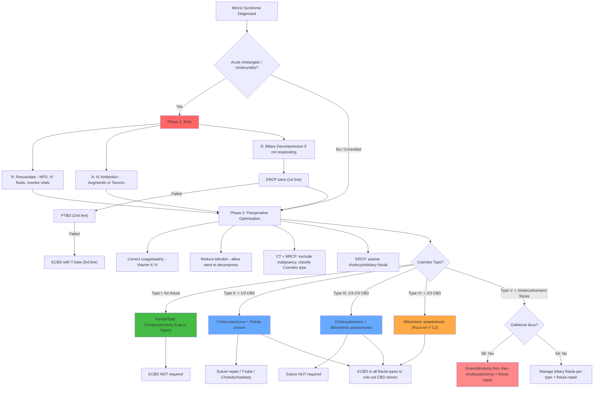

## Management of Mirizzi Syndrome

### Overarching Principles

Before diving into type-specific surgery, let's establish the fundamental management philosophy. There are three layers to managing Mirizzi syndrome:

1. **Acute stabilisation** — resuscitate, treat sepsis, decompress the biliary tree
2. **Preoperative optimisation** — correct coagulopathy, reduce bilirubin, ensure fitness for surgery
3. **Definitive surgery** — remove the gallbladder and impacted stone, and address any cholecystobiliary fistula according to Csendes type

***Surgery is the mainstay of therapy permitting removal of causal factors including the inflamed gallbladder and the impacted stones*** [1].

<Callout title="Why Surgery Is Essential">
Unlike simple choledocholithiasis (where ERCP + sphincterotomy can remove CBD stones and you may defer cholecystectomy), Mirizzi syndrome requires **cholecystectomy** because the causative stone is impacted in the gallbladder neck — it cannot be extracted endoscopically via the CBD. The gallbladder itself is the source of the problem and must be removed. ERCP plays only a **bridging role** (biliary decompression/stenting) to optimise the patient before definitive surgery [1][2].
</Callout>

---

### Phase 1: Acute Stabilisation and Resuscitation

If the patient presents with **acute cholangitis** (Charcot's triad or Reynolds' pentad) or **acute cholecystitis**, immediate management follows the **RAD** principle [16]:

#### R — Resuscitation

- **NPO** (nil per os) — bowel rest
- **IV fluid resuscitation** — correct dehydration and maintain urine output
- **Monitor vitals and I/O** — look for signs of shock (hypotension, tachycardia, oliguria, altered mental status, cold clammy skin) [7]
- **Continuous monitoring of vitals to look for signs of failure of conservative treatment**: ***↑ Temperature / Pulse; ↓ BP / Consciousness level / Urine output; Increased abdominal tenderness and guarding*** [7]

#### A — Antibiotics

- **IV broad-spectrum antibiotics** targeting Gram-negative rods and anaerobes [17][18]:
  - ***Mild: IV Augmentin*** (amoxicillin-clavulanate) [16]
  - ***Severe: IV Tazocin*** (piperacillin-tazobactam) [16]
  - Alternatives: ***Cefuroxime + Metronidazole*** [17][18]
  - Duration: typically 7 days, adjusted based on culture results

**Why these antibiotics?** The common biliary pathogens are enteric Gram-negatives (*E. coli, Klebsiella*) and anaerobes. Augmentin covers these adequately for mild cases. Tazocin has broader Gram-negative and *Pseudomonas* coverage for severe/nosocomial infections. Metronidazole specifically covers anaerobes.

#### D — Drainage (Biliary Decompression)

- **15% of patients will NOT respond to antibiotics alone** and require **emergency biliary decompression** [7]
- Indications for urgent drainage:
  - ***Reynolds' pentad*** (suppurative cholangitis with shock) [16]
  - ***Not responding to antibiotics for 24 hours*** [16] — because obstruction impairs secretion of antibiotics into bile, antibiotics alone cannot sterilise an obstructed system
  - Progressive clinical deterioration despite maximal medical therapy

**Hierarchy of drainage** (QMH practice: ***ERCP → PTBD → ECBD***) [7]:

| Modality | Details | When to Use |
|---|---|---|
| ***ERCP (1st line)*** [7][16][17] | ***Sphincterotomy + biliary stenting with endoprosthesis placement to allow temporary decompression of biliary tree*** [1]. Aspirate bile/pus to decompress. Plastic stent placed across the obstruction. Mortality < 5% [16]. | First-line for biliary decompression. ***ERCP is ALWAYS 1st line regardless of the level of obstruction*** [19] except when contraindicated. |
| **PTBD (2nd line)** [7][16] | Percutaneous transhepatic biliary drainage — catheter inserted through the liver into dilated intrahepatic ducts. Can be external or external-internal drainage. | When ***ERCP is unsuccessful or contraindicated*** (e.g. altered GI anatomy — Billroth II, Roux-en-Y) [16][17] |
| ***ECBD (3rd line)*** [7][17] | Surgical exploration of common bile duct — open approach with T-tube placement. ***High mortality (~30%)*** [16]. | ***Failure of endoscopic drainage OR deterioration despite endoscopic drainage*** [17]. Open approach for emergency cases [17]. |

<Callout title="ERCP for Decompression, NOT Definitive Treatment" type="error">
In Mirizzi syndrome, ERCP is used for **temporary biliary decompression** (stenting) and assessment of fistula — it is NOT the definitive treatment. The definitive treatment is surgery. The stent bridges the obstruction, allows bilirubin to drop, resolves cholangitis, and optimises the patient for safe elective surgery [1][2].
</Callout>

---

### Phase 2: Preoperative Optimisation

Once the acute episode is controlled, the patient must be optimised before definitive surgery:

| Issue | Correction | Rationale |
|---|---|---|
| **Coagulopathy** | Vitamin K 10 mg IV/IM × 24–48 hours preoperatively; FFP if urgent | Obstructive jaundice → Vit K malabsorption → ↓ factors II, VII, IX, X [3] |
| **Hyperbilirubinaemia** | Allow ERCP stent to decompress biliary tree for 2–4 weeks; bilirubin should trend downwards | Operating in deep jaundice → poor wound healing, infection risk, hepatorenal syndrome [3] |
| **Nutrition** | Optimise protein/caloric intake; consider pre-albumin monitoring | Chronic biliary obstruction → impaired protein synthesis → poor anastomotic healing [3] |
| **Sepsis resolution** | Complete antibiotic course; ensure afebrile with normalising WCC | Operating during active sepsis dramatically increases morbidity and mortality |
| **Renal function** | Adequate hydration; monitor UO; avoid nephrotoxic agents | Obstructive jaundice predisposes to renal impairment |
| **Malignancy assessment** | CT ± MRCP to exclude concurrent gallbladder carcinoma | 5–28% coexistence rate — changes surgical plan entirely [1][2] |

> ***Definitive treatment should be deferred until cholangitis has been treated and the proper diagnosis is established*** [7]

---

### Phase 3: Definitive Surgical Management — By Csendes Type

***The treatment approach is based on the presence and type of cholecystobiliary fistula*** [1][2].

This is the core exam-testable content. The logic is straightforward:
- **No fistula (Type I)**: Remove the gallbladder — the bile duct wall is intact, no repair needed
- **Small fistula (Type II)**: Remove the gallbladder + close the small hole in the bile duct
- **Moderate fistula (Type III)**: The hole is too big for simple closure — consider bilioenteric anastomosis
- **Complete destruction (Type IV)**: The entire CBD wall is gone — you MUST bypass with bilioenteric anastomosis
- **Cholecystoenteric fistula (Type V)**: Address the bowel problem (gallstone ileus if present) AND the biliary fistula

#### Type I: No Cholecystobiliary Fistula

**Pathology**: Extrinsic compression of CHD by stone — bile duct wall intact.

**Surgery**: ***Partial or total cholecystectomy (laparoscopic or open)*** [1]

- ***ECBD (exploration of CBD) is typically NOT required*** [1] — because there is no fistula and the bile duct wall is intact, there is nothing to repair in the CBD
- **Laparoscopic approach** is feasible in select cases but carries high risk of conversion to open due to dense adhesions
- If the critical view of safety cannot be achieved (anatomy distorted by inflammation), consider:
  - **Intraoperative cholangiogram (IOC)** to delineate anatomy
  - **Subtotal (partial) cholecystectomy** — leave the posterior wall of the GB attached to the liver bed and remove the rest, rather than risking bile duct injury by forcing a complete dissection

**Why laparoscopic is difficult**: ***Laparoscopic management of Mirizzi syndrome can be difficult due to dense adhesions and edematous inflammatory tissue cause distortion of normal anatomy and increase the risk of biliary injury*** [1]. Calot's triangle is obliterated by fibrosis. The cystic duct, cystic artery, and CHD are fused together. The ***Critical View of Safety*** — normally requiring clear identification of only **two structures entering the gallbladder (cystic duct and cystic artery)** with clearance of the hepatocystic triangle and cystic plate [20][21] — is often impossible to obtain.

<Callout title="Critical View of Safety" type="error">
The ***Critical View of Safety (CVS)*** is the gold standard for preventing bile duct injury during cholecystectomy [21]. It requires: (1) hepatocystic triangle cleared of fat and fibrous tissue, (2) lower 1/3 of cystic plate visible, (3) ***only two structures seen entering the gallbladder: cystic duct and cystic artery*** [21]. In Mirizzi syndrome, achieving CVS is frequently impossible due to dense inflammation. ***Difficulty with obtaining the critical view should lead the surgeon to consider performing IOC or converting to open*** [20]. Never clip or divide a structure you cannot positively identify.
</Callout>

#### Type II: Fistula < 1/3 CBD Circumference

**Pathology**: Small cholecystobiliary fistula — most of the CBD wall is intact.

**Surgery**: ***Cholecystectomy plus closure of fistula*** [1] using one of:
- ***Suture repair with absorbable material*** — primary closure of the small defect in the bile duct wall
- ***T-tube placement*** — a T-shaped tube placed in the CBD to stent the repair, with the long limb exiting through the abdominal wall. Allows postoperative cholangiogram to check for leaks and residual stones. The T-tube is removed after 2–4 weeks once a fibrous tract has formed.
- ***Choledochoplasty with remnant gallbladder*** — using a pedicled flap of the gallbladder wall (the remnant after subtotal cholecystectomy) to patch the defect in the CBD. This is elegant because it uses autologous tissue with a blood supply.

**Why these options?** The defect is small ( < 1/3 circumference), so the remaining CBD wall has enough structural integrity to support a primary repair. There is no need for a bypass because the duct can be reconstructed.

#### Type III: Fistula 1/3–2/3 CBD Circumference

**Pathology**: Moderate-sized fistula — significant CBD wall destruction but not complete.

**Surgery**: ***Cholecystectomy OR bilioenteric anastomosis*** [1]
- ***Bilioenteric anastomosis includes choledochoduodenostomy, choledochojejunostomy, or cholecystoduodenostomy*** [1]
- ***Suture of the fistula is NOT required*** [1] — because the defect is too large for primary closure; attempting to close it would cause stricture due to tension on the suture line

**Why bilioenteric anastomosis?** When > 1/3 of the CBD circumference is destroyed, primary repair would narrow the duct lumen (tension on the remaining edges), leading to postoperative biliary stricture. Instead, you bypass the damaged segment by connecting the proximal healthy bile duct directly to a loop of bowel, allowing bile to drain into the intestine via a new route.

The choice between different anastomosis types:
- **Choledochoduodenostomy**: simpler; CBD → duodenum. Risk of "sump syndrome" (food debris/bacteria accumulating in the CBD stump distal to the anastomosis)
- **Choledochojejunostomy (Roux-en-Y)**: CBD → jejunal limb. More complex but lower risk of reflux cholangitis because the Roux limb keeps food/bacteria away from the biliary anastomosis
- Cholecystoduodenostomy is rarely used

#### Type IV: Fistula > 2/3 CBD Circumference (Complete Destruction)

**Pathology**: Near-complete or complete destruction of the CBD wall.

**Surgery**: ***Bilioenteric anastomosis — typically choledochojejunostomy since the entire wall of CBD has been destroyed*** [1]

**Why choledochojejunostomy specifically?** With complete CBD wall destruction, there is no CBD left to repair. You must create a Roux-en-Y hepaticojejunostomy/choledochojejunostomy — bringing a loop of jejunum up to the proximal healthy bile duct (common hepatic duct or hepatic duct stumps) and creating an end-to-side or side-to-side anastomosis. The Roux-en-Y configuration is preferred over choledochoduodenostomy in this scenario because it provides a longer defunctioned limb, reducing the risk of ascending cholangitis from intestinal content reflux.

#### Type V: Any Type + Cholecystoenteric Fistula ± Gallstone Ileus

**Pathology**: Mirizzi syndrome (any Csendes type) coexisting with a ***cholecystoenteric fistula*** (communication between GB and bowel) [2]. If a large stone has passed into the bowel and caused obstruction → ***gallstone ileus*** (Type 5B).

**Surgery** — Two separate problems to address:

**A. If gallstone ileus present (Type 5B)** — address the bowel obstruction first:
- ***Enterolithotomy to relieve SBO*** [2]:
  - Exploratory laparotomy
  - ***Proximal enterotomy (NOT over the stone because of ulceration)*** [2] — the bowel wall at the site of stone impaction is inflamed and ulcerated; cutting there risks breakdown of the enterotomy closure
  - ***Milk the stone proximally for extraction*** [2]
  - Inspect the entire bowel for additional stones (second stone found in ~3–16% of cases)
- Then: ***Same-session or elective cholecystectomy + fistula repair*** [2]

**B. Biliary fistula** — manage per the corresponding Csendes type (I–IV) as described above

---

### Summary Table: Type-Specific Surgical Management

| Csendes Type | Fistula | Surgery on Gallbladder | Surgery on Bile Duct | ECBD Required? |
|---|---|---|---|---|
| **I** | None | ***Partial or total cholecystectomy (laparoscopic or open)*** [1] | None — duct wall intact | ***NOT required*** [1] |
| **II** | < 1/3 CBD | Cholecystectomy (usually subtotal) | ***Suture repair / T-tube / Choledochoplasty with GB remnant*** [1] | Yes (to rule out CBD stones) [1] |
| **III** | 1/3–2/3 CBD | Cholecystectomy | ***Bilioenteric anastomosis*** [1]; suture ***NOT required*** [1] | Yes [1] |
| **IV** | > 2/3 CBD | Cholecystectomy | ***Bilioenteric anastomosis (typically choledochojejunostomy)*** [1] | Yes [1] |
| **V** | Any + cholecystoenteric | Cholecystectomy + fistula repair | Per type above | Yes [1] |

> ***ECBD should be performed in all patients with cholecystobiliary fistula to rule out concomitant choledocholithiasis (CBD stones) unless it has been performed endoscopically*** [1]

---

### Open vs Laparoscopic Approach

| Factor | Laparoscopic | Open |
|---|---|---|
| Feasibility in Mirizzi | Feasible mainly for **Type I** (simple compression, no fistula) [1][2] | Required for **Types II–V** due to fistula complexity [2] |
| Advantages | Less pain, shorter stay, faster recovery, better cosmesis [20] | Better exposure for complex biliary reconstruction |
| Disadvantages | ***Higher risk of biliary injury*** due to distorted anatomy and dense adhesions [1][20] | Larger incision, longer recovery |
| Conversion | Should never be viewed as failure — it is a safety measure [20] | — |

***With fistula (Types II–V): open surgery*** [2]:
- **GB**: ***Subtotal cholecystectomy (severe inflammation impedes safe dissection of Calot's triangle)*** [2]
- **CBD**: ***Closure of fistula / choledochoplasty / bilioenteric anastomosis (choledochojejunostomy) depending on size of defect*** [2]

---

### Special Situations

#### Concurrent Gallbladder Carcinoma

If intraoperative frozen section reveals **gallbladder carcinoma**:
- Abort the standard Mirizzi surgery
- Proceed to **oncological resection**: open cholecystectomy with intraoperative frozen section → if beyond stage T1a, perform ***extended cholecystectomy*** with en-bloc resection of liver segments IVb/V, extrahepatic bile duct resection (if cystic duct margin involved), and regional lymphadenectomy [9]

#### Patient Unfit for Surgery

- **Percutaneous cholecystostomy**: drainage of the gallbladder for patients who are haemodynamically unstable, high surgical risk, or have severe comorbidities [22][18]
  - Indications: ***high surgical risk, haemodynamically unstable, difficult cholecystectomy*** [18]
  - Can be percutaneous (USG/CT-guided) or endoscopic (ERCP/EUS-guided)
  - Allows decompression and infection control as a bridge to interval surgery or as definitive palliation in the very frail
- **Long-term ERCP stenting** can be used as definitive palliation in patients truly unfit for any surgery — stent exchanges every 3–6 months to prevent occlusion

#### Non-Operative Management with ERCP Alone

In very select cases (elderly, high ASA grade, Type I only), some centres have reported managing Mirizzi Type I non-operatively with ERCP stone extraction ± electrohydraulic lithotripsy, but this is not standard of care and recurrence is high.

---

### Management Algorithm — Mermaid Diagram

---

### Contraindications and Cautions

| Scenario | Contraindication / Caution | Alternative |
|---|---|---|
| **Laparoscopic approach in Types II–V** | Relative contraindication — fistula requires open reconstruction; dense adhesions → high risk of bile duct injury [1][2] | Open surgery with subtotal cholecystectomy [2] |
| **ERCP** | ***Contraindicated in altered GI anatomy (Billroth II, Roux-en-Y)*** [17][19]; unstable cardiopulmonary disease; known/suspected perforation; structural upper GI abnormalities [23] | PTBD or surgical drainage |
| **Operating during active sepsis** | Relative contraindication — dramatically increases morbidity. Stabilise first with RAD [7][16] | Biliary decompression → interval surgery |
| **Operating in deep jaundice** | Relative contraindication — poor wound healing, bleeding tendency, hepatorenal risk [3] | Preoperative biliary drainage via ERCP stent × 2–4 weeks to lower bilirubin |
| **Concurrent malignancy** | Standard Mirizzi surgery is contraindicated — must perform oncological resection or palliation depending on staging [9] | Extended cholecystectomy or palliative stenting |
| **Refractory coagulopathy** | Relative contraindication for laparoscopic surgery | Open approach; correct coagulopathy with FFP/Vit K [20] |

---

### Postoperative Considerations

- **T-tube management** (if placed):
  - Check tube cholangiogram at 7–10 days postoperatively to confirm no leak and no residual stones
  - If cholangiogram is normal → clamp T-tube → if patient tolerates (no pain, no fever) → remove after fibrous tract has matured (~2–4 weeks)
  - T-tubes have been shown to increase complications (infection, bile leak, tube dislodgement) compared to primary closure [5]

- **Follow-up imaging**: USG at 3–6 months to assess for biliary stricture (a late complication of fistula repair)

- **Histopathology**: Send all gallbladder specimens for histological examination — given the 5–28% risk of concurrent gallbladder carcinoma, intraoperative frozen section and final histology are essential

- **Long-term**: Monitor for biliary stricture, recurrent cholangitis, or missed malignancy

---

<Callout title="High Yield Summary">

**Management framework**: RAD (Resuscitate → Antibiotics → Drainage) for acute presentation → Preoperative optimisation → Definitive surgery based on Csendes type.

**ERCP role**: ***Temporary biliary decompression (sphincterotomy + stenting)*** [1] — NOT definitive treatment. Hierarchy: ***ERCP → PTBD → ECBD*** [7].

**Surgical management by type**:
- **Type I** (no fistula): ***Cholecystectomy (lap or open); ECBD NOT required*** [1]
- **Type II** ( < 1/3): ***Cholecystectomy + fistula closure (suture/T-tube/choledochoplasty)*** [1]
- **Type III** (1/3–2/3): ***Cholecystectomy OR bilioenteric anastomosis; suture NOT required*** [1]
- **Type IV** ( > 2/3): ***Bilioenteric anastomosis (choledochojejunostomy)*** [1]
- **Type V**: Address gallstone ileus (***enterolithotomy***) if present + manage biliary fistula per type [2]

**Key principles**:
- ***ECBD in all fistula types to rule out CBD stones*** unless done endoscopically [1]
- ***Types II–V: open surgery*** with ***subtotal cholecystectomy*** (Calot's triangle too inflamed for safe dissection) [2]
- ***Critical View of Safety*** often unachievable → low threshold to convert to open [20][21]
- Always send gallbladder for histology — rule out concurrent CA gallbladder

</Callout>

---

<ActiveRecallQuiz
  title="Active Recall - Mirizzi Syndrome Management"
  items={[
    {
      question: "What is the definitive treatment for Mirizzi syndrome? Why can ERCP alone not be the definitive treatment?",
      markscheme: "Definitive treatment is surgery (cholecystectomy + management of fistula based on Csendes type). ERCP alone is not definitive because the causative stone is impacted in the GB neck/Hartmann's pouch, not in the CBD — it cannot be extracted endoscopically from the CBD. ERCP provides only temporary biliary decompression via stenting as a bridge to surgery.",
    },
    {
      question: "Describe the surgical management for Csendes Type II vs Type IV Mirizzi syndrome and explain the rationale for the difference.",
      markscheme: "Type II (fistula < 1/3 CBD): Cholecystectomy + closure of fistula by suture repair with absorbable material, T-tube placement, or choledochoplasty with GB remnant. Rationale: the defect is small and the remaining CBD wall has structural integrity for primary repair. Type IV (fistula > 2/3 CBD, complete destruction): Bilioenteric anastomosis, typically Roux-en-Y choledochojejunostomy. Rationale: the entire CBD wall is destroyed so there is nothing to repair; must bypass the damaged segment by connecting proximal bile duct directly to jejunum.",
    },
    {
      question: "In Mirizzi syndrome Types II-V, why is open surgery preferred over laparoscopic? What surgical technique is used for the gallbladder?",
      markscheme: "Open surgery preferred because: (1) fistula requires complex biliary reconstruction not easily done laparoscopically, (2) dense adhesions and edematous tissue distort anatomy and increase risk of biliary injury. Subtotal cholecystectomy is used because severe inflammation impedes safe dissection of Calot's triangle — leaving the posterior GB wall on the liver bed avoids injury to the bile duct and hepatic artery.",
    },
    {
      question: "What is the hierarchy of biliary drainage in acute cholangitis complicating Mirizzi syndrome at QMH? When is surgical drainage indicated?",
      markscheme: "Hierarchy: ERCP (1st line) then PTBD (2nd line) then ECBD (3rd line). Surgical drainage (ECBD with T-tube) is indicated when: (1) failure of endoscopic drainage, or (2) deterioration despite endoscopic drainage. ECBD carries high mortality (~30%) and is reserved as last resort.",
    },
    {
      question: "Why must ECBD be performed in all patients with cholecystobiliary fistula (Csendes Types II-IV)?",
      markscheme: "To rule out concomitant choledocholithiasis (CBD stones). Once a cholecystobiliary fistula exists, stones can migrate from the gallbladder through the fistula into the CBD. Missing residual CBD stones would lead to recurrent cholangitis and obstruction postoperatively. ECBD is not required if stone clearance has already been confirmed endoscopically by ERCP.",
    },
    {
      question: "A patient with Mirizzi syndrome Type V-B presents with small bowel obstruction. Describe the surgical management of the bowel obstruction, including the specific technique and its rationale.",
      markscheme: "Enterolithotomy to relieve SBO: exploratory laparotomy, proximal enterotomy (NOT over the stone because bowel wall at impaction site is ulcerated and prone to breakdown), milk the stone proximally for extraction. Inspect entire bowel for additional stones (3-16% have second stone). Then same-session or elective cholecystectomy + cholecystoenteric fistula repair + manage biliary fistula per Csendes type.",
    },
  ]}
/>

## References

[1] Senior notes: felixlai.md (Mirizzi syndrome treatment, pp. 574–575)
[2] Senior notes: maxim.md (Mirizzi syndrome management and gallstone ileus, pp. 131–132)
[3] Lecture slides: Malignant biliary obstruction.pdf (Manifestations of pathophysiological disturbance of MBO)
[5] Senior notes: maxim.md (Choledocholithiasis management — T-tube complications, p. 136)
[7] Senior notes: felixlai.md (Acute cholangitis treatment — biliary decompression hierarchy, QMH practice, p. 522)
[9] Senior notes: maxim.md (Gallbladder carcinoma treatment — extended cholecystectomy, p. 139)
[16] Senior notes: maxim.md (Acute cholangitis acute management — RAD, p. 135)
[17] Lecture slides: GC 200. RUQ pain, jaundice and fever Cholecytitis and cholangitis Imaging of GI system.pdf (Acute cholangitis management — ERCP, antibiotics, ECBD, pp. 13–15)
[18] Lecture slides: GC 200. RUQ pain, jaundice and fever Cholecytitis and cholangitis Imaging of GI system.pdf (Cholecystostomy indications, p. 12)
[19] Senior notes: felixlai.md (ERCP is always 1st line for biliary drainage, p. 504)
[20] Senior notes: felixlai.md (Cholecystectomy — CVS, conversion to open, subtotal cholecystectomy, pp. 513–514)
[21] Senior notes: maxim.md (Critical View of Safety, p. 133)
[23] Senior notes: felixlai.md (ERCP contraindications, p. 87)
