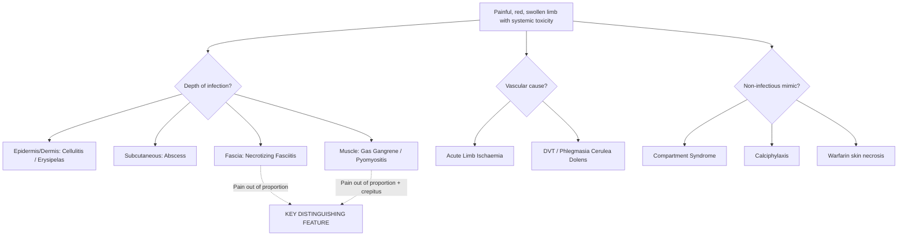

## Differential Diagnosis of Necrotizing Fasciitis

### Why is the DDx So Important Here?

Necrotizing fasciitis is a **surgical emergency** where every hour of delay to debridement increases mortality. The problem? In its early stage (Stage 1), NF can look identical to several far more common and far less dangerous conditions — particularly **cellulitis**. The differential diagnosis of NF is essentially the differential of **"an acutely painful, red, swollen limb (or trunk/perineum) with systemic toxicity."** The goal is to distinguish NF from its mimics as early as possible so you don't waste time treating cellulitis with antibiotics while the fascia is dying underneath.

As the lecture slides emphasise: ***early recognition and a high index of suspicion are important if life-threatening infections*** [1]. You need to be ***highly suspicious*** [1] — it is better to take a patient to theatre unnecessarily for exploration than to miss NF.

---

### The Differential Diagnosis — Organised by Depth of Infection

The key organising principle here is the ***layers of soft tissue and associated disease*** framework from the lecture slides [1]. Each layer of tissue has its own characteristic infection, and the DDx of NF essentially involves working through these layers:

---

### Detailed Differential Diagnosis Table

| Condition | Layer Involved | Key Clinical Features | How to Distinguish from NF | Why It Can Mimic NF |
|---|---|---|---|---|
| **Cellulitis** | ***Dermis*** [1] | Spreading erythema, warmth, tenderness, fever; well-demarcated borders; pain **proportionate** to skin changes | Responds to IV antibiotics within 24–48 h; no bullae, no crepitus, no skin necrosis; pain is proportionate | Both present with red, warm, swollen, tender skin with fever — the overlap is greatest in Stage 1 NF |
| **Erysipelas** | ***Dermis*** (upper) [1] | Sharply demarcated, raised, bright red "peau d'orange" plaque; usually face or lower limb; GAS | Very well-demarcated raised border (unlike NF which has ill-defined margins); superficial; responds rapidly to penicillin | Red, hot, swollen skin with fever can look like early NF |
| **Abscess** (soft tissue) | ***Deep dermis / subcutaneous*** [1][3] | Raised, tender, fluctuant nodule with central purulence; localised; *S. aureus* | Localised and well-circumscribed; fluctuant (not woody hard); no disproportionate pain; no systemic toxicity (unless very large) | Can be the portal of entry *for* NF; a deep abscess with surrounding induration may progress to NF |
| ***Gas gangrene (Clostridial myonecrosis)*** [5] | ***Perimysium / Muscle*** [1] | ***Most commonly caused by C. perfringens*** [5]; ***rapid clinical onset, crepitus is characteristic*** [5]; ***blisters containing foul smelling brownish liquid with gas bubbles*** [5]; ***no neutrophilia*** [3] (alpha-toxin kills neutrophils) | Crepitus is more prominent and earlier; XR shows ***linear streak of gas*** [3]; CBC shows ***no neutrophilia*** [3]; muscle involvement predominates (vs. fascia in NF); often post-traumatic | Both present with pain out of proportion, rapid progression, systemic toxicity, and tissue necrosis — they exist on a **spectrum** and can coexist |
| **Pyomyositis** | Muscle | Deep muscular pain, fever; usually *S. aureus*; common in tropics and immunocompromised (HIV) | More insidious onset than NF; localised to a muscle group; no bullae or skin necrosis early; MRI shows intramuscular abscess | Deep pain with fever and toxicity can mimic NF, especially when overlying skin is secondarily involved |
| ***Infective tenosynovitis*** [1] | Tendon sheath | Kanavel signs: fusiform swelling, flexed posture, tenderness along sheath, pain with passive extension; typically hand/fingers | Follows tendon sheath anatomy (linear); fusiform swelling of finger; Kanavel signs present; localised | Can track along tendon sheaths rapidly, mimicking the fascial plane spread of NF; *can progress to* NF |
| ***Acute limb ischaemia*** [6] | Vascular | ***6Ps: Pain, Paraesthesia, Pallor, Pulseless, Perishingly cold, Paralysed*** [6]; sudden onset; cold pale limb | **Pulseless** (NF usually has palpable pulses until late); **cold** (NF skin is initially warm); no erythema (pale/mottled instead); no bullae early | Both can present with severe pain in a limb with colour changes; late NF with vascular occlusion can cause a cool, mottled limb mimicking ischaemia |
| ***DVT / Phlegmasia cerulea dolens*** [6] | Venous | ***Painful blue oedema*** [6]; massive swelling; cyanotic limb; may have palpable pulses (venous, not arterial occlusion) | Swelling is the dominant feature (not erythema); limb is cyanotic/blue (not red/warm initially); Doppler shows venous occlusion; venous pressure increased impairs perfusion [6] | Swollen, painful limb with colour changes and systemic toxicity |
| ***Compartment syndrome*** [6] | Fascial compartment (enclosed space) | ***Pain with passive stretch*** of compartment muscles; tense, wooden compartment; often post-fracture or post-ischaemia-reperfusion | Typically post-traumatic context; pain specifically with passive stretch (pathognomonic); no skin colour changes early; compartment pressure > 30 mmHg diagnostic | Severe pain "out of proportion" in a swollen limb — the most commonly confused condition with NF in post-traumatic settings |
| **Calciphylaxis** | Subcutaneous / dermal vasculature | Extremely painful, violaceous, retiform (net-like) purpura → necrotic eschar; CKD on dialysis with Ca/PO4 derangement | Chronic renal failure context; net-like livedo pattern (not spreading erythema); calcification on imaging; biopsy shows small vessel calcification | Painful skin necrosis with systemic illness in a renal patient |
| **Warfarin skin necrosis** | Dermal microvasculature | Painful purpuric skin → necrosis; occurs days 3–6 after warfarin initiation; protein C/S deficiency predisposes | Temporal relationship with warfarin initiation; well-demarcated necrotic patches; no systemic sepsis; typically fatty areas (breasts, buttocks, thighs) | Painful, rapidly progressive skin necrosis |
| **Toxic epidermal necrolysis (TEN)** | Epidermis / dermal-epidermal junction | Widespread erythema → flaccid bullae → epidermal detachment (Nikolsky sign +); drug reaction; mucosal involvement | Drug history (sulfonamides, allopurinol, anticonvulsants); mucosal involvement; Nikolsky sign; widespread and symmetrical (not localised); biopsy shows full-thickness epidermal necrosis | Widespread bullae and skin necrosis with systemic toxicity |
| **Contact dermatitis / Burns** | Epidermis/dermis | Clear exposure history; distribution matches contactant/burn; pain proportionate; no systemic toxicity unless extensive | History of exposure; distribution pattern; no fascia involved; no crepitus | Bullae and skin erythema can look alarming |

---

### Perineal DDx — Fournier's Gangrene Specifically

When NF involves the perineum, the DDx also includes [2]:

| Condition | How to Distinguish from Fournier's Gangrene |
|---|---|
| **Testicular torsion** | Acute scrotal pain; high-riding testis; absent cremasteric reflex; Doppler shows absent testicular blood flow; no skin necrosis or crepitus |
| **Epididymitis / Orchitis** | Gradual onset; tenderness localised to epididymis; Prehn sign positive (relief with elevation); positive urine culture; no skin changes |
| **Incarcerated inguinal hernia** | Groin swelling that is irreducible; bowel obstruction symptoms (vomiting, distension); hernia is palpable above the testis |
| **Perianal / ischiorectal abscess** | Localised fluctuant perianal swelling; no spreading necrosis; can be the *source* that progresses to Fournier's if untreated |
| **HSP scrotal involvement** | Purpuric rash on scrotum and lower limbs; joint pain; abdominal pain; IgA vasculitis; paediatric age group; no necrosis |

---

### The Critical Distinguishing Features — What Separates NF from the Rest

The following features, when present, should make you think ***"this is NOT just cellulitis — this could be NF"***:

> **Red Flags for NF (vs. Cellulitis / Other DDx)**:
> 1. ***Pain out of proportion to clinical findings*** [1][3]
> 2. ***Haemorrhagic bullae*** [3]
> 3. Skin colour changes: dusky, grey, purplish (not bright red)
> 4. ***Tissue crepitation*** [1]
> 5. Rapid progression despite IV antibiotics
> 6. ***Systemic toxicity*** out of proportion — ***low platelet count***, hypotension, confusion [1]
> 7. ***Skin anaesthesia / hyposensitivity*** [1] — cellulitis is always tender; NF progresses from pain to numbness
> 8. ***Dirty "dishwater" discharge*** [3] from wound or incision
> 9. ***Lack of response to antibiotics*** within 24–48 hours
> 10. Wood-hard induration of subcutaneous tissue (vs. the soft, pitting oedema of cellulitis)

### DDx of "Pain Out of Proportion" — A Key Clinical Clue

"Pain out of proportion to clinical signs" is not unique to NF. It narrows the differential but doesn't clinch it. The conditions sharing this feature are:

| Condition | Why Pain is Disproportionate |
|---|---|
| **Necrotizing fasciitis** | Deep fascial ischaemia/necrosis but minimal overlying skin changes early |
| ***Gas gangrene*** [3][5] | Muscle necrosis from alpha-toxin; tissue destruction outpaces visible changes |
| **Compartment syndrome** | Ischaemia of muscles within a tight fascial compartment |
| **Acute mesenteric ischaemia** (abdominal equivalent) | Bowel ischaemia but peritoneal signs lag behind |
| **Ischaemic limb** | Tissue ischaemia |

<Callout title="Exam Pitfall — DDx of Pain Out of Proportion" type="error">
When an exam vignette describes "pain out of proportion to clinical findings," do NOT immediately jump to NF. Consider the **context**: post-traumatic → think compartment syndrome; abdominal → think mesenteric ischaemia; limb with absent pulses → think acute limb ischaemia; limb with crepitus and no neutrophilia → think gas gangrene. The context narrows the DDx for you.
</Callout>

---

### NF vs Gas Gangrene — A Common Exam Comparison

These two conditions often coexist and overlap, but there are key distinguishing features [3][5]:

| Feature | Necrotizing Fasciitis | Gas Gangrene |
|---|---|---|
| **Primary layer** | ***Deep fascia*** [1] | ***Muscle (perimysium)*** [1] |
| **Common organisms** | ***S. pyogenes, V. vulnificus, polymicrobial*** [3] | ***C. perfringens*** [5] |
| **Crepitus** | May or may not be present | ***Characteristic*** [5] — prominent and early |
| **WBC** | Leucocytosis (often > 15,000) | ***No neutrophilia*** [3] (C. perfringens inhibits inflammatory response) |
| **XR** | May show soft tissue gas (inconsistent) | ***Linear streak of gas*** [3] — consistent finding |
| **Discharge** | ***Dirty "dishwater" pus*** [3] | ***Foul smelling brownish liquid with gas bubbles*** [5] |
| **Bullae content** | Serous → haemorrhagic | Brownish with gas bubbles |
| **Context** | Any; seafood exposure; post-surgical; immunocompromised | ***Recent trauma / GI surgery*** [3] |
| **Onset** | Hours to days | ***Rapid*** — often within hours [5] |

---

### Sequelae of Missed/Delayed Diagnosis [1]

***If not treated promptly*** [1]:
- ***Amputation*** — ***HK figure: radical debridements (amputations and disarticulations) were performed in 46% of 24 patients*** [1]
- ***Mortality ranges from 20 to 75%*** [1]

This underscores why the DDx matters: missing NF and treating it as cellulitis leads to catastrophic outcomes.

<Callout title="High Yield Summary — Differential Diagnosis">

**The #1 DDx pitfall**: NF is misdiagnosed as **cellulitis** in up to 50–70% of initial presentations. Key differentiators: NF has pain out of proportion, haemorrhagic bullae, skin anaesthesia, failure to respond to antibiotics, and systemic toxicity disproportionate to skin findings.

**Red flags that distinguish NF from cellulitis**: Pain out of proportion, haemorrhagic bullae, crepitus, dishwater discharge, skin hyposensitivity/anaesthesia, failure to improve on IV antibiotics, systemic toxicity.

**"Pain out of proportion" DDx**: NF, gas gangrene, compartment syndrome, acute limb ischaemia, mesenteric ischaemia.

**NF vs Gas Gangrene**: Fascia vs muscle; polymicrobial/GAS/Vibrio vs *C. perfringens*; leucocytosis vs ***no neutrophilia***; dishwater pus vs brownish liquid with gas bubbles.

**Perineal NF (Fournier's)**: DDx includes testicular torsion, epididymitis, incarcerated hernia, perianal abscess, HSP.

***Mortality 20–75% if not treated promptly; 46% of HK patients required amputation*** [1].
</Callout>

---

<ActiveRecallQuiz
  title="Active Recall - DDx of Necrotizing Fasciitis"
  items={[
    {
      question: "Name the single most common condition that necrotizing fasciitis is misdiagnosed as, and list four clinical features that help distinguish NF from it.",
      markscheme: "Cellulitis. Distinguishing features (any 4): pain out of proportion, haemorrhagic bullae, skin anaesthesia/hyposensitivity, crepitus, dishwater discharge, failure to respond to IV antibiotics within 24-48h, systemic toxicity disproportionate to skin findings, wood-hard induration, rapidly extending beyond erythema margins."
    },
    {
      question: "List four conditions that share the clinical feature of 'pain out of proportion to clinical findings' and briefly explain the mechanism for each.",
      markscheme: "1. Necrotizing fasciitis - fascial ischaemia/necrosis beneath normal-appearing skin. 2. Gas gangrene - muscle necrosis from alpha-toxin. 3. Compartment syndrome - muscle ischaemia within tight fascial compartment. 4. Acute limb ischaemia - tissue ischaemia from arterial occlusion. 5. Acute mesenteric ischaemia - bowel ischaemia before peritoneal signs develop. (Any 4 with mechanisms.)"
    },
    {
      question: "How do you differentiate gas gangrene from necrotizing fasciitis on CBC and plain X-ray?",
      markscheme: "CBC: Gas gangrene shows NO neutrophilia (C. perfringens alpha-toxin inhibits neutrophil migration and kills neutrophils); NF typically shows leucocytosis. XR: Gas gangrene shows linear streaks of gas; NF may or may not show soft tissue gas."
    },
    {
      question: "What are the sequelae of delayed treatment of NF according to Hong Kong data presented in the lecture?",
      markscheme: "Radical debridements including amputations and disarticulations were performed in 46% of 24 patients. Mortality ranges from 20 to 75%."
    },
    {
      question: "A patient presents with acute scrotal pain and swelling with overlying skin necrosis. List the differential diagnosis for this presentation.",
      markscheme: "Fournier's gangrene (perineal NF), testicular torsion, epididymitis/orchitis, incarcerated inguinal hernia, perianal/ischiorectal abscess, HSP with scrotal involvement, scrotal trauma."
    }
  ]}
/>

## References

[1] Lecture slides: GC 237. Musculoskeletal infection [Updated in 2025] (1).pdf (p3, p36, p37, p39, p42, p44, p54)
[2] Senior notes: felixlai.md (Testicular torsion - DDx of scrotal pain including Fournier's gangrene)
[3] Senior notes: maxim.md (NF table entries, gas gangrene, LRINEC score)
[5] Lecture slides: GC 237. Musculoskeletal infection [Updated in 2025] (1).pdf (p51, Gas Gangrene)
[6] Senior notes: felixlai.md (Acute limb ischaemia 6Ps, DVT/phlegmasia cerulea dolens, compartment syndrome)
