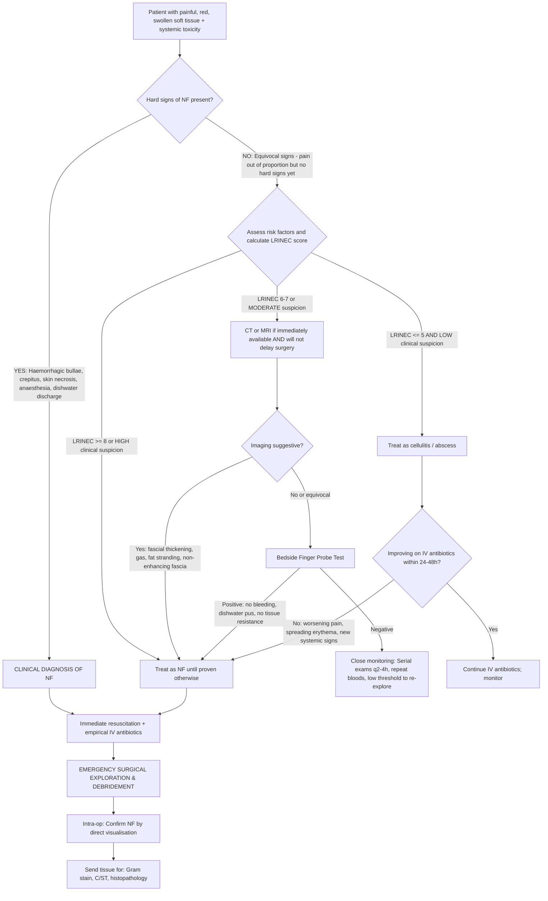

## Diagnosis of Necrotizing Fasciitis — Criteria, Algorithm & Investigations

### The Fundamental Diagnostic Principle

Let me be very direct here: **necrotizing fasciitis is a clinical and surgical diagnosis**. No single blood test, scoring system, or imaging modality can definitively rule it in or out. The lecture slides make this clear — the slide is titled ***"Clinical diagnosis"*** [1], not "laboratory diagnosis" or "radiological diagnosis." The reason is simple: by the time imaging or lab results confirm NF, the fascia has been dying for hours and the patient may be unsalvageable.

That said, investigations play crucial supporting roles:
1. **Raising suspicion** when clinical features are equivocal (LRINEC score)
2. **Assessing physiological derangement** (sepsis workup)
3. **Guiding antibiotic therapy** (cultures)
4. **Delineating extent of disease** (CT/MRI — but never delay surgery for imaging)

> ***Early recognition and a high index of suspicion are important if life-threatening infections*** [1]. ***Empirical antibiotics and early surgical intervention are necessary in case of life-threatening conditions such as septic arthritis, NF and gas gangrene*** [1].

---

### Diagnostic Criteria

There is no universally accepted "diagnostic criteria" for NF the way there is for, say, rheumatic fever (Jones criteria) or SLE (ACR criteria). Instead, diagnosis rests on a combination of:

#### A. Clinical Criteria (Most Important — the "Bedside Diagnosis")

***Clinical diagnosis*** [1] is based on:

| Clinical Feature | Source | Explanation |
|---|---|---|
| ***History of minor trauma to extremities*** | [1] | Portal of entry — even trivial (***lacerations, insect bite, needle puncture***) [1] |
| ***Disproportionate pain*** | [1][3] | ***Pain out of proportion to clinical findings*** — the hallmark; fascial ischaemia produces severe pain while overlying skin appears deceptively normal |
| ***Generalised erythematous rash and toxic appearance*** | [1] | Superantigen-mediated systemic immune activation (streptococcal toxic shock); indicates systemic disease, not just local infection |
| ***Low platelet count*** | [1] | Reflects disseminated intravascular coagulation (DIC) — platelet consumption in microvascular thrombi throughout the necrotic fascial bed |
| Rapid progression despite IV antibiotics | — | Antibiotics cannot penetrate avascular necrotic tissue; failure to improve within 24–48 h of appropriate IV antibiotics is a red flag |
| ***Clinical stages progression*** [1] | [1] | ***Stage 1*** → ***Stage 2*** → ***Stage 3*** (tenderness/erythema → bullae/crepitus → necrosis/anaesthesia) |

#### B. Bedside Procedure — The Finger Probe Test

***Bedside procedure*** [1]:

This is a critical bedside test that is both **diagnostic and therapeutic** (it commits you to debridement if positive).

**Technique:**
1. Under local anaesthesia, make a 2 cm incision over the area of maximal concern, down to the deep fascia
2. Insert a finger or blunt probe along the fascial plane

**Positive result** — ***Lack of bleeding, foul smelling dishwater pus, minimal tissue resistance to finger dissection*** [1][3]:
- **Lack of bleeding**: Normal fascia is vascular; necrotic fascia has undergone thrombotic vessel occlusion → avascular → no bleeding
- **Foul smelling dishwater pus**: Thin, grey, watery, malodorous discharge from necrotic tissue (not thick, creamy pus like an abscess — because immune cells cannot reach the avascular zone)
- **Minimal tissue resistance**: Normal fascia is adherent and tough; necrotic fascia has lost its structural integrity → the finger passes through it with no resistance ("the tissue falls apart")

> ***Finger probe test: positive if minimal resistance to blunt dissection*** [3]

<Callout title="Finger Probe Test" type="idea">
Think of the finger probe test as testing the **structural integrity and vascularity** of the fascia. Healthy fascia = tough + bleeds. Necrotic fascia = falls apart + doesn't bleed + smells terrible. If positive → you are already making your initial debridement incision. Go to theatre immediately.
</Callout>

#### C. Laboratory Scoring — The LRINEC Score

The **LRINEC score** (Laboratory Risk Indicator for Necrotizing Fasciitis) was developed by Wong et al. (2004) to help distinguish NF from other soft tissue infections using routine blood tests [3].

The name breaks down: **L**aboratory **R**isk **I**ndicator for **NE**crotizing fas**C**iitis.

***LRINEC score*** [3]:

| Variable | Value | Score | Pathophysiological Rationale |
|---|---|---|---|
| **C-reactive protein** | ≥ 150 mg/L | 4 | Massive acute-phase response from extensive tissue necrosis and bacterial sepsis; CRP is the single most heavily weighted variable because NF produces disproportionately high CRP |
| | < 150 mg/L | 0 | |
| **Haemoglobin** (g/dL) | > 13.5 | 0 | Haemolysis from bacterial toxins (e.g., *C. perfringens* alpha-toxin, streptolysins) and haemodilution from aggressive fluid resuscitation lower Hb |
| | 11–13.5 | 1 | |
| | < 11 | 2 | |
| **Total leucocyte count** (×10³/μL) | < 15 | 0 | Severe infection triggers marked leucocytosis; very high WCC ( > 25) reflects overwhelming sepsis |
| | 15–25 | 1 | |
| | > 25 | 2 | |
| **Serum sodium** (mmol/L) | ≥ 135 | 0 | Hyponatraemia results from: (1) dilutional — SIADH from sepsis/stress; (2) sodium shift into necrotic cells; (3) third-spacing of fluid |
| | < 135 | 2 | |
| **Serum creatinine** (μmol/L) | < 141 | 0 | Renal impairment from sepsis-induced acute kidney injury, hypovolaemia from third-spacing, and direct nephrotoxicity from myoglobin (if myonecrosis) |
| | ≥ 141 | 2 | |
| **Blood glucose** (mg/dL) | < 180 | 0 | Hyperglycaemia from stress response (cortisol, catecholamines) and underlying diabetes (present in 57% of NF patients [1]); also reflects severity of systemic inflammatory response |
| | ≥ 180 | 1 | |

**Maximum score: 13**

**Interpretation:**

| LRINEC Score | Risk Category | Interpretation |
|---|---|---|
| ≤ 5 | Low risk | < 50% probability of NF; consider other diagnoses but do NOT rule out NF if clinical suspicion is high |
| 6–7 | Intermediate risk | Moderate probability; warrants close monitoring and consideration of surgical exploration |
| ***≥ 8*** | ***High risk*** | ***High risk of NF*** [3]; strong indication for surgical exploration |

<Callout title="LRINEC Score Limitations" type="error">
The LRINEC score is a **screening tool**, not a diagnostic gold standard. Key limitations:
1. **Sensitivity is only ~70–80%** — meaning 20–30% of true NF cases will have a LRINEC score < 8 (false negatives)
2. It was developed to distinguish NF from **cellulitis/abscess**, not from other necrotizing infections
3. It uses admission lab values — NF can evolve rapidly, and labs may be normal very early
4. **A low LRINEC score does NOT rule out NF** — if clinical suspicion is high, proceed to surgical exploration regardless

**Bottom line: Clinical judgement trumps the LRINEC score. Never let a "low" LRINEC score stop you from operating on a patient you think has NF.**
</Callout>

---

### Diagnostic Algorithm

Here is the systematic approach to a patient with suspected NF:

<Callout title="The Algorithm in One Sentence">
**If you think it's NF → operate. If you're not sure → operate. If you're sure it's NOT NF → watch very closely and operate at the first sign of deterioration.** The threshold for surgical exploration should be LOW. You will never be criticised for exploring a patient with suspected NF who turns out to have cellulitis. You WILL be criticised for watching a patient with NF die because you were waiting for imaging.
</Callout>

---

### Investigation Modalities — Detailed Breakdown

#### 1. Blood Investigations (Routine — Always Obtained)

| Investigation | Key Findings in NF | Interpretation / Why |
|---|---|---|
| **Complete Blood Count (CBC)** | Leucocytosis ( > 15 × 10³/μL, often > 25); ***low platelet count*** [1]; anaemia (Hb < 11) | Leucocytosis = systemic infection; thrombocytopaenia = DIC from microvascular thrombosis in necrotic tissue; anaemia = haemolysis from toxins + haemodilution. **Exception**: Gas gangrene → ***no neutrophilia*** [3] because *C. perfringens* alpha-toxin kills neutrophils |
| **CRP** | Markedly elevated ( > 150 mg/L) | Intense acute-phase response from massive tissue necrosis; most heavily weighted LRINEC variable; serially rising CRP despite antibiotics is a red flag |
| **Renal function (Cr, BUN)** | Elevated creatinine (≥ 141 μmol/L) | Sepsis-induced AKI; hypovolaemia from third-spacing; myoglobin nephrotoxicity if myonecrosis present; also relevant for LRINEC scoring |
| **Electrolytes** | ***Hyponatraemia*** ( < 135 mmol/L) | SIADH from sepsis; sodium shifts into damaged cells; third-space fluid loss → dilutional effect; LRINEC variable |
| **Blood glucose** | Hyperglycaemia (≥ 180 mg/dL or ≥ 10 mmol/L) | Stress response + pre-existing ***diabetes mellitus (57% of patients)*** [1]; LRINEC variable |
| **Coagulation (PT, aPTT, fibrinogen, D-dimer)** | Prolonged PT/aPTT; low fibrinogen; elevated D-dimer | DIC — consumption of clotting factors and platelets in microvascular thrombi; elevated D-dimer from fibrinolysis of the myriad microthrombi in necrotic tissue |
| **Lactate** | Elevated ( > 2 mmol/L) | Tissue hypoperfusion from sepsis-induced vasodilation and microvascular thrombosis; anaerobic metabolism in ischaemic tissue; correlates with mortality |
| **Arterial blood gas (ABG)** | Metabolic acidosis (± respiratory compensation) | Lactic acidosis from tissue hypoperfusion; renal failure → uraemic acidosis; metabolic acidosis is a marker of severity |
| **Creatine kinase (CK)** | Markedly elevated if myonecrosis present | Muscle destruction releases CK; if CK is very high, consider concomitant myonecrosis / gas gangrene involving muscle layer |
| **Liver function tests (LFT)** | May show transaminitis, hypoalbuminaemia | Pre-existing ***liver disease*** [1] (HBV/HCV cirrhosis in HK context); sepsis-induced hepatic dysfunction; hypoalbuminaemia from acute phase response and capillary leak |
| **Procalcitonin** | Elevated ( > 2 ng/mL suggests severe bacterial sepsis) | More specific for bacterial infection than CRP; helps distinguish bacterial from viral/inflammatory causes; rising trend suggests uncontrolled infection |

#### 2. Microbiological Investigations

| Investigation | Timing / Source | Key Points |
|---|---|---|
| **Blood cultures (×2 sets)** | Before antibiotics (ALWAYS) | Positive in 20–40% of NF cases; identifies the causative organism for targeted therapy; essential for detecting bacteraemia/sepsis |
| **Wound swab / aspirate** | From bullae fluid, wound discharge, or tissue during finger probe | Gram stain gives rapid preliminary organism identification (Gram +ve cocci in chains = streptococci; Gram +ve rods = Clostridia; Gram -ve rods = Vibrio/enterics); culture and sensitivity (C/ST) for definitive identification |
| **Deep tissue specimens at surgery** | Multiple samples from debridement | **Most important microbiological specimens** — superficial swabs are unreliable due to contamination; send for: Gram stain, aerobic C/ST, anaerobic C/ST, and histopathology |
| **Histopathology of debrided tissue** | Intra-operative | Definitive diagnostic confirmation — shows: necrosis of superficial fascia, polymorphonuclear infiltration, fibrinoid thrombi in blood vessels, bacterial colonisation along fascial planes; fat necrosis; absence of muscle involvement (if pure NF without myonecrosis) |

<Callout title="Why Deep Tissue Cultures Beat Wound Swabs">
Superficial wound swabs grow skin commensals and colonisers that may not represent the true causative pathogen. NF is a **fascial** infection — the organisms are deep in the tissue. Tissue specimens obtained at debridement give you the accurate bacteriology. Always send **multiple tissue specimens** from different areas of the wound, including both the advancing margin and the necrotic centre.
</Callout>

#### 3. Imaging Investigations

The critical rule: ***Imaging must NEVER delay surgical intervention*** when clinical suspicion is high. Imaging is most useful when the diagnosis is uncertain, the patient is clinically stable enough to tolerate the delay, and a negative result would genuinely change management.

| Modality | Key Findings | Advantages | Limitations |
|---|---|---|---|
| **Plain X-ray** | Soft tissue gas (***linear streaks of gas*** [3]) — seen as dark lucencies along fascial planes; soft tissue swelling | Fast, cheap, readily available; can demonstrate subcutaneous gas if present | Low sensitivity (~25% for NF overall) — gas is present in only a minority of NF cases; more reliably seen in gas gangrene (*C. perfringens*); absence of gas does NOT rule out NF |
| **CT scan** (with IV contrast) | Fascial thickening and enhancement; subcutaneous fat stranding; fluid tracking along fascial planes; **soft tissue gas** (more sensitive than XR); asymmetric fascial thickening; **non-enhancing fascia** (suggests avascular necrosis — this is the most specific CT finding) | Much more sensitive than XR for gas and fascial abnormalities; rapid acquisition; can delineate extent of disease and guide surgical planning; can identify concurrent abscess | Can still miss early NF; false negatives occur; should not delay surgery; IV contrast requires adequate renal function (many NF patients have AKI) |
| **MRI** | Best soft tissue resolution: fascial thickening with high T2/STIR signal (oedema); **fascial non-enhancement** post-gadolinium (avascular necrosis); deep fascial involvement; muscle oedema (if myonecrosis); can track extent along fascial planes | Most sensitive imaging modality for fascial pathology; excellent for delineating extent; helps surgical planning | Time-consuming (30–60 min); not always available emergently; patient may be too unstable for MRI; high sensitivity but moderate specificity (fascial oedema also seen in severe cellulitis); should **never** delay surgery |
| **Ultrasound** | Subcutaneous thickening; fascial oedema and fluid along fascial planes; subcutaneous air (hyperechoic foci with dirty shadowing) | Bedside, no radiation, rapid; can detect subcutaneous fluid and gas | Operator-dependent; limited by oedema/pain; cannot reliably differentiate NF from severe cellulitis; poor for deep fascial assessment |

<Callout title="CT vs MRI — When to Use Which?">
- **CT**: preferred in the **emergency setting** when the diagnosis is uncertain. It is fast, widely available, and can detect gas and fascial abnormalities. A CT that shows fascial gas + non-enhancing fascia in a clinically suspicious patient is essentially diagnostic.
- **MRI**: preferred when you have **time** (patient stable, diagnosis uncertain) and need to delineate the **extent** of disease for surgical planning. Best sensitivity for fascial pathology. But it takes too long for the acutely septic patient.
- **Neither**: if clinical diagnosis is clear (hard signs of NF), skip imaging and go straight to theatre.
</Callout>

#### 4. Intra-operative Findings (The Definitive "Investigation")

Surgical exploration is both the definitive diagnostic test and the definitive treatment. Intra-operative findings that confirm NF include:

| Finding | Significance |
|---|---|
| **Grey, necrotic fascia** | Direct visualisation of fascial necrosis — the hallmark finding |
| **"Dishwater" pus** | Thin, grey, malodorous fluid (not thick creamy pus) — reflects the avascular, poorly immune-surveilled necrotic environment |
| **No bleeding from fascia** | Confirms vascular thrombosis of fascial vessels |
| **Fascia separates easily from underlying muscle** | Loss of normal fascial adherence from necrotic dissolution — the surgical equivalent of the finger probe test |
| **Subcutaneous fat necrosis** | Dusky, non-viable fat overlying the necrotic fascia |
| **Extent greater than skin appearance suggests** | Necrotic fascia extends well beyond the margins of overlying skin changes — confirming the "tip of the iceberg" phenomenon |
| **Foul smell** | Anaerobic bacterial metabolism produces sulphur-containing compounds (hydrogen sulphide, mercaptans) |
| **Viable underlying muscle** (in pure NF) | In pure NF without myonecrosis, the muscle beneath the deep fascia is healthy; if muscle is necrotic, consider concomitant gas gangrene/myonecrosis |

---

### Putting It All Together — Systematic Diagnostic Approach

| Phase | Actions | Purpose |
|---|---|---|
| **1. Clinical Assessment** | History (trauma, risk factors, pain character); examination (***clinical stages*** [1], ***disproportionate pain*** [1], ***haemorrhagic bullae*** [3], crepitus, anaesthesia) | Primary diagnostic method — ***clinical diagnosis*** [1] |
| **2. Bedside Test** | ***Finger probe test*** [1][3] — lack of bleeding, dishwater pus, minimal tissue resistance | Rapid confirmation at the bedside; positive test = go to theatre |
| **3. Blood Tests** | CBC, CRP, Na, Cr, glucose, lactate, coagulation, CK, blood cultures, ABG → calculate ***LRINEC score*** [3] | Risk stratification; assess physiological derangement; guide resuscitation; microbiological sampling |
| **4. Imaging (if indicated)** | XR (gas?); CT with contrast (if diagnosis uncertain and patient stable); MRI (if time allows and extent needs delineation) | Support diagnosis when equivocal; delineate extent; never delay surgery |
| **5. Surgical Exploration** | ***Aggressive debridement*** [3] with tissue specimens for Gram stain, C/ST (aerobic + anaerobic), histopathology | **Definitive diagnosis and treatment** — nothing else will save the patient |

> ***Gas gangrene***: ***XR: linear streak of gas*** [3]; ***CBC: no neutrophilia*** [3] — these two findings are classic differentiators from other NF types.

---

<Callout title="High Yield Summary — Diagnosis of NF">

1. **NF is a CLINICAL DIAGNOSIS** — ***clinical diagnosis*** [1] based on: ***disproportionate pain***, ***toxic appearance***, ***low platelet count***, and ***clinical stage progression*** [1].

2. **Finger probe test** = bedside gold standard: ***lack of bleeding, foul smelling dishwater pus, minimal tissue resistance to finger dissection*** [1][3].

3. **LRINEC score ≥ 8 = high risk** [3]. Variables: CRP (4 pts), Hb (2 pts), WCC (2 pts), Na (2 pts), Cr (2 pts), glucose (1 pt). Maximum 13. But a low score does NOT rule out NF — clinical suspicion overrides.

4. **Imaging**: CT is preferred emergently (gas, non-enhancing fascia); MRI is most sensitive but time-consuming. XR can show ***linear streak of gas*** [3] in gas gangrene. **Never delay surgery for imaging.**

5. **Surgical exploration is the definitive diagnostic AND therapeutic intervention.** Send deep tissue for Gram stain, C/ST, and histopathology.

6. **Gas gangrene clues**: crepitus, ***no neutrophilia on CBC*** [3], ***linear gas on XR*** [3], foul brownish liquid with gas bubbles [5].

</Callout>

---

<ActiveRecallQuiz
  title="Active Recall - Diagnosis of Necrotizing Fasciitis"
  items={[
    {
      question: "List the six variables of the LRINEC score and their maximum point values.",
      markscheme: "CRP >= 150 mg/L (4 pts), Hb < 11 g/dL (2 pts), WCC > 25 (2 pts), Na < 135 mmol/L (2 pts), Creatinine >= 141 umol/L (2 pts), Glucose >= 180 mg/dL (1 pt). Maximum total = 13. Score >= 8 = high risk for NF."
    },
    {
      question: "What are the three key findings of a positive finger probe test, and what does each finding signify pathophysiologically?",
      markscheme: "1. Lack of bleeding = thrombotic occlusion of fascial vessels (avascular necrotic tissue). 2. Foul smelling dishwater pus = thin grey necrotic exudate from avascular zone with anaerobic bacterial metabolism. 3. Minimal tissue resistance to finger dissection = loss of fascial structural integrity from necrotic dissolution."
    },
    {
      question: "Why is the CBC classically different in gas gangrene compared to other forms of necrotizing fasciitis?",
      markscheme: "Gas gangrene (C. perfringens) shows no neutrophilia because alpha-toxin directly kills neutrophils and inhibits their migration, suppressing the inflammatory response. Other forms of NF typically show marked leucocytosis."
    },
    {
      question: "A patient with suspected NF has a LRINEC score of 4 but clinically you are suspicious. What should you do?",
      markscheme: "Proceed with surgical exploration regardless. LRINEC has sensitivity of only 70-80 percent; a low score does NOT rule out NF. Clinical suspicion always overrides the LRINEC score. Never let a low score delay surgery in a clinically suspicious case."
    },
    {
      question: "What is the single most specific CT finding for necrotizing fasciitis, and why does it occur?",
      markscheme: "Non-enhancing fascia on contrast-enhanced CT. It occurs because thrombotic occlusion of fascial blood vessels renders the necrotic fascia avascular, so it cannot take up IV contrast."
    },
    {
      question: "Name three intra-operative findings that confirm the diagnosis of necrotizing fasciitis.",
      markscheme: "Any three of: grey necrotic fascia, dishwater pus, no bleeding from fascia, fascia separates easily from underlying muscle, subcutaneous fat necrosis, extent of necrosis greater than skin appearance suggests, foul smell."
    }
  ]}
/>

## References

[1] Lecture slides: GC 237. Musculoskeletal infection [Updated in 2025] (1).pdf (p36, p39, p41, p42, p44, p54)
[3] Senior notes: maxim.md (NF table entries, LRINEC score, gas gangrene CBC/XR findings)
[5] Lecture slides: GC 237. Musculoskeletal infection [Updated in 2025] (1).pdf (p51, Gas Gangrene)
