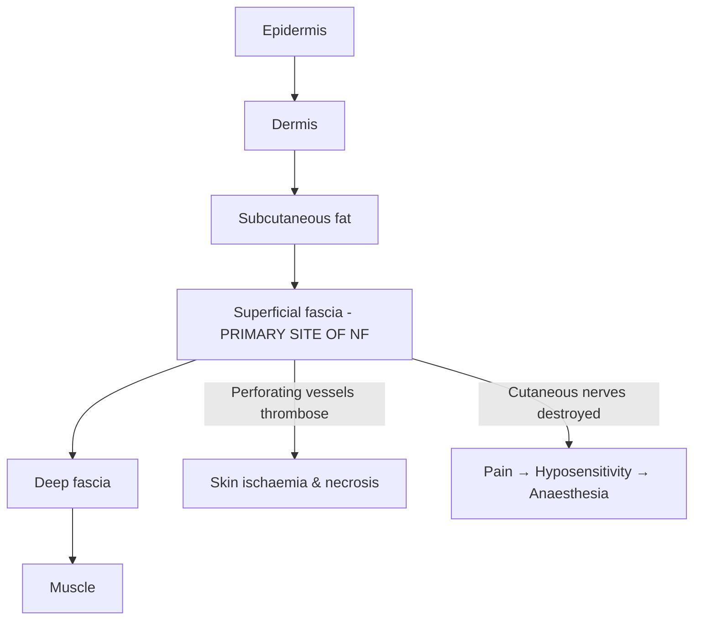
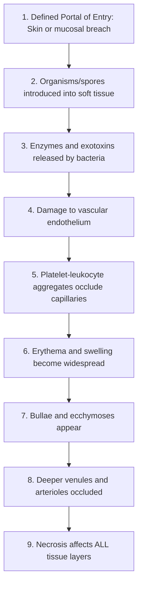

# Necrotizing Fasciitis

## 1. Definition

**Necrotizing fasciitis** (NF) — let's break the name down:
- "Necrotizing" (Greek *nekros* = death) → causing tissue death
- "Fasciitis" (*fascia* = band/sheet of connective tissue + *-itis* = inflammation) → inflammation of the fascia

So the name literally tells you: **an infection that causes inflammation and necrosis of the fascia**.

More precisely, NF is a ***rapidly progressive, life-threatening soft tissue infection that primarily involves the superficial fascia*** [1], with secondary necrosis of the overlying subcutaneous fat and skin due to thrombosis of nutrient blood vessels running through the fascial planes. It can extend to involve deep fascia and muscle (myonecrosis). The hallmark is that the degree of deep tissue destruction is far greater than what the overlying skin initially suggests — hence the classic teaching point of ***"pain out of proportion to clinical findings"*** [2][3].

<Callout title="Key Concept">
Necrotizing fasciitis is **not** primarily a skin infection — it is a **fascial** infection. The skin changes you see are secondary to vascular compromise in the fascial plane beneath. This is why early clinical findings can be deceptively mild ("the tip of the iceberg"), and why surgical exploration is the definitive diagnostic and therapeutic manoeuvre.
</Callout>

When NF involves the **male perineum**, it is called ***Fournier's gangrene*** [2] (named after Jean-Alfred Fournier, a French venereologist who described it in 1883).

---

## 2. Epidemiology

### Incidence
- Overall incidence: approximately 0.3–5 per 100,000 population per year globally
- Higher in tropical/subtropical climates (relevant to **Hong Kong**) due to warm, humid environments favouring *Vibrio* species and *Aeromonas* species
- In Hong Kong specifically, ***Vibrio vulnificus*** NF is a particular concern due to high seafood consumption and marine/freshwater exposure [1][4]

### Age & Sex
- Can affect any age, but more common in adults > 50 years
- Male-to-female ratio approximately 2–3:1
- Fournier's gangrene has an even stronger male predominance

### Mortality
- Despite modern treatment, mortality remains **20–40%**, and higher (up to 70–80%) with delayed surgical intervention, multiorgan failure, or extensive truncal involvement
- Mortality is directly related to time from symptom onset to first surgical debridement — every hour of delay increases mortality

### Hong Kong Context
- HK sees a disproportionate number of ***Vibrio vulnificus*** cases compared to Western populations, particularly in:
  - Fishermen, fishmongers, and individuals handling raw seafood
  - Patients with underlying ***liver disease*** (hepatitis B/C-related cirrhosis is highly prevalent in HK) — *V. vulnificus* has a particular tropism for iron-overloaded states and cirrhotic patients
  - Exposure to ***seawater or freshwater*** wounds [4]

---

## 3. Risk Factors

***Risk factors for developing necrotizing fasciitis*** [1]:

| Risk Factor | Mechanism / Why It Matters |
|---|---|
| ***Diabetes mellitus (present in 57% of patients)*** [1] | Microangiopathy impairs tissue perfusion and immune cell delivery; hyperglycaemia impairs neutrophil chemotaxis, phagocytosis, and oxidative burst; peripheral neuropathy delays symptom recognition |
| ***Alcohol abuse*** [1] | Impaired hepatic function → decreased complement and opsonin production; malnutrition; immune suppression |
| ***Renal insufficiency*** [1] | Uraemia impairs T-cell and neutrophil function; fluid overload may impair tissue perfusion |
| ***Liver diseases*** [1] | Decreased synthesis of complement, acute-phase reactants, and opsonins; portal hypertension → iron overload → *V. vulnificus* thrives in high-iron environments; HK context: HBV/HCV cirrhosis |
| ***Immunocompromised*** [1] | Any cause: HIV, malignancy, chemotherapy, chronic steroids, transplant recipients — impaired ability to contain local infection |
| ***Exposure to NSAIDs*** [1] | ***Inhibit prostaglandins which alter the inflammatory response to microorganisms*** [1]; may mask early symptoms (fever, pain) causing delayed presentation; ***Develop acute renal failure*** [1] which further impairs immune function |
| ***Intra-abdominal/gynaecological/perineal surgery*** [4] | Provides portal of entry for enteric organisms; disruption of mucosal barriers |
| ***IVDU (intravenous drug use)*** [2] | Non-sterile injection → direct inoculation of bacteria into soft tissue; often polymicrobial |
| ***Peripheral vascular disease*** | Impaired tissue oxygenation → anaerobic bacteria thrive; poor wound healing |
| ***Obesity*** | Poorly vascularised subcutaneous fat provides a favourable environment for bacterial proliferation |

<Callout title="NSAID Warning" type="error">
A common exam pitfall: NSAIDs are frequently prescribed for early NF that is misdiagnosed as cellulitis. They do **two harmful things**: (1) mask pain and fever → delayed diagnosis, and (2) ***inhibit prostaglandins altering the inflammatory response*** + ***cause acute renal failure*** [1]. Always consider NF in a patient with "cellulitis" not responding to antibiotics, especially if they are on NSAIDs.
</Callout>

---

## 4. Anatomy and Function

Understanding the anatomy is essential to understanding why NF behaves the way it does.

### Layers of Soft Tissue (Superficial to Deep)

***Layers of soft tissue and associated disease*** [1]:

| Layer | Associated Infection |
|---|---|
| ***Epidermis*** | ***Impetigo*** |
| ***Dermis*** | ***Erysipelas, Folliculitis, Furunculosis*** |
| ***Superficial fatty fascia*** | — |
| ***Deep fascia*** | ***Necrotizing fasciitis*** |
| ***Perimysium / Muscle*** | ***Myonecrosis*** |

### The Fascial Planes — Why They Matter

1. **Superficial fascia** (Scarpa's fascia in the abdomen, Colles' fascia in the perineum): a loose areolar tissue layer between subcutaneous fat and deep fascia. It is relatively avascular and has limited immune surveillance — making it an ideal highway for bacterial spread.

2. **Deep fascia**: a dense, tough layer investing muscles (e.g., fascia lata in the thigh). NF primarily spreads along the **superficial fascial plane**, often between subcutaneous fat and the deep fascia.

3. **Blood supply**: The overlying skin receives its blood supply from **perforating vessels that travel through the fascia**. When bacteria destroy the fascia, these perforating vessels undergo thrombotic occlusion → **ischaemic necrosis of the overlying skin**. This explains why:
   - Early skin changes are minimal despite extensive fascial necrosis below
   - Late skin changes include dusky discolouration, haemorrhagic bullae, and frank gangrene

4. **Nerve supply**: Cutaneous sensory nerves also traverse the fascia. Their destruction causes the paradoxical progression from ***disproportionate pain*** → ***hyposensitivity*** → ***anaesthesia*** [1] as the disease advances.

### Common Anatomical Sites
- **Extremities** (most common overall, especially lower limbs) — the leg and thigh are classic
- **Perineum** (Fournier's gangrene)
- **Abdominal wall** (post-surgical)
- **Head and neck** (odontogenic infections, particularly in diabetic patients)

---

## 5. Etiology (Focus on Hong Kong)

### Classification by Microbiology

NF is classically divided into types based on the causative organisms:

| Type | Organisms | Typical Setting / Portal of Entry | HK Relevance |
|---|---|---|---|
| **Type I (Polymicrobial / Synergistic)** | ***Polymicrobial: Enterobacteriaceae, streptococci, anaerobes*** [4] | ***Following intra-abdominal, gynaecological or perineal surgery*** [4]; Fournier's gangrene; diabetic foot | Very common — high rates of DM and abdominal surgery |
| **Type II (Monomicrobial)** | ***Group A Streptococcus (S. pyogenes)*** [1][3]; occasionally other streptococci, S. aureus (including MRSA) | ***Following cuts and abrasion; recent chickenpox; IVDU; healthy adults*** [4] | Common; can affect young, previously healthy individuals |
| **Type III (Marine Vibrio / Gas gangrene)** | ***Vibrio vulnificus***, ***Vibrio species*** [1][3]; ***Aeromonas hydrophila***, *A. caviae* | ***Following exposure to freshwater, seawater or seafood*** [4]; contact with marine environment | ***Highly relevant in Hong Kong*** — seafood culture, subtropical waters |
| **Gas gangrene** (sometimes classified separately) | ***Most commonly caused by C. perfringens*** [5] | ***Recent trauma / GI surgery*** [3] | Post-traumatic, post-surgical |

<Callout title="Hong Kong High Yield">
In Hong Kong exams, always think of ***Vibrio vulnificus*** when the vignette mentions:
- Handling raw seafood / shellfish
- Saltwater or brackish water exposure
- Underlying **liver cirrhosis** (HBV/HCV endemic area)

*V. vulnificus* NF in a cirrhotic patient has mortality approaching **50–70%** — it is a true emergency.
</Callout>

### Specific Antibiotic Regimens by Scenario [4]

| Scenario | Likely Organisms | First-Line Antibiotics | Alternative |
|---|---|---|---|
| ***Following exposure to freshwater, seawater or seafood*** | ***Aeromonas hydrophila, A. caviae; Vibrio vulnificus*** | ***IV fluoroquinolone + IV amoxicillin-clavulanate*** [4] | — |
| ***Following cuts/abrasion; recent chickenpox; IVDU; healthy adults*** | ***Group A streptococci*** | ***IV penicillin G + IV linezolid*** [4] | — |
| ***Following intra-abdominal/gynaecological/perineal surgery*** | ***Polymicrobial: Enterobacteriaceae, streptococci, anaerobes*** | ***IV imipenem or IV meropenem*** [4] | ***IV amoxicillin-clavulanate + IV levofloxacin*** [4] |

> **Why linezolid with penicillin G for GAS?** Penicillin kills the bacteria, but in high-inoculum infections, many organisms are in stationary phase (Eagle effect) where penicillin (which requires active cell wall synthesis) is less effective. Linezolid (a protein synthesis inhibitor) directly suppresses production of streptococcal superantigens and exotoxins — it acts as a "toxin shut-off valve."

---

## 6. Pathophysiology

### The Cascade — From Portal of Entry to Multiorgan Failure

***Pathogenesis*** [1]:

Let me walk through this step by step:

**Step 1 — Portal of Entry** [1]
- ***A skin or mucosal breach*** — this can be as trivial as an insect bite, needle puncture, laceration, or surgical wound [1]
- In some cases (especially GAS NF), no identifiable portal of entry is found — haematogenous seeding to a site of blunt trauma is postulated

**Step 2 — Bacterial Proliferation in the Fascial Plane**
- The superficial fascia is relatively hypovascular → limited immune surveillance
- Bacteria proliferate and produce:
  - **Hyaluronidase** ("spreading factor") — breaks down hyaluronic acid in connective tissue, facilitating spread along fascial planes
  - **Lipases** — destroy subcutaneous fat
  - **Streptococcal pyrogenic exotoxins (SPE)** — act as **superantigens**, triggering massive T-cell activation and cytokine storm (TNF-α, IL-1, IL-6)
  - **Streptolysin O and S** — directly lyse host cells
  - *C. perfringens* produces **alpha-toxin (lecithinase/phospholipase C)** — destroys cell membranes, causing myonecrosis
  - *V. vulnificus* produces **metalloproteinases and cytolysins** — particularly virulent in iron-overloaded states (cirrhosis)

**Step 3 — Vascular Endothelial Damage** [1]
- ***Enzymes and exotoxins damage vascular endothelium*** [1]
- This triggers the coagulation cascade locally

**Step 4 — Microvascular Thrombosis** [1]
- ***Platelet-leukocyte aggregates occlude capillaries*** [1]
- Progressive thrombosis of perforating vessels → tissue ischaemia
- This creates a vicious cycle: ischaemia → anaerobic environment → anaerobic bacteria thrive → more tissue destruction

**Step 5 — Tissue Necrosis** [1]
- ***Deeper venules and arterioles are occluded*** [1]
- ***Necrosis affects all tissue layers*** [1]
- Overlying skin undergoes ischaemic necrosis → bullae formation → haemorrhagic bullae → frank gangrene
- Nerve destruction → anaesthesia (the transition from severe pain to numbness is an **ominous sign**)

**Step 6 — Systemic Response**
- Bacterial toxins and necrotic tissue products enter the systemic circulation
- **SIRS → Sepsis → Septic shock → Multiorgan dysfunction syndrome (MODS)**
- Streptococcal toxic shock syndrome (STSS) can occur with GAS infections

<Callout title="Why Pain Out of Proportion?" type="idea">
In the early stage, bacteria are destroying fascia and occluding small vessels, causing tissue ischaemia — but the overlying skin still looks relatively normal. The ischaemic fascia and subcutaneous tissue generate intense pain via nociceptor stimulation and local inflammatory mediators, yet the skin shows only mild erythema or swelling. This mismatch between symptoms (severe pain) and signs (minimal skin changes) is the hallmark ***"pain out of proportion to clinical findings"*** [3][2].
</Callout>

### Gas Gangrene — Specific Pathophysiology [5]

***Gas gangrene*** [5]:
- ***Most commonly caused by C. perfringens*** [5]
- ***Rapid clinical onset, crepitus is characteristic*** [5]
- The **alpha-toxin (phospholipase C)** cleaves lecithin in cell membranes → massive cell lysis → myonecrosis
- ***C. perfringens inhibits the inflammatory response*** → ***no neutrophilia*** on CBC [3] — this is a distinctive feature
- Gas production occurs via fermentation of tissue glucose and amino acids → **crepitus** and **gas on X-ray** [3]
- ***Sudden onset of pain, rapidly progressive soft tissue infection, development of blisters containing foul smelling brownish liquid with gas bubbles, soft tissue induration and discolouration may also be present*** [5]

---

## 7. Classification

### By Microbiology (Most Commonly Used)

| Classification | Synonyms | Organisms | Key Features |
|---|---|---|---|
| **Type I** | Polymicrobial / Synergistic necrotizing fasciitis | Mixed aerobic + anaerobic: *Enterobacteriaceae*, *Streptococcus* spp., *Bacteroides*, *Clostridium*, *Peptostreptococcus* | Most common type (55–75%); typically post-surgical or perineal; Fournier's gangrene; gas formation common |
| **Type II** | Monomicrobial | Group A *Streptococcus* (most common monomicrobial cause); *S. aureus* (including MRSA) | Can occur in young, healthy patients; associated with streptococcal toxic shock syndrome |
| **Type III** | Marine / Vibrio | *Vibrio vulnificus*, *Aeromonas hydrophila* | Seawater/freshwater/seafood exposure; fulminant in liver disease patients; very relevant in Hong Kong |
| **Gas gangrene** | Clostridial myonecrosis | *Clostridium perfringens* (most common), *C. septicum* | Post-traumatic; rapid onset; crepitus; absent neutrophilia |

### By Anatomical Location

| Location | Special Name | Common Organisms | Notes |
|---|---|---|---|
| Perineum / genitalia | **Fournier's gangrene** | Polymicrobial (Type I) | Often from anorectal or urogenital source; rapidly fatal if not debrided |
| Head and neck | **Cervical necrotizing fasciitis** | Mixed aerobic-anaerobic; often odontogenic | Dental infection is the most common source |
| Abdominal wall | Post-surgical NF | Polymicrobial | After abdominal/gynaecological surgery |
| Extremities | NF of extremity | Any type | Most common overall location; lower limb > upper limb |

### ***Clinical Stages of Necrotizing Fasciitis*** [1]

| Stage | Clinical Features |
|---|---|
| ***Stage 1 (Early)*** | ***Tenderness, Erythema, Oedema, Warm skin, Fever*** [1] |
| ***Stage 2 (Intermediate)*** | ***Blisters and bullae formation, Hyposensitivity, Tissue crepitation, Haemorrhagic bullae*** [1] |
| ***Stage 3 (Late)*** | ***Tissue necrosis, Anaesthesia*** [1] — "the skin has died" |

<Callout title="Clinical Staging — High Yield">
The progression from Stage 1 to Stage 3 can occur within **24–72 hours**. This is why NF is a **surgical emergency**. By Stage 3, the patient is often septic with multiorgan failure. The transition from ***pain (Stage 1) → hyposensitivity (Stage 2) → anaesthesia (Stage 3)*** reflects progressive destruction of cutaneous nerves traversing the necrotic fascia [1].
</Callout>

---

## 8. Clinical Features

### Symptoms

| Symptom | Pathophysiological Basis |
|---|---|
| ***Disproportionate pain*** ("pain out of proportion to clinical findings") [1][2][3] | Fascial ischaemia and necrosis stimulate deep nociceptors intensely, but overlying skin initially appears relatively normal because skin necrosis lags behind fascial destruction |
| Rapid progression of symptoms (hours) | Bacteria spread rapidly along relatively avascular fascial planes with minimal immune resistance; enzymatic tissue destruction (hyaluronidase, lipases) facilitates spread |
| ***History of minor trauma to extremities*** [1] | Even trivial wounds (insect bite, needle puncture, laceration) serve as the portal of entry [1] |
| Systemic toxicity (fever, rigors, malaise, confusion) | Bacterial toxins (superantigens, endotoxins) and necrotic tissue products trigger SIRS → sepsis → septic shock |
| Progression from pain to **numbness** | Cutaneous nerve destruction from fascial necrosis → transition from pain to anaesthesia (ominous sign indicating Stage 3) |

### Signs

| Sign | Stage | Pathophysiological Basis |
|---|---|---|
| ***Tenderness*** [1] | Stage 1 | Local inflammatory mediators and tissue ischaemia stimulate nociceptors |
| ***Erythema*** [1] | Stage 1 | Vasodilation from local inflammatory response (prostaglandins, histamine) |
| ***Oedema / Swelling*** [1] | Stage 1 | Increased vascular permeability from endothelial damage → interstitial fluid accumulation |
| ***Warm skin*** [1] | Stage 1 | Increased blood flow from inflammatory vasodilation |
| ***Fever*** [1] | Stage 1 | Pyrogenic cytokines (IL-1, IL-6, TNF-α) act on hypothalamic thermoregulatory centre |
| ***Blisters and bullae formation*** [1] | Stage 2 | Subepidermal oedema from microvascular thrombosis and vascular leak → fluid accumulation separates epidermis from dermis |
| ***Haemorrhagic bullae*** [1][3] | Stage 2 | Thrombosis of dermal vessels → red blood cell extravasation into bullae; a hallmark sign |
| ***Hyposensitivity*** [1] | Stage 2 | Early cutaneous nerve ischaemia from fascial vessel thrombosis |
| ***Tissue crepitation*** [1] | Stage 2 | Gas production by bacteria (especially *Clostridium* spp., mixed anaerobes) through fermentation of tissue substrates; palpable as a crackling sensation |
| ***Tissue necrosis*** (dusky, grey-black skin) [1] | Stage 3 | Complete thrombotic occlusion of all nutrient vessels → full-thickness tissue death |
| ***Anaesthesia*** [1] | Stage 3 | Complete destruction of cutaneous sensory nerves — **an ominous sign** indicating irreversible tissue death |
| ***Generalised erythematous rash and toxic appearance*** [1] | Stage 2–3 | Streptococcal superantigens trigger widespread immune activation (toxic shock syndrome) |
| ***Low platelet count*** [1] | Any | DIC from systemic activation of coagulation; platelet consumption in microvascular thrombi |
| ***Dirty "dishwater" discharge*** [3] | Stage 2–3 | Necrotic fascial tissue produces thin, grey, foul-smelling exudate (not frank pus — because the immune cells cannot reach the necrotic tissue due to vascular occlusion) |
| ***Skin changes extending beyond apparent margins of erythema*** | Any | Fascial necrosis extends far beyond what is visible on the skin surface — "the iceberg sign" |
| Rapid extension of erythema borders (can mark with pen and observe) | Any | Unimpeded bacterial spread along fascial planes |
| **Systemic signs**: tachycardia, hypotension, confusion, oliguria | Late | Sepsis → septic shock → multiorgan dysfunction |

### Bedside Clinical Tests [1]

***Bedside procedure — the Finger Probe Test*** [1][3]:
- Performed at the bedside or in the operating theatre
- A small incision (2 cm) is made down to deep fascia under local anaesthesia
- ***Positive if: minimal resistance to blunt dissection*** [3] — a finger or blunt probe passes easily along the fascial plane with no resistance, and the tissue does not bleed (avascular necrotic fascia)
- ***Lack of bleeding, foul smelling dishwater pus, minimal tissue resistance to finger dissection*** [1]
- This test is both **diagnostic** (confirms NF) and should prompt **immediate surgical debridement**

<Callout title="The Finger Probe Test" type="idea">
If you suspect NF but aren't sure, the finger probe test can be done at the bedside. Normal fascia is adherent and vascular — you cannot easily separate it from overlying tissue. In NF, the necrotic fascia separates easily with no bleeding and releases grey, foul-smelling ("dishwater") fluid. A positive test = go to theatre NOW.
</Callout>

### Distinguishing NF from Severe Cellulitis

| Feature | Cellulitis | Necrotizing Fasciitis |
|---|---|---|
| Pain | Proportionate to skin changes | ***Disproportionate*** — far worse than skin appearance suggests |
| Skin colour | Bright red, well-demarcated | Dusky, grey, purplish; may have patchy areas |
| Bullae | Absent | Present (serous → ***haemorrhagic***) |
| Crepitus | Absent | May be present |
| Systemic toxicity | Mild–moderate | Severe, out of proportion |
| Skin anaesthesia | Absent | Present (ominous) |
| Response to IV antibiotics | Improves within 24–48 hours | ***Does not improve or worsens*** despite antibiotics |
| Margins | Well-defined, advancing border | Ill-defined, spreading beyond visible erythema |

<Callout title="Must-Know Exam Point" type="error">
**Cellulitis that fails to respond to IV antibiotics within 24–48 hours should raise suspicion for NF.** Do not keep re-dosing antibiotics hoping the patient will improve. Consider surgical exploration/finger probe test early. The single most important determinant of survival is time to first debridement.
</Callout>

### Fournier's Gangrene — Special Considerations [2]

- NF of the **male perineum, scrotum, and penis**
- Can also occur in females (vulva, perineum) but much rarer
- Source is typically:
  - Anorectal (perianal abscess, anorectal surgery)
  - Urogenital (urethral instrumentation, indwelling catheter)
  - Cutaneous (scrotal skin infection)
- Polymicrobial (Type I) in most cases
- Rapidly fatal — the perineal fascial planes communicate widely (Colles' fascia → Scarpa's fascia → anterior abdominal wall)

---

## 9. Factors Favouring Limb Salvage vs Amputation

***Factors favouring limb salvage vs amputation*** [1]:

| ***Limb Salvage Surgery*** [1] | ***Amputation*** [1] |
|---|---|
| ***Good past health*** | ***Concurrent medical disease with high anaesthetic risk from multiple operations (e.g., poorly controlled diabetes mellitus, valvular heart disease)*** |
| ***Not life-threatening state*** | ***Myonecrosis*** |
| ***Multiple sites*** (can debride serially) | ***Unremitting shock*** |
| ***Responsive to inotropic support*** | ***Concurrent peripheral vascular insufficiency*** |
| | ***Rapidly progressive infection*** |
| | ***Large area of tissue necrosis (heel pad and sole skin loss)*** |

<Callout title="Amputation Decision">
The decision to amputate is essentially a **life over limb** decision. When the patient is in unremitting shock, has myonecrosis, peripheral vascular disease preventing healing, or the infection is spreading faster than you can debride — amputation removes the source of sepsis and saves the patient's life.
</Callout>

---

## 10. Gas Gangrene — Distinct Entity [5][3]

Although sometimes grouped under NF, gas gangrene (clostridial myonecrosis) has distinct features worth separating:

- ***Orthopaedic emergency*** [5]
- ***Most commonly caused by C. perfringens*** [5]
- ***Rapid clinical onset, crepitus is characteristic*** [5]
- ***Sudden onset of pain, rapidly progressive soft tissue infection, development of blisters containing foul smelling brownish liquid with gas bubbles, soft tissue induration and discolouration may also be present*** [5]
- ***No neutrophilia*** on CBC — ***inflammatory response inhibited by C. perfringens*** [3]
  - Why? Alpha-toxin directly kills neutrophils and inhibits their migration
- ***XR: linear streak of gas*** [3]
- Management: ***Resuscitation → Urgent surgical debridement with fasciotomy → IV antibiotics*** [3]

---

<Callout title="High Yield Summary">

**Definition**: Necrotizing fasciitis is a rapidly progressive infection primarily involving the **superficial fascia** with secondary skin/soft tissue necrosis due to microvascular thrombosis.

**Risk Factors** (exam favourite): ***DM (57%), alcohol abuse, renal insufficiency, liver disease, immunocompromised, NSAIDs*** [1]

**Classification**:
- Type I = Polymicrobial (post-surgical, Fournier's)
- Type II = Monomicrobial (GAS in healthy patients)
- Type III = Marine Vibrio / Aeromonas (HK high yield — seafood/seawater + liver disease)
- Gas gangrene = *C. perfringens* (no neutrophilia, gas on XR)

**Cardinal Clinical Feature**: ***Pain out of proportion to clinical findings*** [1][2][3]

**Clinical Stages** [1]:
- Stage 1: Tenderness, erythema, oedema, warm skin, fever
- Stage 2: Bullae, haemorrhagic bullae, hyposensitivity, crepitation
- Stage 3: Tissue necrosis, anaesthesia

**Key Diagnostic Test**: Finger probe test — ***lack of bleeding, dishwater pus, minimal tissue resistance*** [1]

**Scoring**: LRINEC score > 8 = high risk [3]

**Treatment Principle**: ***Aggressive debridement + IV broad-spectrum antibiotics*** [3] — antibiotics alone will NOT cure NF

**Amputation**: When life-threatening — unremitting shock, myonecrosis, PVD, rapidly progressive [1]

</Callout>

---

<ActiveRecallQuiz
  title="Active Recall - Necrotizing Fasciitis"
  items={[
    {
      question: "What is the cardinal clinical feature of necrotizing fasciitis, and why does it occur?",
      markscheme: "Pain out of proportion to clinical findings. Occurs because fascial ischaemia and necrosis stimulate deep nociceptors intensely, but overlying skin initially appears relatively normal due to delayed skin necrosis from microvascular thrombosis of perforating vessels."
    },
    {
      question: "Name the three clinical stages of necrotizing fasciitis with their key features.",
      markscheme: "Stage 1: Tenderness, erythema, oedema, warm skin, fever. Stage 2: Blisters/bullae, haemorrhagic bullae, hyposensitivity, tissue crepitation. Stage 3: Tissue necrosis, anaesthesia."
    },
    {
      question: "A 55-year-old fisherman with hepatitis B cirrhosis presents with rapidly progressive limb swelling after a prawn prick injury. What is the most likely causative organism, and what is the first-line antibiotic regimen?",
      markscheme: "Vibrio vulnificus. First-line: IV fluoroquinolone + IV amoxicillin-clavulanate."
    },
    {
      question: "Why does gas gangrene characteristically show NO neutrophilia on CBC, unlike other necrotizing soft tissue infections?",
      markscheme: "C. perfringens alpha-toxin directly kills neutrophils and inhibits their migration, thereby suppressing the inflammatory response."
    },
    {
      question: "What is the finger probe test, and what constitutes a positive result?",
      markscheme: "A small incision is made to deep fascia; a finger or blunt probe is inserted along the fascial plane. Positive if: minimal resistance to blunt dissection, lack of bleeding, and foul-smelling dishwater pus."
    },
    {
      question: "List at least four factors that favour amputation over limb salvage in necrotizing fasciitis.",
      markscheme: "Any four of: concurrent medical disease with high anaesthetic risk, myonecrosis, unremitting shock, concurrent peripheral vascular insufficiency, rapidly progressive infection, large area of tissue necrosis (heel pad and sole skin loss)."
    }
  ]}
/>

## References

[1] Lecture slides: GC 237. Musculoskeletal infection [Updated in 2025] (1).pdf (p36–46)
[2] Senior notes: felixlai.md (Fournier's gangrene reference under testicular torsion differential)
[3] Senior notes: maxim.md (Necrotizing fasciitis table entries, LRINEC score, gas gangrene)
[4] Lecture slides: GC 237. Musculoskeletal infection [Updated in 2025] (1).pdf (p45, management principles/antibiotic table)
[5] Lecture slides: GC 237. Musculoskeletal infection [Updated in 2025] (1).pdf (p51, gas gangrene)
