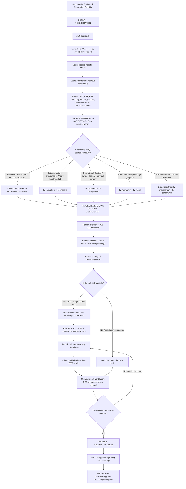

## Management of Necrotizing Fasciitis

### The Overarching Principle

Let me state the single most important management principle upfront: ***Aggressive debridement + IV broad-spectrum antibiotics*** [3]. That's it. Everything else — ICU support, wound care, reconstruction — is adjunctive to these two pillars. Antibiotics alone cannot cure NF because the necrotic, avascular tissue creates a pharmacological sanctuary where antibiotics cannot reach therapeutic concentrations. Surgery alone is insufficient because bacteria will have disseminated systemically. You need both, simultaneously, urgently.

> ***Empirical antibiotics and early surgical intervention are necessary in case of life-threatening conditions such as septic arthritis, NF and gas gangrene*** [1]

The management can be conceptualised in **five sequential phases**:
1. **Resuscitation** (keep the patient alive)
2. **Empirical antibiotics** (start killing bacteria systemically)
3. **Emergency surgical debridement** (remove the source)
4. **Ongoing critical care + serial debridements** (control the damage)
5. **Reconstruction and rehabilitation** (restore function)

---

### Management Algorithm

---

### Phase 1: Resuscitation

NF patients are often **septic or in septic shock** by the time they present. Resuscitation is not a "nice to do" — it is essential to keep the patient alive long enough to get to theatre.

| Component | Details | Rationale |
|---|---|---|
| **Airway & Breathing** | Assess, secure if needed; supplemental O2; intubate if GCS decreased or impending respiratory failure | Septic encephalopathy can compromise airway; metabolic acidosis drives tachypnoea → respiratory exhaustion |
| **Circulation** | Two large-bore IV cannulae (14–16G); rapid IV crystalloid bolus (30 mL/kg in first hour for septic shock); arterial line for continuous BP monitoring | Massive third-spacing and capillary leak from systemic inflammation → hypovolaemia; vasopressors (noradrenaline first-line) if MAP < 65 mmHg despite fluids |
| **Monitoring** | Indwelling urinary catheter (target UO > 0.5 mL/kg/h); continuous ECG; SpO2; consider central venous catheter | Urine output is a real-time indicator of organ perfusion; electrolyte derangements (hyperkalaemia from tissue necrosis) can cause arrhythmias |
| **Blood investigations** | CBC, CRP, RFT, LFT, coagulation profile, lactate, glucose, blood cultures ×2, group & save/crossmatch, CK, ABG | Assess organ dysfunction; LRINEC scoring; guide resuscitation; anticipate massive transfusion if needed |
| **Correct coagulopathy** | FFP, cryoprecipitate, platelets as guided by coagulation results | DIC is common — consumption coagulopathy from microvascular thrombosis; must correct before surgery to reduce operative bleeding |
| **Analgesia** | IV opioids titrated to effect (morphine, fentanyl) | Severe pain; avoid NSAIDs — ***NSAIDs inhibit prostaglandins which alter the inflammatory response to microorganisms*** and ***develop acute renal failure*** [1] |

<Callout title="NSAID Warning — Again" type="error">
Do NOT give NSAIDs for pain control in suspected NF. Use IV opioids instead. NSAIDs mask the cardinal symptom (***disproportionate pain*** [1]), delay diagnosis, impair immune response, and worsen renal function in an already septic patient [1].
</Callout>

---

### Phase 2: Empirical Intravenous Antibiotics

Antibiotics must be started **immediately** — ideally within the first hour of recognition — and should NOT be delayed waiting for culture results. The regimen depends on the suspected source of infection.

#### ***Management Principles — Antibiotic Regimens*** [4]

| Clinical Scenario | Likely Organisms | ***First-Line Regimen*** | ***Alternative*** |
|---|---|---|---|
| ***1. Following exposure to freshwater, seawater or seafood*** [4] | ***Aeromonas hydrophila, A. caviae; Vibrio vulnificus*** | ***IV fluoroquinolone + IV amoxicillin-clavulanate*** [4] | — |
| ***2. Following cuts and abrasion; recent chickenpox; IVDU; healthy adults*** [4] | ***Group A streptococci*** | ***IV penicillin G + IV linezolid*** [4] | — |
| ***3. Following intra-abdominal, gynaecological or perineal surgery*** [4] | ***Polymicrobial: Enterobacteriaceae, streptococci, anaerobes*** | ***IV imipenem or IV meropenem*** [4] | ***IV amoxicillin-clavulanate + IV levofloxacin*** [4] |

#### Gas Gangrene — Specific Antibiotic Regimen [5]

- ***Empirical antibiotic should cover Clostridia and Gram +ve cocci*** [5]
- ***Augmentin + Flagyl*** [5]
  - Augmentin (amoxicillin-clavulanate) = broad-spectrum β-lactam covering Gram +ve and some Gram -ve
  - Flagyl (metronidazole) = specifically targets **anaerobes** including *Clostridium* spp. — works by forming toxic free radicals within anaerobic cells that damage DNA

#### Why These Specific Regimens? — Explained From First Principles

| Drug | Mechanism | Why Used in NF |
|---|---|---|
| **Penicillin G** | β-lactam → inhibits transpeptidase (PBP) → prevents cell wall synthesis → osmotic lysis of growing bacteria | Highly effective against GAS (*S. pyogenes*); excellent tissue penetration; bactericidal |
| **Linezolid** | Oxazolidinone → binds 50S ribosomal subunit → inhibits protein synthesis → bacteriostatic | **Suppresses superantigen/exotoxin production** by GAS — this is the key reason it is added. In high-inoculum GAS infections, many organisms are in stationary phase (Eagle effect) where penicillin alone is less effective. Linezolid shuts off toxin production even without killing the bacteria directly |
| **Fluoroquinolone** (e.g., levofloxacin, ciprofloxacin) | Inhibits DNA gyrase (topoisomerase II) and topoisomerase IV → prevents DNA replication → bactericidal | Excellent activity against Gram -ve rods including *Vibrio* spp. and *Aeromonas*; good tissue penetration; oral bioavailability allows step-down |
| **Amoxicillin-clavulanate** (Augmentin) | Amoxicillin = β-lactam (cell wall synthesis inhibitor); clavulanate = β-lactamase inhibitor (protects amoxicillin from enzymatic destruction) | Broad-spectrum coverage: Gram +ve, Gram -ve, and anaerobes; the β-lactamase inhibitor is crucial because many organisms produce β-lactamases |
| **Imipenem / Meropenem** | Carbapenems → broadest-spectrum β-lactams; resistant to most β-lactamases; cover Gram +ve, Gram -ve, and anaerobes | "Big guns" for polymicrobial NF — covers essentially everything except MRSA and some resistant pseudomonas; reserve for complex/post-surgical cases |
| **Metronidazole** (Flagyl) | Prodrug activated inside anaerobic organisms → generates cytotoxic nitroso radicals → DNA damage | Specifically targets anaerobes (*Clostridium*, *Bacteroides*); synergistic with β-lactams in polymicrobial infections |
| **Clindamycin** | Lincosamide → binds 50S ribosomal subunit → inhibits protein synthesis | Like linezolid, suppresses toxin production (both streptococcal and clostridial exotoxins); excellent tissue penetration including into abscesses; covers Gram +ve and anaerobes |

<Callout title="Why Add a Protein Synthesis Inhibitor?">
In severe GAS or clostridial NF, cell-wall-active antibiotics (penicillin, carbapenems) kill bacteria by preventing cell wall formation. But in high-inoculum infections, many bacteria are in **stationary phase** and not actively dividing — so cell-wall antibiotics are less effective (the "Eagle effect"). Adding a **protein synthesis inhibitor** (linezolid, clindamycin) directly suppresses the production of **exotoxins and superantigens** that are driving tissue destruction and systemic toxicity. It's not just about killing bacteria — it's about shutting off the toxin factory.
</Callout>

#### When to Adjust Antibiotics
- **De-escalate** once culture and sensitivity results are available (typically 48–72 h)
- **Escalate** if patient deteriorating clinically despite current regimen — consider MRSA coverage (IV vancomycin), antifungal coverage (if immunosuppressed), or broader Gram -ve coverage
- **Duration**: typically 2–4 weeks of IV antibiotics, transitioning to oral when clinically improving and wound healing

---

### Phase 3: Emergency Surgical Debridement

This is the **cornerstone of management** — nothing else will save the patient. ***Aggressive debridement*** [3] means radical excision of all non-viable tissue.

#### Principles of Surgical Debridement

| Principle | Explanation |
|---|---|
| **Timing** | ***Early aggressive debridement*** [5] — should occur within **6–12 hours** of presentation (ideally sooner); every hour of delay increases mortality |
| **Extent** | ALL necrotic fascia, subcutaneous fat, and skin must be excised back to **bleeding, viable tissue**; the wound margin should show: (1) healthy pink tissue, (2) active bleeding, (3) fascia adherent to underlying structures |
| **Do not close the wound** | Leave wound **open** with wet dressings; primary closure traps residual bacteria and necrotic tissue → guaranteed recurrence |
| **Specimens** | Send multiple deep tissue samples for Gram stain, aerobic and anaerobic C/ST, and histopathology — these guide de-escalation |
| **Explore beyond visible margins** | NF extends well beyond what the skin shows ("iceberg phenomenon"); the surgeon must explore and debride the fascial plane until normal, adherent, bleeding fascia is encountered in all directions |
| **Mark the wound margins** | Use a skin marker to draw the margins of erythema pre-operatively; compare post-operatively to assess for progression |

#### Intra-operative Decision: Limb Salvage vs Amputation

***Factors favouring limb salvage vs amputation*** [1]:

| ***Limb Salvage Surgery*** [1] | ***Amputation*** [1] |
|---|---|
| ***Good past health*** | ***Concurrent medical disease with high anaesthetic risk from multiple operations (e.g., poorly controlled diabetes mellitus, valvular heart disease)*** |
| ***Not life-threatening state*** | ***Myonecrosis*** |
| ***Multiple sites*** (serial debridement feasible) | ***Unremitting shock*** |
| ***Responsive to inotropic support*** | ***Concurrent peripheral vascular insufficiency*** |
| | ***Rapidly progressive infection*** |
| | ***Large area of tissue necrosis (heel pad and sole skin loss)*** |

The decision framework is essentially the **"3D" indications for amputation** [6][7]:
- ***Dead***: Ischaemia and unsalvageable [6]
- ***Damage***: Trauma / Burns [6]
- ***Danger***: Gangrene / ***Necrotising fasciitis*** / Osteomyelitis / Ascending sepsis / Malignancy [6]

#### Amputation — Principles and Levels [6][7]

When amputation is indicated, the surgical principles are [6]:
- ***Remove all infected tissues*** [6]
- ***Ensure adequacy of blood supply to heal the amputation*** [6]
- ***Preserve as much length of extremity as possible since this improves patient's opportunity for rehabilitation*** [6]

| Level | Indication | Functional Outcome |
|---|---|---|
| **Digital / Ray amputation** | Isolated toe/finger gangrene | Good — minimal functional loss |
| **Transmetatarsal** | Multiple toes involved | Moderate — can still walk with modified shoe |
| ***Below-knee amputation (BKA)*** | Most common level; aim to preserve knee joint | ***90% of patients will be able to walk again*** [6]; ***most common type of amputation performed*** [6]; energy expenditure increased by 40% (unilateral) [6] |
| ***Above-knee amputation (AKA)*** | When BKA not feasible (e.g., extensive proximal infection, fixed flexion deformity of knee) | ***50% of patients will be able to walk again*** [6]; energy expenditure increased by 100% (unilateral) [6]; heals more easily than BKA |

> BKA is contraindicated if there is a fixed flexion deformity of the knee — because a prosthesis cannot be fitted properly [7].

<Callout title="Life Over Limb">
The amputation decision in NF is a ***life over limb*** decision. An unstable patient in ***unremitting shock*** with ***myonecrosis*** and ***rapidly progressive infection*** will die if you attempt serial limb-sparing debridements. A single definitive amputation removes the septic source and saves the patient's life. This is not a failure — it is life-saving surgery.
</Callout>

#### Sequelae of Delayed/Inadequate Surgery [1]

- ***Amputation — HK figure: radical debridements (amputations and disarticulations) were performed in 46% of 24 patients*** [1]
- ***Mortality ranges from 20 to 75%*** [1]

---

### Phase 4: ICU Care and Serial Debridements

After the first debridement, NF patients require **intensive care** support and **planned relook debridements**.

#### ICU Support

| Component | Details | Rationale |
|---|---|---|
| **Haemodynamic support** | Vasopressors (noradrenaline ± vasopressin), inotropes (dobutamine) if needed; invasive monitoring (arterial line, CVP) | Septic shock → vasodilation + myocardial depression; target MAP ≥ 65 mmHg |
| **Ventilatory support** | Mechanical ventilation if ARDS or respiratory failure | Sepsis → ARDS via pulmonary capillary leak; respiratory muscle fatigue from metabolic acidosis |
| **Renal replacement therapy** | CVVHDF if AKI with oliguria/anuria, refractory hyperkalaemia, acidosis, or fluid overload | Sepsis-induced AKI; myoglobin nephrotoxicity; ***renal insufficiency*** is both a risk factor [1] and a consequence |
| **Blood product support** | Packed RBC (Hb < 7 g/dL target for most; < 9 g/dL if cardiac disease); FFP and platelets for DIC; cryoprecipitate if fibrinogen < 1.5 g/L | Massive tissue necrosis → ongoing blood loss at wound; DIC → consumptive coagulopathy |
| **Nutrition** | Early enteral nutrition (within 24–48 h if possible); high-protein, high-calorie diet | NF creates a massive catabolic state; wound healing requires protein (collagen synthesis), calories, and micronutrients (zinc, vitamin C) |
| **Glycaemic control** | Insulin infusion targeting glucose 6–10 mmol/L | Hyperglycaemia impairs neutrophil function; ***DM present in 57% of patients*** [1]; tight control improves outcomes in critical illness |
| **DVT prophylaxis** | LMWH (enoxaparin) once haemostasis adequate; mechanical prophylaxis (TED stockings, pneumatic compression) | Immobilised, septic patients at very high VTE risk |

#### Serial Debridements ("Relook" Surgery)

- Planned return to theatre every **24–48 hours** for wound inspection and further debridement
- Continue until:
  - No further necrotic tissue is found
  - Wound base is clean with healthy granulation tissue
  - Tissue cultures are negative or flora improving
- Typically requires **2–5 debridements** (sometimes more)
- Each relook should include tissue sampling for culture to monitor microbiological response

#### Wound Management Between Debridements

| Method | Description | When to Use |
|---|---|---|
| **Wet-to-dry dressings** | Saline-soaked gauze packed into wound → dries → mechanically debrides when removed | Simple, widely available; good between early debridements |
| **Negative-pressure wound therapy (NPWT / VAC)** | Foam dressing applied to wound, sealed with adhesive, connected to continuous suction | After wound is clean and no further debridement needed; promotes granulation tissue formation, reduces oedema, removes exudate; bridges to definitive closure |

---

### Phase 5: Reconstruction and Rehabilitation

Once the wound is clean with healthy granulation tissue and infection is controlled:

| Modality | Indication | Details |
|---|---|---|
| **Split-thickness skin graft (STSG)** | Clean granulating wound bed; most common method | Donor site (usually thigh); heals well over granulation tissue; may require multiple sessions for large defects |
| **Full-thickness skin graft (FTSG)** | Smaller defects; areas requiring better cosmetic outcome or durability | Limited by donor site availability |
| **Local / regional / free flaps** | Deep defects exposing bone, tendon, or joint; weight-bearing areas; Fournier's gangrene perineal reconstruction | Requires plastic surgery input; more complex but provides better coverage for critical structures |
| **Secondary intention** | Small wounds in well-vascularised areas | Slowest but simplest; acceptable for minor defects |

#### Rehabilitation

- **Physiotherapy**: Early mobilisation, range-of-motion exercises, strengthening; for amputees — pre-prosthetic training, gait retraining
- **Occupational therapy**: ADL retraining, adaptive devices
- **Prosthetics**: For amputees — temporary prosthesis by ~3 weeks, definitive prosthesis once stump matured (3–6 months) [7]
- **Psychological support**: NF is devastating — body image issues, PTSD, anxiety, depression are common; psychiatric/psychological input essential

#### Complications of Amputation [6][7]

| Timing | Complication | Mechanism / Notes |
|---|---|---|
| **Early** | Bleeding / haematoma | Intra-operative vessel injury; coagulopathy from DIC |
| | Wound infection | Residual contamination; immunosuppressed state |
| | ***Phantom limb pain*** [6] | Cortical reorganisation + peripheral nerve sprouting from transected nerves; management: reassurance, amitriptyline, gabapentin [7] |
| | ***Skin necrosis*** [6] | ***Secondary to poor perfusion of stump*** [6]; may require revision to higher level |
| | DVT / PE | Immobility + hypercoagulable septic state |
| **Late** | ***Stump ulceration*** [6] | Pressure from prosthesis on poorly vascularised skin |
| | ***Stump neuroma*** [6] | Disorganised nerve regeneration at cut nerve ends |
| | ***Osteomyelitis*** [6] | Residual bone infection or secondary contamination |
| | ***Osteophyte formation*** [6] | New bone formation at stump end — irritates overlying tissue |
| | ***Fixed flexion deformity*** [6] | Muscle imbalance around joint proximal to amputation; prevented by early physiotherapy and prone positioning |

---

### Adjunctive Therapies (Evidence Variable)

| Therapy | Mechanism | Evidence & Role |
|---|---|---|
| **Intravenous immunoglobulin (IVIG)** | Pooled IgG neutralises streptococcal superantigens and exotoxins; modulates immune response | Used in **GAS necrotizing fasciitis with streptococcal toxic shock syndrome**; observational data suggests mortality benefit; not universally recommended; consider in severe GAS cases |
| **Hyperbaric oxygen therapy (HBOT)** | Increases tissue oxygen tension → enhances neutrophil oxidative killing; direct bactericidal effect on anaerobes (*Clostridium*); promotes angiogenesis and wound healing | Theoretical benefit especially in gas gangrene (anaerobic organisms); limited RCT evidence; should **never delay** surgical debridement; may be considered as adjunct if available |
| **Negative-pressure wound therapy (VAC)** | Discussed above — promotes granulation, removes exudate | Good evidence for wound management post-debridement; widely used |

<Callout title="HBOT — Don't Fall for the Exam Trap" type="error">
Hyperbaric oxygen is sometimes suggested as a treatment for NF, especially gas gangrene. While there is theoretical rationale (killing anaerobes, enhancing immune function), it must **NEVER delay surgical debridement**. It is an adjunct at best, not a substitute. If your exam asks "what is the most important treatment for NF?" the answer is always ***aggressive surgical debridement***, not HBOT.
</Callout>

---

### Summary — Treatment by Phase

| Phase | Key Actions | Timing |
|---|---|---|
| **1. Resuscitation** | ABC, IV fluids, vasopressors, monitoring, bloods, crossmatch | Immediately on recognition |
| **2. Empirical antibiotics** | Scenario-based regimen (see table above); start within 1 hour | Within 1 hour |
| **3. Emergency debridement** | ***Early aggressive debridement +/- amputation*** [5]; radical excision of all necrotic tissue | Within 6–12 hours (sooner is better) |
| **4. ICU + Serial relook** | Organ support; return to theatre every 24–48 h; adjust antibiotics based on C/ST | Ongoing days–weeks |
| **5. Reconstruction** | STSG, flaps, VAC therapy; rehabilitation | Weeks–months |

---

<Callout title="High Yield Summary — Management of NF">

**Two pillars**: ***Aggressive debridement + IV broad-spectrum antibiotics*** [3]

**Antibiotic regimens** [4]:
- Seawater/seafood → ***IV fluoroquinolone + IV amoxicillin-clavulanate***
- Cuts/abrasion/healthy adults → ***IV penicillin G + IV linezolid***
- Post-surgical polymicrobial → ***IV imipenem or IV meropenem***
- Gas gangrene → ***Augmentin + Flagyl*** [5]

**Why add linezolid/clindamycin?** Suppresses superantigen and exotoxin production — shuts off the toxin factory, not just kills bacteria.

**Amputation indications (3D)**: Dead, Damage, ***Danger (NF, gangrene, ascending sepsis)*** [6]

**Limb salvage vs amputation**: Good health + not life-threatening + responsive to inotropes → salvage. Unremitting shock + myonecrosis + PVD + rapidly progressive → ***amputation*** [1].

**Sequelae**: ***46% of HK patients required amputation; mortality 20–75%*** [1].

***BKA*** is the ***most common amputation*** [6]; ***90% walk again***. ***AKA***: ***50% walk again*** [6].

**Never delay surgery** for imaging, HBOT, or any other investigation. **Never give NSAIDs** [1].

</Callout>

---

<ActiveRecallQuiz
  title="Active Recall - Management of Necrotizing Fasciitis"
  items={[
    {
      question: "State the two pillars of NF management and explain why antibiotics alone are insufficient.",
      markscheme: "Aggressive surgical debridement + IV broad-spectrum antibiotics. Antibiotics alone are insufficient because necrotic avascular tissue creates a pharmacological sanctuary where antibiotics cannot reach therapeutic concentrations. Surgery removes the necrotic source and allows antibiotics to work on remaining viable tissue."
    },
    {
      question: "A fishmonger with liver cirrhosis presents with rapidly progressive leg swelling after a prawn injury. What is the first-line empirical antibiotic regimen?",
      markscheme: "IV fluoroquinolone + IV amoxicillin-clavulanate. This covers Vibrio vulnificus and Aeromonas species which are the likely causative organisms following exposure to seawater, freshwater or seafood."
    },
    {
      question: "Why is linezolid added to penicillin G in the management of Group A Streptococcal necrotizing fasciitis, rather than just using penicillin alone?",
      markscheme: "In high-inoculum GAS infections, many bacteria are in stationary phase where penicillin is less effective (Eagle effect). Linezolid is a protein synthesis inhibitor that directly suppresses production of streptococcal superantigens and exotoxins, acting as a toxin shut-off valve, reducing both local tissue destruction and systemic toxicity."
    },
    {
      question: "List the specific antibiotic regimen for gas gangrene as per the lecture slides, and explain why each component is needed.",
      markscheme: "Augmentin (amoxicillin-clavulanate) + Flagyl (metronidazole). Empirical antibiotics should cover Clostridia and Gram-positive cocci. Augmentin provides broad-spectrum coverage of Gram-positive and some Gram-negative organisms. Metronidazole specifically targets anaerobes including Clostridium perfringens by generating toxic free radicals that damage anaerobic bacterial DNA."
    },
    {
      question: "List four factors that favour amputation over limb salvage in NF, and state the 3D mnemonic for amputation indications.",
      markscheme: "Amputation factors (any 4 of): concurrent medical disease with high anaesthetic risk, myonecrosis, unremitting shock, concurrent peripheral vascular insufficiency, rapidly progressive infection, large area of tissue necrosis. 3D mnemonic: Dead (ischaemic unsalvageable), Damage (trauma/burns), Danger (gangrene, NF, ascending sepsis, malignancy)."
    },
    {
      question: "What is the functional outcome difference between BKA and AKA in terms of walking ability, and why is BKA preferred when possible?",
      markscheme: "BKA: 90% of patients will walk again; AKA: 50% will walk again. BKA preserves the knee joint which is critical for prosthetic fitting and gait. BKA increases energy expenditure by 40% (unilateral) versus 100% for AKA. BKA is the most common amputation performed. BKA is contraindicated if there is fixed flexion deformity of the knee."
    }
  ]}
/>

## References

[1] Lecture slides: GC 237. Musculoskeletal infection [Updated in 2025] (1).pdf (p39, p41, p44, p54)
[3] Senior notes: maxim.md (NF management — aggressive debridement + IV broad-spectrum antibiotics; LRINEC score; gas gangrene CBC findings)
[4] Lecture slides: GC 237. Musculoskeletal infection [Updated in 2025] (1).pdf (p45, Management principles/antibiotic table)
[5] Lecture slides: GC 237. Musculoskeletal infection [Updated in 2025] (1).pdf (p51–52, Gas Gangrene management)
[6] Senior notes: felixlai.md (Amputation indications 3D, types, complications, principles)
[7] Senior notes: maxim.md (Amputation indications, principles, complications, rehabilitation)
