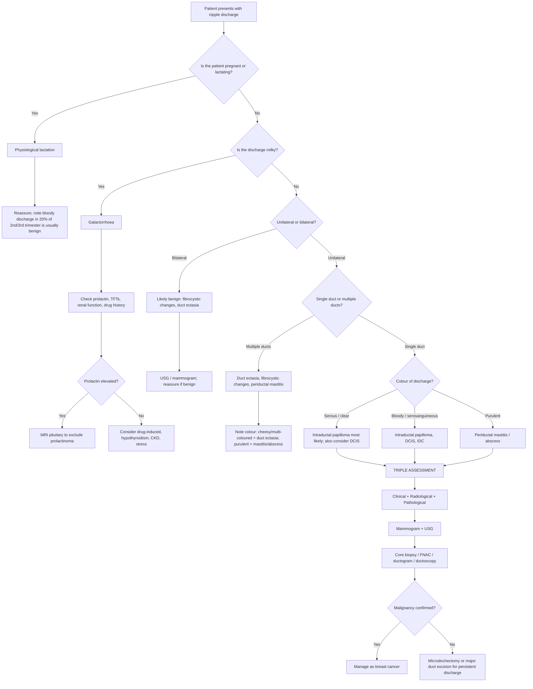
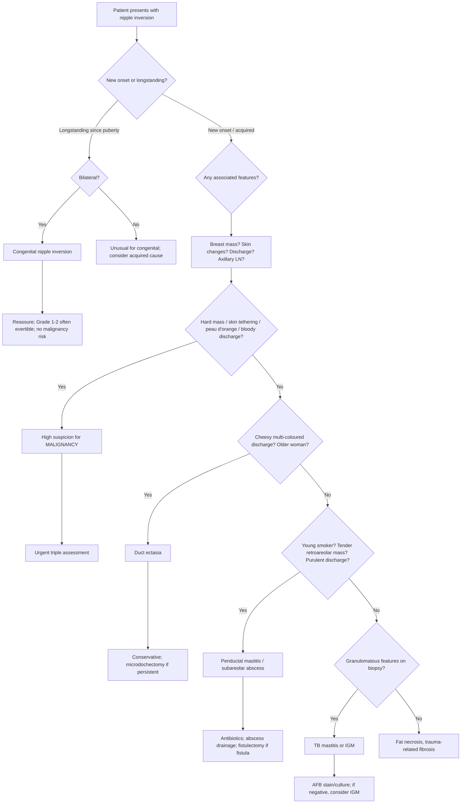

## Differential Diagnosis of Nipple Discharge and Nipple Inversion

The differential diagnosis (DDx) of nipple discharge and nipple inversion is best approached systematically by thinking about **where the pathology sits** — is it systemic/hormonal (galactorrhoea), within the duct lumen (papilloma, DCIS), in the periductal tissue (duct ectasia, mastitis), or in the nipple epidermis itself (Paget's)? For nipple inversion, think: is the nipple being **pulled in** by fibrosis or tumour, or was it **never pushed out** (congenital)?

The clinical approach always starts by asking the key discriminating questions from the lecture slides:

> ***Symptom***: *Unilateral or bilateral? Blood-stained / milky / serous? Spontaneous or on manual expression?*
> ***Sign***: *Single duct or multiple duct? Nature of discharge (colour)? Any palpable breast mass / axillary lymph node?* [1]

These questions immediately stratify risk and narrow the differential.

---

### 1. Framework for Differential Diagnosis of Nipple Discharge

The single most important branching point is the **character** and **laterality** of the discharge. Here is a structured approach:

#### Step 1 — Is it Milky or Non-Milky?

- **Milky** → Think **galactorrhoea** (bilateral, multiple ducts) or **physiological lactation**.
  - Why milky? Prolactin drives alveolar epithelial cells to synthesise casein, lactose, and lipids — the same composition as breast milk. The discharge looks milky because it *is* milk, just produced at the wrong time.
- **Non-milky** (serous, bloody, serosanguineous, purulent, multi-coloured/cheesy) → Think **pathological discharge** from an intraductal or periductal lesion.

#### Step 2 — If Non-Milky: Single Duct or Multiple Ducts?

- **Single-duct** → focal intraductal pathology: ***intraductal papilloma*** (most common), ***DCIS***, ***invasive ductal carcinoma*** [2][3].
- **Multiple-duct** → diffuse ductal pathology: ***duct ectasia***, ***fibrocystic changes***, ***infection (mastitis/abscess)*** [3].

#### Step 3 — Colour of Discharge?

| Discharge Colour | Most Likely Diagnosis | Why That Colour? |
|---|---|---|
| **Milky** (white, opaque) | Lactation, galactorrhoea | Actual milk — casein and fat globules scatter light → white |
| **Serous** (clear / straw-yellow) | ***Intraductal papilloma*** (classical) [2] | Transudate forms because venous/lymphatic drainage in the papilloma peduncle is compromised → elevated vascular pressure → plasma-like fluid leaks into the duct |
| **Bloody / sanguineous** | ***Intraductal papilloma*** (bleeding), ***DCIS***, ***IDC***, fibrocystic changes with active intraductal hyperplasia [2] | Fragile neovessels in papilloma rupture; or tumour necrosis (comedo DCIS) erodes vessel walls; or hyperplastic epithelium is hypervascular |
| **Serosanguineous** (blood-tinged) | Same differential as bloody | Mix of transudate + small amount of blood |
| **Creamy / cheesy / multi-coloured** (green, blue, black) | ***Duct ectasia*** [2][4] | Stagnant inspissated secretions in dilated ducts undergo lipid peroxidation and accumulate lipofuscin pigment → greenish-black colour. The cheesy consistency is from degenerated epithelial cells and lipid debris |
| **Purulent** (yellow-green, foul) | ***Periductal mastitis***, ***lactational mastitis***, ***breast abscess*** [2][4] | Bacterial infection → neutrophilic infiltrate → pus (dead neutrophils + bacteria + liquefied tissue) drains via the duct |
| **Yellow / green** (non-purulent) | ***Fibrocystic changes***, ***duct ectasia***, hyperprolactinaemia, infection [3] | Cystic fluid or altered duct secretions |

---

### 2. Differential Diagnosis — Organised by Presentation

#### 2A. Nipple Discharge — Full Differential Table

| Diagnosis | Typical Age | Character | Duct(s) | Side | Key Distinguishing Features | Pathophysiology |
|---|---|---|---|---|---|---|
| **Physiological lactation** | Reproductive | Milky | Multiple | Bilateral | Pregnant, postpartum, or within 2 years of cessation of breastfeeding | Prolactin + oxytocin drive milk synthesis and ejection |
| **Galactorrhoea** | Any | Milky | Multiple | Bilateral | Not pregnant/lactating; drug history (antipsychotics, antiemetics); hypothyroidism; CKD; prolactinoma | Hyperprolactinaemia — loss of tonic dopamine inhibition → ↑ prolactin → milk synthesis [2] |
| ***Intraductal papilloma*** | Perimenopausal | Bloody / serous / serosanguineous | **Single** | **Unilateral** | ***Most common cause of pathological nipple discharge*** [2][3]; small subareolar lump; discharge often triggered by pressure at a specific clock position | Benign papillary tumour with fibrovascular core; compromised venous/lymphatic drainage → transudate (serous) or vessel rupture (bloody) [2] |
| ***Duct ectasia*** | Older ( > 50) | ***Creamy, cheesy, multi-coloured*** (green/blue/black) | Multiple | Uni- or bilateral | ***Subareolar mass, nipple inversion***; ***NOT associated with increased risk of CA breast*** [2][5] | Age-related dilatation of subareolar ducts → stagnant secretions → inspissation → periductal fibrosis |
| ***Fibrocystic changes (FBC)*** | Premenopausal | Serous / serosanguineous | Multiple | Often bilateral | ***Most frequent benign disorder of the breast*** [2]; cyclical mastalgia; nodularity worsening before menses | Oestrogen predominance → epithelial hyperplasia, cyst formation, intraductal component → fluid/blood [2] |
| **Breast cyst** | Premenopausal | Serous (if leaking) | Variable | Uni- or bilateral | Smooth, firm, mobile, fluctuant lump; USG shows fluid-filled cavity | Fluid accumulates in TDLU due to obstruction of efferent ductule [2] |
| ***DCIS*** | Older | Bloody / serous | **Single** | **Unilateral** | Microcalcifications on mammography; ***malignancy is the underlying cause in 5–15% of pathological discharge*** [2]; most common malignancy associated with discharge | Malignant cells proliferate within ducts → comedo necrosis → debris and blood leak into lumen [2][6] |
| ***Invasive ductal carcinoma (IDC)*** | Older | Bloody | **Single** | **Unilateral** | Hard, irregular, fixed mass; ***peau d'orange***; axillary lymphadenopathy; ***50% in upper outer quadrant*** [2] | Tumour invades and erodes duct walls and vessels → frank bleeding |
| ***Paget's disease of the nipple*** | 50–60 years | Bloody / serous | N/A (epidermis) | **Unilateral** | ***Eczematous changes involving the nipple*** [1][7]; ***97% has underlying breast carcinoma, about half present with a breast mass*** [7]; ***Paget cells arise from mammary ducts to the nipple epidermis*** [7]; ***erythema and eczematous lesion → erosion and ulceration*** [7] | Malignant ductal cells migrate via lactiferous ducts to colonise nipple epidermis (epidermotropic theory) |
| ***Lactational mastitis / abscess*** | Lactating | Purulent | Multiple | Unilateral | First 3 months of breastfeeding; ***S. aureus*** most common [2][4]; painful, red, swollen breast; abscess = fluctuant mass + fever | Stagnant milk + bacteria → infection → pus |
| ***Periductal mastitis / non-puerperal abscess*** | Young | Purulent | Single/multiple | Unilateral | ***Majority are smokers*** [2]; subareolar abscess; periareolar fistula | Smoking → squamous metaplasia → keratinous debris → duct obstruction → secondary infection → abscess → fistula [2] |
| **Idiopathic granulomatous mastitis** | Young parous | Variable (may have discharge) | Variable | Unilateral | ***Mimics CA breast*** [2]; diagnosis of exclusion; self-limiting; ***NO increased risk of CA breast*** [2] | Non-caseating granulomatous inflammation centred on lobules → fibrosis |
| **Fat necrosis** | Any | Nipple retraction (not discharge per se) | N/A | Unilateral | History of trauma or breast surgery; ***mimics CA clinically and radiologically*** [4] | Ischaemic necrosis of fat lobules → fibrosis → skin dimpling/nipple retraction |

<Callout title="Key Discriminators in Nipple Discharge DDx" type="idea">
When you see a question about nipple discharge, mentally run through these 4 discriminators in order:

1. **Milky vs non-milky** → separates galactorrhoea/lactation from everything else
2. **Unilateral vs bilateral** → unilateral is more worrying
3. **Single duct vs multiple duct** → single duct = focal pathology (papilloma, DCIS, IDC)
4. **Spontaneous vs expressed** → spontaneous = more likely pathological

If the answer to all four is "non-milky, unilateral, single duct, spontaneous" → this is pathological discharge and you must exclude malignancy.
</Callout>

---

#### 2B. Nipple Inversion — Full Differential Table

| Diagnosis | Bilateral/Unilateral | Evertible? | Key Associated Features | Mechanism of Inversion |
|---|---|---|---|---|
| **Congenital** | Bilateral | Yes (Grade 1–2) | Present since puberty; no mass, no discharge, no skin changes | Failure of mesenchymal proliferation to project the nipple papilla outwards [2] |
| ***Breast carcinoma*** | **Unilateral** | **No** (Grade 3) | Hard, irregular, fixed mass; peau d'orange; axillary LN; skin dimpling | Tumour infiltrates along ducts → desmoplastic fibrosis → shortens and retracts ducts → pulls nipple inward |
| ***Duct ectasia*** | Usually unilateral | Partially | Cheesy multi-coloured discharge; subareolar mass; older women | Periductal fibrosis from chronic duct dilatation → contraction → retraction [2][5] |
| ***Periductal mastitis*** | Unilateral | Partially | Young smoker; tender retroareolar mass; purulent discharge; fistula | Chronic periductal inflammation → fibrosis → duct shortening → retraction [2] |
| **Subareolar abscess / periareolar fistula** | Unilateral | No | Recurrent infections; draining sinus at areolar margin | Abscess cavity heals with scar tissue → duct damage → contracture → retraction [2] |
| **Fat necrosis** | Unilateral | No | Trauma / surgery history; painless lump with skin dimpling; ***mimics CA*** [4] | Ischaemic fat necrosis → fibrosis → contracture of surrounding tissue → retraction |
| **TB mastitis** | Unilateral | No | Chronic sinus; caseating granulomas on biopsy; endemic area | Granulomatous inflammation → extensive fibrosis → retraction [2] |
| **Idiopathic granulomatous mastitis** | Unilateral | No | Young parous woman; diagnosis of exclusion; ***mimics CA*** [2] | Non-caseating granulomas → fibrosis → retraction |

---

### 3. Special Differentials Worth Discussing in Detail

#### 3A. Paget's Disease of the Nipple — A Must-Know DDx

This comes up repeatedly because it is a classic exam trap.

- ***Paget cells arise from mammary ducts to the nipple epidermis*** [7]
- ***Erythema and eczematous lesion of the nipple → erosion and ulceration*** [7]
- ***50–60 years old*** [7]
- ***97% has underlying breast carcinoma, about half present with a breast mass*** [7]
- ***Diagnosis: incisional biopsy*** [7]
- ***Treat underlying CA breast*** [7]
- The underlying breast cancer is ***almost always HER2-positive*** [2]

**Why is it commonly misdiagnosed?** Because it looks like nipple eczema/dermatitis, and patients (and sometimes doctors) apply topical steroids for months before realising it's not responding. The key differentiator: **unilateral** nipple eczema in a middle-aged woman that does not respond to topical steroids = Paget's until proven otherwise.

| Feature | Eczema / Dermatitis | Paget's Disease |
|---|---|---|
| Laterality | Often bilateral | ***Unilateral*** |
| Starts at | Areola → spreads to nipple | ***Nipple → spreads to areola*** |
| Response to steroids | Improves | Does not improve |
| Underlying mass | No | Yes (~50%) |
| Biopsy | Spongiotic dermatitis | ***Paget cells*** (large, pale, intraepidermal adenocarcinoma cells) |

<Callout title="Exam Trap — Paget's vs Eczema" type="error">
If the question describes unilateral nipple eczema that starts at the nipple and does not respond to steroids → answer is Paget's disease. Always biopsy. Eczema is bilateral and starts at the areola. Paget's is unilateral and starts at the nipple.
</Callout>

#### 3B. Inflammatory Breast Cancer (T4d) — DDx for Swollen Breast with Skin Changes

This is sometimes confused with mastitis because both present with a painful, red, swollen breast. But inflammatory breast cancer (IBC) is caused by ***invasion of local (dermal) lymphatic ducts*** by tumour cells, NOT by infection [3].

| Feature | Lactational Mastitis | Inflammatory Breast Cancer |
|---|---|---|
| Age | Young, lactating | Older, non-lactating |
| Onset | Acute | Subacute (weeks) |
| Response to antibiotics | Improves in 48–72 h | Does NOT improve |
| Fever | Yes | May or may not |
| Skin | Focal erythema | ***Cutaneous oedema involving ≥ 1/3 of breast (peau d'orange)*** [3] |
| Mass | Fluctuant (abscess) | Diffuse induration |
| Biopsy | Inflammatory cells | Carcinoma cells in dermal lymphatics |

#### 3C. Differentiating Breast Lumps by Age — The Quick Reference

When nipple discharge or inversion is accompanied by a palpable lump, use the classic age-based framework [3]:

| | **Young ( < 35)** | **Old ( > 35)** |
|---|---|---|
| Soft | Fibrocystic changes | Fibrocystic changes |
| Firm | Fibroadenoma | ***Carcinoma*** |
| | Fat necrosis | Fat necrosis |
| | Lipoma | Lipoma |
| | Breast cyst (tense, fluctuant) | Phyllodes tumour (freely mobile) |

---

### 4. Differential Diagnosis Decision Algorithm

The following Mermaid diagram shows the stepwise approach to differentiating nipple discharge:

And for nipple inversion:

---

### 5. Risk Stratification — Which Benign Breast Diseases Increase Cancer Risk?

This is relevant because some conditions in the DDx are **not just benign** — they confer a higher risk of future invasive breast cancer. The American College of Pathologists Consensus Statement stratifies this [3]:

| Risk Category | Conditions | Relative Risk |
|---|---|---|
| **No increased risk** | Adenosis, apocrine metaplasia, cysts (macro/micro), ***duct ectasia***, fibroadenoma, fibrosis, mild hyperplasia, mastitis, ***periductal mastitis***, squamous metaplasia | 1.0× |
| **Slightly increased risk** | Moderate/florid hyperplasia (solid or papillary), ***papilloma with fibrovascular core*** | 1.5–2× |
| **Moderately increased risk** | ***Atypical ductal hyperplasia (ADH)***, ***atypical lobular hyperplasia (ALH)*** | **5×** |
| **Insufficient data** | Solitary papilloma of lactiferous sinus, radial scar lesion | Unknown |

Why does this matter for nipple discharge DDx? If you diagnose an intraductal papilloma on biopsy, the patient has a **slightly increased risk** of future breast cancer. If ADH is found, the risk jumps to **5×** — and this changes the surveillance strategy (yearly mammography, twice-yearly breast examination, consideration of chemoprevention with tamoxifen) [2][3].

> ***Multiple papillomas carry an increased risk of CA breast*** [5]. This is distinct from a solitary central papilloma, which has a lower risk.

---

### 6. DDx Summary — Quick Reference by Presentation

#### Bloody Nipple Discharge
1. ***Intraductal papilloma*** — most common [2]
2. ***DCIS*** — most common malignancy [2]
3. ***IDC***
4. Fibrocystic changes with active intraductal component (duct ectasia, intraductal hyperplasia, plasma cell mastitis) [2]

#### Serous (Clear/Yellow) Nipple Discharge
1. ***Intraductal papilloma*** — classical [2]
2. ***Duct ectasia***
3. ***DCIS / IDC***

#### Milky Nipple Discharge (Galactorrhoea)
1. ***Prolactinoma*** (lactotroph adenoma) [2]
2. Drug-induced (antipsychotics, antiemetics, antidepressants) [2]
3. Hypothyroidism
4. CKD
5. Stress / chest wall stimulation

#### Purulent Nipple Discharge
1. Lactational mastitis / breast abscess [2]
2. ***Periductal mastitis*** / non-puerperal abscess [2]

#### Cheesy / Multi-coloured Discharge
1. ***Duct ectasia*** — virtually pathognomonic [2]

#### Acquired Nipple Inversion
1. ***Breast carcinoma*** — must exclude first
2. ***Duct ectasia*** [2]
3. ***Periductal mastitis*** [2]
4. Subareolar abscess / periareolar fistula [2]
5. TB mastitis [2]
6. Idiopathic granulomatous mastitis [2]
7. Fat necrosis [4]

---

<Callout title="High Yield Summary — Differential Diagnosis">

1. **Intraductal papilloma** is the **most common** cause of pathological nipple discharge (especially bloody/serous, single-duct, unilateral).

2. **DCIS** is the most common **malignancy** associated with nipple discharge (5–15% of pathological discharge).

3. **Duct ectasia** = older women, cheesy multi-coloured discharge, nipple inversion, NO increased cancer risk.

4. **Paget's disease** = unilateral nipple eczema starting at the nipple (not areola), 97% has underlying breast CA, diagnosed by incisional biopsy showing Paget cells. Do NOT treat as dermatitis.

5. **Galactorrhoea** = milky, bilateral, multi-duct → check prolactin, TFTs, drug history, renal function.

6. **Key discriminators**: milky vs non-milky → unilateral vs bilateral → single vs multiple duct → spontaneous vs expressed → colour.

7. **Acquired unilateral nipple inversion** = carcinoma until proven otherwise. Always perform triple assessment.

8. **Periductal mastitis** = young smoker, purulent discharge, subareolar abscess, periareolar fistula. Distinct from duct ectasia (older, non-inflammatory).

9. Risk stratification: duct ectasia and periductal mastitis carry NO increased cancer risk; papilloma carries slightly increased risk (1.5–2×); ADH/ALH carries 5× risk.

</Callout>

---

<ActiveRecallQuiz
  title="Active Recall - Differential Diagnosis of Nipple Discharge and Inversion"
  items={[
    {
      question: "A 52-year-old woman presents with spontaneous unilateral bloody discharge from a single duct. List the top 3 differential diagnoses in order of likelihood.",
      markscheme: "1. Intraductal papilloma (most common cause of pathological/bloody single-duct discharge). 2. DCIS (most common malignancy associated with nipple discharge). 3. Invasive ductal carcinoma. All three require triple assessment to differentiate.",
    },
    {
      question: "How do you differentiate Paget's disease of the nipple from nipple eczema/dermatitis? Give at least 4 distinguishing features.",
      markscheme: "1. Laterality: Paget's is unilateral; eczema is often bilateral. 2. Origin: Paget's starts at the nipple and spreads to areola; eczema starts at areola and spreads to nipple. 3. Steroid response: Paget's does not respond to topical steroids; eczema does. 4. Underlying mass: Paget's has underlying breast CA in 97%; eczema does not. 5. Biopsy: Paget cells (large pale intraepidermal adenocarcinoma cells) vs spongiotic dermatitis.",
    },
    {
      question: "A 60-year-old woman presents with creamy, green-black discharge from multiple ducts, a subareolar mass, and nipple retraction. What is the most likely diagnosis and does it increase her risk of breast cancer?",
      markscheme: "Duct ectasia. It does NOT increase the risk of breast cancer. It is an age-related phenomenon characterised by dilatation of subareolar ducts with fibrosis and inflammation. The multi-coloured cheesy discharge is due to inspissated secretions with lipofuscin pigment. Nipple retraction is from periductal fibrosis.",
    },
    {
      question: "What distinguishes periductal mastitis from duct ectasia clinically? Give 3 key differences.",
      markscheme: "1. Age: periductal mastitis affects young women; duct ectasia affects older women. 2. Smoking: majority of periductal mastitis patients are smokers; not a feature of duct ectasia. 3. Inflammation: periductal mastitis has significant periareolar inflammation/infection (painful, tender, purulent discharge, abscess, fistula); duct ectasia is NOT associated with significant periareolar inflammation or infection.",
    },
    {
      question: "Name 4 causes of galactorrhoea and explain the mechanism for each.",
      markscheme: "1. Prolactinoma: autonomous prolactin secretion by lactotroph adenoma. 2. Antipsychotics (e.g. haloperidol, risperidone): block D2 receptors on lactotrophs, removing tonic dopamine inhibition of prolactin. 3. Hypothyroidism: elevated TRH cross-stimulates prolactin release from lactotrophs plus decreased metabolic clearance of prolactin. 4. CKD: decreased renal clearance of prolactin. Also accept: antiemetics (metoclopramide/domperidone) via D2 blockade, stalk compression (craniopharyngioma).",
    },
    {
      question: "A patient has new-onset unilateral nipple inversion with a hard, fixed, non-tender retroareolar mass and ipsilateral axillary lymphadenopathy. What is the most likely diagnosis and what is the mechanism of nipple inversion?",
      markscheme: "Breast carcinoma (most likely invasive ductal carcinoma). The tumour grows along and around the lactiferous ducts, causing a desmoplastic (fibrotic) reaction and directly shortening/retracting the ducts, pulling the nipple inward. The inversion is typically unilateral, progressive, and non-evertible (Grade 3). Urgent triple assessment is required.",
    },
  ]}
/>

---

## References

[1] Lecture slides: GC 181. Breast mass breast cancer; benign breast diseases; mammography; breast cancer screening.pdf (p16)
[2] Senior notes: felixlai.md (Nipple discharge and inversion pp.269–271; Fibrocystic breast changes pp.272–275; Neoplasms pp.275–276; Infective and inflammatory breast diseases pp.279–283; Breast cancer risk factors and clinical features pp.284–289)
[3] Senior notes: maxim.md (Sections 8.2–8.3: Common breast complaints, Assessment of breast mass pp.178–179; Section 8.7: Relative risk table from ACP Consensus Statement p.182; Risk factors p.183)
[4] Senior notes: maxim.md (Section 8.5: Benign breast disease — inflammatory and non-inflammatory conditions pp.185–186)
[5] Senior notes: maxim.md (Section 8.6: Benign breast tumours p.187)
[6] Senior notes: maxim.md (Carcinoma in-situ: DCIS vs LCIS table p.184)
[7] Lecture slides: GC 201. Skin ulcers skin and subcutaneous lesions; skin cancer.pdf (p47); GC 181. Breast mass breast cancer; benign breast diseases; mammography; breast cancer screening.pdf (p34)
