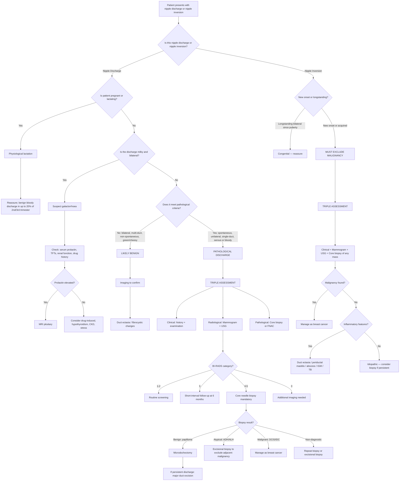

## Diagnostic Criteria, Diagnostic Algorithm, and Investigation Modalities

### 1. The Diagnostic Principle: Triple Assessment

There is no single "diagnostic criterion" for nipple discharge or inversion the way there is for, say, diabetes. Instead, the diagnostic approach is built on the **Triple Assessment** framework — the same systematic approach used for any breast complaint. The reason is simple: the primary concern with pathological nipple discharge or new nipple inversion is **excluding malignancy**, and no single modality is sensitive enough on its own.

> ***Triple Assessment = Clinical (history + examination) + Radiological (mammogram ± USG) + Pathological (FNAC or core biopsy)*** [1][8]
>
> ***Sensitivity 99.6% and specificity 93%*** [1][8]
>
> ***Triple Assessment is positive if any of the above is positive, but negative only when all three are negative*** [8]
>
> ***If findings do not all correlate, further investigations or monitoring is necessary*** [8]

Why three components? Because each component has its own blind spots:

| Component | Sensitivity Alone | Blind Spots |
|---|---|---|
| ***Clinical (history + examination)*** | ***50–85%*** [8] | Small non-palpable lesions; deep lesions; early DCIS without mass |
| ***Radiology (mammogram ± USG)*** | ***~90%*** [8] | Dense breasts in young women (mammogram); microcalcifications (USG); operator-dependent (USG) |
| ***Pathology (FNAC or core biopsy)*** | ***~91%*** [8] | Sampling error (FNAC); FNAC cannot distinguish in-situ from invasive (no architecture) |

By combining all three, the overall sensitivity reaches **99.6%** — meaning you miss very little. The logic: if any one component flags concern, you proceed with further workup even if the other two are reassuring.

---

### 2. Diagnostic Criteria — What Makes Discharge "Pathological"?

Before launching into investigations, you need to determine whether the discharge warrants full triple assessment or can be managed conservatively. The criteria that define **pathological** (i.e. "suspicious") nipple discharge are:

| Feature | Pathological | Physiological/Benign |
|---|---|---|
| ***Spontaneity*** | ***Spontaneous*** (stains bra/clothing without squeezing) [1] | Only on manual expression |
| ***Laterality*** | ***Unilateral*** [1] | Bilateral |
| ***Number of ducts*** | ***Single duct*** [1] | Multiple ducts |
| ***Colour*** | ***Blood-stained / serous (clear or yellow) / serosanguineous*** [1] | Milky, green, multi-coloured cheesy |
| ***Persistence*** | Persistent | Intermittent |
| ***Associated findings*** | ***Palpable breast mass and/or axillary lymph node*** [1] | None |

If the discharge meets pathological criteria → **full triple assessment is mandatory**.

If the discharge is milky and bilateral → think galactorrhoea → check prolactin, TFTs, drug history, renal function first.

If the discharge is multi-coloured/cheesy in an older woman with no mass → likely duct ectasia → imaging to confirm, but low concern for malignancy.

<Callout title="When to Worry About Nipple Discharge" type="error">
The combination that should trigger alarm bells: **spontaneous + unilateral + single-duct + bloody or serous**. This pattern carries a 5–15% risk of underlying malignancy (most commonly DCIS). Even if mammogram is normal, pathological assessment (core biopsy or surgical duct excision) is required.
</Callout>

---

### 3. Diagnostic Criteria for Nipple Inversion

There are no formal "diagnostic criteria" for nipple inversion itself — you can see it. The diagnostic question is **why** it is there:

| Scenario | Action |
|---|---|
| **Longstanding bilateral, evertible** | Congenital — reassure, no further investigation needed |
| **New-onset unilateral, non-evertible** | **Acquired — must exclude malignancy** → full triple assessment |
| **New-onset + associated features** (mass, skin changes, discharge, LN) | **High suspicion for carcinoma** → urgent triple assessment |
| **New-onset + history of inflammation** (smoking, recurrent abscess) | Consider periductal mastitis/duct ectasia, but still image to exclude malignancy |

---

### 4. The Triple Assessment — Component by Component

#### 4A. Clinical Assessment

This is the first and most important step. It costs nothing, requires no equipment, and immediately stratifies risk.

**History** — The lecture slides specify the essential questions [1][8]:

> ***Clinical history for patients with breast symptoms: breast symptoms (lump, pain, nipple discharge), further characterisation (duration, changes, unilateral or bilateral, characteristics)*** [1]

For nipple discharge specifically:
- ***Symptom: unilateral/bilateral, characteristics (blood-stained/milky/serous), spontaneous or on manual expression*** [1]
- Recent pregnancy/breastfeeding?
- Drug history (antipsychotics, antiemetics, antidepressants)?
- Menstrual history (cyclical changes suggest fibrocystic disease)?
- Risk factors for breast cancer (FHx, BRCA, prior breast disease, oestrogen exposure) [3]

For nipple inversion:
- When did it start? Present since puberty (congenital) vs new-onset (acquired)?
- Progressive? Can you evert it?
- Associated mass, discharge, skin changes?

**Physical Examination** [1][3]:

> ***Consent / Chaperone / Curtain → Positioning → Exposure → Inspection → Palpation*** [1]

- ***Inspection***: ***symmetry, scar, skin changes, special manoeuvre (raise up patient's arms)*** [1]
  - ***Nipple changes (5Ds)***: deviation, discolouration, dermatitis, depression (retraction/inversion), discharge [2][3]
  - ***Skin changes***: dimpling, peau d'orange, ulceration, erythema
- ***Palpation***: ***breast mass, axillary lymph nodes, nipple discharge (if applicable)*** [1]
  - Express discharge by compressing breast radially toward nipple — identify the "trigger point" and which duct(s) are involved
  - Characterise any mass: site, size, shape, border, surface, consistency, tenderness, mobility (to skin and muscle) [3]
  - ***Axillary lymph nodes***: anterior, posterior, medial, lateral, apical groups [3]

---

#### 4B. Radiological Assessment

##### i. Mammography

"Mammography" → from Latin *mamma* = breast + Greek *graphein* = to write/record. It is a low-dose X-ray of the breast.

> ***Mammogram: only for female > 35 years*** (poor resolution in dense breasts in young females) [3]

**Why age > 35?** Younger women have dense fibroglandular tissue that appears white on mammography — the same colour as tumours. This "white-on-white" problem makes mammography insensitive in young dense breasts. After age 35, breast tissue gradually involutes and is replaced by radiolucent fat, making masses and calcifications much more conspicuous.

***Standard views*** [2][3]:
- ***Craniocaudal (CC) view***: X-ray beam goes from top to bottom. Shows medial-to-lateral extent. Used to determine inner vs outer quadrant.
- ***Mediolateral oblique (MLO) view***: X-ray beam at 45° angle. Shows the ***axillary tail, axillary lymph nodes, and upper outer quadrant*** in detail [2]. Used to determine upper vs lower half (line perpendicular to pectoralis major).

***Mammographic features of malignancy*** [2][3]:

| Feature | Benign | Malignant |
|---|---|---|
| **Mass shape** | Round, oval, well-circumscribed | ***Spiculated (stellate) mass with irregular borders*** [3] |
| **Calcification content** | Rim-like, large coarse, smooth round/oval | ***Pleomorphic microcalcifications*** [2] |
| **Calcification distribution** | Vascular, skin calcification | ***Linear branching microcalcifications, clustered microcalcifications ( > 5/mm²)*** [2] |
| **Architecture** | Normal | ***Architectural distortion (e.g. tent sign)*** [3] |
| **Other** | — | ***Pectoralis major involvement (MLO view only), skin thickening/tethering, nipple involvement*** [3] |

**Mammography for nipple discharge specifically:**
- Look for **microcalcifications** (DCIS)
- Look for a **retroareolar mass** (papilloma, carcinoma)
- Look for **dilated calcified ducts** (duct ectasia) [4]
- In ***Paget's disease***: ***mammography is mandatory*** to look for associated mass and exclude synchronous cancers or widespread calcification [2]

**Limitations of mammography** [2]:
- Cannot make a definitive diagnosis — can only depict a mass as abnormal or suspicious
- Dense breast tissue can obscure lesions
- Cannot reliably distinguish benign from malignant without biopsy

##### ii. Breast Ultrasound (USG)

> ***USG breast: for all patients*** [3]

**Why USG for everyone?** Because it complements mammography perfectly — it works best precisely where mammography is weakest (dense breasts, young women, cystic vs solid differentiation).

***Roles of USG*** [2][3]:
- ***Improved sensitivity and specificity combined with mammogram, especially in young women with dense breast tissue*** [3]
- ***Distinguish cysts from solid lesions*** [3] — this is crucial because a simple cyst needs no further intervention
- ***Guide FNAC, biopsy, and clipping*** before neoadjuvant chemotherapy [3]
- ***Assess axillary lymph nodes*** [3] — suspicious LN: ***loss of fatty hilum*** [3]
- ***First imaging study in young women ( < 35) or women who are pregnant or lactating*** [2]
- Identify presence of a prominent vascular supply (colour Doppler)

***USG features — benign vs malignant*** [2]:

| Feature | Benign | Malignant |
|---|---|---|
| ***Shape*** | ***Wider-than-taller (ellipsoid)*** | ***Taller-than-wide (fir-tree shape)*** [2] |
| ***Margin*** | ***Smooth margins, macrolobulation*** | ***Spiculated or angular margins, microlobulation*** [2] |
| ***Echogenicity*** | ***Hyperechoic, thin echogenic capsule*** | ***Hypoechoic*** [2] |
| ***Calcification*** | Absent | ***Internal calcification, posterior acoustic shadowing*** [2] |
| ***Vascularity*** | Absent | ***Central vascularity*** [2] |

> Mnemonic for suspicious USG features: ***"SHIT CME"*** — same features as suspicious thyroid nodules [3]:
> **S**olid, **H**ypoechoic, **I**rregular margins, **T**aller-than-wide, **C**alcification (micro), **M**icrolobulation, **E**xtra-thyroidal extension (in breast: chest wall invasion)

**USG for nipple discharge specifically:**
- Look for a **dilated duct with intraluminal mass** (papilloma)
- Look for a **retroareolar abscess cavity** (periductal mastitis/abscess)
- Look for a **solid retroareolar mass** (carcinoma)
- Characterise any cyst: simple (anechoic, posterior enhancement) vs complex (internal echoes, septations, solid component)

***Limitations*** [3]:
- ***NOT useful as screening*** — operator-dependent
- ***Cannot pick up most calcifications*** [3] — mammography is far superior for detecting microcalcifications (DCIS)

##### iii. BI-RADS Classification

The ***Breast Imaging Reporting and Data System (BI-RADS)*** is a standardised scoring system ***applicable to both mammographic and ultrasound findings*** [2]. It translates imaging findings into a management recommendation:

| BI-RADS Category | Assessment | Malignancy Risk | Management |
|---|---|---|---|
| **0** | Incomplete — needs additional imaging | N/A | Recall for additional views, USG, or comparison with prior studies |
| **1** | Negative — normal | ~0% | Routine screening |
| **2** | Benign finding | ~0% | Routine screening |
| **3** | Probably benign | ≤ 2% | Short-interval follow-up (6 months) |
| ***4a*** | ***Low suspicion*** | ***> 2% to ≤ 10%*** | ***Tissue diagnosis (biopsy)*** [3] |
| ***4b*** | ***Moderate suspicion*** | ***> 10% to ≤ 50%*** | ***Tissue diagnosis*** [3] |
| ***4c*** | ***High suspicion*** | ***> 50% to < 95%*** | ***Tissue diagnosis*** [3] |
| ***5*** | ***Highly suggestive of malignancy*** | ***≥ 95%*** | ***Tissue diagnosis*** [3] |
| **6** | Known biopsy-proven malignancy | N/A | Surgical excision when clinically appropriate [3] |

<Callout title="BI-RADS in Practice">
BI-RADS 1–2: reassure and return to routine screening. BI-RADS 3: short-interval follow-up (6 months, then repeat). BI-RADS 4–5: biopsy is mandatory. BI-RADS 6: already proven cancer, imaging done for treatment planning. The key threshold is BI-RADS 4 — anything ≥ 4 gets a needle.
</Callout>

##### iv. Ductography (Galactography)

"Ductography" → *ductus* = duct + *graphein* = to write/record. It is a contrast study of the lactiferous duct system.

- **Technique**: A fine cannula is inserted into the discharging duct orifice on the nipple, and water-soluble contrast is injected. Mammographic images are then taken to outline the duct anatomy.
- **Purpose**: Localise an intraductal lesion (papilloma, DCIS) before surgical duct excision (microdochectomy) [2][3].
- **Findings**:
  - **Filling defect** = intraluminal mass (papilloma or carcinoma)
  - **Duct irregularity or cut-off** = possible malignancy
  - **Duct ectasia** = dilated ducts without filling defects
- **Limitations**: Invasive, uncomfortable, technically difficult if duct cannot be cannulated, largely being replaced by breast MRI and ductoscopy.

##### v. Ductoscopy

- **Technique**: A microendoscope (0.5–1.2 mm diameter) is inserted into the discharging duct to directly visualise the duct lumen.
- **Purpose**: Direct visualisation of intraductal pathology (papilloma, DCIS); can take biopsies under direct vision; helps guide microdochectomy [2].
- **Advantage**: Combines diagnosis and surgical planning in one procedure.
- **Limitation**: Not widely available; technically challenging; limited to larger ducts.

##### vi. Breast MRI

- **When?** Not routine for nipple discharge, but useful in specific scenarios:
  - Occult lesion (mammogram and USG negative but clinical suspicion high)
  - Assessment of extent of disease in known malignancy (multifocal/multicentric disease)
  - Screening high-risk patients (BRCA carriers)
  - Evaluation of response to neoadjuvant chemotherapy
- **Advantage**: Highest sensitivity (~95–100%) for invasive breast cancer; not limited by breast density.
- **Limitation**: Low specificity (many false positives → unnecessary biopsies); expensive; requires IV gadolinium; not good for calcifications.

---

#### 4C. Pathological Assessment

This is the definitive diagnostic step — imaging tells you something is there, but only tissue diagnosis tells you what it is.

##### i. Fine Needle Aspiration Cytology (FNAC)

- **Technique**: A fine needle (21–23 gauge) is inserted into the lesion (palpable or USG-guided) and cells are aspirated for cytological examination.
- ***Advantage: no need for local anaesthesia, smaller needle*** [3]
- ***Disadvantage: cannot assess architecture (i.e. cannot distinguish carcinoma in-situ from invasive carcinoma)*** [3] — Why? Because FNAC harvests individual cells, not tissue with preserved structure. You cannot tell whether cells have breached the basement membrane.
- ***Preferred if low risk (e.g. non-palpable mass, equivocal mammogram) or simple cysts*** [3]

**FNAC approach to cystic lesions** [3]:
- ***Lump disappears / clear fluid obtained → no further investigation***
- ***Residual thickening / blood-stained fluid → core biopsy*** [3]

**FNAC approach to solid lesions** [3]:
- ***Benign cytology → observe or excision***
- ***Atypical cytology → core needle biopsy*** (upgrade to histology)
- ***Malignant cytology → treat as cancer*** [3]

**FNAC of nipple discharge** (discharge cytology):
- Collect the discharge and send for cytology
- Can identify malignant cells, papillary fragments, inflammatory cells, or foamy macrophages (duct ectasia)
- ***Low sensitivity*** — a negative cytology does NOT exclude malignancy
- Useful as an adjunct, not a standalone investigation [3]

##### ii. Core Needle Biopsy (CNB) — First-Line for Tissue Diagnosis

- **Technique**: A larger needle (9–14 gauge) with a spring-loaded cutting mechanism obtains a core of tissue, preserving architecture.
- ***Performed if BI-RADS ≥ 4*** [3]
- ***Advantages: architectural assessment, tumour grading, receptor status (ER/PR/HER2)*** [3] — Why better than FNAC? Because a tissue core preserves the relationship between cells and basement membrane, allowing you to determine invasion vs in-situ, grade the tumour, and perform immunohistochemistry.
- ***Disadvantages: requires local anaesthesia, larger needle (9–14G)*** [3]
- ***For non-palpable masses: USG-guided, stereotactic (mammographic-guided), tomosynthesis (3D mammogram), or MRI-guided*** [3]
- ***Increased yield: vacuum-assisted core biopsy (VAB)*** — uses suction to obtain larger, more representative tissue samples [3]

**Core biopsy for nipple discharge:**
- If imaging identifies a mass lesion (papilloma, suspicious lesion) → USG-guided core biopsy
- If imaging shows microcalcifications without a mass → stereotactic (mammographic-guided) core biopsy

**Core biopsy for nipple inversion:**
- If a retroareolar mass is identified → USG-guided core biopsy
- If Paget's disease is suspected → ***full-thickness wedge biopsy of the nipple and underlying breast tissue*** [2]

##### iii. Excisional Biopsy

- **When?** When core biopsy reveals a suspicious lesion that is not diagnostic, or when there is discordance between clinical/radiological and pathological findings [3].
- ***If atypical hyperplasia (ADH/ALH) is found on core biopsy → excisional biopsy MUST be performed to rule out adjacent malignancy*** [3][6] — Why? Because ADH/ALH on core biopsy is upgraded to DCIS or invasive cancer in ~15–30% of cases when the entire lesion is excised. The core only samples a small part of the lesion.

**Localisation of non-palpable lesions** for excisional biopsy [3]:
- ***Hook-wire localisation (HWL)***: a wire with a hook is inserted under imaging guidance to mark the lesion; surgeon excises tissue around the wire tip
  - ***Problems: extensive normal tissue removal, wire outside skin, risk of broken wire*** [3]
- ***Radioactive seed localisation (RSL)***: ¹²⁵I-labelled titanium seed inserted 0–5 days prior to surgery [3]
- ***Radio-opaque lesion localisation (ROLL)***: ⁹⁹ᵐTc-labelled albumin-based colloid injected within 24 hours of surgery [3]
- ***Magseed localisation***: non-radioactive magnetic seed [3]
- ***On-table USG***: real-time ultrasound guidance during surgery [3]

---

### 5. Additional Investigations for Specific Causes

#### For Galactorrhoea (Milky Bilateral Discharge)

| Investigation | Why? | Key Findings |
|---|---|---|
| **Serum prolactin** | Confirm hyperprolactinaemia | Elevated ( > 25 µg/L in females); very high levels ( > 200 µg/L) suggest macroprolactinoma |
| **TFTs** (TSH, free T4) | Hypothyroidism causes ↑ TRH → ↑ prolactin; also ↓ clearance | ↑ TSH, ↓ fT4 |
| **Renal function** (urea, creatinine) | CKD → ↓ clearance of prolactin | Elevated urea/creatinine |
| **Drug history review** | Drug-induced hyperprolactinaemia | Antipsychotics, antiemetics, antidepressants |
| **MRI pituitary** (with gadolinium) | Exclude prolactinoma or other pituitary/hypothalamic lesions | Microadenoma ( < 10 mm) or macroadenoma (≥ 10 mm) |
| **Visual field testing** | Macroadenoma may compress the optic chiasm | Bitemporal hemianopia |

#### For Suspected Infection/Abscess

| Investigation | Why? | Key Findings |
|---|---|---|
| **USG breast** | Confirm abscess cavity; guide aspiration | Hypoechoic collection with posterior acoustic enhancement |
| **Aspiration + culture** | Identify organism and sensitivities | *S. aureus* (lactational); mixed flora (periductal) |
| **Clinical diagnosis** | ***Lactational mastitis is a clinical diagnosis; laboratory tests are not needed*** [2] | Imaging if refractory to antibiotics in 48–72 hours |

#### For Suspected Paget's Disease

| Investigation | Why? | Key Findings |
|---|---|---|
| ***Full-thickness wedge biopsy of nipple*** | Definitive diagnosis | ***Paget cells — large, pale, malignant intraepithelial adenocarcinoma cells within the nipple epidermis*** [2][7] |
| ***Mammography*** (mandatory) | Detect underlying breast cancer, exclude synchronous cancers | Mass, microcalcifications, architectural distortion [2] |
| **USG** | Evaluate any palpable mass or mammographic abnormality | Guide core biopsy of underlying lesion [2] |

#### For Staging (If Malignancy Confirmed)

| Investigation | Why? | Key Findings |
|---|---|---|
| **Bilateral mammogram** | Exclude synchronous contralateral breast cancer [3] | Second primary or metastatic lesion |
| ***Bloods: LFT*** | ***Liver metastasis*** [3] | Elevated ALP, GGT, transaminases |
| ***Bloods: CaPO4*** | ***Bone metastasis*** [3] | Hypercalcaemia |
| ***Tumour markers: CA15.3, CEA*** | Baseline for monitoring treatment response [3] | Elevated |
| **CXR** | Lung metastasis | Pulmonary nodules, pleural effusion |
| ***PET-CT, bone scan*** | Staging for distant metastasis [3] | Skeletal hot spots (bone scan); FDG-avid lesions (PET) |

---

### 6. Master Diagnostic Algorithm — Mermaid Diagram

---

### 7. Specific Investigation Findings by Diagnosis

| Diagnosis | Mammography | USG | Ductography | Pathology |
|---|---|---|---|---|
| **Intraductal papilloma** | Often normal; may show retroareolar soft-tissue density | Dilated duct with intraluminal solid mass; vascularity on Doppler | ***Filling defect*** within a single duct [2] | Papillary architecture with fibrovascular core on core biopsy [2] |
| **Duct ectasia** | ***Dilated calcified ducts*** [4]; tubular densities; periductal calcification (linear, branching but coarse) | Dilated anechoic or hypoechoic subareolar ducts; may show intraluminal debris | Dilated ducts without discrete filling defect | ***Plasma cells*** on cytology [4]; dilated ducts with chronic inflammation and fibrosis on histology |
| **DCIS** | ***Microcalcifications*** (pleomorphic, clustered, linear branching) [2][6] — this is the hallmark; may have no mass | May be occult on USG; if visible, irregular hypoechoic area | Duct irregularity or cut-off | Malignant cells within TDLU without invasion; ***comedo necrosis with dystrophic calcification (high-grade)*** [6] |
| **Invasive carcinoma** | ***Spiculated mass, architectural distortion, pleomorphic microcalcifications*** [2][3] | ***Hypoechoic, taller-than-wide, irregular/spiculated margins, posterior acoustic shadowing, central vascularity*** [2] | Duct obstruction, filling defect | Invasive malignant cells breaching basement membrane; receptor status (ER/PR/HER2) on core biopsy [3] |
| **Paget's disease** | Must look for underlying mass/calcifications [2] | Evaluate underlying mass | N/A | ***Paget cells in nipple epidermis*** [2][7]; underlying DCIS or invasive cancer |
| **Fibrocystic changes** | Dense parenchyma; scattered calcifications (usually benign-type: round, uniform) | Small cysts, areas of parenchymal thickening | N/A | Stromal fibrosis, micro/macrocysts, apocrine metaplasia, hyperplasia [2] |
| **Lactational mastitis / abscess** | Usually not performed (young, lactating) | ***Hypoechoic collection*** (abscess cavity) with posterior enhancement; surrounding oedema | N/A | ***Clinical diagnosis*** [2]; aspiration yields pus |
| **Periductal mastitis** | May show retroareolar density | Retroareolar abscess; fistula tract | N/A | Mixed inflammatory infiltrate; duct damage |
| **Fat necrosis** | ***Mimics CA radiologically*** — spiculated mass, calcification → ***core biopsy to differentiate*** [4] | Complex cystic/solid lesion; oil cyst | N/A | Lipid-laden macrophages, fibrosis, necrotic fat |
| **Galactorrhoea** | Normal breast | Normal breast | N/A | N/A (no breast pathology) — the issue is systemic/hormonal |

---

### 8. Approach to the Specific Complaint — Putting It All Together

#### Nipple Discharge — Practical Stepwise Approach

1. **History and examination** → classify discharge (physiological vs pathological)
2. If **milky bilateral** → serum prolactin, TFTs, renal function, drug review → if prolactin elevated → pituitary MRI
3. If **pathological** (spontaneous, unilateral, single-duct, serous/bloody):
   - Age ≥ 35: ***mammogram + USG*** [3]
   - Age < 35 or pregnant/lactating: ***USG first*** (mammogram if clinically indicated) [2][3]
4. **BI-RADS ≥ 4** → ***core needle biopsy*** [3]
5. **BI-RADS < 4 but persistent pathological discharge** → ***ductogram or ductoscopy*** to localise lesion → ***microdochectomy*** (diagnostic and therapeutic) [2]
6. If discharge resolves and imaging is benign → ***follow-up***
7. ***Nipple discharge cytology*** can be sent as adjunct but has low sensitivity — do not rely on it to exclude malignancy [3]

#### Nipple Inversion — Practical Stepwise Approach

1. **Determine congenital vs acquired** (history of onset, bilateral vs unilateral, evertibility)
2. If **congenital** → reassure
3. If **acquired** → ***mammogram + USG*** (exclude mass, microcalcifications)
4. If mass identified → ***core biopsy***
5. If no mass but clinical suspicion → ***MRI breast*** or ***surgical exploration***
6. If inflammatory cause identified → treat accordingly (antibiotics, drainage, fistulectomy)

---

<Callout title="High Yield Summary — Diagnosis">

1. ***Triple Assessment (Clinical + Radiological + Pathological) = sensitivity 99.6%, specificity 93%*** [1][8]. Positive if ANY one component is positive. Negative only when ALL three are negative.

2. **Pathological discharge criteria**: spontaneous, unilateral, single-duct, serous or bloody → mandates full triple assessment.

3. ***Mammogram for age ≥ 35; USG for all patients; USG first-line for age < 35 or pregnant/lactating*** [2][3].

4. ***BI-RADS ≥ 4 → core needle biopsy*** is mandatory [3]. BI-RADS 3 → short-interval follow-up.

5. **Core biopsy > FNAC** because it provides architectural assessment, grading, and receptor status (ER/PR/HER2). FNAC cannot distinguish in-situ from invasive cancer.

6. ***If ADH/ALH on core biopsy → excisional biopsy is MANDATORY*** to exclude adjacent malignancy (upgrade rate 15–30%) [3][6].

7. **Ductography/ductoscopy** help localise intraductal lesions when imaging is inconclusive but discharge is persistent.

8. **Paget's disease diagnosis**: full-thickness wedge biopsy of nipple showing Paget cells. Mammography is mandatory to find the underlying cancer.

9. **Galactorrhoea workup**: serum prolactin → TFTs → renal function → drug history → pituitary MRI if prolactin elevated.

10. **Acquired unilateral nipple inversion** → triple assessment to exclude malignancy, regardless of whether discharge is present.

</Callout>

---

<ActiveRecallQuiz
  title="Active Recall - Diagnostic Approach to Nipple Discharge and Inversion"
  items={[
    {
      question: "What are the three components of triple assessment for breast complaints, and what is the combined sensitivity and specificity?",
      markscheme: "Clinical (history + examination), Radiological (mammogram +/- USG), Pathological (FNAC or core biopsy). Combined sensitivity 99.6%, specificity 93%. Positive if ANY one component is positive; negative only when ALL three are negative.",
    },
    {
      question: "A 30-year-old woman presents with spontaneous unilateral bloody discharge from a single duct. She has no palpable mass. What is the first-line imaging modality and why? What is the next step if imaging shows a BI-RADS 4 lesion?",
      markscheme: "First-line imaging: USG (not mammogram), because she is under 35 and has dense breast tissue making mammography insensitive. If BI-RADS 4: core needle biopsy is mandatory (to obtain histological diagnosis including architecture, grading, and receptor status).",
    },
    {
      question: "Why is core needle biopsy preferred over FNAC for the pathological component of triple assessment in suspected malignancy?",
      markscheme: "Core biopsy provides a tissue core preserving architecture, allowing: (1) distinction between carcinoma in-situ and invasive carcinoma (FNAC cannot assess basement membrane invasion); (2) tumour grading; (3) receptor status determination (ER/PR/HER2/Ki-67). FNAC only provides individual cells (cytology) without architectural context.",
    },
    {
      question: "Atypical ductal hyperplasia is found on core biopsy of a mammographically detected lesion. What is the mandatory next step and why?",
      markscheme: "Excisional biopsy is MANDATORY. Reason: ADH found on core biopsy is upgraded to DCIS or invasive carcinoma in approximately 15-30% of cases when the entire lesion is excised. The core biopsy only samples a small portion of the lesion, potentially missing adjacent malignancy.",
    },
    {
      question: "List the mammographic features that suggest malignancy on a screening mammogram.",
      markscheme: "1. Spiculated (stellate) mass with irregular borders. 2. Pleomorphic microcalcifications. 3. Linear branching microcalcifications. 4. Clustered microcalcifications (more than 5 per mm-squared). 5. Architectural distortion (e.g. tent sign). 6. Asymmetrical density. 7. Skin thickening or tethering. 8. Nipple involvement. 9. Pectoralis major involvement (MLO view).",
    },
    {
      question: "What BI-RADS category triggers the need for tissue biopsy, and what are the sub-categories within it?",
      markscheme: "BI-RADS 4 (Suspicious) triggers mandatory tissue biopsy. Sub-categories: 4a = low suspicion (more than 2% to 10% malignancy risk), 4b = moderate suspicion (more than 10% to 50%), 4c = high suspicion (more than 50% to less than 95%). BI-RADS 5 (highly suggestive, 95% or more) also mandates biopsy.",
    },
  ]}
/>

---

## References

[1] Lecture slides: GC 181. Breast mass breast cancer; benign breast diseases; mammography; breast cancer screening.pdf (p10, p12, p15, p16)
[2] Senior notes: felixlai.md (Nipple discharge and inversion pp.269–271; Duct ectasia p.280; Mammogram and USG findings pp.288–290; Paget's disease pp.286–287; Intraductal papilloma p.276; ADH/ALH pp.274–275)
[3] Senior notes: maxim.md (Sections 8.2–8.4: Triple assessment, radiological assessment, pathological assessment pp.178–183; BI-RADS classification p.181; Excisional biopsy and localisation techniques pp.182–183)
[4] Senior notes: maxim.md (Section 8.5: Inflammatory breast conditions — duct ectasia, fat necrosis pp.185–186)
[5] Senior notes: maxim.md (Section 8.6: Benign breast tumours p.187)
[6] Senior notes: maxim.md (Section 8.4: DCIS vs LCIS table p.184; ADH on core biopsy → excisional biopsy p.183)
[7] Lecture slides: GC 201. Skin ulcers skin and subcutaneous lesions; skin cancer.pdf (p47)
[8] Lecture slides: The Managment of breast cancer_Prof A Kwong 20_2_2020.pdf (p10)
