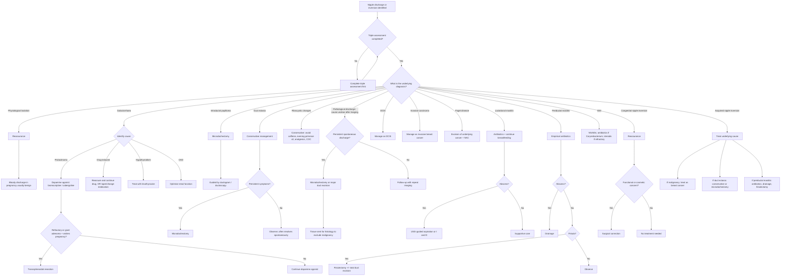

## Management Algorithm and Treatment Modalities

The management of nipple discharge and nipple inversion is **cause-directed**. There is no single treatment — the approach depends entirely on what the triple assessment reveals. Think of it as a decision tree: first you identify the underlying cause, then you treat that cause. The nipple discharge or inversion is the *symptom*, not the disease.

The key management principle is straightforward:
1. **Physiological / benign discharge** → reassure, address the underlying cause (e.g. stop offending drug, treat prolactinoma)
2. **Pathological discharge** → surgical excision of the offending duct (diagnostic AND therapeutic)
3. **Malignancy** → treat as breast cancer (surgery ± adjuvant therapy)
4. **Infection/inflammation** → antibiotics ± drainage
5. **Congenital nipple inversion** → reassure; surgical correction only if functional/cosmetic concern
6. **Acquired nipple inversion** → treat the underlying cause

---

### 1. Master Management Algorithm

---

### 2. Management by Underlying Cause — Detailed Treatment Modalities

#### 2A. Galactorrhoea (Milky Bilateral Discharge)

The discharge itself is not the problem — the underlying hormonal derangement is.

##### Medical Treatment

| Cause | Treatment | Mechanism | Notes |
|---|---|---|---|
| **Prolactinoma** | ***Bromocriptine*** or ***Cabergoline*** [2] | Dopamine agonists → activate D2 receptors on lactotroph cells → restore tonic inhibition of prolactin secretion → prolactin drops → galactorrhoea resolves | Cabergoline is preferred in practice (longer half-life, better tolerated, twice weekly dosing). Bromocriptine ("bromo" = bad smell — patients hate the nausea) requires daily dosing. |
| **Drug-induced** | ***Reassurance and continuation of drug*** OR ***taper or change medication*** [2] | Remove the D2-blocking agent → restore dopaminergic inhibition of prolactin | Always weigh the psychiatric/medical need for the drug vs the discharge. Often the answer is reassurance — galactorrhoea is not harmful. |
| **Hypothyroidism** | Levothyroxine | Corrects low T4 → normalises TRH → removes TRH-mediated prolactin stimulation; also restores metabolic clearance of prolactin | Galactorrhoea typically resolves within weeks of achieving euthyroid state |
| **CKD** | Optimise renal function; dialysis if indicated | Improves renal clearance of prolactin | |

##### Surgical Treatment (Prolactinoma)

- ***Transsphenoidal resection*** [2]
  - **Indication 1**: ***Refractory to dopamine agonists*** — prolactin does not normalise or tumour does not shrink [2]
  - **Indication 2**: ***Women with giant lactotroph adenoma who wish to become pregnant*** — Why? If the patient becomes pregnant and discontinues the dopamine agonist during pregnancy (as is often recommended), a giant adenoma may enlarge to clinically significant size before delivery, causing mass effects (visual field defects, headaches) [2]
  - The approach is "trans-sphenoidal" = through the sphenoid sinus, which sits just below the pituitary fossa — minimally invasive, avoids craniotomy

---

#### 2B. Intraductal Papilloma

> ***Treatment: Microdochectomy — excision of the diseased duct, usually guided by ductogram / ductoscopy*** [1][2][5]

##### Microdochectomy

- "Micro" = small, "docho" = duct (from Greek *dochos*), "ectomy" = excision. Literally: excision of a single small duct.
- **What it involves**: Excision of the **single affected lactiferous duct and its associated lobules** [2]
- **Why it is the standard**: It is both **diagnostic** (the entire duct is sent for histology, excluding DCIS or IDC that may be lurking behind the papilloma) and **therapeutic** (removes the source of discharge)
- **Guidance**: ***Usually guided by ductogram or ductoscopy*** [1][2] — a probe or wire is placed in the discharging duct to guide the surgeon to the correct duct
- **Indication**: ***Persistent spontaneous discharge from a single duct*** [2]; or biopsy-proven papilloma [2]
- **Technique**: A periareolar incision is made, the discharging duct is identified (often by injecting dye or passing a lacrimal probe), and the duct with its associated lobule is excised en bloc
- **Contraindication**: Not appropriate if malignancy is strongly suspected (proceed to oncological surgery instead)

##### Major Duct Excision (Hadfield's Operation)

- **What it involves**: Excision of **all retroareolar (major) ducts** [2]
- **Indication**: ***Persistent spontaneous discharge*** when the offending duct cannot be identified (multi-duct discharge); or recurrent discharge after microdochectomy [2]
- **Consequence**: Loss of ability to breastfeed from the affected breast (all major ducts removed), so it is not first-line in young women who wish to breastfeed
- **Also indicated**: As part of treatment for periductal mastitis with periareolar fistula (total duct excision ± fistulectomy) [2]

<Callout title="Microdochectomy vs Major Duct Excision">
**Microdochectomy** = single duct removed → first-line for single-duct pathological discharge (usually papilloma). **Major duct excision** = all ducts removed → for multi-duct discharge, recurrent discharge, or when the offending duct cannot be localised. Both are diagnostic and therapeutic — the tissue is always sent for histology.
</Callout>

---

#### 2C. Duct Ectasia

##### Conservative Management (First-Line)

- ***Generally does not require surgery*** [2]
- ***Often resolves spontaneously***, sometimes leaving a residual subareolar nodule [2]
- Reassurance is key — this is an **age-related phenomenon** and is ***NOT associated with increased risk of CA breast*** [2]

##### Surgical Management

- ***Microdochectomy*** — indicated if persistent bothersome discharge or nipple inversion is causing functional/cosmetic problems [2][4]
- If complicated by **periductal mastitis or abscess** → treat the infection first (antibiotics, drainage), then consider elective duct excision if recurrent

---

#### 2D. Fibrocystic Breast Changes

Conservative management only — this is a benign, hormone-driven process:

| Treatment | Mechanism | Notes |
|---|---|---|
| ***Avoid caffeine*** [4] | Methylxanthines in caffeine may stimulate fibrocystic proliferation (controversial but commonly advised) | Some patients report improvement |
| ***Evening primrose oil*** [4] | Contains gamma-linolenic acid (GLA) → modulates prostaglandin synthesis → may reduce breast pain | Evidence is weak but widely used |
| ***Analgesics (NSAIDs)*** [4] | Anti-inflammatory and analgesic effect | For cyclical mastalgia |
| ***COC (combined oral contraceptives)*** [4] | Suppresses the cyclical hormonal fluctuations (oestrogen and progesterone peaks) that drive fibrocystic changes | Stabilises the hormonal environment |
| **Breast cyst aspiration** | If a dominant cyst is present, FNAC drains the fluid and the lump disappears | Surgery only if recurrent or blood-stained aspirate or solid component present [4] |

---

#### 2E. Malignancy (DCIS, IDC, Paget's Disease)

When malignancy is the cause of nipple discharge or inversion, the management follows **standard breast cancer protocols**. Below is a focused summary relevant to these presentations.

##### Paget's Disease of the Nipple

- ***Treatment should include excision of the underlying cancer and the nipple-areolar complex*** [2]
- ***Both mastectomy or BCT followed by whole-breast irradiation are acceptable treatment options*** [2]
- **Nipple-areolar sparing mastectomy is CONTRAINDICATED** in Paget's disease [9][3] — because the disease involves the nipple epidermis; preserving it would leave tumour behind
- Why BCT is acceptable: If the underlying cancer is small and amenable to wide local excision, the nipple-areolar complex is excised along with the tumour, followed by whole-breast radiotherapy. Cosmesis is poor (no nipple), but oncological outcomes are equivalent to mastectomy.

##### DCIS (Most Common Malignancy Causing Nipple Discharge)

Management depends on the ***Van Nuys Prognostic Index*** [2]:

| Score | Treatment |
|---|---|
| ***Low score*** | ***Wide local excision*** alone [2] |
| **Intermediate score** | **Wide local excision + adjuvant radiotherapy** [2] |
| ***High score*** | ***Mastectomy*** [2] |

Key surgical principles:
- ***Negative resection margins ≥ 2 mm*** [2] — Why 2 mm? DCIS is famous for "skip lesions" (discontinuous spread along ducts), so a wider margin reduces recurrence. The older 10 mm margin has been abandoned as overly aggressive [2].
- ***Sentinel lymph node biopsy (SLNB)*** may be considered for DCIS with planned mastectomy or suspicious features — Why? Because if a mastectomy specimen incidentally reveals invasive cancer, SLNB cannot be performed after mastectomy (lymphatic drainage patterns are permanently altered) [2]
- ***ALND is NOT indicated for pure DCIS*** — DCIS by definition does not invade and therefore cannot metastasise to lymph nodes [2]
- **Adjuvant hormonal therapy**: ER-positive DCIS benefits from ***tamoxifen*** (reduces recurrence risk and contralateral cancer risk, but no survival benefit) [2]
- ***No adjuvant chemotherapy*** for DCIS (no added benefit) [2]

##### Invasive Carcinoma (IDC/ILC)

The full breast cancer management is beyond the scope of nipple discharge notes, but the key decision tree for the breast is:

**Breast Management:**

| Option | Approach | Key Points |
|---|---|---|
| ***Breast-conserving surgery (BCS) / wide local excision (WLE)*** | Excise tumour with negative margins + ***compulsory adjuvant radiotherapy*** [2][3] | ***Negative margin = "no ink on tumour"*** [3]; positive margin = > 2× increase in ipsilateral breast tumour recurrence [3] |
| ***Mastectomy*** | When BCS is contraindicated or patient preference [3] | Similar efficacy to BCS + RT [3] |

***Contraindications to BCS*** (***must know!***) [3]:
- ***Multicentric disease*** (≥ 2 primary tumours in separate quadrants)
- ***High tumour-to-breast ratio > 20%*** (can be downstaged by neoadjuvant chemotherapy)
- ***Tumour too close to NAC***
- ***Persistent positive resection margin***
- ***Diffuse malignant-appearing calcifications on imaging***
- ***Inflammatory breast cancer***

***Contraindications to radiotherapy*** [3]:
- ***History of RT to affected chest wall / breast***
- ***Pregnancy*** (possible to perform BCS in 3rd trimester and defer RT until after delivery)
- ***Connective tissue disease (e.g. scleroderma, Sjögren's disease)*** — poor skin healing, risk of fistula formation

> ***Types of mastectomy*** [1][9]:
> - ***Modified radical mastectomy***: whole breast + overlying skin + axillary LN (level I + II) [3]
> - ***Simple mastectomy***: clinically node-negative; axillary LN not dissected → SLNB performed [3]
> - ***Skin-sparing mastectomy***: preserves overlying breast skin; C/I if inflammatory breast cancer [3][9]
> - ***Nipple-areolar sparing mastectomy***: preserves NAC dermis/epidermis with removal of major ducts from nipple lumen [2][9]. ***C/I: inflammatory breast cancer, involvement of NAC, nipple retraction, Paget's disease*** [3][9]. ***For selective low-risk patients; no nipple involvement of cancer; prophylactic mastectomy*** [9]

**Axillary Management:**

| Scenario | Management |
|---|---|
| ***Clinically node-negative*** | ***Sentinel lymph node biopsy (SLNB)*** [3] |
| ***Clinically node-positive*** (by palpation / USG) | ***Axillary lymph node dissection (ALND)*** [3] |
| **SLNB: no metastasis or micrometastasis (≤ 2 mm)** | **No further axillary dissection** [3] |
| **SLNB: macrometastasis ( > 2 mm) in 1–2 LN** | **Controversial** — may omit ALND if receiving breast RT [3] |
| **SLNB: macrometastasis in ≥ 3 LN or extranodal extension** | ***ALND*** [3] |

**Adjuvant Systemic Therapy** — based on ***St Gallen's IHC subtyping*** [3]:

| IHC Subtype | Definition | Adjuvant Therapy |
|---|---|---|
| ***Luminal A*** | ***HR+/HER2-/Ki67 low*** | ***Endocrine therapy alone*** [3] |
| ***Luminal B*** | ***HR+/HER2-/Ki67 high*** | ***Endocrine therapy ± cytotoxic chemotherapy*** [3] |
| ***Luminal B (HER2+)*** | ***HR+/HER2+*** | ***Cytotoxics + anti-HER2 + hormonal therapy*** [3] |
| ***HER2-positive*** | ***HR-/HER2+*** | ***Cytotoxics + anti-HER2 therapy*** [3] |
| ***Triple-negative*** | ***HR-/HER2-*** | ***Cytotoxic therapy*** [3] |

<Callout title="Why Is This Relevant to Nipple Discharge?">
Paget's disease of the nipple is almost always associated with HER2-positive breast cancer. This means the adjuvant treatment will typically include anti-HER2 therapy (trastuzumab) in addition to surgery. When you see Paget's, think HER2+, think trastuzumab.
</Callout>

---

#### 2F. Lactational Mastitis (± Puerperal Breast Abscess)

##### Conservative / Medical Management

| Treatment | Mechanism | Key Points |
|---|---|---|
| **Symptomatic relief** | ***NSAIDs or cold compress*** [2] | Analgesic and anti-inflammatory |
| ***Breastfeeding optimisation*** | ***Complete emptying with pumping or hand expression*** [2] | Removes stagnant milk — the growth medium for bacteria |
| | ***Does NOT require stopping breastfeeding*** [2][4] | Counter-intuitive but essential — continued breastfeeding/pumping prevents engorgement and maintains milk flow |
| ***Antibiotics*** | ***1st generation cephalosporin (cephalexin) or dicloxacillin*** [2] | Covers ***S. aureus*** (most common pathogen); ***cloxacillin*** also mentioned [4] |

##### Breast Abscess Management

- Abscess = ***failure to respond to antibiotics, USG evidence of abscess cavity, or aspiration of pus*** [2]
- ***Needle aspiration*** (USG-guided) — when overlying skin is normal (not ischaemic) [2]
- ***Surgical drainage (incision and drainage, I&D)*** — when there is ***ischaemia or pressure necrosis of overlying skin***, or ***when abscess is not responsive to antibiotics and needle aspiration*** [2]

---

#### 2G. Periductal Mastitis (± Non-Puerperal Abscess ± Periareolar Fistula)

This condition is notoriously recurrent, especially in smokers. The management escalates depending on severity:

| Stage | Treatment | Details |
|---|---|---|
| **Uncomplicated periductal mastitis** | ***Empirical antibiotics*** | ***Amoxicillin-clavulanate (Augmentin)*** OR ***Dicloxacillin + Metronidazole*** [2]. Why Metronidazole? Because the flora is mixed aerobic-anaerobic (Bacteroides is anaerobic), and Metronidazole covers anaerobes |
| **Subareolar abscess** | ***Antibiotics + abscess drainage*** | ***USG-guided fine needle aspiration*** OR ***incision and drainage (I&D)*** [2] |
| **Periareolar fistula** | ***Fistulectomy + primary closure with antibiotic coverage ± total duct excision*** | ***OR lay open the fistula to allow it to granulate ± total duct excision*** [2]. Total duct excision is added because the underlying diseased ducts are the source of recurrence — if you just close the fistula without removing the ducts, it recurs |
| **Smoking cessation** | Essential for preventing recurrence | Smoking is the major modifiable risk factor — it damages duct epithelium, promotes squamous metaplasia, and drives the entire disease process |

---

#### 2H. Idiopathic Granulomatous Mastitis (IGM)

A **self-limiting** disease that resolves slowly over 9–12 months, but can be extremely distressing [2].

| Treatment | Indication | Notes |
|---|---|---|
| **NSAIDs** | Localised pain [2] | First-line symptomatic management |
| ***Amoxicillin-clavulanate (Augmentin)*** | ***If Corynebacterium infection is recovered from biopsy*** [2] | Doxycycline for penicillin allergy |
| ***Corticosteroids ± Methotrexate (MTX)*** | ***Patient unresponsive to NSAIDs or antibiotics*** [2] | Reduces swelling but ***may not alter the natural history***; ***discontinuation/tapering is associated with rebound inflammation*** [2] |
| ***Surgical excision: NOT recommended*** | — | ***Surgical excision of IGM is often followed by slow wound healing*** [2] |

<Callout title="IGM — Don't Operate!" type="error">
IGM is one of those conditions where surgery makes things worse. The granulomatous tissue heals poorly, wounds break down, and you end up with a bigger problem than you started with. Patience + NSAIDs + steroids if needed. It will eventually resolve.
</Callout>

---

#### 2I. Congenital Nipple Inversion

- **Reassurance** — this is benign, bilateral, and has no malignancy risk
- **Breastfeeding**: Grade 1 inversion (easily evertible) is usually compatible with breastfeeding. Grade 2–3 may require nipple shields or breast pumps to help with latch
- **Surgical correction** (if desired for cosmetic/functional reasons):
  - Various techniques exist (e.g. purse-string suture, duct division, dermal flaps)
  - **Trade-off**: duct division corrects inversion but sacrifices the ability to breastfeed from that breast
  - Not medically necessary — purely a patient-preference decision

#### 2J. Atypical Ductal/Lobular Hyperplasia (ADH/ALH)

When nipple discharge leads to a biopsy finding of ADH or ALH, management shifts to **cancer risk reduction and surveillance** [2]:

| Treatment | Why? |
|---|---|
| ***Avoidance of OC pills and HRT*** | Removes exogenous oestrogen exposure, reducing the already 5× elevated cancer risk [2] |
| ***Yearly mammography*** | Detect any new malignancy early [2] |
| ***Twice-yearly breast examination*** | Clinical surveillance [2] |
| ***Hormonal therapy — SERMs (tamoxifen) or aromatase inhibitors*** | Chemoprevention — tamoxifen blocks oestrogen receptors in breast tissue, reducing proliferative stimulus; aromatase inhibitors (in postmenopausal women) block peripheral oestrogen synthesis [2] |

---

### 3. Summary Table — Management by Cause

| Cause | First-Line Management | Second-Line / Surgical | Key Principle |
|---|---|---|---|
| **Physiological lactation** | Reassurance | — | Benign; will resolve |
| **Galactorrhoea** | Treat underlying cause (dopamine agonist, stop offending drug, levothyroxine) | Transsphenoidal surgery if refractory prolactinoma | Fix the hormonal problem |
| ***Intraductal papilloma*** | ***Microdochectomy*** (guided by ductogram/ductoscopy) [1] | Major duct excision if recurrent | Diagnostic + therapeutic |
| **Duct ectasia** | Conservative (resolves spontaneously) | Microdochectomy if persistent | NOT cancer risk; benign |
| **Fibrocystic changes** | Avoid caffeine, evening primrose oil, NSAIDs, COC | Cyst aspiration; surgery only if solid/recurrent | Hormonal; cyclical |
| **DCIS** | WLE ± RT (by Van Nuys score) or mastectomy | Tamoxifen if ER+; SLNB if planned mastectomy | Margins ≥ 2 mm |
| **Invasive carcinoma** | BCS + RT or mastectomy + axillary management | Adjuvant systemic therapy by IHC subtype | No ink on tumour |
| **Paget's disease** | Excision of underlying cancer + NAC | Mastectomy or BCT + RT | Nipple-sparing mastectomy C/I |
| **Lactational mastitis** | Antibiotics (cephalexin/dicloxacillin) + continue breastfeeding | Abscess: USG aspiration or I&D | Do NOT stop breastfeeding |
| **Periductal mastitis** | Augmentin or dicloxacillin + metronidazole | Abscess drainage; fistulectomy ± total duct excision | Smoking cessation essential |
| **IGM** | NSAIDs; Augmentin if Corynebacterium | Steroids ± MTX if refractory; do NOT operate | Self-limiting; surgery harms |
| **ADH/ALH** | Surveillance + avoid OC/HRT | Tamoxifen / aromatase inhibitors | 5× cancer risk; monitor |
| **Congenital nipple inversion** | Reassurance | Surgical correction if cosmetic/functional concern | Benign; no cancer risk |
| **Acquired nipple inversion** | Treat underlying cause | Depends on cause | Always exclude malignancy first |

---

### 4. Surgical Procedures — Quick Reference

| Procedure | What Is Excised | Indication | Key Points |
|---|---|---|---|
| ***Microdochectomy*** | Single lactiferous duct + associated lobules | ***Persistent spontaneous single-duct discharge*** [1][2]; biopsy-proven papilloma | ***Guided by ductogram/ductoscopy*** [1]; diagnostic + therapeutic; preserves other ducts |
| **Major duct excision (Hadfield's)** | All retroareolar ducts | ***Persistent spontaneous multi-duct discharge*** [2]; recurrent discharge; periductal mastitis with fistula | Sacrifices breastfeeding ability; removes all diseased ducts |
| ***Wide local excision (BCS)*** | Tumour with margin of normal tissue | Early breast cancer (≤ T2, single quadrant, appropriate tumour:breast ratio) | ***Compulsory adjuvant RT*** [2]; ***margin = "no ink on tumour"*** [3] |
| ***Simple mastectomy*** | Entire breast; axilla not dissected | ***Clinically node-negative*** [3][9] | SLNB performed simultaneously |
| ***Modified radical mastectomy*** | Whole breast + overlying skin + axillary LN (level I + II) | Clinically node-positive | More extensive than simple mastectomy [3] |
| ***Skin-sparing mastectomy*** | Breast tissue; preserves overlying skin and inframammary fold | Therapeutic with immediate reconstruction; prophylactic | ***C/I: inflammatory breast cancer*** [3][9] |
| ***Nipple-areolar sparing mastectomy*** | Breast tissue; preserves NAC dermis/epidermis; removes major ducts | ***Selective low-risk patients; no nipple involvement; prophylactic mastectomy*** [9] | ***C/I: inflammatory CA, NAC involvement, nipple retraction/discharge, Paget's disease*** [3][9] |
| **Fistulectomy** | Fistula tract ± total duct excision | Periareolar fistula from periductal mastitis | Combined with antibiotic coverage [2] |
| ***Transsphenoidal resection*** | Pituitary adenoma (prolactinoma) | Refractory to dopamine agonists; giant adenoma + pregnancy planned | Through sphenoid sinus; avoids craniotomy [2] |

---

### 5. Important Contraindications to Remember

| Treatment | Contraindication | Why? |
|---|---|---|
| **BCS/WLE** | ***Multicentric disease, high tumour:breast ratio, persistent positive margins, diffuse malignant calcifications, inflammatory breast cancer, tumour too close to NAC*** [3] | Cannot achieve adequate negative margins with acceptable cosmesis |
| **Adjuvant RT** | ***Prior RT to same area, pregnancy (defer to post-delivery), connective tissue disease (scleroderma, Sjögren's)*** [3] | Excessive cumulative radiation dose; teratogenicity; poor wound healing → fistula |
| ***Nipple-areolar sparing mastectomy*** | ***Inflammatory CA, Paget's disease, nipple retraction, nipple discharge, NAC involvement by cancer*** [3][9] | Leaving the NAC would leave residual tumour behind |
| **Surgical excision for IGM** | Essentially always contraindicated [2] | ***Slow wound healing*** — makes the problem worse [2] |
| **Stopping breastfeeding in lactational mastitis** | ***Does NOT require stopping breastfeeding*** [2][4] | Continued emptying prevents further engorgement and accelerates resolution |

---

<Callout title="High Yield Summary — Management">

1. ***Microdochectomy (excision of the diseased duct, guided by ductogram/ductoscopy)*** [1] is the standard surgical treatment for pathological single-duct discharge (papilloma). Major duct excision is for multi-duct or recurrent discharge.

2. **Galactorrhoea**: treat the cause — dopamine agonists for prolactinoma (bromocriptine/cabergoline); stop offending drugs; levothyroxine for hypothyroidism. Transsphenoidal surgery if refractory or giant adenoma + pregnancy desired.

3. **Duct ectasia**: conservative first — often resolves spontaneously. Microdochectomy only if persistent.

4. **Lactational mastitis**: antibiotics (cephalexin/dicloxacillin) + ***continue breastfeeding*** + complete emptying. Abscess → USG aspiration or I&D.

5. **Periductal mastitis**: Augmentin or dicloxacillin + metronidazole. Abscess → drainage. Fistula → fistulectomy ± total duct excision. Smoking cessation is critical.

6. **IGM**: do NOT operate — slow wound healing. NSAIDs first, antibiotics if Corynebacterium, steroids ± MTX if refractory.

7. **Paget's disease**: excise underlying cancer + NAC. Nipple-sparing mastectomy is contraindicated.

8. **DCIS**: WLE with margins ≥ 2 mm ± RT (Van Nuys score) or mastectomy. SLNB if planned mastectomy. Tamoxifen if ER+. No chemotherapy.

9. **Invasive carcinoma**: BCS + compulsory RT or mastectomy; axillary management by SLNB/ALND; adjuvant systemic therapy by IHC subtype (St Gallen's).

10. **Contraindications to BCS**: multicentric disease, high tumour:breast ratio, persistent positive margins, diffuse malignant calcifications, inflammatory breast cancer.

</Callout>

---

<ActiveRecallQuiz
  title="Active Recall - Management of Nipple Discharge and Inversion"
  items={[
    {
      question: "What is the standard surgical treatment for a biopsy-proven intraductal papilloma presenting with spontaneous bloody single-duct discharge? How is the procedure guided?",
      markscheme: "Microdochectomy (excision of the single affected lactiferous duct and its associated lobules). Guided by ductogram or ductoscopy. It is both diagnostic (tissue sent for histology to exclude malignancy) and therapeutic (removes the source of discharge). Major duct excision is reserved for multi-duct or recurrent discharge.",
    },
    {
      question: "A lactating woman presents with a painful, red, swollen right breast. She is worried about continuing breastfeeding. What is the management including advice about breastfeeding?",
      markscheme: "1. Symptomatic relief: NSAIDs, cold compress. 2. Breastfeeding optimisation: complete emptying with pumping or hand expression — does NOT require stopping breastfeeding. 3. Antibiotics: 1st gen cephalosporin (cephalexin) or dicloxacillin. 4. If abscess suspected (failure to respond to antibiotics in 48-72h, USG evidence of cavity): USG-guided needle aspiration if overlying skin is normal; surgical I&D if skin is ischaemic/necrotic or aspiration fails.",
    },
    {
      question: "List the contraindications to breast-conserving surgery and to adjuvant radiotherapy.",
      markscheme: "C/I to BCS: multicentric disease, high tumour:breast ratio (more than 20%), tumour too close to NAC, persistent positive resection margins, diffuse malignant calcifications on imaging, inflammatory breast cancer. C/I to RT: history of RT to affected chest wall/breast, pregnancy (can defer to post-delivery), connective tissue disease (scleroderma, Sjogren's — poor skin healing, fistula formation). Also patient refusal of RT.",
    },
    {
      question: "Why is nipple-areolar sparing mastectomy contraindicated in Paget's disease of the nipple?",
      markscheme: "Because Paget's disease involves malignant Paget cells infiltrating the epidermis of the nipple. If the NAC is preserved, residual tumour cells are left behind in the nipple epidermis. Treatment must include excision of the underlying cancer AND the nipple-areolar complex. Both mastectomy with NAC excision or BCT with NAC excision followed by whole-breast irradiation are acceptable.",
    },
    {
      question: "A 35-year-old smoker presents with recurrent subareolar abscesses and a draining sinus at the areolar margin. What is the diagnosis and the definitive management?",
      markscheme: "Diagnosis: periductal mastitis complicated by periareolar fistula. Definitive management: fistulectomy with primary closure under antibiotic coverage (Augmentin or dicloxacillin + metronidazole), plus/minus total duct excision (excision of all major ducts) to prevent recurrence. Alternatively, lay open the fistula to allow granulation plus/minus total duct excision. Smoking cessation is essential to prevent recurrence.",
    },
    {
      question: "Why is surgical excision NOT recommended for idiopathic granulomatous mastitis? What is the stepwise medical management?",
      markscheme: "Surgical excision of IGM is often followed by slow wound healing, making the problem worse. It is a self-limiting disease that resolves over 9-12 months. Stepwise management: 1. NSAIDs for localised pain. 2. Amoxicillin-clavulanate (Augmentin) if Corynebacterium infection recovered from biopsy (doxycycline if penicillin allergy). 3. Corticosteroids plus/minus methotrexate if unresponsive to NSAIDs/antibiotics (note: discontinuation may cause rebound inflammation).",
    },
  ]}
/>

---

## References

[1] Lecture slides: GC 181. Breast mass breast cancer; benign breast diseases; mammography; breast cancer screening.pdf (p9, p16, p19)
[2] Senior notes: felixlai.md (Nipple discharge and inversion pp.269–271; Duct ectasia p.280; Lactational mastitis pp.280–281; Periductal mastitis pp.281–282; IGM pp.282–283; ADH/ALH pp.274–275; Intraductal papilloma p.276; Paget's disease pp.286–287; DCIS pp.291–293; BCT and mastectomy pp.298–302)
[3] Senior notes: maxim.md (Sections 8.2–8.4: BCS contraindications, mastectomy types, axillary management, St Gallen's subtyping pp.183–186; Inflammatory conditions p.185; Fibrocystic changes p.186; ACP risk table p.182)
[4] Senior notes: maxim.md (Section 8.5: Inflammatory and non-inflammatory breast conditions — mastitis, duct ectasia, fibrocystic changes pp.185–186)
[5] Senior notes: maxim.md (Section 8.6: Benign breast tumours — intraductal papilloma p.187)
[9] Lecture slides: The Managment of breast cancer_Prof A Kwong 20_2_2020.pdf (p38 — Types of mastectomy)
