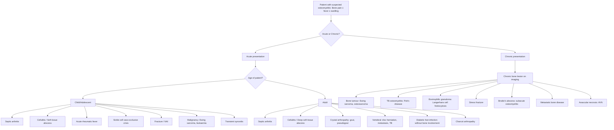

## Differential Diagnosis of Osteomyelitis

The differential diagnosis of osteomyelitis is one of those clinical exercises where context is everything — the age of the patient, the bone involved, the acuity of presentation, and the radiological appearance all dramatically narrow the list. The challenge is that osteomyelitis is a **great mimicker**: acutely it can look like cellulitis, septic arthritis, or even a fracture; chronically it can look like a bone tumour. Let's work through this systematically.

### Guiding Principle: Why is the DDx Difficult?

Osteomyelitis shares features with many conditions because:
1. **Bone pain + fever** = any bone/joint infection, inflammatory arthritis, or malignancy
2. **Radiographic periosteal reaction, osteolysis, and sclerosis** = seen in both infection and tumour
3. ***Chronic osteomyelitis on X-ray can mimic malignancy*** — ***osteosclerotic lesion, wide zone of transition, periosteal reaction*** [2] — these features overlap with aggressive bone tumours (Ewing sarcoma, osteosarcoma)
4. Conversely, some tumours (particularly Ewing sarcoma) present with fever, elevated ESR/CRP, and a destructive bone lesion → initially misdiagnosed as osteomyelitis

<Callout title="The Golden Rule" type="error">
Never assume a destructive bone lesion in a child or young adult is "just osteomyelitis" without considering malignancy. Conversely, never biopsy a suspected tumour through an infected field. If in doubt, **MRI + biopsy** (in a tumour-safe manner) is mandatory. ***DDx of a bone lesion on X-ray includes chronic osteomyelitis and eosinophilic granuloma*** [2].
</Callout>

---

### Systematic Differential Diagnosis Framework

---

### Detailed Differential Diagnosis by Clinical Scenario

#### A. Acute Bone Pain + Fever in a Child

| Differential | Key Distinguishing Features | Why It Mimics Osteomyelitis |
|---|---|---|
| ***Septic arthritis*** | ***Pain with movement, monoarthritis*** [2]; joint effusion; inability to weight-bear; joint aspiration is diagnostic (WCC > 50,000, > 75% PMN, positive Gram stain) [1] | Both cause fever + limb pain + refusal to use limb. Metaphyseal osteomyelitis can co-exist with septic arthritis (especially hip in infants where metaphysis is intracapsular) |
| **Cellulitis / Soft tissue abscess** | Superficial warmth, erythema, swelling; no deep bone tenderness; no periosteal reaction on X-ray; MRI shows soft tissue inflammation without marrow oedema | Overlying soft tissue inflammation in osteomyelitis can look identical clinically |
| **Acute rheumatic fever** | Migratory polyarthritis (not fixed to one bone); history of recent streptococcal pharyngitis; elevated ASO titre; Jones criteria | Both present with fever + joint/bone pain in children |
| **Sickle cell vaso-occlusive crisis** | Known sickle cell disease; painful bone crisis can mimic osteomyelitis almost perfectly; may have identical imaging. Distinguish by clinical context, blood cultures, bone marrow aspiration | Bone infarcts in sickle cell can cause fever, bone pain, periosteal reaction. Remember: **Salmonella osteomyelitis is disproportionately common in sickle cell** [2] — so both conditions can co-exist |
| **Fracture / Non-accidental injury (NAI)** | History of trauma (or inconsistent history suggesting NAI); X-ray shows fracture line; no systemic inflammatory response unless secondary infection | Both cause localised bone pain and refusal to weight-bear |
| **Malignancy (Ewing sarcoma, leukaemia, neuroblastoma metastasis)** | Ewing sarcoma: ***onion-skin periosteal reaction (lamellated)*** [2], diaphyseal, age 5–25; leukaemia: pancytopenia, blast cells on film; neuroblastoma met: age < 5, adrenal mass | Ewing sarcoma classically presents with fever + bone pain + elevated ESR/WCC + aggressive periosteal reaction → can be indistinguishable from osteomyelitis clinically and radiologically |
| **Transient synovitis** | Commonest cause of acute hip pain in children (age 3–10); low-grade or no fever; near-normal bloods; joint effusion but non-toxic; resolves spontaneously | Both cause hip pain and limp; differentiate from septic arthritis using **Kocher criteria** (fever > 38.5°C, non-weight-bearing, ESR > 40, WCC > 12,000) |

<Callout title="Ewing Sarcoma vs Osteomyelitis — Exam Favourite" type="error">
Both can present in a young patient with bone pain, fever, elevated ESR and WCC, and an aggressive-looking bone lesion with periosteal reaction. ***Lamellated (onion skin) periosteal reaction*** is seen in both! ***Spiculated (sunburst) periosteal reaction and Codman's triangle*** suggest a very aggressive tumour [2]. When in doubt, **biopsy before antibiotics** if tumour is suspected — but **never biopsy through potentially infected tissue** (seeds tumour/infection along the tract).
</Callout>

#### B. Acute Bone/Joint Pain in an Adult

| Differential | Key Distinguishing Features | Why It Mimics Osteomyelitis |
|---|---|---|
| **Septic arthritis** | Acute hot swollen joint; ***joint aspiration: WCC > 50,000, > 75% PMN, positive Gram stain*** [1]; most commonly knee or hip; ***organisms: S. aureus, Neisseria gonorrhoeae (STD)*** [2] | Can co-exist with osteomyelitis; both cause periarticular pain and systemic sepsis |
| **Crystal arthropathy (gout/pseudogout)** | Acute monoarthritis; ***joint aspiration with microscopy to rule out gout*** [2] — negatively birefringent urate crystals (gout) or positively birefringent calcium pyrophosphate (pseudogout); no organisms on culture | Both present as acute hot swollen joint; gout can cause fever and elevated WCC |
| **Cellulitis / Deep soft tissue abscess** | No marrow oedema on MRI; responds to antibiotics without bone debridement; superficial process | Can overlie and be secondary to underlying osteomyelitis |
| **Vertebral osteomyelitis DDx**: ***Disc herniation, metastasis, TB spine*** | Disc herniation: radiculopathy without fever/systemic signs; metastasis: known primary (lung, breast, prostate), lytic/blastic lesions above T5; ***TB spine: insidious, disc space relatively spared, thoracic level*** [2] | All present with back pain; vertebral osteomyelitis is insidious and can mimic all of these |
| **Diabetic foot: soft tissue infection without bone involvement** | Probe-to-bone test negative; MRI shows soft tissue inflammation but no marrow signal changes; no cortical erosion on X-ray | Diabetic foot infections commonly progress to osteomyelitis — the distinction is critical for management (antibiotics alone vs. surgery) |
| ***Charcot arthropathy (neuropathic arthropathy)*** | ***Painless*** foot and ankle deformities with warmth, redness, and oedema; DM neuropathy; ***X-ray: degenerative changes, subluxation*** [3]; joint aspiration to rule out infection | Can look identical to osteomyelitis on MRI (marrow oedema, soft tissue swelling, joint destruction); classically **painless** (vs. osteomyelitis which is painful) — but neuropathic patients may not feel pain from osteomyelitis either |
| ***Avascular necrosis (AVN)*** | ***Insidious onset of hip pain; limited ROM (abduction and internal rotation)***; risk factors: steroid use, alcohol, SLE, ***osteomyelitis itself*** [4]; MRI: ***double line sign*** on T2W [4] | Both cause bone pain with limited ROM; AVN can be a complication of osteomyelitis |

<Callout title="Charcot vs Osteomyelitis in Diabetic Foot — The Classic Dilemma" type="idea">
Both cause a warm, swollen, deformed foot with abnormal MRI signal. Key differentiators: Charcot is classically **painless** (neuropathic) whereas osteomyelitis is painful; Charcot shows **joint destruction and subluxation without cortical erosion or sinus tract**; osteomyelitis shows **cortical destruction, marrow oedema crossing the cortex, and often a sinus tract**. **Probe-to-bone test** (if a sterile metal probe can touch bone through a diabetic foot ulcer) has ~90% positive predictive value for osteomyelitis. When in doubt, **bone biopsy with culture** is the gold standard.
</Callout>

#### C. Chronic Bone Lesion on Imaging

This is where the overlap with malignancy is most problematic. ***Chronic osteomyelitis on X-ray can mimic cancer*** [2]:

| Feature | Chronic Osteomyelitis | Bone Malignancy |
|---|---|---|
| ***Osteosclerosis*** | Present (involucrum, reactive bone) | Present (osteosarcoma: cloud-like osteoid matrix; osteoblastic metastases) |
| ***Wide zone of transition*** | Can be present | Hallmark of aggressive lesion |
| ***Periosteal reaction*** | Solid or lamellated (onion skin) | ***Lamellated (Ewing), spiculated/sunburst (osteosarcoma), Codman's triangle (very aggressive)*** [2] |
| Cortical destruction | Present in advanced cases | Present |
| Soft tissue mass | Abscess / sinus tract | Tumour mass |
| Sequestrum | **Pathognomonic of osteomyelitis** — dead bone within a cavity | Absent (bone fragments in tumour are tumour matrix, not sequestra) |
| Clinical context | History of previous infection/surgery/trauma; draining sinus | Night pain, weight loss, no infective history |

| Chronic Bone Lesion DDx | Key Distinguishing Feature |
|---|---|
| **Ewing sarcoma** | Age 5–25; diaphyseal; ***onion skin periosteal reaction***; systemic symptoms; biopsy: small round blue cells |
| **Osteosarcoma** | Age 10–25; metaphyseal (around the knee); ***sunburst periosteal reaction, Codman's triangle***; elevated ALP; biopsy: malignant osteoid |
| ***Eosinophilic granuloma (Langerhans cell histiocytosis)*** [2] | Children/young adults; well-defined lytic "punched out" lesion; skull, femur, pelvis; can have periosteal reaction; biopsy: Birbeck granules, CD1a+ cells |
| **Metastatic bone disease** | Age > 40; multiple lesions; known primary (lung, breast, prostate, renal, thyroid); lytic or blastic; above T5 is suspicious |
| **Bone lymphoma** | Permeative destruction; can present with soft tissue mass; older adults; biopsy diagnostic |
| **Stress fracture** | History of repetitive activity; localised tenderness; X-ray may show periosteal reaction or fracture line; MRI: marrow oedema along fracture plane without abscess |
| ***Brodie's abscess (subacute osteomyelitis)*** | Well-defined lytic lesion with sclerotic rim in the metaphysis; mild inflammatory markers; must distinguish from osteoid osteoma (which also has a lucent nidus with sclerotic rim but has classic nocturnal pain relieved by NSAIDs) |

#### D. Vertebral Osteomyelitis — Specific DDx

***The differential diagnosis of back pain*** includes [5]:

| Category | Examples |
|---|---|
| ***Mechanical (97%)*** | ***Back sprain ( > 70%), lumbar disc degeneration, lumbar disc herniation, spondylolisthesis, fracture (vertebral body, spondylolysis)*** |
| ***Non-mechanical (3%)*** | ***Neoplasia, inflammatory arthritis (AS/spondyloarthropathy), infection (osteomyelitis, TB spine, epidural abscess)*** |
| ***Non-spinal diseases*** | ***Pelvic inflammatory disease, endometriosis, nephrolithiasis, pyelonephritis, aortic aneurysm*** |

Key points for vertebral osteomyelitis DDx [6]:
- **Spinal metastasis**: often above T5 (vs. pyogenic osteomyelitis more common in lumbar); multiple levels; known primary cancer; **does not typically cross the disc space** early (unlike pyogenic infection which destroys the disc early)
- ***TB spine (Pott's disease)***: ***insidious, disc space relatively spared, thoracic level, cold abscess tracking along psoas*** [2]
- **Epidural abscess**: severe back pain + fever + rapidly progressive neurological deficit → surgical emergency
- **Degenerative disc disease (Modic changes on MRI)**: Modic type 1 changes (marrow oedema adjacent to endplates) can look very similar to discitis/osteomyelitis on MRI; however, no fever, no elevated inflammatory markers, no enhancement pattern typical of infection

<Callout title="Red Flags for Spinal Infection" type="idea">
In the context of back pain, ***red flags for infection*** include [6]: ***fever, immunosuppression*** (DM, steroid use, HIV), recent bacteraemia, IV drug use, recent spinal procedure, and progressive neurological deficit. These should trigger urgent MRI and blood cultures.
</Callout>

---

### Summary Table: Key Differentiating Features

| Feature | Osteomyelitis | Septic Arthritis | Bone Tumour | Cellulitis | Charcot |
|---|---|---|---|---|---|
| **Site of max tenderness** | Over bone (metaphysis/diaphysis) | Over joint line | Over bone | Diffuse soft tissue | Over joint/midfoot |
| **ROM** | Limited by pain | Markedly limited in all directions | May be preserved early | Preserved | Preserved (painless) |
| **Fever** | Usually present (acute) | Usually present | Variable (Ewing: yes) | Usually present | Usually absent |
| **X-ray (acute)** | Normal for 10–14 days | Joint effusion, periarticular osteopenia | Lytic/blastic lesion, periosteal reaction | Normal or soft tissue swelling | Degenerative changes |
| **MRI** | Marrow oedema, periosteal enhancement, ± abscess | Joint effusion, synovial enhancement | Marrow-replacing mass, soft tissue component | Soft tissue oedema only | Marrow oedema, joint destruction, subluxation |
| **Blood cultures** | Positive in ~50% [2] | Positive in ~50% | Negative | Usually negative | Negative |
| **Joint aspiration** | N/A (unless co-existent septic arthritis) | ***WCC > 50,000, > 75% PMN, + Gram stain*** [1] | N/A | N/A | Non-inflammatory fluid; rule out infection |
| **Key distinguishing test** | MRI + bone biopsy with culture | Joint aspiration | Biopsy (image-guided) | Clinical diagnosis | Probe-to-bone test negative; aspiration sterile |

---

### Age-Based Differential for Bone Pain (Paediatric Focus) [7]

This is a frequently tested framework:

| Age | Key Differentials |
|---|---|
| **< 4 years** | Transient synovitis, ***osteomyelitis, septic arthritis***, NAI |
| **4–10 years** | Transient synovitis, ***Perthes disease***, ***osteomyelitis/septic arthritis*** |
| **10–16 years** | ***SCFE***, avulsion fracture, ***osteomyelitis/septic arthritis***, ***malignancy (osteosarcoma, Ewing's)*** |

> Why does Perthes disease mimic osteomyelitis? Both cause hip pain and limited ROM (especially internal rotation and abduction) in a child. Perthes is **avascular necrosis** of the proximal femoral epiphysis — X-ray shows flattening, sclerosis, fragmentation of the femoral head rather than metaphyseal destruction. No fever or elevated inflammatory markers in Perthes.

---

<Callout title="High Yield Summary – Differential Diagnosis of Osteomyelitis">

1. **Acute in children**: Septic arthritis (co-exists!), cellulitis, Ewing sarcoma (the great mimicker — both cause fever, bone pain, elevated ESR, aggressive periosteal reaction), transient synovitis, sickle cell crisis, fracture/NAI

2. **Acute in adults**: Septic arthritis, crystal arthropathy (gout — always aspirate joint), cellulitis, vertebral: metastasis/TB/disc herniation

3. **Chronic bone lesion**: ***Chronic osteomyelitis can mimic cancer on X-ray*** [2] — osteosclerosis, wide zone of transition, periosteal reaction. DDx: Ewing sarcoma, osteosarcoma, eosinophilic granuloma, metastasis, bone lymphoma. **Sequestrum is pathognomonic of chronic osteomyelitis** (not seen in tumours)

4. **Vertebral**: ***Pyogenic vs TB spine*** [2] — Pyogenic = acute, disc narrowing, lumbar; TB = insidious, disc spared, thoracic. Also DDx metastasis (above T5, no disc involvement), degenerative Modic changes

5. **Diabetic foot**: Osteomyelitis vs Charcot arthropathy — Charcot is painless, no cortical erosion, no sinus. Probe-to-bone test + bone biopsy with culture differentiates

6. ***Eosinophilic granuloma*** [2] is a frequently forgotten DDx of a lytic bone lesion with periosteal reaction in children
</Callout>

---

<ActiveRecallQuiz
  title="Active Recall - Differential Diagnosis of Osteomyelitis"
  items={[
    {
      question: "Name three conditions that can mimic osteomyelitis on X-ray in a child with bone pain, fever, and periosteal reaction.",
      markscheme: "1. Ewing sarcoma (onion skin periosteal reaction, small round blue cells on biopsy). 2. Acute leukaemia (pancytopenia, blast cells). 3. Eosinophilic granuloma / Langerhans cell histiocytosis (punched-out lytic lesion, Birbeck granules). Also acceptable: stress fracture, sickle cell crisis with bone infarct."
    },
    {
      question: "How do you differentiate septic arthritis from osteomyelitis clinically and with investigations?",
      markscheme: "Septic arthritis: pain with any ROM of joint, joint effusion, joint aspiration shows WCC > 50,000 with > 75% PMN and positive Gram stain. Osteomyelitis: tenderness over the bone (not joint line), limited ROM due to periosteal pain, MRI shows marrow oedema and periosteal reaction. They can co-exist, especially in infants (transphyseal vessels) and where metaphysis is intracapsular (hip)."
    },
    {
      question: "What radiographic finding is pathognomonic of chronic osteomyelitis and distinguishes it from bone tumour?",
      markscheme: "Sequestrum — a segment of dead bone within a cavity, surrounded by involucrum (new bone). Tumours do not produce sequestra. However, periosteal reaction, sclerosis, and wide zone of transition can be seen in both."
    },
    {
      question: "In the differential diagnosis of a warm, swollen, deformed diabetic foot, how do you distinguish Charcot arthropathy from osteomyelitis?",
      markscheme: "Charcot is classically painless (neuropathic), shows joint destruction and subluxation without cortical erosion or sinus tract, and joint aspiration is sterile. Osteomyelitis is painful, shows cortical destruction with marrow oedema crossing the cortex, may have sinus tract, and probe-to-bone test is positive. Bone biopsy with culture is the gold standard when in doubt."
    },
    {
      question: "A 12-year-old presents with hip pain and limp. Name the differential diagnoses stratified by age group for paediatric hip pain.",
      markscheme: "Age < 4: transient synovitis, osteomyelitis/septic arthritis, NAI. Age 4-10: transient synovitis, Perthes disease, osteomyelitis/septic arthritis. Age 10-16: SCFE, avulsion fracture, osteomyelitis/septic arthritis, malignancy (osteosarcoma, Ewing sarcoma)."
    }
  ]}
/>

## References

[1] Lecture slides: GC 237. Musculoskeletal infection [Updated in 2025] (1).pdf (pp. 3, 19, 21, 41)
[2] Senior notes: maxim.md (sections 566, 567, 572)
[3] Senior notes: maxim.md (section 550)
[4] Senior notes: maxim.md (section 522)
[5] Lecture slides: GC 226. Lumbar Spine Pathology_Part E (2).pdf (p. 2)
[6] Senior notes: maxim.md (section 464)
[7] Senior notes: maxim.md (sections 583, 584)
