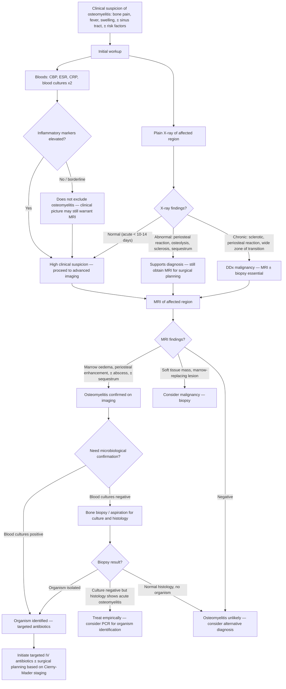

## Diagnostic Criteria, Algorithm, and Investigation Modalities for Osteomyelitis

### Key Principle: There is No Single "Diagnostic Criterion" for Osteomyelitis

Unlike some conditions (e.g., rheumatic fever with Jones criteria, or septic arthritis with Kocher criteria), osteomyelitis does **not** have a universally agreed-upon set of formal diagnostic criteria with a scoring system. Instead, the diagnosis is made by integrating **clinical suspicion + laboratory markers + imaging + microbiology**. The gold standard for definitive diagnosis is **bone biopsy with culture and histopathology** — this confirms the organism AND the histological presence of infection in bone.

That said, there are well-established diagnostic pillars that, when present in combination, make the diagnosis:

<Callout title="Diagnostic Pillars of Osteomyelitis">

1. **Clinical features**: Localised bone pain, tenderness, warmth, swelling ± fever ± draining sinus tract
2. **Elevated inflammatory markers**: ***CBP, ESR, CRP*** [1][8]
3. **Imaging evidence**: ***X-ray*** (may be normal acutely); ***MRI*** (best for diagnosis — marrow oedema, periosteal reaction, abscess) [2][8]
4. **Microbiological confirmation**: ***Blood cultures (positive in ~50%)*** [2]; bone aspirate/biopsy culture (gold standard)
5. **Histopathology**: Acute inflammatory infiltrate (neutrophils) in bone tissue with necrosis = definitive confirmation
</Callout>

---

### Diagnostic Algorithm

The approach varies depending on the clinical scenario — acute vs. chronic, and the body region involved. Here is a comprehensive algorithm:

<Callout title="Key Points from the Algorithm">

- ***X-ray is always the first imaging*** — it's quick, cheap, and can rule out fractures, show chronic changes, or reveal an alternative diagnosis. But it is **insensitive in the first 10–14 days** of acute osteomyelitis [2]
- ***MRI is the best investigation for diagnosis*** [2] — obtain it whenever clinical suspicion is high, regardless of X-ray findings
- ***Blood cultures are positive in only ~50% of cases*** [2] — a negative blood culture does NOT exclude osteomyelitis
- When blood cultures are negative and you need a definitive organism, **bone biopsy with culture** is the gold standard
- ***Monitor clinical signs such as pain, swelling, range of motion*** and ***biochemical markers including ESR, CRP*** to assess treatment response [1]
</Callout>

---

### Investigation Modalities — Detailed Breakdown

#### 1. Laboratory Investigations

| Investigation | Key Findings | Interpretation & Pathophysiological Basis |
|---|---|---|
| ***CBP (Complete Blood Picture)*** [1][8] | Leukocytosis with neutrophilia (acute); may be normal in chronic or subacute | Acute bacterial infection triggers bone marrow release of neutrophils via G-CSF and IL-6. In chronic osteomyelitis, the WCC may normalise as the infection becomes walled off. **A normal WCC does NOT exclude osteomyelitis** |
| ***ESR (Erythrocyte Sedimentation Rate)*** [1][8][9] | Typically elevated ( > 40 mm/hr in acute); slow to rise, slow to fall | ***ESR reflects high blood fibrinogen which causes RBC to stick to each other*** [9] → rouleaux formation → faster sedimentation. Useful for **monitoring treatment response** because it falls slowly over weeks (half-life ~1 week). If ESR fails to trend down after 2 weeks of treatment → suspect treatment failure or undrained abscess |
| ***CRP (C-Reactive Protein)*** [1][8][9] | Elevated; rises within ***6–8 hours after onset of infection*** [9]; peaks at 48 hours | Synthesised by hepatocytes in response to IL-6. More sensitive and specific than ESR for acute infection. Falls rapidly with effective treatment (half-life ~19 hours) → **best marker for early treatment response**. If CRP initially falls then rises again → suspect complication (abscess, secondary infection, drug fever) |
| ***Blood cultures (x2 sets)*** [2][8] | ***Positive in ~50% of haematogenous osteomyelitis*** [2] | Must be drawn **before** starting antibiotics. Two sets from different venipuncture sites to increase yield and distinguish true bacteraemia from contamination. Positive blood culture + compatible clinical picture = diagnosis without need for bone biopsy |
| **Procalcitonin (PCT)** | Elevated in bacterial infection; > 0.5 ng/mL suggests bacterial aetiology | More specific for bacterial infection than CRP (not elevated by viral infection or autoimmune flares). Useful in differentiating osteomyelitis from crystal arthropathy or inflammatory conditions. Not routinely used in all centres |
| ***Alkaline Phosphatase (ALP)*** [9] | May be elevated | Reflects osteoblastic activity — new bone formation (involucrum) in osteomyelitis raises ALP. Also elevated in bone tumours, Paget's disease, healing fractures |
| ***Globulin level*** [9] | May be elevated in chronic infection | Chronic antigenic stimulation → polyclonal hypergammaglobulinaemia |
| ***Serum protein electrophoresis*** [9] | Polyclonal gammopathy in chronic osteomyelitis | Helps distinguish from myeloma (monoclonal spike) which can also cause bone destruction |
| ***CaPO₄*** [9] | Usually normal in osteomyelitis | Helps exclude metabolic bone disease and hyperparathyroidism |

<Callout title="CRP vs ESR — Know the Difference for Monitoring" type="idea">

- **CRP**: Rises fast (6–8 hours), falls fast (half-life 19 hours) → best for **early detection** and **early monitoring** of treatment response
- **ESR**: Rises slowly, falls slowly (half-life ~1 week) → best for **long-term monitoring** and **detecting relapse**
- In clinical practice, both are measured at baseline and serially during treatment. ***Monitor biochemical markers including ESR, CRP*** [1]
</Callout>

#### 2. Imaging Investigations

##### 2a. Plain Radiograph (X-ray)

***X-ray is always the first-line imaging investigation*** — every patient with suspected bone infection gets an X-ray [2][8][9].

| Timing | X-ray Findings | Explanation |
|---|---|---|
| **Acute ( < 10–14 days)** | ***Normal*** [2] — may show only soft tissue swelling | At least **30–50% of bone mineral must be lost** before lytic changes are visible on X-ray. In the first 1–2 weeks, the infection is confined to the medullary canal and has not yet caused enough bone destruction to be radiographically apparent |
| **After 10–14 days** | Periosteal reaction (earliest bony sign); metaphyseal osteopenia/lucency | Subperiosteal pus lifts the periosteum → new bone forms along the elevated periosteum = periosteal reaction. Inflammatory osteolysis becomes visible |
| **Subacute** | Well-defined lucent lesion with sclerotic rim (**Brodie's abscess**) | Walled-off intraosseous abscess — the sclerotic rim is reactive bone attempting to contain the infection |
| **Chronic** | ***Osteosclerotic lesion, wide zone of transition, periosteal reaction*** [2]; sequestrum (dense dead bone within lucent cavity); involucrum (surrounding new bone); cloacae | Sequestrum appears more radio-dense than surrounding bone because it is avascular → no osteoclastic remodelling → retains its original mineral density while surrounding viable bone undergoes resorption and appears less dense |
| **Chronic — DDx malignancy** | ***Mimic CA: osteosclerotic lesion, wide zone of transition, periosteal reaction*** [2] | ***DDx: chronic osteomyelitis, eosinophilic granuloma*** [2]. Must obtain MRI ± biopsy to differentiate |

**Systematic Approach to Describing a Bone Lesion on X-ray** [2]:
1. **Age** of patient
2. **Site** — which bone
3. **Location within bone** — central, eccentric, within cortex, outside cortex; epiphysis, metaphysis, diaphysis
4. **Morphology** — ***well-defined osteolytic (narrow zone of transition)*** vs ***ill-defined osteolytic (wide zone of transition)*** vs ***sclerotic*** [2]
5. **Periosteal reaction** — ***Solid (benign), Lamellated/onion skin (aggressive), Spiculated/sunburst (very aggressive), Codman's triangle (very aggressive)*** [2]
6. **Cortical destruction** — present or absent
7. **Matrix** — ***chondroid (popcorn) or osteoid (cloud-like)*** [2]
8. **Soft tissue component**

> ***For vertebral osteomyelitis on X-ray*** [8]: look for ***soft-tissue swelling or hip joint capsular distension (with widening of the joint space or even subluxation)*** and ***radiographic changes in the proximal femoral metaphysis: osteomyelitis*** [8]. In the spine: endplate irregularity, disc space narrowing (pyogenic) or relative preservation (TB), paravertebral soft tissue shadow widening.

##### 2b. MRI (Magnetic Resonance Imaging)

***MRI is the best investigation for diagnosis of osteomyelitis*** [2] — it has the highest sensitivity (82–100%) and specificity (75–96%) among all imaging modalities.

| MRI Sequence | Findings in Osteomyelitis | Explanation |
|---|---|---|
| **T1-weighted** | **Low signal** (dark) in bone marrow | Normal fatty marrow is bright on T1W. Infection replaces the fatty marrow with inflammatory exudate and oedema → loss of bright fat signal → dark on T1W |
| **T2-weighted / STIR** | **High signal** (bright) in bone marrow and surrounding soft tissues | Oedema and pus have high water content → bright on T2W/STIR (fluid-sensitive sequences) |
| **T1 with Gadolinium (post-contrast)** | **Enhancement** of bone marrow, periosteum, and surrounding soft tissues; **rim-enhancing collections** = abscess; **non-enhancing area within bone** = sequestrum (avascular → no contrast uptake) | Gadolinium highlights areas of increased vascularity and inflammation. A non-enhancing area surrounded by enhancing tissue is the MRI equivalent of a sequestrum — avascular dead bone cannot take up contrast |
| **Diffusion-weighted imaging (DWI)** | Restricted diffusion in abscess | Pus is viscous → restricts water molecule movement → bright on DWI. Helps distinguish abscess (restricted) from tumour (variable) and oedema (not restricted) |

***MRI is useful to detect any co-existent osteomyelitis*** in the context of septic arthritis [1] and ***may be the most useful test to distinguish proximal femoral osteomyelitis from septic arthritis of the hip*** [8].

<Callout title="Why is MRI Better Than X-ray for Acute Osteomyelitis?">
X-ray detects changes in **bone mineral density**, which requires at least 30–50% mineral loss to be visible — this takes 10–14 days. MRI detects changes in **bone marrow signal** (fat replacement by oedema/pus), which occurs within **24–48 hours** of infection. MRI also shows soft tissue abscesses, subperiosteal collections, joint effusions, and sinus tracts — all crucial for surgical planning.
</Callout>

<Callout title="Caveat: MRI in Diabetic Foot" type="error">
In the diabetic foot, MRI has reduced specificity because **Charcot arthropathy also causes marrow oedema** and soft tissue changes. In this context, specific signs of osteomyelitis on MRI include: cortical destruction with marrow signal change **contiguous with a skin ulcer**, sinus tract extending to bone, and the "ghost sign" (loss of normal marrow signal with enhancement mimicking the shape of the bone). Despite these signs, **bone biopsy remains the gold standard** in the diabetic foot setting.
</Callout>

##### 2c. CT (Computed Tomography)

| Role | Findings | When to Use |
|---|---|---|
| **Cortical bone detail** | Sequestrum, cortical destruction, cloacae — better delineated than on MRI | Chronic osteomyelitis — CT is superior to MRI for detecting sequestra (dense bone is bright on CT, easy to see) |
| **CT-guided biopsy** | Allows percutaneous needle biopsy of bone lesion under CT guidance | When blood cultures are negative and a tissue diagnosis is needed; also used when the DDx includes malignancy |
| **Vertebral involvement** | Endplate destruction, paravertebral abscess | Used alongside MRI in spinal osteomyelitis |

##### 2d. Nuclear Medicine (Bone Scintigraphy)

| Modality | Findings | Utility |
|---|---|---|
| **Tc-99m bone scan (triple-phase)** | Increased uptake on all three phases (flow, blood pool, delayed) — indicates active bone infection/inflammation | High sensitivity (~95%) but **low specificity** — also positive in fractures, tumours, Paget's disease, neuropathic joints. Useful when MRI is contraindicated (e.g., pacemaker) or for multifocal disease screening (neonatal osteomyelitis, disseminated infection) |
| **Gallium-67 / Indium-111 labelled WBC scan** | Accumulation of radiolabelled leucocytes at the site of infection | Higher specificity for infection than Tc-99m. Useful in chronic osteomyelitis (where Tc-99m may be positive from remodelling alone) and in distinguishing infection from aseptic loosening of prosthetic joints |
| **FDG-PET/CT** | Increased FDG uptake at site of infection | Excellent sensitivity; increasingly used for chronic and vertebral osteomyelitis; can differentiate active infection from post-surgical changes. **Not first-line** due to cost and availability |

##### 2e. Ultrasound

| Role | Utility |
|---|---|
| **Subperiosteal abscess detection** | In children, ultrasound can detect subperiosteal fluid collections before X-ray changes appear — quick, non-invasive, no radiation |
| **Joint effusion** | If osteomyelitis is near a joint → ultrasound can detect effusion suggesting concurrent septic arthritis |
| **Guided aspiration** | Can guide needle aspiration of subperiosteal or soft tissue abscess for culture |

#### 3. Microbiological Investigations

| Investigation | Method | Key Points |
|---|---|---|
| ***Blood cultures*** | 2 sets from different venipuncture sites, **before antibiotics** | ***Positive in ~50%*** [2] — if positive, may avoid need for bone biopsy. Common contaminants (coagulase-negative staph from single bottle) must be distinguished from true pathogen (positive in both sets) |
| **Bone aspirate / biopsy** | Percutaneous (CT- or fluoroscopy-guided) or open surgical | **Gold standard**. Send for: (1) Gram stain, (2) aerobic and anaerobic bacterial culture, (3) ***AFB smear and culture*** (to rule out TB — especially important in Hong Kong), (4) fungal culture (if immunocompromised), (5) histopathology. Also send for PCR (16S rRNA) if culture-negative is anticipated |
| **Sinus tract culture** | Superficial swab of draining sinus | **Unreliable** — correlates poorly with deep bone organisms (contaminated by skin flora). **Do NOT rely on sinus swab cultures to guide antibiotic therapy**. The one exception: if S. aureus is cultured from a sinus tract, it has ~80% correlation with deep bone culture |
| ***Joint aspiration*** (if co-existent septic arthritis suspected) | ***Gram stain, culture, crystal, glucose*** [1] | Helps differentiate septic arthritis (WCC > 50,000, > 75% PMN, positive Gram stain, low glucose) from gout/pseudogout (crystals present). ***MRI useful to detect any co-existent osteomyelitis*** [1] |
| **Probe-to-bone test** | Sterile metal probe inserted into a diabetic foot ulcer | If the probe can touch bone → positive predictive value ~89% for osteomyelitis. Simple, bedside, no imaging needed. Negative test does not fully exclude osteomyelitis |

<Callout title="Sinus Tract Swab Culture — Common Exam Mistake" type="error">
Students often answer that they would "swab the sinus tract for culture." This is **unreliable** and does not guide treatment. The sinus tract is colonised by skin flora and superficial contaminants that do not represent the deep bone organisms. The exception is S. aureus isolated from a sinus swab, which has reasonable correlation with the true pathogen. **Always aim for deep bone biopsy culture** when possible.
</Callout>

#### 4. Histopathology

| Finding | Significance |
|---|---|
| **Acute osteomyelitis** | Neutrophilic infiltrate within bone marrow spaces, bone necrosis, microabscess formation, vascular congestion |
| **Chronic osteomyelitis** | Lymphocytes, plasma cells, macrophages (chronic inflammatory cells); fibrosis; new bone formation (involucrum); dead bone (sequestrum); granulation tissue |
| **TB osteomyelitis** | Caseating granulomas with Langhans giant cells; AFB may be seen on Ziehl-Neelsen stain |
| **Malignancy (exclusion)** | Absence of malignant cells — biopsy simultaneously rules out the most important DDx |

---

### Special Diagnostic Scenarios

#### Diabetic Foot Osteomyelitis

| Diagnostic Tool | Interpretation |
|---|---|
| **Probe-to-bone test** | Positive if probe touches bone through ulcer (PPV ~89%) |
| **X-ray foot and ankle** [3] | May show cortical erosion, periosteal reaction, or be normal early |
| **MRI foot** | Marrow oedema contiguous with ulcer + cortical disruption = osteomyelitis; distinguish from Charcot (subluxation, no cortical breach from ulcer) |
| **Bone biopsy** | Gold standard — culture + histology; guides antibiotic choice |
| ***Transcutaneous O₂ pressure (TcPO₂)*** [3] | Assesses wound healing potential ( > 30 mmHg = good); ***ABPI not useful in DM due to calcification of vessels*** [3] — this affects the decision of whether the limb can heal after debridement |

#### Vertebral Osteomyelitis

| Diagnostic Tool | Interpretation |
|---|---|
| **MRI spine** (investigation of choice) | T1 low signal in vertebral body + T2 high signal + disc enhancement + paravertebral soft tissue enhancement; **disc involvement** = pyogenic (infected disc); **disc sparing** = TB |
| **Blood cultures** | Positive in 30–60% — adequate to guide therapy if positive |
| **CT-guided vertebral biopsy** | If blood cultures negative — aspirate disc and adjacent vertebral body for culture + histology |
| **Neurological assessment** | Urgent if suspected epidural abscess (back pain + fever + progressive neurological deficit) → emergency MRI → surgical decompression if needed |

#### Implant-Related / Post-Traumatic Osteomyelitis

***The lecture slide (p12) shows a classic case:*** ***35-year-old diabetic, 3 months prior had had nailing for closed midshaft tibial fracture, now presents with persistent drainage*** [1]. This is implant-related osteomyelitis.

| Diagnostic Tool | Interpretation |
|---|---|
| **X-ray** | Periosteal reaction around implant, lucency at bone-implant interface (loosening), progressive osteolysis |
| **CT** | Better shows cortical integrity, sequestrum around the implant, sinus tract |
| **MRI** | Limited by metal artefact from implant — use metal artefact reduction sequences (MARS/SEMAC/MAVRIC); still useful for soft tissue abscess |
| **Intraoperative deep tissue cultures** | Gold standard — multiple deep samples (≥ 3–5) taken at surgery; avoid touching skin/sinus tract; culture for aerobic, anaerobic, AFB, fungi |
| **Sonication of removed implant** | Implant placed in sterile container with saline → sonicated to dislodge biofilm → sonication fluid cultured. Increases sensitivity significantly (up to 20% higher than standard tissue culture) for biofilm-embedded organisms |

---

### Monitoring Treatment Response [1]

***Clinical signs such as pain, swelling, range of motion*** and ***biochemical markers including ESR, CRP*** are used to monitor treatment response [1]:

| Parameter | Expected Trend with Successful Treatment | Concern if |
|---|---|---|
| **CRP** | Should fall within 48–72 hours of starting effective antibiotics; normalises within 1–2 weeks | Fails to fall or rises again → abscess not drained, wrong antibiotic, drug fever, or new complication |
| **ESR** | Falls slowly over weeks; may take 3–6 weeks to normalise | Persistently elevated → ongoing infection; useful for detecting late relapse |
| **Clinical** | Pain decreases, swelling subsides, ROM improves, fever resolves | Persistent pain/fever after 48–72 hours → ***failed medical treatment → consider surgery*** [1] |
| **Imaging (repeat MRI)** | Not routinely repeated unless clinical deterioration; MRI changes lag behind clinical improvement | New abscess on imaging or enlarging collection → surgical intervention needed |

> ***Change to oral form if showing improvement. Total 6–8 weeks, depends on clinical condition*** [1]. The decision to switch from IV to oral antibiotics is guided by clinical improvement + falling CRP.

---

<Callout title="High Yield Summary – Diagnosis of Osteomyelitis">

**No single diagnostic criterion** — diagnosis integrates clinical suspicion + labs + imaging + microbiology

**First-line labs**: ***CBP, ESR, CRP*** [1][8][9]; ***blood cultures x2 (positive in ~50%)*** [2]

**First-line imaging**: ***X-ray*** — always first; **normal in acute ( < 10–14 days)** [2]; chronic: osteosclerosis, sequestrum, involucrum, periosteal reaction → ***can mimic malignancy*** [2]

**Best imaging**: ***MRI*** — gold standard imaging; detects marrow oedema within 24–48 hours; shows abscess, soft tissue extension, sinus tracts [2][8]

**Gold standard for definitive diagnosis**: **Bone biopsy with culture + histopathology** — especially when blood cultures are negative

**Sinus tract swab culture is unreliable** — do NOT use to guide antibiotic therapy (except S. aureus)

**Probe-to-bone test** in diabetic foot: positive PPV ~89%

**Monitoring**: ***ESR, CRP, clinical signs (pain, swelling, ROM)*** [1]; CRP for early response, ESR for long-term monitoring

**Systematic X-ray description** [2]: Age, site, location within bone, morphology (zone of transition), periosteal reaction type, cortical destruction, matrix, soft tissue extension

***ESR mechanism: high fibrinogen causes RBC to stick → rouleaux → faster sedimentation*** [9]

***CRP rises within 6–8 hours of infection onset*** [9]
</Callout>

---

<ActiveRecallQuiz
  title="Active Recall - Diagnosis of Osteomyelitis"
  items={[
    {
      question: "Why is X-ray often normal in acute osteomyelitis, and what percentage of bone mineral must be lost before lytic changes are visible?",
      markscheme: "X-ray detects changes in bone mineral density. At least 30-50% of bone mineral must be lost before lytic changes appear, which takes 10-14 days. MRI detects marrow signal changes within 24-48 hours and is therefore the superior modality in the acute setting."
    },
    {
      question: "List the systematic approach to describing a bone lesion on X-ray.",
      markscheme: "Age, site (which bone), location within bone (central/eccentric/cortical/extracortical; epiphysis/metaphysis/diaphysis), morphology (well-defined osteolytic with narrow zone of transition vs ill-defined osteolytic with wide zone of transition vs sclerotic), periosteal reaction (solid/lamellated/spiculated/Codman's triangle), cortical destruction, matrix (chondroid popcorn or osteoid cloud-like), soft tissue component."
    },
    {
      question: "Compare CRP and ESR in terms of onset, half-life, and clinical utility in monitoring osteomyelitis treatment.",
      markscheme: "CRP: rises within 6-8 hours of infection, half-life 19 hours, best for early detection and early monitoring of treatment response. ESR: rises slowly (mechanism - high fibrinogen causes RBC rouleaux and faster sedimentation), half-life about 1 week, best for long-term monitoring and detecting late relapse."
    },
    {
      question: "What is the gold standard investigation for definitive diagnosis of osteomyelitis, and what specimens should be sent?",
      markscheme: "Bone biopsy with culture and histopathology is the gold standard. Specimens sent for: Gram stain, aerobic and anaerobic bacterial culture, AFB smear and culture (especially in Hong Kong to rule out TB), fungal culture if immunocompromised, histopathology, and PCR (16S rRNA) if culture-negative anticipated."
    },
    {
      question: "Why is sinus tract swab culture unreliable, and what is the one exception?",
      markscheme: "Sinus tract is colonised by skin flora and superficial contaminants that do not represent deep bone organisms, so cultures correlate poorly with the true pathogen. The exception is S. aureus: if isolated from a sinus swab, it has approximately 80% correlation with deep bone culture."
    },
    {
      question: "On MRI, how do you identify a sequestrum and why does it appear that way?",
      markscheme: "Sequestrum appears as a non-enhancing area on post-gadolinium T1-weighted images, surrounded by enhancing inflamed tissue. This is because the sequestrum is avascular dead bone — it has no blood supply, so gadolinium contrast cannot reach it. On T1W it is low signal; on T2W it may be low signal (dense bone) surrounded by high-signal oedema."
    }
  ]}
/>

## References

[1] Lecture slides: GC 237. Musculoskeletal infection [Updated in 2025] (1).pdf (pp. 7, 12, 14, 15, 19)
[2] Senior notes: maxim.md (sections 566, 567, 572)
[3] Senior notes: maxim.md (section 550)
[8] Lecture slides: GC 229. Hip Arthritis (1).pdf (pp. 15, 51, 53)
[9] Lecture slides: GC 226. Lumbar Spine Pathology_Part C (2).pdf (p. 2)
