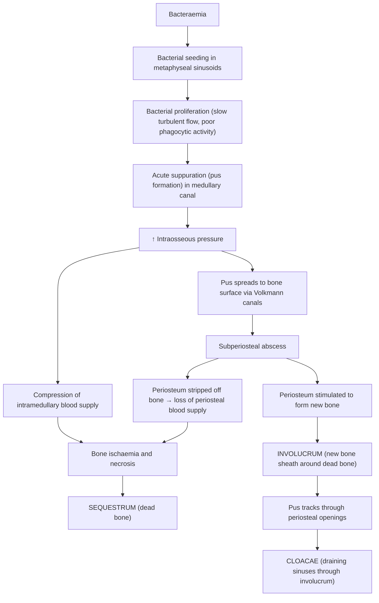

# Osteomyelitis

## 1. Definition

***Osteomyelitis*** is an **infection of bone caused by bacteria** [1]. The name itself tells you exactly what it is: "osteo" = bone, "myel" = marrow, "itis" = inflammation. So it is fundamentally an **inflammatory process of bone and marrow**, almost always driven by microbial infection.

It can affect any bone in the body, can occur at any age, and ranges from a rapidly fulminant acute illness to a smouldering chronic condition that persists for years with intermittent flare-ups. The critical concept is that bone, once infected, is notoriously difficult to sterilise because of its rigid structure (limited ability to swell and recruit immune cells), relatively poor blood supply in certain regions, and the propensity for dead bone to harbour organisms beyond the reach of antibiotics and host defences.

<Callout title="Why is bone infection so hard to treat?">
Bone is a rigid, semi-closed compartment. When pus forms inside the medullary canal, intraosseous pressure rises sharply, compressing the blood supply from within. Meanwhile, the periosteum can be stripped off from outside, cutting off the periosteal blood supply. Dead bone (sequestrum) acts as a foreign body — avascular, so antibiotics cannot penetrate it and immune cells cannot reach it. This is why prolonged antibiotics (4–6 weeks) and often surgical debridement are needed.
</Callout>

---

## 2. Epidemiology

### General
- ***Common in paediatric patients*** [1] — haematogenous osteomyelitis peaks in childhood (particularly boys, M:F ≈ 2:1)
- Incidence: approximately 2–13 per 100,000 persons/year in developed countries; higher in low-income settings
- In adults, osteomyelitis is more commonly **secondary to contiguous spread** (e.g., diabetic foot ulcers, post-surgical, open fractures) rather than haematogenous
- Vertebral osteomyelitis is the most common form of haematogenous osteomyelitis in adults (peak age > 50 years)
- In Hong Kong, with an ageing population and rising prevalence of diabetes mellitus, **contiguous osteomyelitis (e.g., diabetic foot osteomyelitis)** and **post-operative/implant-related osteomyelitis** are of particular clinical relevance
- Sickle cell disease is an important risk factor globally (Salmonella osteomyelitis) but is rare in the Chinese population

### Hong Kong-specific Considerations
- High prevalence of DM → diabetic foot infections/osteomyelitis is a major clinical burden
- Tuberculosis (TB) remains relevant — spinal TB (Pott's disease) should always be in the differential, especially in elderly and immigrant populations
- Post-operative osteomyelitis following orthopaedic implant surgery (e.g., open reduction internal fixation of fractures)
- Neonatal osteomyelitis in NICU settings (Group B Streptococcus, E. coli)

---

## 3. Risk Factors

| Category | Specific Risk Factors | Mechanism |
|---|---|---|
| **Age extremes** | Neonates, children, elderly | Children: rich metaphyseal blood flow with slow/turbulent sinusoids → bacterial seeding. Elderly: immunosenescence, comorbidities |
| **Diabetes mellitus** | Peripheral neuropathy + peripheral vascular disease | Neuropathy → unrecognised trauma → ulcer → contiguous spread to bone. PVD → impaired healing and immune response |
| **Immunosuppression** | ***Long-term steroid use***, ***malignancy on treatment***, HIV, biologics [1] | Impaired cell-mediated and humoral immunity |
| **Vascular disease** | PVD, ***cirrhosis***, ***renal disease*** [1] | Poor tissue perfusion → impaired immune cell delivery and antibiotic penetration |
| **IV drug abuse** | ***Drug abuse*** [1] | Repeated bacteraemia with unusual organisms (Pseudomonas, MRSA, Candida); direct inoculation |
| ***Recent bacteraemia*** | Any source: endocarditis, UTI, line sepsis [1] | Haematogenous seeding to bone |
| **Trauma / Surgery** | Open fractures, ORIF, prosthetic joints | Direct inoculation of organisms; implant biofilm formation |
| ***Recent dental procedure*** [1] | Oral flora bacteraemia | Transient bacteraemia → haematogenous seeding (particularly vertebral) |
| **Sickle cell disease** | HbSS | Functional asplenia + bone infarcts → Salmonella and S. aureus osteomyelitis |
| **Contiguous soft tissue infection** | Decubitus ulcers, diabetic foot ulcers | Direct extension of infection to underlying bone |

<Callout title="High Yield – Risk Factors from Lecture Slides" type="idea">
The lecture slides list these risk factors for musculoskeletal infection (under septic arthritis but equally applicable): ***age > 60, recent bacteraemia, diabetes, malignancy on treatment, cirrhosis, renal disease, drug abuse, long-term steroid, recent dental procedure*** [1]. Learn these — they are commonly tested.
</Callout>

---

## 4. Anatomy and Function: Why Certain Sites Are Affected

Understanding **why** osteomyelitis preferentially affects certain anatomical locations requires understanding the bone blood supply at different ages.

### 4.1 Blood Supply of Long Bones

Long bones receive blood from three sources:
1. **Nutrient artery** → enters the diaphysis through the nutrient foramen → divides into ascending and descending branches in the **medullary canal** → supplies the inner 2/3 of cortex and marrow
2. **Metaphyseal arteries** → periosteal vessels that penetrate near the metaphysis
3. **Periosteal arteries** → supply the outer 1/3 of cortex

The critical area is the **metaphysis**:

> ***Terminal branches of metaphyseal arteries form loops at the growth plate and enter irregular afferent venous sinusoids. Blood flow is slowed and turbulent, predisposing to bacterial seeding. In addition, lining cells have little or no phagocytic activity. This area is a "catch basin" for bacteria, and foci of osteomyelitis may form.*** [1]

This is a beautifully elegant explanation of **why the metaphysis is the most common site of haematogenous osteomyelitis in children**: slow, turbulent flow + lack of local phagocytic defence = perfect conditions for bacteria to settle and proliferate.

### 4.2 Age-Dependent Site Predilection

| Age Group | Primary Site | Reason | Clinical Consequence |
|---|---|---|---|
| ***Infants < 1 year*** | ***Epiphysis*** | Transphyseal vessels cross the growth plate in infants → bacteria can reach the epiphysis | ***→ Septic arthritis possible*** (because epiphysis is intra-articular) [2] |
| ***Children (1–16 years)*** | ***Metaphysis*** | Growth plate acts as an avascular barrier — vessels loop and turn back | ***Growth plate inhibits spread of infection*** to epiphysis/joint (except hip, shoulder, elbow where metaphysis is intracapsular) [2] |
| ***Adults*** | ***Vertebrae*** (most common haematogenous site); also diaphysis in contiguous/post-traumatic | Growth plate has closed; vertebral bodies have rich Batson venous plexus blood supply | Vertebral osteomyelitis + discitis |

<Callout title="Why does the hip joint get septic arthritis from metaphyseal osteomyelitis in children?">
Even though the growth plate normally acts as a barrier, the **proximal femoral metaphysis is intracapsular** (i.e., it sits within the hip joint capsule). So if infection develops in the proximal femoral metaphysis and breaks through the cortex, it spills directly into the hip joint → septic arthritis. The same applies to the proximal humerus (shoulder joint) and parts of the elbow. This is a classic exam point.
</Callout>

### 4.3 Volkmann Canals

These are horizontal (transverse/oblique) canals connecting the Haversian canals of the cortex to each other and to the periosteal and endosteal surfaces. They are the route by which infection spreads from the medullary cavity through the cortex to reach the subperiosteal space. Understanding this pathway is key to understanding sequestrum, involucrum, and cloacae formation (see Pathophysiology below).

---

## 5. Aetiology (with Hong Kong Focus)

### 5.1 Routes of Infection

***There are three main routes:*** [2]

| Route | Mechanism | Typical Setting |
|---|---|---|
| ***Haematogenous*** | Bacteria seed bone via the bloodstream from a distant focus | Children (metaphysis), adults (vertebral bodies), IV drug users |
| ***Contiguous spread*** | Infection spreads from adjacent soft tissue or joint to bone | Diabetic foot ulcers, decubitus ulcers, post-surgical wound infections |
| ***Direct inoculation*** | Organisms introduced directly into bone | Open fractures, surgical procedures (ORIF, joint replacement), penetrating trauma |

### 5.2 Causative Organisms

| Organism | Clinical Context | Notes |
|---|---|---|
| ***Staphylococcus aureus*** | **Most common overall** — all ages, all types [2] | Has adhesins (e.g., fibronectin-binding protein, collagen-binding protein) that bind to bone matrix; produces biofilm on implants |
| ***Group A Streptococcus*** (S. pyogenes) | Second most common in children [2] | |
| ***Salmonella spp.*** | ***Sickle cell disease*** [2] | Functional asplenia → encapsulated/enteric organisms; rare in HK |
| **Group B Streptococcus** (S. agalactiae) | Neonates | Vertical transmission |
| **Escherichia coli / Gram-negatives** | Neonates; UTI-related vertebral osteomyelitis in elderly | |
| **Pseudomonas aeruginosa** | IV drug users; puncture wounds through footwear | Classic: nail through shoe → Pseudomonas osteomyelitis of foot |
| **Coagulase-negative Staphylococci** (e.g., S. epidermidis) | Prosthetic joint / implant-related infections | Biofilm formers |
| **MRSA** | Healthcare-associated; IV drug users; community MRSA | Increasingly important — affects antibiotic choice |
| **Mycobacterium tuberculosis** | ***TB spine (Pott's disease)*** — thoracic spine; also peripheral bones | Relevant in Hong Kong — always consider TB in insidious, atypical presentations |
| **Brucella spp.** | Endemic areas (not typical in HK); vertebral involvement | |
| **Fungi** (Candida, Aspergillus) | Severely immunocompromised | |
| **Kingella kingae** | Children < 5 years (increasingly recognised) | Often culture-negative; diagnosed by PCR |

<Callout title="Organism-Age Association – High Yield">

- **Neonates**: Group B Strep, E. coli, S. aureus
- **Children**: S. aureus (most common), Group A Strep, Kingella kingae
- **Adults**: S. aureus; Gram-negatives in vertebral osteomyelitis; coagulase-negative Staph in implant-related
- **Sickle cell**: Salmonella (but S. aureus is still the most common even in sickle cell — Salmonella is just *disproportionately common*)
- **IV drug users**: S. aureus, Pseudomonas, MRSA
- **Diabetic foot**: Polymicrobial (S. aureus, Strep, anaerobes, Gram-negatives)
</Callout>

### 5.3 Pyogenic vs Tuberculous Osteomyelitis (Spine)

This is a classic comparison tested in exams [2]:

| Feature | ***Pyogenic*** | ***TB Spine (Pott's Disease)*** |
|---|---|---|
| ***Clinical onset*** | ***Acute*** | ***Insidious*** |
| ***X-ray disc space*** | ***Disc space narrowing*** (early loss of disc height — bacteria produce proteases that destroy the disc) | ***Disc space relatively spared*** (TB granuloma spreads beneath the anterior longitudinal ligament; disc lacks blood supply so TB does not seed there haematogenously) |
| ***Most common spinal site*** | ***Lumbar*** (anywhere in spine) | ***Thoracic*** (closest to lymph nodes draining lungs via Batson plexus) |
| Paraspinal abscess | Less common | **Cold abscess** — classic; may track along the psoas muscle |
| Vertebral body destruction | Less extensive initially | Can be severe — anterior wedging → **gibbus deformity** (sharp kyphotic angulation) |
| Constitutional symptoms | High fever, rigors | Low-grade fever, night sweats, weight loss |
| Lab findings | High WCC, CRP, ESR | ESR elevated, WCC may be normal, positive tuberculin test/IGRA |

> ***Why is the disc space spared in TB?*** The intervertebral disc is avascular in adults. Pyogenic bacteria reach the disc via the blood supply that anastomoses across the endplate, rapidly destroying the disc. TB, being a granulomatous infection, spreads by subligamentous extension along the anterior longitudinal ligament, "skipping" vertebral levels and sparing the disc until late.

---

## 6. Pathophysiology

This is one of the most elegant pathophysiological sequences in orthopaedics. Understanding it step by step explains every clinical and radiological feature.

### 6.1 Sequence of Events (Haematogenous Osteomyelitis) [1][2]

### 6.2 Key Pathological Terms

| Term | Definition | Pathophysiology | Clinical Significance |
|---|---|---|---|
| ***Sequestrum*** | ***Necrotic bone*** that has separated from living bone [1][2] | Devascularised bone due to ↑ intraosseous pressure + periosteal stripping = no blood supply → bone dies | Acts as a foreign body; harbours bacteria in lacunae; antibiotics cannot penetrate → **must be surgically removed** for cure |
| ***Involucrum*** | ***New bone formation*** surrounding the sequestrum [1][2] | Periosteum is lifted off by pus but remains alive → its inner cambium layer is a potent osteoblastic surface → lays down new bone around the dead bone | Gives structural support; in children (thick periosteum), involucrum can be extensive and maintain limb integrity |
| ***Cloacae*** | ***Periosteal openings/sinuses*** through which pus discharges [1][2] | Pressure from accumulating pus creates perforations through the involucrum → pus tracks to skin surface | Draining sinus tracts on the skin; chronic discharge is pathognomonic of chronic osteomyelitis |

> ***The lecture slide image (p9) beautifully illustrates this sequence:*** *(a) Seeding of infection in metaphyseal vessels → (b) Subperiosteal abscess → (c) Sequestrum formation with involucrum → (d) Cloacae with discharging pus and bone* [1]

### 6.3 Why Children Are Different from Adults

| Feature | Children | Adults |
|---|---|---|
| Periosteum | Thick, loosely adherent → easily lifted by pus → forms robust involucrum; also means subperiosteal abscesses form easily | Thin, tightly adherent → less involucrum, more intramedullary confinement |
| Growth plate | Avascular barrier → prevents spread to epiphysis (usually) | Absent (fused) → infection can spread freely through bone |
| Blood supply | Rich metaphyseal blood supply → high risk of haematogenous seeding | Vertebral bodies have rich blood supply → vertebral osteomyelitis |
| Recovery potential | Excellent — new bone formation is rapid | Slower healing; more likely to progress to chronic osteomyelitis |

### 6.4 Contiguous and Direct Inoculation Osteomyelitis

- **Contiguous**: Infection in adjacent soft tissue (e.g., diabetic foot ulcer, decubitus ulcer) erodes into bone. The bone cortex is initially involved (superficial osteomyelitis) → progresses inward.
- **Direct inoculation**: Organisms are planted directly into bone (open fracture, surgery). Biofilm formation on implants is a key issue — bacteria form a polysaccharide matrix (glycocalyx) on metal/foreign body surfaces that protects them from antibiotics and immune cells → chronic, indolent infection.

<Callout title="Biofilm — Why Implant Infections Are So Difficult to Treat">
Within hours of contamination, bacteria (especially S. aureus and S. epidermidis) adhere to implant surfaces and form a biofilm — a structured community of bacteria encased in an extracellular polysaccharide matrix. Antibiotics penetrate biofilm poorly (up to 1000x higher MIC). Host immune cells cannot phagocytose biofilm-embedded bacteria. This is why **implant-related osteomyelitis often requires removal of the implant** in addition to antibiotics and debridement.
</Callout>

---

## 7. Classification

### 7.1 By Onset (Temporal) [1]

| Classification | Duration | Features |
|---|---|---|
| ***Acute*** | ***< 2 weeks*** | Rapid onset, systemic features (fever, malaise), positive blood cultures more common, X-ray often **normal** |
| ***Subacute*** | ***< 3 months*** | Intermediate; may present as **Brodie's abscess** (a walled-off intraosseous abscess, often in distal tibia metaphysis of children, with sclerotic rim on X-ray) |
| ***Chronic*** | ***> 3 months*** | Sequestrum, involucrum, draining sinuses; systemic features may be absent; X-ray shows sclerosis, periosteal reaction |

### 7.2 By Stage of Infection — ***Cierny-Mader Classification*** [1]

This is the most widely used staging system. It combines **anatomical type** (where in the bone) with **physiological host class** (how well the patient can fight infection). It directly guides management.

#### Anatomical Type

| Stage | Name | Description | Aetiology | Treatment Principles |
|---|---|---|---|---|
| ***Stage I*** | ***Medullary osteomyelitis*** | ***Necrosis limited to medullary contents and endosteal surfaces*** | ***Haematogenous*** | ***Early: Antibiotics/host alteration. Late: Unroofing, intramedullary reaming*** |
| ***Stage II*** | ***Superficial osteomyelitis*** | ***Necrosis limited to exposed bone surfaces*** | ***Contiguous soft tissue infection*** | ***Early: Antibiotics/host alteration. Late: Superficial debridement/coverage. Possible ablation*** |
| ***Stage III*** | ***Localized osteomyelitis*** | ***Well-marginated, stable before and after debridement*** | ***Trauma, evolving stages I and II, iatrogenic*** | ***Antibiotics/host alteration. Debridement, dead space management. Temporary stabilization, bone graft optional*** |
| ***Stage IV*** | ***Diffuse osteomyelitis*** | ***Circumferential and/or permeative. Unstable prior to or after debridement*** | ***Trauma, evolving stages I, II, and III, iatrogenic*** | ***Antibiotics/host alteration. Stabilization – ORIF, external fixation (Ilizarov). Debridement, dead space management. Possible ablation*** |

#### Physiological Host Class

| Class | Description |
|---|---|
| **A** | Normal host — good immune function, no systemic compromise |
| **B** | Compromised host — local (Bl: scarring, lymphoedema, venous stasis, radiation fibrosis) or systemic (Bs: DM, malnutrition, renal failure, immunosuppression, extremes of age) or both (Bls) |
| **C** | Treatment worse than disease — severely compromised; treatment morbidity exceeds disease morbidity; consider suppressive antibiotics only |

<Callout title="Cierny-Mader is High Yield">
This classification is directly from the lecture slides and guides management decisions. A Stage I-A (medullary osteomyelitis in a normal host) may respond to antibiotics alone, while a Stage IV-B (diffuse osteomyelitis in a compromised host) may require extensive surgery, Ilizarov fixation, and even amputation (ablation). The key principle: **treat the bone AND the host**.
</Callout>

### 7.3 By Route of Infection [2]

As discussed in Aetiology:
1. ***Haematogenous***
2. ***Contiguous***
3. ***Direct inoculation***

---

## 8. Clinical Features

The clinical presentation depends on whether the osteomyelitis is **acute, subacute, or chronic**, and on the **route of infection** and **patient age**.

### 8.1 Symptoms

| Symptom | Pathophysiological Basis |
|---|---|
| **Localised bone pain** (most common presenting symptom) | Suppuration within the rigid medullary canal → ↑ intraosseous pressure → stretching of the richly innervated periosteum; inflammatory mediators (PGE2, bradykinin) stimulate nociceptors |
| **Fever, malaise, lethargy** (systemic) | Bacteraemia → cytokine release (IL-1, IL-6, TNF-α) → hypothalamic temperature set-point elevation → fever; systemic inflammatory response |
| **Inability to weight-bear / refusal to use limb** (especially children) | Pain avoidance; in pre-verbal children, this may be the only clue — "pseudoparalysis" |
| **Pain with movement** | Inflammation in adjacent soft tissues and periosteum; if near a joint → may mimic septic arthritis |
| **Chronic: intermittent pain with flare-ups** | Persistent low-grade infection with periodic bacterial proliferation overwhelming local defences |
| **Chronic: discharge from sinus tract** | Pus tracking from cloacae through involucrum and soft tissues to skin surface |

### 8.2 Signs

| Sign | Pathophysiological Basis |
|---|---|
| **Localised warmth, erythema, swelling** (signs of inflammation) [2] | Classic inflammatory response: vasodilation (rubor, calor), increased vascular permeability (tumor); cytokine-mediated |
| ***Limited range of motion (ROM)*** [2] | Periosteal inflammation and oedema → pain with movement; if adjacent to a joint, effusion and capsular distension further limit ROM |
| **Point tenderness over affected bone** | Periosteal stretching and inflammation; the periosteum is the most pain-sensitive structure of bone |
| ***Draining sinus tract*** [2] | Chronic osteomyelitis → cloacae through involucrum → sinus tract to skin; indicates sequestrum presence (pus has nowhere else to go) |
| **Soft tissue fluctuance / abscess** | Subperiosteal or soft tissue abscess formation from pus tracking out of bone |
| **Inability to weight-bear / antalgic gait** | Pain avoidance mechanism; shortened stance phase on affected side |
| **Erythema tracking along limb** (in severe cases) | Lymphangitis from spreading infection |
| **Systemic: tachycardia, hypotension (if septic)** | Sepsis physiology: systemic vasodilation from inflammatory mediators, myocardial depression |

### 8.3 Special Presentations by Age and Type

#### Neonatal Osteomyelitis
- Often presents subtly: **irritability, pseudoparalysis, poor feeding**
- May have minimal fever
- ***Epiphyseal involvement*** (transphyseal vessels present) → can spread to joint → **concurrent septic arthritis** is common
- Multiple bone involvement in up to 40%

#### Paediatric Acute Haematogenous Osteomyelitis
- Classic presentation: **acutely unwell child with localised bone pain, fever, refusal to weight-bear**
- Long bone metaphyses (distal femur, proximal tibia most common — these are the fastest growing metaphyses in the body, hence the richest blood flow and greatest risk of bacterial seeding)
- Important to distinguish from **septic arthritis** (see Kocher criteria in DDx section later)

#### Vertebral Osteomyelitis (Adults)
- **Insidious onset of back pain** — progressively worsening, unrelenting, worse at night
- May have low-grade fever or be afebrile
- Localised tenderness over spinous processes
- Neurological deficits if epidural abscess develops (emergency!)
- Risk factors: ***recent bacteraemia, diabetes, drug abuse, recent dental procedure*** [1]

#### Chronic Osteomyelitis
- ***Draining sinus tract*** is the hallmark
- Intermittent pain, low-grade inflammation
- May flare up with fever and increased drainage
- Long-standing sinuses carry a risk of **squamous cell carcinoma** (Marjolin's ulcer) — rare but important to know
- X-ray: ***sequestrum, involucrum, cloacae, osteosclerosis***

#### Subacute Osteomyelitis (Brodie's Abscess)
- Well-defined intraosseous abscess with sclerotic rim
- Typically in the tibial metaphysis of an older child/adolescent
- Presents with localised pain; often afebrile; ESR mildly elevated
- X-ray: well-circumscribed lucent lesion with surrounding sclerosis
- **Must distinguish from tumour** (e.g., osteoid osteoma, Ewing's sarcoma)

#### Implant-Related / Post-Traumatic Osteomyelitis
- Occurs after ORIF, intramedullary nailing, or prosthetic joint replacement
- May present early (within weeks — acute, virulent organisms like S. aureus) or late (months to years — indolent organisms like coagulase-negative Staphylococci)
- **Wound breakdown, persistent discharge, implant loosening** are key signs
- Biofilm on implant → resistant to antibiotics → often requires implant removal

<Callout title="Exam Pearls – Clinical Features">

- ***X-ray in acute osteomyelitis is often NORMAL*** [2] — radiographic changes take **10–14 days** to appear (at least 30–50% bone mineral loss needed before lytic changes are visible)
- ***MRI is the best imaging modality for diagnosis*** [2] — high sensitivity and specificity, can detect marrow oedema within 24–48 hours
- ***In chronic osteomyelitis, X-ray can mimic malignancy*** [2] — osteosclerotic lesion, wide zone of transition, periosteal reaction → DDx includes chronic osteomyelitis and bone tumour (e.g., Ewing sarcoma, osteosarcoma)
- A ***draining sinus tract*** in the context of bone infection = chronic osteomyelitis with sequestrum until proven otherwise
</Callout>

### 8.4 Complications of Osteomyelitis (as Related to Clinical Features)

These will be covered in detail in the Complications section later, but briefly — the clinical features of complications include:

- **Pathological fracture**: sudden pain and deformity in a chronically infected bone (weakened by osteolysis)
- **Growth disturbance** (children): if infection damages the growth plate → limb length discrepancy, angular deformity
- **Septic arthritis**: especially from metaphyseal infection in intracapsular locations (hip, shoulder)
- **Amyloidosis** (AA type): chronic inflammatory stimulus → serum amyloid A deposition → nephrotic syndrome, hepatosplenomegaly (rare today with modern treatment)
- **Squamous cell carcinoma** (Marjolin's ulcer) in long-standing draining sinus tracts

---

## 9. Summary of Pathogenesis (Lecture Slide Sequence) [1]

To consolidate — the lecture slides show a 4-panel progression:

> ***(a)*** *Seeding of infection in metaphyseal vessels* → ***(b)*** *Subperiosteal abscess formation* → ***(c)*** *Sequestrum (dead necrotic bone) with surrounding involucrum (new bone)* → ***(d)*** *Cloacae: openings through involucrum discharging pus and bone fragments* [1]

This is the **single most important pathophysiological diagram** for osteomyelitis. If you can draw and explain this sequence, you understand the disease.

---

<Callout title="High Yield Summary">

**Definition**: Infection of bone caused by bacteria; "osteo-myel-itis" = bone marrow inflammation [1]

**Classification by onset**: Acute ( < 2 weeks), Subacute ( < 3 months), Chronic ( > 3 months) [1]

**Classification by stage**: ***Cierny-Mader*** — Stages I–IV (medullary → superficial → localized → diffuse) combined with Host class A/B/C [1]

**Routes**: Haematogenous, Contiguous, Direct inoculation [2]

**Most common organism**: S. aureus (all ages); Salmonella in sickle cell; TB in Hong Kong always a differential [2]

**Pathogenesis**: Bacteraemia → metaphyseal sinusoid seeding (slow turbulent flow, no phagocytic activity) → suppuration → ↑ intraosseous pressure → pus exits via Volkmann canals → subperiosteal abscess → **Sequestrum** (dead bone), **Involucrum** (new bone), **Cloacae** (draining sinuses) [1][2]

**Age-Site predilection**: Infants = epiphysis (transphyseal vessels → septic arthritis risk); Children = metaphysis (growth plate barrier); Adults = vertebrae [2]

**Clinical features**: Localised bone pain, fever, limited ROM, draining sinus tract (chronic); X-ray normal in acute, MRI best for diagnosis [2]

**Pyogenic vs TB spine**: Pyogenic = acute, disc space narrowing, lumbar; TB = insidious, disc relatively spared, thoracic [2]

**Key risk factors (from slides)**: Age > 60, recent bacteraemia, diabetes, malignancy on treatment, cirrhosis, renal disease, drug abuse, long-term steroid, recent dental procedure [1]
</Callout>

---

<ActiveRecallQuiz
  title="Active Recall - Osteomyelitis (Definition, Epidemiology, Anatomy, Aetiology, Pathophysiology, Classification, Clinical Features)"
  items={[
    {
      question: "Why does haematogenous osteomyelitis in children preferentially affect the metaphysis?",
      markscheme: "Terminal branches of metaphyseal arteries form loops at the growth plate and enter irregular afferent venous sinusoids where blood flow is slow and turbulent. Lining cells have little or no phagocytic activity. This creates a catch basin for bacteria. The growth plate acts as an avascular barrier preventing further spread to the epiphysis."
    },
    {
      question: "Define sequestrum, involucrum, and cloacae and explain how each forms.",
      markscheme: "Sequestrum: dead necrotic bone formed by devascularisation from raised intraosseous pressure and periosteal stripping. Involucrum: new bone formation from the elevated periosteum (cambium layer remains osteogenic). Cloacae: openings through the involucrum through which pus and bone fragments discharge to the skin surface."
    },
    {
      question: "What are the four anatomical stages of the Cierny-Mader classification?",
      markscheme: "Stage I: Medullary osteomyelitis (necrosis limited to medullary contents, haematogenous). Stage II: Superficial osteomyelitis (necrosis limited to exposed surfaces, contiguous). Stage III: Localized osteomyelitis (well-marginated, stable after debridement). Stage IV: Diffuse osteomyelitis (circumferential/permeative, unstable after debridement)."
    },
    {
      question: "Compare pyogenic vertebral osteomyelitis and TB spine (Pott's disease) in terms of onset, disc space, and most common spinal level.",
      markscheme: "Pyogenic: acute onset, early disc space narrowing (bacterial proteases destroy disc), lumbar spine. TB: insidious onset, disc space relatively spared (subligamentous spread, disc is avascular), thoracic spine."
    },
    {
      question: "Why is X-ray often normal in acute osteomyelitis and what is the best imaging modality?",
      markscheme: "Radiographic changes require at least 30-50% bone mineral loss to be visible, which takes 10-14 days. MRI is the best imaging modality as it can detect bone marrow oedema within 24-48 hours with high sensitivity and specificity."
    },
    {
      question: "In neonatal osteomyelitis, why is concurrent septic arthritis common?",
      markscheme: "In infants under 1 year, transphyseal vessels cross the growth plate, allowing bacteria to reach the epiphysis. Since the epiphysis is intra-articular, infection can spread directly into the joint space causing septic arthritis."
    }
  ]}
/>

## References

[1] Lecture slides: GC 237. Musculoskeletal infection [Updated in 2025] (1).pdf (pp. 2, 3, 7, 8, 9, 10, 14, 17)
[2] Senior notes: maxim.md (sections 566, 567, 572, 583, 454)
