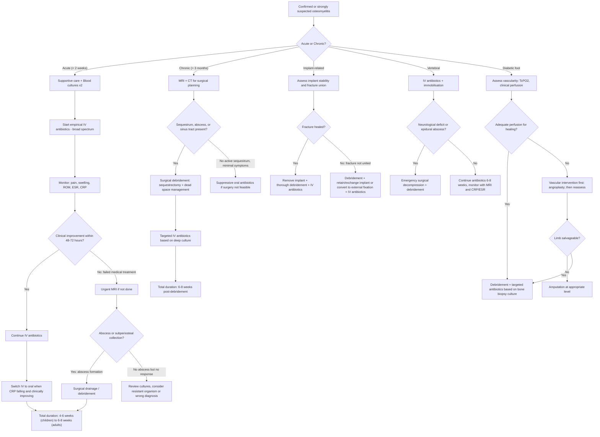

## Management of Osteomyelitis

### Overarching Principles

The management of osteomyelitis rests on two pillars — and you need to understand **why** both are necessary:

1. **Antibiotics** — to kill the bacteria
2. **Surgery** — to remove what antibiotics cannot reach (dead bone, abscesses, biofilm on implants)

Why can't antibiotics alone cure all osteomyelitis? Because:
- **Sequestrum** is avascular dead bone → no blood flow → antibiotics delivered intravenously simply cannot reach bacteria hiding in the lacunae of dead bone
- **Biofilm** on implants creates a polysaccharide shield that requires 100–1000x higher antibiotic concentrations to penetrate
- **Abscesses** are walled-off collections of pus → poor antibiotic penetration through the abscess wall; the acidic, anaerobic environment within also inactivates many antibiotics (e.g., aminoglycosides are less effective at low pH)

Therefore: ***Antibiotics treat the living infected tissue. Surgery removes what is dead.*** Both together are needed for cure in most cases beyond the earliest acute stages.

<Callout title="Key Management Principle from Lecture Slides">
***Acute vs Chronic management differs fundamentally*** [1]:
- ***Acute: Antibiotics – broad spectrum. Surgery only when: failed medical treatment or abscess formation***
- ***Chronic: Debridement if sequestrum present, abscess formation, failed medical treatment + Antibiotic***

In other words: acute osteomyelitis → antibiotics first, surgery if needed. Chronic osteomyelitis → surgery is almost always needed alongside antibiotics.
</Callout>

---

### Management Algorithm

---

### 1. Medical Management — Antibiotics

#### 1a. General Principles

| Principle | Detail | Rationale |
|---|---|---|
| ***Start with IV antibiotics*** [1] | High-dose intravenous route initially | Bone has relatively poor blood supply compared to soft tissues; IV dosing achieves higher peak serum and tissue levels → better bone penetration |
| **Empirical → Targeted** | Start empirical broad-spectrum before culture results; narrow once culture and sensitivity (C/ST) are available | You cannot wait 48–72 hours for culture results while the infection progresses; empirical therapy covers the most likely organisms |
| ***Monitor clinical signs such as pain, swelling, range of motion*** [1] | Serial clinical assessment | Improving pain, reducing swelling, and improving ROM indicate treatment response |
| ***Monitor biochemical markers including ESR, CRP*** [1] | Serial bloods (CRP every 2–3 days initially; ESR weekly) | CRP is the earliest marker to respond to effective treatment (falls within 48–72h). ESR used for long-term monitoring |
| ***Change to oral form if showing improvement*** [1] | Switch from IV to oral (PO) when: (1) clinically improving, (2) CRP trending down, (3) tolerating oral intake, (4) reliable patient | Oral antibiotics with good bioavailability (e.g., fluoroquinolones, rifampicin, linezolid, clindamycin) achieve adequate bone concentrations. IV-to-oral switch reduces hospital stay, cost, and IV line complications (thrombophlebitis, line sepsis) |
| ***Total 6–8 weeks, depends on clinical condition*** [1] | Total duration of antibiotic therapy | Why so long? Bone turns over slowly. Bacteria within the Haversian and Volkmann canal systems require sustained antibiotic levels for weeks to be eradicated. Short courses → high relapse rates |

<Callout title="Duration of Antibiotics — Exam Key Point">
***Total 6–8 weeks, depends on clinical condition*** [1]. The senior notes state ***IV cloxacillin x 4–6 weeks*** [2]. In practice:
- **Acute uncomplicated**: 4–6 weeks total (may switch to oral after 1–2 weeks of IV)
- **Chronic / post-surgical**: 6–8 weeks post-debridement (longer if residual infected bone)
- **Vertebral osteomyelitis**: 6–8 weeks (IDSA guidelines support 6 weeks minimum)
- **Children**: often shorter total duration (3–4 weeks) with early switch to oral (after 3–5 days IV) if clinically improving and organism is sensitive — paediatric bone heals faster and children respond better
</Callout>

#### 1b. Empirical Antibiotic Choices

| Clinical Scenario | Most Likely Organism | Empirical Antibiotic | Rationale |
|---|---|---|---|
| **Acute haematogenous (child or adult)** | S. aureus, Group A Strep | ***IV cloxacillin*** [2] (or flucloxacillin/nafcillin) = anti-staphylococcal penicillin | "Clox" = cloxacillin; the "cl" reminds you it is **resistant to beta-lactamase** produced by S. aureus (unlike plain penicillin). First-line for MSSA osteomyelitis |
| ***Empirical covering Staphylococcus and Streptococcus species*** [1] | S. aureus, Streptococcus spp. | IV cloxacillin or 1st generation cephalosporin (cefazolin) | Both cover MSSA and Strep effectively; cefazolin has excellent bone penetration |
| **Suspected MRSA** | MRSA | IV vancomycin (or teicoplanin) | Vancomycin is the standard anti-MRSA agent; requires therapeutic drug monitoring (trough levels 15–20 mg/L for serious infections) |
| ***Immunocompromised patients: should cover gram-negative rods and anaerobes*** [1] | Polymicrobial including Gram-negatives, anaerobes | Add IV ceftriaxone or piperacillin-tazobactam or carbapenem (meropenem) to anti-staphylococcal cover | Immunocompromised patients have broader range of potential organisms; empirical cover must be wider |
| **Sickle cell disease** | Salmonella, S. aureus | IV ceftriaxone (covers Salmonella and S. aureus) + cloxacillin | Salmonella is disproportionately common but S. aureus is still the most frequent overall |
| **Post-traumatic / open fracture** | S. aureus, Gram-negatives, anaerobes (if soil contamination) | 1st gen cephalosporin ± aminoglycoside ± metronidazole (depending on Gustilo-Anderson grade) [10] | Grade I: 1st gen cephalosporin; Grade II: add aminoglycoside; Grade III: add metronidazole for anaerobes if farm/soil contamination |
| **Prosthetic joint / implant-related** | S. aureus, coagulase-negative Staph (biofilm), Gram-negatives | IV vancomycin + ceftriaxone (or meropenem) empirically; narrow based on deep cultures | Must cover both MRSA and Gram-negatives empirically until cultures guide therapy |
| **Diabetic foot osteomyelitis** | Polymicrobial: S. aureus, Strep, enterococci, Gram-negatives, anaerobes | Broad-spectrum: IV piperacillin-tazobactam or amoxicillin-clavulanate + vancomycin (if MRSA risk) | Diabetic foot infections are almost always polymicrobial; bone biopsy culture is the gold standard to guide therapy |
| **TB osteomyelitis** | Mycobacterium tuberculosis | Standard anti-TB quadruple therapy: RIPE (Rifampicin, Isoniazid, Pyrazinamide, Ethambutol) × 2 months, then Rifampicin + Isoniazid × 7–10 months (total 9–12 months) | TB requires prolonged multi-drug therapy because of slow-growing intracellular organisms; single-agent therapy leads to resistance |

#### 1c. Targeted Antibiotics (Once Culture Available)

| Organism | Preferred Antibiotic | Notes |
|---|---|---|
| **MSSA** | ***IV cloxacillin*** [2] (or flucloxacillin) → switch to oral flucloxacillin or ciprofloxacin + rifampicin | Rifampicin has excellent bone penetration and anti-biofilm activity — always use in combination (never monotherapy → rapid resistance) |
| **MRSA** | IV vancomycin → switch to oral linezolid, TMP-SMX, or doxycycline (based on sensitivity) | Linezolid: "line-zolid" = oxazolidinone; excellent oral bioavailability and bone penetration; limit to < 4 weeks due to myelosuppression risk |
| **Streptococcus** | IV penicillin G or ampicillin | Streptococci remain penicillin-sensitive in the vast majority of cases |
| **Gram-negatives** | Based on C/ST: ciprofloxacin, ceftriaxone, meropenem | Fluoroquinolones (e.g., ciprofloxacin) have excellent oral bioavailability and bone penetration — useful for oral switch |
| **Anaerobes** | Metronidazole or clindamycin | Metronidazole: "metro-nida-zole" = works by disrupting DNA of anaerobic organisms (requires anaerobic reduction to become active → selective for anaerobes) |

<Callout title="Rifampicin — The Anti-Biofilm Agent" type="idea">
Rifampicin has a unique ability to penetrate biofilm and kill sessile (dormant, biofilm-embedded) bacteria. This makes it invaluable in implant-related osteomyelitis. **However**: (1) Never use as monotherapy — resistance develops within days. (2) Always combine with another active agent. (3) Potent CYP450 inducer — many drug interactions (warfarin, OCP, calcineurin inhibitors).
</Callout>

---

### 2. Surgical Management

#### 2a. Indications for Surgery

***Acute osteomyelitis — Surgery when:*** [1]
- ***Failed medical treatment*** (no clinical or biochemical improvement after 48–72h of appropriate IV antibiotics)
- ***Abscess formation*** (subperiosteal abscess, intraosseous abscess, soft tissue abscess)

***Chronic osteomyelitis — Surgery almost always required:*** [1]
- ***Debridement if sequestrum present*** (sequestrum is avascular → antibiotics cannot reach it → must be physically removed)
- ***Abscess formation***
- ***Failed medical treatment***
- Draining sinus tract (will not resolve without removing the source — the sequestrum)

#### 2b. Surgical Procedures by Cierny-Mader Stage

The Cierny-Mader classification directly guides the surgical approach [1]:

| ***Stage*** | ***Procedure*** | ***Rationale*** |
|---|---|---|
| ***Stage I — Medullary osteomyelitis*** | ***Early: Antibiotics/host alteration. Late: Unroofing, intramedullary reaming*** [1] | Unroofing = creating a cortical window to access the medullary canal and drain pus. Intramedullary reaming = using a reamer to remove infected/necrotic medullary contents, like scooping out the inside of a tube |
| ***Stage II — Superficial osteomyelitis*** | ***Early: Antibiotics/host alteration. Late: Superficial debridement/coverage. Possible ablation*** [1] | Debridement of the exposed necrotic bone surface + soft tissue coverage (flap) to bring in blood supply. "Ablation" = amputation if the disease is too extensive or the host too compromised |
| ***Stage III — Localized osteomyelitis*** | ***Antibiotics/host alteration. Debridement, dead space management. Temporary stabilization, bone graft optional*** [1] | After debridement, a dead space (cavity) remains where the infected bone was removed. This must be managed (see below) to prevent re-infection. Bone graft fills the void |
| ***Stage IV — Diffuse osteomyelitis*** | ***Antibiotics/host alteration. Stabilization – ORIF, external fixation (Ilizarov). Debridement, dead space management. Possible ablation*** [1] | Diffuse disease may render the bone unstable after debridement → requires stabilisation. ***Ilizarov external fixation*** allows bone transport (gradually moving a segment of healthy bone to fill the defect) — a remarkable technique for large segmental defects |

#### 2c. Key Surgical Concepts

##### Sequestrectomy
- Removal of dead bone (sequestrum) — the fundamental surgical procedure in chronic osteomyelitis
- Without sequestrectomy, cure is impossible because the sequestrum acts as a foreign body harbouring bacteria

##### Dead Space Management
- After debridement/sequestrectomy, a cavity remains within the bone. If left empty, it fills with haematoma → re-infection
- Options for dead space management:
  - **Antibiotic-impregnated PMMA beads** (polymethylmethacrylate) — placed in the cavity; elute high local antibiotic concentrations (typically gentamicin or vancomycin); eventually removed and replaced with bone graft at a second stage
  - **Antibiotic-impregnated calcium sulphate** — biodegradable alternative; dissolves over weeks and does not require removal
  - **Bone graft** (autologous cancellous bone from iliac crest) — fills the dead space with osteogenic tissue; typically placed after infection is controlled
  - **Muscle flap** — brings in blood supply to the cavity, which enhances antibiotic delivery and immune cell access. Common flaps: gastrocnemius (proximal tibia), soleus (mid-tibia)
  - **Masquelet technique (induced membrane technique)** — a two-stage approach: (1) cement spacer placed after debridement → induces a biological membrane around it over 6–8 weeks; (2) spacer removed, cavity filled with bone graft contained within the induced membrane (which is rich in growth factors and acts as a biological chamber for osteogenesis)

##### Bone Stabilisation
- After extensive debridement, the bone may become structurally unstable (risk of pathological fracture)
- Options:
  - ***External fixation (Ilizarov frame)*** [1] — allows bone transport (distraction osteogenesis: cut healthy bone proximally → gradually transport it distally through the defect at ~1mm/day → new bone forms in the gap = regenerate). This is used for large segmental defects
  - ***ORIF*** [1] — plates and screws; used when bone remains relatively stable after debridement
  - **Intramedullary nail** — may be used after thorough debridement; antibiotic-coated nails are available

##### Soft Tissue Coverage
- Particularly important for tibial osteomyelitis (tibia has minimal soft tissue coverage anteriorly — subcutaneous bone)
- **Local flaps**: gastrocnemius (proximal 1/3 tibia), soleus (middle 1/3 tibia)
- **Free flaps**: for distal 1/3 tibia or large defects — microvascular free tissue transfer (e.g., latissimus dorsi, anterolateral thigh flap)

#### 2d. Implant-Related Osteomyelitis

This deserves special discussion because the management depends critically on **whether the fracture has healed**:

| Scenario | Management | Rationale |
|---|---|---|
| **Fracture healed, implant stable but infected** | Remove implant + thorough debridement + prolonged antibiotics | Once the fracture is healed, the implant serves no structural purpose and becomes the source of persistent infection (biofilm). Remove it |
| **Fracture NOT healed, implant infected (early, < 3 weeks)** | DAIR protocol: **D**ebridement, **A**ntibiotics, **I**mplant **R**etention (or exchange to new implant) | Early infection may have immature biofilm that can be disrupted by aggressive debridement + rifampicin-based combination therapy. The implant is still needed for fracture stability |
| **Fracture NOT healed, implant infected (late, > 3 weeks)** | Remove implant → external fixation (to maintain alignment) → debridement → staged reconstruction once infection eradicated | Late biofilm is mature and cannot be eradicated with implant in situ. External fixation provides stability without an internal foreign body |

#### 2e. Amputation — When All Else Fails

***Possible ablation*** is mentioned in the Cierny-Mader classification for Stages II and IV [1], and amputation is explicitly an endpoint in severe musculoskeletal infections.

**Indications for amputation in osteomyelitis** [11][1]:

***Factors favouring amputation over limb salvage*** [1]:
- ***Concurrent medical disease with high anaesthetic risk from multiple operations (e.g., poorly controlled diabetes mellitus, valvular heart disease)***
- ***Myonecrosis***
- ***Unremitting shock***
- ***Concurrent peripheral vascular insufficiency***
- ***Rapidly progressive infection***
- ***Large area of tissue necrosis (heel pad and sole skin loss)***

***Factors favouring limb salvage*** [1]:
- ***Good past health***
- ***Not life-threatening state***
- ***Multiple sites***
- ***Responsive to inotropic support***

The mnemonic for indications of amputation is the **3 D's** [11]:
- ***Dead***: Ischaemia and unsalvageable
- ***Damage***: Trauma/Burns
- ***Danger***: Gangrene / Necrotising fasciitis / ***Osteomyelitis*** / Ascending sepsis / Malignancy

**Levels of amputation** [11]:
- **Digital amputation**: isolated gangrene or recalcitrant osteomyelitis of a toe
- **Transmetatarsal**: several toes involved
- **Below knee amputation (BKA)**: ***most common type*** — 90% of patients walk again; energy expenditure ↑40% unilateral
- **Above knee amputation (AKA)**: 50% walk again; energy expenditure ↑100% unilateral

---

### 3. Supportive / Adjunctive Management

| Measure | Detail | Rationale |
|---|---|---|
| ***Analgesics*** [2] | Paracetamol, NSAIDs, opioids as needed | Pain from raised intraosseous pressure and periosteal inflammation; adequate analgesia also facilitates rehabilitation |
| **Immobilisation / splinting** | Splint or cast for affected limb (especially in children) | Reduces pain, prevents pathological fracture through weakened bone, maintains alignment |
| **Nutritional optimisation** | High-protein diet, correct albumin, vitamin C, zinc supplementation | Wound healing and immune function depend critically on nutritional status; malnourished patients have higher failure rates |
| ***Host alteration*** [1] | Optimise diabetes control (HbA1c < 8%), smoking cessation, treat immunosuppression, improve nutrition | The Cierny-Mader system emphasises treating the host as much as the bone — a Class B or C host will not heal regardless of how good the surgery is |
| **DVT prophylaxis** | LMWH (enoxaparin) if immobilised/post-surgery | Immobilisation + infection → hypercoagulable state → DVT/PE risk |
| **Hyperbaric oxygen therapy (HBOT)** | Adjunctive in refractory chronic osteomyelitis | Increases tissue oxygen tension → enhances WBC killing ability (oxidative burst is O₂-dependent), promotes angiogenesis, enhances antibiotic efficacy (aminoglycosides require O₂ for uptake). Evidence is limited but used in select refractory cases |

---

### 4. Management of Specific Scenarios

#### 4a. Vertebral Osteomyelitis
- **First-line: Prolonged IV antibiotics (6–8 weeks)** — vertebral osteomyelitis often responds to medical management alone
- **Immobilisation**: brace or external orthosis to reduce pain and prevent deformity
- **Indications for surgery**: neurological deficit (epidural abscess compressing cord/cauda equina), spinal instability, failure of medical therapy, progressive kyphotic deformity
- **Surgery**: anterior debridement + interbody fusion (most common approach) — anterior approach gives direct access to the vertebral body and disc space

#### 4b. Diabetic Foot Osteomyelitis [3]
- **Assess vascularity first**: ***TcPO₂ > 30mmHg = adequate healing potential*** [3]; ***ABPI not useful in DM due to vessel calcification*** [3]
- **If adequate perfusion**: debridement of infected bone + prolonged antibiotics (culture-guided from bone biopsy)
- **If inadequate perfusion**: ***vascular component: angioplasty*** [3] first to restore blood supply → then reassess
- ***Neuropathic component: customised insole*** [3] to offload pressure and prevent recurrence
- ***Surgical: debridement, below knee amputation*** [3] if the limb is non-salvageable
- Multidisciplinary approach: orthopaedics, vascular surgery, endocrinology, podiatry, wound care nurse

#### 4c. TB Osteomyelitis (Pott's Disease)
- **Anti-TB chemotherapy**: RIPE × 2 months → RI × 7–10 months (total 9–12 months)
- **Immobilisation/bracing** for spinal TB
- **Surgery**: drainage of cold abscess, anterior decompression + fusion if neurological deficit or severe kyphosis (gibbus deformity)
- **Unlike pyogenic osteomyelitis**, TB spine responds well to chemotherapy alone in most cases; surgery is reserved for complications

---

### 5. Contraindications and Cautions

| Intervention | Contraindications / Cautions |
|---|---|
| **Surgical debridement** | Cierny-Mader Host Class C — treatment morbidity exceeds disease morbidity; consider suppressive antibiotics only. Also: unacceptable anaesthetic risk, patient refuses surgery |
| **Vancomycin** | Renal impairment (nephrotoxic — requires dose adjustment and TDM); "Red man syndrome" if infused too fast (histamine release — not a true allergy) |
| **Rifampicin** | Severe hepatic impairment; concurrent warfarin/OCP use (potent CYP450 inducer → reduces drug levels); never use as monotherapy (rapid resistance) |
| **Linezolid** | Prolonged use ( > 4 weeks) → myelosuppression (thrombocytopenia, anaemia), peripheral neuropathy, lactic acidosis; serotonin syndrome if combined with SSRIs/MAOIs (linezolid is a weak MAO inhibitor) |
| **Fluoroquinolones** | Tendon rupture risk (especially in elderly on steroids); avoid in growing children (theoretical cartilage damage — though increasingly used short-course in paediatric osteomyelitis when benefits outweigh risks); QT prolongation |
| **Aminoglycosides** | Nephrotoxicity and ototoxicity with prolonged use; require TDM; less effective in acidic/anaerobic abscess environments |
| **Implant retention (DAIR)** | Contraindicated if mature biofilm (infection > 3 weeks), loose implant, sinus tract, difficult-to-treat organisms (MRSA, fungi) |
| **Amputation** | Not a contraindication per se, but should be a last resort — consider limb salvage first if the patient is fit enough for multiple operations |

---

<Callout title="High Yield Summary — Management of Osteomyelitis">

**Acute management** [1]:
- ***Antibiotics – broad spectrum*** (empirical, then targeted)
- ***Surgery when: failed medical treatment or abscess formation***

**Chronic management** [1]:
- ***Debridement if sequestrum present, abscess formation, failed medical treatment***
- ***Antibiotic*** (6–8 weeks post-debridement)

**Antibiotic principles** [1]:
- ***Start with IV antibiotics***
- ***Monitor clinical signs (pain, swelling, ROM) and biochemical markers (ESR, CRP)***
- ***Change to oral form if showing improvement***
- ***Total 6–8 weeks, depends on clinical condition***

**First-line antibiotic**: ***IV cloxacillin x 4–6 weeks*** [2] (covers S. aureus — most common organism)

**Surgical procedures guided by Cierny-Mader stage** [1]:
- Stage I: Unroofing/reaming
- Stage II: Superficial debridement/coverage ± ablation
- Stage III: Debridement + dead space management ± bone graft
- Stage IV: Stabilisation (ORIF/Ilizarov) + debridement + dead space management ± ablation

**Dead space management**: antibiotic beads → bone graft → muscle flap → Masquelet technique

**Amputation indications (3 D's)**: Dead, Damage, Danger [11]

**Host optimisation is as important as treating the bone** — ***antibiotics/host alteration*** appears in every Cierny-Mader stage [1]

***Empirical antibiotics and early surgical intervention are necessary in case of life-threatening conditions*** [1]
</Callout>

---

<ActiveRecallQuiz
  title="Active Recall - Management of Osteomyelitis"
  items={[
    {
      question: "What are the indications for surgery in acute osteomyelitis vs chronic osteomyelitis?",
      markscheme: "Acute: surgery indicated for (1) failed medical treatment (no improvement after 48-72h of appropriate IV antibiotics), and (2) abscess formation. Chronic: surgery indicated for (1) sequestrum present, (2) abscess formation, (3) failed medical treatment. In chronic osteomyelitis, surgery is almost always needed because sequestrum cannot be treated by antibiotics alone."
    },
    {
      question: "Describe the antibiotic principles for osteomyelitis including route, duration, monitoring, and switch criteria.",
      markscheme: "Start with IV antibiotics (empirical broad-spectrum). Monitor clinical signs (pain, swelling, ROM) and biochemical markers (ESR, CRP). Change to oral form if showing clinical improvement and CRP trending down. Total duration 6-8 weeks depending on clinical condition. First-line: IV cloxacillin for MSSA."
    },
    {
      question: "A patient has Cierny-Mader Stage IV diffuse osteomyelitis. What are the treatment principles?",
      markscheme: "Antibiotics plus host alteration. Stabilisation with ORIF or external fixation (Ilizarov for bone transport if large segmental defect). Debridement of all necrotic bone. Dead space management (antibiotic beads, bone graft, muscle flap). Possible ablation (amputation) if limb is not salvageable."
    },
    {
      question: "What is dead space management and why is it necessary after sequestrectomy?",
      markscheme: "After removal of dead bone, a cavity remains. If left empty, it fills with haematoma which becomes a culture medium for re-infection. Dead space management options: antibiotic-impregnated PMMA beads (elute local antibiotics), antibiotic calcium sulphate (biodegradable), autologous bone graft, muscle flap (brings blood supply), Masquelet induced membrane technique (cement spacer for 6-8 weeks then bone graft within the induced membrane)."
    },
    {
      question: "In implant-related osteomyelitis, how does fracture union status determine management?",
      markscheme: "If fracture healed: remove implant, debride, prolonged antibiotics. If fracture not healed and early infection (< 3 weeks): DAIR protocol (debridement, antibiotics, implant retention or exchange) with rifampicin-based combination. If fracture not healed and late infection (> 3 weeks): remove implant, apply external fixation, debride, staged reconstruction after infection eradicated."
    },
    {
      question: "List factors favouring amputation over limb salvage in musculoskeletal infection.",
      markscheme: "Concurrent medical disease with high anaesthetic risk (e.g. poorly controlled DM, valvular heart disease), myonecrosis, unremitting shock, concurrent peripheral vascular insufficiency, rapidly progressive infection, large area of tissue necrosis (heel pad and sole skin loss)."
    }
  ]}
/>

## References

[1] Lecture slides: GC 237. Musculoskeletal infection [Updated in 2025] (1).pdf (pp. 10, 14, 15, 28, 44, 46, 52, 54)
[2] Senior notes: maxim.md (section 566)
[3] Senior notes: maxim.md (section 550)
[10] Senior notes: maxim.md (section 453)
[11] Senior notes: felixlai.md (section 1381)
