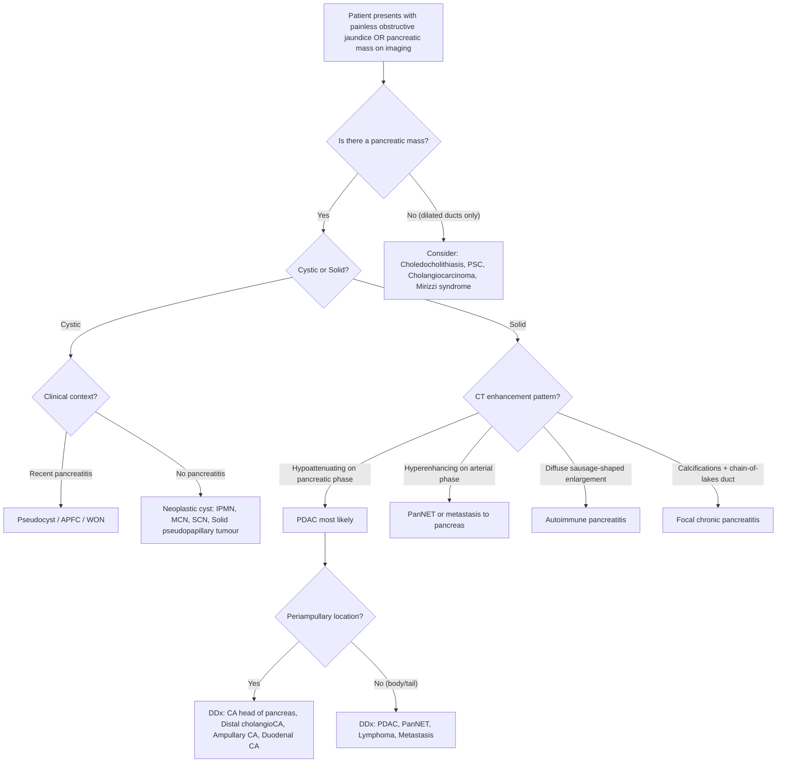

## Differential Diagnosis of Pancreatic Cancer

### General Approach to the Differential

The differential diagnosis of pancreatic cancer is broad because the presenting features — epigastric pain, obstructive jaundice, weight loss, new-onset diabetes — are **non-specific** and shared by many hepatobiliary, pancreatic, and even extra-abdominal conditions [1]. The key principle taught in the lectures is:

> ***"Painless progressive obstructive jaundice in elderly is malignant biliary obstruction until proven otherwise"*** [9]

The differential should be structured around **two clinical axes**:

1. **The presenting syndrome** — Are we dealing with obstructive jaundice? Epigastric/back pain? A pancreatic mass? New-onset diabetes?
2. **The imaging appearance** — Is the pancreatic lesion **cystic** or **solid**? [1]

This dual approach is how the senior notes frame it, and it makes clinical sense: you encounter the patient first (history/exam) then refine after imaging.

---

### Framework 1: Differential by Presenting Syndrome

#### A. Differential Diagnosis of Painless Obstructive Jaundice

This is the most important differential list for exams. The causes can be organised by the **anatomical level of obstruction** and whether the obstruction is **intraluminal, mural, or extramural** [9][3].

***The lecture slide explicitly lists the following cancers occurring along the biliary tract*** [3][4]:

- ***Cholangiocarcinoma (intrahepatic, perihilar/Klatskin tumour, distal)***
- ***Carcinoma of the gallbladder***
- ***Carcinoma of the head of pancreas***
- ***Periampullary carcinoma (ampulla of Vater)***
- ***Carcinoma of the duodenum***
- ***Porta hepatis lymphadenopathy (metastatic)***

| Location of Obstruction | Intraluminal | Mural | Extramural |
|---|---|---|---|
| **Proximal / Hilar** | Choledocholithiasis (migrated), RPC stones | ***Cholangiocarcinoma (Klatskin tumour)*** [3][4], PSC stricture | ***Porta hepatis lymphadenopathy*** [4], ***CA gallbladder*** invading CHD [3] |
| **Mid-CBD** | Gallstone (choledocholithiasis) | Cholangiocarcinoma (mid-duct) | Mirizzi syndrome (gallstone in cystic duct/Hartmann's pouch compressing CHD externally) |
| **Distal CBD / Periampullary** | Gallstone impacted at ampulla | ***Distal cholangiocarcinoma***, ***ampullary carcinoma*** [3][4] | ***CA head of pancreas*** [3][4], ***CA duodenum*** [3][4], ***periampullary lymphadenopathy*** |

<Callout title="How to Differentiate Stone vs. Tumour on History" type="idea">
***Stone*** = typically **episodic** pain (biliary colic), may have fever/rigors (cholangitis — Charcot's triad), **fluctuating** jaundice (stone ball-valves in and out of the ampulla), history of gallstones/biliary colic.

***Tumour*** = **painless, progressive, relentless** jaundice (gradual obstruction, no intermittent relief), **weight loss**, **palpable gallbladder** (Courvoisier's sign), constitutional symptoms [9].
</Callout>

#### B. Differential Diagnosis of Jaundice + Epigastric Mass

***The lecture slide by Prof R Poon explicitly lists the pathology producing jaundice AND epigastric mass*** [4]:

- ***Hepatomegaly secondary to biliary obstruction*** (back-pressure → enlarged, smooth liver)
- ***Hepatomegaly due to metastases or HCC*** (nodular, hard liver)
- ***Lymph node metastases to the coeliac axis or porta hepatis***
- ***Carcinoma of stomach with metastatic lymph node in the porta hepatis*** (gastric cancer → coeliac/portal LN → biliary obstruction)
- ***Distended stomach due to duodenal obstruction by tumour which also obstructs the bile duct*** (i.e., pancreatic head cancer causing both GOO and biliary obstruction simultaneously)

This is high yield because it reminds you that "jaundice + epigastric mass" is not exclusively pancreatic cancer — gastric cancer with portal lymphadenopathy, HCC, and even lymphoma can produce the same constellation.

#### C. Differential Diagnosis of Epigastric Pain Radiating to Back

| Condition | Distinguishing Features |
|---|---|
| **Pancreatic cancer** | Insidious onset, progressive weight loss, jaundice (if head), new-onset DM, relieved by leaning forward |
| **Chronic pancreatitis** | ***Difficult to distinguish from CA pancreas!*** [7] History of alcohol/recurrent acute pancreatitis, pancreatic calcifications on imaging, "chain of lakes" on MRCP, may have steatorrhoea triad |
| **Acute pancreatitis** | Acute onset, serum lipase/amylase > 3× ULN, obvious aetiology (gallstones, alcohol) |
| **Peptic ulcer disease (posterior DU)** | Posterior duodenal ulcer can erode into pancreas → back pain; meal-related, responds to PPI, positive H. pylori |
| **Abdominal aortic aneurysm** | Pulsatile epigastric mass, radiates to back, may be asymptomatic or present with rupture |
| **Retroperitoneal lymphoma** | Younger patient, B-symptoms, bulky retroperitoneal lymphadenopathy on CT |

#### D. Differential of New-Onset Diabetes + Weight Loss in Elderly

| Condition | Clue |
|---|---|
| **Pancreatic cancer** | Most important to rule out; associated with obstructive jaundice, back pain |
| **Chronic pancreatitis** | Long alcohol history, pancreatic calcifications, exocrine insufficiency preceding endocrine insufficiency [7] |
| **Type 1 DM (late-onset/LADA)** | Autoantibodies (anti-GAD, anti-IA2), ketosis-prone, lean |
| **Haemochromatosis** | Bronze diabetes, liver disease, arthropathy, iron studies |

---

### Framework 2: Differential by Imaging Appearance of Pancreatic Mass

This is the framework explicitly provided in the senior notes [1]. When imaging shows a pancreatic mass, the first branch point is: **is it cystic or solid?**

| Imaging | Category | Differential Diagnosis | Key Differentiating Features |
|---|---|---|---|
| **Cystic** | Inflammatory fluid collections | ***Acute peripancreatic fluid collections (APFC)*** | Context of recent acute pancreatitis; < 4 weeks |
| | | ***Pancreatic pseudocyst*** | > 4 weeks after acute pancreatitis, encapsulated, no solid component, NO epithelial lining (hence "pseudo"), amylase-rich fluid |
| | | ***Acute necrotic collections (ANC)*** / ***Walled-off necrosis (WON)*** | Necrotising pancreatitis; heterogeneous content (fluid + necrotic debris) |
| | Non-neoplastic | True cyst, retention cyst, mucinous non-neoplastic cyst, lymphoepithelial cyst | Usually incidental, no worrisome features |
| | Neoplastic | ***Serous cystic neoplasm (SCN)*** | Older women, microcystic/"honeycomb" pattern, central calcified scar, **NO malignant potential** → observe [8] |
| | | ***Mucinous cystic neoplasm (MCN)*** | ***Perimenopausal women, body/tail, ovarian-type stroma***, macrocystic, **malignant potential** [8] |
| | | ***Intraductal papillary mucinous neoplasm (IPMN)*** | ***Pancreatic head in old men***; main-duct (high malignant risk → resect) vs. branch-duct (observe unless high-risk stigmata: > 4 cm, mural nodules, main duct > 10 mm) [8] |
| **Solid** | Non-neoplastic | ***Focal chronic pancreatitis*** | ***Very difficult to distinguish from pancreatic cancer!*** [7] History of alcohol, diffuse calcifications, "chain of lakes" duct, IgG4 may help |
| | | ***Autoimmune pancreatitis (AIP)*** | Type 1 = IgG4-related disease (diffuse "sausage-shaped" pancreas, multifocal biliary strictures, ↑ serum IgG4, responds dramatically to steroids); Type 2 = associated with IBD. Key DDx because it mimics cancer but is treated medically! |
| | | ***Solid pseudopapillary neoplasm*** | Young women (20–30s), large well-encapsulated mass with cystic degeneration, low malignant potential, excellent prognosis after resection |
| | Neoplastic — Malignant | ***Pancreatic ductal adenocarcinoma (PDAC)*** | Hypoattenuating mass, double duct sign, vascular encasement, desmoplastic stroma |
| | | ***Pancreatic neuroendocrine tumour (PanNET)*** | ***Hyperenhancing (hyperdense) on arterial phase CT*** (contrast with PDAC which is hypo-attenuating!) ± calcifications, chromogranin A positive, somatostatin receptor scintigraphy positive [10] |
| | | ***Lymphoma (pancreatic)*** | Rare, bulky mass, B-symptoms, responds to chemotherapy, biopsy essential |
| | | ***Metastasis to pancreas*** | ***Most common primary: renal cell carcinoma (RCC)*** [2], also lung, breast, melanoma; usually well-circumscribed, hypervascular, history of prior malignancy |

<Callout title="PDAC vs. PanNET on CT — A Classic Distinction" type="error">
This is a common exam trap. ***PDAC appears hypoattenuating (hypodense)*** on CT because of its dense desmoplastic, hypovascular stroma. ***PanNETs appear hyperenhancing (hyperdense) on arterial phase*** because they are highly vascular. Also: PDAC = no calcifications, PanNET may have calcifications; PDAC = CA19-9 elevated, PanNET = chromogranin A elevated [10][2].
</Callout>

---

### Framework 3: The "Periampullary Cancer" Differential

All tumours arising within 2 cm of the ampulla of Vater are termed ***periampullary cancers***. They all present similarly (painless obstructive jaundice) and all require Whipple's procedure for curative resection, but they have **different prognoses** [2][3][4]:

| Tumour | Key Distinguishing Features | 5-Year Survival After Resection |
|---|---|---|
| ***CA head of pancreas*** | ***Dull aching pain radiating to back, new-onset DM*** [2]; hypoattenuating mass, double duct sign | ~10–25% |
| ***Distal cholangiocarcinoma*** | ***Elderly***, cholestatic LFTs, may have PSC history [2] | ~25–40% |
| ***Ampulla of Vater carcinoma*** | Jaundice (may fluctuate due to tumour necrosis — intermittent obstruction), fat malabsorption; visible on duodenoscopy [2] | ~40–60% |
| ***Periampullary duodenal carcinoma*** | ***Rare, except in FAP*** (familial adenomatous polyposis); ***Thomas' sign: silver stool*** (obstructive jaundice → white stool + tumour ulceration → melena → combined appearance) [2] | ~50–60% |

<Callout title="Thomas' Sign">
***Thomas' sign = silver stool*** — an uncommon but pathognomonic finding of periampullary duodenal carcinoma. The "silver" colour arises from the combination of **pale/clay stool** (biliary obstruction) mixed with **melaena** (GI bleeding from tumour ulceration). White + black = silver [2].
</Callout>

---

### The Critical Mimic: Chronic Pancreatitis vs. Pancreatic Cancer

This deserves special emphasis because ***chronic pancreatitis is notoriously difficult to distinguish from pancreatic cancer*** [7], and getting it wrong has serious consequences (unnecessary Whipple's for pancreatitis, or missed cancer treated as pancreatitis).

| Feature | Chronic Pancreatitis | Pancreatic Cancer |
|---|---|---|
| History | Long alcohol history, recurrent acute attacks | No prior pancreatic disease; smoking, new-onset DM |
| Pain pattern | Recurrent, may eventually become "burnt out" (painless) | Progressive, unrelenting |
| Calcifications | Diffuse pancreatic calcifications | Absent (usually) |
| Duct | "Chain of lakes" (diffuse alternating stricture-dilatation) | Single focal duct cutoff with upstream dilatation |
| Mass | May have focal inflammatory mass | Hypoattenuating mass with vascular encasement |
| CA 19-9 | May be mildly elevated (especially if cholangitis) | Usually markedly elevated (but not diagnostic) |
| IgG4 | Elevated in autoimmune pancreatitis (type 1) | Normal |
| Biopsy | May be needed (EUS-guided) to differentiate | Definitive; but not mandatory if resectable |

---

### The Critical Mimic: Autoimmune Pancreatitis (AIP)

Autoimmune pancreatitis is the one condition you absolutely must exclude before committing to Whipple's, because it responds to steroids. The imaging can look identical to PDAC.

| Feature | AIP Type 1 (IgG4-related) | PDAC |
|---|---|---|
| Age/Sex | Middle-aged to elderly male | Elderly, M > F |
| Pancreatic imaging | ***"Sausage-shaped" diffuse enlargement***, loss of lobularity, capsule-like rim | Focal hypoattenuating mass |
| Biliary strictures | Multifocal (intrahepatic + extrahepatic) — mimics PSC/cholangiocarcinoma | Single distal CBD stricture |
| Serum IgG4 | Elevated (> 2× ULN highly specific) | Normal |
| Other organ involvement | Salivary glands, retroperitoneum, kidneys (systemic IgG4-related disease) | None |
| Response to steroids | ***Dramatic response (diagnostic and therapeutic)*** | No response |
| EUS-FNA | Lymphoplasmacytic infiltrate, storiform fibrosis, obliterative phlebitis | Adenocarcinoma cells |

---

### Differential Diagnosis Decision Algorithm

---

### Tumour Markers in the Differential — What They Can and Cannot Tell You

***The lecture slide provides a comprehensive table of tumour markers*** [3]:

| Marker | Upper Normal | Sensitivity in Pancreatic Cancer | Non-Malignant Causes of Elevation | Key Point |
|---|---|---|---|---|
| ***AFP*** | ***10 ng/ml*** | Low (not a pancreatic marker) | ***Hepatitis, cirrhosis, biliary obstruction*** | Useful to differentiate HCC from cholangioCA/PDAC |
| ***CEA*** | ***5 ng/ml*** | ***30–70% in pancreatic cancer*** | ***Smoking, liver disease, bowel diseases, peptic ulcer, pancreatitis, renal failure*** [3] | Not specific; primarily a CRC marker |
| ***CA 19-9*** | ***37 U/ml*** | ***72–79% in pancreatic cancer*** | ***Benign biliary diseases, benign pancreatic diseases*** (cholangitis, gallstones, chronic pancreatitis) [3] | ***NOT sensitive or specific enough for diagnosis***; best used for **prognosis and monitoring treatment response/recurrence** [1][2]. Requires Lewis blood group antigen expression (5–10% of population are Lewis-negative and will never elevate CA 19-9) |
| ***CA 125*** | ***35 U/ml*** | ***~60% in pancreatic cancer*** | ***Benign pancreatic and liver disease*** [3] | Primarily an ovarian cancer marker |
| ***DUPAN-2*** | ***150 U/ml*** | ***~70% in pancreatic/biliary cancer*** | ***Benign hepatobiliary diseases (hepatitis, cholelithiasis)*** [3] | Less commonly used clinically |

<Callout title="CA 19-9: Know Its Limitations" type="error">
***CA 19-9 is NOT a screening or diagnostic test for pancreatic cancer.*** It is elevated in ~75–80% of PDAC but also elevated in cholangitis, choledocholithiasis, chronic pancreatitis, and other GI malignancies. Conversely, 5–10% of the population are **Lewis antigen-negative** and will NEVER produce CA 19-9 regardless of tumour burden. Its main role is ***prognostic + monitoring treatment response and detecting recurrence after surgery*** [1][2][3].
</Callout>

---

### Summary: Key Differential Diagnoses by Clinical Scenario

| Clinical Scenario | Top Differentials to Consider |
|---|---|
| Painless obstructive jaundice + palpable GB | CA head of pancreas, distal cholangioCA, ampullary CA |
| Painless obstructive jaundice + hepatomegaly | HCC, liver metastases, proximal cholangioCA |
| Jaundice + epigastric mass | ***All causes listed by Prof Poon*** [4]: biliary obstruction with hepatomegaly, liver mets/HCC, coeliac/portal LN mets, gastric CA with LN mets, distended stomach from duodenal obstruction |
| Epigastric pain radiating to back + weight loss | PDAC (body/tail), chronic pancreatitis, AAA, retroperitoneal lymphoma |
| Pancreatic mass + new-onset DM | PDAC (most important to exclude), chronic pancreatitis |
| Solid hypoattenuating pancreatic mass | PDAC (most likely), focal chronic pancreatitis, AIP |
| Solid hyperenhancing pancreatic mass | PanNET, metastasis (RCC, melanoma) |
| Cystic pancreatic lesion | IPMN, MCN, SCN, pseudocyst, solid pseudopapillary tumour |

---

<Callout title="High Yield Summary — Differential Diagnosis">

1. **Painless progressive obstructive jaundice** in elderly = malignant biliary obstruction until proven otherwise. Top DDx: CA head of pancreas, distal cholangioCA, ampullary CA, CA duodenum.

2. **Periampullary cancers** (within 2 cm of ampulla): pancreatic head, distal CBD, ampullary, duodenal — all present with painless jaundice but have very different prognoses (ampullary best, PDAC worst).

3. ***Chronic pancreatitis is notoriously difficult to distinguish from PDAC*** — look for diffuse calcifications, chain-of-lakes duct, alcohol history; may need biopsy.

4. ***Autoimmune pancreatitis*** (IgG4-related) mimics PDAC but responds dramatically to steroids — check IgG4, look for sausage-shaped pancreas and multiorgan IgG4 disease.

5. ***PDAC = hypoattenuating on CT; PanNET = hyperenhancing on arterial phase*** — a key imaging distinction.

6. ***CA 19-9 is NOT diagnostic*** — use for prognosis and monitoring. Lewis-negative patients (5–10%) will never elevate CA 19-9.

7. ***Thomas' sign (silver stool)*** = pathognomonic of periampullary duodenal carcinoma (white stool from obstruction + melaena from tumour ulceration).

8. **Metastases to pancreas**: most commonly from **RCC**, also lung, breast, melanoma — usually well-circumscribed and hypervascular.

</Callout>

---

<ActiveRecallQuiz
  title="Active Recall - Differential Diagnosis of Pancreatic Cancer"
  items={[
    {
      question: "List the four periampullary cancers and rank them from best to worst 5-year survival after resection.",
      markscheme: "1. Periampullary duodenal carcinoma (50-60%). 2. Ampulla of Vater carcinoma (40-60%). 3. Distal cholangiocarcinoma (25-40%). 4. CA head of pancreas (10-25%). PDAC has the worst prognosis."
    },
    {
      question: "Name three conditions that can elevate CA 19-9 apart from pancreatic cancer, and explain why CA 19-9 cannot be used as a screening test.",
      markscheme: "Conditions: cholangitis, choledocholithiasis, chronic pancreatitis (also cholangioCA, HCC, gastric CA). CA 19-9 is neither sensitive nor specific for diagnosis. Additionally, 5-10% of the population are Lewis antigen-negative and will never produce CA 19-9 regardless of tumour burden. Its role is prognostic and for monitoring treatment response/recurrence."
    },
    {
      question: "How do you distinguish autoimmune pancreatitis from pancreatic ductal adenocarcinoma on imaging and biochemistry?",
      markscheme: "AIP: diffuse sausage-shaped pancreatic enlargement with capsule-like rim, multifocal biliary strictures, elevated serum IgG4 (especially > 2x ULN), other organ involvement (IgG4-related disease), dramatic response to steroids. PDAC: focal hypoattenuating mass, single distal CBD stricture, normal IgG4, no steroid response."
    },
    {
      question: "What is Thomas' sign, what causes it, and in which specific periampullary cancer is it classically described?",
      markscheme: "Thomas' sign = silver stool. Caused by combination of pale/clay stool (from obstructive jaundice, no bilirubin reaching gut) and melaena (from ulceration and bleeding of the tumour). Classic for periampullary duodenal carcinoma. White + black = silver appearance."
    },
    {
      question: "On CT imaging, a solid pancreatic mass is hyperenhancing on arterial phase. What is the most likely diagnosis and how does this differ from PDAC?",
      markscheme: "Most likely: Pancreatic neuroendocrine tumour (PanNET) or metastasis to pancreas (e.g., RCC). PanNETs are highly vascular so they enhance brightly on arterial phase. PDAC is hypoattenuating/hypodense because of dense desmoplastic, hypovascular stroma. Additional clues: PanNET may have calcifications and positive chromogranin A; PDAC has no calcifications and elevated CA 19-9."
    },
    {
      question: "According to the lecture by Prof R Poon, list five pathologies that can produce both jaundice AND an epigastric mass simultaneously.",
      markscheme: "1. Hepatomegaly secondary to biliary obstruction. 2. Hepatomegaly due to liver metastases or HCC. 3. Lymph node metastases to the coeliac axis or porta hepatis. 4. Carcinoma of stomach with metastatic lymph node in the porta hepatis. 5. Distended stomach due to duodenal obstruction by tumour which also obstructs the bile duct."
    }
  ]}
/>

## References

[1] Senior notes: felixlai.md (Pancreatic cancer section)
[2] Senior notes: maxim.md (Pancreatic carcinoma section; Periampullary malignancy section)
[3] Lecture slides: Malignant biliary obstruction.pdf (p5 — cancers along biliary tract; p8 — tumour markers table)
[4] Lecture slides: WCS 056 - Painless jaundice and epigastric mass - by Prof R Poon.ppt (1).pdf (p24 — cancers along biliary tract; p32 — pathology producing jaundice and epigastric mass)
[7] Senior notes: maxim.md (Chronic pancreatitis section)
[8] Senior notes: maxim.md (Pancreatic cyst section)
[9] Senior notes: maxim.md (Obstructive jaundice section)
[10] Senior notes: maxim.md (Pancreatic neuroendocrine tumours section; Non-functioning pNET vs CA pancreas table)
