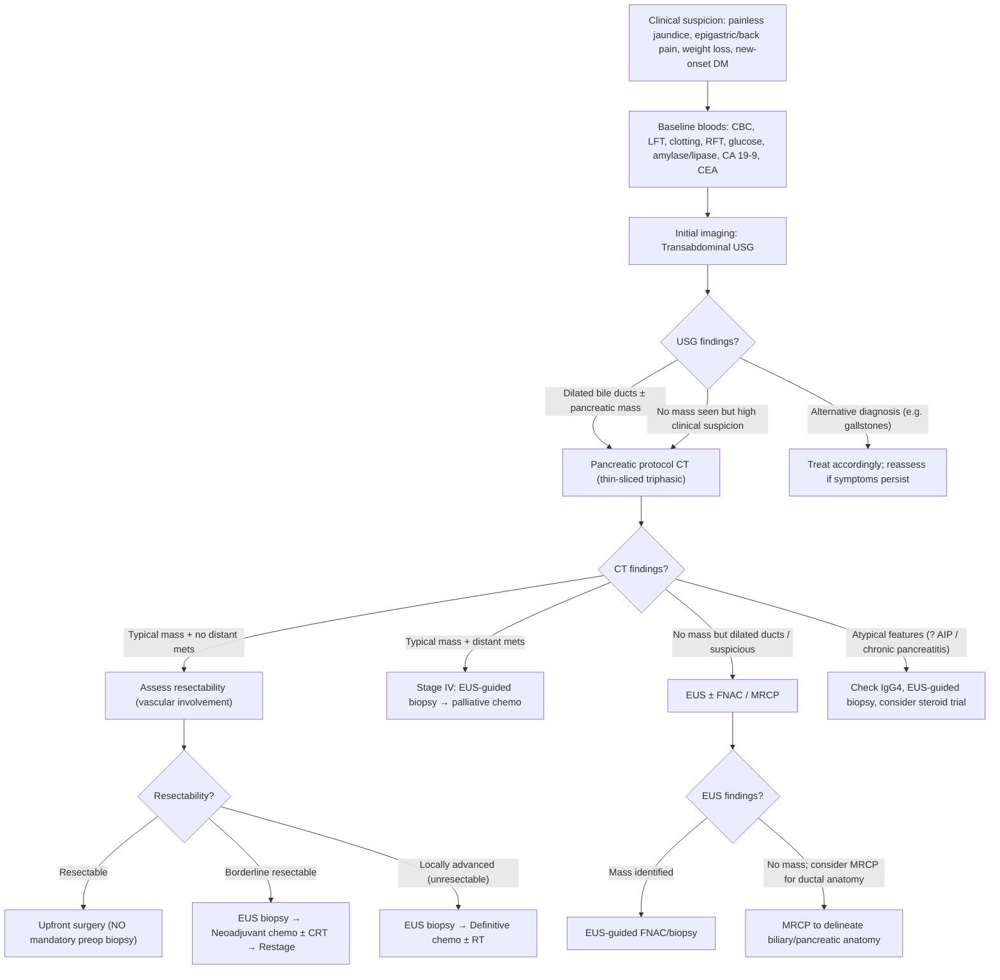
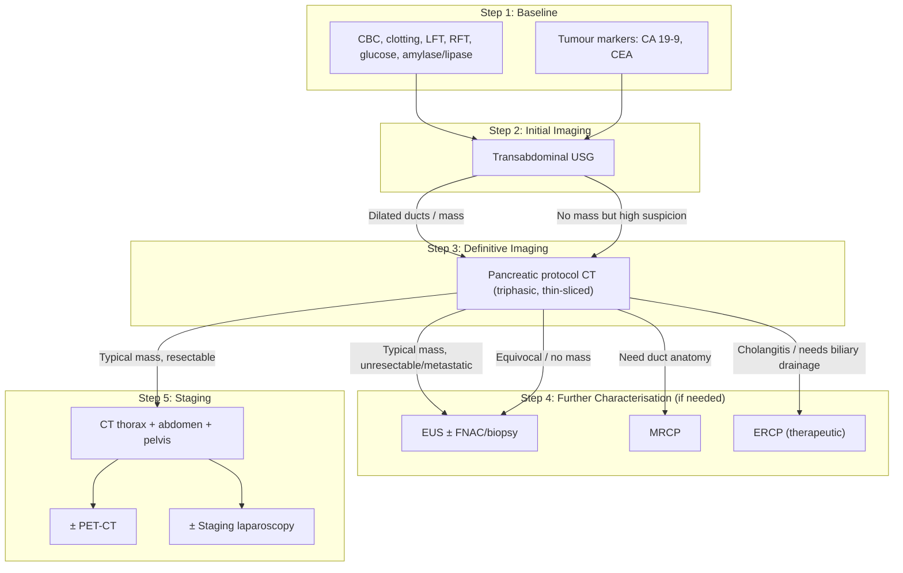
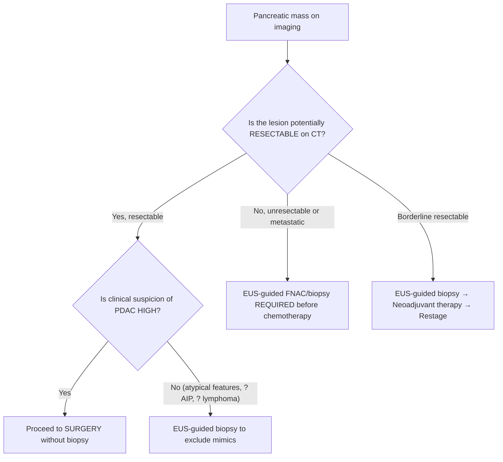

## Diagnostic Criteria, Algorithm, and Investigations for Pancreatic Cancer

### Why There Are No "Diagnostic Criteria" Like Other Conditions

Unlike acute pancreatitis (which has the classic 2-out-of-3 criteria) or autoimmune pancreatitis (which has the HISORt criteria), **pancreatic ductal adenocarcinoma has no universally codified "diagnostic criteria" per se**. Instead, the diagnosis is established through a **sequential clinical-radiological-pathological approach**:

1. **Clinical suspicion** — based on symptoms (painless obstructive jaundice, back pain, weight loss, new-onset DM)
2. **Cross-sectional imaging** — pancreatic protocol CT is the cornerstone
3. **Tissue diagnosis** — required in certain scenarios but ***NOT mandatory if the tumour is potentially resectable*** [1][2]

The overarching principle: **once you suspect pancreatic cancer, the primary goal of investigation is not just diagnosis but simultaneously determining resectability** — because resectability directly dictates management.

<Callout title="Key Principle">
***The diagnosis and staging of pancreatic cancer are pursued in parallel, not sequentially.*** A pancreatic protocol CT scan simultaneously (a) identifies the mass, (b) characterises it, (c) assesses vascular involvement for resectability, and (d) screens for metastatic disease. You do not wait for a biopsy before staging [1][2][3].
</Callout>

---

### The Diagnostic Algorithm — Overview

The approach follows a logical sequence that mirrors real clinical thinking:

**Step 1**: Clinical suspicion → Baseline bloods  
**Step 2**: Initial imaging (USG) → Pancreatic protocol CT  
**Step 3**: Assess resectability on CT  
**Step 4**: Tissue diagnosis (only if needed)  
**Step 5**: Complete staging (CT TAP ± PET-CT, ± staging laparoscopy)  

---

### Investigations — Systematic Breakdown

#### 1. Physical Examination

The examination is not a mere formality — it actively contributes to diagnosis and staging.

| Examination | Finding | What It Tells You |
|---|---|---|
| **General** | Jaundice (scleral icterus) | Biliary obstruction — confirms the clinical suspicion |
| | Cachexia (temporal wasting, muscle loss) | Advanced disease; poor nutritional status — impacts surgical fitness |
| | ***Lymphadenopathy*** | Virchow's node (left supraclavicular) = distant metastatic disease → Stage IV |
| **Abdomen** | Scratch marks | Pruritus from cholestasis |
| | ***Sister Mary Joseph's nodule*** (periumbilical) | Peritoneal carcinomatosis with spread via falciform ligament |
| | ***Hepatomegaly*** | Either cholestatic (smooth, non-tender) or metastatic (nodular, hard) |
| | ***Epigastric mass*** | Palpable pancreatic tumour = usually advanced |
| | ***Ascites*** | Peritoneal carcinomatosis or portal hypertension from PV invasion |
| | ***Courvoisier's sign*** | ***Painless jaundice with palpable gallbladder → points towards malignant biliary obstruction (MBO)*** [1][4][11] |

***The lecture by Prof R Poon emphasises Courvoisier's law with its exceptions*** [4][11]:

> ***Definition: "In painless jaundice, if the gallbladder is palpable, it is unlikely to be due to gallstones"*** — points towards malignant biliary obstruction.

> ***Reason***: Gallstones develop chronically → chronic cholecystitis → fibrosed/contracted GB that ***cannot*** distend. Malignant obstruction develops gradually in a previously normal GB → progressive distension from back-pressure.

> ***Exceptions*** [11]:
> - **Double gallstones**: one at CBD (causing jaundice) + another at cystic duct (causing mucocele → GB distension despite fibrosis)
> - **Recurrent pyogenic cholangitis (RPC)**: pathology is in the bile duct, not the GB → CBD obstruction without chronic cholecystitis → GB can still distend

<Callout title="Courvoisier's Law — Exceptions" type="error">
Students often state Courvoisier's law as absolute. Remember the two exceptions: ***double gallstones*** (CBD + cystic duct) and ***RPC*** (bile duct pathology, not GB pathology). Also note that gallstones can sometimes be painless too — the law is about the *palpable GB*, not the *pain* [11].
</Callout>

---

#### 2. Biochemical Tests (Blood Investigations)

| Investigation | Expected Finding in Pancreatic Cancer | Pathophysiological Basis |
|---|---|---|
| ***CBC with differentials*** | Anaemia (normocytic, of chronic disease); leukocytosis if concurrent biliary sepsis/cholangitis; thrombocytopenia to check before ERCP [1][11] | Chronic disease anaemia from cancer cachexia + malabsorption (iron, B12, folate) |
| ***Clotting profile (PT/INR)*** | ***Prolonged PT/INR*** | ***Vitamin K deficiency from obstructive jaundice*** — bile salts cannot reach the gut → fat-soluble vitamin (K) malabsorption → reduced hepatic synthesis of factors II, VII, IX, X. This MUST be corrected before any invasive procedure (give IV vitamin K) [1][11] |
| ***LFT*** | ***↑ ALP and GGT (cholestatic pattern)***, ***↑ conjugated (direct) bilirubin***, albumin for nutritional status [1][2][11] | ALP is located on the canalicular membrane of hepatocytes; biliary obstruction causes bile backup → cholestasis → upregulation and leakage of ALP into blood. GGT confirms the ALP is of hepatobiliary origin (vs. bone). Conjugated bilirubin rises because it is formed normally in the liver but cannot be excreted into the bile |
| ***RFT*** | Hyponatraemia, hypokalaemia [1] | Secondary to vomiting (especially if GOO present), poor oral intake |
| ***Serum glucose / HbA1c*** | Hyperglycaemia / elevated HbA1c | ***New-onset DM*** is both a consequence AND early manifestation of pancreatic cancer. New-onset DM in an older adult should prompt screening for occult pancreatic cancer [1][2] |
| ***Serum amylase and lipase*** | May be elevated if acute pancreatitis present | Tumour occlusion of pancreatic duct → upstream ductal hypertension → premature enzyme activation → pancreatitis [1] |
| ***CA 19-9*** | ***Elevated in ~75–80% of patients*** [1][2][3] | See detailed discussion below |
| ***CEA*** | ***Raised in 30–60%*** [2] | Non-specific; can be elevated in CRC, gastric, lung, breast cancers |

##### CA 19-9 — A Detailed Discussion

CA 19-9 (Carbohydrate Antigen 19-9) is a **mucin-bound sialylated Lewis-a blood group antigen** (a modified Lewis antigen). Understanding its properties is essential:

| Property | Detail |
|---|---|
| ***Upper normal limit*** | ***37 U/ml*** [3] |
| ***Sensitivity in pancreatic cancer*** | ***72–79%*** [3] |
| **Specificity** | Poor — elevated in many other conditions |
| ***NOT useful as a screening/diagnostic tool*** | ***Not sensitive and not specific enough to allow early diagnosis of CA pancreas*** [1][2] |
| ***Primary role*** | ***Prognostic marker + monitoring disease activity after surgery/chemotherapy. Serial monitoring of CA 19-9 predicts recurrence and long-term prognosis*** [1] |
| **Lewis antigen requirement** | ***Requires the presence of the Lewis blood group antigen to be expressed*** — approximately 5–10% of the population are Lewis-negative and will NEVER produce CA 19-9 regardless of tumour burden [1] |
| ***Non-malignant causes of elevation*** | ***Benign biliary diseases, benign pancreatic diseases*** (chronic pancreatitis, cholangitis, choledocholithiasis) [3] |
| ***Malignant causes (other than PDAC)*** | ***HCC, cholangioCA, CA gallbladder, gastric cancer, CRC, ovarian tumours*** [1][3] |

***The lecture slide tumour marker table*** [3] also lists:

| Marker | Upper Normal | Key Cancer Association | Non-Malignant Causes |
|---|---|---|---|
| ***AFP*** | ***10 ng/ml*** | ***HCC (70–90%), cholangioCA (10%)*** | ***Hepatitis, cirrhosis, biliary obstruction*** |
| ***CEA*** | ***5 ng/ml*** | ***CRC (30–70%), gastric, pancreatic, lung, breast*** | ***Smoking, liver disease, bowel diseases, peptic ulcer, pancreatitis, renal failure*** |
| ***CA 19-9*** | ***37 U/ml*** | ***Pancreatic cancer (72–79%), biliary cancer (67–73%), gastric (42–62%), CRC (19–41%)*** | ***Benign biliary/pancreatic diseases*** |
| ***CA 125*** | ***35 U/ml*** | ***Ovarian (80%), pancreatic (60%)*** | ***Benign pancreatic and liver disease*** |
| ***DUPAN-2*** | ***150 U/ml*** | ***Pancreatic and biliary cancer (70%)*** | ***Benign hepatobiliary diseases (hepatitis, cholelithiasis)*** |

<Callout title="CA 19-9: What It Can and Cannot Do">
**CA 19-9 CANNOT diagnose pancreatic cancer** — it is neither sensitive nor specific. It CAN: (1) Serve as a **prognostic marker** at diagnosis (very high levels suggest unresectability/metastatic disease), (2) **Monitor treatment response** (falling levels = good response; rising levels = recurrence/progression), (3) Help **detect recurrence** after curative resection via serial monitoring [1][2][3].
</Callout>

---

#### 3. Radiological Investigations

##### A. Transabdominal Ultrasound (USG) — First-Line Imaging

| Aspect | Detail |
|---|---|
| **Role** | ***Initial imaging modality*** for any patient with suspected pancreatic cancer or obstructive jaundice [1][2][12] |
| **Strengths** | High sensitivity for detecting **biliary tract dilatation** (IHD and CBD), establishing **level of obstruction**, detecting **pancreatic masses > 3 cm**, non-invasive, no radiation, cheap, widely available |
| **Limitations** | Poor sensitivity for **small tumours (< 3 cm)**, **body/tail of pancreas often obscured by bowel gas and body habitus** [1][12] |
| ***Typical findings*** | ***Focal hypoechoic hypovascular solid mass with irregular margins*** + ***dilatation of CBD*** [1] |
| ***Normal CBD size*** | ***CBD > 0.8 cm is pathological*** (rule of thumb: ***0.1 cm per decade of age*** is the upper limit, e.g. 6 mm at age 60, 7 mm at age 70) [12] |
| **What to assess** | Pancreas (mass? duct dilatation?), biliary system (CBD dilatation, level of obstruction, stones?), GB (distended? contracted? stones?), liver (IHD dilatation, liver mets, abscess?) [12] |

##### B. Pancreatic Protocol CT — The Gold Standard Investigation

***This is the single most important investigation in the workup of pancreatic cancer*** [1][2][3].

**What is "pancreatic protocol CT"?**

It is a ***multidetector, dynamic, thin-sliced (≤ 3 mm), contrast-enhanced CT scan*** with ***three specific phases (triphasic)*** [1][2]:

| Phase | Timing After Contrast | What It Shows | Why It Matters |
|---|---|---|---|
| ***Arterial phase*** | ~25–30 seconds | ***Enhancement of celiac axis, SMA, and peripancreatic arteries*** | Assesses **arterial involvement** (SMA, celiac trunk, CHA encasement) → determines resectability [1] |
| ***Pancreatic (venous) phase*** | ~40–50 seconds | ***Maximum attenuation difference between the hypoattenuating tumour and normal enhancing pancreatic parenchyma*** | This is the phase where the **tumour is most conspicuous** — PDAC is hypovascular (dense desmoplastic stroma) so it does NOT enhance, while normal pancreas does → the tumour stands out as a dark (hypoattenuating) area [1][2] |
| ***Portal venous phase*** | ~70–80 seconds | ***Enhancement of SMV, splenic vein, and portal vein*** | Assesses **venous involvement** (SMV/PV encasement, thrombosis) → determines resectability [1] |

***Typical CT findings of pancreatic cancer*** [1][2][4]:

| Finding | Explanation |
|---|---|
| ***Ill-defined hypoattenuating mass within the pancreas*** | The tumour is hypovascular (desmoplastic stroma prevents contrast enhancement) while normal parenchyma enhances brightly → tumour appears darker [1][2] |
| ***Double duct sign*** | ***Simultaneous dilatation of both the pancreatic duct AND CBD with abrupt cutoff at the pancreatic head*** — pathognomonic of pancreatic head malignancy [1][2][4]. This occurs because the tumour compresses both the intrapancreatic CBD and the main pancreatic duct where they converge at the head |
| **Pancreatic duct cutoff** | Abrupt termination of pancreatic duct at tumour site |
| **Parenchymal atrophy** | Upstream glandular atrophy from chronic duct obstruction |
| **Contour abnormalities** | Irregularity of the pancreatic contour at the site of tumour |
| ***Vascular encasement*** | ***Assessment of tumour contact/encasement of SMA, celiac trunk, hepatic artery, SMV, PV*** [2][3] |
| **Liver metastases** | Hypodense liver lesions |
| **Ascites** | Peritoneal carcinomatosis |
| **Lymphadenopathy** | Regional or distant nodes |

***CT assessment of resectability*** — ***the criteria from the lecture*** [3]:

> ***Criteria of Resectability:***
> - ***No distant metastases***
> - ***SMA and celiac axis not involved***
> - ***Patent superior mesenteric-portal venous confluence***
> - ***PV involvement is NOT an absolute contraindication — venous resection is appropriate to improve resectability and achieve R0 resection***
>   - ***Significant morbidity and mortality***
>   - ***Reasonable survival: median = 13 months, 5-year = 7%***

Expanded NCCN resectability assessment:

| Category | Arterial Criteria | Venous Criteria |
|---|---|---|
| ***Resectable*** | No contact with SMA, celiac axis, or CHA | No SMV/PV contact, or ≤ 180° without vein contour irregularity |
| ***Borderline resectable*** | ***Tumour contact < 180° with SMA***; CHA contact without extension to celiac axis | > 180° SMV/PV contact, or ≤ 180° with contour irregularity, or thrombosis if reconstructable [2][3] |
| ***Locally advanced (unresectable)*** | ***SMA/celiac trunk encasement > 180°*** | ***Unreconstructible SMV/PV*** due to tumour involvement or thrombus [2][3] |
| **Metastatic** | Any T, any vessels | Distant metastases present |

<Callout title="Portal Vein Involvement" type="idea">
***PV involvement is NOT an absolute contraindication to surgery.*** Selected patients with limited PV/SMV involvement can undergo **venous resection and reconstruction** (segmental resection with primary anastomosis or interposition graft). This achieves R0 resection in borderline cases but carries significant morbidity. The lecture notes: ***median survival = 13 months, 5-year survival = 7%*** after venous resection [3].
</Callout>

##### C. Endoscopic Ultrasound (EUS) ± FNAC/Biopsy

| Aspect | Detail |
|---|---|
| **Principle** | High-frequency ultrasound transducer on the tip of an endoscope placed in the stomach/duodenum → generates high-resolution images of the pancreas from very close range (no bowel gas or body fat interference) |
| **Role in diagnosis** | ***Detects small pancreatic masses that could be missed by CT scan*** — used when there is high suspicion but no mass on CT [1] |
| **EUS-guided tissue sampling** | ***EUS-guided FNAC or biopsy is PREFERRED over percutaneous USG/CT-guided biopsy*** — ***less risk of tumour seeding*** because the needle traverses the GI wall (which will be resected in a Whipple's anyway) rather than crossing the peritoneal cavity [1][2] |
| ***When tissue diagnosis is NOT required*** | ***When suspicion of CA pancreas is HIGH and the tumour appears RESECTABLE on CT → proceed directly to surgery without preoperative biopsy*** [1][2]. Rationale: resection is both diagnostic and therapeutic; delaying surgery for biopsy provides no benefit and may worsen outcomes |
| ***When tissue diagnosis IS required*** | (1) ***Locally advanced/unresectable disease*** (need histology before committing to chemo), (2) ***Patient unfit for surgery***, (3) ***Neoadjuvant therapy is contemplated***, (4) ***CT failed to show typical features*** or an ***alternative diagnosis must be excluded*** (e.g., lymphoma, autoimmune pancreatitis), (5) ***Suspected secondary metastasis to pancreas*** [1][2] |
| **EUS for chronic pancreatitis vs cancer** | ***Preoperative biopsy is recommended if chronic pancreatitis or autoimmune pancreatitis is suspected*** since they can closely mimic pancreatic cancer — you do NOT want to do a Whipple's for AIP! [1] |
| **Role of EUS in periampullary tumours** | ***EUS helps acquire histological diagnosis of CA head of pancreas*** (which normally cannot be seen on OGD unless it has invaded through the duodenal wall). ***EUS has NO role in diagnosing CA ampulla of Vater and CA duodenum*** (these are visible on duodenoscopy and biopsied directly) [12] |

<Callout title="When NOT to Biopsy" type="error">
A very common exam mistake: ordering EUS-biopsy for every pancreatic mass. ***If the tumour is RESECTABLE on CT and clinical suspicion is HIGH, proceed DIRECTLY to surgery.*** Biopsy delays treatment, risks tumour seeding, and does not change management — the resected specimen provides the definitive pathology [1][2].
</Callout>

##### D. ERCP (Endoscopic Retrograde Cholangiopancreatography)

| Aspect | Detail |
|---|---|
| **Current role** | ***Primarily THERAPEUTIC, not diagnostic*** — its main indication is **biliary decompression via stent placement** in patients with cholestasis from tumour obstruction [1] |
| **Diagnostic capability** | Highly sensitive for visualising the biliary tree and pancreatic ducts; can obtain **brush cytology or forceps biopsy** from the stricture site [1][2] |
| ***NOT all patients need preoperative biliary drainage*** | ***Not all patients with biliary obstruction from pancreatic cancer require decompression and stenting if the cancer is potentially resectable*** — routine preoperative biliary stenting in resectable cases increases infectious complications without clear survival benefit. It is reserved for: (a) severely jaundiced patients needing optimisation before surgery, (b) those with cholangitis, (c) delay to surgery > 2 weeks [1] |
| **Complications** | Post-ERCP pancreatitis, bleeding, cholangitis, perforation [1] |
| **When to use** | Symptomatic cholestasis requiring palliation, cholangitis, need for brush cytology when EUS is unavailable or non-diagnostic |

##### E. MRCP (Magnetic Resonance Cholangiopancreatography)

| Aspect | Detail |
|---|---|
| **Principle** | ***Non-contrast, T2-weighted MRI*** that highlights fluid-filled structures (bile and pancreatic ducts appear bright) [12] |
| **Role** | ***Superior in delineating the anatomy of the biliary tree*** especially when the system is not obstructed and there are no therapeutic indications for ERCP [1] |
| **Advantage over ERCP** | Non-invasive, no risk of pancreatitis/perforation, no sedation required |
| **Limitation** | NOT therapeutic (cannot stent, cannot biopsy) |
| **When to use** | Equivocal CT findings, need to clarify ductal anatomy, assessment of IPMN and cystic lesions, patients with mild LFT derangement where ERCP is not yet warranted [1][12] |

##### F. PET-CT

| Aspect | Detail |
|---|---|
| ***Current evidence*** | ***Data remains insufficient to conclude that PET or PET-CT provides useful information above that provided by contrast-enhanced CT*** [1] |
| **Potential use** | May help ***distinguish chronic pancreatitis from CA pancreas*** (PDAC is FDG-avid; chronic pancreatitis is usually not — but acute inflammation can cause false positives) [1] |
| **Other use** | Detecting occult distant metastases when CT is equivocal; staging when equivocal CT findings |

##### G. MRI of Pancreas

| Aspect | Detail |
|---|---|
| ***Current evidence*** | ***No evidence that MRI offers a significant diagnostic advantage over triple-phase MDCT.*** MRI currently provides essentially the same information as CT scan [1] |
| **When preferred** | Patients with contrast allergy (MRI uses gadolinium instead of iodinated contrast), renal impairment (gadolinium is safer in moderate CKD), pregnant patients, characterisation of indeterminate liver lesions (MRI with liver-specific contrast Primovist is superior for small liver lesions) [12] |

##### H. Staging Laparoscopy (Diagnostic Laparoscopy)

| Aspect | Detail |
|---|---|
| **Purpose** | General exploration of peritoneal surfaces to detect ***occult peritoneal metastases missed by CT*** — peritoneal deposits can be very small and are notoriously hard to see on CT [1][2] |
| **Value** | ***As CT quality has improved, the value of diagnostic laparoscopy has decreased*** [1]. However, it still has an important role in select cases |
| ***Indications*** [1] | - ***Tumours located in body or tail*** (higher rate of occult peritoneal mets) |
| | - ***Large tumours > 4 cm*** |
| | - ***High CA 19-9 level*** |
| | - ***Equivocal findings of metastasis or ascites on CT scan*** |
| | - ***Before resection is attempted for body/tail lesions*** [1] |

##### I. Other Staging Investigations

| Investigation | Purpose |
|---|---|
| ***CXR / CT thorax*** | Lung metastases [1] |
| ***CT abdomen (+ liver)*** | Liver metastases [1] |
| **Bone scan** | Bone metastases (only if symptomatic) [1] |
| ***Staging laparoscopy*** | Peritoneal metastases [1][2] |
| ***Intra-operative laparoscopy*** | ***Peritoneal metastasis is often missed on imaging*** [2] |

---

### Putting It All Together — The Complete Investigation Pathway

---

### Key Imaging Signs — Summary Table

| Sign | Modality | Meaning |
|---|---|---|
| ***Double duct sign*** | CT / MRCP | ***Simultaneous dilatation of CBD + pancreatic duct*** with cutoff at pancreatic head → highly suggestive of periampullary malignancy [1][2][4] |
| ***Hypoattenuating pancreatic mass*** | CT (pancreatic phase) | PDAC — dense desmoplastic stroma prevents contrast enhancement [1][2] |
| ***Pancreatic duct cutoff*** | CT / MRCP | Abrupt termination of duct at tumour site |
| ***Vascular encasement*** | CT (arterial + PV phases) | Determines resectability (SMA, celiac, CHA, SMV, PV) [2][3] |
| ***CBD dilatation > 0.8 cm*** | USG | Suggests distal obstruction [12] |
| **Pancreatic duct dilatation > 3 mm** | USG / CT | Suggests duct obstruction; in pancreatic head cancer, upstream dilatation |
| **"Sausage-shaped" pancreas** | CT | Autoimmune pancreatitis (important mimic!) |
| ***Diffuse calcifications*** | CT / AXR | Chronic pancreatitis (important mimic) [7] |
| **Hyperenhancing mass** | CT (arterial phase) | PanNET or metastasis (NOT PDAC) [10] |

---

### Tissue Diagnosis Decision Framework

This is one of the most tested concepts — when do you biopsy and when do you go straight to surgery?

---

### Special Considerations

#### Correcting Coagulopathy Before Procedures

Why does this matter? Obstructive jaundice → bile salts cannot reach gut → fat malabsorption → ***vitamin K deficiency*** → reduced synthesis of coagulation factors II, VII, IX, X → ***prolonged PT/INR***. Before any invasive procedure (ERCP, EUS-FNAC, surgery), you must:
- Give **IV vitamin K** (takes 24–48 hours to work, as the liver needs time to synthesise new factors)
- If urgent: give **FFP** (provides immediate coagulation factors) [1][11]

#### Preoperative Biliary Drainage — To Stent or Not to Stent?

This is a nuanced clinical question:
- ***Routine preoperative biliary stenting is NOT recommended for all patients*** — it increases infective complications (cholangitis, wound infection post-Whipple) without clear survival benefit
- **Indications for preoperative drainage**: (a) bilirubin > 250–300 μmol/L (severe jaundice impairs hepatic function and increases surgical risk), (b) cholangitis, (c) expected delay to surgery > 2–4 weeks, (d) neoadjuvant therapy planned (patient needs biliary decompression during chemo months) [1]

---

<Callout title="High Yield Summary — Diagnosis and Investigations">

1. ***Pancreatic protocol CT (thin-sliced triphasic)*** is the **GOLD STANDARD** for diagnosis AND staging simultaneously.

2. ***Triphasic = arterial (arteries/resectability) + pancreatic/venous (tumour conspicuity) + portal venous (veins/resectability)***.

3. ***Classic CT finding: ill-defined hypoattenuating mass + double duct sign + vascular encasement***.

4. ***Tissue diagnosis (biopsy) is NOT mandatory if the tumour is resectable*** — proceed to surgery. Biopsy is needed only for unresectable/metastatic disease, atypical features, neoadjuvant planning, or to exclude mimics.

5. ***EUS-guided FNAC is preferred over percutaneous biopsy*** (lower risk of peritoneal tumour seeding).

6. ***CA 19-9 is NOT diagnostic*** — it is prognostic and used for monitoring. Requires Lewis antigen expression.

7. ***Resectability criteria***: No distant mets, SMA/celiac not encased > 180°, patent SMV-PV confluence (PV involvement is NOT an absolute contraindication if reconstructable).

8. ***Staging laparoscopy*** is indicated for body/tail tumours, large tumours > 4 cm, high CA 19-9, or equivocal CT findings.

9. ***Courvoisier's sign***: Painless jaundice + palpable GB → malignant biliary obstruction. Exceptions: double gallstones, RPC.

10. ***Correct coagulopathy (IV vitamin K)*** before any invasive procedure in jaundiced patients.

</Callout>

---

<ActiveRecallQuiz
  title="Active Recall - Diagnosis and Investigations of Pancreatic Cancer"
  items={[
    {
      question: "What are the three phases of a pancreatic protocol CT, and what does each phase specifically assess?",
      markscheme: "1. Arterial phase (25-30s): enhancement of celiac axis, SMA, peripancreatic arteries — assesses arterial involvement/resectability. 2. Pancreatic/venous phase (40-50s): maximum attenuation difference between hypoattenuating tumour and enhancing normal pancreas — best phase for tumour detection. 3. Portal venous phase (70-80s): enhancement of SMV, splenic vein, portal vein — assesses venous involvement/resectability."
    },
    {
      question: "In which specific clinical scenarios is tissue diagnosis (biopsy) required before treatment in suspected pancreatic cancer, and in which is it NOT required?",
      markscheme: "Biopsy REQUIRED: (1) Locally advanced/unresectable disease (before chemo), (2) Metastatic disease (before palliative chemo), (3) Neoadjuvant therapy planned, (4) Atypical CT features or alternative diagnosis must be excluded (e.g. AIP, lymphoma), (5) Patient unfit for surgery. Biopsy NOT required: Resectable tumour with high clinical suspicion — proceed directly to surgery."
    },
    {
      question: "State the criteria of resectability for pancreatic cancer as outlined in the lecture slides.",
      markscheme: "Resectable if: (1) No distant metastases, (2) SMA and celiac axis not involved, (3) Patent superior mesenteric-portal venous confluence. PV involvement is NOT an absolute contraindication — venous resection can be performed to achieve R0 resection (median survival 13 months, 5-year survival 7%)."
    },
    {
      question: "Why is EUS-guided FNAC preferred over percutaneous CT-guided biopsy for pancreatic masses, and what are the exceptions to Courvoisier's law?",
      markscheme: "EUS-FNAC preferred because the needle traverses the GI wall (which is resected during Whipple anyway), so lower risk of peritoneal tumour seeding compared to percutaneous biopsy crossing the peritoneal cavity. Courvoisier exceptions: (1) Double gallstones — CBD stone causing jaundice plus cystic duct stone causing mucocele/GB distension, (2) Recurrent pyogenic cholangitis — pathology is in the bile duct, not the GB, so GB is not fibrosed and can distend."
    },
    {
      question: "A patient with suspected pancreatic cancer has a prolonged PT/INR. Explain the mechanism and how you would correct it before ERCP.",
      markscheme: "Mechanism: Obstructive jaundice prevents bile salts from reaching the gut, leading to fat malabsorption including fat-soluble vitamin K. Vitamin K is a cofactor for hepatic synthesis of factors II, VII, IX, and X. Deficiency leads to prolonged PT/INR. Correction: Give IV vitamin K (takes 24-48 hours for effect). If urgent procedure needed, give FFP for immediate coagulation factor replacement."
    },
    {
      question: "List four specific indications for staging laparoscopy in pancreatic cancer.",
      markscheme: "(1) Tumours located in body or tail of pancreas (higher rate of occult peritoneal metastases). (2) Large tumours greater than 4 cm. (3) High CA 19-9 level. (4) Equivocal findings of metastasis or ascites on CT scan."
    }
  ]}
/>

## References

[1] Senior notes: felixlai.md (Pancreatic cancer — Diagnosis section)
[2] Senior notes: maxim.md (Pancreatic carcinoma — Investigations, Staging, Resectability sections)
[3] Lecture slides: Malignant biliary obstruction.pdf (p8 — tumour markers table; p23 — criteria of resectability)
[4] Lecture slides: WCS 056 - Painless jaundice and epigastric mass - by Prof R Poon.ppt (1).pdf (p41 — CT showing pancreatic head mass and duct dilatation)
[7] Senior notes: maxim.md (Chronic pancreatitis section)
[10] Senior notes: maxim.md (Non-functioning pNET vs CA pancreas table)
[11] Senior notes: felixlai.md (Malignant biliary obstruction — Courvoisier's law, biochemical tests)
[12] Senior notes: maxim.md (HBP investigations — USG, EUS, MRCP, PTC, ERCP)
