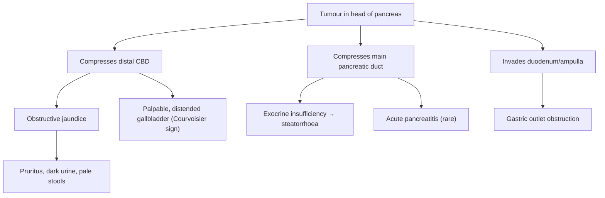
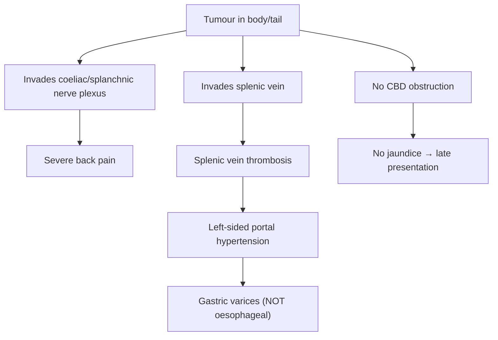

## 1. Definition

Pancreatic cancer refers to malignant neoplasms arising from the pancreas. The overwhelming majority (> 95%) are **exocrine** tumours, and of those, **> 85% are pancreatic ductal adenocarcinoma (PDAC)** — the "classic" pancreatic cancer we worry about clinically [1][2]. The word itself is straightforward: "pancreatic" = of the pancreas (Greek *pan* = all, *kreas* = flesh/meat — so named because the gland is "all flesh" with no bone or cartilage), and "carcinoma" (Greek *karkinos* = crab) denotes an epithelial malignancy.

Unless otherwise specified, "pancreatic cancer" in clinical practice and in exams almost always refers to **pancreatic ductal adenocarcinoma (PDAC)**.

Other exocrine histological subtypes (much rarer) include:
- Squamous cell carcinoma
- Acinar cell carcinoma
- Undifferentiated (anaplastic) carcinoma
- Pancreatoblastoma (rare, mainly paediatric)
- Adenosquamous carcinoma

**Endocrine (neuroendocrine) pancreatic tumours** (e.g., insulinoma, gastrinoma) account for < 5% of pancreatic malignancies and have a fundamentally different biology, treatment, and prognosis [1][2].

> ***Periampullary cancers*** — a group of cancers arising around the ampulla of Vater — include pancreatic head cancer, ampullary carcinoma, distal cholangiocarcinoma, and duodenal carcinoma. They all present similarly (painless obstructive jaundice) but have different prognoses. Ampullary carcinoma has the best prognosis (5-year survival ~40–60%), while PDAC has the worst (~10%) [3].

<Callout title="High Yield Concept">
***Painless progressive obstructive jaundice*** is the hallmark presentation of **pancreatic head cancer** — it is the single most important clinical clue. The differential for painless jaundice with a palpable gallbladder (Courvoisier's sign) is essentially periampullary malignancy until proven otherwise [3][4].
</Callout>

---

## 2. Epidemiology

### Global
- Pancreatic cancer is the **7th leading cause of cancer death worldwide** and one of the most lethal solid malignancies.
- Incidence is rising globally.
- 5-year overall survival remains dismal: **~10–12%** across all stages (one of the lowest of any cancer).
- ***Median age at diagnosis: ~70 years*** — it is predominantly a disease of the elderly [1][2].
- ***Slight male predominance*** (M:F ≈ 1.3:1) [1].

### Hong Kong Context
- Pancreatic cancer is the **5th most common cause of cancer death** in Hong Kong (2022 data from the Hong Kong Cancer Registry).
- Incidence has been steadily increasing, likely related to ageing population, rising obesity, and diabetes prevalence.
- Annual incidence: approximately 900–1000 new cases/year in Hong Kong.
- Because Hong Kong has a high prevalence of hepatitis B-related HCC and cholangiocarcinoma, pancreatic cancer must be distinguished from other hepatobiliary malignancies presenting with jaundice.

### Key Epidemiological Facts
| Feature | Detail |
|---|---|
| Peak incidence | 60–80 years |
| Sex | Male > Female (1.3:1) |
| 5-year survival (all stages) | ~10–12% |
| 5-year survival (resected, node-negative) | 25–30% |
| 5-year survival (resected, node-positive) | ~10% |
| ***Median survival (unresectable locally advanced)*** | ***~12 months*** |
| ***Median survival (metastatic)*** | ***~6 months*** |
| % diagnosed at localized stage | Only ~8% |
| % diagnosed with distant metastases | ~53% (majority) |

The reason the prognosis is so poor is multifactorial:
1. **Late presentation** — the retroperitoneal location means symptoms appear late.
2. **Aggressive biology** — dense desmoplastic stroma, early perineural/vascular invasion, early micrometastases.
3. **Chemoresistance** — the dense stroma acts as a drug delivery barrier.

<Callout title="Why is pancreatic cancer so deadly?" type="idea">
Think of it as "the perfect storm": located deep in the retroperitoneum (so symptoms come late), surrounded by major vessels (SMA, SMV, celiac axis, portal vein — so even small tumours become unresectable), biologically aggressive (early neural/lymphovascular invasion), and wrapped in dense fibrotic stroma (which shields tumour cells from chemotherapy and immune cells).
</Callout>

---

## 3. Risk Factors

### Non-Modifiable Risk Factors

| Risk Factor | Explanation |
|---|---|
| **Advanced age** | Cumulative somatic mutations over time; peak incidence 60–80 years |
| ***Male sex*** | Slight male predominance, possibly related to higher rates of smoking and alcohol use historically [1] |
| **Non-O blood group** (A, B, AB) | ABO blood group antigens are expressed on pancreatic ductal epithelium; non-O groups have ~30% increased risk. The mechanism is not fully elucidated but may relate to altered inflammatory/immune signaling via ABO glycosyltransferases |
| **Family history** (1st-degree relative) | 2-fold increased risk with one affected 1st-degree relative; risk increases further with more affected relatives |
| **Hereditary cancer syndromes** | See below |
| **Race/Ethnicity** | Higher incidence in Black populations (globally); in HK, this is less relevant |

### Hereditary/Genetic Risk Factors

Approximately **5–10% of pancreatic cancers** have a hereditary component. Key syndromes:

| Syndrome | Gene | Key Associations |
|---|---|---|
| ***Hereditary breast-ovarian cancer (HBOC)*** | ***BRCA1, BRCA2*** | ***BRCA2 carriers have ~3.5-fold increased risk of pancreatic cancer; BRCA1 has a smaller but real increase*** [5][6] |
| ***Lynch syndrome (HNPCC)*** | ***MMR genes (MLH1, MSH2, MSH6, PMS2)*** | Autosomal dominant; ↑ risk of colorectal, endometrial, ovarian, and pancreatic cancer |
| ***Peutz-Jeghers syndrome*** | ***STK11/LKB1*** | ~130-fold increased risk of pancreatic cancer; mucocutaneous pigmentation + GI hamartomatous polyps |
| Familial atypical multiple mole melanoma (FAMMM) | ***CDKN2A (p16)*** | Multiple atypical naevi + melanoma + ↑ pancreatic cancer risk (13–22-fold) |
| Hereditary pancreatitis | PRSS1, SPINK1, CFTR | Recurrent pancreatitis from childhood → chronic pancreatitis → malignant transformation (~40% lifetime risk by age 70) |
| Li-Fraumeni syndrome | TP53 | Multiple cancers including pancreatic |
| Familial pancreatic cancer | PALB2, ATM, and others | ≥2 first-degree relatives with PDAC without an identified syndrome |

<Callout title="BRCA2 and Pancreatic Cancer" type="idea">
***BRCA2 is the most common identifiable germline mutation in familial pancreatic cancer.*** This is clinically important because BRCA-mutated PDAC responds to **platinum-based chemotherapy** and **PARP inhibitors** (e.g., olaparib — maintenance after platinum-based chemo in metastatic disease, based on the POLO trial). The lecture slide on BRCA2 specifically notes: ***"Increased risk of prostate, laryngeal, bile duct, stomach, colon (minimal), melanoma and pancreatic cancers (~1.5–3 fold risk)"*** [5].
</Callout>

### Modifiable Risk Factors

| Risk Factor | Mechanism / Explanation |
|---|---|
| ***Smoking*** | ***~3× increased risk*** [2]; most important modifiable risk factor. Tobacco carcinogens (nitrosamines, polycyclic aromatic hydrocarbons) reach the pancreas via bloodstream and reflux into the pancreatic duct. Dose-dependent; risk decreases after cessation but takes ~10–20 years to normalize |
| ***Chronic pancreatitis*** | Chronic inflammation → repeated injury-repair cycles → accumulation of somatic mutations → malignant transformation. ~2% lifetime risk of pancreatic cancer in chronic pancreatitis patients [2][7] |
| ***Diabetes mellitus*** | Complex bidirectional relationship: (1) Long-standing T2DM is a modest risk factor (~1.5–2× risk), likely via insulin resistance/hyperinsulinemia promoting growth; (2) ***New-onset diabetes (within 1–3 years) can be the FIRST manifestation of occult pancreatic cancer*** — the tumour produces diabetogenic factors (e.g., adrenomedullin, S100A8 calcium-binding protein) that impair β-cell function [1] |
| ***Obesity*** | BMI > 30 increases risk by ~20–40%; central adiposity is particularly important. Mechanisms: chronic low-grade inflammation, insulin resistance, altered adipokine signaling |
| **Physical inactivity** | Related to obesity and insulin resistance pathway |
| ***Heavy alcohol use*** | Primarily through causing chronic pancreatitis; independent modest risk factor at very high consumption levels |
| **Dietary factors** | High saturated fat/protein, processed meat, low fruit/vegetable intake. Western-type diet increases risk |
| ***Pancreatic cysts (premalignant)*** | ***Intraductal papillary mucinous neoplasm (IPMN)*** is the most important neoplastic cyst with malignant potential: **main-duct IPMN** has ~60–70% risk of harbouring malignancy vs. branch-duct IPMN which is lower risk [7][8] |

### Premalignant Lesions — The Adenoma-Carcinoma Sequence

Pancreatic cancer develops through a well-characterised stepwise progression:

- **PanIN** = ***Pancreatic Intraepithelial Neoplasia*** (the most common precursor lesion)
  - PanIN-1: flat (1A) or papillary (1B) mucinous epithelium; **KRAS mutation** present in >90%
  - PanIN-2: moderate dysplasia; **p16/CDKN2A inactivation**
  - PanIN-3: carcinoma in situ; **TP53 and SMAD4/DPC4** loss
- Other precursor lesions: **IPMN** and **mucinous cystic neoplasm (MCN)**

<Callout title="The 'Big Four' Genetic Drivers of PDAC">
1. **KRAS** (oncogene activation) — present in > 90% of PDAC, the earliest and most universal driver
2. **CDKN2A/p16** (tumour suppressor loss) — ~90%
3. **TP53** (tumour suppressor loss) — ~75%
4. **SMAD4/DPC4** (tumour suppressor loss) — ~55%; loss correlates with widespread metastatic disease

These accumulate in sequence during the PanIN → PDAC progression.
</Callout>

---

## 4. Anatomy and Function

Understanding the anatomy is absolutely critical for appreciating why pancreatic cancer presents the way it does and why surgery is so complex.

### Gross Anatomy

The pancreas is a **retroperitoneal** organ lying transversely across the posterior abdominal wall at the level of L1–L2. It is approximately 15–20 cm long and weighs ~80–100 g.

| Part | Location | Relations |
|---|---|---|
| **Head** | Nestled within the C-loop of the duodenum (D2) | Anterior: transverse colon, gastrocolic omentum. Posterior: IVC, right renal vein, right crus of diaphragm. The CBD runs through or behind the head of pancreas |
| **Uncinate process** | Hook-like projection from inferior head, passes behind SMA and SMV | This is why tumours here can encase the SMA early |
| **Neck** | Overlies SMA/SMV junction (portal vein formed here) | Narrowest portion; tumour here can compress the portal vein |
| **Body** | Crosses the aorta at L2, behind the stomach | Posterior: aorta, left crus, left adrenal, left kidney, splenic vein |
| **Tail** | Extends to the splenic hilum | Intimate relationship with splenic vessels; this is why distal pancreatectomy often requires splenectomy |

### Key Vascular Relationships (Critical for Resectability)

***The relationship of the tumour to major vessels determines resectability — this is the single most important factor in surgical planning*** [3][4]:

- ***Superior Mesenteric Artery (SMA)*** — runs behind the neck/uncinate; involvement = usually unresectable
- ***Superior Mesenteric Vein (SMV)*** / ***Portal Vein (PV)*** — can be resected and reconstructed if involved < 180°
- ***Celiac trunk*** — involvement usually precludes resection
- ***Common Hepatic Artery (CHA)*** — limited involvement may be amenable to resection in borderline cases
- **Splenic artery and vein** — course along the superior and posterior border of the body/tail

### Ductal Anatomy

- The **main pancreatic duct (duct of Wirsung)** runs the entire length of the pancreas and joins the CBD at the **ampulla of Vater (hepatopancreatic ampulla)**, which opens into D2 via the **major duodenal papilla**.
- The **accessory duct (duct of Santorini)** drains the uncinate process and opens at the **minor duodenal papilla**.
- **Head tumours compress the distal CBD and/or main pancreatic duct → "double duct sign" on imaging** (simultaneous dilatation of both CBD and pancreatic duct, with abrupt cutoff at the head) [2][3].

### Why Does Anatomy Matter Clinically?

| Anatomical relationship | Clinical consequence |
|---|---|
| CBD passes through/behind pancreatic head | Head tumours → early biliary obstruction → jaundice (this is why head tumours present earlier than body/tail tumours) |
| Pancreatic duct drains through head | Head tumours → pancreatic duct obstruction → exocrine insufficiency (steatorrhoea), acute pancreatitis |
| Retroperitoneal location | (1) Late presentation (no early peritoneal signs), (2) back pain from coeliac/splanchnic nerve plexus invasion |
| Proximity to SMA, celiac axis, PV/SMV | Even small tumours may be unresectable due to vascular encasement |
| Tail near splenic hilum | Tail tumours → splenic vein thrombosis → left-sided (sinistral) portal hypertension → gastric varices |
| Duodenal proximity | Head tumours → duodenal obstruction → gastric outlet obstruction (GOO) |

### Pancreatic Function

| Function | Component | Product | Clinical Implication When Lost |
|---|---|---|---|
| **Exocrine** (95% of parenchyma) | Acinar cells | Digestive enzymes: lipase, amylase, trypsinogen, chymotrypsinogen | Maldigestion → **steatorrhoea**, fat-soluble vitamin deficiency (A, D, E, K), weight loss |
| **Exocrine** | Ductal cells | Bicarbonate-rich fluid (neutralises gastric acid in duodenum) | Impaired neutralisation |
| **Endocrine** (5% — islets of Langerhans) | β-cells | Insulin | **Diabetes mellitus** |
| **Endocrine** | α-cells | Glucagon | Rare clinical consequence |
| **Endocrine** | δ-cells | Somatostatin | Rare clinical consequence |
| **Endocrine** | PP cells | Pancreatic polypeptide | Rare clinical consequence |

<Callout title="Remember">
Exocrine insufficiency becomes clinically significant only when **> 90%** of exocrine function is lost. This is why steatorrhoea is a relatively late manifestation [7].
</Callout>

---

## 5. Etiology and Pathophysiology

### 5.1 Pathophysiology of PDAC

PDAC arises from **ductal epithelial cells** of the pancreas (though some evidence suggests acinar cells can undergo acinar-to-ductal metaplasia as an initiating event).

**Step-by-step pathogenesis:**

1. **Initiating mutation**: **KRAS** (codon 12) — activating oncogene mutation present in > 90% of PDAC. KRAS is a GTPase molecular switch; the mutation locks it in the "ON" position → constitutive activation of RAS-RAF-MEK-ERK and PI3K-AKT-mTOR proliferative signalling pathways.

2. **Tumour suppressor loss**: Sequential inactivation of CDKN2A (p16 → loss of cell cycle G1 checkpoint), TP53 (loss of DNA damage response and apoptosis), and SMAD4/DPC4 (loss of TGF-β growth-inhibitory signalling).

3. **Desmoplastic stromal reaction**: A hallmark of PDAC. The tumour elicits a massive fibrotic/inflammatory stromal response (via pancreatic stellate cells) that:
   - Creates a **hypovascular, hypoxic microenvironment** (tumour appears **hypoattenuating/hypodense on CT** because of poor blood supply — this is a key diagnostic feature) [3]
   - Acts as a **barrier to drug delivery** (contributes to chemoresistance)
   - Promotes **immune evasion** (excludes T-cells)

4. **Perineural invasion**: PDAC has a striking tropism for nerves (present in >80% of cases). Tumour cells invade perineural spaces of the splanchnic/coeliac nerve plexus → severe, unrelenting back pain.

5. **Early vascular invasion and metastasis**: Even small tumours demonstrate lymphovascular invasion. Common sites of distant metastasis:
   - ***Liver*** (most common)
   - ***Peritoneum***
   - ***Lung***
   - ***Bone*** [1][2]

### 5.2 Why Does PDAC Present So Late?

| Factor | Explanation |
|---|---|
| Retroperitoneal location | Deep in the abdomen; no peritoneal irritation until very advanced |
| Body/tail tumours: no ductal obstruction | No jaundice or steatorrhoea → symptoms are only pain and weight loss → non-specific |
| Head tumours: earlier presentation (relative) | Compression of CBD → jaundice, but by the time jaundice appears, the tumour is often already involving peripancreatic vessels |
| Dense desmoplastic stroma | Masks the tumour on imaging (makes biopsy yield lower too) |
| Vague early symptoms | Epigastric discomfort, mild weight loss, new glucose intolerance — often attributed to other causes |

### 5.3 Specific Pathophysiology by Location

#### ***Head of Pancreas (70%)*** [1]

#### ***Body and Tail of Pancreas (25–30%)*** [1]

---

## 6. Classification

### 6.1 Histological Classification (WHO)

**Exocrine tumours (> 95%)**:
- ***Ductal adenocarcinoma*** (85–90%) — the dominant type
- Adenosquamous carcinoma (~1–4%)
- Colloid (mucinous non-cystic) carcinoma
- Acinar cell carcinoma
- Undifferentiated carcinoma
- Undifferentiated carcinoma with osteoclast-like giant cells
- Pancreatoblastoma (paediatric)
- Solid pseudopapillary neoplasm (young women, indolent)

**Endocrine (neuroendocrine) tumours (< 5%)**:
- Functional: insulinoma, gastrinoma, VIPoma, glucagonoma, somatostatinoma
- Non-functional PanNETs

**Precursor lesions**:
- PanIN (grades 1–3)
- IPMN (branch-duct vs. main-duct)
- MCN (mucinous cystic neoplasm)

### 6.2 Anatomical Location

| Location | Frequency | Presentation |
|---|---|---|
| ***Head*** | ***~70%*** | ***Painless obstructive jaundice***, steatorrhoea, Courvoisier's sign |
| Body | ~15% | Epigastric pain radiating to back, weight loss |
| Tail | ~10% | Back pain, weight loss, late presentation |
| Diffuse | 5–20% | Combination; very poor prognosis |

[1][2]

### 6.3 TNM Staging (AJCC 8th Edition, 2017)

| T Stage | Definition |
|---|---|
| T1 | Tumour ≤ 2 cm (T1a ≤ 0.5 cm, T1b > 0.5–1 cm, T1c > 1–2 cm) |
| T2 | Tumour > 2 cm but ≤ 4 cm |
| T3 | Tumour > 4 cm |
| T4 | Tumour involves celiac axis, SMA, and/or common hepatic artery (regardless of size) |

| N Stage | Definition |
|---|---|
| N0 | No regional lymph node metastasis |
| N1 | 1–3 positive regional lymph nodes |
| N2 | ≥ 4 positive regional lymph nodes |

| M Stage | Definition |
|---|---|
| M0 | No distant metastasis |
| M1 | Distant metastasis present |

| AJCC Stage | T | N | M | Approximate 5-Year Survival |
|---|---|---|---|---|
| IA | T1 | N0 | M0 | ~34% |
| IB | T2 | N0 | M0 | ~25% |
| IIA | T3 | N0 | M0 | ~15% |
| IIB | T1–T3 | N1 | M0 | ~10% |
| III | T1–T3 (N2) or T4 (any N) | N2 or any | M0 | ~3–5% |
| IV | Any T | Any N | M1 | < 3% |

### 6.4 Resectability Classification (NCCN)

***This is arguably the most clinically important classification as it directly determines management*** [3][4]:

| Category | Definition | Management |
|---|---|---|
| ***Resectable*** | No arterial contact (SMA, celiac, CHA); no venous contact or ≤ 180° contact of SMV/PV without irregularity | ***Upfront surgery → adjuvant chemotherapy*** |
| ***Borderline resectable*** | Arterial: ≤ 180° contact with SMA or CHA (without extension to celiac axis); Venous: > 180° contact of SMV/PV, or ≤ 180° with irregular contour, or SMV/PV thrombosis if reconstruction feasible | ***Neoadjuvant chemotherapy ± CRT → restaging → surgery if response*** |
| ***Locally advanced (unresectable)*** | Arterial: > 180° contact with SMA or celiac; Venous: unreconstructable SMV/PV | ***Definitive chemotherapy ± radiation (palliative intent; conversion surgery in select responders)*** |
| ***Metastatic*** | Distant organ involvement | ***Palliative systemic chemotherapy*** |

<Callout title="Determining Resectability" type="error">
A common exam mistake is thinking that "large tumour = unresectable." In reality, **it is the relationship to major arteries (SMA, celiac axis, CHA) that determines resectability, NOT the tumour size.** A 1.5 cm tumour encasing the SMA is unresectable, whereas a 5 cm tumour that does not contact major vessels may be resectable [3][4].
</Callout>

---

## 7. Clinical Features

### Overview Approach

The clinical presentation of pancreatic cancer depends critically on **tumour location** (head vs. body/tail) and **stage** (local vs. advanced/metastatic). The key teaching point is:

- **Head tumours → present earlier** (because of biliary obstruction causing jaundice)
- **Body/tail tumours → present late** (no biliary obstruction; only pain and constitutional symptoms)

***"Pancreatic cancer is a great mimicker — it can present as back pain, new-onset diabetes, unexplained DVT, or depression before anyone thinks of the pancreas."***

### 7.1 Symptoms

#### A. Cardinal Symptoms

| Symptom | Location | Pathophysiological Basis |
|---|---|---|
| ***Painless progressive obstructive jaundice*** | ***Head*** | Tumour in the head compresses/invades the intrapancreatic portion of the **common bile duct (CBD)** → progressive obstruction → conjugated hyperbilirubinaemia → jaundice. It is *painless* because the obstruction is gradual (unlike gallstone impaction which causes colicky pain). ***This is the classic presentation*** [1][2][3][4] |
| ***Severe epigastric pain radiating to the back*** | ***Body/Tail (also head)*** | The pancreas sits on the retroperitoneal structures including the **coeliac (solar) plexus** and **splanchnic nerves**. Tumour growth posteriorly invades these nerve plexuses → deep, gnawing, relentless visceral pain radiating to the mid-back. ***Retroperitoneal infiltration*** is the key mechanism [1][2][3] |
| **Weight loss / Anorexia** | Any | Multifactorial: (1) Cancer cachexia (TNF-α, IL-6 mediated), (2) Exocrine insufficiency → maldigestion/malabsorption, (3) Biliary obstruction → reduced bile salts → fat malabsorption, (4) Anorexia from tumour-derived cytokines, (5) GOO if present |

#### B. Symptoms of Biliary Obstruction

| Symptom | Pathophysiological Basis |
|---|---|
| **Pruritus** | Bile salt deposition in the skin due to cholestasis. Bile salts activate itch receptors (TGR5 and possibly MRGPRX4 receptor) in cutaneous sensory nerve fibres. Can be extremely distressing and may precede clinical jaundice |
| ***Dark urine (tea/cola-coloured)*** | With CBD obstruction, conjugated bilirubin cannot be excreted into the gut. It backs up into the blood → is filtered by the kidneys (conjugated bilirubin is water-soluble) → dark urine [1] |
| ***Pale/clay-coloured stools (acholic stools)*** | Bilirubin cannot reach the gut → no bacterial conversion to stercobilinogen/stercobilin (which normally gives stool its brown colour) → pale, putty-like stools [1] |
| **Steatorrhoea** | Two mechanisms in head tumours: (1) **Bile salt deficiency** — obstruction of CBD prevents bile salts from reaching the duodenum → impaired fat emulsification, (2) **Pancreatic lipase deficiency** — obstruction of the pancreatic duct → loss of exocrine enzyme delivery → fat maldigestion → bulky, pale, foul-smelling, floating stools [1][2] |

#### C. Symptoms of Pancreatic Insufficiency

| Symptom | Pathophysiological Basis |
|---|---|
| **Steatorrhoea and maldigestion** | Loss of exocrine pancreatic function (requires > 90% loss to become clinically apparent). Pancreatic duct obstruction by tumour → absence of lipase, amylase, proteases in the duodenum → fat and protein maldigestion |
| ***New-onset diabetes mellitus*** | Tumour destruction of islets of Langerhans → loss of β-cells → insulin deficiency. ALSO, tumour secretes diabetogenic factors (adrenomedullin, S100A8) that impair insulin secretion and signalling. ***New-onset DM in an elderly patient (especially with weight LOSS rather than gain) should raise suspicion for occult pancreatic cancer*** [1][2] |

<Callout title="New-Onset DM as a Red Flag" type="error">
***Glucose intolerance is present in ~80% and overt DM in ~50% of pancreatic cancer patients at diagnosis*** [1]. The typical T2DM patient gains weight; a patient with pancreatic cancer-related DM is LOSING weight. New-onset diabetes in a patient > 50 with unexplained weight loss = think pancreatic cancer.
</Callout>

#### D. Other Symptoms

| Symptom | Pathophysiological Basis |
|---|---|
| **Nausea and vomiting** | (1) Constitutional/cancer cachexia effect, (2) ***Gastric outlet obstruction (GOO)*** — tumour in pancreatic head/uncinate process invades or externally compresses the duodenum (D2/D3) [1][2] |
| **Fatigue and weakness** | Anaemia (chronic disease, malabsorption of iron/B12/folate), cancer cachexia, malnutrition |
| ***Acute pancreatitis*** | Tumour occluding the main pancreatic duct → upstream ductal hypertension → premature activation of pancreatic enzymes → acute pancreatitis. Unexplained acute pancreatitis in a patient > 50 without obvious cause (no gallstones, no alcohol) should prompt imaging to exclude pancreatic cancer [1][2] |
| **Depression / Psychological disturbance** | Pancreatic cancer has a notably high association with depression, even before diagnosis. The mechanism is unclear — possibly related to paraneoplastic neuropsychiatric effects, or cytokine-mediated central effects |

#### E. Pain Characteristics (Detailed)

| Feature | Description |
|---|---|
| **Site** | Epigastric |
| **Onset** | Insidious (weeks to months); rarely acute (pancreatitis) |
| **Character** | Deep, gnawing, visceral quality |
| **Radiation** | To the sides and back (bilateral, band-like). ***Severe back pain suggests body/tail tumour invading coeliac/mesenteric plexus*** [1] |
| **Associated symptoms** | Jaundice, weight loss, anorexia |
| **Time course** | Present for 1–2 months at time of presentation; progressive |
| **Exacerbating factors** | ***Eating, lying supine, nighttime*** [1] |
| **Relieving factors** | ***Curled/fetal position, leaning forward*** (because this takes pressure off the retroperitoneal structures/coeliac plexus) [1] |

### 7.2 Signs

#### A. Signs of Biliary Obstruction

| Sign | Explanation |
|---|---|
| **Jaundice** (scleral icterus, skin) | Visible when serum bilirubin > 34–50 μmol/L. Best seen in sclerae (bilirubin has high affinity for elastin). Predominantly conjugated (direct) hyperbilirubinaemia in obstructive jaundice |
| ***Courvoisier's sign*** | ***Painless jaundice + palpable, distended gallbladder.*** Courvoisier's law states: "In the presence of obstructive jaundice, a palpable gallbladder is unlikely to be due to gallstones" — because chronic gallstone disease causes a fibrotic, non-distensible gallbladder. A malignant, gradual obstruction of the distal CBD allows the gallbladder to distend progressively [1][3][4] |
| **Scratch marks (excoriations)** | From intractable pruritus due to bile salt deposition in skin |
| **Hepatomegaly** | Cholestatic liver; back-pressure from biliary obstruction |

<Callout title="Courvoisier's Sign — Classic Exam Favourite">
***Courvoisier's sign: Painless jaundice + palpable, non-tender, distended gallbladder = malignant distal CBD obstruction until proven otherwise.*** The most common cause is pancreatic head cancer. Remember: gallstones cause a fibrotic, shrunken gallbladder that cannot distend, whereas a slowly growing tumour causes gradual, painless distension [3][4].
</Callout>

#### B. Signs of Metastatic / Advanced Disease

| Sign | Pathophysiology |
|---|---|
| **Hepatomegaly (nodular/irregular)** | Liver metastases — the liver is the most common site of distant spread |
| **Ascites** | Peritoneal carcinomatosis → malignant ascites (exudative, high protein, high LDH, may contain malignant cells on cytology) |
| ***Virchow's node (left supraclavicular lymphadenopathy)*** | Metastatic spread via thoracic duct → left supraclavicular (Virchow's) node. Named after Rudolf Virchow. Also called ***Troisier's sign*** [1] |
| ***Sister Mary Joseph's nodule*** | ***Palpable periumbilical mass*** — metastatic deposit at the umbilicus via peritoneal spread along the falciform ligament or direct seeding [1] |
| **Blumer's shelf** | Palpable mass on rectal exam (drop metastasis to the pouch of Douglas / rectovesical pouch) |
| ***Abdominal mass*** | Palpable epigastric mass = usually advanced disease [1] |
| **Cachexia** | Profound wasting — temporal wasting, loss of subcutaneous fat, muscle wasting |

#### C. Paraneoplastic Manifestations

| Manifestation | Mechanism |
|---|---|
| ***New-onset DM*** | Tumour-secreted diabetogenic factors + islet destruction [1] |
| ***Trousseau's syndrome (migratory superficial thrombophlebitis)*** | ***Tumour-elaborated procoagulants*** (tissue factor, cancer procoagulant — a cysteine protease that directly activates factor X) ***and platelet-aggregating factors*** create a **hypercoagulable state**. Manifests as migratory thrombophlebitis (different veins at different times) or DVT/PE. Armand Trousseau himself died of gastric cancer with this syndrome [1][2] |
| ***Pancreatic panniculitis*** | ***Erythematous subcutaneous nodular fat necrosis, typically on legs.*** Caused by ***systemic spillage of excess digestive pancreatic enzymes*** (especially lipase from **acinar cell carcinoma**) → **autodigestion of subcutaneous fat** [1] |
| **Paraneoplastic pemphigoid** | Autoimmune blistering skin disorder; rare [2] |
| **Depression** | Occurs with disproportionate frequency; mechanism unclear (cytokine-mediated?) |

### 7.3 Comparison: Head vs. Body/Tail

| Feature | ***Pancreatic Head*** | ***Pancreatic Body/Tail*** |
|---|---|---|
| **Frequency** | ***~70%*** | ***~25–30%*** |
| **Presenting symptom** | ***Painless obstructive jaundice*** | ***Severe epigastric/back pain*** |
| **Jaundice** | ***Early and common*** | Late (only with liver mets or direct extension) |
| **Courvoisier's sign** | ***Yes*** | No |
| **Steatorrhoea** | ***Common*** (CBD + pancreatic duct obstruction) | Less common |
| **Back pain** | Present but may be less severe | ***Prominent — indicates coeliac/splanchnic plexus invasion*** [1] |
| **GOO** | ***Possible*** (D2 compression) | Rare |
| **Diagnosis timing** | Relatively earlier (jaundice prompts investigation) | ***Late — most are advanced/metastatic at presentation*** |
| **Resectability** | ***~15–20% resectable at diagnosis*** | ***Rarely resectable*** |
| **Operation** | ***Pancreaticoduodenectomy (Whipple)*** [3][4] | ***Distal pancreatectomy ± splenectomy*** [1] |

[1][2][3][4]

---

## 8. Summary Table: Putting It All Together

| Aspect | Key Points |
|---|---|
| Definition | Malignant epithelial neoplasm of pancreas; > 85% PDAC |
| Epidemiology | 5th cause cancer death in HK; peak age 60–80; M > F; 5-yr survival ~10% |
| Location | 70% head, 15% body, 10% tail, 5–20% diffuse |
| Risk factors | Smoking (most important modifiable), chronic pancreatitis, DM, obesity, IPMN, BRCA2, Lynch, Peutz-Jeghers, FAMMM |
| Genetics | KRAS (> 90%), CDKN2A, TP53, SMAD4 |
| Head presentation | Painless obstructive jaundice, Courvoisier's sign, steatorrhoea, dark urine, pale stools |
| Body/tail presentation | Severe back pain, weight loss, late diagnosis |
| Metastasis sites | Liver > peritoneum > lung > bone |
| Paraneoplastic | New-onset DM, Trousseau syndrome, pancreatic panniculitis |
| Resectability | Determined by arterial involvement (SMA, celiac, CHA), not tumour size |

---

<Callout title="High Yield Summary">

1. **Pancreatic cancer ≈ PDAC** (> 85%) — retroperitoneal, aggressive, dense desmoplastic stroma, poor prognosis (5-yr survival ~10%).

2. ***Painless progressive obstructive jaundice*** = hallmark of **pancreatic head cancer**; ***Courvoisier's sign*** = painless jaundice + palpable gallbladder.

3. ***Body/tail tumours present LATE*** with severe back pain (coeliac plexus invasion) and are rarely resectable.

4. **Key risk factors**: Smoking (~3× risk), chronic pancreatitis, DM (new-onset DM can be the first sign!), obesity, BRCA2 (most common hereditary gene), Lynch syndrome, Peutz-Jeghers, FAMMM, IPMN.

5. **Genetic drivers**: KRAS (> 90%), CDKN2A, TP53, SMAD4 — sequential accumulation through PanIN stages.

6. ***Resectability is determined by vascular involvement*** (SMA, celiac axis, CHA, SMV/PV), **NOT** tumour size.

7. ***Trousseau's syndrome*** (migratory superficial thrombophlebitis) = hypercoagulable paraneoplastic state; ***pancreatic panniculitis*** = subcutaneous fat necrosis from enzyme spillage.

8. ***New-onset DM in elderly patient + weight loss = suspect pancreatic cancer*** until proven otherwise.

9. **Sites of metastasis**: Liver (most common) > Peritoneum > Lung > Bone.

10. The ***"double duct sign"*** on imaging (dilated CBD + dilated pancreatic duct) is highly suggestive of pancreatic head malignancy.

</Callout>

---

<ActiveRecallQuiz
  title="Active Recall - Pancreatic Cancer (Definition to Clinical Features)"
  items={[
    {
      question: "A 68-year-old man presents with painless jaundice and a palpable, non-tender gallbladder. What is this sign called, what does it suggest, and why can the gallbladder distend in this scenario but not in gallstone disease?",
      markscheme: "Courvoisier's sign. Suggests malignant distal CBD obstruction (most commonly pancreatic head cancer). In gallstone disease, chronic inflammation causes a fibrotic, non-distensible gallbladder. In malignancy, gradual obstruction allows progressive distension of the gallbladder."
    },
    {
      question: "Name the four most commonly mutated genes in PDAC in order of the PanIN progression sequence and state the approximate frequency of each.",
      markscheme: "1. KRAS (>90%) - earliest, oncogene activation. 2. CDKN2A/p16 (~90%) - tumour suppressor loss, G1 checkpoint. 3. TP53 (~75%) - loss of DNA damage response. 4. SMAD4/DPC4 (~55%) - loss of TGF-beta signalling; correlates with widespread metastasis."
    },
    {
      question: "Explain why body/tail pancreatic cancers present later and have a worse prognosis than head tumours.",
      markscheme: "Body/tail tumours do not obstruct the CBD so they do not cause early jaundice. Symptoms are non-specific (back pain, weight loss). By the time of diagnosis, most are locally advanced (coeliac plexus invasion) or metastatic. Hence rarely resectable."
    },
    {
      question: "What is Trousseau's syndrome, what is the underlying mechanism, and with which cancers is it classically associated?",
      markscheme: "Migratory superficial thrombophlebitis (thrombosis in different veins at different times). Caused by tumour-secreted procoagulants (tissue factor, cancer procoagulant activating factor X) and platelet-aggregating factors creating a hypercoagulable state. Classically associated with pancreatic cancer and gastric cancer."
    },
    {
      question: "A 72-year-old woman with no prior history of diabetes presents with new-onset diabetes and 8 kg weight loss over 3 months. Why should pancreatic cancer be suspected, and what is the pathophysiological mechanism?",
      markscheme: "New-onset DM in elderly patient with weight loss (rather than weight gain typical of T2DM) is a red flag for occult pancreatic cancer. Mechanism: tumour destruction of islets of Langerhans plus secretion of diabetogenic factors (adrenomedullin, S100A8) impairing beta-cell function and insulin signalling. Glucose intolerance present in ~80% of PDAC patients."
    },
    {
      question: "What determines resectability in pancreatic cancer, and what are the key vessels assessed? Give one example of a borderline resectable scenario.",
      markscheme: "Resectability is determined by relationship to major vessels, NOT tumour size. Key vessels: SMA, celiac axis, common hepatic artery (arterial); SMV, portal vein (venous). Borderline resectable example: tumour with 180 degrees or less contact with SMA without extension to celiac axis, or greater than 180 degrees venous contact with SMV/PV but reconstructable."
    }
  ]}
/>

## References

[1] Senior notes: felixlai.md (Pancreatic cancer section)
[2] Senior notes: maxim.md (Pancreatic carcinoma section)
[3] Lecture slides: Malignant biliary obstruction.pdf
[4] Lecture slides: WCS 056 - Painless jaundice and epigastric mass - by Prof R Poon.ppt (1).pdf
[5] Lecture slides: The Managment of breast cancer_Prof A Kwong 20_2_2020.pdf (p32 — BRCA2 lifetime risk)
[6] Lecture slides: GC 202. Surgery may cure your cancer Surgical oncology.pdf
[7] Senior notes: maxim.md (Chronic pancreatitis / Pancreatic cyst sections)
[8] Senior notes: maxim.md (Pancreatic cyst — IPMN section)
