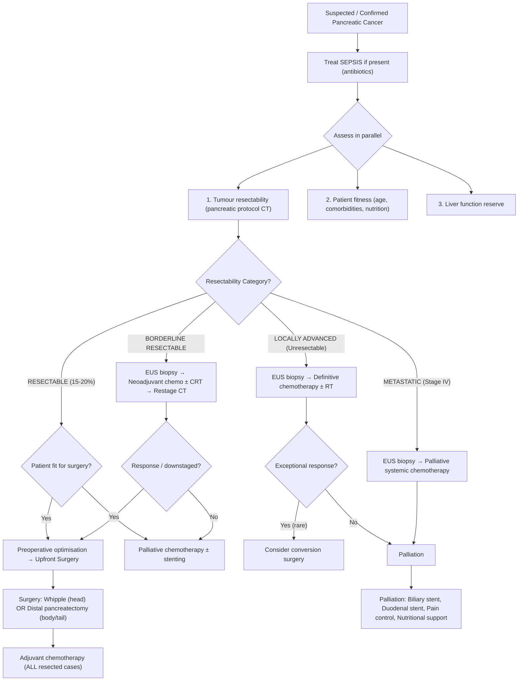

## Management of Pancreatic Cancer

### Overarching Treatment Philosophy

The management of pancreatic cancer is governed by **two parallel assessments** that must be made before any treatment decision [1][3][4]:

1. **Patient general status** — Is the patient fit enough for major surgery? (age, comorbidities, nutrition, organ function)
2. **Tumour status** — Is the tumour confined (resectable) or has it spread (unresectable/metastatic)?

***The lecture slide by Prof R Poon elegantly summarises this decision framework*** [4]:

> ***General status: good → laparotomy; bad → PTBD or endoprosthesis***
> ***Tumour status: confined → laparotomy → radical resection if confined, bypass if spread; spread → PTBD or endoprosthesis***

***The lecture on MBO further distils the approach*** [3]:

> ***MBO → Treat SEPSIS → (1) Assess tumour resectability, (2) Patient general fitness, (3) Liver function reserve → Resectable vs. Non-resectable → Resectable = Surgery; Non-resectable = Palliation***

The single most critical teaching point: ***Surgical treatment is the ONLY potentially curative treatment for pancreatic cancer, but only 15–20% of patients are surgical candidates*** because the majority present with locally advanced or metastatic disease [1][2][4].

---

### Master Management Algorithm

---

### 1. Preoperative Optimisation — Preparing the Patient

Before any surgery for pancreatic cancer, several issues must be addressed. These patients are high-risk because of the combination of **cancer cachexia + obstructive jaundice + malnutrition + coagulopathy** [1][11]:

| Issue | Problem | Intervention |
|---|---|---|
| ***Cancer cachexia → Malnutrition*** | Poor wound healing, immunosuppression, increased surgical risk | ***Nutritional support*** (enteral preferred: oral supplements, nasojejunal feeding) [1][11] |
| ***Liver derangement → Bleeding tendency*** | Vitamin K deficiency from bile salt malabsorption → ↓ factors II, VII, IX, X → prolonged PT/INR | ***IV Vitamin K*** (takes 24–48h) ***+ FFP during surgery*** if needed [1][11] |
| ***Superimposed biliary infection*** | Cholangitis risk from biliary stasis | ***Antibiotic cover*** (e.g., Augmentin OR Cefuroxime + Metronidazole) [1][11][13] |
| **Electrolyte abnormalities** | Hyponatraemia, hypokalaemia from vomiting/poor intake | Correct preoperatively |
| **Blood products** | Major vascular surgery risk | Type and screen / crossmatch |

#### Preoperative Biliary Drainage — A Nuanced Decision

This is one of the most commonly tested management dilemmas:

| Aspect | Detail |
|---|---|
| **Methods** | ERCP with endoprosthesis (stenting) or PTBD [1][2] |
| ***Target*** | ***Serum bilirubin < 50 μmol/L*** [1][11] |
| ***Theoretically*** | ***Do NOT need to drain if no sepsis + early surgery can be offered within 1–2 weeks*** — preoperative biliary drainage increases risk of serious complications (cholangitis, pancreatitis, perforation) even in expert hands, while surgical-related complications are comparable without drainage [1][2][11] |
| ***Practically at QMH*** | ***Drain ALL patients since QMH cannot offer early surgery*** — Whipple operation has to wait 6–8 weeks, and the chance of biliary sepsis will be very high without drainage while waiting [1][11] |
| ***Stent choice*** | ***Plastic stent is preferred for preoperative drainage*** (cf. metal stent which induces inflammation → difficult removal in OT) [2]; ***Metallic stent (SEMS) is preferred if confirmed inoperable*** since it is more durable [1][13] |
| **Advantages** | Minimise cholangitis risk, relieve jaundice/pruritus, prevent cholestatic complications, allow time for neoadjuvant therapy [1][11] |
| **Disadvantages** | Increase interventions and costs, procedure-related complications (cholangitis, pancreatitis, bleeding, perforation, blocked stent) [1][11] |
| ***Indications for preop drainage*** | (1) Biliary sepsis/cholangitis, (2) Surgery cannot be arranged within 1–2 weeks, (3) Severe jaundice (bilirubin > 250–300 μmol/L), (4) Neoadjuvant therapy planned [1][2] |

> ***Pre-op ERCP for biliary drainage: NOT routine, only if septic / OT cannot be arranged in 1–2 weeks. Plastic stent is preferred*** [2].

<Callout title="Preoperative Drainage — Theory vs. Practice" type="error">
In exams, the "textbook" answer is: ***do NOT drain routinely if early surgery is possible*** (evidence shows drainage increases infections without improving outcomes). But the ***practical QMH answer*** is: ***drain ALL*** because surgical wait times are long (6–8 weeks) and the risk of biliary sepsis during this period is unacceptable [1][11]. Know both perspectives.
</Callout>

---

### 2. Curative Treatment — Surgical Resection

***Principle: Upfront pancreatectomy (+ local lymphadenectomy) + adjuvant chemotherapy (ALL cases) ± RT*** [2].

#### A. Resectability Criteria

***The lecture slide explicitly states the criteria of resectability*** [3]:

> ***Criteria of Resectability:***
> - ***No distant metastases***
> - ***SMA and celiac axis not involved***
> - ***Patent superior mesenteric-portal venous confluence***
> - ***PV involvement is NOT an absolute contraindication***
>   - ***Venous resection is appropriate to improve resectability and achieve R0 resection***
>   - ***Significant morbidity and mortality***
>   - ***Reasonable survival: median = 13 months, 5-year = 7%*** [3]

***Absolute contraindications to resection*** [2]:

| Contraindication | Reason |
|---|---|
| ***SMA / celiac trunk encasement > 180°*** | Cannot safely reconstruct; attempting resection = unacceptably high morbidity |
| ***Unreconstructible SMV / portal vein*** | No suitable vessel proximal and distal for interposition graft |
| ***Distant metastasis*** | Systemic disease — surgery does not improve survival |

***Borderline resectable*** (may still be resectable after neoadjuvant therapy) [2]:

- Tumour contact < 180° with SMA (relative, not absolute contraindication)
- SMV/PV involvement but suitable vessel proximal and distal for interposition graft reconstruction

#### B. Staging Laparoscopy — The Final Check Before Committing

| Aspect | Detail |
|---|---|
| **Purpose** | ***No promise of resection until laparotomy/laparoscopy documents absence of spread*** [1][11] |
| **Technique** | General exploration of peritoneal surfaces; look for ***peritoneal nodules*** → send for ***frozen section*** to rule out malignancy if suspicious [1][11] |
| ***Indications*** | Body/tail tumours, large tumours > 4 cm, high CA 19-9, equivocal CT findings [1] |
| **Intra-op USG** | Used to rule out liver metastases not seen on preop imaging [2] |
| **If metastases found** | ***Surgery should be aborted*** → convert to palliative management [1] |

#### C. Whipple's Operation (Pancreaticoduodenectomy) — For Head/Uncinate Tumours

***The lecture explicitly states: "Whipple operation for carcinoma of pancreas, distal CBD cholangiocarcinoma, CA duodenum and CA ampulla"*** [3].

***Prof R Poon's slide: "Line of resection of pancreatic head cancer — Whipple operation or pancreaticoduodenectomy"*** [4].

##### What Gets Removed?

| Structure Resected | Reason |
|---|---|
| **Pancreatic head** | Contains the tumour |
| **Duodenum (D1–D4 or D2–D4)** | Shares blood supply with pancreatic head (via pancreaticoduodenal arteries); cannot survive without pancreatic head blood supply |
| **First 15 cm of jejunum** | Distal to ligament of Treitz, included for oncological margin |
| **Common bile duct** | Runs through/behind pancreatic head; must be transected and reconstructed |
| **Gallbladder + cystic duct** | Removed with CBD |
| **Partial gastrectomy** (classic Whipple) OR **preservation of pylorus** (PPPD) | See below |
| **Regional lymphadenectomy** | ***Take at least 12 LN for accurate staging*** [2] — LN around SMA, para-aortic |

##### Pylorus-Preserving (PPPD) vs. Classic Whipple

| Feature | ***PPPD (Standard, preferred)*** | ***Classic Whipple*** |
|---|---|---|
| **What is preserved** | ***Gastric antrum, pylorus, proximal 3–6 cm of duodenum*** [1][2] | Antrectomy + truncal vagotomy |
| **When to use classic Whipple** | — | ***Only when entire duodenum must be removed (e.g. FAP) or PPPD cannot achieve clear margin*** (tumour encroaches on D1/distal stomach) [2] |
| **Survival/recurrence** | ***No difference*** vs. classic Whipple [2] | Same |
| **Operative advantage** | ***Less blood loss, shorter operative time*** [2] | — |
| ***Dumping syndrome*** | ***Lower rate*** [1][2] | Higher (post-gastrectomy dumping) |
| ***Marginal ulceration*** | ***Lower rate*** [1][2] | Higher (mucosal erosion at GJ) |
| ***Bile reflux gastritis*** | ***Lower rate (difficult to manage)*** [1][2] | Higher |
| **Delayed gastric emptying** | Similar or slightly higher (controversial) [2] | Similar |
| **Nutritional outcomes** | ***Improved post-operative nutrition*** [1] | Poorer |

##### Reconstruction — The Triple Anastomosis

After resection, GI continuity is restored via ***Roux-en-Y reconstruction with three anastomoses*** (performed in this specific order) [2]:

| Anastomosis | Abbreviation | What It Connects | Key Points |
|---|---|---|---|
| ***1. Pancreaticojejunostomy (PJ)*** | PJ | Pancreatic remnant → jejunum | ***Highest risk of leak (30%)*** due to digestive enzymes + small/soft duct [2]. Done FIRST because it is deepest in the operative field |
| ***2. Choledochojejunostomy (CJ)*** | CJ | Remaining bile duct → jejunum | Restores biliary drainage |
| ***3. Gastrojejunostomy (GJ) or Duodenojejunostomy (DJ)*** | GJ/DJ | Stomach/duodenal stump → jejunum | Restores alimentary continuity; DJ in PPPD, GJ in classic Whipple |

Why this order? The PJ is the deepest (most posterior) anastomosis — you do the deepest one first because it becomes inaccessible once the more superficial ones are done.

<Callout title="Why Is PJ Leak the Most Dangerous Complication?">
The pancreatic remnant leaks activated digestive enzymes (lipase, trypsin, elastase) into the peritoneal cavity or retroperitoneum. These enzymes can: (1) **Erode blood vessels** → GDA pseudoaneurysm → catastrophic haemorrhage, (2) Cause **portal/splenic vein thrombosis**, (3) Create **pancreatic fistula** → dehydration, malnutrition, metabolic acidosis (loss of HCO₃⁻-rich pancreatic juice). Risk factors: high BMI, soft pancreas, narrow duct [2][14].
</Callout>

***Methods to reduce PJ leakage*** [2][14]:
- ***Only proven method: high-volume centre with high case load*** [14]
- Possible options explored: ***octreotide, prophylactic stenting, Blumgart technique (duct-to-mucosa anastomosis), small bowel invagination*** [14]

#### D. Distal Pancreatectomy ± Splenectomy — For Body/Tail Tumours

| Aspect | Detail |
|---|---|
| **Indication** | ***Lesions of the body or tail*** [1][2] |
| **Procedure** | ***Resection of pancreas lateral to SMV + splenectomy + local lymphadenectomy*** [2] |
| **Why splenectomy?** | The splenic artery and vein run intimately along the superior and posterior border of the pancreas body/tail; en-bloc removal provides oncological margin. Splenic vessel preservation is sometimes attempted (Warshaw technique) but not for cancer |
| ***Post-splenectomy care*** | ***Vaccination for encapsulated organisms*** (Streptococcus pneumoniae, Haemophilus influenzae type b, Neisseria meningitidis) — ideally ≥ 2 weeks before elective splenectomy or ASAP postop [2] |
| **Staging laparoscopy first** | ***In the rare patient with potentially resectable body/tail disease, laparoscopic exploration should be performed FIRST to rule out occult metastasis missed by CT*** [1] |
| **Prognosis** | Poor — most body/tail cancers are advanced at presentation; ***higher anastomotic leak rate compared to Whipple's*** [2] |

#### E. Total Pancreatectomy

| Aspect | Detail |
|---|---|
| ***Indications*** | ***Multifocal tumour (e.g. main-duct IPMN)*** or ***when body/tail of pancreas is too inflamed to achieve a safe anastomosis with bowel*** [2] |
| **Consequence** | Complete exocrine and endocrine insufficiency → lifelong **pancreatic enzyme replacement** + **insulin therapy** (brittle diabetes) |
| **Advantage** | Eliminates risk of PJ leak (no pancreatic remnant to anastomose) |

***Summary of surgery by tumour location — from the lecture*** [3]:

> ***"Whipple operation for carcinoma of pancreas, distal CBD cholangiocarcinoma, CA duodenum and CA ampulla"***
> ***"Radical cholecystectomy for CA gallbladder"***
> ***"Major hepatectomy + caudate lobectomy together with confluence of hepatic ducts for Klatskin tumour"*** [3]

---

### 3. Adjuvant Chemotherapy — After Curative Resection

| Aspect | Detail |
|---|---|
| ***Indication*** | ***ALL resected CA pancreas — no exceptions*** [2] |
| ***Timing*** | ***Start within 12 weeks post-op*** [2] |
| ***Regimens*** | ***FOLFIRINOX (folinic acid + 5-FU + irinotecan + oxaliplatin)*** — preferred if fit (PRODIGE-24 trial showed superior OS); OR ***Gemcitabine + capecitabine × 6 months*** (ESPAC-4 trial) [1][2] |
| **Rationale** | ***Evidence suggests adjuvant therapy increases survival*** [1]. Even after R0 resection, micrometastatic disease is presumed present — adjuvant chemo targets these microscopic deposits |
| **Benefit** | ***Clear benefit to adjuvant therapy in CA pancreas*** [1]; mFOLFIRINOX increases median OS from ~35 months to ~54 months in selected patients (PRODIGE-24) |

<Callout title="Adjuvant Chemo Is Non-Negotiable">
***Every single patient who undergoes curative resection for pancreatic cancer should receive adjuvant chemotherapy.*** This is one of the strongest evidence-based recommendations in pancreatic surgery. Even node-negative patients benefit [2].
</Callout>

---

### 4. Neoadjuvant Therapy — For Borderline Resectable Disease

| Aspect | Detail |
|---|---|
| **Goal** | ***Downstage patients with borderline resectable disease*** to make R0 resection achievable [1] |
| **Regimens** | FOLFIRINOX or Gemcitabine + nab-paclitaxel ± chemoradiation |
| **Duration** | Typically 4–6 months → restage with CT → surgery if response/stable disease |
| **Tissue diagnosis** | ***Required before neoadjuvant therapy*** — EUS-guided biopsy [1][2] |
| **Evidence** | Growing evidence that neoadjuvant approach may be superior to upfront surgery even for resectable disease (PREOPANC-2, NEONAX trials), but current standard remains upfront surgery for clearly resectable tumours |

---

### 5. Palliative Treatment — For Unresectable / Metastatic Disease

***The three pillars of palliation*** (from the lecture) [1][3]:

> ***Palliative care:***
> - ***Treat sepsis***
> - ***Relieve obstruction (enteric / biliary)***
> - ***Pain control*** [3]

#### Scenario A: Tumour Found Unresectable DURING Laparotomy

***When you open the abdomen expecting to resect but find unresectable disease (occult mets/vascular invasion)*** [2]:

| Action | Purpose | Details |
|---|---|---|
| ***Double bypass surgery*** | Prevent future obstruction | Performed prophylactically because the patient is already open |
| ***→ Gastric bypass: Gastroenterostomy*** | ***Relieve / prevent duodenal obstruction*** | Connects stomach to jejunum, bypassing the duodenum |
| ***→ Biliary bypass: Choledochoenterostomy*** | ***Relieve jaundice*** | Connects CBD to jejunum, bypassing the distal obstruction |
| ***Transduodenal trucut biopsy*** | Obtain tissue for histological confirmation and guide chemotherapy | ***DDx includes lymphoma*** (which has completely different treatment) [2] |
| ***± Celiac plexus block*** | Pain control | Inject alcohol/phenol into celiac plexus under direct vision while abdomen is open [2] |

**Why not choledochoduodenostomy?** ***Choledochoduodenostomy is NOT advised because of the proximity of the duodenum to the tumour*** — the tumour will eventually grow into and obstruct the anastomosis [1].

#### Scenario B: Tumour Found Unresectable on Imaging (Never Goes to OR)

| Action | Details |
|---|---|
| ***ERCP stenting (SEMS preferred)*** | ***Biliary stent ± duodenal stent*** to relieve jaundice and GOO without surgery [2] |
| ***PTBD if ERCP fails or is contraindicated*** | External or external-internal drainage [1][2] |
| ***Systemic chemotherapy*** | ***First obtain EUS-guided biopsy for tissue diagnosis*** (must exclude lymphoma) [2] |
| **Chemotherapy regimens** | ***FOLFIRINOX*** (folinic acid + 5-FU + irinotecan + oxaliplatin) if fit; Gemcitabine + nab-paclitaxel if borderline fit; Gemcitabine monotherapy if poor PS [1][2] |

##### Biliary Drainage — ERCP Stenting vs. PTBD

***ERCP with endoprosthesis is ALWAYS 1st line regardless of the level of obstruction especially for periampullary carcinoma*** [13], except:

| ERCP Contraindication | Then Use PTBD |
|---|---|
| ***Structural upper GI abnormalities*** (oesophageal diverticulum, stricture, paraesophageal hernia) | PTBD |
| ***Gastric surgery*** (Billroth II, Roux-en-Y — altered anatomy makes endoscopic access to ampulla impossible) | PTBD |
| ***Multiple stenting required / difficulty reaching intrahepatic bile ducts*** | PTBD |
| Failed ERCP | PTBD |

**ERCP is preferred over PTBD because** [13]:
- PTBD is technically more difficult
- ***PTBD has risk of bleeding*** from puncture of hepatic artery or portal vein (portal triad traversed during puncture)
- If bleeding occurs: stabilise → clamp PTBD catheter → cholangiogram via catheter to identify location → remove catheter slowly to control bleeding → do NOT remove immediately (converts to free haemoperitoneum) [13]

**Types of stents** [1][13][14]:
| Stent Type | When to Use | Properties |
|---|---|---|
| ***Plastic stent*** | ***Preoperative drainage*** (temporary, removable) | Cheaper but shorter patency (~3 months), tends to occlude with sludge |
| ***Self-expandable metallic stent (SEMS)*** | ***Confirmed inoperable*** (long-term palliation) | ***Longer patency*** (~6–12 months), ***cannot be removed***; ***uncovered stents preferred*** (lower risk of occluding branch bile ducts) [14] |

**Stent complications** [1][13][14]:
- ***Stent occlusion*** (sludge, tumour ingrowth, tumour overgrowth) → managed by sweeping or placing new stent
- ***Stent migration***
- ***Cholangitis / Cholecystitis***

##### PTBD Subtypes [13]

| Type | Indication | Detail |
|---|---|---|
| ***Simple external PTBD*** | ***Short-term drainage to bridge to surgery*** | Catheter drains bile externally; ***prone to electrolyte and fluid loss*** due to bile output |
| ***External-internal PTBD*** | ***Long-term palliation*** | Catheter pushed past the obstruction and internalized → bile drains into duodenum |

##### Duodenal Obstruction Management

| Option | When |
|---|---|
| ***Endoscopic duodenal wall stenting*** | Non-surgical candidate; provides immediate relief |
| ***Gastrojejunostomy (double bypass)*** | During laparotomy (prophylactic or therapeutic) [1] |
| ***Percutaneous endoscopic gastrostomy (PEG)*** | For gastric decompression in patients unfit for any procedure [1] |

#### C. Symptomatic / Supportive Palliation

| Symptom | Management | Mechanism |
|---|---|---|
| ***Pain*** | ***Narcotics (e.g. morphine)*** — WHO analgesic ladder; ***Celiac plexus neurolysis (block)*** — EUS-guided or CT-guided injection of alcohol/phenol into celiac plexus, destroys pain fibres; ***Short-course RT*** for local pain control [1][2] | Celiac plexus carries visceral pain afferents from the pancreas — chemical ablation interrupts pain transmission |
| ***Exocrine insufficiency*** | ***Pancreatic enzyme replacement therapy (PERT)*** — e.g. Creon (pancrelipase) taken with meals | Replaces missing lipase/protease/amylase for digestion |
| ***Endocrine insufficiency*** | ***OHA / insulin*** [2] | Replaces lost β-cell function |
| **Nutritional support** | Dietary counselling, oral supplements, NJ feeding if needed | Counteracts cachexia and malabsorption |
| **Thromboembolic disease** | Anticoagulation (LMWH) for Trousseau syndrome / VTE | Addresses hypercoagulable state |
| **Pruritus** | Cholestyramine (bile acid sequestrant), rifampicin, biliary drainage | Removes bile salts from skin/circulation |

---

### 6. Chemotherapy Regimens — Summary

| Setting | Regimen | Notes |
|---|---|---|
| **Adjuvant (post-resection)** | ***FOLFIRINOX*** (preferred if fit) or ***Gemcitabine + capecitabine × 6 months*** [2] | Start within 12 weeks postop |
| **Neoadjuvant (borderline resectable)** | FOLFIRINOX or Gemcitabine + nab-paclitaxel ± CRT | 4–6 months → restage |
| **First-line palliative (fit, PS 0–1)** | ***FOLFIRINOX*** [2] | Superior OS vs. gemcitabine alone; significant toxicity |
| **First-line palliative (borderline fit)** | Gemcitabine + nab-paclitaxel | Better tolerated than FOLFIRINOX |
| **First-line palliative (poor PS)** | ***Gemcitabine monotherapy*** [1] | ***Results in symptomatic improvement, improved pain control, performance status and weight gain*** [1] |
| **BRCA-mutated PDAC (maintenance)** | Olaparib (PARP inhibitor) | After ≥ 16 weeks of platinum-based chemo without progression (POLO trial) |

<Callout title="FOLFIRINOX Explained">
**FOLFIRINOX** = ***FOL***inic acid (leucovorin) + ***F***luorouracil (5-***F***U) + ***IRIN***otecan (topoisomerase I inhibitor) + ***OX***aliplatin (platinum agent). This is the most active regimen for PDAC but carries significant toxicity (myelosuppression, diarrhoea, neuropathy). Reserved for fit patients with good performance status [2].
</Callout>

---

### 7. Prognosis — Long-Term Survival Data

***From the lecture by Prof R Poon*** [4]:

> ***Long-term survival of pancreatic head cancer:***
> | | ***1-year*** | ***5-year*** |
> |---|---|---|
> | ***After radical resection*** | ***66%*** | ***27%*** |
> | ***Palliative bypass*** | ***10%*** | ***0%*** |

This starkly illustrates why resection is pursued so aggressively when possible — it is the only chance of meaningful long-term survival.

Additional survival data [1]:
- 5-year survival after pancreaticoduodenectomy, node-negative = **25–30%**
- 5-year survival after pancreaticoduodenectomy, node-positive = **~10%**
- Median survival for unresectable locally advanced = **12 months**
- Median survival for metastatic disease = **6 months**

---

### Surgical Complications — Whipple's Operation

| Timing | Complication | Detail |
|---|---|---|
| **Early** | ***Haemorrhage*** | Intraoperative vascular injury or postop GDA pseudoaneurysm erosion from PJ leak |
| | ***Anastomotic leak*** | ***Risk: PJ (30%) > CJ > GJ*** [2]; PJ highest because of digestive enzymes + small/soft duct |
| | ***Pancreatic fistula*** | ***Drain output after postop D3 with amylase > 3× ULN*** [14]; classified by ISGPF: Biochemical leak (asymptomatic) → Grade B (persistent drainage > 3 weeks, infection, no organ failure) → Grade C (unstable, re-operation, organ failure) |
| | ***Delayed gastric emptying*** (common) | Especially in PPPD; mechanisms: injury to nerve of Latarjet, disrupted pacemaker cells, reduced CCK (high in duodenum) [2] |
| | ***Wound infection*** | Especially if preop biliary stenting (contaminated bile) |
| | ***Intra-abdominal abscess*** | From leak or infection |
| | ***Post-ERCP pancreatitis*** | If preop stenting performed |
| **Late** | ***Exocrine insufficiency*** | ***Malabsorption and steatorrhoea*** → PERT [1] |
| | ***Endocrine insufficiency*** | ***DM (16% new-onset)*** [2] → insulin/OHA |
| | ***Gastric stasis*** | Especially in PPPD patients [1] |
| | ***Marginal ulceration*** | Mucosal erosion at GJ (more common in classic Whipple) |
| | ***Dumping syndrome*** | More common in classic Whipple (removed pylorus) |

#### Pancreatic Fistula Management [14]

| Grade | Management |
|---|---|
| **Biochemical leak** | ***Maintain oral feeding, drain in situ for 3 weeks*** |
| **Grade B (symptomatic)** | ***NPO, NJ feeding, correct fluid and electrolytes, drain in situ, antibiotic prophylaxis, somatostatin analogue*** |
| **Persistent/Grade C** | ***Endoscopic transpapillary stent; surgical repair; embolization for bleeding*** |

---

### Complete Management Summary Table

| Stage | Treatment | Key Points |
|---|---|---|
| **Resectable** | ***Upfront surgery → Adjuvant chemo (ALL cases)*** | Whipple (head), distal pancreatectomy (body/tail); PPPD preferred; take ≥ 12 LN |
| **Borderline resectable** | ***Neoadjuvant chemo ± CRT → Restage → Surgery if response*** | FOLFIRINOX or Gem/nab-paclitaxel; tissue diagnosis required first |
| **Locally advanced** | ***Definitive chemo ± RT; palliative stenting*** | Conversion surgery in exceptional responders |
| **Metastatic** | ***Palliative chemo + symptom control*** | FOLFIRINOX (fit) or Gem-based; biliary/duodenal stenting; celiac plexus block |
| **All stages** | ***Symptom management***: pain (opioids, celiac block), jaundice (stent), GOO (duodenal stent/GJ), exocrine insufficiency (PERT), DM (insulin) | Multidisciplinary team approach |

---

<Callout title="High Yield Summary — Management">

1. ***Only 15–20% of patients are surgical candidates*** — surgery is the only potentially curative treatment.

2. ***Assessment framework***: General status (fit/unfit) + Tumour status (confined/spread) → determines surgery vs. palliation.

3. ***Resectability criteria***: No distant mets, SMA/celiac not involved, patent SMV-PV confluence. ***PV involvement is NOT an absolute contraindication*** (venous resection for R0: median 13 months, 5-year 7%).

4. ***Whipple operation***: For head/periampullary tumours. ***PPPD preferred*** (less dumping, less marginal ulcer, less bile reflux, better nutrition). Triple anastomosis: PJ → CJ → GJ/DJ.

5. ***Adjuvant chemotherapy is given to ALL resected patients*** — FOLFIRINOX (preferred) or Gemcitabine + capecitabine × 6 months. Start within 12 weeks.

6. ***Preop biliary drainage***: NOT routine if early surgery possible; practically at QMH: drain ALL (long wait times). Plastic stent preop; SEMS if confirmed inoperable.

7. ***Palliative triad***: Treat sepsis + Relieve obstruction (biliary stent/bypass, duodenal stent/GJ) + Pain control (opioids, celiac plexus block).

8. ***Unresectable at laparotomy → Double bypass*** (GJ for GOO + choledochoenterostomy for jaundice) + biopsy + celiac plexus block.

9. ***ERCP stenting is 1st line for biliary palliation*** (over PTBD). SEMS preferred for palliation (longer patency). PTBD if ERCP fails.

10. ***PJ leak is the most feared complication of Whipple*** (30% risk) → can cause GDA pseudoaneurysm, haemorrhage, pancreatic fistula.

11. ***Long-term survival after radical resection***: 1-year 66%, 5-year 27%. ***Palliative bypass***: 1-year 10%, 5-year 0%.

</Callout>

---

<ActiveRecallQuiz
  title="Active Recall - Management of Pancreatic Cancer"
  items={[
    {
      question: "State the three criteria of resectability for pancreatic cancer as per the lecture slides. Is portal vein involvement an absolute contraindication?",
      markscheme: "Criteria: (1) No distant metastases, (2) SMA and celiac axis not involved, (3) Patent superior mesenteric-portal venous confluence. PV involvement is NOT an absolute contraindication — venous resection is appropriate to improve resectability and achieve R0 resection. Survival after venous resection: median 13 months, 5-year 7%."
    },
    {
      question: "Name the three anastomoses performed during a Whipple operation in the correct order, and explain why PJ leak is the most dangerous complication.",
      markscheme: "Order: (1) Pancreaticojejunostomy (PJ), (2) Choledochojejunostomy (CJ), (3) Gastrojejunostomy/Duodenojejunostomy (GJ/DJ). PJ done first because it is deepest. PJ leak (30% risk) is most dangerous because: activated digestive enzymes leak into peritoneum causing vessel erosion (GDA pseudoaneurysm, catastrophic haemorrhage), portal/splenic vein thrombosis, and pancreatic fistula with dehydration, malnutrition, and metabolic acidosis."
    },
    {
      question: "A patient with unresectable pancreatic head cancer is found to have both biliary obstruction and duodenal obstruction during laparotomy. What surgical procedure should be performed and what additional interventions?",
      markscheme: "Double bypass surgery: (1) Biliary bypass — choledochoenterostomy (relieve jaundice), (2) Gastric bypass — gastroenterostomy (relieve duodenal obstruction). Additional: Obtain transduodenal trucut biopsy for tissue diagnosis (DDx lymphoma) and perform celiac plexus block for pain control. Note: choledochoduodenostomy is NOT advised due to proximity of duodenum to tumour."
    },
    {
      question: "Compare PPPD and classic Whipple operation. List four advantages of PPPD and state when classic Whipple should be used instead.",
      markscheme: "PPPD advantages: (1) Lower rate of post-gastrectomy dumping syndrome, (2) Lower rate of marginal ulceration, (3) Lower rate of bile reflux gastritis, (4) Improved post-operative nutrition, with less blood loss and shorter operative time. No difference in survival/recurrence. Classic Whipple used when: entire duodenum must be removed (e.g. FAP) or PPPD cannot achieve clear resection margin (tumour encroaches on D1 or distal stomach)."
    },
    {
      question: "When should preoperative biliary drainage be performed, and why is the practical approach at QMH different from the theoretical recommendation?",
      markscheme: "Theoretical: Do NOT drain if no sepsis and early surgery within 1-2 weeks (drainage increases complications without improving outcomes). Practical at QMH: Drain ALL patients because Whipple has 6-8 week wait time and risk of biliary sepsis is unacceptable. Indications: biliary sepsis/cholangitis, surgery delayed beyond 1-2 weeks, severe jaundice (bilirubin > 250-300), neoadjuvant therapy planned. Use plastic stent preop (removable); use SEMS if confirmed inoperable (longer patency)."
    },
    {
      question: "State the adjuvant chemotherapy principle for resected pancreatic cancer including indication, timing, and two regimen options.",
      markscheme: "Indication: ALL resected CA pancreas (no exceptions). Timing: Start within 12 weeks post-op. Regimens: (1) FOLFIRINOX (folinic acid + 5-FU + irinotecan + oxaliplatin) — preferred if fit, or (2) Gemcitabine + capecitabine for 6 months. Clear evidence that adjuvant therapy increases survival."
    }
  ]}
/>

## References

[1] Senior notes: felixlai.md (Pancreatic cancer — Treatment section, Preoperative biliary drainage, Whipple operation, Distal pancreatectomy, Prognosis)
[2] Senior notes: maxim.md (Pancreatic carcinoma — Curative treatment, Whipple operation, PPPD, Distal pancreatectomy, Adjuvant chemotherapy, Palliative treatment)
[3] Lecture slides: Malignant biliary obstruction.pdf (p18 — MBO management framework; p21 — surgical operations by tumour type; p23 — criteria of resectability; p30 — palliative care)
[4] Lecture slides: WCS 056 - Painless jaundice and epigastric mass - by Prof R Poon.ppt (1).pdf (p9 — Whipple line of resection; p54 — general status/tumour status flowchart; p76 — long-term survival data)
[11] Senior notes: felixlai.md (Malignant biliary obstruction — Preoperative measures, Courvoisier's law, ERCP/PTBD section)
[13] Senior notes: felixlai.md (MBO treatment — ERCP vs PTBD, stent types, palliative bypass, PTBD complications)
[14] Senior notes: maxim.md (Pancreatic fistula — ISGPF classification, management; methods to reduce PJ leakage; stent types for cholangioCA)
